# Chapter 0 — Preface

## The AI Architect & Practitioner Bootcamp

### A Graduate-Level Guide to Enterprise AI, Agentic Systems, and Production AI Engineering

**Version:** 0.1  
**Status:** Complete Draft  
**Author:** Pratik Desai  
**Repository:** `ai-architect-bootcamp`  
**Chapter Type:** Orientation, Philosophy, Learning Model, and Roadmap  

---

## Table of Contents

1. [Why This Book Exists](#1-why-this-book-exists)
2. [The Central Thesis](#2-the-central-thesis)
3. [Who This Book Is For](#3-who-this-book-is-for)
4. [What Makes This Book Different](#4-what-makes-this-book-different)
5. [The Four Pillars of Enterprise AI Architecture](#5-the-four-pillars-of-enterprise-ai-architecture)
6. [The AI Architect Mindset](#6-the-ai-architect-mindset)
7. [The Practitioner Mindset](#7-the-practitioner-mindset)
8. [The Business Mindset](#8-the-business-mindset)
9. [How to Read This Book](#9-how-to-read-this-book)
10. [How the Book Is Structured](#10-how-the-book-is-structured)
11. [The Learning Journey](#11-the-learning-journey)
12. [The Capstone Project](#12-the-capstone-project)
13. [Certification Alignment](#13-certification-alignment)
14. [Lessons from the Field](#14-lessons-from-the-field)
15. [Pratik's Principles](#15-pratiks-principles)
16. [What This Book Is Not](#16-what-this-book-is-not)
17. [How to Use This Book for Career Growth](#17-how-to-use-this-book-for-career-growth)
18. [How to Use This Book for Enterprise Transformation](#18-how-to-use-this-book-for-enterprise-transformation)
19. [GitHub-First Publishing Model](#19-github-first-publishing-model)
20. [Final Word Before Chapter 1](#20-final-word-before-chapter-1)

---

# 1. Why This Book Exists

Artificial Intelligence is entering the enterprise faster than most organizations can absorb it.

Every board wants an AI strategy.

Every executive team wants automation.

Every product leader wants personalization.

Every engineering organization wants copilots, agents, assistants, and intelligent workflows.

Every vendor claims they have an AI platform.

Yet most organizations are still struggling with basic questions:

- What problem are we solving?
- Is AI even the right tool?
- Should we use RAG, fine-tuning, agents, or deterministic workflows?
- Which model should we choose?
- How do we measure accuracy?
- How do we measure business value?
- How do we secure the system?
- How do we prevent hallucinations?
- How do we control cost?
- How do we operate this in production?
- Who owns the outcome when AI is wrong?

Most AI material available today does not answer these questions together.

Some resources teach machine learning theory.

Some teach prompt engineering.

Some teach LangChain, LangGraph, Bedrock, Claude, OpenAI, Azure, or Google Cloud.

Some prepare you for certifications.

Some explain transformer architecture.

Some show demos.

But enterprise AI architecture requires something broader.

It requires a combination of:

- computer science
- distributed systems
- data engineering
- software architecture
- cloud platforms
- machine learning
- security
- governance
- product thinking
- business value
- executive communication
- operational discipline

This book exists to connect those worlds.

It is written for people who want to build AI systems that matter in the real world.

Not toy demos.

Not hype decks.

Not fragile prototypes.

Not expensive proofs of concept that never reach production.

This book is about building AI systems that solve business problems, integrate into enterprise workflows, scale reliably, and create measurable value.

---

# 2. The Central Thesis

The central thesis of this book is simple:

> **Artificial Intelligence is not about building the smartest model. It is about solving the right business problem with the simplest architecture that delivers measurable value.**

This principle will appear repeatedly throughout the book because it is the difference between AI theater and AI engineering.

AI theater begins with the technology:

> "We need GenAI."

AI engineering begins with the business problem:

> "We need to reduce customer churn by 10%, lower support cost by 20%, improve conversion by 5%, reduce false positives by 50%, or accelerate engineering delivery by 30%."

AI theater asks:

> "Which model should we use?"

AI engineering asks:

> "What decision are we improving, what data supports it, what action will be taken, and how will we measure the outcome?"

AI theater builds a chatbot.

AI engineering redesigns the workflow.

AI theater celebrates a demo.

AI engineering survives production.

AI theater measures novelty.

AI engineering measures value.

---

## Diagram: AI Theater vs AI Engineering

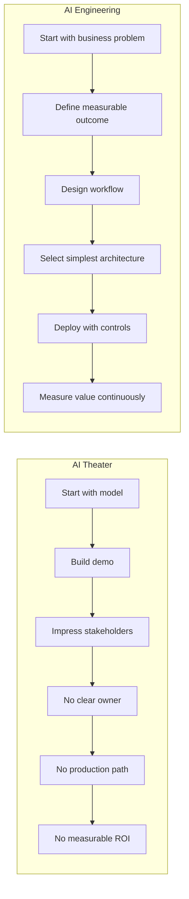

---

# 3. Who This Book Is For

This book is written for technical professionals who want to operate at the intersection of AI, architecture, engineering, and business.

The primary audience includes:

- senior software engineers
- AI engineers
- machine learning engineers
- data engineers
- cloud architects
- enterprise architects
- principal engineers
- engineering managers
- directors of engineering
- vice presidents of engineering
- CTOs
- product leaders
- technology consultants
- MBA students with technical backgrounds

This book assumes that the reader is serious.

You do not need to be a deep learning researcher.

You do not need a PhD.

You do not need to derive every equation behind transformer architecture from first principles.

But you should be willing to think deeply.

You should be willing to ask hard questions.

You should care about architecture.

You should care about operating systems in production.

You should care about business outcomes.

You should care about the difference between a clever prototype and a durable enterprise capability.

---

## Reader Personas

### Persona 1: The Senior Engineer Moving into AI Architecture

You know software engineering, APIs, databases, cloud services, and distributed systems. You now need to understand LLMs, RAG, agents, evaluation, and AI deployment patterns.

This book will help you move from implementation to architecture.

---

### Persona 2: The AI Engineer Moving into Enterprise Systems

You know models, embeddings, prompts, notebooks, and experimentation. You now need to understand security, scale, governance, cost, monitoring, and enterprise integration.

This book will help you move from model-centric thinking to platform-centric thinking.

---

### Persona 3: The Engineering Leader Driving AI Transformation

You manage teams. You own delivery. You need to decide where AI belongs, how to fund it, how to staff it, how to measure it, and how to explain it to executives.

This book will help you move from AI awareness to AI leadership.

---

### Persona 4: The CTO or Executive Sponsor

You do not need every code detail, but you need to understand what is real, what is hype, what creates business value, and what risks must be controlled.

This book will help you separate strategy from noise.

---

# 4. What Makes This Book Different

This book is intentionally different from a normal AI tutorial.

It is not organized around frameworks.

It is not organized around vendors.

It is not organized around certification domains alone.

It is organized around the work required to build production-grade enterprise AI systems.

Every topic is examined through five lenses:

1. **Science** — How does it work?
2. **Engineering** — How do we build it?
3. **Architecture** — How does it scale?
4. **Operations** — How do we run it safely?
5. **Business** — Why should anyone pay for it?

---

## Diagram: The Five-Lens Learning Model

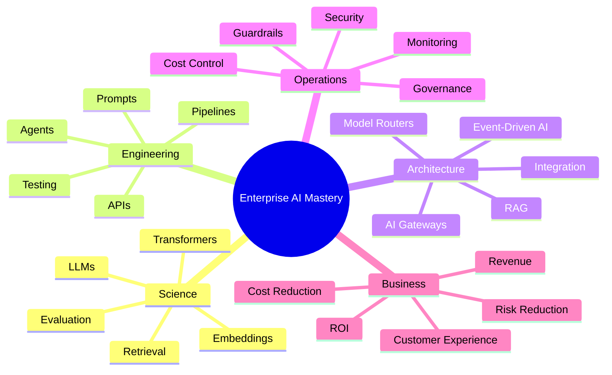

---

## The Book's Bias

This book has a bias.

It favors:

- clarity over hype
- production over demos
- measurable outcomes over novelty
- simple architectures over complex ones
- governance over uncontrolled autonomy
- workflow redesign over chatbot wrappers
- engineering discipline over tool enthusiasm
- executive value over technical vanity

That bias is intentional.

Enterprise AI fails less often because the model is weak and more often because the problem, process, data, ownership, architecture, and operating model are weak.

---

# 5. The Four Pillars of Enterprise AI Architecture

Enterprise AI architecture rests on four pillars.

These pillars appear throughout every chapter.

---

## Pillar 1: Business Value

AI must improve something that matters.

Common value categories include:

- revenue growth
- cost reduction
- risk reduction
- customer experience
- employee productivity
- operational resilience
- speed to market
- decision quality

A system that uses AI but does not improve a meaningful business metric is not a transformation. It is an experiment.

---

## Pillar 2: Technical Soundness

The system must be technically correct enough for the domain.

This includes:

- model selection
- data quality
- retrieval quality
- prompt design
- latency
- reliability
- security
- scalability
- integration
- observability
- testing

Technical soundness does not mean perfection. It means the system is fit for purpose.

---

## Pillar 3: Operational Readiness

The system must be supportable after launch.

Production AI requires:

- monitoring
- rollback
- incident response
- evaluation pipelines
- audit logs
- human escalation
- cost tracking
- model change control
- prompt versioning
- data lineage
- compliance controls

A system that cannot be operated safely should not be deployed broadly.

---

## Pillar 4: Human Accountability

AI can recommend, summarize, generate, classify, route, and assist.

But humans remain accountable for high-impact decisions.

The higher the business, financial, safety, medical, legal, or customer impact, the more important human oversight becomes.

---

## Diagram: Four Pillars of Enterprise AI

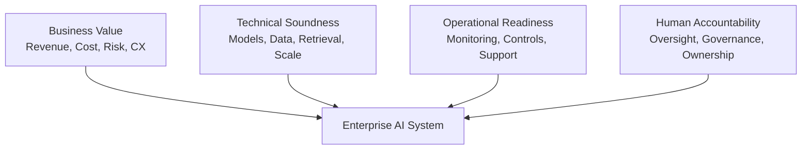

---

# 6. The AI Architect Mindset

An AI architect does not simply ask:

> "Which model should we use?"

An AI architect asks:

- What business decision are we improving?
- What workflow will change?
- What data is available?
- What data is missing?
- What does correctness mean?
- What happens when the model is wrong?
- What is the cost per decision?
- What is the latency requirement?
- What risks are introduced?
- What controls are required?
- What should remain deterministic?
- What should remain human-owned?
- What does success look like after 30, 90, and 180 days?

The AI architect is responsible for turning AI capability into enterprise capability.

This requires systems thinking.

---

## Diagram: AI Architect Decision Flow

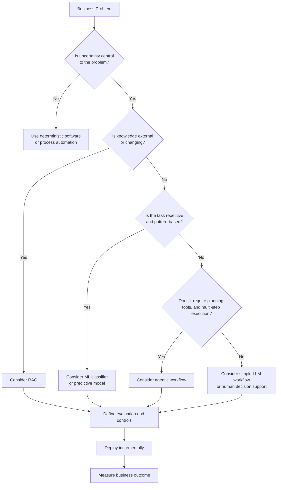

---

# 7. The Practitioner Mindset

A practitioner builds.

A practitioner experiments.

A practitioner tests.

A practitioner ships.

A practitioner understands that architecture without implementation becomes theory, and implementation without architecture becomes technical debt.

This book is not only about reading.

It is about building.

Each major section includes labs, exercises, diagrams, and capstone milestones.

The labs are not intended to be toy exercises only. They are designed to build intuition for production systems.

For example:

- A prompt lab teaches why prompt quality is not enough without evaluation.
- A RAG lab teaches why retrieval quality matters more than model size.
- An agent lab teaches why autonomy must be constrained.
- A Bedrock lab teaches how managed AI services change deployment tradeoffs.
- An observability lab teaches why AI systems need continuous measurement.
- A cost lab teaches why inference economics can make or break the business case.

---

## Practitioner Loop

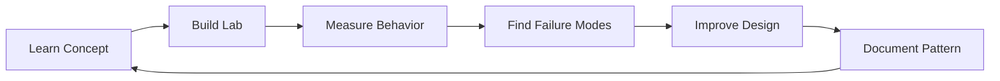

The practitioner does not stop at "it works."

The practitioner asks:

> "When does it fail, how badly does it fail, and how will we know?"

---

# 8. The Business Mindset

Enterprise AI is funded by business outcomes.

That means the architect must speak both technical and executive languages.

A technically elegant system that does not improve business performance will eventually lose support.

A business idea that cannot be engineered safely will eventually fail in production.

The best AI leaders connect both worlds.

---

## AI Business Value Equation

At a high level, AI value can be understood as:

```text
AI Value =
    Revenue Lift
  + Cost Reduction
  + Risk Reduction
  + Productivity Gain
  + Customer Experience Improvement
  - Implementation Cost
  - Operating Cost
  - Risk Cost
  - Change Management Cost
```

This equation is not meant to be mathematically perfect.

It is meant to force disciplined thinking.

Every AI initiative should identify which variables it improves and which costs it introduces.

---

## Diagram: AI Value Chain

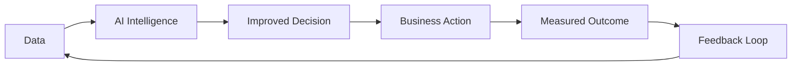

The value is not created by the model alone.

The value is created when intelligence improves a decision, the decision changes an action, and the action produces a measurable outcome.

---

# 9. How to Read This Book

This book can be read in several ways.

---

## Path 1: Front-to-Back Graduate Course

Read every chapter in order.

This is the best path if you want a complete conceptual foundation.

Recommended pace:

- 1 chapter per week for deep mastery
- 2 to 3 chapters per week for certification-oriented study
- 1 chapter per day for intensive bootcamp mode

---

## Path 2: AI Architect Track

Focus on:

- AI evolution
- LLM fundamentals
- RAG
- agentic AI
- architecture patterns
- security
- governance
- observability
- cost optimization
- case studies

This path is ideal for architects, directors, VPs, and CTOs.

---

## Path 3: Practitioner Track

Focus on:

- prompt engineering
- RAG implementation
- vector databases
- LangGraph
- MCP
- Bedrock
- Claude
- labs
- capstone project

This path is ideal for engineers who want to build.

---

## Path 4: Certification Track

Focus on chapters mapped to:

- AWS Certified AI Engineer — Professional
- Anthropic Claude architecture topics
- NVIDIA generative AI infrastructure topics

This path is ideal for credential preparation.

---

## Path 5: Executive Track

Focus on:

- business motivation
- architecture reviews
- ROI
- governance
- operating model
- case studies
- lessons from the field
- executive summaries

This path is ideal for senior leaders and executive sponsors.

---

# 10. How the Book Is Structured

The book is organized into major parts.

---

## Part I — Foundations of Modern AI

This part explains how AI evolved and why modern foundation models changed the software landscape.

Core chapters:

- Chapter 1 — The Evolution of Artificial Intelligence
- Chapter 2 — Large Language Models
- Chapter 3 — Prompt Engineering
- Chapter 4 — Embeddings and Semantic Representation

---

## Part II — Enterprise Generative AI

This part explains how LLMs are applied to enterprise knowledge, documents, data, and workflows.

Core chapters:

- Retrieval Augmented Generation
- Vector Databases
- Model Selection
- Evaluation
- Guardrails
- Knowledge Management

---

## Part III — Agentic AI

This part explains agents, tool use, planning, memory, orchestration, and human-in-the-loop workflows.

Core chapters:

- Agentic AI Fundamentals
- Agent Architecture Patterns
- LangGraph
- Multi-Agent Systems
- MCP
- Enterprise Tool Integration

---

## Part IV — Cloud AI Platforms

This part maps concepts to real cloud platforms.

Core chapters:

- Amazon Bedrock
- Bedrock Knowledge Bases
- Bedrock Agents
- Bedrock Guardrails
- Azure AI Foundry
- Google Vertex AI

---

## Part V — Claude and Modern AI Interfaces

This part examines Claude, tool use, MCP, extended thinking, and the emerging agent ecosystem.

Core chapters:

- Claude Architecture
- Tool Use
- MCP Servers
- Claude Code
- Enterprise Integration Patterns

---

## Part VI — NVIDIA and AI Infrastructure

This part examines the infrastructure layer behind modern AI.

Core chapters:

- GPU Fundamentals
- Inference Optimization
- TensorRT
- Triton
- NIM
- NeMo
- Kubernetes for AI Workloads
- AI Infrastructure Economics

---

## Part VII — Enterprise AI Architecture

This is the core architecture section.

Core chapters:

- AI Gateway
- Prompt Gateway
- Model Router
- Semantic Cache
- Event-Driven AI
- AI Service Mesh
- AI Microservices
- AI Security
- AI Governance
- AI Observability
- AI FinOps

### A Note on Responsible AI and Regulatory Frameworks

Enterprise AI architecture is no longer purely a technical discipline. Regulatory frameworks now directly shape how AI systems must be designed, documented, and governed.

Key frameworks every enterprise architect should be fluent in:

**EU AI Act** — Risk-based regulation that classifies AI systems into unacceptable risk (prohibited), high risk (conformity assessment, human oversight, documentation required), limited risk (transparency obligations), and minimal risk. High-risk categories include AI used in employment decisions, credit scoring, critical infrastructure, law enforcement, and biometric identification. Architects must understand which risk tier their systems fall into.

**NIST AI Risk Management Framework (AI RMF)** — A voluntary but widely adopted framework organized around four functions: Govern (accountability, policies, culture), Map (context, categorization, risk identification), Measure (analysis, testing, evaluation), and Manage (prioritize, respond, monitor). Many US federal agencies and their contractors now use the AI RMF as their operational baseline.

**ISO/IEC 42001** — The international standard for AI management systems. Defines requirements for establishing, implementing, and continually improving an AI management system within an organization.

These frameworks have a practical architectural implication: governance artifacts (data lineage, model cards, evaluation records, human oversight logs, incident reports) must be designed into systems from the beginning, not retrofitted after deployment.

---

## Part VIII — AI Engineering and Operations

This part focuses on production readiness.

Core chapters:

- AI Testing
- Evaluation Pipelines
- Prompt Versioning
- CI/CD for AI
- Monitoring
- Drift Detection
- Incident Response
- Human Escalation
- Auditability

---

## Part IX — AI Leadership

This part is designed for leaders.

Core chapters:

- AI Strategy
- Build vs Buy
- Vendor Selection
- AI Operating Model
- Team Design
- Portfolio Management
- ROI
- Executive Communication
- Risk Management

### AI Organizational Design

One of the most consequential leadership decisions in AI is how to organize for it.

Two primary models exist in practice:

**AI Center of Excellence (COE)** — A centralized team that owns AI strategy, shared platform infrastructure, model governance, evaluation standards, and regulatory compliance. Advantages include consistency, reuse, and clear accountability. Risks include bottlenecks and distance from business context.

**Embedded AI Teams** — AI engineers and architects embedded within product and domain teams, building AI directly in workflow context. Advantages include speed, domain depth, and business alignment. Risks include fragmented governance, duplicated platform work, and inconsistent standards.

Most mature enterprises converge on a **federated model**: a lightweight central platform team owns shared infrastructure (AI gateway, model registry, evaluation pipeline, observability, governance), while embedded teams build workflow-specific applications within platform guardrails.

This architecture decision has a direct parallel in AI platform design. The shared platform layer corresponds to the centralized components built in Parts VII and VIII. The federated application layer corresponds to the workflow-specific agents and assistants built using those platform capabilities.

---

## Part X — Capstone

The capstone integrates the entire book into one enterprise-grade platform.

---

# 11. The Learning Journey

This book is designed as a progression.

You begin with concepts.

You move into systems.

You then move into architecture.

Finally, you move into leadership.

---

## Diagram: Learning Progression

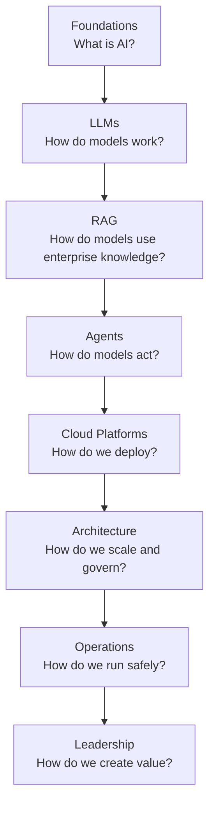

---

## Skill Progression

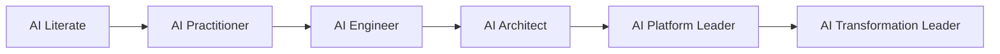

The goal is not only to understand AI.

The goal is to lead with AI.

---

# 12. The Capstone Project

The capstone project is the practical backbone of the book.

It will evolve chapter by chapter.

The working capstone is:

> **Enterprise Agentic Operations Platform**

This platform is inspired by real enterprise needs: operational intelligence, customer support, fleet health, revenue impact, service reliability, executive reporting, and workflow automation.

---

## Capstone Business Scenario

An enterprise operates a large distributed fleet of devices, assets, customers, services, or transactions.

The organization wants to use AI to:

- detect operational issues earlier
- reduce manual support effort
- improve customer response time
- summarize complex incidents
- recommend remediation actions
- estimate business impact
- support executive decision making
- improve productivity across engineering and operations

---

## Capstone Architecture

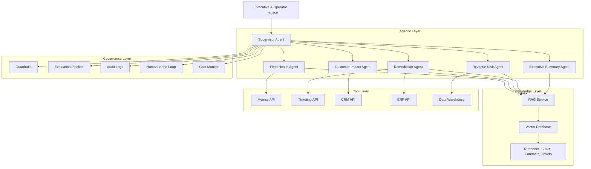

---

## Capstone Evolution by Chapter

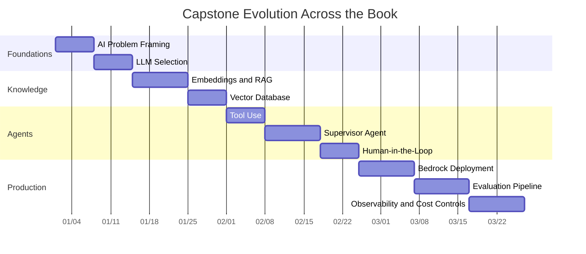

The dates in this diagram are placeholders. The important idea is progression: each chapter adds one production capability.

---

# 13. Certification Alignment

This book is broader than certification preparation, but it supports certification goals.

It maps to several major AI learning paths:

- AWS AI and Generative AI certifications
- Anthropic Claude architecture and MCP topics
- NVIDIA generative AI and infrastructure topics
- general enterprise AI architecture interviews
- Director, VP, CTO, and Field CTO discussions

---

## Certification Mapping Philosophy

Certifications are useful because they impose structure.

But certifications are not the destination.

The destination is competence.

This book treats certifications as checkpoints along the way.

---

## Diagram: Certification as Checkpoints

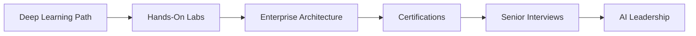

Passing a certification may help a resume.

Building and explaining a production-grade architecture helps a career.

---

# 14. Lessons from the Field

Every chapter includes a section called **Lessons from the Field**.

This is one of the most important parts of the book.

The reason is simple: enterprise AI is not only about concepts. It is about what survives real organizations.

---

## What "Lessons from the Field" Covers

Each chapter will include practical observations such as:

- what worked
- what did not work
- what failed in production
- what looked good in a demo but failed operationally
- what created real ROI
- what created hidden cost
- what executives misunderstood
- what engineers underestimated
- what governance teams required
- what customers actually cared about

---

## Diagram: Reality Filter

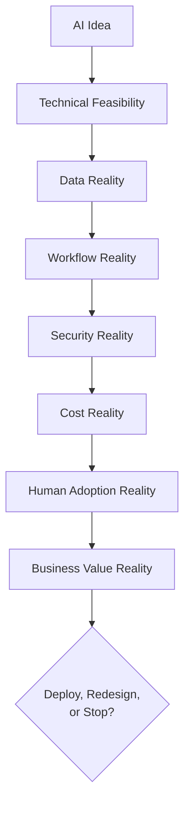

Many AI initiatives fail this filter.

That is not a bad thing.

Stopping a weak AI initiative early is good leadership.

---

# 15. Pratik's Principles

This book includes a recurring section called **Pratik's Principles**.

These principles are not slogans. They are operating rules for enterprise AI engineering.

---

## Principle 1: Start with the Business Problem

Never start with a model.

Start with the decision, workflow, metric, customer pain, operational bottleneck, or business risk.

---

## Principle 2: Use the Simplest Architecture That Works

Complexity is a tax.

Every agent, model, vector database, orchestration layer, API gateway, and cloud service must justify its existence.

---

## Principle 3: Deterministic Before Probabilistic

If deterministic logic solves the problem reliably, use deterministic logic.

Use AI where uncertainty, language, perception, scale, or ambiguity creates value.

---

## Principle 4: Retrieval Before Fine-Tuning

When enterprise knowledge changes frequently, retrieval is often more practical than fine-tuning.

Fine-tuning has value, but it is not the default answer for every knowledge problem.

---

## Principle 5: Evaluation Before Expansion

Do not scale an AI system until you can measure its quality.

Without evaluation, expansion creates unmanaged risk.

---

## Principle 6: Human Accountability for High-Impact Decisions

The more important the decision, the more important human oversight becomes.

---

## Principle 7: Cost Is Architecture

Inference cost, latency, data movement, storage, orchestration, observability, and support all shape architecture.

A design that ignores cost is incomplete.

---

## Principle 8: Trust Is Earned Through Behavior

Users do not trust AI because a vendor says it is accurate.

They trust AI when it consistently helps them do their work better.

---

## Principle 9: AI Is an Amplifier, Not a Strategy

AI amplifies data, workflows, decisions, teams, and operating models.

If those are weak, AI amplifies weakness.

---

## Principle 10: Every AI System Needs an Off Switch

Production AI must be controllable.

A system that cannot be paused, rolled back, overridden, or audited is not enterprise-ready.

---

# 16. What This Book Is Not

This book is not a hype book.

It will not claim that agents will replace every worker.

It will not claim that prompting is all you need.

It will not claim that one vendor solves every problem.

It will not claim that open source always wins.

It will not claim that proprietary models always win.

It will not treat benchmarks as business outcomes.

It will not confuse demos with production.

It will not teach AI as magic.

It will not ignore failure modes.

It will not avoid cost.

It will not avoid governance.

It will not avoid organizational reality.

---

## What This Book Will Do

It will teach you how to think.

It will teach you how to evaluate.

It will teach you how to design.

It will teach you how to build.

It will teach you how to explain.

It will teach you how to lead.

---

# 17. How to Use This Book for Career Growth

This book can become more than a study resource.

It can become a career platform.

For senior technical professionals, the market increasingly rewards people who can connect:

- AI depth
- software engineering
- cloud architecture
- enterprise modernization
- business value
- executive communication

This book is designed to help you build that profile.

---

## Career Assets Produced by This Book

As you work through the book, you should produce:

- architecture diagrams
- GitHub labs
- capstone project
- certification notes
- interview answers
- executive memos
- case studies
- ROI models
- technology comparison matrices
- design decision records
- reusable reference architectures

These assets become evidence.

They show how you think.

They show how you design.

They show how you lead.

---

## Diagram: Learning to Career Signal


---

# 18. How to Use This Book for Enterprise Transformation

For organizations, this book can serve as a blueprint for AI transformation.

The chapters can be used to create:

- internal AI bootcamps
- architecture review checklists
- AI project intake frameworks
- governance models
- platform roadmaps
- engineering standards
- AI operating models
- leadership workshops

---

## Enterprise AI Transformation Flow

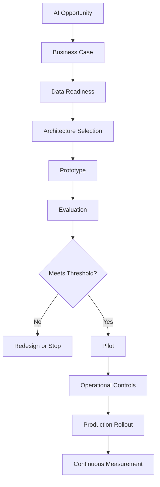

This process is intentionally conservative.

Enterprise AI should move fast, but not blindly.

---

# 19. GitHub-First Publishing Model

This book is designed to be published incrementally on GitHub.

That means:

- chapters are written in Markdown
- diagrams use Mermaid where possible
- labs are version-controlled
- issues track chapter improvements
- pull requests support review
- releases mark stable versions
- community feedback improves the work over time

---

## Recommended Repository Structure

```text
ai-architect-bootcamp/
│
├── README.md
├── LICENSE
├── ROADMAP.md
├── CONTRIBUTING.md
├── CHANGELOG.md
│
├── chapters/
│   ├── 00-preface.md
│   ├── 01-evolution-of-ai.md
│   ├── 02-large-language-models.md
│   ├── 03-prompt-engineering.md
│   ├── 04-retrieval-augmented-generation.md
│   ├── 05-vector-databases.md
│   ├── 06-model-selection.md
│   ├── 07-agentic-ai-fundamentals.md
│   ├── 08-agent-architecture-patterns.md
│   ├── 09-langgraph.md
│   ├── 10-model-context-protocol.md
│   └── ...
│
├── diagrams/
├── labs/
├── code/
├── capstone/
├── case-studies/
├── certification-mapping/
└── references/
```

---

## Recommended Chapter Status Model

Each chapter should have a status field:

```text
Planned → Draft → In Review → Complete Draft → Published
```

This allows the book to evolve transparently.

---

## Recommended Commit Pattern

Use clear commit messages:

```bash
git commit -m "Add Chapter 0 preface"
git commit -m "Add Chapter 1 evolution of AI"
git commit -m "Add RAG architecture diagram"
git commit -m "Add LangGraph lab scaffold"
```

The repository should read like a professional engineering project.

---

# 20. Final Word Before Chapter 1

AI is moving quickly.

Models will change.

Frameworks will change.

Cloud services will change.

Certifications will change.

But the deeper disciplines will remain:

- understand the problem
- understand the data
- understand the workflow
- choose the right architecture
- build reliable systems
- measure outcomes
- control risk
- manage cost
- earn trust
- lead change

That is what this book is about.

This book begins with the evolution of AI because every modern architecture decision is easier to understand when you know why previous approaches emerged, succeeded, failed, and evolved.

The journey starts with a simple question:

> Why did AI evolve from rules to models, from models to deep learning, from deep learning to foundation models, and from foundation models to agents?

That is the focus of Chapter 1.

---

# Preface Summary

This preface established the purpose, audience, philosophy, structure, and operating principles of **The AI Architect & Practitioner Bootcamp**.

The book is designed to help technical professionals and leaders build production-grade AI systems that create measurable enterprise value.

It is not a vendor manual.

It is not a hype guide.

It is not only a certification guide.

It is a practical, architecture-driven, business-aware, GitHub-first textbook for the next generation of AI architects and practitioners.

---

# Suggested GitHub Commit

```bash
git add chapters/00-preface.md
git commit -m "Add Chapter 0: Preface"
git push origin main
```

---

# Suggested Next Chapter

[Chapter 1 — The Evolution of Artificial Intelligence](./01-evolution-of-ai.md)

