# Chapter 1 — The Evolution of Artificial Intelligence

**Book:** The AI Architect & Practitioner Bootcamp  
**Subtitle:** A Graduate-Level Guide to Enterprise AI, Agentic Systems, and Production AI Engineering  
**Author:** Pratik Desai  
**Version:** 1.0  
**Status:** Complete Draft  
**Last Updated:** 2026-06-26  

---

## Chapter Purpose

Artificial intelligence is often discussed through the lens of models, benchmarks, and tools. That view is incomplete. For enterprise architects, engineering leaders, and practitioners, AI must be understood as an evolving engineering discipline whose purpose is to improve decisions, automate complex work, and create measurable business value.

This chapter establishes the foundation for the rest of the book. It explains how AI evolved from symbolic rule-based systems to modern agentic systems, why each generation emerged, what engineering problems it solved, and what new problems it introduced.

The objective is not to memorize AI history. The objective is to understand the architectural tradeoffs behind each generation of AI so that you can make better design decisions in real enterprise systems.

---

## Learning Objectives

By the end of this chapter, you should be able to:

- Explain why artificial intelligence exists as an engineering and business discipline.
- Differentiate symbolic AI, expert systems, machine learning, deep learning, foundation models, generative AI, and agentic AI.
- Describe the strengths, weaknesses, and failure modes of each AI generation.
- Understand why transformers and foundation models changed software architecture.
- Explain why agentic AI is not merely “chatbot plus tools,” but a new execution pattern for enterprise workflows.
- Recognize when deterministic systems are preferable to AI systems.
- Discuss AI initiatives using business language: revenue, cost, risk, customer experience, productivity, and time-to-market.
- Apply “Lessons from the Field” to avoid common enterprise AI mistakes.
- Frame AI strategy for engineering, architecture, and executive audiences.

---

## Target Audience

This chapter is written for:

- Software engineers moving into AI engineering.
- Data scientists who need enterprise architecture context.
- Cloud architects learning generative AI.
- Engineering managers and directors responsible for AI delivery.
- Product leaders evaluating AI-enabled capabilities.
- CTOs and enterprise architects accountable for AI strategy.
- MBA or graduate students studying the business impact of AI.

---

## Prerequisites

You do not need to be a machine learning expert to understand this chapter. Helpful background includes:

- Basic programming concepts.
- Basic probability and statistics.
- Familiarity with enterprise software systems.
- Familiarity with cloud platforms.
- Awareness of data pipelines, APIs, and operational systems.

---

## Executive Summary

Artificial intelligence has evolved through several major eras:

1. **Symbolic AI** encoded human knowledge as rules.
2. **Expert systems** attempted to commercialize rule-based expertise.
3. **Machine learning** shifted from manually coded rules to patterns learned from data.
4. **Deep learning** reduced manual feature engineering and enabled breakthroughs in vision, speech, and language.
5. **Transformers** introduced a scalable architecture for sequence modeling and language understanding.
6. **Foundation models** generalized AI capability across many tasks using large-scale pretraining.
7. **Generative AI** made AI accessible through natural language interfaces.
8. **Agentic AI** connects reasoning, planning, memory, tools, and execution into goal-oriented systems.

Each era solved limitations of the previous era but introduced new challenges. Symbolic systems were explainable but brittle. Machine learning was adaptive but dependent on data quality. Deep learning was powerful but expensive and opaque. Foundation models are flexible but difficult to control. Agentic systems can automate complex workflows but require strong governance, observability, safety, and human accountability.

The central principle of this book is:

> AI is not about building the smartest model. AI is about solving the right business problem with the simplest architecture that delivers measurable value.

Enterprise AI architecture must therefore balance four dimensions:

- **Science:** How does the model or system work?
- **Engineering:** How do we build and operate it reliably?
- **Architecture:** How does it scale, integrate, and fail safely?
- **Business:** Why should anyone pay for it?

---

## 1.1 Why AI Exists

Every major technology revolution amplifies a human capability.

| Technology Era | Human Capability Amplified |
|---|---|
| Mechanical systems | Physical labor |
| Electricity | Industrial production |
| Computers | Arithmetic and logic |
| Databases | Memory and record keeping |
| Networks | Communication |
| Cloud computing | Software delivery and scalability |
| Artificial intelligence | Decision making under uncertainty |

Artificial intelligence exists because many real-world business problems cannot be solved cleanly with deterministic rules.

Consider these questions:

- Which customer is likely to churn?
- Which transaction is fraudulent?
- Which machine is likely to fail?
- Which insurance claim looks suspicious?
- Which patient is at risk?
- Which product should be recommended?
- Which support ticket should be escalated?
- Which document contains the answer to a user's question?

These problems share common characteristics:

- The inputs are incomplete.
- The environment changes over time.
- The rules are difficult to write manually.
- Historical patterns matter.
- There is uncertainty.
- The cost of being wrong varies by context.

Classical software is excellent when rules are known and stable. AI is useful when rules are unknown, too complex, or changing.

This distinction is fundamental.

A payroll system should not be probabilistic. A tax calculation should not hallucinate. A payment authorization workflow should not randomly invent a response. Deterministic systems are ideal when correctness can be explicitly defined.

AI is useful when the enterprise must make useful decisions despite ambiguity.

---

## 1.2 The Intelligence Spectrum

Enterprise systems exist on a spectrum from deterministic logic to adaptive intelligence.

| Level | System Type | Behavior | Example | Best Use |
|---|---|---|---|---|
| 1 | Fixed rules | Deterministic | Tax calculator | Stable rules |
| 2 | Rule engine | Configurable logic | Eligibility rules | Business policy |
| 3 | Statistical model | Probabilistic pattern recognition | Forecasting | Historical patterns |
| 4 | Machine learning | Learned decision boundaries | Fraud detection | Complex signals |
| 5 | Deep learning | Representation learning | Image classification | Unstructured data |
| 6 | Foundation model | General-purpose reasoning and generation | LLM assistant | Language, reasoning, summarization |
| 7 | Agentic system | Goal-oriented planning and action | AI operations assistant | Multi-step workflows |

The mistake many organizations make is jumping to level 6 or 7 when level 1 or 2 would solve the problem more reliably and cheaply.

### Core Architectural Principle

> Use the lowest level of intelligence that solves the business problem reliably.

This principle will appear throughout the book.

---

## 1.3 Symbolic AI: The Era of Explicit Knowledge

Symbolic AI was built on the belief that intelligence could be represented using symbols, logic, and rules. If human experts could explain how they reached conclusions, engineers could encode those explanations into software.

A symbolic AI system typically includes:

- **Facts:** Known information about the world.
- **Rules:** Logic that operates on facts.
- **Inference engine:** Mechanism that applies rules to derive conclusions.
- **Knowledge base:** Structured repository of facts and rules.

Example:

```text
IF customer_age > 65
AND blood_pressure > 140
AND cholesterol_level = high
THEN classify_patient_risk = high
```

This approach is easy to understand. It is also easy to audit. That is why symbolic systems remain useful in regulated environments where transparency matters.

### Strengths

- Highly explainable.
- Deterministic.
- Auditable.
- Easy to test for known cases.
- Useful for compliance-driven workflows.

### Weaknesses

- Brittle when the environment changes.
- Hard to scale as rules multiply.
- Expensive to maintain.
- Poor at handling ambiguity.
- Dependent on expert knowledge capture.
- Weak with unstructured data such as images, speech, and natural language.

### Enterprise Example

A connected device estate may use deterministic rules for device configuration:

```text
IF merchant_country = "US"
AND payment_network = "Visa"
AND device_type = "Android POS"
THEN enable_contactless_limit_profile = "US_STANDARD"
```

This is not a machine learning problem. It is a rules and configuration problem.

However, predicting which device is likely to fail next may require AI because the signals are noisy and probabilistic.

---

## 1.4 Expert Systems: Commercializing Human Expertise

Expert systems attempted to package human expertise into software. They became prominent in domains such as:

- Medical diagnosis.
- Equipment troubleshooting.
- Insurance underwriting.
- Manufacturing configuration.
- Financial advisory systems.
- Technical support.

The architecture was usually straightforward:

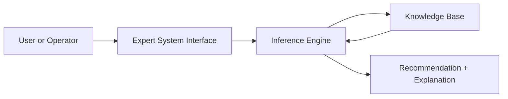

Expert systems demonstrated that software could assist specialized decision making. Their commercial promise was significant: capture scarce expert knowledge once and reuse it many times.

But the operational reality was difficult.

As business rules changed, regulations evolved, products changed, and edge cases accumulated, knowledge bases became hard to maintain. A system with hundreds of rules was manageable. A system with tens of thousands of interacting rules became fragile.

### The Knowledge Engineering Bottleneck

The largest challenge was not computation. It was knowledge capture.

Experts often make decisions based on tacit knowledge. They may know what to do but struggle to express every decision rule explicitly. Even when they can explain their reasoning, real-world exceptions multiply quickly.

This created a bottleneck:

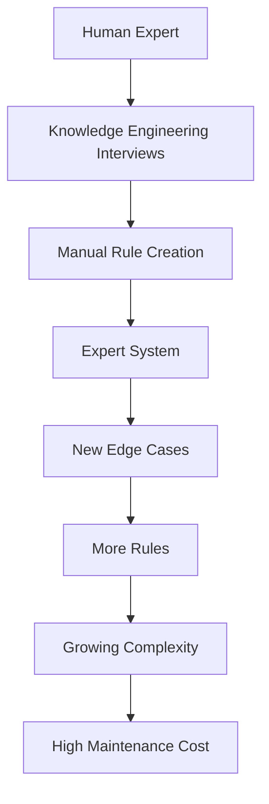

### Lesson

Expert systems worked best when the domain was narrow, stable, and explainable. They struggled when the world was dynamic, uncertain, and data-rich.

---

## 1.5 Machine Learning: Letting Data Speak

Machine learning changed the fundamental approach.

Instead of manually writing every rule, engineers provided data and allowed algorithms to learn patterns.

Traditional programming:

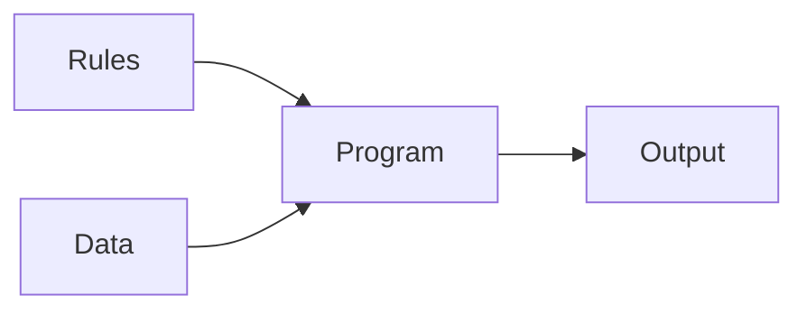

Machine learning:

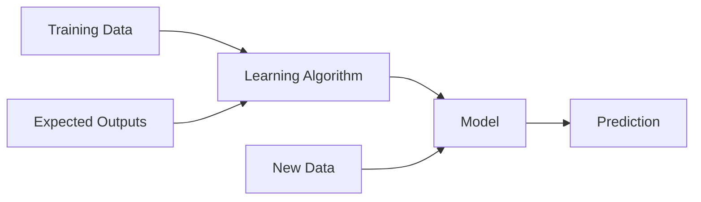

This shift was profound.

Machine learning allowed systems to solve problems where explicit rules were too complex to write manually.

Examples:

- Fraud detection.
- Demand forecasting.
- Spam filtering.
- Predictive maintenance.
- Churn prediction.
- Recommendation systems.
- Credit risk scoring.

### Feature Engineering

Early machine learning depended heavily on feature engineering. Humans had to decide what signals mattered.

For fraud detection, features might include:

- Transaction amount.
- Merchant category.
- Customer location.
- Time of day.
- Historical spending pattern.
- Device fingerprint.
- Velocity of recent transactions.

Feature engineering was powerful but labor-intensive. The quality of the model often depended more on feature design than on the algorithm itself.

### Strengths

- Learns from historical data.
- Handles probabilistic problems.
- Can improve with more data.
- Useful for prediction and classification.
- Better than rules when patterns are complex.

### Weaknesses

- Requires high-quality data.
- Can learn bias from historical data.
- Can drift over time.
- Often less explainable than rules.
- Requires monitoring and retraining.
- Performance depends heavily on feature quality.

### Enterprise Architecture Pattern

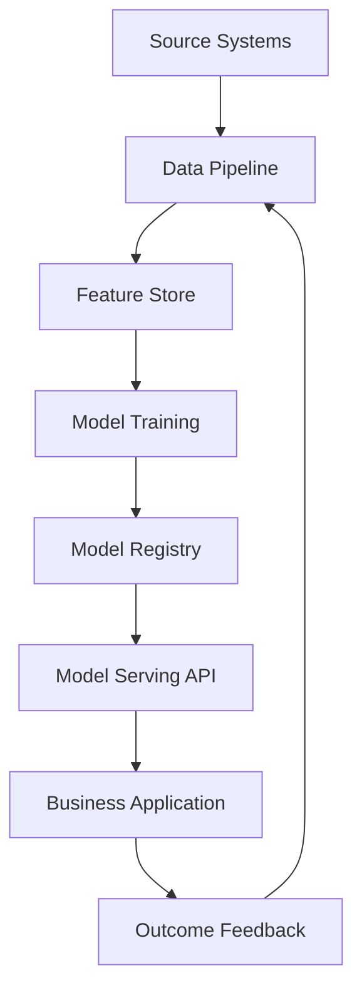

This pattern remains foundational in modern AI engineering.

---

## 1.6 Deep Learning: Representation Learning at Scale

Deep learning reduced the need for manual feature engineering by allowing neural networks to learn representations directly from data.

This mattered especially for unstructured data:

- Images.
- Audio.
- Video.
- Natural language.
- Sensor streams.
- Clickstream behavior.

A traditional ML model might require humans to design image features such as edges, corners, textures, or shapes. A deep neural network can learn hierarchical representations automatically.

### Why Deep Learning Was Different

Deep learning systems learn multiple layers of abstraction.

For image recognition:

| Layer | Learned Representation |
|---|---|
| Early layers | Edges, colors, textures |
| Middle layers | Shapes, patterns |
| Later layers | Objects, scenes, concepts |

For language:

| Layer | Learned Representation |
|---|---|
| Early layers | Tokens and syntax |
| Middle layers | Phrases and relationships |
| Later layers | Meaning and intent |

### Strengths

- Excellent for unstructured data.
- Reduces manual feature engineering.
- Scales with data and compute.
- Enables breakthroughs in vision, speech, and language.
- Learns rich representations.

### Weaknesses

- Requires large datasets.
- Compute intensive.
- Less explainable.
- Can be difficult to debug.
- Requires specialized infrastructure.
- Can overfit or fail silently.

### Enterprise Impact

Deep learning enabled practical use cases that previously performed poorly:

- Automated document extraction.
- Defect detection from images.
- Voice assistants.
- Speech-to-text.
- Natural language classification.
- Computer vision inspection.
- Predictive maintenance using sensor patterns.

But deep learning also introduced a new enterprise challenge: infrastructure cost. Training and serving large models requires careful planning around GPUs, latency, throughput, scaling, and cost optimization.

---

## 1.7 Transformers: The Architecture That Changed AI

Before transformers, many language systems relied on recurrent neural networks or sequence models that processed text step by step. These models struggled with long-range dependencies and were difficult to parallelize.

Transformers introduced an architecture based on attention. Instead of processing language strictly sequentially, a transformer can learn relationships between tokens across a sequence.

At a high level, attention asks:

> Which parts of the input should the model focus on when producing the next representation or output?

### Why Attention Matters

In the sentence:

> The technician replaced the battery because it was failing.

A model must infer that “it” likely refers to “battery,” not “technician.” Attention mechanisms help models learn these relationships.

### Simplified Transformer Flow

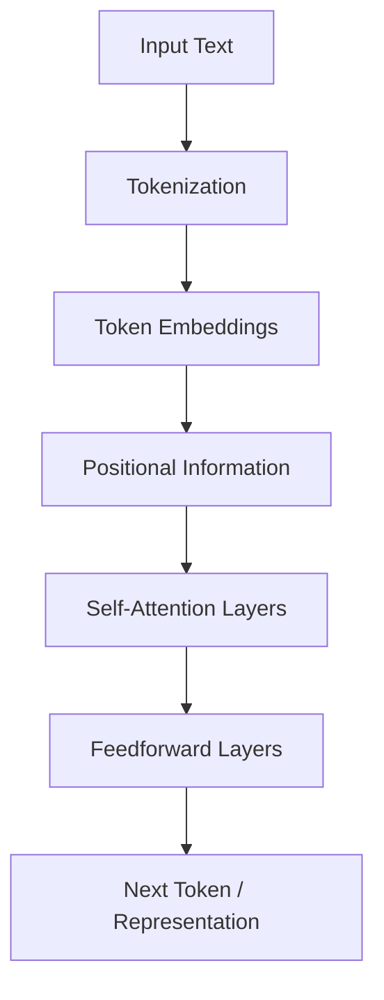

### Why Transformers Scaled

Transformers became dominant because they:

- Handle long-range dependencies better than older sequence models.
- Parallelize efficiently on modern hardware.
- Scale well with more data and compute.
- Support pretraining on massive text corpora.
- Generalize across many language tasks.

### Enterprise Significance

Transformers changed software because natural language became a programmable interface. Instead of forcing users to adapt to rigid software screens, AI systems could begin adapting to human language.

This enabled:

- Summarization.
- Question answering.
- Code generation.
- Document analysis.
- Conversational interfaces.
- Knowledge assistants.
- Agentic workflows.

---

## 1.8 Foundation Models: From Task-Specific AI to General Capability

Before foundation models, most AI systems were built for specific tasks.

A company might train one model for churn prediction, another for sentiment analysis, another for document classification, and another for product recommendations.

Foundation models changed this pattern. A large model pretrained on broad data can be adapted to many downstream tasks through prompting, retrieval, fine-tuning, or tool use.

### Traditional AI Pattern

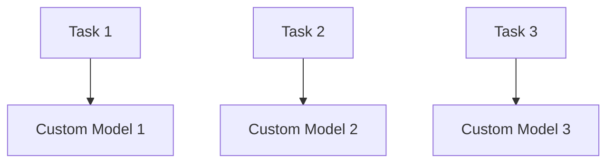

### Foundation Model Pattern

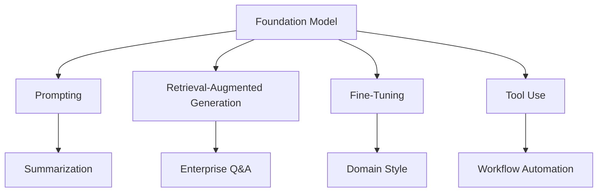

### Why This Matters

Foundation models shift the enterprise AI conversation from “Can we train a model?” to “How do we safely and economically apply a general model to business workflows?”

This changes the required architecture.

Modern AI systems need:

- Model gateways.
- Prompt management.
- Retrieval pipelines.
- Vector databases.
- Evaluation frameworks.
- Guardrails.
- Observability.
- Cost controls.
- Human-in-the-loop workflows.
- Governance and auditability.

---

## 1.9 Generative AI: AI Becomes a User Interface

Generative AI refers to systems that produce new content, including:

- Text.
- Code.
- Images.
- Audio.
- Video.
- Structured data.
- Plans.
- Summaries.
- Recommendations.

The breakthrough for enterprises was not only that models became better. It was that AI became usable through natural language.

A business user can ask:

> Summarize the top customer escalations this week and identify which accounts are at risk.

A developer can ask:

> Generate a Python function to parse this device telemetry format.

An operations manager can ask:

> Explain why these five terminals are likely to fail in the next 48 hours.

This turns AI into a new interaction layer across enterprise systems.

### Generative AI Enterprise Stack

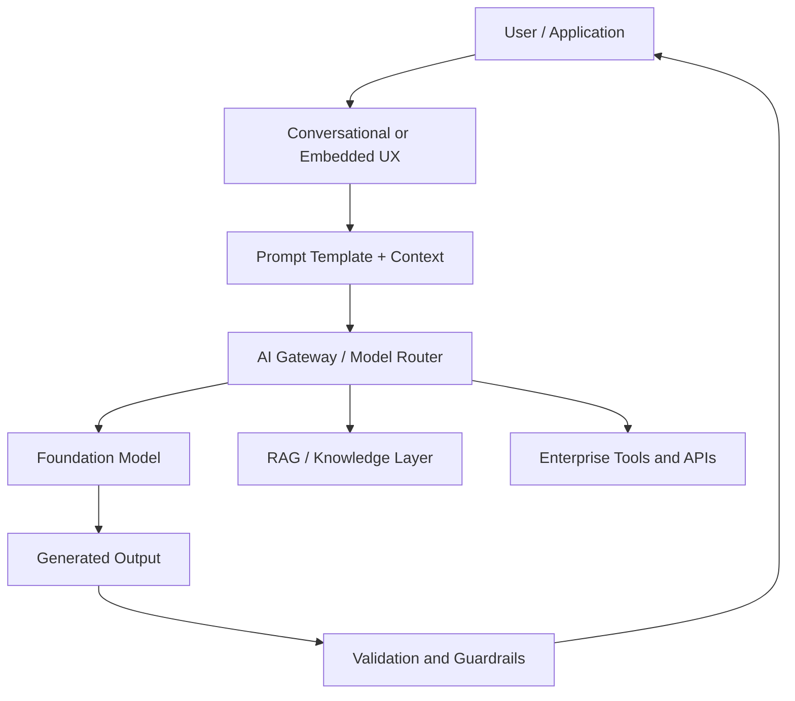

### Strengths

- Natural language interface.
- Rapid prototyping.
- Strong summarization and drafting.
- Useful for knowledge work.
- Can reason across broad context.
- Reduces friction between users and systems.

### Weaknesses

- Hallucination risk.
- Output variability.
- Harder testing.
- Prompt sensitivity.
- Data leakage risk.
- Cost can grow quickly.
- Governance is complex.

### Important Distinction

Generative AI is not automatically enterprise AI.

A chatbot over documents is not a transformation strategy. Enterprise value emerges when generative AI is connected to business workflows, trusted data, measurable KPIs, and accountable decision processes.

---

## 1.10 Agentic AI: From Answers to Actions

Agentic AI extends generative AI by adding goal-directed behavior.

A traditional LLM application responds to a prompt. An agentic system can plan, call tools, inspect results, update state, ask for human approval, and continue working toward a goal.

### Basic Agent Loop

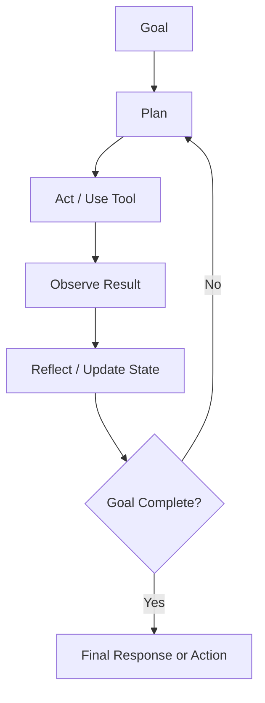

### Agentic AI Capabilities

Agentic systems may include:

- Planning.
- Tool use.
- Memory.
- Reflection.
- Workflow orchestration.
- Multi-agent collaboration.
- Human approval.
- Long-running execution.
- Context management.
- Error recovery.

### Enterprise Example: Fleet Operations Agent

Imagine a fleet operations platform managing millions of devices.

A non-agentic AI assistant might answer:

> These devices show abnormal heartbeat patterns.

An agentic AI system might:

1. Detect abnormal heartbeat patterns.
2. Retrieve device history.
3. Check recent software deployments.
4. Compare against known incident patterns.
5. Estimate customer impact.
6. Create a remediation plan.
7. Open a ticket.
8. Notify the support team.
9. Ask a human operator for approval before executing a restart.
10. Track the outcome.

That is a different architecture.

### Agentic Enterprise Architecture

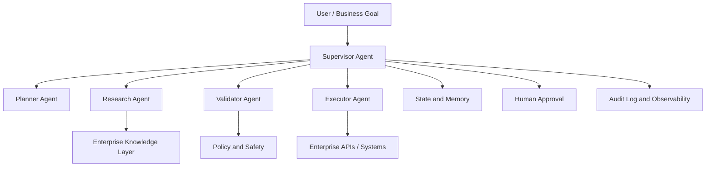

### Why Agentic AI Is Hard

Agentic AI introduces risks beyond ordinary chatbots:

- Agents may take incorrect actions.
- Tool calls can mutate production systems.
- Multi-step reasoning can compound errors.
- Testing paths multiply.
- Costs can be unpredictable.
- Human approval boundaries must be clear.
- State management becomes critical.
- Observability is mandatory.

### Architectural Principle

> Agents should not be given authority before they have earned trust.

Start with read-only agents. Then move to recommendation agents. Then human-approved action agents. Only after extensive validation should limited autonomous action be considered.

---

## 1.11 Comparing AI Generations

| Generation | Core Idea | Best For | Main Weakness | Enterprise Risk |
|---|---|---|---|---|
| Symbolic AI | Encode rules | Stable policies | Brittle | Rule explosion |
| Expert Systems | Capture expertise | Narrow expert domains | Maintenance | Knowledge bottleneck |
| Machine Learning | Learn from data | Prediction | Data quality | Drift and bias |
| Deep Learning | Learn representations | Unstructured data | Compute cost | Opaqueness |
| Transformers | Attention at scale | Language and sequence tasks | Resource intensive | Misuse and overtrust |
| Foundation Models | General pretrained models | Many tasks | Control and grounding | Hallucination |
| Generative AI | Produce content | Knowledge work | Variability | Data leakage |
| Agentic AI | Plan and act | Complex workflows | Governance | Unsafe automation |

---

## 1.12 When Not to Use AI

A mature AI architect must know when not to use AI.

Do not use AI when:

- The rule is simple and deterministic.
- The cost of error is unacceptable.
- There is no reliable data.
- The process lacks clear ownership.
- The business metric is undefined.
- The output cannot be validated.
- The organization cannot monitor or govern the system.
- A simpler automation would deliver the same outcome.
- The workflow requires strict regulatory traceability that the AI system cannot provide.

### Examples

| Problem | Better Approach |
|---|---|
| Calculate tax | Deterministic code |
| Enforce password policy | Rule engine |
| Route request by exact category | Rules or lookup table |
| Generate legal final decision | Human expert with AI assistance |
| Execute production restart automatically | Human-approved workflow |
| Summarize support tickets | Generative AI |
| Predict device failure | Machine learning |
| Answer policy questions from documents | RAG |
| Coordinate multi-step remediation | Agentic workflow with guardrails |

### Pratik's Principle

> Start deterministic. Add intelligence only where uncertainty creates value.

---

## 1.13 Enterprise AI Value Chain

AI creates enterprise value only when model capability connects to business outcomes.

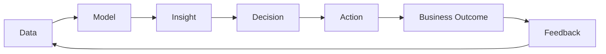

Many AI pilots fail because they stop at insight.

An insight without action is a report. A prediction without workflow integration is a dashboard. A chatbot without ownership is a novelty.

Enterprise AI must close the loop from data to outcome.

### Business Outcome Categories

| Category | Example AI Impact |
|---|---|
| Revenue | Better recommendations, higher conversion |
| Cost | Automation, reduced support burden |
| Risk | Fraud detection, compliance monitoring |
| Customer Experience | Faster support, personalization |
| Productivity | Faster document work, developer acceleration |
| Resilience | Predictive maintenance, incident prevention |
| Speed | Faster analysis and decision cycles |

---

## 1.14 Architecture Evolution: From Applications to AI Platforms

Traditional enterprise applications were built around deterministic workflows:

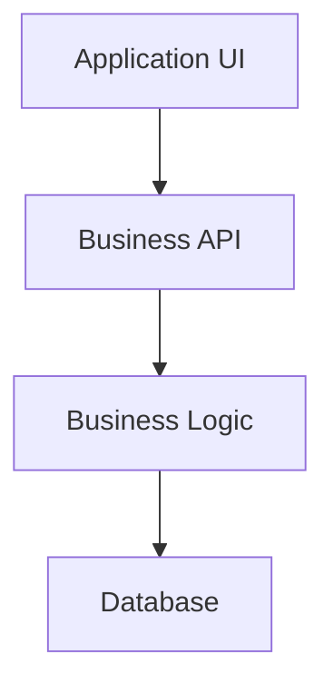

Modern AI platforms introduce probabilistic components:

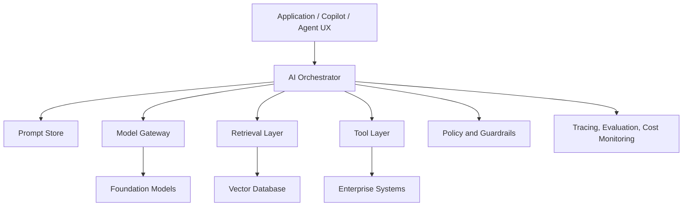

This is why AI architecture is not merely model selection. It is system design.

A production AI platform must answer:

- Which models are allowed?
- Which data sources are trusted?
- Who can access what?
- How are prompts versioned?
- How are outputs evaluated?
- How are hallucinations detected?
- How is cost monitored?
- What happens when the model fails?
- Who approves high-impact actions?
- How are decisions audited?

---

## 1.15 The AI Architect's Mental Model

An AI architect must operate across multiple layers.

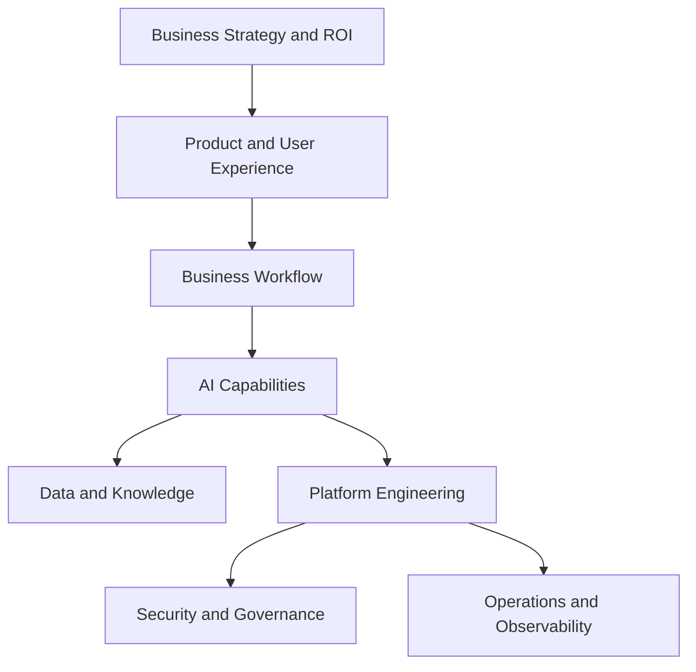

The architect must translate between executives, product teams, engineers, data scientists, security teams, compliance teams, and operations.

This requires more than technical knowledge. It requires judgment.

---

## 1.16 The Next Decade of AI

The next decade will likely be defined by several trends.

### 1. AI Moves from Chat to Workflow

The first wave of generative AI focused on chat interfaces. The next wave will focus on embedded AI inside business processes.

### 2. Agents Become Enterprise Workers

Agents will not replace entire organizations. They will become digital workers embedded into specific workflows, such as:

- Support triage.
- Procurement analysis.
- Software maintenance.
- Sales research.
- Incident investigation.
- Compliance review.
- Fleet operations.
- Financial analysis.

### 3. Model Choice Becomes Dynamic

Enterprises will use multiple models. Model routing will choose the right model based on task, cost, latency, data sensitivity, and quality requirements.

### 4. Evaluation Becomes a Core Discipline

AI systems cannot be managed by demos. Evaluation, testing, monitoring, and feedback loops will become essential engineering practices.

### 5. AI Governance Becomes Board-Level

As AI systems influence decisions and actions, governance will become central to risk management.

Regulatory frameworks are already shaping enterprise AI strategy:

**EU AI Act** — The European Union's AI Act (entered into force 2024) establishes a risk-based regulatory framework for AI systems. High-risk AI — including systems used in employment, credit, law enforcement, and critical infrastructure — requires conformity assessments, transparency obligations, human oversight, and post-market monitoring. Enterprises with EU operations or EU customers must understand their obligations under this framework.

**NIST AI Risk Management Framework (AI RMF)** — The US National Institute of Standards and Technology published the AI RMF (2023) as a voluntary framework for managing AI risk across four functions: Govern, Map, Measure, and Manage. Many enterprises and government agencies are using the AI RMF as their operational governance baseline.

**Emerging frameworks** — Canada's Artificial Intelligence and Data Act (AIDA), the UK's sector-led AI governance approach, and ISO/IEC 42001 (AI Management System Standard) are all shaping how enterprises design, document, and audit AI systems.

For enterprise architects, this means governance is not an afterthought. Regulatory risk belongs in architecture decisions from day one.

### 6. AI Organizational Design Becomes a Discipline

Enterprises will increasingly ask: how do we organize to build, deploy, and govern AI?

Two dominant patterns are emerging:

**AI Center of Excellence (COE)** — A centralized team that owns AI strategy, shared platforms, model governance, evaluation standards, tooling, and regulatory compliance. Advantages include consistency and reuse. Risks include bottlenecks and distance from business workflows.

**Embedded AI Teams** — AI engineers embedded inside product and domain teams, building closer to the workflow. Advantages include speed and context. Risks include fragmented governance and duplicated platform work.

Most mature enterprises adopt a **hybrid model**: a lightweight COE sets standards, owns the shared AI platform, and handles governance, while embedded teams build use-case applications within those guardrails.

AI architects are increasingly responsible for platform design choices that enable this hybrid model — shared model gateways, evaluation pipelines, observability infrastructure, and governance tooling that embedded teams can self-serve against.

### 7. Cost Optimization Becomes Strategic

Inference cost, GPU usage, token consumption, caching, and model selection will become part of AI FinOps.

### 8. Human Accountability Remains Essential

The best enterprises will not blindly automate everything. They will design human-AI systems where accountability is explicit.

---

## 1.17 Lessons from the Field

This section is intentionally practical. It captures field lessons that are often missing from academic and certification material.

### What Worked

#### 1. Business-first AI initiatives

Projects worked best when the business objective was clear before model selection.

Examples:

- Reduce false positive alerts.
- Lower support ticket volume.
- Improve first-call resolution.
- Reduce device downtime.
- Increase conversion.
- Improve fraud detection.
- Reduce manual review time.

When the goal was measurable, the architecture could be evaluated objectively.

#### 2. Human-in-the-loop workflows

AI adoption improved when humans remained accountable for important decisions. Operators trusted AI more when they could inspect evidence, override recommendations, and provide feedback.

#### 3. Narrow use cases

The best early AI projects were narrow, high-value, and operationally grounded. A focused support summarization tool often delivers more value than a broad “enterprise brain” initiative.

#### 4. Simple architectures

Simple architectures were easier to explain, secure, monitor, and maintain. Complexity only paid off when it directly improved business outcomes.

#### 5. Operational feedback loops

AI systems improved when outcomes were captured and fed back into the system. Without feedback, AI quality stagnated.

---

### What Did Not Work

#### 1. Starting with “we need AI”

This usually led to unfocused proofs of concept. A better starting point is:

> Which business decision or workflow is slow, expensive, risky, or inconsistent?

#### 2. Treating AI as a feature

AI is not just a UI feature. It must be integrated into data, workflow, operations, support, security, and governance.

#### 3. Ignoring data ownership

Many AI projects fail because no one owns the source data, documents are outdated, permissions are unclear, or the system retrieves untrusted content.

#### 4. Optimizing model metrics while ignoring business metrics

A model can improve offline accuracy while failing to improve the business. The real question is not whether the model is impressive. The real question is whether the business outcome improves.

#### 5. Over-automating too early

Autonomous action before trust is established creates risk. Read-only assistance and recommendations should usually come before automation.

---

### Common Enterprise AI Mistakes

- Selecting a model before defining the workflow.
- Confusing a demo with a product.
- Confusing a chatbot with an AI strategy.
- Ignoring security and permissions in RAG systems.
- Using agents where deterministic workflow is better.
- Forgetting to measure cost per transaction.
- Failing to version prompts.
- Failing to evaluate outputs continuously.
- Underestimating change management.
- Overlooking legal, compliance, and audit requirements.
- Assuming employees will trust AI without transparency.
- Assuming AI adoption happens automatically.

---

### ROI Perspective

Every AI initiative should answer these questions before funding:

1. What business metric will improve?
2. What is the baseline today?
3. What improvement is expected?
4. What is the dollar value of that improvement?
5. What is the implementation cost?
6. What is the recurring operating cost?
7. What risks are introduced?
8. What is the payback period?
9. What happens if the model is wrong?
10. What simpler alternative exists?

### Example ROI Model

Suppose an AI support assistant reduces average support handling time by 20%.

| Metric | Value |
|---|---:|
| Annual support tickets | 500,000 |
| Average handling cost per ticket | $8 |
| Current annual support cost | $4,000,000 |
| Expected reduction | 20% |
| Gross annual savings | $800,000 |
| AI platform operating cost | $200,000 |
| Net annual benefit | $600,000 |

This is the type of business case that moves AI from experimentation to investment.

---

## 1.18 Pratik's Principles

These principles will recur throughout the book.

### Principle 1 — Technology is a means, not the mission

The mission is business value, customer value, operational excellence, and better decision making.

### Principle 2 — Use the simplest architecture that reliably solves the problem

Do not use agents when rules are enough. Do not use RAG when search is enough. Do not fine-tune when prompting is enough.

### Principle 3 — Every AI project starts with a measurable business objective

No metric, no mission.

### Principle 4 — Start deterministic, then add intelligence

Deterministic systems are easier to test, audit, and operate. Add AI where uncertainty creates value.

### Principle 5 — Every AI system needs an off switch

Production AI systems must fail safely.

### Principle 6 — Humans remain accountable for high-impact decisions

AI can recommend. Humans should remain accountable where legal, ethical, financial, or safety consequences are significant.

### Principle 7 — Trust is engineered

Users trust AI when it is transparent, reliable, explainable enough, and integrated into their workflow.

### Principle 8 — A deployed 90% solution can beat a theoretical 99% solution

Business value is created in production, not in slide decks.

### Principle 9 — Cost is an architecture requirement

Inference cost, latency, throughput, and scaling must be designed from the beginning.

### Principle 10 — AI is an amplifier, not a strategy

Bad processes automated by AI become faster bad processes.

---

## 1.19 Architecture Review

### Scenario

You are the Chief Architect of a company managing millions of connected devices. The executive team wants to “use AI” to improve operations.

### Current Problems

- Too many false-positive alerts.
- Support teams spend hours reviewing device logs.
- Customers complain about slow issue resolution.
- Data exists across multiple systems.
- Device failures are expensive when they impact payment acceptance.
- Leadership wants measurable ROI.

### Architecture Options

| Option | Description | Pros | Cons |
|---|---|---|---|
| Rule engine | Encode known failure conditions | Explainable, cheap | Misses unknown patterns |
| ML model | Predict failure risk | Good for patterns | Needs data pipeline and monitoring |
| RAG assistant | Help support teams search knowledge | Fast productivity gain | Does not automate actions |
| Agentic workflow | Investigate, recommend, escalate | High leverage | Higher governance complexity |
| Autonomous remediation | AI takes action directly | Fastest response | Highest risk |

### Recommended Evolution


### Recommendation

Start with better observability and predictive ML where data supports it. Add a RAG assistant to reduce support investigation time. Introduce an agentic workflow only after the organization can measure prediction quality, operational impact, and user trust. Keep remediation human-approved until the system proves reliability.

---

## 1.20 Engineering Checklist

Before launching an AI initiative, ask:

- [ ] What business problem are we solving?
- [ ] What is the current baseline?
- [ ] What metric will improve?
- [ ] Is AI actually required?
- [ ] Is there a deterministic solution?
- [ ] Do we have the right data?
- [ ] Who owns the data?
- [ ] What is the cost of being wrong?
- [ ] Who reviews AI outputs?
- [ ] How will the system be monitored?
- [ ] How will we evaluate quality?
- [ ] How will we control cost?
- [ ] How will we secure sensitive data?
- [ ] What is the rollback plan?
- [ ] What is the human escalation path?

---

## 1.21 Architecture Checklist

A production AI architecture should define:

- [ ] Model selection criteria.
- [ ] Prompt versioning.
- [ ] Retrieval strategy.
- [ ] Data permissions.
- [ ] Guardrails.
- [ ] Evaluation metrics.
- [ ] Monitoring and tracing.
- [ ] Cost controls.
- [ ] Latency requirements.
- [ ] Failure modes.
- [ ] Human approval points.
- [ ] Audit logging.
- [ ] Compliance requirements.
- [ ] Incident response process.
- [ ] Feedback loop.

---

## 1.22 Business Checklist

For every AI investment, define:

- [ ] Target business outcome.
- [ ] Baseline performance.
- [ ] Expected improvement.
- [ ] Dollar value of improvement.
- [ ] Build cost.
- [ ] Operating cost.
- [ ] Risk exposure.
- [ ] Payback period.
- [ ] Adoption plan.
- [ ] Owner of the business metric.
- [ ] Executive sponsor.
- [ ] Exit criteria if the project fails.

---

## 1.23 Interview Questions

### Foundational Questions

1. Why did AI evolve from symbolic systems to machine learning?
2. What are the strengths and weaknesses of rule-based systems?
3. Why did expert systems struggle to scale?
4. What problem did machine learning solve compared to symbolic AI?
5. Why is feature engineering important in traditional machine learning?
6. What did deep learning change?
7. Why were transformers such a major breakthrough?
8. What is a foundation model?
9. How is generative AI different from traditional predictive AI?
10. What makes an AI system agentic?

### Architecture Questions

1. When would you choose deterministic rules over machine learning?
2. When would you use RAG instead of fine-tuning?
3. What are the risks of agentic AI in production?
4. How would you design an AI system that fails safely?
5. What is an AI gateway and why might an enterprise need one?
6. How do you evaluate whether an AI system is ready for production?
7. How do you control AI inference cost?
8. How should AI systems be monitored?
9. What governance controls are needed for AI agents?
10. How do you design human-in-the-loop workflows?

### Executive Questions

1. How do you explain AI ROI to a CFO?
2. How do you decide whether to build or buy an AI capability?
3. What are the top risks in enterprise AI adoption?
4. How do you prevent AI pilot projects from becoming science experiments?
5. How do you measure adoption and business impact?
6. When should an organization avoid AI?
7. What is the difference between AI strategy and AI tooling?
8. How do you build executive trust in an AI roadmap?
9. How should AI governance be organized?
10. What does a practical 90-day AI roadmap look like?

---

## 1.24 Exercises

### Exercise 1 — Classify the System

Classify each system as deterministic, rules-based, machine learning, generative AI, or agentic AI.

1. A payroll tax calculator.
2. A fraud model that scores card transactions.
3. A chatbot that summarizes policy documents.
4. A workflow that investigates failed devices, checks logs, recommends remediation, and opens a ticket.
5. A password complexity validator.
6. A computer vision model that detects product defects.
7. A support assistant that drafts responses from a knowledge base.

### Exercise 2 — AI or Not?

For each business problem, decide whether AI is justified. Explain why.

1. Calculate monthly subscription invoices.
2. Predict which customers are likely to churn.
3. Summarize customer complaints.
4. Approve wire transfers above $1 million.
5. Detect unusual device telemetry.
6. Route support tickets by exact product code.
7. Generate personalized product recommendations.

### Exercise 3 — Design an AI Evolution Roadmap

Choose one enterprise domain:

- Payments.
- Healthcare.
- Retail.
- Manufacturing.
- Telecom.
- Public safety.
- Financial services.

Create a five-phase AI adoption roadmap:

1. Rules and dashboards.
2. Predictive analytics.
3. RAG assistant.
4. Human-approved agent.
5. Limited autonomous workflow.

For each phase, define:

- Business goal.
- Architecture.
- Risk.
- Success metric.
- Required governance.

### Exercise 4 — ROI Case

Create a simple ROI model for an AI initiative.

Include:

- Baseline cost.
- Expected improvement.
- Implementation cost.
- Operating cost.
- Net annual benefit.
- Payback period.

### Exercise 5 — Failure Mode Analysis

Pick an AI use case and list at least ten failure modes. For each failure mode, define:

- Cause.
- Impact.
- Detection method.
- Mitigation.
- Owner.

---

## 1.25 Lab: Build the AI Evolution Decision Matrix

### Objective

Create a simple decision matrix that helps determine whether a problem should be solved with rules, machine learning, RAG, or agentic AI.

### Inputs

For each business problem, score from 1 to 5:

- Rule clarity.
- Data availability.
- Ambiguity.
- Risk of error.
- Need for explanation.
- Need for action.
- Frequency of change.
- Cost sensitivity.

### Output

Recommendation:

- Deterministic rules.
- Rule engine.
- Traditional ML.
- Deep learning.
- RAG.
- Agentic AI.
- Human-only process.

### Example Pseudocode

```python
def recommend_architecture(problem):
    if problem["rule_clarity"] >= 4 and problem["ambiguity"] <= 2:
        return "Deterministic Rules"

    if problem["data_availability"] >= 4 and problem["need_for_action"] <= 2:
        return "Machine Learning"

    if problem["requires_documents"] and problem["need_for_action"] <= 2:
        return "RAG"

    if problem["need_for_action"] >= 4 and problem["risk_of_error"] <= 3:
        return "Human-Approved Agentic Workflow"

    if problem["risk_of_error"] >= 5:
        return "Human-Led Process with AI Assistance"

    return "Further Discovery Required"
```

### Deliverable

Create a table with ten enterprise problems and recommended architectures.

---

## 1.26 Certification Mapping

### AWS Certified AI Engineer — Professional / AIP-C01

This chapter supports the following knowledge areas:

- Understanding AI/ML concepts.
- Selecting appropriate AI/ML approaches.
- Identifying when generative AI is appropriate.
- Understanding responsible AI considerations.
- Understanding AI solution lifecycle tradeoffs.
- Recognizing security, governance, and operational concerns.

### AWS Bedrock Preparation

This chapter prepares for later Bedrock topics:

- Foundation models.
- Model selection.
- Knowledge bases.
- Agents.
- Guardrails.
- Evaluation.
- Deployment and operations.

### Anthropic Claude Architect Preparation

This chapter prepares for:

- Claude as a foundation model.
- Tool use.
- Agentic workflows.
- Safety and evaluation.
- MCP integration patterns.

### NVIDIA Generative AI Preparation

This chapter prepares for:

- AI infrastructure awareness.
- Training versus inference.
- GPU cost considerations.
- Model serving and optimization.
- Enterprise deployment tradeoffs.

---

## 1.27 Key Terms

| Term | Definition |
|---|---|
| Artificial Intelligence | Systems that perform tasks associated with human intelligence, especially under uncertainty |
| Symbolic AI | AI based on explicit rules, logic, and symbols |
| Expert System | Rule-based system designed to emulate expert decision making |
| Machine Learning | Systems that learn patterns from data |
| Feature Engineering | Human-designed input signals used by ML models |
| Deep Learning | Neural networks with many layers that learn representations |
| Transformer | Neural architecture based on attention mechanisms |
| Foundation Model | Large pretrained model adaptable to many tasks |
| Generative AI | AI that produces new content |
| Agentic AI | AI system capable of planning, tool use, and goal-directed action |
| RAG | Retrieval-Augmented Generation, which grounds model responses in external knowledge |
| AI Gateway | Layer that manages access, routing, policy, and observability for models |
| Guardrails | Controls that constrain AI behavior |
| Human-in-the-Loop | Workflow design where humans review or approve AI outputs or actions |

---

## 1.28 Chapter Summary

Artificial intelligence evolved because enterprises and societies needed better ways to make decisions under uncertainty. Symbolic AI and expert systems encoded human knowledge directly, but struggled with scale and ambiguity. Machine learning shifted intelligence from manually written rules to patterns learned from data. Deep learning improved representation learning and unlocked breakthroughs in unstructured data. Transformers and foundation models made AI broadly useful across language, reasoning, and generation tasks. Generative AI turned natural language into a powerful interface. Agentic AI extends this capability into planning, tool use, and workflow execution.

The most important lesson is that each AI generation is an architectural option, not a mandatory progression. Mature AI architects do not chase the newest technique. They choose the simplest, safest, most economical architecture that delivers the required business outcome.

The rest of this book builds on that principle.

---

## 1.29 What Comes Next

Chapter 2 explores Large Language Models in depth. We will study:

- Tokens and tokenization.
- Embeddings.
- Transformers.
- Attention.
- Context windows.
- Pretraining.
- Fine-tuning.
- RLHF.
- Mixture of Experts.
- Inference.
- Model selection.
- Enterprise LLM architecture.

The transition from this chapter to Chapter 2 is important: we now understand why AI evolved. Next, we study the architecture that made modern generative AI possible.

---

## Appendix A — Chapter 1 One-Page Executive Brief

### Core Message

AI is not a model strategy. AI is a decision and workflow strategy.

### Why AI Matters

AI helps enterprises operate under uncertainty by improving decisions, accelerating knowledge work, and automating complex workflows.

### What Executives Need to Understand

- Not every problem needs AI.
- The best AI projects start with measurable business outcomes.
- AI systems require governance, monitoring, cost controls, and human accountability.
- Agentic AI increases both opportunity and risk.
- ROI must be measured through business impact, not model novelty.

### Recommended Executive Questions

1. What business metric improves?
2. What is the baseline?
3. What is the expected value?
4. What is the risk?
5. How do we govern it?
6. How do we know it works?
7. What is the cost to operate?
8. Who is accountable?

---

## Appendix B — Chapter 1 Mermaid Diagrams

This chapter includes Mermaid diagrams that render directly in GitHub Markdown:

1. Expert system architecture.
2. Knowledge engineering bottleneck.
3. Traditional programming versus machine learning.
4. ML lifecycle architecture.
5. Transformer flow.
6. Foundation model pattern.
7. Generative AI enterprise stack.
8. Agent loop.
9. Agentic enterprise architecture.
10. Enterprise AI value chain.
11. Modern AI platform architecture.
12. AI architect mental model.
13. AI adoption roadmap.

---

## Appendix C — Suggested GitHub Commit

```bash
git add chapters/01-evolution-of-ai.md
git commit -m "Add Chapter 1: The Evolution of Artificial Intelligence"
git push origin main
```
