# Chapter 4 — Retrieval Augmented Generation

**Book:** The AI Architect & Practitioner Bootcamp  
**Chapter Status:** Complete Draft  
**Version:** 0.1  
**Author:** Pratik Desai  
**Primary Audience:** AI engineers, enterprise architects, senior software engineers, data engineers, engineering leaders, AI product leaders, consultants, and CTO-track practitioners

---

## Chapter Thesis

Retrieval Augmented Generation is not a chatbot feature.

Retrieval Augmented Generation, or RAG, is an **enterprise knowledge architecture pattern**.

RAG connects large language models to trusted, current, permissioned, domain-specific knowledge without retraining the model. It allows an AI system to answer questions using enterprise documents, policies, tickets, runbooks, product catalogs, contracts, telemetry, cases, and institutional knowledge.

At its simplest, RAG means:

> Retrieve relevant knowledge first, then ask the model to generate an answer grounded in that knowledge.

At enterprise scale, RAG becomes much more than retrieval. It becomes a system of ingestion, classification, chunking, indexing, embedding, retrieval, ranking, filtering, access control, grounding, citation, evaluation, governance, monitoring, and continuous improvement.

The key idea:

> RAG is how enterprise AI moves from generic intelligence to trusted business knowledge.

---

## Learning Objectives

By the end of this chapter, you will be able to:

- Explain why RAG exists and what problem it solves.
- Differentiate model knowledge from enterprise knowledge.
- Design a complete RAG pipeline from ingestion to answer generation.
- Understand document loading, parsing, chunking, embedding, indexing, retrieval, reranking, and synthesis.
- Compare lexical search, vector search, hybrid search, and knowledge graph retrieval.
- Explain chunking strategies and why chunk quality matters.
- Design permission-aware RAG for enterprise use.
- Identify common RAG failure modes and mitigation strategies.
- Evaluate RAG systems using retrieval and generation metrics.
- Explain when RAG is appropriate and when it is not.
- Design RAG architectures for support, operations, retail, finance, healthcare, IoT, and executive intelligence.
- Discuss RAG at engineering, architecture, business, and CTO levels.

---

## Executive Summary

Large language models are powerful, but they have limitations. They do not automatically know private enterprise data. They may have stale knowledge. They can hallucinate. They may answer confidently without evidence. They cannot reliably enforce enterprise permissions by themselves.

RAG addresses these limitations by giving the model relevant information at inference time.

A RAG system usually follows this flow:

1. Ingest enterprise knowledge.
2. Split it into useful chunks.
3. Convert chunks into embeddings.
4. Store embeddings and metadata in a retrieval system.
5. Retrieve relevant chunks for a user query.
6. Rerank and filter the results.
7. Pass the selected context to the LLM.
8. Generate an answer grounded in retrieved evidence.
9. Validate, cite, log, and monitor the result.

RAG is often the first serious architecture pattern an enterprise should implement before fine-tuning or building complex agents.

RAG is especially useful when:

- knowledge changes frequently
- answers must be grounded in documents
- users need citations
- enterprise data is private
- access control matters
- retraining models is too expensive or unnecessary
- the organization has large volumes of unstructured content

However, RAG is not magic. Poor documents, bad chunking, weak retrieval, stale indexes, missing permissions, and poor evaluation can make a RAG system unreliable.

The central architectural lesson:

> RAG quality is limited by the quality of your knowledge pipeline.

---

## Business Motivation

Organizations are full of knowledge, but much of it is hard to access.

Examples:

- policy documents
- support tickets
- contracts
- internal wikis
- product manuals
- runbooks
- release notes
- incident reports
- engineering design documents
- CRM notes
- call transcripts
- field service notes
- compliance procedures
- training material
- customer communication history

Employees waste time searching. Customers wait for answers. Support teams repeat work. Engineers re-discover old decisions. Executives lack fast access to operational knowledge.

RAG creates business value by improving:

- support deflection
- first-contact resolution
- employee productivity
- decision speed
- policy compliance
- institutional knowledge reuse
- onboarding speed
- troubleshooting accuracy
- customer experience
- auditability
- risk reduction

But the ROI depends on the workflow.

A RAG system that answers questions no one cares about creates little value.

A RAG system that reduces support handle time, prevents field failures, improves sales conversion, or accelerates engineering decisions can create significant value.

---

## The Five-Lens Framework for This Chapter

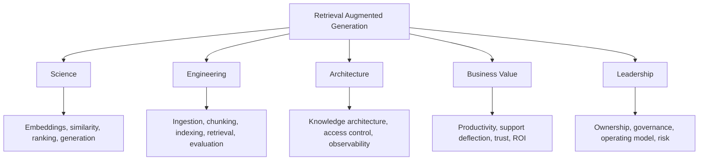

---

## 1. Why RAG Exists

LLMs have three major knowledge problems.

### Problem 1: Private Knowledge

The model does not know your private enterprise data unless you provide it.

Examples:

- customer contracts
- support runbooks
- internal pricing policies
- product roadmaps
- incident history
- operational dashboards

### Problem 2: Stale Knowledge

A model's training data may be outdated.

Even if the model learned public information, it may not know:

- today's policy
- latest release notes
- current pricing
- newly resolved incidents
- updated compliance rules
- current inventory

### Problem 3: Unsupported Answers

An LLM can produce fluent answers without evidence.

For enterprise use, this is dangerous.

A customer support assistant cannot simply "sound right." It must be grounded in the correct policy. A legal assistant cannot invent language. A field service assistant cannot hallucinate repair instructions.

RAG addresses all three problems by grounding generation in retrieved evidence.

---

## 2. Model Knowledge vs Enterprise Knowledge

LLMs contain broad statistical knowledge learned during training. Enterprise systems contain specific operational knowledge.

| Knowledge Type | Source | Strength | Weakness |
|---|---|---|---|
| Model knowledge | Pretraining | broad, general, fluent | stale, generic, not permissioned |
| Enterprise knowledge | documents, systems, databases | specific, current, business-relevant | fragmented, messy, access-controlled |
| Retrieved context | selected at runtime | grounded, task-specific | depends on retrieval quality |
| Tool output | live API/database call | current, structured | requires integration and permissions |

RAG bridges model knowledge and enterprise knowledge.

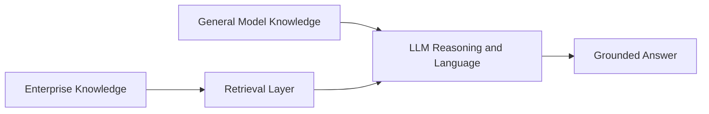

---

## 3. The Basic RAG Pattern

The simplest RAG architecture has two phases:

1. Indexing phase
2. Query phase

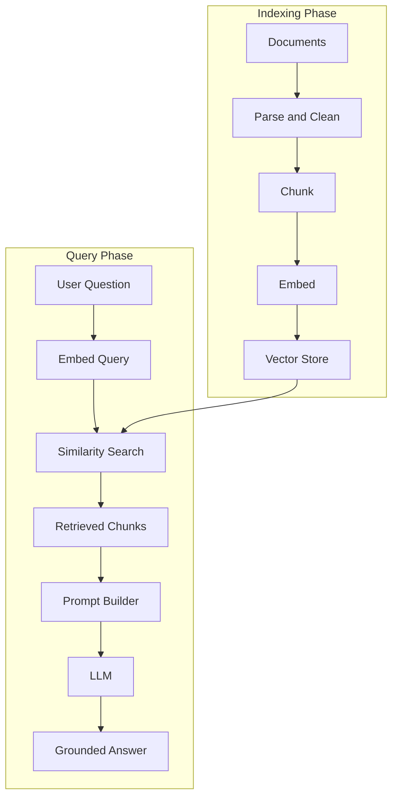

This looks simple, but each box contains important design decisions.

---

## 4. RAG Is a Pipeline, Not a Prompt

A common mistake is thinking RAG is just adding documents to a prompt.

Production RAG requires an end-to-end pipeline:


If any stage is weak, answer quality suffers.

---

## 5. RAG Architecture Components

### 5.1 Source Systems

Sources may include:

- Confluence
- SharePoint
- Google Drive
- PDFs
- Word documents
- websites
- support tickets
- CRM notes
- product catalogs
- code repositories
- runbooks
- logs
- data warehouses
- relational databases
- object storage
- call transcripts

### 5.2 Ingestion Layer

The ingestion layer collects source content.

It must handle:

- connectors
- file formats
- incremental updates
- deleted documents
- version changes
- metadata extraction
- permissions
- source provenance

### 5.3 Parsing Layer

Documents must be converted into usable text and structure.

Parsing must handle:

- headings
- tables
- images
- footnotes
- page numbers
- code blocks
- diagrams
- scanned PDFs
- metadata
- sections
- document hierarchy

### 5.4 Chunking Layer

Chunking splits documents into retrievable units.

Chunking is one of the most important RAG design decisions.

### 5.5 Embedding Layer

Embeddings convert text chunks into vectors.

The embedding model determines how semantic similarity is represented.

### 5.6 Index Layer

The index stores vectors, metadata, and often the original text.

Common storage options:

- vector databases
- search engines
- relational databases with vector extensions
- managed cloud knowledge bases
- hybrid search systems

### 5.7 Retrieval Layer

Retrieval finds relevant chunks for a query.

### 5.8 Reranking Layer

Reranking improves result quality by reordering retrieved chunks.

### 5.9 Context Builder

The context builder assembles the final prompt context.

### 5.10 Generation Layer

The LLM generates the final answer.

### 5.11 Validation Layer

The validation layer checks:

- groundedness
- citations
- safety
- policy compliance
- output format
- confidence

### 5.12 Observability Layer

The observability layer records:

- query
- retrieved chunks
- scores
- prompt version
- model version
- answer
- latency
- token cost
- user feedback
- evaluator scores

---

## 6. Document Ingestion

RAG begins with documents.

Poor ingestion creates poor retrieval.

### Ingestion Requirements

| Requirement | Why It Matters |
|---|---|
| Source tracking | enables citations and audit |
| Incremental updates | keeps knowledge fresh |
| Delete handling | prevents stale answers |
| Version tracking | avoids conflicting policies |
| Permission capture | supports access control |
| Metadata extraction | improves filtering |
| Error handling | prevents silent gaps |
| Scheduling | keeps index current |

### Ingestion Architecture

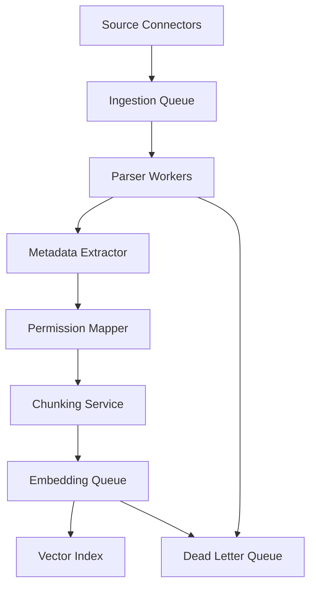

### Enterprise Ingestion Questions

Before building RAG, ask:

- What are the authoritative sources?
- Who owns each source?
- How often does the source change?
- What content should be excluded?
- What permissions must be preserved?
- How will deletes be detected?
- How will parsing failures be handled?
- What is the freshness SLA?

---

## 7. Parsing and Cleaning

Documents are messy.

A PDF may contain headers, footers, page numbers, tables, images, sidebars, and broken reading order. A web page may contain navigation menus and ads. A support ticket may contain signatures, disclaimers, and quoted email chains.

Parsing must preserve meaning while removing noise.

### Common Parsing Problems

| Problem | Example | Impact |
|---|---|---|
| Broken text order | PDF columns mixed | wrong chunks |
| Header/footer noise | repeated page text | retrieval pollution |
| Table loss | pricing table flattened badly | wrong answers |
| Missing OCR | scanned PDF | no searchable text |
| Duplicate content | same policy copied | conflicting retrieval |
| HTML clutter | nav menus | irrelevant chunks |
| Code formatting loss | indentation removed | incorrect code answers |

### Cleaning Pipeline

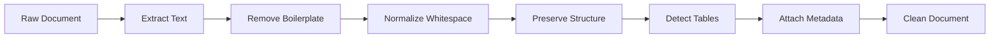

---

## 8. Chunking

Chunking is the process of splitting content into smaller units for retrieval.

Bad chunking is one of the top reasons RAG systems fail.

### Why Chunking Matters

A chunk must be:

- small enough to retrieve precisely
- large enough to preserve meaning
- aligned with document structure
- useful when read independently
- traceable to source
- permission-aware
- metadata-rich

### Chunking Tradeoff

| Chunk Size | Benefit | Risk |
|---|---|---|
| Too small | precise retrieval | missing context |
| Too large | more context | noisy retrieval and higher cost |
| Overlapping | preserves continuity | duplicates and cost |
| Structure-aware | better meaning | more complex parser |

### Common Chunking Strategies

#### Fixed-Size Chunking

Split text every N tokens or characters.

Pros:

- simple
- fast
- predictable

Cons:

- can split ideas
- ignores document structure

#### Recursive Chunking

Split by section, paragraph, sentence, then token limit.

Pros:

- preserves structure better
- widely useful

Cons:

- still may miss semantic boundaries

#### Semantic Chunking

Split based on meaning.

Pros:

- better semantic coherence

Cons:

- more expensive
- more complex

#### Document-Structure Chunking

Split by headings, sections, tables, and logical units.

Pros:

- excellent for enterprise documents

Cons:

- depends on good parsing

#### Parent-Child Chunking

Retrieve small child chunks but provide larger parent context.

Pros:

- precise retrieval with richer context

Cons:

- more complex indexing

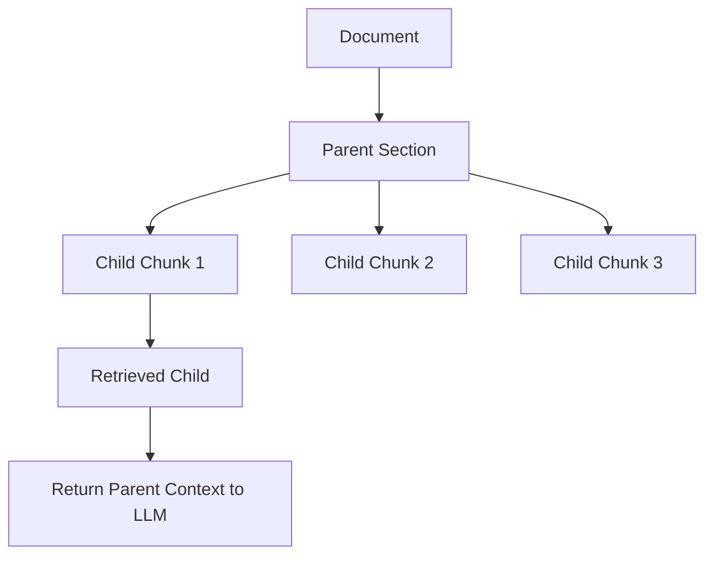

---

## 9. Metadata

Metadata is essential for enterprise RAG.

Useful metadata includes:

- document ID
- title
- author
- source system
- created date
- updated date
- version
- section heading
- page number
- access permissions
- business domain
- product
- customer
- geography
- document type
- classification level
- freshness score
- trust score

### Metadata Enables

- filtering
- citations
- access control
- freshness ranking
- source trust
- debugging
- analytics
- governance

### Example Chunk Record

```json
{
  "chunk_id": "policy-hr-remote-work-2026-section-3",
  "document_id": "hr-remote-work-policy-2026",
  "title": "Remote Work Policy",
  "section": "Eligibility Requirements",
  "source": "SharePoint",
  "updated_at": "2026-05-14",
  "classification": "internal",
  "allowed_groups": ["employees", "hr"],
  "text": "Employees are eligible for remote work if...",
  "embedding": [0.012, -0.044, 0.087]
}
```

---

## 10. Embeddings

Embeddings represent text as vectors.

Chunks with similar meaning should have nearby vectors.

In RAG, embeddings are used to retrieve semantically relevant chunks even when query words do not exactly match document words.

Example:

User query:

```text
Can I work from home on Fridays?
```

Relevant policy text:

```text
Employees may request recurring remote work up to two days per week subject to manager approval.
```

Even though the words differ, embeddings can capture semantic similarity.

### Embedding Pipeline

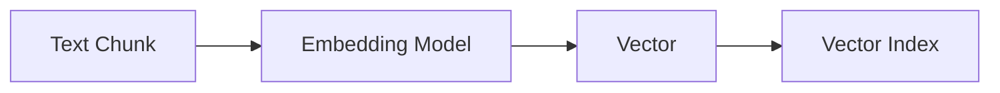

### Embedding Design Questions

- Which embedding model should we use?
- What languages must it support?
- What domain vocabulary matters?
- What is the vector dimension?
- What is the cost per embedding?
- How often must embeddings be refreshed?
- Do we need different embeddings for code, text, images, or tables?
- How will we evaluate embedding quality?

---

## 11. Vector Search

Vector search retrieves chunks based on embedding similarity.

Common similarity measures include:

- cosine similarity
- dot product
- Euclidean distance

### Simplified Retrieval

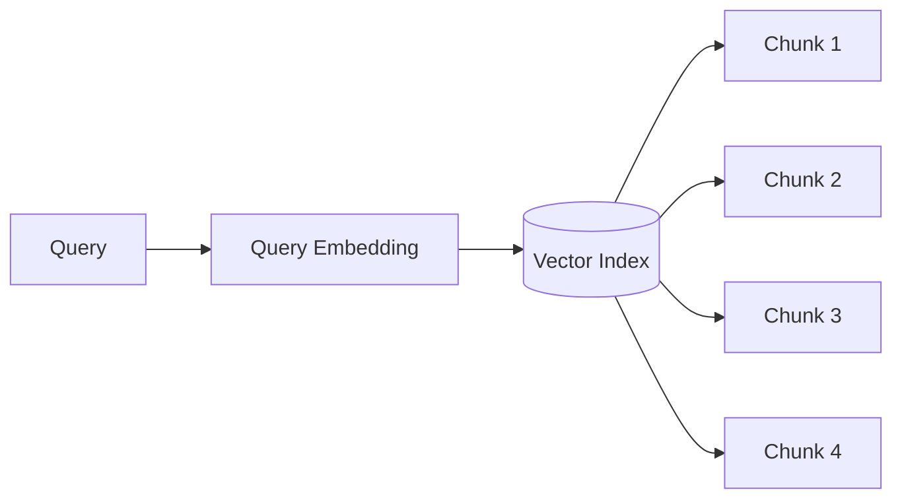

### Vector Search Strengths

- semantic matching
- handles synonyms
- good for natural language questions
- works well for conceptual similarity

### Vector Search Weaknesses

- may miss exact keywords
- can retrieve semantically similar but wrong chunks
- may struggle with IDs, codes, dates, product numbers
- depends on embedding model quality
- difficult to explain compared to keyword search

---

## 12. Lexical Search

Lexical search retrieves documents based on exact words or term matching.

Common method:

- BM25

### Strengths

- excellent for exact terms
- good for product IDs, error codes, policy names
- explainable
- mature and scalable

### Weaknesses

- misses synonyms
- weaker for conceptual queries
- depends on user wording

Example:

Query:

```text
VX-820 error code E113
```

Lexical search may outperform vector search because exact codes matter.

---

## 13. Hybrid Search

Hybrid search combines lexical and vector retrieval.

This is often best for enterprise RAG.

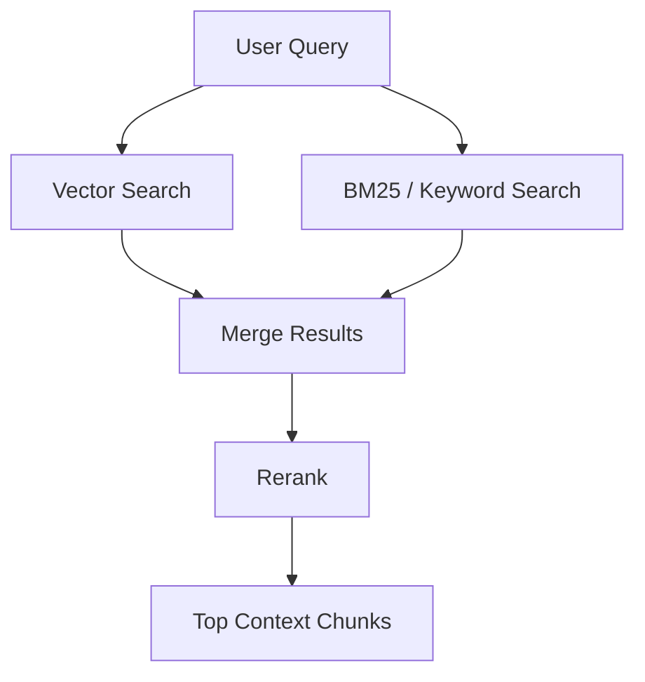

Hybrid search is useful when users may ask both:

- conceptual questions
- exact identifier questions

Examples:

- "How do I troubleshoot connection failures?"
- "What does error code VX-113 mean?"
- "Show policy for COBRA dependent eligibility."
- "What is the runbook for EMQX TLS 8883 failures?"

---

## 14. Reranking

Initial retrieval often returns too many candidates.

Reranking improves result order.

A reranker compares the query against candidate chunks and produces a stronger relevance ranking.

### Retrieval + Reranking

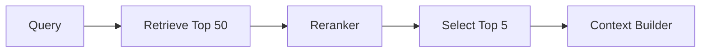

### Why Reranking Matters

Vector search may retrieve broadly similar results. Reranking helps choose the chunks that best answer the exact question.

Reranking often improves:

- answer accuracy
- citation quality
- context precision
- user trust

Tradeoff:

- extra latency
- extra cost
- additional model dependency

---

## 15. Context Assembly

Retrieved chunks must be assembled into a prompt.

The context builder decides:

- which chunks to include
- order of chunks
- how much text to include
- whether to summarize
- whether to include metadata
- how to separate sources
- how to handle conflicting information
- how to cite sources

### Context Assembly Pattern

```text
SYSTEM:
You are an enterprise knowledge assistant.
Use only the provided context.

CONTEXT:
Source 1:
Title: Remote Work Policy
Updated: 2026-05-14
Section: Eligibility
Text: ...

Source 2:
Title: Manager Approval Process
Updated: 2026-04-02
Section: Approval
Text: ...

QUESTION:
Can I work from home on Fridays?

RULES:
- Answer only from context.
- Cite sources.
- If context conflicts, explain the conflict.
- If the answer is missing, say so.
```

### Context Assembly Risks

- too much context
- irrelevant context
- missing source metadata
- conflicting sources
- untrusted retrieved text
- prompt injection inside documents
- unauthorized context

---

## 16. Grounded Generation

Grounded generation means the final answer is based on retrieved evidence.

The model should not rely primarily on general knowledge when enterprise context is provided.

### Grounding Rules

- Use retrieved context.
- Cite relevant sources.
- Do not invent missing facts.
- Distinguish facts from assumptions.
- Ask for clarification when needed.
- Escalate high-risk or ambiguous cases.

### Grounded Answer Structure

```text
Answer:
Yes, employees may request recurring remote work on Fridays if manager approval is obtained.

Evidence:
Remote Work Policy, Section 3, updated May 14, 2026, states that employees may request up to two recurring remote work days per week.

Next Step:
Submit the request through the manager approval workflow.

Confidence:
High
```

---

## 17. Citations

Citations are critical for trust.

Citations allow users to verify:

- where the answer came from
- whether the source is current
- whether the model interpreted it correctly
- whether the user has authority to rely on it

### Citation Design

Citations should include:

- title
- section
- page number if available
- source system
- last updated date
- link if authorized
- quoted or paraphrased evidence

### Citation Anti-Pattern

Bad:

```text
According to company policy, yes.
```

Better:

```text
According to the Remote Work Policy, Section 3, updated May 14, 2026, employees may request up to two recurring remote work days per week with manager approval.
```

---

## 18. Permission-Aware RAG

Enterprise RAG must enforce permissions.

The model should only receive context the user is authorized to see.

### Incorrect Pattern

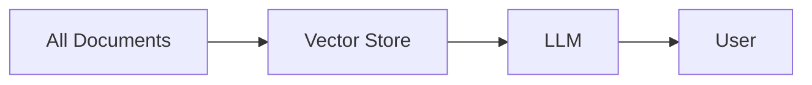

This is dangerous.

### Correct Pattern

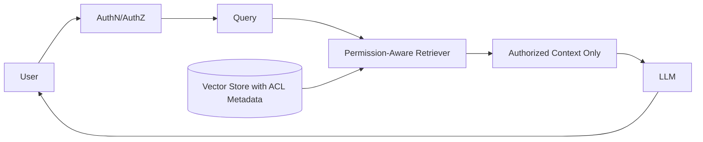

### Access Control Methods

| Method | Description |
|---|---|
| Pre-filtering | filter documents before retrieval |
| Post-filtering | remove unauthorized results after retrieval |
| Separate indexes | index by tenant/group/domain |
| Attribute-based access | filter by metadata |
| Row-level security | apply database security |
| Entitlement service | central permission lookup |

### Enterprise Rule

> If the user cannot access the source document, the model should not see it either.

---

## 19. Multi-Tenant RAG

Multi-tenant RAG is common in SaaS platforms.

Risks include:

- cross-tenant data leakage
- shared index contamination
- metadata filter bugs
- caching leakage
- prompt context mixing
- logging sensitive data

### Multi-Tenant Design Options

| Design | Pros | Cons |
|---|---|---|
| Separate index per tenant | strong isolation | operational overhead |
| Shared index with tenant filter | efficient | filter bugs are dangerous |
| Hybrid by tenant tier | balanced | more complexity |
| Separate encryption keys | stronger security | key management complexity |

For highly sensitive data, separate indexes or strong isolation boundaries may be required.

---

## 20. Freshness and Update Strategy

RAG systems must stay current.

A stale RAG system can be worse than no RAG system because users may trust outdated answers.

### Freshness Architecture

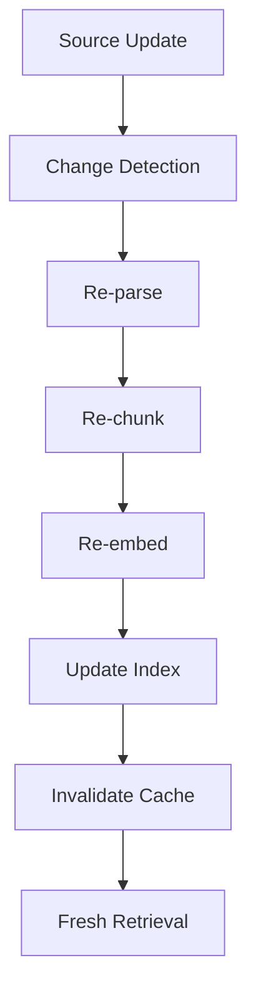

### Freshness Questions

- How often do sources change?
- What is the update SLA?
- Are changes event-driven or batch?
- How are deletes handled?
- How are superseded documents marked?
- How is cache invalidated?
- How do users know source freshness?

---

## 21. RAG Evaluation

RAG must be evaluated at multiple levels.

### Retrieval Evaluation

Measures whether the system retrieved the right evidence.

Metrics:

- Recall@K
- Precision@K
- Mean Reciprocal Rank
- nDCG
- hit rate
- citation relevance

### Generation Evaluation

Measures whether the final answer is good.

Metrics:

- groundedness
- faithfulness
- answer correctness
- completeness
- citation accuracy
- refusal correctness
- helpfulness
- conciseness

### Business Evaluation

Measures whether the system created value.

Metrics:

- support deflection
- time saved
- first-contact resolution
- case handling time
- conversion lift
- policy compliance
- escalation rate
- incident reduction
- user satisfaction

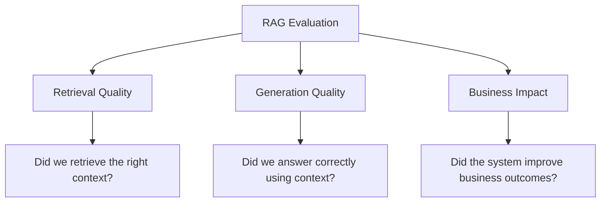

---

## 22. Retrieval Metrics

### Recall@K

Recall@K asks:

> Did the correct chunk appear in the top K retrieved results?

If the correct answer is not retrieved, the model usually cannot answer correctly.

### Precision@K

Precision@K asks:

> How many of the top K retrieved chunks are actually relevant?

High recall with low precision can overload the context with noise.

### Mean Reciprocal Rank

Mean Reciprocal Rank rewards systems that place the first relevant result high in the ranking.

### nDCG

Normalized Discounted Cumulative Gain is useful when results have graded relevance.

### Practical Guidance

For enterprise RAG, optimize first for retrieval recall, then improve precision and ranking.

If the relevant document never reaches the model, prompt engineering cannot fix the answer.

---

## 23. Groundedness and Faithfulness

Groundedness means the answer is supported by retrieved context.

Faithfulness means the answer does not contradict or add unsupported claims beyond the context.

### Groundedness Evaluation Prompt

```text
SOURCE CONTEXT:
{{retrieved_context}}

ANSWER:
{{answer}}

Evaluate whether the answer is fully supported by the source context.

Return:
{
  "grounded": true/false,
  "unsupported_claims": [],
  "contradictions": [],
  "missing_context": [],
  "score": 0-5
}
```

LLM-based evaluation can help, but high-risk domains require human review.

---

## 24. RAG Failure Modes

### Failure Mode 1: No Relevant Retrieval

The right content is not retrieved.

Causes:

- poor embeddings
- bad chunking
- missing documents
- wrong metadata filters
- query ambiguity
- weak lexical matching

Mitigation:

- improve chunking
- use hybrid search
- add query rewriting
- improve metadata
- evaluate Recall@K

---

### Failure Mode 2: Wrong Context Retrieved

The system retrieves plausible but incorrect content.

Causes:

- semantically similar documents
- outdated policies
- duplicate content
- ambiguous queries

Mitigation:

- reranking
- freshness ranking
- source trust scoring
- clarification prompts
- conflict detection

---

### Failure Mode 3: Context Too Noisy

The model receives too much irrelevant context.

Causes:

- large chunks
- high top-K
- poor ranking
- weak filtering

Mitigation:

- reduce top-K
- rerank
- compress context
- improve chunking
- metadata filtering

---

### Failure Mode 4: Unsupported Generation

The model answers beyond the provided context.

Causes:

- weak prompt rules
- model relying on general knowledge
- missing validation
- poor grounding

Mitigation:

- strict grounded prompt
- answer validation
- citation checks
- refusal training through examples

---

### Failure Mode 5: Permission Leakage

The model sees unauthorized data.

Causes:

- missing ACL metadata
- post-filtering bugs
- shared cache
- logs exposing context

Mitigation:

- permission-aware retrieval
- deterministic authorization
- secure logging
- tenant isolation
- access audits

---

### Failure Mode 6: Stale Answers

The model answers from outdated documents.

Causes:

- stale index
- missing delete handling
- duplicate old policies
- no freshness metadata

Mitigation:

- incremental indexing
- source versioning
- freshness scoring
- cache invalidation

---

### Failure Mode 7: Bad Citations

The answer cites irrelevant or weak evidence.

Causes:

- citation after generation
- poor source tracking
- chunk-source mismatch
- answer not aligned to source

Mitigation:

- source-aware prompts
- citation validation
- chunk metadata
- evidence-first answer format

---

## 25. Query Transformation

Users often ask vague questions.

Query transformation improves retrieval.

Techniques:

- query rewriting
- query expansion
- hypothetical document embedding
- multi-query retrieval
- decomposition
- entity extraction
- metadata inference

### Query Rewriting Example

User asks:

```text
Can I do this from home on Fridays?
```

Rewritten query:

```text
remote work policy recurring Friday work from home manager approval eligibility
```

### Multi-Query Retrieval

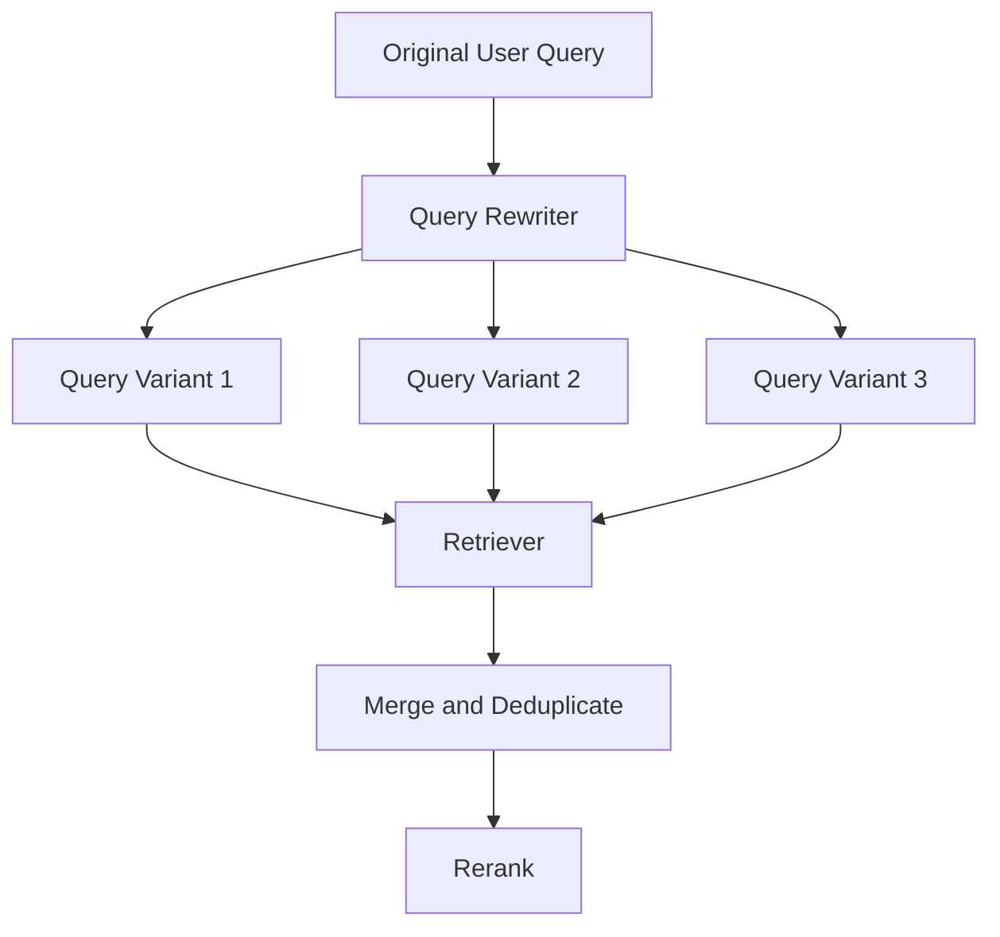

Query transformation improves recall but adds cost and complexity.

---

## 26. Contextual Compression

Contextual compression reduces retrieved chunks to the parts relevant to the question.

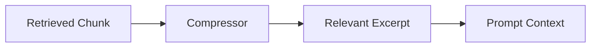

Benefits:

- lower token cost
- less noise
- better focus

Risks:

- compressor may remove important context
- additional latency
- another model call to evaluate

---

## 27. RAG with Structured Data

Not all enterprise knowledge is in documents.

Some knowledge lives in databases.

Examples:

- order status
- inventory count
- customer balance
- device heartbeat
- SLA status
- case priority
- transaction amount

For live structured data, tools or database queries may be better than document RAG.

### Pattern

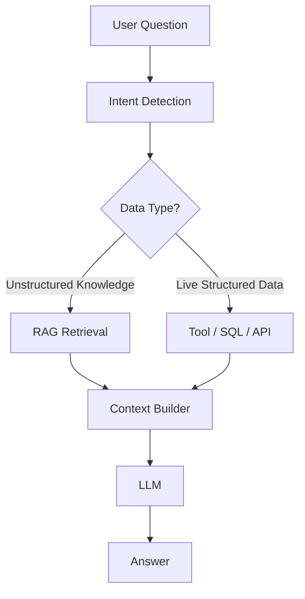

### Rule

> Use RAG for knowledge. Use tools for live state.

---

## 28. Graph RAG

Graph RAG combines retrieval with knowledge graphs.

Useful when relationships matter.

Examples:

- customer → contract → product → entitlement
- device → firmware → error code → runbook
- patient → condition → medication → guideline
- supplier → component → risk → factory

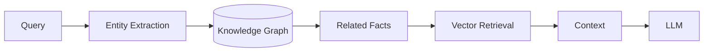

Graph RAG is useful when simple semantic similarity is insufficient.

---

## 29. Agentic RAG

Agentic RAG uses an agent to decide how to retrieve, reason, and answer.

Instead of one retrieval call, an agent may:

- clarify the question
- search multiple sources
- compare evidence
- call tools
- detect conflicts
- ask follow-up questions
- synthesize final answer

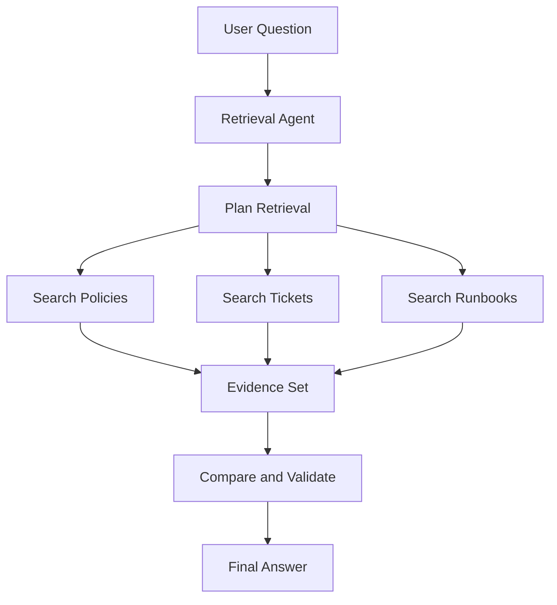

Agentic RAG is powerful but riskier and more expensive. Use it when the workflow justifies the complexity.

---

## 29a. Multimodal RAG

Standard RAG operates over text. Multimodal RAG extends retrieval to documents that contain images, tables, charts, diagrams, and other visual elements.

Enterprise documents are rarely pure text. Contracts have tables. Manuals have diagrams. Runbooks have screenshots. Invoices have structured layouts. Standard text extraction loses this structure.

### Multimodal RAG Patterns

**Pattern 1: Text Extraction with Layout Preservation**

Use a parsing model (such as a vision-capable LLM or a document AI service) to extract content from PDFs and documents while preserving table structure, heading hierarchy, and figure captions.

```mermaid
flowchart TD
    D[PDF / Document] --> P[Multimodal Parser]
    P --> T[Text Chunks with Layout]
    P --> TB[Tables as Structured Text]
    P --> F[Figure Captions + Descriptions]
    T --> E[Embed and Index]
    TB --> E
    F --> E
    Q[User Query] --> R[Retrieval]
    R --> E
    E --> C[Context]
    C --> M[Generation Model]
    M --> A[Answer with Citations]
```

**Pattern 2: Image as Retrieval Unit**

Index document pages or figures as image embeddings. At retrieval time, retrieve the most relevant page images and pass them to a multimodal model.

```mermaid
flowchart TD
    D[PDF Pages] --> IMG[Render as Images]
    IMG --> VE[Visual Embedding Model]
    VE --> VS[Visual Vector Store]
    Q[Query] --> QE[Query Embedding]
    QE --> VS
    VS --> RI[Retrieved Page Images]
    RI --> MM[Multimodal Model]
    MM --> A[Answer]
```

**Pattern 3: Hybrid Text + Image**

Combine text and image embeddings in a unified retrieval system.

### When to Use Multimodal RAG

| Document Type | Approach |
|---|---|
| Pure text documents | Standard text RAG |
| Documents with tables | Layout-preserving parser + text RAG |
| Documents with diagrams / schematics | Image embedding or vision parser |
| Scanned PDFs | OCR + layout parsing, then text RAG |
| Technical manuals with figures | Hybrid text + image retrieval |
| Invoices / receipts | Vision model or structured extraction |

### Enterprise Principle

> Multimodal RAG does not simplify knowledge engineering. It extends the same discipline — source quality, permissions, evaluation, citations, and freshness — to visual content.

---

## 29b. Python: RAG Pipeline Skeleton

The following skeleton shows the shape of a complete RAG pipeline: query embedding, vector search, context assembly, and grounded generation. This is provider-agnostic by design — swap the embedding and generation calls for your specific stack.

```python
from dataclasses import dataclass
from typing import Optional
import json

# --- Data structures ---

@dataclass
class RetrievedChunk:
    chunk_id: str
    source_document: str
    content: str
    score: float
    metadata: dict

@dataclass
class RAGResult:
    question: str
    retrieved_chunks: list[RetrievedChunk]
    answer: str
    citations: list[str]
    groundedness_warning: bool = False

# --- Step 1: Embed the query ---

def embed_query(query: str, embedding_client) -> list[float]:
    """Convert query text to a vector using your embedding model."""
    response = embedding_client.embed(text=query)
    return response.embedding

# --- Step 2: Retrieve relevant chunks ---

def retrieve_chunks(
    query_vector: list[float],
    vector_store,
    top_k: int = 5,
    metadata_filter: Optional[dict] = None
) -> list[RetrievedChunk]:
    """
    Search the vector store for the most relevant chunks.
    Applies metadata filters for permission-aware retrieval.
    """
    results = vector_store.search(
        vector=query_vector,
        top_k=top_k,
        filter=metadata_filter
    )
    return [
        RetrievedChunk(
            chunk_id=r.id,
            source_document=r.metadata.get("source", "unknown"),
            content=r.content,
            score=r.score,
            metadata=r.metadata
        )
        for r in results
    ]

# --- Step 3: Assemble context ---

def assemble_context(
    chunks: list[RetrievedChunk],
    max_context_tokens: int = 2000
) -> tuple[str, list[str]]:
    """
    Build a grounded context string from retrieved chunks.
    Returns context text and list of citation references.
    Respects a token budget — truncates lower-scored chunks first.
    """
    context_parts = []
    citations = []
    estimated_tokens = 0

    for i, chunk in enumerate(sorted(chunks, key=lambda c: c.score, reverse=True)):
        # Rough token estimate: ~4 chars per token
        chunk_tokens = len(chunk.content) // 4
        if estimated_tokens + chunk_tokens > max_context_tokens:
            break

        context_parts.append(
            f"[{i+1}] SOURCE: {chunk.source_document}\n{chunk.content}"
        )
        citations.append(f"[{i+1}] {chunk.source_document}")
        estimated_tokens += chunk_tokens

    return "\n\n".join(context_parts), citations

# --- Step 4: Generate grounded answer ---

def generate_grounded_answer(
    question: str,
    context: str,
    generation_client,
    system_prompt: str
) -> str:
    """
    Generate an answer grounded in retrieved context.
    The system prompt must instruct the model to use only the context.
    """
    messages = [
        {"role": "user", "content": f"""
{context}

---

Using only the context above, answer the following question.
If the context does not contain enough information, say so explicitly.
Do not make up information.

QUESTION: {question}
"""}
    ]
    response = generation_client.complete(
        system=system_prompt,
        messages=messages,
        max_tokens=800,
        temperature=0.1  # Low temperature for grounded factual responses
    )
    return response.text

# --- Step 5: Evaluate groundedness (basic) ---

def check_groundedness_warning(answer: str, chunks: list[RetrievedChunk]) -> bool:
    """
    Heuristic groundedness check.
    Flags if the answer is long but retrieval scored poorly.
    Replace with LLM-as-judge or dedicated evaluator in production.
    """
    avg_score = sum(c.score for c in chunks) / len(chunks) if chunks else 0
    return avg_score < 0.5 and len(answer) > 200

# --- Full pipeline ---

def rag_pipeline(
    question: str,
    embedding_client,
    vector_store,
    generation_client,
    system_prompt: str,
    user_metadata_filter: Optional[dict] = None,
    top_k: int = 5
) -> RAGResult:
    """
    End-to-end RAG: embed → retrieve → assemble → generate → evaluate.
    """
    query_vector = embed_query(question, embedding_client)
    chunks = retrieve_chunks(query_vector, vector_store, top_k, user_metadata_filter)

    if not chunks:
        return RAGResult(
            question=question,
            retrieved_chunks=[],
            answer="I could not find relevant information in the knowledge base.",
            citations=[],
            groundedness_warning=True
        )

    context, citations = assemble_context(chunks)
    answer = generate_grounded_answer(question, context, generation_client, system_prompt)
    warning = check_groundedness_warning(answer, chunks)

    return RAGResult(
        question=question,
        retrieved_chunks=chunks,
        answer=answer,
        citations=citations,
        groundedness_warning=warning
    )
```

### Key Engineering Notes

- `metadata_filter` in `retrieve_chunks()` is how permission-aware retrieval works — pass user identity and entitlements as filters before retrieval, not after
- `assemble_context()` respects a token budget and orders by score — lower-quality chunks are dropped first when budget is tight
- `temperature=0.1` in generation reduces hallucination risk for factual grounding tasks
- The groundedness check here is a heuristic — replace with LLM-as-judge (comparing answer to retrieved context) in production
- `RAGResult` makes the full trace available for logging, evaluation, and citation display

---

## 30. RAG vs Fine-Tuning

RAG and fine-tuning solve different problems.

| Need | RAG | Fine-Tuning |
|---|---|---|
| Add current knowledge | Strong | Weak |
| Add private documents | Strong | Risky |
| Enforce citations | Strong | Weak |
| Change style | Moderate | Strong |
| Improve task-specific behavior | Moderate | Strong |
| Reduce prompt length | Moderate | Strong |
| Handle frequently changing data | Strong | Weak |
| Improve classification at scale | Moderate | Strong |
| Avoid retraining | Strong | Weak |

### Rule

> Use RAG to provide knowledge. Use fine-tuning to change behavior.

Often, the best enterprise system uses both.

---

## 31. RAG vs Long Context

Modern models support large context windows, but long context does not replace RAG.

### Long Context Benefits

- simple architecture
- fewer retrieval errors
- useful for single-document analysis
- good for legal/contract review

### Long Context Risks

- high cost
- high latency
- irrelevant context
- lost-in-the-middle effects
- weak access control if careless
- hard to monitor evidence selection

### Decision Guidance

Use long context when:

- the user intentionally provides a document
- the document set is small
- full-document reasoning matters
- cost is acceptable

Use RAG when:

- knowledge corpus is large
- queries are repeated
- access control matters
- citations matter
- retrieval must scale
- freshness matters

---

## 32. Enterprise RAG Architecture

A mature enterprise RAG platform looks like this:

```mermaid
flowchart TD
    subgraph Sources
        A1[Docs]
        A2[Wikis]
        A3[Tickets]
        A4[Runbooks]
        A5[CRM]
        A6[Data Warehouse]
    end

    subgraph Knowledge Pipeline
        B[Ingestion]
        C[Parsing]
        D[Chunking]
        E[Metadata and ACLs]
        F[Embeddings]
        G[Indexing]
    end

    subgraph Runtime
        H[User Query]
        I[Auth Service]
        J[Query Rewrite]
        K[Retriever]
        L[Reranker]
        M[Context Builder]
        N[LLM]
        O[Validator]
        P[Response with Citations]
    end

    subgraph Operations
        Q[Observability]
        R[Evaluation]
        S[Feedback Loop]
        T[Governance]
    end

    A1 --> B
    A2 --> B
    A3 --> B
    A4 --> B
    A5 --> B
    A6 --> B

    B --> C --> D --> E --> F --> G

    H --> I --> J --> K
    G --> K
    K --> L --> M --> N --> O --> P

    P --> Q
    Q --> R
    R --> S
    S --> B
    T --> B
    T --> O
```

---

## 33. RAG for Customer Support

### Use Case

A support agent asks:

> What should I do when terminal model X loses connectivity after firmware update Y?

Sources:

- product manuals
- support tickets
- known issues
- firmware release notes
- runbooks
- customer configuration

### Architecture

```mermaid
flowchart TD
    Q[Support Agent Question] --> R[Support RAG Retriever]
    R --> M[Manuals]
    R --> T[Tickets]
    R --> K[Known Issues]
    R --> F[Firmware Notes]
    M --> C[Context Builder]
    T --> C
    K --> C
    F --> C
    C --> L[LLM]
    L --> A[Troubleshooting Answer]
```

### Business Metrics

- average handle time
- first-contact resolution
- escalation reduction
- support deflection
- technician productivity
- repeat incident reduction

---

## 34. RAG for IoT / Device Operations

Given a platform managing millions of devices, RAG can support operations teams by combining runbooks, telemetry explanations, firmware notes, and incident history.

### Example Question

> Devices in region A are showing increased heartbeat failures after the latest firmware rollout. What are the likely causes and next diagnostic steps?

Sources:

- firmware release notes
- incident reports
- device logs
- telemetry definitions
- runbooks
- customer deployment notes

```mermaid
flowchart TD
    Q[Ops Question] --> C[Context Router]
    C --> R1[Runbook Retrieval]
    C --> R2[Firmware Notes Retrieval]
    C --> R3[Incident History Retrieval]
    C --> T[Telemetry Tool]
    R1 --> E[Evidence Set]
    R2 --> E
    R3 --> E
    T --> E
    E --> L[LLM]
    L --> A[Operational Recommendation]
```

### Design Rule

For IoT operations, use RAG for explanation and tools for live telemetry.

---

## 35. RAG for Retail Personalization

Retail RAG can ground shopping assistants in:

- product catalog
- size guides
- reviews
- inventory
- return policy
- promotion rules
- customer preference profile

RAG helps prevent hallucinated product claims.

### Metrics

- conversion rate
- average order value
- return rate
- recommendation acceptance
- support deflection
- product claim accuracy

---

## 36. RAG for Financial Services

Financial RAG can support:

- analyst research
- policy lookup
- compliance review
- customer service
- risk summaries
- earnings call analysis

Critical requirements:

- source citations
- entitlement enforcement
- audit logs
- data lineage
- refusal behavior
- human review for regulated decisions

---

## 37. RAG for Healthcare Administration

Healthcare RAG can assist with:

- benefits explanation
- prior authorization policy lookup
- internal clinical admin workflows
- patient communication drafts
- billing support
- operational guidelines

Critical requirements:

- PHI protection
- strict access control
- approved source grounding
- escalation to professionals
- no unsupported diagnosis
- audit trails

---

## 38. RAG for Executive Intelligence

Executives need fast synthesis across multiple sources.

Sources:

- board decks
- KPI dashboards
- project updates
- customer feedback
- market research
- incident reports
- financial summaries

RAG can produce:

- weekly executive briefings
- risk summaries
- portfolio updates
- customer health summaries
- initiative status
- decision memos

### Executive RAG Pattern

```mermaid
flowchart TD
    Q[Executive Question] --> R[Multi-Source Retrieval]
    R --> F[Financial Data]
    R --> O[Operational Updates]
    R --> C[Customer Signals]
    R --> M[Market Notes]
    F --> S[Synthesis]
    O --> S
    C --> S
    M --> S
    S --> E[Executive Brief]
```

---

## 39. RAG Security

RAG security is more than securing the model.

It includes:

- source permissions
- ingestion controls
- index security
- metadata security
- prompt injection defense
- output filtering
- logging controls
- tenant isolation
- encryption
- auditability
- data retention

### RAG Security Architecture

```mermaid
flowchart TD
    A[User] --> B[Authentication]
    B --> C[Authorization]
    C --> D[Permission-Aware Retrieval]
    D --> E[Context Sanitization]
    E --> F[LLM]
    F --> G[Output Validation]
    G --> H[Audit Log]
    G --> I[User Response]
```

---

## 40. RAG Governance

Governance answers:

- Who owns the knowledge sources?
- Who approves indexed content?
- Who reviews answers?
- Who monitors failures?
- Who handles stale documents?
- Who manages access controls?
- Who audits usage?
- Who owns business outcomes?

### Governance Roles

| Role | Responsibility |
|---|---|
| Source owner | owns document quality |
| AI product owner | owns use case outcomes |
| AI platform team | owns RAG infrastructure |
| Security team | owns access control and risk |
| Compliance team | owns regulated content |
| Domain experts | validate answer quality |
| Operations team | monitors production behavior |

---

## 41. RAG Observability

RAG observability must capture the full chain.

For each query, log:

- user ID or anonymized ID
- query
- query rewrite
- retrieved chunks
- retrieval scores
- source IDs
- permissions applied
- prompt version
- model version
- answer
- citations
- latency
- token usage
- validation results
- feedback

### RAG Trace

```mermaid
sequenceDiagram
    participant U as User
    participant A as App
    participant R as Retriever
    participant V as Vector Store
    participant L as LLM
    participant E as Evaluator

    U->>A: Ask question
    A->>R: Retrieve authorized context
    R->>V: Search vectors + metadata
    V-->>R: Candidate chunks
    R-->>A: Ranked chunks
    A->>L: Prompt + context
    L-->>A: Answer
    A->>E: Validate groundedness
    E-->>A: Evaluation score
    A-->>U: Answer + citations
```

---

## 42. RAG Cost Model

RAG costs include:

- ingestion compute
- parsing/OCR
- embedding generation
- vector database storage
- vector search
- reranking
- LLM input tokens
- LLM output tokens
- evaluation calls
- monitoring/log storage
- engineering maintenance

### Cost Equation

```text
Total RAG Cost =
  ingestion cost
+ embedding cost
+ index storage cost
+ retrieval cost
+ reranking cost
+ generation cost
+ evaluation cost
+ operations cost
```

### Cost Optimization

| Technique | Impact |
|---|---|
| smarter chunking | fewer irrelevant chunks |
| metadata filtering | lower retrieval noise |
| caching | reduce repeated queries |
| smaller models | lower generation cost |
| query routing | use expensive RAG only when needed |
| context compression | reduce token usage |
| batch embedding | reduce ingestion cost |
| lifecycle policies | reduce storage cost |

---

## 43. RAG ROI Model

RAG ROI must be tied to workflows.

### Example: Support RAG

Variables:

- support cases per month
- average handle time
- support labor cost
- expected time reduction
- escalation reduction
- implementation cost
- monthly operating cost

```text
Monthly Value =
  time_saved_per_case
x cases_per_month
x labor_cost_per_minute
+ avoided_escalation_cost
+ improved_customer_retention_value
```

### ROI Questions

- How many users will use it?
- How many tasks will it improve?
- How much time will it save?
- How much error will it reduce?
- How much revenue will it influence?
- What risks does it reduce?
- What is the operating cost?
- What is the payback period?

---

## 44. Lessons from the Field

### What Worked

RAG works best when it is tied to a specific workflow.

Examples:

- support agents finding troubleshooting steps
- operations teams finding runbooks
- sales teams finding product answers
- HR teams answering policy questions
- executives summarizing project updates

The best systems start with a narrow, high-value domain and expand after measuring quality.

---

### What Did Not Work

Broad "ask anything about the company" assistants often struggle.

Why?

- too many sources
- unclear ownership
- conflicting documents
- permissions complexity
- no clear success metric
- weak evaluation
- poor source quality

General-purpose enterprise RAG is tempting, but focused RAG usually creates value faster.

---

### Common Mistakes

- indexing everything
- ignoring permissions
- using poor chunking
- skipping reranking
- not evaluating retrieval quality
- relying only on vector search
- failing to handle stale documents
- not capturing source metadata
- treating citations as optional
- using RAG when a database query would be better
- not measuring business impact

---

### ROI Perspective

The ROI of RAG comes from reducing the cost of finding and applying knowledge.

RAG creates value when it:

- reduces search time
- reduces support effort
- increases answer consistency
- reduces errors
- improves customer self-service
- improves operational response
- accelerates onboarding
- preserves institutional knowledge

But RAG is not free. It introduces infrastructure cost, evaluation cost, operational complexity, and governance overhead.

A good RAG business case identifies a specific workflow where knowledge retrieval is currently expensive, slow, inconsistent, or risky.

---

### CTO Perspective

A CTO should ask:

- What knowledge sources are authoritative?
- Who owns document quality?
- How are permissions enforced?
- How is retrieval quality measured?
- How are stale documents handled?
- Can we trace every answer back to sources?
- Can we prevent cross-tenant leakage?
- What is the cost per successful answer?
- What is the fallback when confidence is low?
- How will this system improve a business metric?

If the team cannot answer these questions, the RAG system is not enterprise-ready.

---

## 45. Pratik's Principles

### Principle 1: RAG Is Only as Good as the Knowledge Pipeline

Better models cannot fix bad documents, poor parsing, weak metadata, or stale indexes.

---

### Principle 2: Do Not Index Everything

Indexing everything creates noise, risk, and cost. Start with high-value, trusted sources.

---

### Principle 3: Retrieval Quality Comes Before Generation Quality

If the right evidence is not retrieved, the model cannot reliably answer.

---

### Principle 4: Permissions Must Be Enforced Before Context Reaches the Model

The model should never receive data the user is not allowed to see.

---

### Principle 5: Use RAG for Knowledge and Tools for Live State

Documents answer policy and explanation questions. APIs and databases answer current state questions.

---

### Principle 6: Citations Are a Trust Feature

Enterprise users need evidence, not just fluent answers.

---

### Principle 7: Start Narrow, Prove Value, Then Expand

Focused RAG with measurable ROI beats broad RAG with vague adoption.

---

## 46. Hands-On Labs

### Lab 1: Build a Basic RAG Pipeline

Build a simple RAG system over a small set of Markdown or PDF documents.

Suggested structure:

```text
labs/chapter-04-rag/basic-rag/
  data/
  ingest.py
  chunk.py
  embed.py
  retrieve.py
  answer.py
  README.md
```

Requirements:

- load documents
- chunk documents
- generate embeddings
- store vectors
- retrieve top-K chunks
- generate answer with citations

---

### Lab 2: Compare Chunking Strategies

Use the same document corpus and compare:

- fixed-size chunking
- recursive chunking
- heading-based chunking
- parent-child chunking

Measure:

- Recall@K
- answer quality
- citation quality
- token cost

Deliverable:

```text
chunking-comparison.md
```

---

### Lab 3: Build Hybrid Search

Implement both:

- vector search
- lexical search

Then merge and rerank results.

Test queries:

- conceptual questions
- exact product IDs
- error codes
- policy names

Deliverable:

```text
hybrid-search-results.md
```

---

### Lab 4: Permission-Aware RAG

Create documents with access groups:

```json
{
  "document": "executive-comp-policy.md",
  "allowed_groups": ["hr", "executives"]
}
```

Build retrieval that filters by user group before sending context to the model.

Deliverables:

- access test cases
- allowed/denied retrieval logs
- security notes

---

### Lab 5: RAG Evaluation Harness

Create a dataset of:

- user questions
- expected source documents
- expected answer characteristics

Measure:

- Recall@K
- groundedness
- citation accuracy
- answer usefulness

Deliverable:

```text
rag-evaluation-report.md
```

---

## 47. Interview Questions

### Engineering-Level Questions

1. What problem does RAG solve?
2. What are embeddings used for in RAG?
3. Why does chunking matter?
4. What is the difference between vector search and keyword search?
5. Why is hybrid search often useful?
6. What is reranking?
7. How do you evaluate retrieval quality?
8. What is groundedness?
9. How do you prevent hallucination in RAG?
10. How do you handle stale documents?

### Architect-Level Questions

1. Design an enterprise RAG architecture for customer support.
2. How would you enforce permissions in a RAG system?
3. How would you design a multi-tenant RAG platform?
4. What metadata would you store with each chunk?
5. How would you handle conflicting documents?
6. How would you monitor RAG in production?
7. When would you use graph RAG?
8. When would you use tools instead of RAG?
9. How would you design a RAG evaluation pipeline?
10. How would you scale RAG across multiple business domains?

### Director / VP / CTO-Level Questions

1. What business metrics would justify RAG investment?
2. Why do broad enterprise assistants often fail?
3. Who owns document quality in a RAG system?
4. What governance model is required for enterprise RAG?
5. How do you explain RAG risk to executives?
6. How do you decide whether to build or buy RAG?
7. What is the operating cost model for RAG?
8. How do you avoid AI vendor lock-in in RAG architecture?
9. How do you measure ROI from RAG?
10. What would make you stop or pause a RAG initiative?

---

## 48. Certification Mapping

### AWS AI / Generative AI Professional Preparation

This chapter supports topics related to:

- retrieval augmented generation
- Amazon Bedrock Knowledge Bases
- vector stores
- embeddings
- chunking
- metadata filtering
- guardrails
- grounding
- model evaluation
- responsible AI
- production deployment
- security and access control

### Anthropic Claude / MCP Architecture Preparation

This chapter supports topics related to:

- grounding Claude with context
- tool and retrieval boundaries
- prompt injection mitigation
- context design
- citation-aware generation
- MCP tools for retrieval
- agentic RAG patterns

### NVIDIA Generative AI Preparation

This chapter supports topics related to:

- embedding workloads
- inference cost
- retrieval latency
- reranking cost
- vector search performance
- GPU acceleration considerations for retrieval and generation

---

## 49. Chapter Exercises

### Exercise 1

Design a RAG system for an HR policy assistant.

Include:

- source systems
- ingestion process
- chunking strategy
- metadata
- access control
- retrieval strategy
- citation format
- evaluation metrics

---

### Exercise 2

You are designing RAG for a SaaS platform with 1,000 tenants.

Compare:

- separate vector index per tenant
- shared vector index with tenant filters
- hybrid approach

Discuss risks and tradeoffs.

---

### Exercise 3

Create a RAG failure analysis for this scenario:

A user asks about the current refund policy. The system answers using a policy from two years ago.

Identify likely root causes and mitigations.

---

### Exercise 4

Build a RAG ROI model for a support organization handling 50,000 cases per month.

Assume:

- average handle time is 15 minutes
- labor cost is $1.25 per minute
- RAG reduces handle time by 20%
- monthly RAG operating cost is $25,000

Calculate estimated monthly value and net benefit.

---

### Exercise 5

Design a RAG evaluation dataset for a field service assistant.

Include:

- troubleshooting questions
- known issue questions
- ambiguous questions
- out-of-scope questions
- prompt injection attempts
- stale document scenarios

---

## 50. Key Terms

| Term | Meaning |
|---|---|
| RAG | Retrieval Augmented Generation |
| Embedding | Vector representation of text or data |
| Vector database | Database optimized for vector similarity search |
| Chunk | Smaller unit of text created from a source document |
| Retriever | Component that finds relevant chunks |
| Reranker | Component that reorders candidate results by relevance |
| Context builder | Component that assembles retrieved context for the LLM |
| Groundedness | Degree to which answer is supported by source context |
| Faithfulness | Degree to which answer avoids unsupported claims |
| Hybrid search | Combination of lexical and vector search |
| BM25 | Common lexical ranking algorithm |
| Metadata filtering | Filtering retrieval by attributes |
| Permission-aware RAG | RAG that enforces user access rights |
| Graph RAG | RAG using knowledge graph relationships |
| Agentic RAG | RAG controlled by an agentic workflow |
| Contextual compression | Reducing retrieved text to relevant excerpts |

---

## 51. One-Page Executive Brief

Retrieval Augmented Generation is the architecture pattern that connects AI models to enterprise knowledge.

LLMs are powerful, but they do not automatically know private company data, current policies, customer-specific information, or operational history. RAG solves this by retrieving relevant, trusted, permissioned context and giving it to the model at the time of the request.

RAG is valuable when employees or customers need fast answers from large bodies of knowledge such as policies, manuals, tickets, runbooks, contracts, product catalogs, or internal documentation.

The business value of RAG comes from:

- faster knowledge access
- lower support costs
- better answer consistency
- improved compliance
- reduced operational errors
- better customer self-service
- faster onboarding
- improved decision support

However, RAG is not just "put documents into a chatbot." Enterprise RAG requires ingestion, parsing, chunking, embeddings, indexing, metadata, access control, retrieval, reranking, grounding, citations, evaluation, observability, and governance.

The most important executive questions are:

- What business workflow will RAG improve?
- What sources are authoritative?
- How will permissions be enforced?
- How will stale documents be handled?
- How will answer quality be measured?
- What is the cost per successful answer?
- What is the expected ROI?

The best RAG initiatives start narrow, use trusted sources, enforce permissions, measure retrieval quality, and tie success to business outcomes.

---

## 52. Chapter Summary

In this chapter, we examined Retrieval Augmented Generation as an enterprise knowledge architecture pattern.

We learned that RAG addresses key limitations of LLMs: lack of private knowledge, stale knowledge, and unsupported answers. We explored the full RAG pipeline, including ingestion, parsing, chunking, metadata enrichment, embeddings, indexing, retrieval, reranking, context assembly, generation, validation, observability, and governance.

We compared vector search, lexical search, hybrid search, graph RAG, agentic RAG, long-context models, fine-tuning, and tool use. We examined permission-aware RAG, multi-tenant RAG, freshness strategy, evaluation methods, cost models, ROI models, and enterprise use cases.

The key lesson is:

> RAG is not a model trick. It is a knowledge engineering discipline.

In Chapter 5, we go deeper into vector databases and retrieval systems, the infrastructure layer that powers many RAG architectures.

---

## 53. Suggested Git Commit

```bash
mkdir -p chapters
cp 04-retrieval-augmented-generation.md chapters/04-retrieval-augmented-generation.md

git add chapters/04-retrieval-augmented-generation.md
git commit -m "Add Chapter 4: Retrieval Augmented Generation"
git push origin main
```
