# Chapter 6 — Model Selection and Evaluation

**Book:** The AI Architect & Practitioner Bootcamp  
**Chapter Status:** Complete Draft  
**Version:** 0.1  
**Author:** Pratik Desai  
**Primary Audience:** AI engineers, enterprise architects, data scientists, platform engineers, engineering leaders, AI product leaders, consultants, directors, VPs, CTO-track practitioners, and certification candidates

---

## Chapter Thesis

Model selection is not about choosing the smartest model.

Model selection is about choosing the **minimum viable intelligence** that delivers the required business outcome within acceptable cost, latency, risk, security, and governance constraints.

In early AI experimentation, teams often ask:

> Which model is best?

In enterprise AI architecture, that is the wrong first question.

The better questions are:

- Best for what task?
- Best for which users?
- Best under what latency target?
- Best under what cost constraint?
- Best under what risk profile?
- Best with what data sensitivity?
- Best with what governance requirement?
- Best for what measurable business outcome?

A frontier model may be appropriate for complex reasoning, ambiguous analysis, or executive synthesis. A small model may be better for classification, extraction, routing, or high-volume workflows. A deterministic rule may be better than any model for compliance-critical calculations.

The key idea:

> The right model is the model that meets the business requirement with the least unnecessary complexity.

This chapter explains how to select, evaluate, benchmark, route, govern, and continuously improve models in enterprise AI systems.

---

## Learning Objectives

By the end of this chapter, you will be able to:

- Explain why model selection is an architecture and business decision, not a leaderboard decision.
- Compare proprietary, open-weight, small, large, domain-specific, multimodal, and embedding models.
- Define model selection criteria for quality, latency, throughput, cost, privacy, safety, deployment, and governance.
- Build a task-specific model evaluation framework.
- Understand offline evaluation, online evaluation, human evaluation, and business evaluation.
- Design golden datasets and regression test suites.
- Explain LLM-as-judge evaluation and its risks.
- Compare prompting, RAG, fine-tuning, model routing, and deterministic systems.
- Design model scorecards and model governance workflows.
- Understand model lifecycle management, fallback, rollback, and upgrade testing.
- Design an enterprise model gateway and routing strategy.
- Discuss model selection at engineering, architecture, business, and CTO levels.

---

## Executive Summary

Model choice determines quality, cost, latency, security posture, operational complexity, and business viability.

Many teams choose models by reputation, hype, or benchmark rankings. That is dangerous. Enterprise AI systems must be evaluated against real tasks, real users, real data, real workflows, and real constraints.

A model that performs well on public benchmarks may fail on:

- company-specific terminology
- customer support workflows
- regulatory constraints
- structured output reliability
- tool-use behavior
- latency requirements
- cost targets
- multilingual edge cases
- private data policies
- safety expectations
- integration requirements

Model selection should be grounded in a structured process:

1. Define the business workflow.
2. Define the task.
3. Define success metrics.
4. Define constraints.
5. Select candidate models.
6. Build a representative evaluation dataset.
7. Evaluate quality, cost, latency, safety, and reliability.
8. Test with humans and real users.
9. Select the simplest model that satisfies requirements.
10. Monitor and re-evaluate over time.

The enterprise question is not:

> Which model is the best?

The enterprise question is:

> Which model is good enough, safe enough, fast enough, cheap enough, and governable enough for this business workflow?

---

## Business Motivation

Model selection directly affects enterprise economics.

Choosing the wrong model can cause:

- excessive inference cost
- poor user experience
- high latency
- hallucinated answers
- unreliable automation
- customer dissatisfaction
- compliance risk
- vendor lock-in
- failed adoption
- margin erosion
- operational complexity
- security concerns

Choosing the right model can improve:

- automation rate
- support deflection
- employee productivity
- customer experience
- revenue conversion
- decision speed
- operational efficiency
- AI platform scalability
- cost per task
- trust and reliability

A model is not a trophy. It is a production dependency.

The business value of a model depends on how well it performs inside a workflow.

For example:

- A small classification model that routes 100,000 support cases per day at low cost may create more value than a frontier model that writes impressive summaries.
- A high-quality reasoning model may be justified for executive decision support even if it costs more per call.
- A deterministic calculation engine may be better than an LLM for pricing, taxes, eligibility rules, or compliance thresholds.
- A domain-specific embedding model may improve RAG quality more than switching to a larger generator model.

The goal is not maximum intelligence. The goal is maximum business value per unit of risk and cost.

---

## The Five-Lens Framework for This Chapter

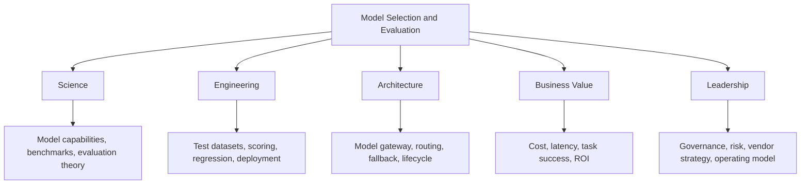

---

## 1. Why Model Selection Matters

The model is one of the most consequential design choices in an AI system.

It affects:

- answer quality
- reasoning quality
- hallucination behavior
- tool-use reliability
- structured output reliability
- latency
- throughput
- cost
- privacy
- data residency
- security
- observability
- vendor lock-in
- operational complexity
- user trust
- regulatory risk

A model that is excellent for one task may be poor for another.

Examples:

| Task | Model Requirement |
|---|---|
| Classify support ticket | low cost, high consistency |
| Summarize executive memo | strong synthesis, tone control |
| Generate code | code reasoning, correctness |
| Extract invoice fields | structured output accuracy |
| Answer policy question | grounding and refusal behavior |
| Analyze incident history | long context and reasoning |
| Recommend product | personalization and ranking |
| Call tools | reliable tool selection |
| Translate documents | multilingual quality |
| Detect unsafe content | safety classification |

No single model is best for every use case.

---

## 2. The Model Selection Fallacy

The most common mistake is assuming the best public benchmark model is the best enterprise model.

This is the **model selection fallacy**.

Public benchmarks are useful, but they rarely represent your exact business workflow.

They may not measure:

- your domain vocabulary
- your data formats
- your compliance requirements
- your latency target
- your cost model
- your retrieval pipeline
- your prompt templates
- your user behavior
- your edge cases
- your brand voice
- your security constraints

### Better Framing

Instead of:

```text
Which model has the highest benchmark score?
```

Ask:

```text
Which model achieves the required task success rate under our cost, latency, safety, and governance constraints?
```

---

## 3. Model Selection as Architecture

Model selection is part of system design.

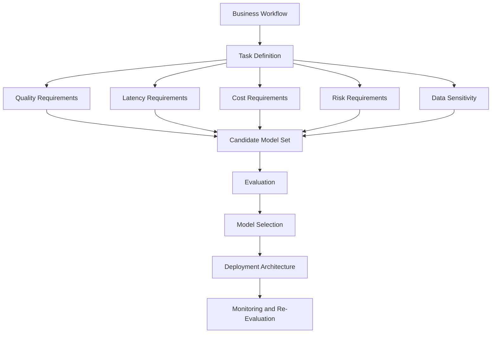

A good architecture may use multiple models:

- small model for routing
- embedding model for retrieval
- large model for complex reasoning
- specialized model for classification
- guardrail model for safety
- reranker model for retrieval quality
- deterministic code for calculations

The future of enterprise AI is not one model. It is model portfolios.

---

## 4. Model Categories

### 4.1 Proprietary API Models

These are accessed through managed APIs.

Advantages:

- fast adoption
- strong general capability
- managed infrastructure
- continuous improvement
- no GPU operations
- strong developer experience

Risks:

- vendor dependency
- data processing concerns
- cost at scale
- limited customization
- changing model behavior
- opaque internals
- regional/data residency constraints

### 4.2 Open-Weight Models

Open-weight models provide downloadable weights or deployable artifacts depending on license.

Advantages:

- deployment control
- potential cost control at scale
- customization
- private hosting
- reduced provider dependency
- fine-tuning flexibility

Risks:

- infrastructure complexity
- GPU cost
- operational burden
- security patching
- model serving complexity
- evaluation burden
- license constraints

### 4.3 Small Language Models

Small models are useful for narrow tasks.

Best for:

- classification
- extraction
- routing
- summarization at scale
- edge deployment
- low-latency workflows
- cost-sensitive applications

Advantages:

- low cost
- low latency
- easier deployment
- predictable behavior for narrow tasks

Risks:

- weaker reasoning
- weaker instruction following
- smaller context
- less robust to ambiguity

### 4.4 Frontier / Large Models

Large models are useful when reasoning and flexibility matter.

Best for:

- complex analysis
- executive synthesis
- code generation
- multi-step reasoning
- ambiguous tasks
- agentic planning
- cross-domain reasoning

Advantages:

- strong general capability
- better reasoning
- better instruction following
- stronger zero-shot performance

Risks:

- higher cost
- higher latency
- potential overuse
- still hallucinates
- may be unnecessary for simple tasks

### 4.5 Domain-Specific Models

Domain-specific models are adapted for specific industries or data types.

Examples:

- medical language
- legal documents
- financial analysis
- code
- cybersecurity
- customer support
- scientific literature

Advantages:

- better domain terminology
- potentially higher accuracy
- more aligned behavior

Risks:

- narrower generality
- vendor limitations
- expensive validation
- may still require RAG

### 4.6 Embedding Models

Embedding models convert content into vectors for retrieval, clustering, similarity, and recommendations.

Selection matters for:

- RAG quality
- semantic search
- recommendation systems
- duplicate detection
- incident similarity
- agent memory

### 4.7 Reranker Models

Rerankers reorder candidate retrieval results.

They are often critical for high-quality RAG.

### 4.8 Multimodal Models

Multimodal models process multiple input types:

- text
- images
- audio
- video
- documents
- screenshots
- charts

Useful for:

- document understanding
- field service images
- medical imaging support workflows
- insurance claims
- retail product images
- manufacturing inspection
- slide and chart analysis

### 4.9 Guardrail and Safety Models

Some models classify or moderate content.

Useful for:

- policy enforcement
- unsafe input detection
- output screening
- regulated workflows
- enterprise compliance

### 4.10 Current Model Landscape — Enterprise Reference

Enterprise architects need a working orientation to the model landscape. Specific capabilities, pricing, and availability change regularly — treat this table as a starting orientation, not a current specification.

**Frontier API Models (Accessed via Managed API)**

| Family | Provider | Enterprise Strengths |
|---|---|---|
| Claude (Haiku, Sonnet, Opus) | Anthropic | Long context, instruction following, tool use, safety design, enterprise governance |
| GPT-4o, o1, o3 | OpenAI | Strong reasoning, code, broad capability, wide ecosystem |
| Gemini Flash / Pro / Ultra | Google | Multimodal, very long context, Google Workspace integration |
| Command R+ | Cohere | RAG-optimized, reranking, multilingual retrieval |
| Nova, Titan | Amazon | Bedrock-native, cost-accessible, AWS-integrated |

**Open-Weight Models (Self-Hosted or Fine-Tuned)**

| Family | Provider | Enterprise Strengths |
|---|---|---|
| Llama 3.x / 4.x | Meta | Strong capability, broad fine-tuning ecosystem, widely supported |
| Mistral / Mixtral | Mistral AI | Efficient instruction following, European data residency option |
| Phi-4 / Phi-3 | Microsoft | Strong reasoning per parameter count, edge and on-device candidate |
| Qwen | Alibaba | Multilingual, long context, strong performance on structured tasks |
| Gemma | Google | Open-weight, efficient, designed for lower-resource deployment |

**Embedding Models**

| Model | Provider | Notes |
|---|---|---|
| text-embedding-3-large | OpenAI | High quality general-purpose baseline |
| amazon.titan-embed-text-v2 | Amazon | Bedrock-native, configurable dimensions |
| embed-english/multilingual-v3 | Cohere | Strong retrieval, multilingual |
| nomic-embed-text | Nomic | Open-weight, competitive enterprise RAG performance |

**Selection Principle**

> Do not choose a model by provider reputation or benchmark ranking alone. Run your own evaluation on representative tasks before committing to a model for a production workflow.

---

## 5. The Model Portfolio Pattern

A mature enterprise does not choose one model. It manages a portfolio.

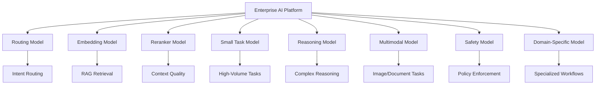

This pattern improves:

- cost control
- latency
- task fit
- resilience
- governance
- vendor flexibility

---

## 6. Model Selection Criteria

### 6.1 Quality

Quality depends on the task.

For summarization, quality means completeness and clarity.

For extraction, quality means field accuracy.

For RAG, quality means groundedness and citation accuracy.

For agents, quality means correct planning and tool use.

### 6.2 Cost

Cost includes:

- input tokens
- output tokens
- embedding cost
- reranking cost
- tool calls
- retries
- evaluation calls
- infrastructure
- engineering operations

### 6.3 Latency

Latency affects user experience and automation feasibility.

Latency-sensitive workflows include:

- customer chat
- agent assist
- call center support
- real-time recommendations
- fraud workflows
- device operations

### 6.4 Throughput

High-volume workflows need models that can handle scale.

Examples:

- ticket classification
- log summarization
- email triage
- document extraction
- content moderation

### 6.5 Reliability

Reliability includes:

- consistent output format
- stable behavior
- low retry rate
- predictable refusal behavior
- robust handling of edge cases

### 6.6 Safety

Safety includes:

- refusal behavior
- harmful content handling
- sensitive data handling
- compliance alignment
- bias considerations
- escalation behavior

### 6.7 Privacy and Data Residency

Some workflows require strict controls over:

- customer data
- financial data
- PHI
- PII
- trade secrets
- source code
- regulated records

### 6.8 Deployment Model

Options include:

- external API
- cloud provider managed service
- VPC/private endpoint
- self-hosted open-weight model
- on-prem deployment
- edge deployment
- hybrid deployment

### 6.9 Governance

Governance includes:

- model approval
- version tracking
- evaluation evidence
- risk classification
- access controls
- audit logs
- monitoring
- incident response
- rollback plan

---

## 7. Model Selection Scorecard

A model scorecard makes selection explicit.

| Dimension | Weight | Model A | Model B | Model C |
|---|---:|---:|---:|---:|
| Task quality | 25% | 4 | 5 | 3 |
| Groundedness | 15% | 4 | 4 | 3 |
| Structured output reliability | 10% | 5 | 3 | 4 |
| Latency | 10% | 3 | 2 | 5 |
| Cost | 15% | 2 | 3 | 5 |
| Safety behavior | 10% | 4 | 4 | 3 |
| Data/privacy fit | 10% | 3 | 4 | 5 |
| Operational fit | 5% | 4 | 3 | 4 |

The highest raw intelligence model may not win.

### Scorecard Rule

> Weight the scorecard based on the workflow, not generic preferences.

---

## 8. Task-Based Model Selection

Model selection should start with task type.

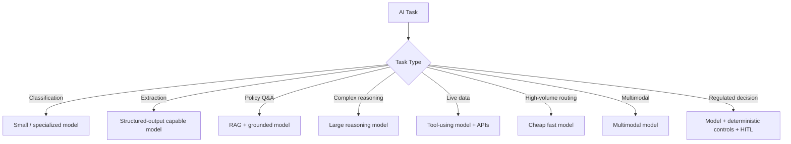

The task determines the model candidates.

---

## 9. Model Quality Is Multi-Dimensional

There is no single quality score.

### Quality Dimensions by Use Case

| Use Case | Quality Dimensions |
|---|---|
| Summarization | completeness, conciseness, faithfulness |
| RAG answer | groundedness, citation accuracy, refusal correctness |
| Extraction | field accuracy, schema validity, missing-value handling |
| Classification | precision, recall, F1 |
| Coding | correctness, security, maintainability, tests |
| Agent | plan quality, tool-use accuracy, stop conditions |
| Customer support | correctness, empathy, escalation, policy compliance |
| Executive brief | clarity, synthesis, risk framing, decision support |

---

## 10. The Evaluation Pyramid

Evaluation should happen at multiple layers.

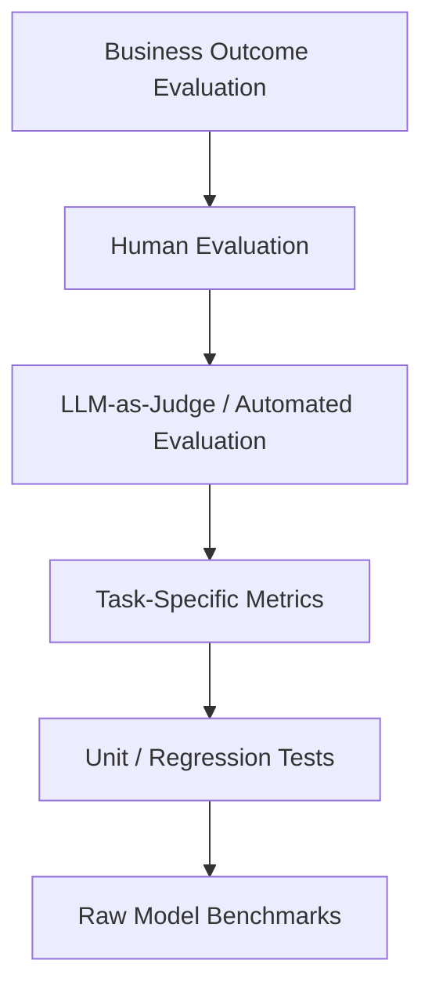

Raw benchmarks are the base. Business outcomes are the top.

Do not stop at benchmark scores.

---

## 11. Offline Evaluation

Offline evaluation uses prepared test datasets before production deployment.

### Offline Evaluation Inputs

- prompts
- test cases
- expected outputs
- source documents
- retrieval context
- user personas
- edge cases
- adversarial examples
- known failure cases

### Offline Evaluation Outputs

- quality scores
- latency
- cost
- failure categories
- safety issues
- regression results
- model comparison report

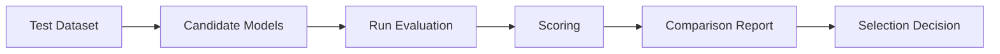

Offline evaluation is necessary but not sufficient. Real users behave differently.

---

## 12. Online Evaluation

Online evaluation measures performance in production or controlled rollout.

Methods:

- A/B testing
- canary releases
- shadow mode
- human-in-the-loop review
- user feedback
- business KPI tracking
- incident monitoring

### Online Evaluation Flow

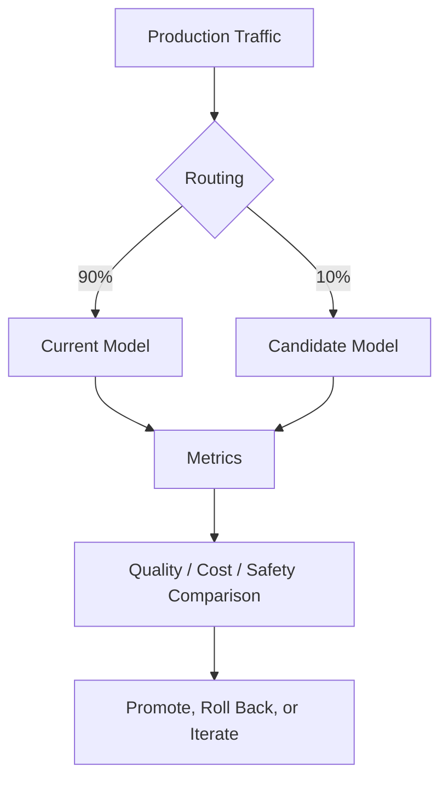

Online evaluation should include guardrails and rollback.

---

## 13. Human Evaluation

Humans are essential for evaluating:

- nuance
- usefulness
- policy interpretation
- tone
- trust
- judgment quality
- edge cases
- domain correctness

### Human Review Design

Reviewers should have:

- clear rubric
- examples
- scoring scale
- blind comparison when possible
- domain expertise
- calibration sessions
- disagreement resolution

### Human Evaluation Rubric Example

| Score | Meaning |
|---:|---|
| 5 | Correct, complete, grounded, useful |
| 4 | Mostly correct with minor issue |
| 3 | Partially correct but missing important detail |
| 2 | Significant issue or unsupported claim |
| 1 | Incorrect, unsafe, or unusable |

---

## 14. LLM-as-Judge

LLM-as-judge uses a model to evaluate model outputs.

Useful for:

- scaled evaluation
- regression testing
- groundedness checks
- style checks
- completeness checks
- safety checks

### Example Judge Prompt

```text
You are evaluating an AI answer for groundedness.

SOURCE CONTEXT:
{{source_context}}

ANSWER:
{{answer}}

Evaluate:
1. Is the answer fully supported by the source?
2. Does it add unsupported claims?
3. Does it contradict the source?
4. Are citations accurate?

Return JSON:
{
  "grounded": true/false,
  "unsupported_claims": [],
  "contradictions": [],
  "score": 0-5
}
```

### Risks

- judge bias
- model preference for longer answers
- inconsistent scoring
- inability to detect subtle domain errors
- evaluator model may share weaknesses with candidate model

### Rule

> Use LLM-as-judge to scale evaluation, not to eliminate human accountability.

---

## 15. Golden Datasets

A golden dataset is a curated set of representative test cases.

It should include:

- common user questions
- edge cases
- ambiguous inputs
- unsafe requests
- out-of-scope requests
- expected refusals
- known difficult cases
- domain-specific terminology
- multilingual examples if needed
- high-business-impact cases
- historically failed cases

### Golden Dataset Structure

```json
{
  "id": "support-001",
  "task_type": "policy_qa",
  "user_input": "Can I refund a customer after 45 days?",
  "context_sources": ["refund-policy-v3"],
  "expected_behavior": "Answer from policy and escalate if exception is requested.",
  "must_include": ["standard refund window", "exception approval"],
  "must_not_include": ["unsupported guarantee"],
  "risk_level": "medium"
}
```

### Dataset Principle

> Your evaluation dataset is a mirror of what your organization actually values.

If the dataset does not reflect the business workflow, the evaluation is not useful.

---

## 16. Regression Testing

A model or prompt change can break behavior.

Regression testing checks whether previously working cases still work.

Regression tests should be run when:

- model version changes
- prompt changes
- retrieval settings change
- embedding model changes
- tool definitions change
- guardrails change
- output schema changes
- application logic changes

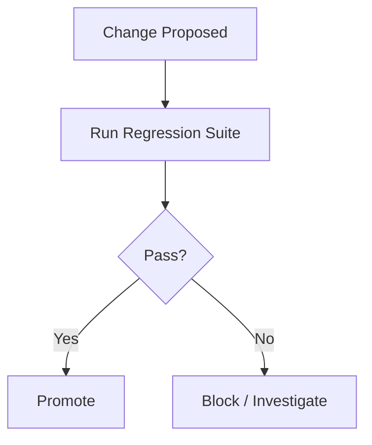

---

## 17. Evaluation Metrics by Task

### Classification

- accuracy
- precision
- recall
- F1 score
- confusion matrix

### Extraction

- field-level accuracy
- exact match rate
- missing value correctness
- schema validity
- invalid JSON rate

### Summarization

- completeness
- faithfulness
- conciseness
- relevance
- human usefulness

### RAG

- Recall@K
- Precision@K
- groundedness
- citation accuracy
- refusal correctness
- answer correctness

### Agents

- task completion rate
- tool-use accuracy
- number of steps
- loop rate
- human intervention rate
- unsafe action rate

### Customer-Facing Systems

- customer satisfaction
- containment rate
- escalation rate
- complaint rate
- compliance incident rate

### Business Workflows

- time saved
- cost per task
- error reduction
- revenue lift
- throughput improvement
- cycle time reduction

---

## 18. Precision, Recall, and F1 in AI Workflows

For classification and detection tasks, precision and recall matter.

### Precision

Precision answers:

> Of the items the model flagged, how many were actually correct?

High precision reduces false positives.

### Recall

Recall answers:

> Of all the items that should have been flagged, how many did the model find?

High recall reduces false negatives.

### F1 Score

F1 balances precision and recall.

### Business Tradeoff

The right balance depends on the use case.

| Use Case | Prefer |
|---|---|
| Fraud detection | high recall with review workflow |
| Executive alerting | high precision |
| Medical risk screening | high recall with human review |
| Marketing lead scoring | balance |
| Device failure prediction | depends on cost of false dispatch vs missed failure |
| Safety incident detection | high recall |

The metric should reflect the business cost of mistakes.

---

## 19. Model Evaluation for RAG Systems

For RAG, evaluate separately:

1. Retrieval quality
2. Generation quality
3. End-to-end user outcome

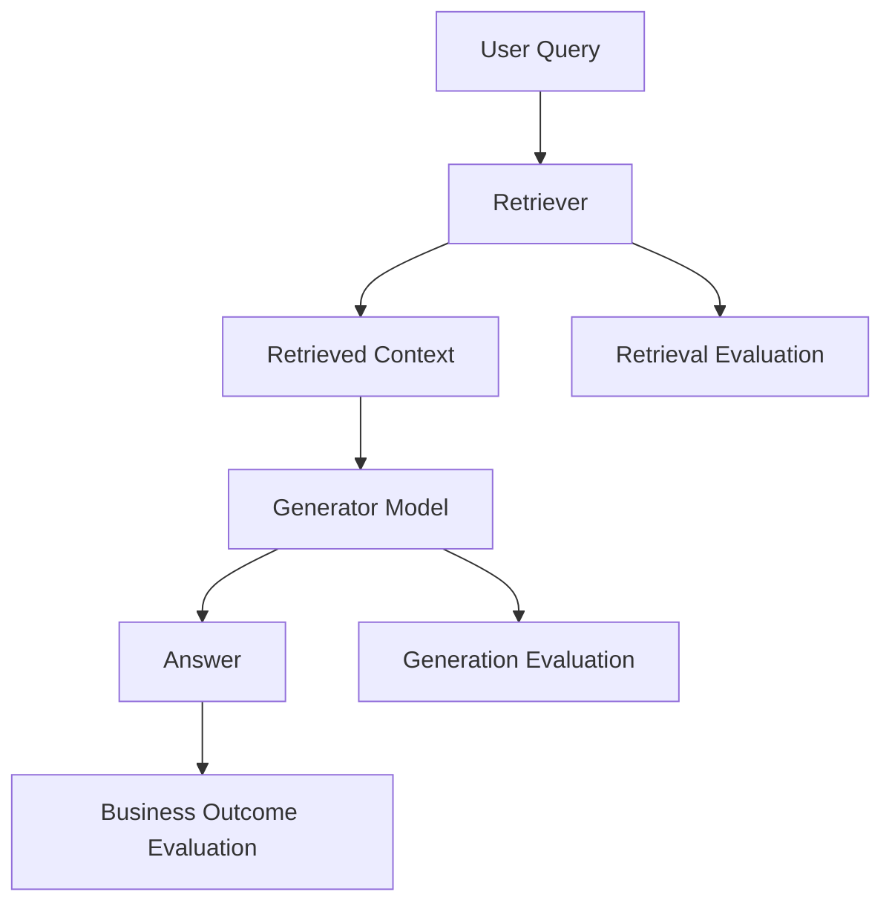

A weak answer may be caused by:

- wrong retrieval
- missing source documents
- bad prompt
- weak model
- poor citation handling
- stale knowledge
- ambiguous user question

Do not blame the model before inspecting retrieval.

---

## 20. Model Evaluation for Agents

Agents are harder to evaluate because they involve multi-step behavior.

Evaluate:

- planning quality
- tool selection
- tool input correctness
- memory use
- stopping behavior
- error recovery
- safety
- task completion
- cost per completed task
- human intervention rate

### Agent Evaluation Flow

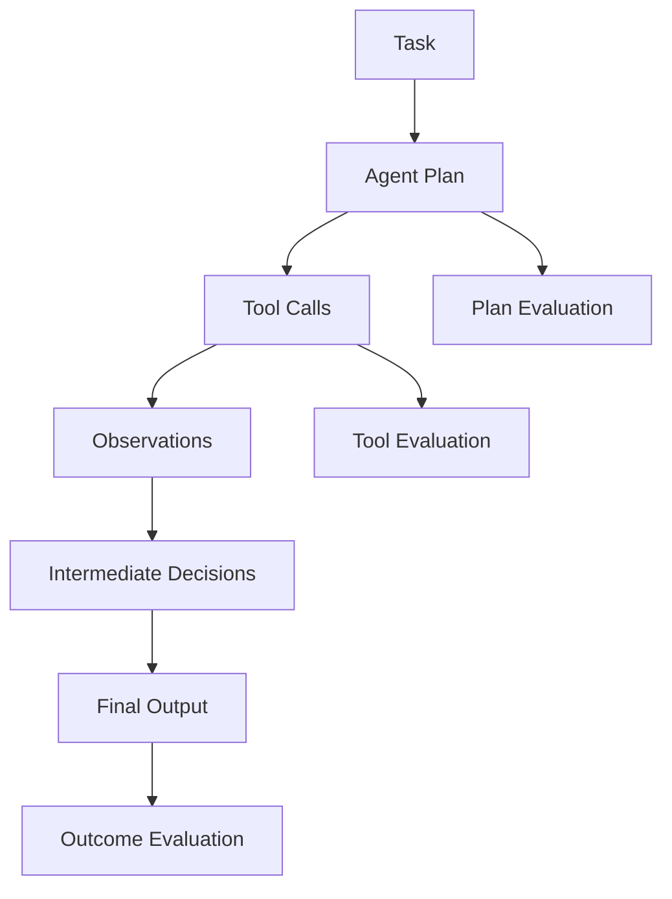

### Agent Failure Examples

- calls wrong tool
- calls tool with wrong parameters
- loops indefinitely
- stops too early
- trusts bad tool output
- takes unsafe action
- fails to ask for clarification
- writes confident but unsupported final answer

---

## 21. Model Latency

Latency is often the difference between a useful product and a failed product.

Latency components:

- network call
- queue time
- input token processing
- output generation
- retrieval
- reranking
- tool calls
- safety checks
- post-processing
- retries

### Latency Stack

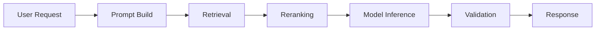

### Latency Targets by Workflow

| Workflow | Typical Expectation |
|---|---|
| Chat UI | low seconds |
| Agent assist during call | very low seconds |
| Batch summarization | minutes may be acceptable |
| Executive report | minutes may be acceptable |
| Background classification | async acceptable |
| Real-time recommendation | sub-second to low seconds |
| Incident response | low seconds to tens of seconds depending on severity |

---

## 22. Model Cost

Cost is not just price per token.

### Cost Drivers

- model size
- input token count
- output token count
- context window length
- retries
- tool calls
- retrieval calls
- reranking
- safety checks
- evaluation calls
- traffic volume
- peak capacity
- infrastructure
- support operations

### Cost per Successful Task

The best metric is not cost per token. It is cost per successful task.

```text
Cost per Successful Task =
Total AI Workflow Cost / Number of Successfully Completed Tasks
```

A cheap model that fails often may be more expensive than a premium model that succeeds reliably.

---

## 23. Model Routing

Model routing selects a model dynamically based on task.

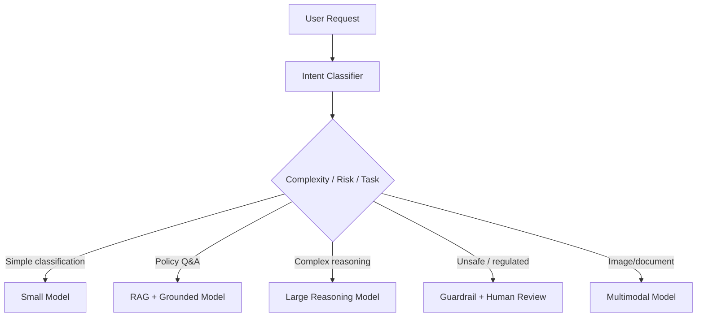

Routing improves:

- cost
- latency
- scalability
- task fit
- resilience

Routing risks:

- wrong route
- inconsistent behavior
- harder evaluation
- complex observability
- governance complexity

---

## 24. Fallback and Degradation

Production systems need fallback.

Fallback strategies:

- retry same model
- use alternate provider
- use smaller model with reduced capability
- use cached answer
- use search-only response
- ask clarifying question
- escalate to human
- return safe failure message
- queue for async processing

### Fallback Architecture

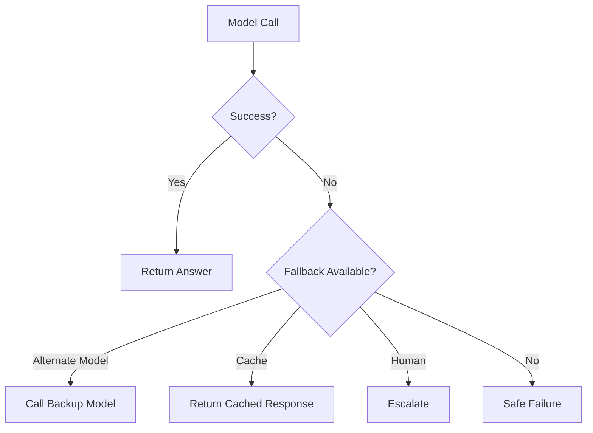

Every enterprise AI system should define failure behavior before launch.

---

## 25. Model Gateway Pattern

A model gateway centralizes model access.

It can provide:

- routing
- authentication
- authorization
- logging
- rate limiting
- prompt versioning
- cost tracking
- provider abstraction
- policy enforcement
- fallback
- observability
- evaluation hooks

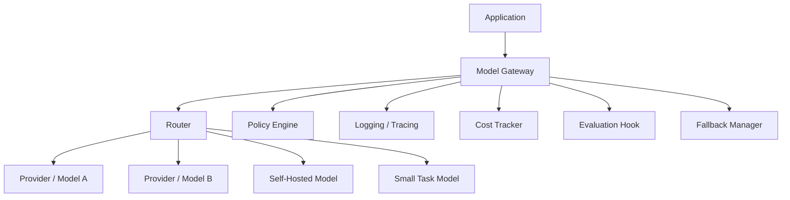

A gateway helps enterprises avoid uncontrolled model sprawl.

---

## 26. Model Registry

A model registry stores approved models and metadata.

### Registry Metadata

```yaml
model_id: enterprise-rag-generator-v1
provider: managed-api-provider
model_family: large-language-model
approved_use_cases:
  - policy_qa
  - support_assist
risk_level: medium
data_allowed:
  - internal
  - confidential
not_allowed:
  - regulated_medical_decision
  - autonomous_financial_transfer
evaluation_report: evals/rag-generator-v1-report.md
owner: ai-platform-team
approval_status: approved
last_reviewed: 2026-06-26
fallback_model: enterprise-rag-generator-backup-v1
```

A registry supports governance, auditability, and lifecycle management.

---

## 27. Model Lifecycle Management

Models change.

Prompts change.

Providers update behavior.

Enterprise systems need lifecycle management.

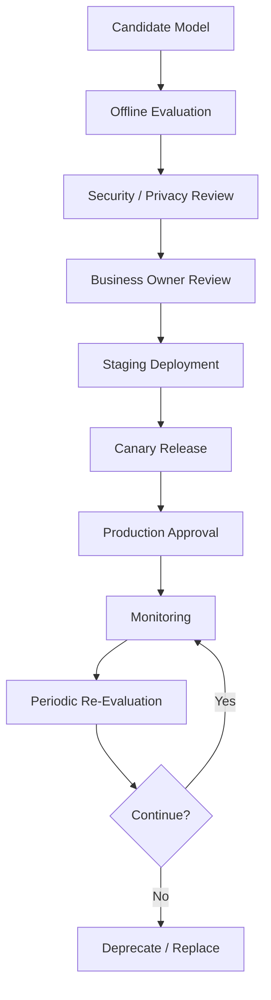

Lifecycle stages:

- candidate
- evaluated
- approved
- staged
- production
- monitored
- deprecated
- retired

---

## 28. Model Upgrade Testing

Model upgrades are risky.

A newer model may:

- improve reasoning
- change tone
- break JSON output
- become more verbose
- refuse more often
- refuse less often
- interpret prompts differently
- change tool-use behavior
- affect cost and latency

### Upgrade Checklist

- run golden dataset
- run safety tests
- run structured output tests
- run RAG groundedness tests
- run agent tool-use tests
- compare latency
- compare cost
- compare refusal behavior
- review human samples
- run canary
- define rollback

---

## 29. Managed API vs Self-Hosted Model

### Managed API

Use when:

- speed matters
- team does not want GPU operations
- provider security posture is acceptable
- workload benefits from frontier capability
- usage volume is moderate
- continuous provider improvements matter

### Self-Hosted

Use when:

- data control is critical
- latency/data residency requires it
- cost at scale favors self-hosting
- customization is important
- vendor dependency must be reduced
- open-weight model quality is sufficient

### Tradeoff Table

| Dimension | Managed API | Self-Hosted |
|---|---|---|
| Time to start | faster | slower |
| Operations | simpler | harder |
| Control | lower | higher |
| Cost at small scale | often better | often worse |
| Cost at large scale | depends | can be better |
| Security control | provider-dependent | enterprise-controlled |
| Customization | limited | higher |
| Model updates | provider-managed | team-managed |

---

## 30. Fine-Tuning Decision

Fine-tuning changes model behavior or adapts it to task patterns.

It is often overused.

Use fine-tuning when:

- prompt examples are too long
- task behavior is repetitive
- style consistency matters
- structured extraction must improve
- classification at scale needs cost reduction
- domain-specific patterns are stable

Do not use fine-tuning primarily to add frequently changing knowledge. Use RAG.

### Parameter-Efficient Fine-Tuning (PEFT)

Full fine-tuning updates all model parameters. For large models this requires significant GPU memory and long training runs, making it impractical for most enterprise teams.

**Parameter-Efficient Fine-Tuning (PEFT)** methods adapt a model by training a small number of additional parameters while keeping base model weights frozen. The most widely used method is **LoRA (Low-Rank Adaptation)**.

**LoRA** adds small trainable low-rank matrices alongside frozen attention weight matrices. Only the adapter matrices are updated during training. At inference time, adapters can be merged into the base model for zero overhead.

**QLoRA** combines LoRA with 4-bit quantization of the base model, dramatically reducing GPU memory requirements. This makes fine-tuning of 7B–70B parameter models accessible to teams without large GPU clusters.

### Fine-Tuning Method Comparison

| Method | GPU Requirement | Training Time | Trainable Params | When to Use |
|---|---|---|---|---|
| Full fine-tuning | Very high | Long | 100% | Large teams, strategic model, ample resources |
| LoRA | Moderate | Shorter | 1–5% | Most enterprise adaptation tasks |
| QLoRA | Low to moderate | Moderate | 1–5% | Resource-constrained teams, larger base models |
| Prompt tuning / prefix | Very low | Fast | < 1% | Narrow style/behavior change, very limited resources |

### Enterprise Fine-Tuning Checklist

Before committing to fine-tuning:

- [ ] Have we exhausted prompt engineering?
- [ ] Do we have at least 1,000–10,000 high-quality labeled examples?
- [ ] Is the task behavior stable (not rapidly changing knowledge)?
- [ ] Do we have GPU resources or budget for a training run?
- [ ] Do we have an evaluation dataset to measure improvement?
- [ ] Do we have a deployment plan for adapter or merged model?
- [ ] Does fine-tuning improve on the scorecard over prompting alone?
- [ ] Is the improvement worth the training and maintenance cost?

### Decision Flow

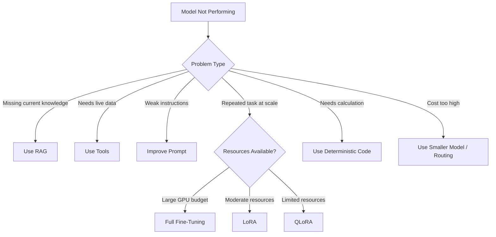

---

## 31. When Not to Use an LLM

LLMs are not always appropriate.

Do not use an LLM when:

- the task is deterministic
- exact calculation is required
- rules are simple and stable
- latency must be extremely low
- output must be formally guaranteed
- data cannot be sent to the model
- failure cost is unacceptable
- a database query solves the problem
- a search engine solves the problem
- a rules engine solves the problem

### Example

A tax calculation should not be performed by an LLM. The LLM may explain the result, but deterministic code should calculate it.

---

## 32. Model Selection by Risk Tier

Risk should shape model strategy.

| Risk Tier | Example | Model Strategy |
|---|---|---|
| Low | brainstorming email copy | flexible model, light review |
| Medium | support answer draft | RAG, citations, human review if uncertain |
| High | financial recommendation | strict grounding, compliance review |
| Critical | medical diagnosis, legal decision | AI support only, human professional decision |
| Safety-critical | industrial control | deterministic controls, AI advisory only |

### Risk-Based Architecture

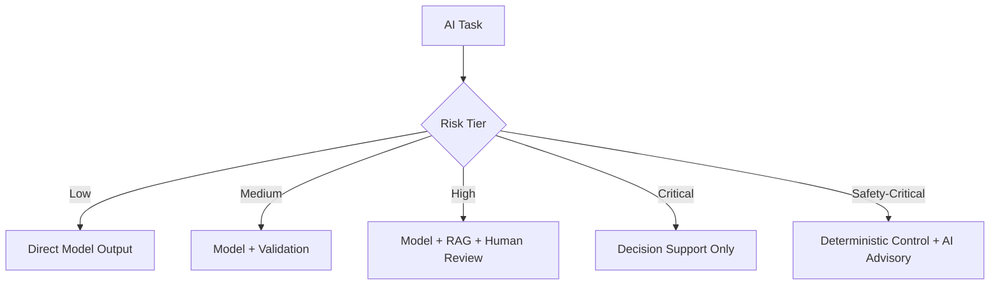

---

## 33. Safety and Refusal Evaluation

Models must be evaluated for correct refusal behavior.

Two failure types matter:

| Failure | Meaning |
|---|---|
| Over-refusal | model refuses safe requests |
| Under-refusal | model answers unsafe requests |

Both hurt business outcomes.

### Refusal Evaluation Dataset

Include:

- safe allowed requests
- unsafe requests
- ambiguous requests
- regulated requests
- prompt injection attempts
- sensitive data requests
- policy boundary cases

Measure:

- correct refusal rate
- over-refusal rate
- under-refusal rate
- escalation correctness
- explanation quality

---

## 34. Structured Output Evaluation

For enterprise workflows, structured output reliability is critical.

Measure:

- valid JSON rate
- schema compliance
- field accuracy
- enum correctness
- missing field handling
- retry rate
- downstream parse errors

### Structured Output Pipeline

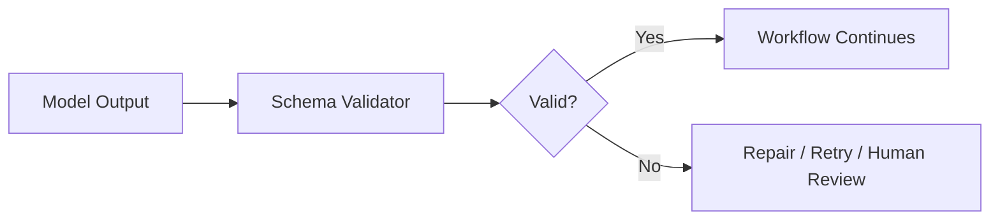

A model that writes beautiful prose but fails schema validation may be wrong for automation.

---

## 35. Tool-Use Evaluation

Models that use tools must be evaluated differently.

Metrics:

- correct tool selected
- correct parameters
- no unauthorized tool calls
- correct handling of tool failure
- no unnecessary tool calls
- final answer reflects tool result
- human approval requested when required

### Tool Evaluation Example

```json
{
  "input": "Create a refund ticket for customer 123, but do not issue refund yet.",
  "expected_tool": "create_ticket",
  "forbidden_tool": "issue_refund",
  "expected_behavior": "create ticket only and confirm no refund was issued"
}
```

Tool-use failures can create real-world consequences.

---

## 36. Multimodal Model Evaluation

Multimodal models require specialized tests.

Evaluate:

- chart interpretation
- image understanding
- document layout
- OCR quality
- table extraction
- visual reasoning
- screenshot interpretation
- safety issues
- hallucinated visual details

### Example Use Cases

- insurance claim image review
- equipment defect inspection
- retail shelf analysis
- document processing
- medical admin document review
- field service photo triage

---

## 37. Business Evaluation

Technical scores are not enough.

Business evaluation measures whether the model improves the workflow.

### Business Metrics

| Workflow | Business Metric |
|---|---|
| Support assistant | handle time, first-contact resolution |
| Sales copilot | conversion, deal velocity |
| HR assistant | employee self-service, ticket reduction |
| Engineering assistant | cycle time, defect reduction |
| Executive intelligence | decision speed, issue detection |
| Operations AI | incident resolution time, downtime reduction |
| Personalization | click-through, conversion, retention |

### Key Rule

> A model with slightly lower technical score may be better if it improves business outcomes at lower cost and risk.

---

## 38. AI Evaluation Dashboard

A production AI platform should include an evaluation dashboard.

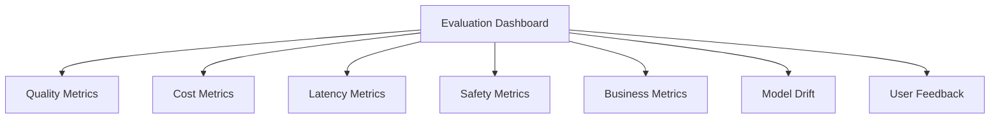

Dashboard metrics:

- task success rate
- hallucination rate
- groundedness
- schema validity
- latency p50/p95/p99
- cost per task
- escalation rate
- safety incidents
- customer satisfaction
- model/provider errors
- regression failures

---

## 39. Model Drift

Model drift occurs when performance changes over time.

Causes:

- user behavior changes
- product changes
- policy changes
- data changes
- model provider updates
- prompt changes
- retrieval corpus changes
- seasonality
- new edge cases

### Drift Detection

Monitor:

- quality scores
- user feedback
- escalation rate
- refusal rate
- cost per task
- latency
- failure categories
- business KPIs

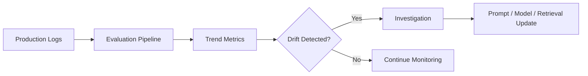

---

## 40. Model Governance

Model governance defines how models are approved, used, monitored, and retired.

Governance includes:

- approved model list
- risk tier
- allowed use cases
- prohibited use cases
- data classification rules
- evaluation evidence
- security review
- compliance review
- model owners
- monitoring requirements
- incident response
- deprecation plan

### Governance Workflow

```mermaid
flowchart TD
    A[Model Request] --> B[Use Case Review]
    B --> C[Risk Classification]
    C --> D[Security Review]
    D --> E[Evaluation Review]
    E --> F[Business Approval]
    F --> G[Model Registry]
    G --> H[Production Use]
    H --> I[Monitoring]
```

---

## 41. Vendor Strategy and Lock-In

Model providers evolve quickly.

Enterprise architecture should avoid unnecessary lock-in.

Lock-in sources:

- provider-specific prompt formats
- proprietary tool APIs
- provider-specific embeddings
- provider-specific vector stores
- closed evaluation tooling
- custom fine-tunes
- proprietary agent frameworks
- non-portable guardrails

### Mitigation

- use model gateway
- abstract provider calls
- store prompts separately
- version evaluation datasets
- use portable schemas
- keep source data independent
- avoid unnecessary provider-specific coupling
- design fallback providers where appropriate

---

## 42. Model Selection for AWS Bedrock-Oriented Architectures

For AWS-centric enterprises, model selection often happens through a managed model platform.

Architectural considerations:

- available model families
- region availability
- private networking
- IAM integration
- logging
- guardrails
- knowledge bases
- agents
- provisioned throughput
- cost management
- data residency
- enterprise procurement

### AWS-Oriented Pattern

```mermaid
flowchart TD
    A[Application] --> B[AI Gateway]
    B --> C[Policy and IAM]
    C --> D[Model Router]
    D --> E[Bedrock Model A]
    D --> F[Bedrock Model B]
    D --> G[Self-Hosted / External Model if Allowed]
    B --> H[Evaluation and Observability]
```

The exact model names and capabilities change over time. The architecture principle remains stable: route tasks to models based on evaluated fit.

---

## 43. Model Selection for Claude-Oriented Architectures

Claude-oriented systems often emphasize:

- instruction following
- long-context reasoning
- tool use
- document analysis
- safety behavior
- enterprise assistant workflows
- MCP integration

Evaluation should still be task-specific.

Do not assume a model is correct because it is strong generally. Validate it against:

- your prompts
- your tools
- your retrieval contexts
- your safety policies
- your users
- your business workflows

---

## 44. Model Selection for Open-Weight Architectures

Open-weight architectures require additional evaluation.

Consider:

- serving stack
- GPU availability
- quantization
- throughput
- latency
- context length
- fine-tuning needs
- security patching
- license
- monitoring
- model updates
- rollback
- operational expertise

### Open-Weight Deployment Pattern

```mermaid
flowchart TD
    A[Application] --> G[Model Gateway]
    G --> S[Self-Hosted Inference Service]
    S --> GPU[GPU Cluster]
    S --> O[Observability]
    S --> C[Autoscaling]
    S --> R[Model Registry]
```

Open-weight does not mean free. It shifts cost from API usage to infrastructure and operations.

---

## 45. Model Selection for High-Volume Workflows

High-volume workflows require cost discipline.

Examples:

- millions of classification calls
- support ticket routing
- email triage
- document tagging
- log summarization
- content moderation

Strategies:

- use small models
- batch processing
- cache repeated inputs
- use deterministic pre-filters
- route only hard cases to large models
- fine-tune for repeated tasks
- monitor cost per successful task

```mermaid
flowchart TD
    A[High Volume Requests] --> B[Rules / Simple Filters]
    B --> C{Confident?}
    C -->|Yes| D[Deterministic Output]
    C -->|No| E[Small Model]
    E --> F{Confident?}
    F -->|Yes| G[Output]
    F -->|No| H[Large Model / Human Review]
```

---

## 46. Model Selection for High-Risk Workflows

High-risk workflows require stronger controls.

Examples:

- financial decisions
- healthcare decisions
- legal workflows
- employment decisions
- safety-critical operations
- account termination
- large refunds
- compliance responses

Architecture should include:

- grounding
- deterministic policy checks
- human review
- audit logs
- confidence thresholds
- safe fallback
- refusal behavior
- escalation path
- post-decision review

---

## 47. Architecture Review Scenario

### Scenario

A company wants to deploy an enterprise AI assistant for customer support, sales enablement, internal policy Q&A, and executive summaries.

The team proposes using the most powerful available model for every request.

### Review Finding

This is not cost-effective or architecturally mature.

### Problems

- high cost for simple tasks
- unnecessary latency
- no task-specific evaluation
- no model routing
- no fallback
- no model governance
- no risk-based controls
- no business KPI linkage
- no structured output evaluation
- no RAG-specific evaluation
- no model upgrade testing

### Improved Architecture

```mermaid
flowchart TD
    U[User Request] --> G[AI Gateway]
    G --> I[Intent and Risk Classifier]

    I -->|Ticket classification| S[Small Model]
    I -->|Policy Q&A| R[RAG + Grounded Model]
    I -->|Executive summary| L[Large Reasoning Model]
    I -->|Unsafe / regulated| H[Human Review Workflow]
    I -->|Structured extraction| E[Extraction Model]

    S --> V[Validation]
    R --> V
    L --> V
    E --> V
    H --> V

    V --> O[Observability + Evaluation]
    V --> A[Application Response]
```

### Recommendation

Use a model portfolio and routing strategy. Evaluate each task separately. Optimize for quality, cost, latency, and risk.

---

## 48. Model Selection Decision Matrix

| Question | If Yes | Likely Strategy |
|---|---|---|
| Is the task deterministic? | Yes | Use code/rules |
| Does the task require private/current knowledge? | Yes | Use RAG |
| Does the task require live system state? | Yes | Use tools/API |
| Is the task high-volume and simple? | Yes | Use small model |
| Is the task complex and ambiguous? | Yes | Use large model |
| Is the task regulated/high-risk? | Yes | Use grounding + human review |
| Does model need repeated task behavior? | Yes | Consider fine-tuning |
| Is latency critical? | Yes | Smaller model/routing/cache |
| Is cost critical? | Yes | Model routing/small model |
| Is data highly sensitive? | Yes | private deployment/strict controls |

---

## 49. Lessons from the Field

### What Worked

Model selection works best when teams start from the workflow.

The most successful enterprise AI teams evaluate models against real tasks, real documents, real prompts, real users, and real business constraints.

What works:

- task-specific model scorecards
- golden datasets
- regression tests
- model routing
- small models for high-volume simple work
- large models for complex reasoning
- RAG for knowledge
- tools for live state
- deterministic systems for calculations
- human review for high-risk workflows
- cost per successful task tracking

---

### What Did Not Work

What fails:

- choosing models based only on hype
- using the largest model for every task
- trusting public benchmarks alone
- skipping human evaluation
- evaluating demos instead of workflows
- ignoring latency until production
- ignoring cost until adoption grows
- not testing model upgrades
- not measuring refusal behavior
- assuming model quality is stable over time

A model that looks great in a demo can fail when exposed to real enterprise ambiguity, messy data, policy constraints, and cost pressure.

---

### Common Mistakes

- Asking "which model is best?" instead of "best for what?"
- Ignoring cost per successful task.
- Using LLMs for deterministic work.
- Treating fine-tuning as a substitute for RAG.
- Not evaluating structured output reliability.
- Not testing with domain-specific data.
- Not separating retrieval failure from generation failure.
- Not planning fallback.
- Not maintaining a model registry.
- Not measuring business impact.
- Allowing every team to choose models independently.

---

### ROI Perspective

Model selection creates ROI when it improves business outcomes at acceptable cost.

A better model can create value by:

- increasing task completion
- reducing errors
- improving user trust
- reducing human workload
- improving conversion
- reducing escalations
- improving speed
- lowering operating cost

But a more expensive model can destroy ROI if used unnecessarily.

The best ROI often comes from:

- routing simple tasks to cheap models
- reserving large models for hard tasks
- caching repeated work
- combining RAG with good retrieval
- using deterministic systems where possible
- evaluating cost per successful task

---

### CTO Perspective

A CTO should ask:

- What models are approved?
- What use cases are approved for each model?
- What data can each model process?
- How are models evaluated?
- What is the cost per successful task?
- What is the latency profile?
- What is the fallback strategy?
- What happens when a provider changes the model?
- How do we avoid vendor lock-in?
- Who owns model governance?
- How do we know this model improves the business workflow?

If the team cannot answer these questions, model selection is not mature.

---

## 50. Pratik's Principles

### Principle 1: Best Model Means Best Fit

The best model is the one that best fits the task, constraints, and business outcome.

---

### Principle 2: Minimum Viable Intelligence Wins

Use the least expensive, least complex model that safely meets the requirement.

---

### Principle 3: Benchmarks Inform; Workflows Decide

Public benchmarks are starting points. Real enterprise workflows decide.

---

### Principle 4: Cost per Successful Task Matters More Than Cost per Token

A cheap model that fails repeatedly can be more expensive than a premium model that succeeds.

---

### Principle 5: Never Use an LLM Where Deterministic Code Is Required

Use models for ambiguity, language, judgment support, and synthesis. Use code for exactness.

---

### Principle 6: Evaluate Before You Trust

Every model must earn trust through task-specific evaluation.

---

### Principle 7: Model Selection Is Not a One-Time Decision

Models, providers, data, prompts, and business requirements change. Re-evaluate continuously.

---

### Principle 8: Govern the Model Portfolio

Uncontrolled model sprawl creates security, cost, and operational risk.

---

## 51. Hands-On Labs

### Lab 1: Build a Model Scorecard

Create a scorecard comparing three candidate models for a customer support assistant.

Evaluate:

- answer quality
- groundedness
- latency
- cost
- structured output reliability
- safety behavior
- privacy fit
- operational fit

Deliverable:

```text
labs/chapter-06-model-selection/model-scorecard.md
```

---

### Lab 2: Build a Golden Dataset

Create 50 test cases for a policy Q&A assistant.

Include:

- common questions
- edge cases
- ambiguous questions
- out-of-scope questions
- prompt injection attempts
- expected refusals
- required citations

Deliverable:

```text
golden-dataset.json
```

---

### Lab 3: Compare Small vs Large Model

Run the same classification task through:

- a small/cheap model
- a large/reasoning model

Measure:

- accuracy
- latency
- cost
- failure cases

Deliverable:

```text
small-vs-large-model-report.md
```

---

### Lab 4: Build an LLM-as-Judge Evaluator

Create an evaluator prompt for groundedness and completeness.

Inputs:

- source context
- candidate answer
- expected behavior

Outputs:

```json
{
  "grounded": true,
  "complete": true,
  "unsupported_claims": [],
  "score": 4
}
```

Deliverable:

```text
judge-evaluator.md
```

---

### Lab 5: Design a Model Router

Build a simple routing table:

| Intent | Risk | Model |
|---|---|---|
| classification | low | small model |
| policy Q&A | medium | RAG model |
| executive synthesis | medium | large model |
| regulated decision | high | human review |

Deliverable:

```text
model-router-design.md
```

---

### Lab 6: Model Upgrade Regression Test

Simulate a model upgrade.

Compare:

- old model
- new model

Using:

- golden dataset
- structured output tests
- safety tests
- latency/cost comparison

Deliverable:

```text
model-upgrade-evaluation-report.md
```

---

## 52. Interview Questions

### Engineering-Level Questions

1. How do you choose between two LLMs for a task?
2. What is a golden dataset?
3. How do you evaluate structured output reliability?
4. What is LLM-as-judge?
5. What are the risks of LLM-as-judge?
6. How do you measure cost per successful task?
7. When would you use a smaller model?
8. When would you use a larger model?
9. When should you use deterministic code instead of an LLM?
10. How do you test a model upgrade?

### Architect-Level Questions

1. Design a model gateway for an enterprise AI platform.
2. How would you build a model routing strategy?
3. How would you evaluate models for RAG?
4. How would you evaluate models for agents?
5. How would you design fallback across model providers?
6. How would you avoid vendor lock-in?
7. How would you govern a model portfolio?
8. How would you compare managed API vs self-hosted models?
9. How would you design a model registry?
10. How would you evaluate model drift?

### Director / VP / CTO-Level Questions

1. How do you decide which models are approved for enterprise use?
2. How do you control AI model cost across teams?
3. How do you measure ROI from model selection?
4. What model risks should executives understand?
5. How do you prevent model sprawl?
6. How do you decide build vs buy for model hosting?
7. How do you handle provider outages or model behavior changes?
8. How do you align model selection with data governance?
9. How do you explain model evaluation to a CEO?
10. What would make you reject the most capable model?

---

## 53. Certification Mapping

### AWS AI / Generative AI Professional Preparation

This chapter supports topics related to:

- model selection
- foundation model evaluation
- Amazon Bedrock model choice
- inference parameters
- cost and latency tradeoffs
- model evaluation
- responsible AI
- guardrails
- deployment strategy
- model monitoring
- RAG model selection
- agent model selection

### Anthropic Claude / MCP Architecture Preparation

This chapter supports topics related to:

- Claude model selection
- tool-use evaluation
- context window tradeoffs
- model behavior testing
- safety behavior
- MCP tool interaction evaluation
- agent evaluation
- enterprise model governance

### NVIDIA Generative AI Preparation

This chapter supports topics related to:

- self-hosted model tradeoffs
- inference optimization
- GPU cost
- throughput and latency
- model serving
- quantization considerations
- deployment architecture
- workload-based model selection

---

## 54. Chapter Exercises

### Exercise 1

Design a model selection scorecard for an enterprise customer support assistant.

Include:

- task quality
- groundedness
- latency
- cost
- safety
- structured output reliability
- privacy
- operational fit

---

### Exercise 2

A team wants to use the largest available model for all AI tasks.

Write an architecture review explaining why this may be wrong and propose a model routing strategy.

---

### Exercise 3

Create a golden dataset for a device operations assistant.

Include:

- telemetry explanation questions
- incident similarity questions
- runbook questions
- ambiguous questions
- unsafe action requests
- out-of-scope requests

---

### Exercise 4

Compare managed API and self-hosted open-weight deployment for a financial services company.

Evaluate:

- security
- cost
- latency
- compliance
- operations
- vendor lock-in
- customization

---

### Exercise 5

Design a model governance workflow for a healthcare company.

Include:

- approval
- evaluation
- risk tiering
- human review
- monitoring
- incident response
- retirement

---

## 55. Key Terms

| Term | Meaning |
|---|---|
| Model selection | Process of choosing the best-fit model for a task and constraints |
| Model evaluation | Measuring model quality, safety, latency, cost, and business impact |
| Golden dataset | Curated representative evaluation dataset |
| Regression testing | Testing whether changes break previously working cases |
| LLM-as-judge | Using a model to evaluate another model's output |
| Model gateway | Central access and control layer for model calls |
| Model router | Component that selects a model based on task/risk |
| Model registry | Approved inventory of models and metadata |
| Cost per successful task | Total workflow cost divided by successful task completions |
| Model drift | Performance or behavior change over time |
| Fine-tuning | Updating model behavior using task-specific training data |
| Self-hosting | Running models on enterprise-managed infrastructure |
| Managed API | Accessing models through a provider-hosted service |
| Fallback model | Backup model used when primary model fails |
| Canary release | Limited rollout to test a candidate model |
| Model portfolio | Collection of models used for different enterprise tasks |

---

## 56. One-Page Executive Brief

Model selection is a business and architecture decision, not a leaderboard contest.

The best model is not always the largest, newest, or most expensive model. The best model is the one that delivers the required business outcome within acceptable cost, latency, risk, security, and governance constraints.

Enterprises should evaluate models against their own workflows, data, users, and success metrics. Public benchmarks are useful starting points, but they do not replace task-specific evaluation.

A mature enterprise AI platform will use a portfolio of models:

- small models for high-volume simple tasks
- large models for complex reasoning
- embedding models for retrieval
- rerankers for RAG quality
- safety models for guardrails
- multimodal models for image/document workflows
- deterministic code for exact calculations

The key operating metric is not cost per token. It is cost per successful task.

Model governance should include:

- approved model registry
- allowed use cases
- data classification rules
- evaluation reports
- security and compliance review
- cost tracking
- monitoring
- fallback
- upgrade testing
- retirement process

The executive question is:

> Which model portfolio gives us the best business outcome at the lowest acceptable cost and risk?

---

## 57. Chapter Summary

In this chapter, we examined model selection and evaluation as a core enterprise AI architecture discipline.

We learned that model selection should begin with the business workflow, not public benchmark rankings. We compared model categories, including proprietary API models, open-weight models, small models, large models, domain-specific models, embedding models, rerankers, multimodal models, and safety models.

We explored model scorecards, task-based selection, offline evaluation, online evaluation, human evaluation, LLM-as-judge, golden datasets, regression testing, RAG evaluation, agent evaluation, latency, cost, routing, fallback, model gateways, model registries, lifecycle management, upgrade testing, fine-tuning decisions, risk-tiered selection, governance, vendor strategy, and ROI.

The key lesson is:

> Model selection is not about maximum intelligence. It is about minimum viable intelligence that reliably delivers measurable business value.

In Chapter 7, we move into Agentic AI Fundamentals: what agents are, when they create value, when they are overkill, and how to think about goal-oriented AI systems in the enterprise.

---

## 58. Suggested Git Commit

```bash
mkdir -p chapters
cp 06-model-selection-and-evaluation.md chapters/06-model-selection-and-evaluation.md

git add chapters/06-model-selection-and-evaluation.md
git commit -m "Add Chapter 6: Model Selection and Evaluation"
git push origin main
```
