# Chapter 7 — Agentic AI Fundamentals

**Book:** The AI Architect & Practitioner Bootcamp  
**Chapter Status:** Complete Draft  
**Version:** 0.1  
**Author:** Pratik Desai  
**Primary Audience:** AI engineers, enterprise architects, senior software engineers, platform engineers, engineering leaders, product leaders, consultants, directors, VPs, CTO-track practitioners, and certification candidates

---

## Chapter Thesis

Agentic AI is not about making AI autonomous for its own sake.

Agentic AI is about giving AI systems enough **goal-directed behavior, tool access, memory, state, feedback, and constraints** to complete valuable workflows under explicit human accountability.

A chatbot responds.

A RAG assistant answers with retrieved knowledge.

An agent pursues a goal across steps.

But this distinction must be handled carefully. Many systems marketed as "agents" are only workflows with an LLM in the middle. Many business problems do not need agents at all. A deterministic workflow, RAG assistant, rules engine, search system, or traditional automation may be simpler, cheaper, safer, and easier to operate.

The key idea:

> Agentic AI is valuable when the system must reason over a goal, decide what to do next, use tools, maintain state, adapt to feedback, and stop safely.

Enterprise agentic AI is not magic autonomy. It is controlled autonomy inside an architecture.

---

## Learning Objectives

By the end of this chapter, you will be able to:

- Define what an AI agent is and what it is not.
- Explain the difference between chatbots, RAG assistants, workflows, copilots, and agents.
- Understand why agents emerged from the limitations of single-turn LLM applications.
- Describe the core components of an agent: goal, state, planning, tools, memory, feedback, policies, and stop conditions.
- Compare deterministic workflows and agentic workflows.
- Explain autonomy levels and when each level is appropriate.
- Identify common enterprise agent use cases.
- Recognize agent failure modes such as loops, tool misuse, goal drift, memory errors, and unsafe actions.
- Design basic agent control boundaries.
- Understand human-in-the-loop and human-on-the-loop patterns.
- Explain why agents require stronger evaluation than simple LLM applications.
- Discuss agentic AI from engineering, architecture, business, and CTO perspectives.

---

## Executive Summary

Agentic AI extends LLM applications from answer generation to goal-oriented workflow execution.

An agent can interpret a goal, decide what information is needed, call tools, observe results, update state, make intermediate decisions, and produce an outcome. Agents are useful when workflows are dynamic, ambiguous, multi-step, and require adaptation.

However, agents are also risky. They can loop, call the wrong tools, misunderstand goals, overuse autonomy, create unnecessary cost, expose data, or take actions that should require human approval.

The central enterprise question is not:

> Can we build an agent?

The central enterprise question is:

> Should this workflow be agentic, deterministic, human-led, or a hybrid?

Agentic AI should be used when the business workflow justifies the added complexity. The best enterprise agents are not fully unconstrained. They operate inside boundaries:

- explicit goals
- scoped tools
- permission checks
- state management
- memory policies
- evaluation
- observability
- cost controls
- human approval gates
- rollback mechanisms
- stop conditions

The architecture lesson:

> Agents are not a replacement for workflows. They are a way to make selected workflow steps adaptive under controlled conditions.

---

## Business Motivation

Enterprises are interested in agents because many business processes are not single-step tasks.

Examples:

- diagnose an incident
- research a customer problem
- prepare an account plan
- triage a support ticket
- reconcile missing information
- compare contracts
- summarize risk
- monitor operational signals
- coordinate follow-up actions
- generate an executive briefing
- assist a field technician
- investigate device failures
- handle customer service exceptions

These workflows require multiple steps. They may require data from several systems. They may require judgment, clarification, escalation, and synthesis.

Traditional automation struggles when workflows are ambiguous or variable.

Agentic AI creates business value when it:

- reduces manual coordination
- accelerates investigations
- improves consistency
- reduces handoffs
- increases throughput
- helps employees complete complex tasks
- improves customer response time
- reduces operational risk
- provides decision support
- connects knowledge, tools, and action

But agents can also destroy value if poorly designed.

They can increase cost, create risk, slow down workflows, confuse users, and produce unreliable actions. The ROI of agents depends on whether adaptive reasoning improves the workflow more than it increases complexity.

---

## The Five-Lens Framework for This Chapter

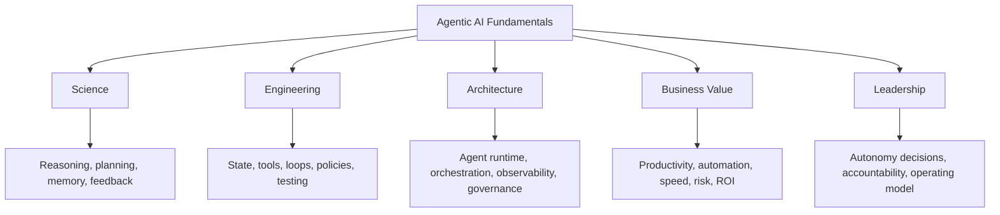

---

## 1. What Is an AI Agent?

An AI agent is a system that can pursue a goal by deciding and taking steps.

A practical definition:

> An AI agent is a goal-directed software system that uses an AI model to decide what step to take next, often using tools, memory, state, and feedback to complete a task.

An agent usually includes:

- a goal
- a model
- instructions
- state
- memory
- tools
- planning logic
- observations
- decision loop
- safety constraints
- termination conditions

### Basic Agent Loop

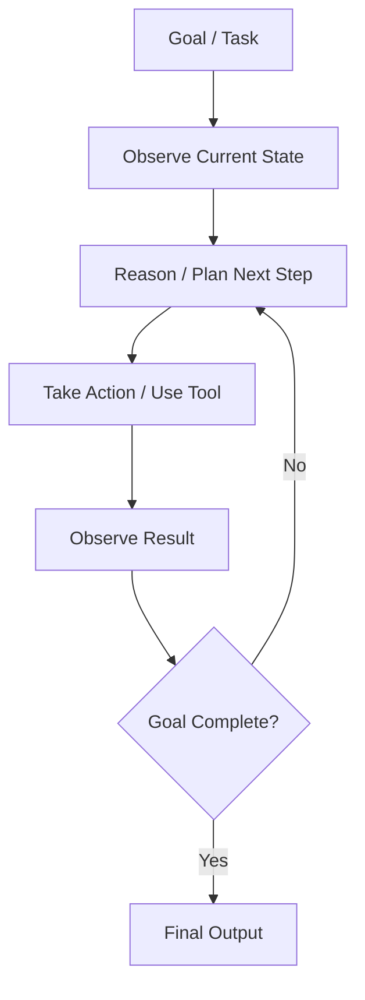

This loop is what separates agents from simple single-turn LLM calls.

### Python: Basic Agent Loop

The following skeleton implements the minimal agent loop — the decide-act-observe cycle — with explicit stop conditions, bounded iterations, and structured state. This is the foundation that all agent architecture patterns in Chapter 8 build on.

```python
from dataclasses import dataclass, field
from typing import Optional, Callable
import json

# --- Tool definition ---

@dataclass
class AgentTool:
    """
    A tool the agent can request.
    name: tool identifier the model uses
    description: tells the model what the tool does and when to use it
    execute: the actual function (authorized, validated, auditable)
    """
    name: str
    description: str
    execute: Callable[[dict], str]

# --- Agent state ---

@dataclass
class AgentState:
    goal: str
    observations: list[str] = field(default_factory=list)
    tool_calls: list[dict] = field(default_factory=list)
    errors: list[dict] = field(default_factory=list)
    final_answer: Optional[str] = None
    step_count: int = 0
    max_steps: int = 10
    total_cost_tokens: int = 0

# --- Simple agent loop ---

def run_agent(
    goal: str,
    tools: list[AgentTool],
    model_client,
    system_prompt: str,
    max_steps: int = 10
) -> AgentState:
    """
    Minimal agent loop: decide → act → observe → repeat.

    The model decides which tool to call (or to finish).
    The loop executes the tool, adds the result to state, and continues.
    Explicit stop conditions prevent runaway execution.
    """
    state = AgentState(goal=goal, max_steps=max_steps)

    # Build tool descriptions for the model
    tool_descriptions = "\n".join([
        f"- {t.name}: {t.description}" for t in tools
    ])
    tool_registry = {t.name: t for t in tools}

    while state.step_count < state.max_steps:
        state.step_count += 1

        # --- Build prompt for current step ---
        observation_text = "\n".join(state.observations) or "No observations yet."
        prompt = f"""Goal: {goal}

Available tools:
{tool_descriptions}

Observations so far:
{observation_text}

Decide the next action. Respond with EXACTLY one of:
1. A tool call as JSON: {{"tool": "<name>", "params": {{...}}}}
2. A final answer: {{"done": true, "answer": "<answer>"}}

If you do not have enough information, call a tool.
If the goal is complete, provide the final answer.
"""

        # --- Ask model ---
        response = model_client.complete(
            system=system_prompt,
            messages=[{"role": "user", "content": prompt}],
            max_tokens=500,
            temperature=0.0
        )
        state.total_cost_tokens += response.usage.total_tokens

        # --- Parse model decision ---
        try:
            decision = json.loads(response.text.strip())
        except json.JSONDecodeError:
            state.errors.append({
                "step": state.step_count,
                "error": "Model did not return valid JSON",
                "raw": response.text[:200]
            })
            break

        # --- Check for completion ---
        if decision.get("done"):
            state.final_answer = decision.get("answer", "")
            break

        # --- Execute tool ---
        tool_name = decision.get("tool")
        tool_params = decision.get("params", {})

        if tool_name not in tool_registry:
            state.errors.append({
                "step": state.step_count,
                "error": f"Unknown tool: {tool_name}"
            })
            break

        try:
            tool_result = tool_registry[tool_name].execute(tool_params)
            state.tool_calls.append({
                "step": state.step_count,
                "tool": tool_name,
                "params": tool_params,
                "result": tool_result[:500]  # Truncate for state
            })
            state.observations.append(
                f"Step {state.step_count} — {tool_name}: {tool_result}"
            )
        except Exception as e:
            state.errors.append({
                "step": state.step_count,
                "tool": tool_name,
                "error": str(e)
            })
            break  # Safe stop on tool error

    # Escalate if max steps reached without completion
    if state.step_count >= state.max_steps and not state.final_answer:
        state.final_answer = None  # Caller handles escalation

    return state


# --- Example tools ---

def search_incidents_tool(params: dict) -> str:
    """Placeholder — replace with real authorized API call."""
    product = params.get("product", "unknown")
    return f"Found 3 recent incidents for {product}: [heartbeat-2026-01, timeout-2026-02, config-2026-03]"

def get_runbook_tool(params: dict) -> str:
    """Placeholder — replace with real authorized KB retrieval."""
    incident_type = params.get("incident_type", "unknown")
    return f"Runbook for {incident_type}: 1. Check network. 2. Verify firmware. 3. Restart service."


# --- Usage ---
# tools = [
#     AgentTool("search_incidents", "Search for recent incidents by product.", search_incidents_tool),
#     AgentTool("get_runbook", "Retrieve troubleshooting runbook by incident type.", get_runbook_tool)
# ]
# result = run_agent(goal="Investigate heartbeat failures for payments terminals",
#                    tools=tools, model_client=my_client,
#                    system_prompt="You are an operations investigation agent.")
# print(result.final_answer or "Agent did not complete — escalate")
```

### Key Engineering Notes

- `max_steps` is the non-negotiable cost and safety guard — always set it
- Tool execution is wrapped in try/except — errors stop the loop safely rather than silently continuing
- `total_cost_tokens` tracks spend across the loop — wire this to your cost dashboard
- The model response is forced to JSON — structured outputs dramatically reduce parsing failures
- This is a synchronous single-thread loop; Chapter 9 shows how to implement this as a checkpointed LangGraph for production durability

---

## 2. What an Agent Is Not

The word "agent" is often overused.

An agent is not automatically:

- any chatbot
- any prompt
- any RAG assistant
- any automation script
- any workflow with an LLM step
- any tool-calling API
- any scheduled job
- any copilot UI
- any multi-step pipeline

A system becomes agentic when the AI component participates in deciding what to do next based on goal, context, state, and feedback.

### Comparison

| System Type | What It Does | Agentic? |
|---|---|---|
| Chatbot | responds to user messages | usually no |
| RAG assistant | answers using retrieved knowledge | usually no |
| Rules workflow | follows predefined steps | no |
| LLM workflow | uses LLM in fixed pipeline | partially, but often no |
| Tool-using assistant | calls tools when instructed | maybe |
| Planner-executor system | plans and executes steps | yes |
| Autonomous workflow agent | adapts actions toward a goal | yes |
| Multi-agent system | multiple agents coordinate | yes, if agents make decisions |

---

## 3. Why Agents Emerged

Single-turn LLM applications are useful but limited.

They can:

- answer questions
- summarize text
- classify content
- generate drafts
- extract fields
- rewrite messages

But many enterprise workflows require more:

- deciding what information is needed
- searching multiple systems
- calling APIs
- comparing conflicting evidence
- asking clarifying questions
- handling missing data
- adapting when a tool fails
- escalating risk
- tracking progress
- completing multi-step tasks

Agents emerged because real work is often iterative.

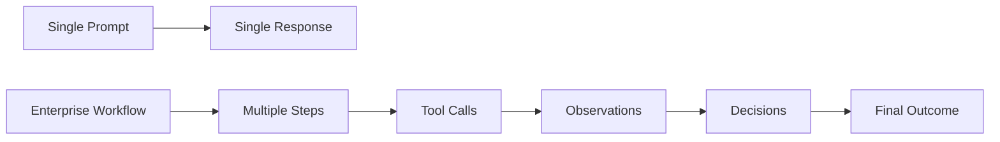

Agentic AI attempts to bridge the gap between language intelligence and workflow execution.

---

## 4. Chatbot vs RAG Assistant vs Agent

### Chatbot

A chatbot responds conversationally.

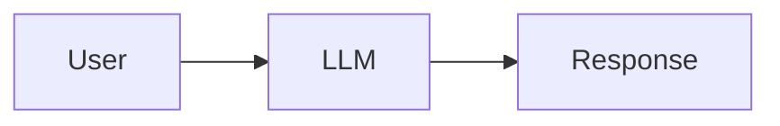

### RAG Assistant

A RAG assistant retrieves knowledge and answers.

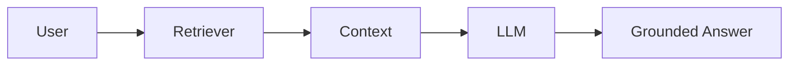

### Agent

An agent decides and acts over multiple steps.

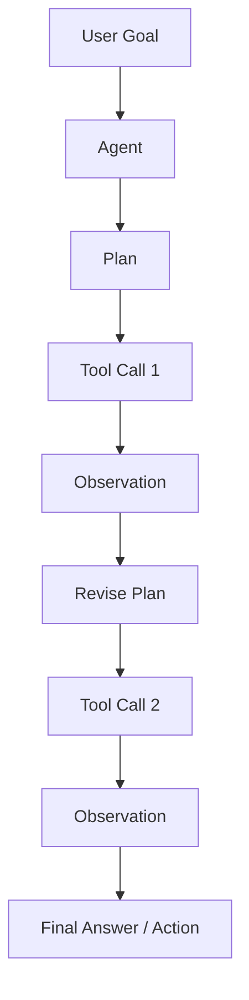

### Key Difference

A chatbot answers.

A RAG assistant grounds.

An agent pursues.

---

## 5. Agentic AI vs Workflow Automation

Traditional workflow automation follows predefined steps.

Agentic workflows can adapt.

### Deterministic Workflow

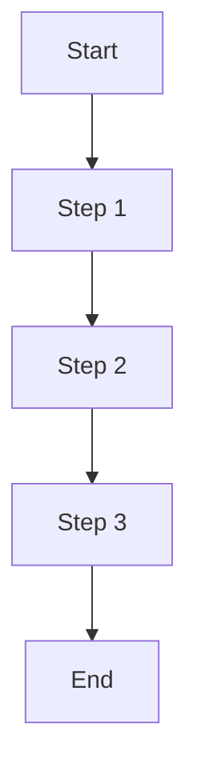

### Agentic Workflow

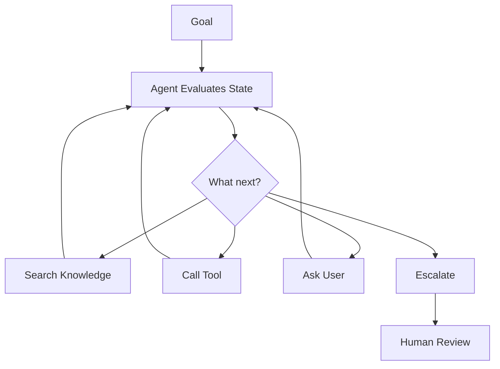

### When Deterministic Workflows Are Better

Use deterministic workflows when:

- steps are known
- rules are stable
- exactness matters
- auditability is critical
- cost must be predictable
- failure tolerance is low
- workflow rarely changes

### When Agents Are Better

Use agents when:

- steps vary by case
- information is incomplete
- the path depends on observations
- multiple tools may be needed
- judgment is required
- exception handling is frequent
- humans currently coordinate manually

---

## 6. The Core Components of an Agent

### 6.1 Goal

The goal defines what the agent is trying to accomplish.

Examples:

- "Diagnose why devices are missing heartbeat."
- "Prepare a customer account risk summary."
- "Triage this support case."
- "Draft an executive incident brief."
- "Find the correct policy and recommend next step."

A weak goal creates weak agent behavior.

### 6.2 Instructions

Instructions define how the agent should behave.

They include:

- role
- task boundaries
- safety rules
- tool-use policy
- escalation criteria
- output format
- stop conditions

### 6.3 State

State is the current working context of the agent.

It may include:

- user request
- current plan
- tool results
- retrieved documents
- intermediate decisions
- confidence
- errors
- approvals
- final output draft

### 6.4 Tools

Tools allow agents to act outside the model.

Examples:

- search knowledge base
- query CRM
- create ticket
- check inventory
- retrieve telemetry
- send email draft
- update workflow status
- run calculation
- call API

### 6.5 Memory

Memory allows the agent to retain information across steps or sessions.

Types:

- short-term state
- conversation memory
- task memory
- user preference memory
- episodic memory
- semantic memory

### 6.6 Planning

Planning is how the agent decides steps.

Planning can be:

- implicit
- explicit
- fixed
- dynamic
- hierarchical
- human-approved

### 6.7 Observation

Observation is the result of an action.

Example:

- tool output
- retrieval results
- API response
- user clarification
- validation result
- error message

### 6.8 Policy

Policy defines what the agent is allowed to do.

Policies may include:

- access control
- data handling
- tool permissions
- human approval rules
- compliance boundaries
- spending limits
- safety constraints

### 6.9 Stop Condition

A stop condition defines when the agent must stop.

Examples:

- goal complete
- confidence too low
- max steps reached
- tool failure
- risk threshold exceeded
- human approval required
- user requested stop

### Agent Component Diagram

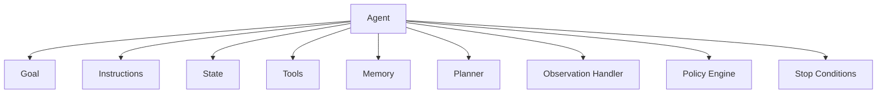

---

## 7. Agent State

State is critical in agent systems.

Without state, the system cannot reliably track what has happened.

### Example State Object

```json
{
  "task_id": "incident-analysis-2026-001",
  "goal": "Analyze heartbeat failures in region A",
  "current_step": "compare_recent_incidents",
  "plan": [
    "retrieve telemetry summary",
    "search similar incidents",
    "check firmware release notes",
    "recommend next diagnostic step"
  ],
  "observations": [
    {
      "tool": "telemetry_query",
      "result": "heartbeat failures increased 18% after firmware 3.2 rollout"
    }
  ],
  "risk_level": "medium",
  "requires_human_review": false,
  "step_count": 3,
  "max_steps": 8
}
```

### State Design Questions

- What must persist between steps?
- What should be visible to the model?
- What should remain deterministic outside the model?
- What should be logged?
- What is sensitive?
- What can be forgotten?
- What is needed for audit?

---

## 8. Agent Memory

Memory is powerful but risky.

Memory can help agents:

- personalize responses
- avoid repeated questions
- remember task context
- learn user preferences
- maintain project continuity

Memory can also introduce:

- stale assumptions
- privacy risk
- incorrect personalization
- cross-user leakage
- compliance issues
- overfitting to prior interactions
- hidden state that users cannot inspect

### Memory Types

| Memory Type | Scope | Example |
|---|---|---|
| Working memory | current task | current plan and observations |
| Session memory | current conversation | prior user messages |
| Episodic memory | past events | previous incident analysis |
| Semantic memory | durable facts | customer preference |
| Tool memory | prior tool outputs | last CRM lookup |
| Organizational memory | enterprise knowledge | runbooks and policies |

### Memory Policy

Enterprise memory should be:

- explicit
- permissioned
- auditable
- erasable
- scoped
- freshness-aware
- user-reviewable when appropriate

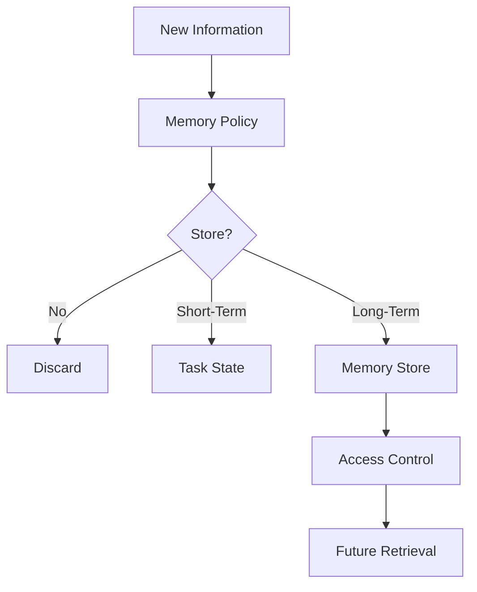

---

## 9. Agent Tools

Tools are how agents affect the outside world.

### Tool Categories

| Tool Type | Example | Risk |
|---|---|---|
| Retrieval tool | search documents | wrong context |
| Database tool | query customer status | data leakage |
| Action tool | create ticket | incorrect action |
| Communication tool | send email | reputational risk |
| Transaction tool | issue refund | financial risk |
| Code tool | run script | security risk |
| Analysis tool | calculate KPI | wrong assumptions |
| Browser tool | search web | untrusted content |

### Tool Design Rule

> Tools should be scoped, typed, permissioned, logged, and validated.

### Tool Call Flow

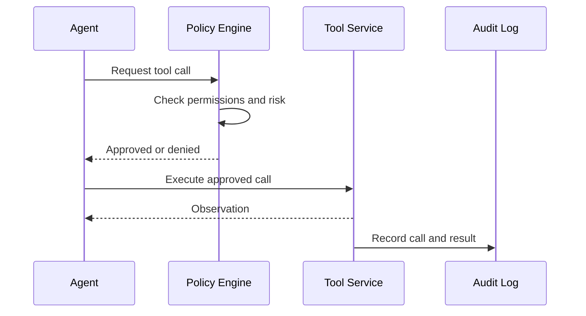

---

## 10. Tool Permissions

Never let the model itself be the authority for permissions.

The model can request a tool call. A deterministic policy layer should approve or deny it.

### Permission Layers

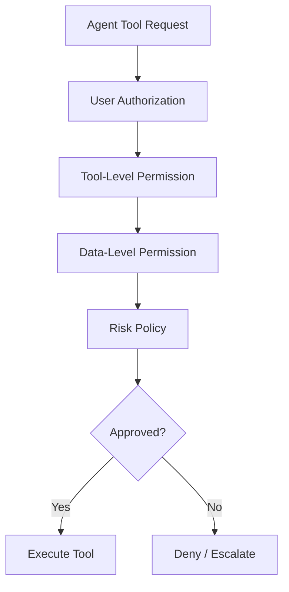

### Example

The agent may request:

```json
{
  "tool": "issue_refund",
  "customer_id": "123",
  "amount": 1200
}
```

Policy checks should determine:

- Is the user allowed to issue refunds?
- Is the agent allowed to issue refunds?
- Is the amount above approval threshold?
- Is customer status valid?
- Is human approval required?
- Is this action logged?

---

## 11. Planning

Planning is the process by which the agent determines what steps to take.

### Planning Styles

| Planning Style | Description | Use Case |
|---|---|---|
| No planning | direct response | simple tasks |
| Fixed plan | predefined steps | repeatable workflow |
| Dynamic planning | model chooses next step | variable workflow |
| Hierarchical planning | high-level plan decomposed | complex workflows |
| Human-approved plan | plan reviewed before execution | high-risk tasks |

### Fixed Plan Example

```text
1. Retrieve relevant policy.
2. Check customer status.
3. Draft recommendation.
4. Ask human to approve.
```

### Dynamic Plan Example

The agent decides whether to:

- search documents
- ask a clarifying question
- query CRM
- escalate to human
- stop and respond

Dynamic planning is more flexible but riskier.

---

## 12. Reflection and Self-Correction

Some agents include reflection steps.

Reflection may ask:

- Did I answer the question?
- Is the evidence sufficient?
- Did I use the right tool?
- Is the risk level acceptable?
- Should I ask for clarification?
- Should this require human review?

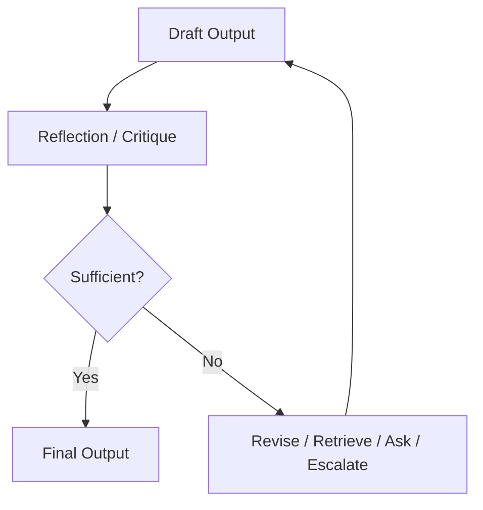

Reflection can improve quality but increases cost and latency. It can also create false confidence if not grounded in evidence.

---

## 13. Autonomy Levels

Not all agents need the same autonomy.

### Autonomy Model

| Level | Description | Example |
|---:|---|---|
| 0 | No AI autonomy | deterministic workflow |
| 1 | AI suggests | draft response |
| 2 | AI recommends | recommends action to human |
| 3 | AI executes low-risk actions | creates ticket |
| 4 | AI executes with approval gates | refund after approval |
| 5 | AI autonomously executes | low-risk closed-loop task |
| 6 | AI supervises complex workflow | multi-agent operations |
| 7 | AI controls high-impact decisions | rarely appropriate |

Most enterprise systems should operate between Levels 1 and 4.

### Autonomy Decision Tree

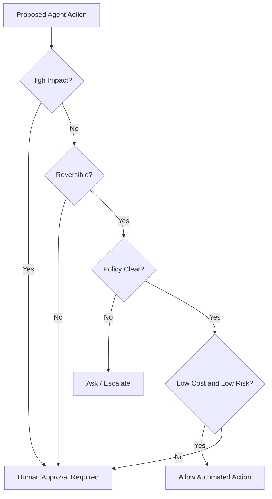

---

## 14. Human-in-the-Loop and Human-on-the-Loop

### Human-in-the-Loop

A human must approve before action.

Use for:

- high-risk decisions
- irreversible actions
- regulated workflows
- financial impact
- customer-impacting actions
- legal/HR decisions

### Human-on-the-Loop

The agent acts within boundaries while humans monitor.

Use for:

- low-risk repetitive tasks
- reversible actions
- well-scoped operations
- mature systems with strong observability

### Human Escalation Pattern

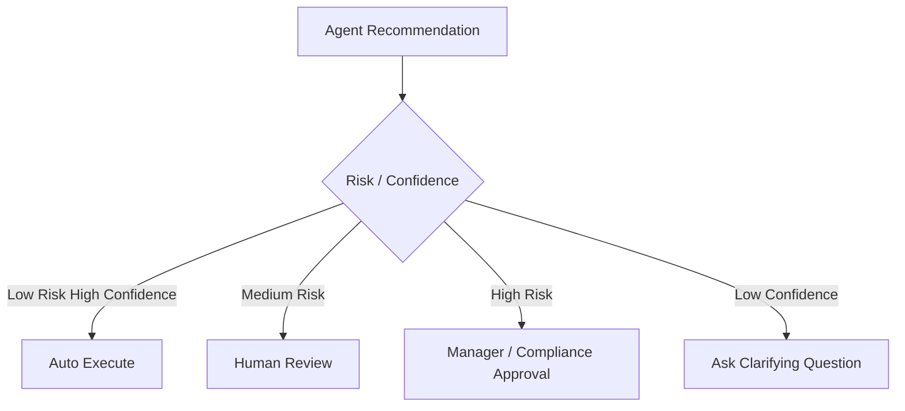

---

## 15. Agentic AI and RAG

RAG retrieves knowledge.

Agents decide when and how to retrieve.

### Simple RAG

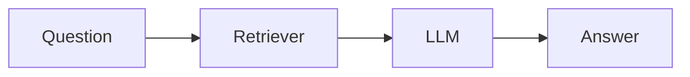

### Agentic RAG

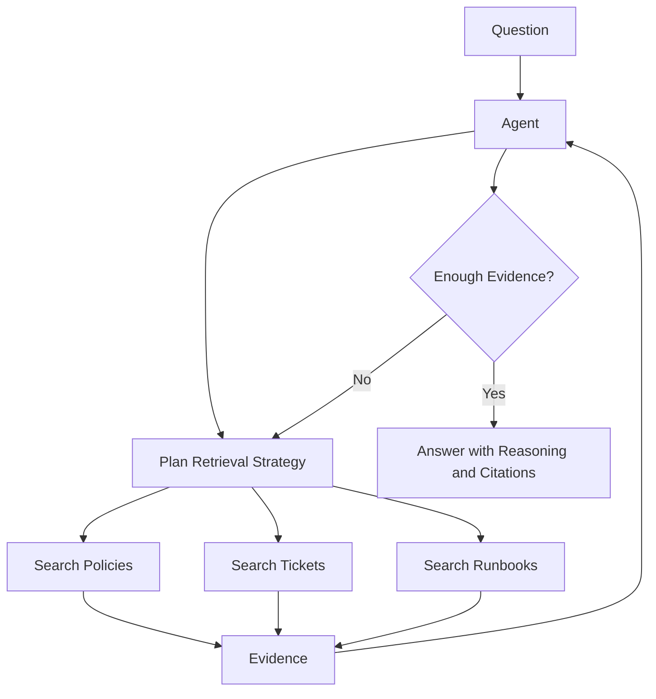

Agentic RAG is useful when retrieval requires multi-source investigation.

It is overkill for simple policy lookup.

---

## 16. Agentic AI and Model Selection

Chapter 6 established that model choice depends on task, cost, risk, and workflow.

Agents often need multiple models.

### Agent Model Portfolio

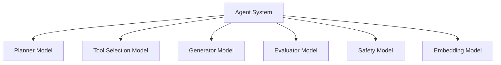

A large model may plan. A smaller model may classify. A safety model may screen. An embedding model may retrieve. A deterministic service may validate.

Agent systems benefit from model routing, not one-model thinking.

---

## 17. Agent Architectures at a High Level

This chapter introduces the basics. Chapter 8 will go deeper.

Common architectures include:

- single-agent assistant
- tool-using agent
- planner-executor
- supervisor-worker
- critic-reviewer
- human-in-the-loop agent
- multi-agent team
- event-driven agent
- long-running workflow agent

### Simple Tool-Using Agent

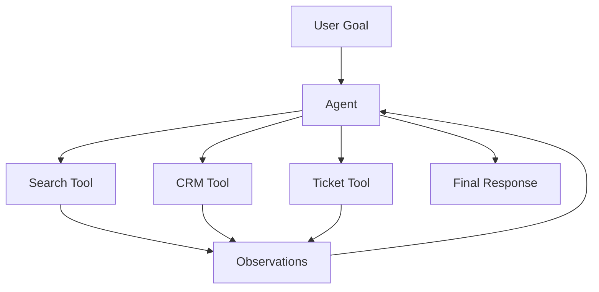

### Supervisor Pattern

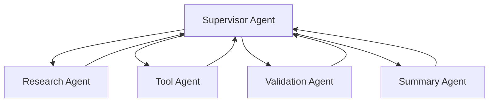

---

## 18. Agentic AI Use Cases

### Customer Support

- triage case
- retrieve policy
- check account status
- recommend next step
- draft response
- create ticket

### IT Operations

- investigate incident
- query logs
- search runbooks
- summarize impact
- recommend remediation
- escalate when needed

### Sales Enablement

- research account
- summarize history
- identify opportunities
- draft outreach
- prepare meeting brief

### Engineering Productivity

- analyze issue
- search code/docs
- propose fix
- generate tests
- summarize pull request

### Field Service

- interpret symptoms
- search manuals
- compare historical repairs
- recommend diagnostics
- capture service notes

### Finance and Risk

- collect documents
- compare evidence
- draft risk summary
- flag exceptions
- route for approval

### Executive Intelligence

- gather updates
- synthesize risks
- summarize KPIs
- prepare decision memo

---

## 19. When Agents Create Value

Agents create value when:

- workflows are multi-step
- decisions depend on intermediate observations
- data exists across multiple systems
- manual coordination is expensive
- users need decision support
- exceptions are frequent
- tasks are language-heavy
- the workflow has measurable value
- actions can be bounded and audited

### Agent Value Formula

```text
Agent Value =
  workflow time saved
+ error reduction
+ faster decisions
+ better consistency
+ reduced handoffs
+ improved customer experience
- inference cost
- engineering cost
- risk cost
- governance cost
```

---

## 20. When Agents Are Overkill

Agents are overkill when:

- a rule solves the problem
- a database query solves the problem
- a search engine solves the problem
- a RAG assistant is sufficient
- the workflow is fixed and stable
- exactness is mandatory
- risk is high and ambiguity is low
- latency must be extremely low
- cost must be tightly predictable
- the business value is unclear

### Decision Flow

```mermaid
flowchart TD
    A[Problem] --> B{Can rules solve it?}
    B -->|Yes| C[Use deterministic workflow]
    B -->|No| D{Need enterprise knowledge?}
    D -->|Yes| E{Single-step Q&A enough?}
    E -->|Yes| F[Use RAG]
    E -->|No| G{Need tools and adaptive steps?}
    G -->|Yes| H[Consider Agent]
    G -->|No| I[Use workflow + LLM step]
    D -->|No| J{Need multi-step reasoning/action?}
    J -->|Yes| H
    J -->|No| K[Use simple LLM call]
```

---

## 21. Agent Failure Modes

Agents introduce new failure modes.

### 21.1 Infinite Loops

The agent keeps taking steps without completing the task.

Mitigation:

- max step count
- timeout
- progress checks
- loop detection
- human escalation

### 21.2 Wrong Tool Use

The agent selects the wrong tool or wrong parameters.

Mitigation:

- tool schemas
- tool descriptions
- validation
- permission checks
- tool-use evaluation

### 21.3 Goal Drift

The agent moves away from the original goal.

Mitigation:

- goal persistence
- plan review
- periodic goal check
- user confirmation

### 21.4 Memory Pollution

The agent stores incorrect or unsafe memory.

Mitigation:

- memory policy
- memory review
- expiration
- source attribution

### 21.5 Unsafe Action

The agent executes an action that should require approval.

Mitigation:

- deterministic approval gates
- risk classification
- audit logs

### 21.6 Tool Output Misinterpretation

The agent misunderstands API/tool results.

Mitigation:

- typed outputs
- result validation
- tool documentation
- explicit error handling

### 21.7 Cost Explosion

The agent calls tools/models too many times.

Mitigation:

- step budget
- token budget
- tool budget
- cost monitoring

### Failure Mode Map

```mermaid
flowchart TD
    A[Agent Failure] --> B[Looping]
    A --> C[Wrong Tool]
    A --> D[Goal Drift]
    A --> E[Bad Memory]
    A --> F[Unsafe Action]
    A --> G[Misread Observation]
    A --> H[Cost Explosion]
    A --> I[Security Leakage]
```

---

## 22. Agent Stop Conditions

Every agent must know when to stop.

Stop conditions include:

- task completed
- max steps reached
- max cost reached
- confidence too low
- missing required input
- tool failed repeatedly
- policy violation detected
- human approval required
- user cancels
- risk threshold exceeded

### Stop Condition Pattern

```mermaid
flowchart TD
    A[Agent Step Complete] --> B{Stop Condition Met?}
    B -->|Goal Complete| C[Return Final Output]
    B -->|Max Steps| D[Escalate / Safe Stop]
    B -->|Low Confidence| E[Ask Clarifying Question]
    B -->|Approval Needed| F[Human Review]
    B -->|No| G[Continue]
```

No production agent should operate without stop conditions.

---

## 23. Agent Observability

Agents require deeper observability than simple LLM calls.

Log:

- goal
- user request
- plan
- state transitions
- tool calls
- tool parameters
- tool outputs
- model calls
- retrieved context
- memory reads/writes
- policy decisions
- validation results
- costs
- latency
- final output
- human approvals
- errors

### Agent Trace

```mermaid
sequenceDiagram
    participant U as User
    participant A as Agent
    participant P as Policy
    participant T as Tool
    participant M as Model
    participant O as Observability

    U->>A: Submit goal
    A->>M: Plan next step
    M-->>A: Proposed action
    A->>P: Check action policy
    P-->>A: Approved
    A->>T: Execute tool
    T-->>A: Observation
    A->>O: Log state transition
    A->>M: Generate next step or final answer
    M-->>A: Final answer
    A-->>U: Response
```

Without traces, agent failures are nearly impossible to debug.

---

## 24. Agent Evaluation

Agents must be evaluated at the workflow level.

### Evaluation Dimensions

| Dimension | Question |
|---|---|
| Task completion | Did the agent complete the goal? |
| Plan quality | Was the plan appropriate? |
| Tool accuracy | Did it call the right tools? |
| Parameter accuracy | Were tool inputs correct? |
| Safety | Did it avoid unsafe actions? |
| Efficiency | Did it use reasonable steps and cost? |
| Grounding | Was output supported by evidence? |
| Escalation | Did it ask for human help when needed? |
| Stop behavior | Did it stop correctly? |
| Business outcome | Did it improve the workflow? |

### Agent Evaluation Pipeline

```mermaid
flowchart TD
    A[Test Task] --> B[Agent Run]
    B --> C[Trace Capture]
    C --> D[Step Evaluation]
    C --> E[Tool Evaluation]
    C --> F[Final Output Evaluation]
    C --> G[Cost Evaluation]
    D --> H[Overall Score]
    E --> H
    F --> H
    G --> H
```

---

## 25. Agent Cost Model

Agent costs include more than one model call.

Cost drivers:

- planning calls
- tool selection calls
- retrieval calls
- tool execution
- reflection calls
- validation calls
- memory reads/writes
- final generation
- retries
- human review
- observability storage

### Cost Formula

```text
Agent Cost =
  planning model cost
+ retrieval cost
+ tool execution cost
+ reflection/evaluation cost
+ final generation cost
+ retries
+ observability cost
+ human review cost
```

Agents can be expensive because they loop.

### Cost Control

- max step budget
- model routing
- cheap model for simple steps
- cache retrieval
- avoid unnecessary reflection
- tool-use thresholds
- stop conditions
- cost per completed task tracking

---

## 26. Agent Security

Agent security includes all LLM risks plus action risks.

Threats:

- prompt injection
- tool injection
- data exfiltration
- unauthorized action
- privilege escalation
- memory poisoning
- malicious documents
- unsafe code execution
- cross-tenant leakage
- deceptive tool output
- social engineering

### Agent Security Architecture

```mermaid
flowchart TD
    A[User / Input] --> B[Input Filter]
    B --> C[Agent Runtime]
    C --> D[Policy Engine]
    D --> E[Tool Permission Layer]
    E --> F[Tool Execution]
    F --> G[Output Validator]
    G --> H[Response]
    C --> I[Audit Log]
    D --> I
    E --> I
    F --> I
```

### Security Rule

> The model may propose actions, but deterministic systems must authorize actions.

---

## 27. Agent Governance

Agent governance defines who is allowed to build, deploy, monitor, and approve agents.

Governance should cover:

- approved use cases
- prohibited use cases
- autonomy levels
- tool permissions
- human approval requirements
- data classification
- logging
- evaluation evidence
- production monitoring
- incident response
- rollback
- ownership
- periodic review

### Agent Approval Workflow

```mermaid
flowchart TD
    A[Agent Proposal] --> B[Use Case Review]
    B --> C[Risk Tier]
    C --> D[Tool Permission Review]
    D --> E[Security Review]
    E --> F[Evaluation Review]
    F --> G[Business Owner Approval]
    G --> H[Production Deployment]
    H --> I[Monitoring and Review]
```

---

## 28. Enterprise Agent Operating Model

Agentic AI requires operating discipline.

### Roles

| Role | Responsibility |
|---|---|
| Business owner | owns workflow outcome |
| AI product owner | owns agent behavior and roadmap |
| AI platform team | owns runtime, gateway, tools |
| Security team | owns risk and access control |
| Compliance team | owns regulated boundaries |
| Domain experts | validate task correctness |
| SRE/Operations | monitors reliability and incidents |
| Data owners | own source quality and permissions |

### Operating Questions

- Who approves new tools?
- Who approves autonomy level?
- Who monitors failures?
- Who reviews logs?
- Who owns business KPIs?
- Who handles agent incidents?
- Who can roll back the agent?
- Who updates prompts and policies?

---

## 29. Agentic AI in the Capstone Platform

The Enterprise Agentic Operations Platform can use agents to assist device/fleet operations.

### Example Goal

> Investigate why devices in Region A show increased heartbeat failures after firmware 3.2 rollout and prepare an executive summary.

### Agent Flow

```mermaid
flowchart TD
    U[Operations Leader] --> S[Supervisor Agent]

    S --> T[Telemetry Tool]
    S --> R[Runbook Retrieval]
    S --> I[Incident Similarity Search]
    S --> F[Firmware Notes Search]
    S --> C[Customer Impact Tool]

    T --> E[Evidence Package]
    R --> E
    I --> E
    F --> E
    C --> E

    E --> V[Validation Agent]
    V --> S
    S --> X[Executive Summary + Recommended Next Steps]
```

### Controlled Autonomy

The agent may:

- retrieve evidence
- query telemetry
- compare incidents
- draft recommendations
- produce executive summary

The agent should not automatically:

- roll back firmware
- notify customers
- change production configuration
- close incidents
- issue public communication

Those actions require human approval.

---

## 30. Architecture Review Scenario

### Scenario

A company wants to deploy an autonomous customer support agent that can answer questions, issue refunds, change account settings, and close support cases.

### Initial Design

The proposed design gives the agent access to:

- customer records
- refund API
- account settings API
- email sender
- support ticket system

The agent is instructed:

```text
Help the customer and resolve the issue.
```

### Review Finding

This is unsafe and not enterprise-ready.

### Problems

- vague goal
- excessive tool access
- no approval gates
- no refund thresholds
- no audit design
- no confidence scoring
- no stop conditions
- no escalation rules
- no tool-level permissions
- no evaluation
- no rollback process
- no business risk model

### Improved Design

```mermaid
flowchart TD
    U[Customer Request] --> A[Support Agent]
    A --> I[Intent and Risk Classifier]

    I -->|Policy Question| R[RAG Answer]
    I -->|Low-Risk Ticket Update| T[Create / Update Ticket]
    I -->|Refund Request| P[Refund Policy Check]
    P --> C{Amount / Risk}
    C -->|Low Amount| H1[Human Review Optional]
    C -->|High Amount| H2[Human Approval Required]
    I -->|Account Change| V[Verification + Human Approval]

    R --> O[Response]
    T --> O
    H1 --> O
    H2 --> O
    V --> O

    O --> L[Audit Log]
```

### Recommendation

Start with agent assist, not full autonomy. Allow the agent to retrieve, draft, classify, and recommend. Require human approval for financial or account-impacting actions.

---

## 31. Lessons from the Field

### What Worked

Agentic AI works best when the workflow is narrow, valuable, and bounded.

Strong patterns:

- start with agent assist
- keep tools scoped
- require approval for high-impact actions
- log every step
- define stop conditions
- use RAG for knowledge
- use tools for live state
- use deterministic systems for authorization
- evaluate full traces
- measure cost per completed task
- expand autonomy gradually

The best enterprise agents are not the most autonomous. They are the most useful within safe operating boundaries.

---

### What Did Not Work

The weakest pattern is the generic autonomous agent.

It usually fails because:

- goals are vague
- tools are too broad
- context is messy
- permissions are unclear
- evaluation is weak
- costs grow unpredictably
- users do not trust actions
- failures are hard to debug
- governance is missing

Broad autonomy without workflow discipline creates risk faster than value.

---

### Common Mistakes

- Calling every LLM workflow an agent.
- Using agents when a workflow is deterministic.
- Giving agents too many tools.
- Not defining stop conditions.
- Not logging intermediate steps.
- Letting the model authorize its own actions.
- Treating memory as harmless.
- Ignoring cost of loops.
- Skipping human approval for high-risk actions.
- Measuring final answer only instead of full trace.
- Deploying agents before defining business success metrics.

---

### ROI Perspective

Agents create ROI when they reduce the human burden of coordinating multi-step work.

ROI drivers:

- reduced investigation time
- fewer handoffs
- faster incident response
- faster customer resolution
- better consistency
- reduced manual research
- improved employee productivity
- faster executive synthesis
- better operational decision support

Cost and risk drivers:

- model calls
- tool calls
- retries
- human review
- monitoring
- security controls
- incident response
- governance overhead
- failure risk

The ROI question is:

> Does agentic behavior improve the workflow enough to justify the added complexity, cost, and risk?

---

### CTO Perspective

A CTO should ask:

- What workflow requires an agent?
- Why is RAG or deterministic automation insufficient?
- What autonomy level is appropriate?
- What tools can the agent access?
- What actions require human approval?
- What are the stop conditions?
- How is every step logged?
- How do we evaluate the full agent trace?
- What is the cost per completed task?
- What is the rollback plan?
- Who owns the agent?
- What happens when the agent is wrong?

If the team cannot answer these questions, the agent should not be deployed.

---

## 32. Pratik's Principles

### Principle 1: Agents Are Workflow Systems, Not Chat Features

An agent must be designed around a business workflow, not around a demo conversation.

---

### Principle 2: Autonomy Must Be Earned

Start with recommendations and human approval. Increase autonomy only after measurement and trust.

---

### Principle 3: The Model Can Propose, but Systems Must Authorize

Authorization belongs in deterministic policy layers, not in model judgment.

---

### Principle 4: Every Agent Needs Stop Conditions

An agent that cannot stop safely is not production-ready.

---

### Principle 5: Tools Create Power and Risk

The moment an agent can use tools, the architecture must include permissions, logging, validation, and approval.

---

### Principle 6: Memory Is a Liability Unless Governed

Agent memory must be scoped, permissioned, auditable, and erasable.

---

### Principle 7: Evaluate the Trace, Not Just the Answer

Agent quality depends on planning, tools, observations, decisions, cost, and final outcome.

---

### Principle 8: Do Not Use Agents Where Workflows Are Stable and Deterministic

Complexity is justified only when adaptability creates measurable value.

---

## 33. Hands-On Labs

### Lab 1: Build a Simple Tool-Using Agent

Create an agent that can:

- receive a user goal
- choose between two tools
- call the selected tool
- observe the result
- return a final answer

Suggested structure:

```text
labs/chapter-07-agentic-ai/simple-tool-agent/
  README.md
  agent.py
  tools.py
  tests.py
```

Tools:

- `search_policy(query)`
- `create_ticket(summary, priority)`

Deliverables:

- agent code
- tool schemas
- example runs
- failure case notes

---

### Lab 2: Add Agent State

Extend Lab 1 with a state object.

Track:

- goal
- current step
- tool calls
- observations
- confidence
- final output
- step count

Deliverable:

```text
agent-state-example.json
```

---

### Lab 3: Add Stop Conditions

Add:

- max steps
- max retries
- low-confidence stop
- tool failure stop
- human approval stop

Test:

- normal completion
- repeated tool failure
- ambiguous request
- high-risk action

---

### Lab 4: Tool Permission Layer

Create a deterministic policy function:

```python
def approve_tool_call(user, tool_name, parameters, risk_level):
    ...
```

Test:

- allowed low-risk tool call
- denied unauthorized tool call
- human approval required
- high-risk financial action denied

---

### Lab 5: Agent Trace Evaluation

Create an agent trace and evaluate:

- Was the plan appropriate?
- Were tools selected correctly?
- Were parameters correct?
- Did the agent stop correctly?
- Was the final answer grounded?
- Was cost reasonable?

Deliverable:

```text
agent-trace-evaluation.md
```

---

### Lab 6: Design an Agent for Device Operations

Design an agent for this goal:

> Investigate increased device heartbeat failures in one region.

Include:

- goal
- tools
- state
- memory
- stop conditions
- human approval rules
- evaluation metrics
- business ROI

---

## 34. Interview Questions

### Engineering-Level Questions

1. What is an AI agent?
2. How is an agent different from a chatbot?
3. How is an agent different from a RAG assistant?
4. What are the core components of an agent?
5. What is agent state?
6. What is agent memory?
7. Why are tools risky?
8. What are stop conditions?
9. How do you prevent an agent from looping?
10. How do you evaluate an agent?

### Architect-Level Questions

1. Design an enterprise tool-using agent.
2. How would you enforce permissions for agent tools?
3. How would you design agent observability?
4. How would you design human approval gates?
5. How would you choose autonomy levels?
6. How do agents interact with RAG?
7. How do agents interact with model routing?
8. How would you design agent memory safely?
9. How would you evaluate agent traces?
10. How would you prevent agent cost explosion?

### Director / VP / CTO-Level Questions

1. When should an enterprise use agents?
2. When are agents overkill?
3. What business metrics justify agentic AI?
4. What risks should executives understand?
5. How much autonomy should agents have?
6. Who owns agent governance?
7. How do you prevent unsafe actions?
8. How do you control agent cost?
9. How do you roll out agents safely?
10. What would make you stop an agent initiative?

---

## 35. Certification Mapping

### AWS AI / Generative AI Professional Preparation

This chapter supports topics related to:

- agentic AI concepts
- Amazon Bedrock Agents
- tool use
- action groups
- orchestration
- human approval patterns
- guardrails
- responsible AI
- model selection for agents
- evaluation and monitoring

### Anthropic Claude / MCP Architecture Preparation

This chapter supports topics related to:

- tool use
- agent behavior
- MCP tool boundaries
- context management
- memory design
- prompt injection risks
- agent safety
- human-in-the-loop design

### NVIDIA Generative AI Preparation

This chapter supports topics related to:

- agent inference workloads
- multi-call latency
- cost of agent loops
- model serving requirements
- throughput planning
- optimization for agent systems

---

## 36. Chapter Exercises

### Exercise 1

Choose one business workflow from your organization.

Classify it as:

- deterministic workflow
- simple LLM task
- RAG assistant
- agentic workflow
- human-led workflow

Explain why.

---

### Exercise 2

Design an agent for customer support case triage.

Include:

- goal
- tools
- memory
- state
- stop conditions
- approval gates
- evaluation metrics

---

### Exercise 3

A proposed agent can issue refunds automatically.

Create a risk assessment and improved architecture.

---

### Exercise 4

Design an autonomy-level framework for enterprise agents.

Include examples for Levels 0–5.

---

### Exercise 5

Create an agent evaluation rubric.

Include:

- task completion
- plan quality
- tool-use accuracy
- safety
- cost
- escalation correctness
- final answer quality

---

## 37. Key Terms

| Term | Meaning |
|---|---|
| Agent | Goal-directed AI system that can decide and act over steps |
| Agentic AI | AI systems with goal pursuit, tool use, state, and feedback |
| Goal | Desired outcome the agent pursues |
| State | Current working context of an agent |
| Memory | Information retained across steps or sessions |
| Tool | External function, API, or system an agent can call |
| Observation | Result returned from an action or tool |
| Planning | Process of determining next steps |
| Reflection | Process of critiquing or revising intermediate output |
| Stop condition | Rule that determines when the agent stops |
| Human-in-the-loop | Human approval required before action |
| Human-on-the-loop | Human monitors agent behavior |
| Autonomy level | Degree of independent action allowed |
| Agent trace | Logged sequence of agent decisions and actions |
| Tool permission | Authorization policy for tool use |
| Goal drift | Agent deviating from original task |
| Memory poisoning | Unsafe or incorrect information stored in memory |

---

## 38. One-Page Executive Brief

Agentic AI allows AI systems to pursue goals across multiple steps, use tools, maintain state, and adapt based on feedback.

This is powerful because many enterprise workflows are not simple questions. They involve investigation, coordination, decision support, tool usage, and exception handling.

Agents can create value by reducing manual coordination, accelerating support and operations, improving consistency, and helping employees complete complex workflows faster.

But agents also introduce risk. They can call the wrong tool, loop, drift from the goal, misuse memory, take unsafe actions, leak data, or generate unpredictable cost.

Enterprise agents must operate inside explicit boundaries:

- defined goals
- scoped tools
- permission checks
- state tracking
- memory policies
- stop conditions
- human approval gates
- observability
- evaluation
- governance
- cost controls

The right executive question is not:

> How autonomous can we make the AI?

The right question is:

> What level of autonomy creates measurable business value while keeping risk, cost, and accountability under control?

Most enterprises should begin with agent assist, not full autonomy. Let agents retrieve, analyze, recommend, and draft. Add autonomous actions only after evaluation, trust, and governance are mature.

---

## 39. Chapter Summary

In this chapter, we introduced Agentic AI Fundamentals.

We defined agents as goal-directed systems that can reason over state, use tools, observe results, and continue toward a goal. We clarified what agents are not, including simple chatbots, basic RAG assistants, deterministic workflows, and fixed LLM pipelines.

We examined the core components of agents: goal, instructions, state, tools, memory, planning, observation, policy, and stop conditions. We compared deterministic workflows and agentic workflows, explored autonomy levels, human-in-the-loop patterns, agentic RAG, model selection for agents, and high-level agent architectures.

We also covered enterprise use cases, business value, when agents are overkill, failure modes, stop conditions, observability, evaluation, cost, security, governance, operating model, capstone application, and architecture review.

The key lesson is:

> Agents are controlled workflow systems. Their value comes from bounded adaptability, not unrestricted autonomy.

In Chapter 8, we will go deeper into Agent Architecture Patterns, including planner-executor, supervisor-worker, reflection, critic-reviewer, tool-specialist, human approval, and multi-agent designs.

---

## 40. Suggested Git Commit

```bash
mkdir -p chapters
cp 07-agentic-ai-fundamentals.md chapters/07-agentic-ai-fundamentals.md

git add chapters/07-agentic-ai-fundamentals.md
git commit -m "Add Chapter 7: Agentic AI Fundamentals"
git push origin main
```
