# Chapter 8 — Agent Architecture Patterns

**Book:** The AI Architect & Practitioner Bootcamp  
**Chapter Status:** Complete Draft  
**Version:** 0.1  
**Author:** Pratik Desai  
**Primary Audience:** AI engineers, enterprise architects, senior software engineers, platform engineers, engineering leaders, product leaders, consultants, directors, VPs, CTO-track practitioners, and certification candidates

---

## Chapter Thesis

Agent architecture patterns convert agentic AI from open-ended autonomy into controlled, testable, observable, and governable workflow designs.

Chapter 7 established the fundamentals: an agent has a goal, state, tools, memory, observations, policies, and stop conditions. This chapter turns those primitives into production architecture.

A naive agent design says:

> Give the model a goal and tools. Let it figure things out.

An enterprise agent architecture says:

> Define the workflow boundary, select the right agent pattern, control tool access, manage state, evaluate the trace, enforce approval gates, observe cost, and stop safely.

The key idea:

> Agent patterns are reusable control structures for goal-directed AI systems.

They tell us where AI reasoning belongs, where deterministic control belongs, where humans belong, where tools belong, where memory belongs, and how the system terminates.

---

## Learning Objectives

By the end of this chapter, you will be able to:

- Explain why agent architecture patterns matter for production AI systems.
- Compare single-agent, tool-using, planner-executor, router, supervisor-worker, critic-reviewer, reflection, human-approval, memory-enabled, event-driven, and multi-agent patterns.
- Select the simplest sufficient agent pattern for a business workflow.
- Design agent workflows with state, tools, memory, validation, fallback, observability, and governance.
- Apply stop conditions, tool permissions, approval gates, and cost budgets.
- Identify failure modes by pattern.
- Evaluate agent systems using traces, task completion, tool accuracy, safety, cost, latency, and business outcomes.
- Design enterprise-grade agent architectures for support, operations, sales, engineering, finance, and executive intelligence.
- Explain how these patterns connect to LangGraph, MCP, Bedrock Agents, Claude tool use, and enterprise AI gateways.
- Discuss agent architecture at engineering, architecture, business, and CTO levels.

---

## Executive Summary

Agentic AI becomes enterprise-ready only when it is placed inside explicit architecture patterns.

Agents can reason over goals, use tools, maintain state, adapt to observations, and pursue multi-step outcomes. This flexibility creates value, but it also creates risk. Without architecture, agents can loop, misuse tools, drift from goals, leak data, overrun cost, or take unsafe actions.

This chapter introduces the main patterns used to design controlled agentic systems:

- single-agent assistant
- tool-using agent
- planner-executor
- router-agent
- supervisor-worker
- critic-reviewer
- reflection loop
- human approval gate
- retrieval-augmented agent
- memory-enabled agent
- event-driven agent
- deterministic workflow plus agent
- multi-agent collaboration
- hierarchical agent system

Each pattern has strengths, tradeoffs, failure modes, cost implications, and governance requirements.

The most important enterprise lesson is:

> Do not start with multi-agent systems. Start with the simplest agent pattern that safely delivers measurable value.

A production agent architecture should include:

- explicit goal
- bounded tools
- state management
- deterministic policy checks
- observability
- evaluation
- cost budget
- stop conditions
- fallback
- human approval where needed
- clear business owner

Agent patterns help teams move from AI demos to reliable AI workflow systems.

---

## Business Motivation

Enterprise workflows are rarely single-turn prompts.

A support case may require policy lookup, customer history, account status, product information, refund rules, escalation logic, and response drafting. An operations incident may require telemetry, logs, runbooks, known issues, release notes, customer impact, revenue exposure, and executive communication. A sales workflow may require CRM history, market research, product fit, account risk, and next-best-action recommendations.

These workflows need coordination.

Agent architecture patterns help enterprises:

- reduce manual coordination
- accelerate investigations
- improve consistency
- reduce escalations
- improve support throughput
- improve field operations
- shorten sales preparation time
- automate low-risk repetitive steps
- improve executive decision support
- preserve institutional knowledge
- reduce operational delays

Poorly designed agents create the opposite outcome:

- uncontrolled autonomy
- unpredictable cost
- unsafe tool calls
- weak auditability
- user mistrust
- governance gaps
- hidden failure modes

The business goal is not to deploy agents. The business goal is to improve workflows. Agent patterns are the bridge between adaptive AI behavior and measurable business outcomes.

---

## The Five-Lens Framework for This Chapter

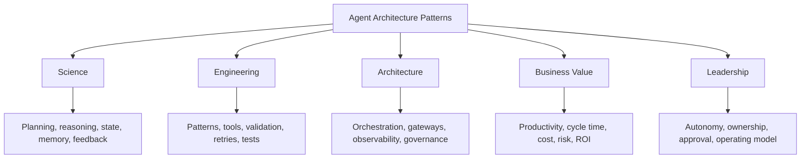

---

## 1. Why Agent Architecture Patterns Matter

Without patterns, agent systems become unpredictable.

A model receives a goal, calls tools, observes results, and decides what to do next. That flexibility is useful, but it creates ambiguity:

- Who decides the plan?
- Who approves tool calls?
- What happens if a tool fails?
- What state is retained?
- What is logged?
- When does the agent stop?
- How is quality evaluated?
- How is cost controlled?
- What requires human approval?
- What happens when the agent is wrong?

Architecture patterns answer these questions.

They constrain agent behavior without eliminating adaptability.

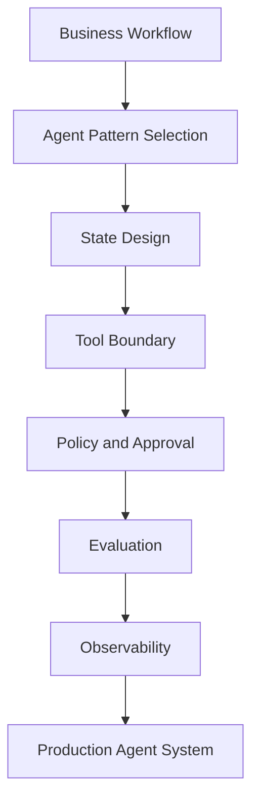

---

## 2. Pattern Selection Principles

### Principle 1: Start with the Workflow

Ask:

- What workflow are we improving?
- What is the measurable outcome?
- Is the workflow fixed or variable?
- Does it require external tools?
- Does it require human approval?
- What is the cost of mistakes?
- What is the cost of delay?
- What is the cost of automation failure?

### Principle 2: Start Simple

Do not begin with multi-agent systems if a single tool-using agent is enough.

### Principle 3: Match Autonomy to Risk

Low-risk reversible tasks can tolerate more autonomy. High-impact actions require human approval and deterministic controls.

### Principle 4: Use Deterministic Control Where Possible

The agent may reason. Deterministic systems should enforce permissions, budgets, schemas, approvals, and safety boundaries.

### Principle 5: Evaluate the Trace

The final answer may look good even if the path was unsafe, wasteful, or wrong. Evaluate the entire agent trace.

---

## 3. Pattern Selection Matrix

| Workflow Characteristic | Recommended Pattern |
|---|---|
| Simple Q&A | RAG assistant, not agent |
| Fixed steps | deterministic workflow with LLM step |
| Needs one or two tools | tool-using agent |
| Needs plan then execution | planner-executor |
| Many domains behind one interface | router-agent |
| Multiple specialized tasks | supervisor-worker |
| High-risk output | critic-reviewer plus human approval |
| Needs self-checking | reflection pattern |
| Needs long-running proactive behavior | event-driven agent |
| Needs continuity | memory-enabled agent |
| Regulated action | human approval gate |
| Cross-domain enterprise workflow | hierarchical agent system |

---

## 4. Pattern 1 — Single-Agent Assistant

The single-agent assistant is the simplest agent architecture.

It receives a goal, uses instructions, optionally calls tools, and returns an outcome.

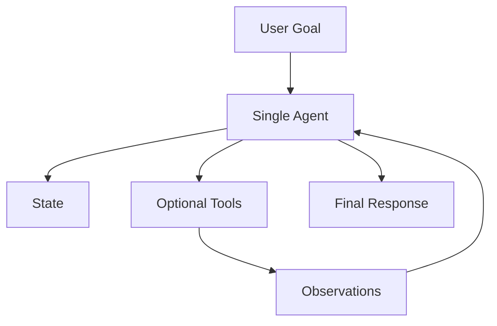

### When to Use

Use this pattern when:

- the task is narrow
- tool access is limited
- risk is low
- workflow is short
- output is advisory
- cost must be low
- iteration speed matters

### Example

A support assistant that searches a knowledge base and drafts a response for a human support agent.

### Benefits

- simple
- fast to build
- easy to understand
- lower operational overhead
- good starting point

### Risks

- limited specialization
- can become overloaded
- hard to control if too many tools are added
- may drift on complex tasks

### Design Guidance

Keep the goal narrow. Limit tools. Add explicit stop conditions. Log all tool calls.

---

## 5. Pattern 2 — Tool-Using Agent

A tool-using agent can call external functions or APIs.

Tools allow the agent to move beyond text generation into live data access and workflow action.

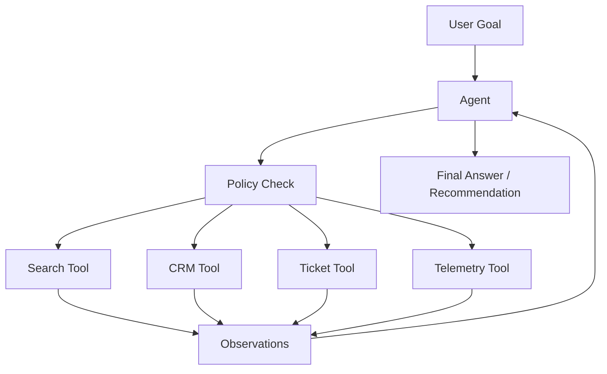

### When to Use

Use this pattern when:

- the agent needs live information
- external system access is required
- tools have clear schemas
- actions are low-risk or approval-gated
- tool outputs can be validated

### Tool Design Requirements

Each tool should have:

- clear purpose
- typed input schema
- typed output schema
- permission requirements
- error behavior
- rate limits
- audit logging
- risk classification

### Example Tool Definition

```json
{
  "name": "create_support_ticket",
  "description": "Create a support ticket after user confirmation.",
  "input_schema": {
    "summary": "string",
    "priority": "low | medium | high",
    "customer_id": "string"
  },
  "risk_level": "medium",
  "requires_confirmation": true
}
```

### Python: Tool-Using Agent Pattern

The following skeleton shows a tool-using agent with a deterministic policy layer that authorizes tool calls before execution. This is the critical architectural separation: the model decides *which* tool to call; the policy layer decides *whether* the call is permitted.

```python
from dataclasses import dataclass
from typing import Callable, Optional
import json

@dataclass
class ToolSpec:
    name: str
    description: str
    risk_level: str          # low | medium | high | critical
    requires_approval: bool
    execute: Callable[[dict, str], str]  # (params, user_role) -> result

# --- Policy layer: deterministic authorization ---

ROLE_TOOL_PERMISSIONS = {
    "support_l1": ["search_policy", "search_tickets", "get_customer_status"],
    "support_manager": ["search_policy", "search_tickets", "get_customer_status",
                        "create_ticket", "draft_response"],
    "operations": ["search_policy", "search_tickets", "get_customer_status",
                   "create_ticket", "get_device_telemetry", "create_incident"],
}

HIGH_RISK_TOOLS = {"issue_refund", "update_production_config", "send_customer_email"}

def authorize_tool_call(tool_name: str, user_role: str) -> tuple[bool, str]:
    """
    Deterministic authorization — does not use the model.
    Returns (authorized: bool, reason: str).
    """
    allowed = ROLE_TOOL_PERMISSIONS.get(user_role, [])
    if tool_name not in allowed:
        return False, f"Role '{user_role}' is not permitted to call '{tool_name}'"
    if tool_name in HIGH_RISK_TOOLS:
        return False, f"'{tool_name}' requires human approval — route to approval workflow"
    return True, "authorized"

# --- Tool-using agent ---

def tool_using_agent(
    goal: str,
    tools: list[ToolSpec],
    model_client,
    user_role: str,
    max_steps: int = 8
) -> dict:
    """
    Tool-using agent with policy-gated execution.
    The model proposes tool calls. The policy layer authorizes them.
    """
    tool_registry = {t.name: t for t in tools}
    tool_docs = "\n".join([
        f"  {t.name} [{t.risk_level} risk]: {t.description}"
        for t in tools
    ])

    observations = []
    tool_calls = []
    denied_calls = []

    for step in range(1, max_steps + 1):
        obs_text = "\n".join(observations) or "No observations yet."

        decision_raw = model_client.complete(
            system="You are a support operations agent. Use tools to fulfill the goal.",
            messages=[{"role": "user", "content": f"""
Goal: {goal}

Available tools:
{tool_docs}

Observations:
{obs_text}

Respond with JSON only:
- Tool call: {{"tool": "<name>", "params": {{...}}}}
- Done: {{"done": true, "answer": "<final answer>"}}
"""}],
            max_tokens=300, temperature=0.0
        )

        try:
            decision = json.loads(decision_raw.text.strip())
        except json.JSONDecodeError:
            break

        if decision.get("done"):
            return {
                "status": "complete",
                "answer": decision.get("answer"),
                "tool_calls": tool_calls,
                "denied_calls": denied_calls,
                "steps": step
            }

        tool_name = decision.get("tool")
        params = decision.get("params", {})

        # --- Policy check before execution ---
        authorized, reason = authorize_tool_call(tool_name, user_role)

        if not authorized:
            denied_calls.append({"tool": tool_name, "reason": reason, "step": step})
            observations.append(f"Step {step}: Tool '{tool_name}' was denied — {reason}")
            # Let the model adapt to the denial and try another tool
            continue

        if tool_name not in tool_registry:
            observations.append(f"Step {step}: Unknown tool '{tool_name}'")
            break

        try:
            result = tool_registry[tool_name].execute(params, user_role)
            tool_calls.append({"step": step, "tool": tool_name, "params": params})
            observations.append(f"Step {step} — {tool_name}: {result}")
        except Exception as e:
            observations.append(f"Step {step} — {tool_name} error: {str(e)}")
            break

    return {
        "status": "incomplete",
        "answer": None,
        "tool_calls": tool_calls,
        "denied_calls": denied_calls,
        "steps": max_steps
    }
```

### Key Engineering Notes

- `authorize_tool_call()` is deterministic code — not a model call. Authorization never relies on model judgment
- `denied_calls` are logged separately from `tool_calls` — this is the audit trail for security review
- The model receives the denial observation and can adapt (try a different tool, ask for clarification)
- High-risk tools are blocked at the policy layer and routed to a human approval workflow instead
- In production, replace inline `ROLE_TOOL_PERMISSIONS` with a call to your IAM/policy service

### Benefits

- connects AI to business systems
- enables live state
- supports workflow automation
- improves usefulness

### Risks

- unsafe tool calls
- wrong parameters
- data leakage
- privilege escalation
- hard-to-debug errors
- real-world side effects

### Design Guidance

The model may request tool calls. A deterministic policy layer should authorize them.

---

## 6. Pattern 3 — Planner-Executor

The planner-executor pattern separates planning from execution.

The planner decides what should happen. The executor performs steps.

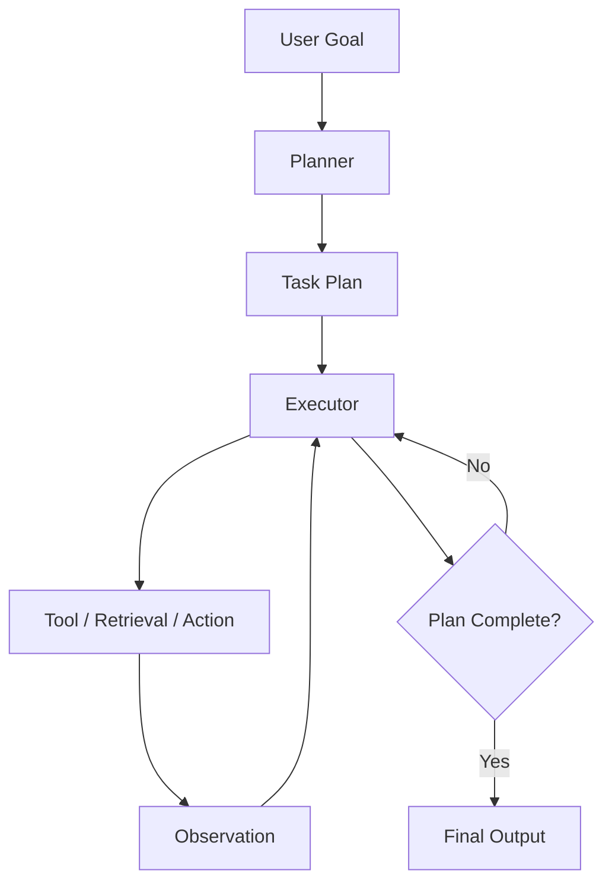

### When to Use

Use this pattern when:

- the task requires multiple steps
- the path can be planned upfront
- execution should be controlled
- the plan may need human review
- traceability matters

### Example

A sales account preparation agent:

1. Retrieve CRM history.
2. Search prior support cases.
3. Identify open opportunities.
4. Summarize customer risks.
5. Draft meeting brief.

### Benefits

- improves transparency
- separates reasoning from execution
- allows plan review
- supports step-level evaluation
- easier to debug than fully implicit agents

### Risks

- bad plan leads to bad execution
- planner may over-plan
- execution may fail if plan is unrealistic
- extra latency

### Design Guidance

For high-risk workflows, require human approval of the plan before execution.

---

## 7. Pattern 4 — Router-Agent

The router-agent classifies a request and sends it to the right workflow, model, tool, or agent.

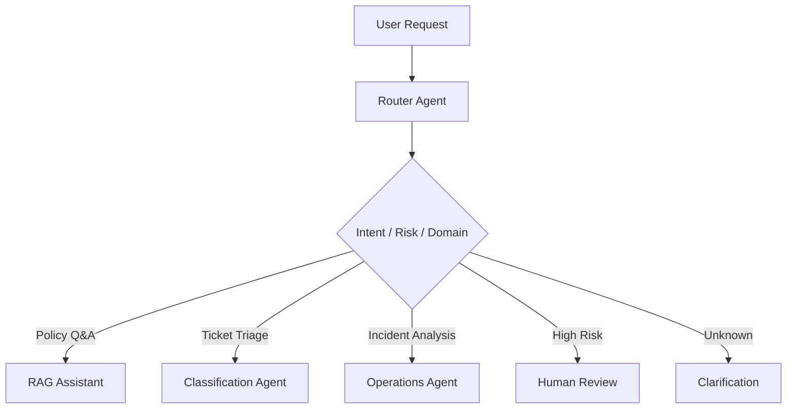

### When to Use

Use this pattern when:

- many workflows share one interface
- model routing is needed
- risk-based routing is needed
- domain routing is needed
- user intent varies widely

### Benefits

- reduces prompt/tool overload
- improves specialization
- supports governance
- improves cost control
- allows model routing

### Risks

- wrong route
- routing ambiguity
- added latency
- inconsistent user experience

### Design Guidance

Use deterministic rules for obvious routing and model-based routing for ambiguous cases. Track routing accuracy.

---

## 8. Pattern 5 — Supervisor-Worker

A supervisor coordinates specialized worker agents.

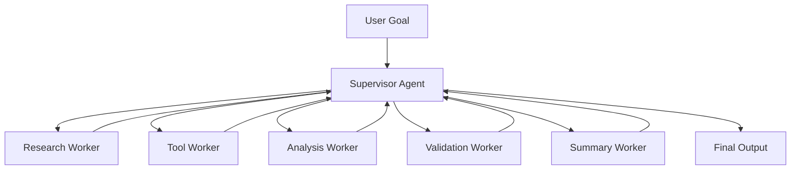

### When to Use

Use this pattern when:

- the workflow has distinct specialized tasks
- parallel work is useful
- the supervisor needs to synthesize outputs
- different workers require different tools
- separation of concerns improves control

### Example

Incident response:

- telemetry worker
- runbook worker
- customer impact worker
- remediation worker
- executive summary worker

### Python: Supervisor-Worker Pattern

The following skeleton shows a supervisor that delegates tasks to typed workers, collects their outputs, and synthesizes a final result. Workers are narrow functions — each does one job and returns structured output.

```python
from dataclasses import dataclass, field
from typing import Optional
import json

# --- Worker output ---

@dataclass
class WorkerResult:
    worker_name: str
    status: str          # success | skipped | error
    output: Optional[str] = None
    error: Optional[str] = None
    evidence: list[str] = field(default_factory=list)

# --- Workers ---

def telemetry_worker(goal: str, model_client, tools: dict) -> WorkerResult:
    """Retrieves and summarizes device telemetry for the incident."""
    try:
        raw = tools["get_telemetry"]({"product": "payments", "days_back": 3})
        summary = model_client.complete(
            system="Summarize this telemetry for an incident investigation. Be concise.",
            messages=[{"role": "user", "content": raw}],
            max_tokens=300
        ).text
        return WorkerResult(
            worker_name="telemetry",
            status="success",
            output=summary,
            evidence=[f"telemetry:{raw[:100]}"]
        )
    except Exception as e:
        return WorkerResult(worker_name="telemetry", status="error", error=str(e))


def runbook_worker(goal: str, model_client, tools: dict) -> WorkerResult:
    """Retrieves the most relevant runbook for the incident type."""
    try:
        runbook = tools["search_runbook"]({"query": goal})
        return WorkerResult(
            worker_name="runbook",
            status="success",
            output=runbook,
            evidence=[f"runbook:{runbook[:100]}"]
        )
    except Exception as e:
        return WorkerResult(worker_name="runbook", status="error", error=str(e))


def customer_impact_worker(goal: str, model_client, tools: dict) -> WorkerResult:
    """Estimates customer impact from the incident."""
    try:
        impact = tools["get_customer_impact"]({"incident_type": "heartbeat_failure"})
        return WorkerResult(
            worker_name="customer_impact",
            status="success",
            output=impact
        )
    except Exception as e:
        return WorkerResult(worker_name="customer_impact", status="error", error=str(e))


# --- Supervisor ---

def supervisor(
    goal: str,
    workers: list,
    tools: dict,
    model_client,
    max_workers: int = 5
) -> dict:
    """
    Supervisor orchestrates workers and synthesizes their outputs.
    Workers run sequentially here — use asyncio.gather() for parallel execution.
    """
    worker_results: list[WorkerResult] = []
    errors = []

    # --- Delegate to workers ---
    for worker_fn in workers[:max_workers]:
        result = worker_fn(goal, model_client, tools)
        worker_results.append(result)
        if result.status == "error":
            errors.append({"worker": result.worker_name, "error": result.error})

    # --- Collect successful outputs ---
    successful = [r for r in worker_results if r.status == "success" and r.output]

    if not successful:
        return {
            "status": "incomplete",
            "answer": None,
            "workers_used": [r.worker_name for r in worker_results],
            "errors": errors
        }

    # --- Supervisor synthesizes final output ---
    evidence_text = "\n\n".join([
        f"[{r.worker_name.upper()}]\n{r.output}"
        for r in successful
    ])

    final_answer = model_client.complete(
        system="""You are an operations supervisor. Given evidence from specialist workers,
produce a concise incident assessment with: likely cause, customer impact, and recommended next steps.
Base your assessment only on the provided evidence.""",
        messages=[{"role": "user", "content": f"""
Goal: {goal}

Worker Evidence:
{evidence_text}

Provide the incident assessment.
"""}],
        max_tokens=600,
        temperature=0.1
    ).text

    all_evidence = []
    for r in successful:
        all_evidence.extend(r.evidence)

    return {
        "status": "complete",
        "answer": final_answer,
        "workers_used": [r.worker_name for r in successful],
        "evidence": all_evidence,
        "errors": errors
    }


# --- Usage ---
# workers = [telemetry_worker, runbook_worker, customer_impact_worker]
# result = supervisor(
#     goal="Investigate heartbeat failures on devices in the NA region",
#     workers=workers,
#     tools=tool_registry,
#     model_client=my_client
# )
# print(result["answer"] or "Incomplete — escalate")
```

### Key Engineering Notes

- Workers are plain functions — small, testable, and independently evaluable
- Supervisor synthesis uses `temperature=0.1` — factual grounding over creativity
- Worker errors are collected and logged without stopping the other workers
- In production, run workers concurrently with `asyncio.gather()` to reduce latency
- The supervisor's synthesis prompt must instruct the model to use only the provided evidence — prevents the supervisor from hallucinating details workers didn't find
- Chapter 9 (LangGraph) shows how to implement this as an explicit stateful graph with checkpointing

### Benefits

- modular
- specialized
- easier to test workers independently
- supports parallelism
- aligns with enterprise team structure

### Risks

- coordination overhead
- conflicting worker outputs
- higher cost
- more complex observability
- supervisor can become bottleneck

### Design Guidance

Use worker agents only when specialization creates measurable value. Otherwise, use simpler patterns.

---

## 9. Pattern 6 — Critic-Reviewer

The critic-reviewer pattern uses a second model or agent to evaluate output before release.

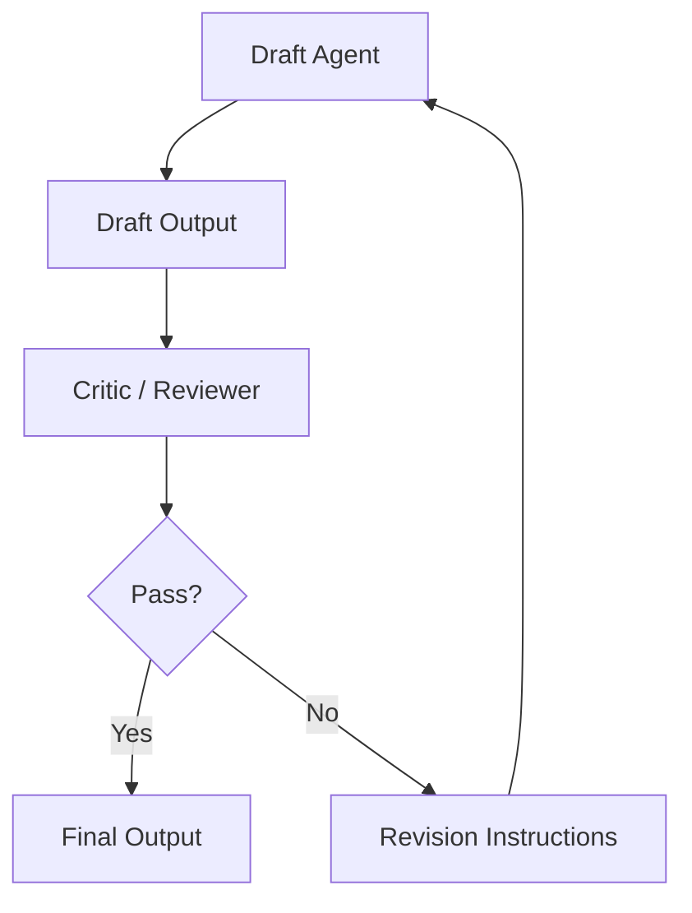

### When to Use

Use this pattern when:

- quality matters
- safety matters
- output is customer-facing
- output is executive-facing
- output must be grounded
- output must follow policy
- hallucination risk is material

### Reviewer Checks

The reviewer can check:

- factual support
- citations
- policy compliance
- tone
- completeness
- safety
- schema validity
- missing assumptions
- risk level

### Benefits

- improves quality
- catches obvious failures
- supports governance
- enables automated pre-review

### Risks

- reviewer may miss errors
- reviewer may share model weaknesses
- extra cost and latency
- false confidence

### Design Guidance

Use critic-reviewer as a quality layer, not as a substitute for deterministic validation or human approval.

---

## 10. Pattern 7 — Reflection Loop

A reflection loop allows the agent to evaluate its own intermediate work and revise.

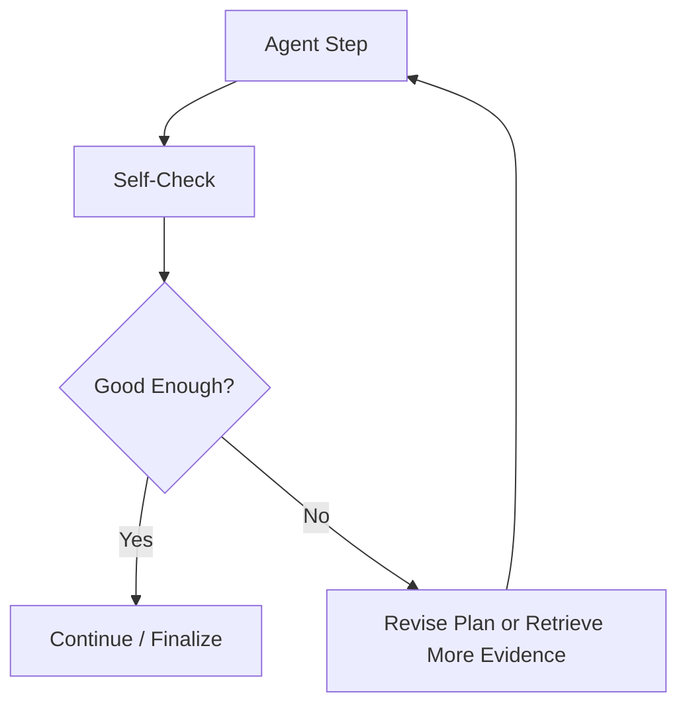

### When to Use

Use this pattern when:

- tasks require careful synthesis
- answer quality is more important than speed
- the agent must check completeness
- evidence may be incomplete
- reasoning errors are costly

### Benefits

- improves completeness
- catches missing evidence
- reduces shallow answers
- useful for analysis workflows

### Risks

- can loop
- increases cost
- may rationalize wrong answers
- creates false confidence
- hard to evaluate

### Design Guidance

Reflection loops require strict step limits, cost budgets, and external validation.

---

## 11. Pattern 8 — Human Approval Gate

The human approval gate pattern inserts human review before high-impact actions.

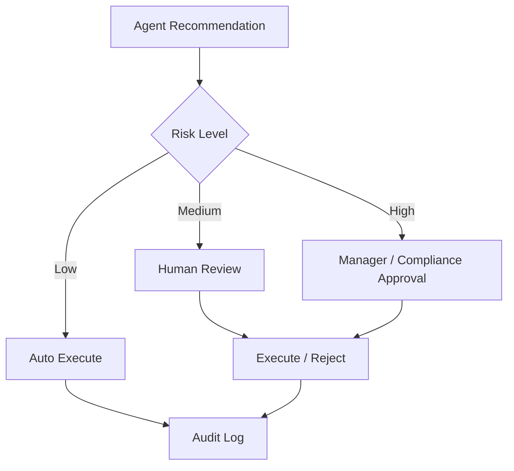

### When to Use

Use this pattern for:

- refunds
- account changes
- legal responses
- HR decisions
- medical decisions
- financial decisions
- production changes
- customer-impacting actions
- irreversible actions

### Benefits

- improves safety
- preserves accountability
- supports compliance
- builds trust
- enables gradual autonomy

### Risks

- slows workflow
- creates review backlog
- unclear approval criteria
- rubber-stamp behavior

### Design Guidance

Human approval should be structured. The agent should provide evidence, recommendation, risk level, and required decision.

---

## 12. Pattern 9 — Retrieval-Augmented Agent

A retrieval-augmented agent uses RAG as part of its reasoning loop.

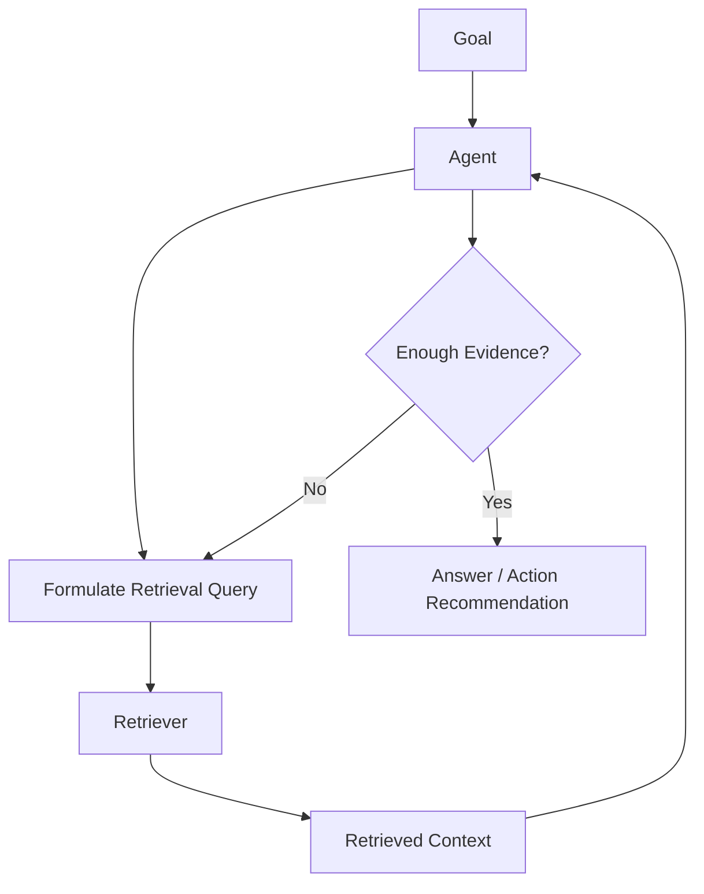

### When to Use

Use this pattern when:

- knowledge is distributed
- multiple sources may be needed
- evidence must be compared
- source citations matter
- query decomposition improves retrieval

### Example

A field service agent searches manuals, known issues, prior repairs, and customer configuration before recommending diagnostic steps.

### Benefits

- better grounding
- multi-source investigation
- improved citations
- useful for knowledge-heavy workflows

### Risks

- retrieval loops
- too much context
- conflicting evidence
- stale knowledge
- prompt injection from retrieved documents

### Design Guidance

Separate retrieved content from instructions. Treat retrieved documents as evidence, not commands.

---

## 13. Pattern 10 — Memory-Enabled Agent

A memory-enabled agent stores and retrieves information over time.

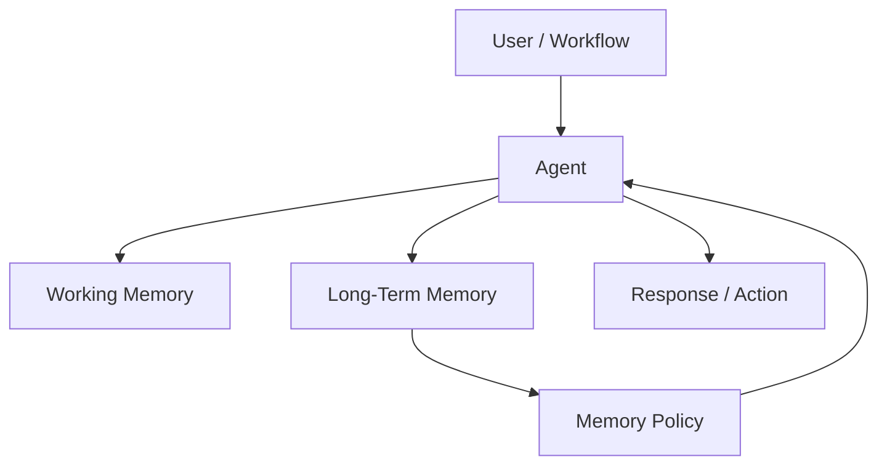

### When to Use

Use memory when:

- continuity matters
- personalization improves value
- repeated workflows benefit from history
- prior decisions matter
- project context must persist

### Memory Types

| Memory | Purpose |
|---|---|
| working memory | current task state |
| session memory | current conversation |
| episodic memory | prior events |
| semantic memory | durable facts |
| procedural memory | learned workflow steps |

### Benefits

- continuity
- personalization
- reduced repetition
- better project context

### Risks

- privacy issues
- stale assumptions
- incorrect memory
- cross-user leakage
- compliance risk
- hidden personalization

### Design Guidance

Memory must be explicit, permissioned, auditable, erasable, and freshness-aware.

---

## 14. Pattern 11 — Event-Driven Agent

An event-driven agent runs in response to system events rather than user prompts.

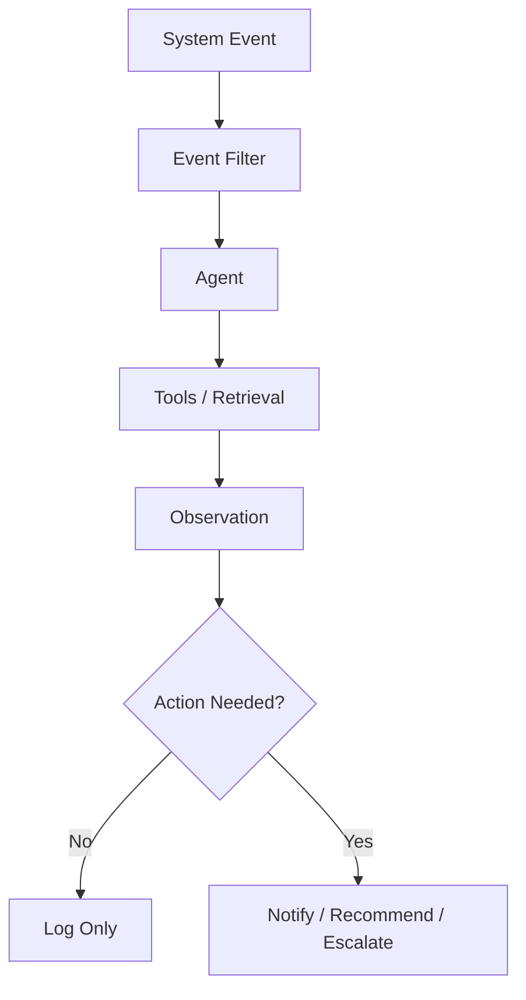

### When to Use

Use this pattern when:

- events require investigation
- signals arrive continuously
- operations teams need triage
- monitoring needs context
- alerts are noisy
- incidents require summarization

### Examples

- device heartbeat anomaly
- failed deployment
- security alert
- customer churn signal
- SLA breach
- inventory shortage
- support escalation spike

### Benefits

- proactive
- reduces alert fatigue
- accelerates response
- connects signals to knowledge

### Risks

- notification noise
- false positives
- runaway processing
- cost spikes
- alert amplification

### Design Guidance

Use thresholds, sampling, deduplication, and human escalation policies.

---

## 15. Pattern 12 — Deterministic Workflow Plus Agent

This is one of the strongest enterprise patterns.

The workflow remains deterministic, but selected steps use AI for ambiguity, language, or synthesis.

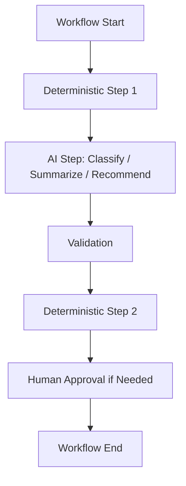

### When to Use

Use this pattern when:

- the workflow has known structure
- only some steps need AI
- auditability matters
- business process control matters
- risk must be bounded

### Benefits

- high control
- easier compliance
- easier testing
- lower autonomy risk
- fits enterprise systems

### Risks

- less flexible
- workflow design effort
- may not handle unusual cases

### Design Guidance

This pattern should be the default for many enterprise AI workflows.

---

## 16. Pattern 13 — Multi-Agent Collaboration

Multiple agents collaborate to solve a task.

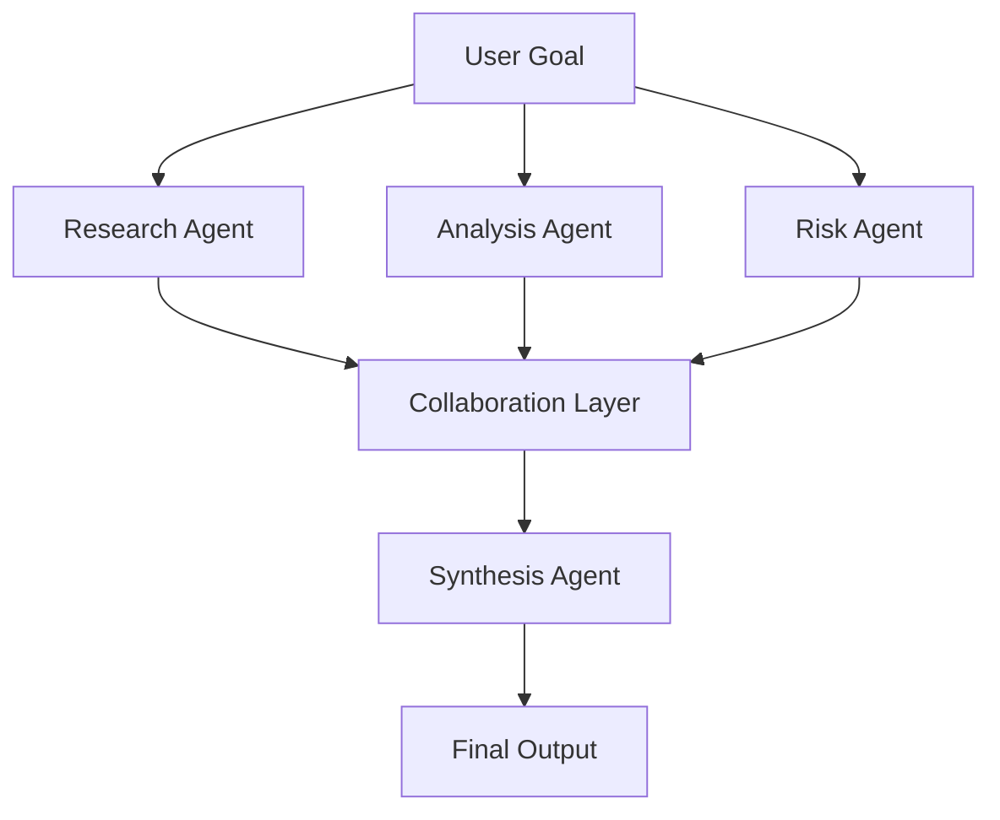

### When to Use

Use this pattern when:

- tasks require genuinely different perspectives
- parallel work reduces time
- specialization improves quality
- outputs need synthesis
- complexity is justified

### Benefits

- specialization
- parallelism
- richer analysis
- modular evaluation

### Risks

- high cost
- coordination failures
- conflicting conclusions
- difficult debugging
- over-engineering

### Design Guidance

Use multi-agent collaboration only after simpler patterns are insufficient.

---

## 17. Pattern 14 — Hierarchical Agent System

A hierarchical system has supervisors at multiple levels.

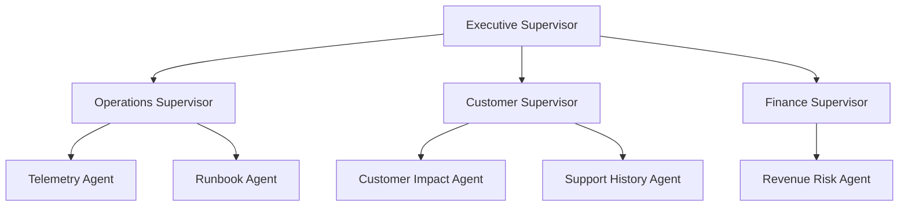

### When to Use

Use this pattern when:

- enterprise workflows span domains
- many specialized agents exist
- governance requires hierarchy
- complex synthesis is needed
- multiple business functions are involved

### Benefits

- enterprise-scale organization
- domain specialization
- modular growth
- aligns with org structure

### Risks

- very complex
- expensive
- difficult to evaluate
- governance burden
- slow if over-layered

### Design Guidance

Do not start here. Evolve into hierarchy only when domain complexity justifies it.

---

## 18. Pattern Comparison Table

| Pattern | Best For | Complexity | Risk | Cost |
|---|---|---:|---:|---:|
| Single-agent assistant | narrow low-risk tasks | Low | Low-Med | Low |
| Tool-using agent | live data/actions | Medium | Medium | Medium |
| Planner-executor | multi-step tasks | Medium | Medium | Medium |
| Router-agent | multi-domain entry point | Medium | Medium | Low-Med |
| Supervisor-worker | specialized workflows | High | Medium-High | High |
| Critic-reviewer | quality/safety review | Medium | Low-Med | Medium |
| Reflection loop | complex reasoning | Medium | Medium | Medium-High |
| Human approval gate | high-impact actions | Medium | Low | Medium |
| Retrieval-augmented agent | knowledge-heavy work | Medium | Medium | Medium |
| Memory-enabled agent | continuity/personalization | High | High | Medium |
| Event-driven agent | proactive operations | High | High | Variable |
| Workflow plus agent | controlled enterprise process | Medium | Low-Med | Medium |
| Multi-agent collaboration | complex parallel work | High | High | High |
| Hierarchical agents | enterprise-scale domains | Very High | High | Very High |

---

## 19. State Management by Pattern

Agent state design varies by pattern.

| Pattern | State Requirements |
|---|---|
| Single agent | task state, tool observations |
| Tool-using agent | tool calls, outputs, permissions |
| Planner-executor | plan, step status, observations |
| Supervisor-worker | worker assignments, outputs, synthesis |
| Critic-reviewer | draft, critique, revisions |
| Reflection loop | self-checks, iterations, stop limits |
| Human approval | recommendation, evidence, approval status |
| Event-driven | event ID, deduplication, trigger context |
| Memory-enabled | memory read/write decisions |
| Multi-agent | agent messages, conflicts, final synthesis |

### State Principle

> If it matters for audit, debugging, cost, or safety, it belongs in state or trace logs.

---

## 20. Tool Boundary Design

Tool boundary design is one of the most important architecture decisions.

### Tool Boundary Questions

- What can this tool do?
- Who can call it?
- What data can it access?
- What inputs are valid?
- What outputs are returned?
- What errors can occur?
- What actions are irreversible?
- What actions require approval?
- What is logged?
- What is rate-limited?

### Tool Risk Tiers

| Tier | Example | Control |
|---:|---|---|
| 1 | search knowledge base | log and filter |
| 2 | query customer status | auth and audit |
| 3 | create ticket | confirmation |
| 4 | change account setting | human approval |
| 5 | issue refund / production change | strict approval and rollback |
| 6 | financial/legal/medical decision | decision support only |

---

## 21. Stop Conditions by Pattern

| Pattern | Required Stop Conditions |
|---|---|
| Single agent | max steps, low confidence |
| Tool-using agent | tool failure, approval required |
| Planner-executor | plan complete, plan invalid |
| Router-agent | unknown intent, high risk |
| Supervisor-worker | worker conflict, timeout |
| Critic-reviewer | max revisions |
| Reflection loop | max reflection cycles |
| Retrieval agent | insufficient evidence |
| Event-driven agent | duplicate event, no action needed |
| Multi-agent | unresolved disagreement |
| Human approval | approval denied or expired |

Stop conditions must be implemented outside the model whenever possible.

---

## 22. Error Handling and Fallback

Agent systems fail in many ways.

### Error Types

- model timeout
- tool timeout
- invalid tool parameters
- permission denied
- missing data
- conflicting evidence
- invalid output schema
- low confidence
- policy violation
- user ambiguity
- cost budget exceeded

### Fallback Options

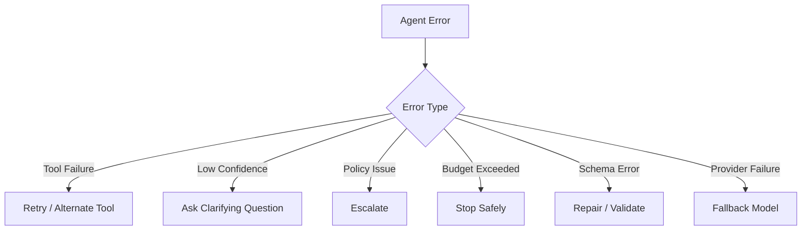

A production agent should fail safely, not creatively.

---

## 23. Agent Pattern Evaluation

Agent evaluation should match the architecture pattern.

### Evaluation Matrix

| Pattern | Evaluation Focus |
|---|---|
| Single agent | final answer, step count |
| Tool-using agent | tool selection and parameters |
| Planner-executor | plan quality and execution success |
| Router-agent | routing accuracy |
| Supervisor-worker | worker output quality and synthesis |
| Critic-reviewer | critique usefulness and pass/fail accuracy |
| Reflection loop | improvement vs cost |
| Human approval | escalation correctness |
| RAG agent | retrieval quality and groundedness |
| Memory agent | memory correctness and privacy |
| Event-driven agent | trigger precision and alert value |
| Multi-agent | collaboration quality and conflict resolution |

### Trace-Based Evaluation

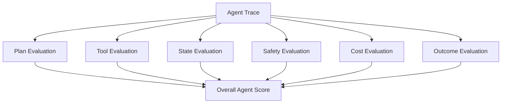

---

## 24. Cost and Latency by Pattern

Agent patterns differ dramatically in cost.

| Pattern | Cost Driver |
|---|---|
| Single agent | model calls |
| Tool-using agent | tool calls plus model calls |
| Planner-executor | planning plus execution loops |
| Supervisor-worker | multiple agents |
| Critic-reviewer | review and revisions |
| Reflection loop | repeated model calls |
| RAG agent | retrieval, reranking, model |
| Event-driven agent | trigger volume |
| Multi-agent | parallel model/tool calls |
| Hierarchical agents | orchestration overhead |

### Cost Control Pattern

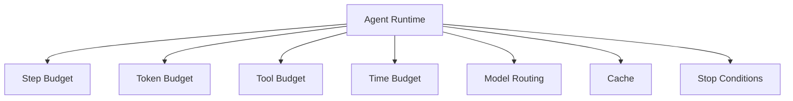

---

## 25. Enterprise Agent Runtime

A production agent needs runtime infrastructure.

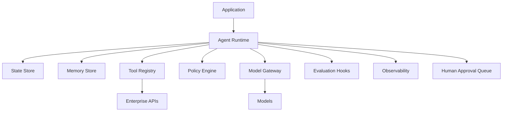

### Runtime Responsibilities

- execute agent loop
- manage state
- load prompts
- call models
- call tools
- enforce policies
- handle errors
- manage retries
- check stop conditions
- log traces
- trigger evaluation
- route human approvals

---

## 26. Agent Registry

An enterprise should track approved agents.

### Agent Registry Metadata

```yaml
agent_id: incident-analysis-agent
owner: ai-platform-operations
business_owner: global-operations
pattern: supervisor-worker
risk_tier: medium
autonomy_level: 2
approved_tools:
  - telemetry_query
  - runbook_search
  - incident_similarity_search
human_approval_required_for:
  - production_change
  - customer_notification
  - firmware_rollback
evaluation_report: evals/incident-analysis-agent-v1.md
status: approved
last_reviewed: 2026-06-26
```

The registry provides visibility, governance, and auditability.

---

## 27. Anti-Patterns

### Anti-Pattern 1: The God Agent

One agent with too many tools, too many responsibilities, and vague instructions.

Risk:

- unpredictable behavior
- high cost
- tool misuse
- hard debugging
- security exposure

Better:

- router
- specialized agents
- scoped tools
- deterministic workflow

### Anti-Pattern 2: Multi-Agent Theater

Using many agents because it looks impressive, not because the workflow requires it.

Risk:

- cost explosion
- coordination overhead
- weak ROI
- poor reliability

Better:

- start with single-agent or workflow plus agent

### Anti-Pattern 3: Agent as Security Boundary

Relying on the agent to decide what it is allowed to do.

Risk:

- prompt injection
- privilege escalation
- policy bypass

Better:

- deterministic policy engine
- tool authorization
- human approval

### Anti-Pattern 4: Infinite Research Agent

The agent keeps searching and never produces a useful answer.

Risk:

- wasted cost
- poor user experience
- no decision support

Better:

- evidence threshold
- step budget
- stop conditions

### Anti-Pattern 5: Hidden Memory

Agent stores information without user or governance visibility.

Risk:

- privacy violations
- stale assumptions
- cross-user leakage

Better:

- explicit memory policy
- memory review
- audit logs

---

## 28. Enterprise Use Case: Support Case Resolution Agent

### Pattern

Router-agent plus RAG agent plus human approval gate.

```mermaid
flowchart TD
    C[Customer Case] --> R[Router Agent]
    R -->|Policy| P[Policy RAG Agent]
    R -->|Technical| T[Technical Troubleshooting Agent]
    R -->|Billing| B[Billing Agent]
    R -->|High Risk| H[Human Review]

    P --> V[Validation]
    T --> V
    B --> V
    V --> D[Draft Response / Action]
    D --> A{Approval Needed?}
    A -->|Yes| H
    A -->|No| O[Send / Update Case]
```

### Metrics

- first-contact resolution
- average handle time
- escalation rate
- response accuracy
- customer satisfaction
- agent cost per case
- human approval rate

---

## 29. Enterprise Use Case: Device Operations Incident Agent

### Pattern

Supervisor-worker plus retrieval-augmented agent plus human approval gate.

```mermaid
flowchart TD
    E[Heartbeat Failure Alert] --> S[Supervisor Agent]

    S --> W1[Telemetry Worker]
    S --> W2[Runbook Worker]
    S --> W3[Firmware Worker]
    S --> W4[Customer Impact Worker]
    S --> W5[Incident Similarity Worker]

    W1 --> X[Evidence Package]
    W2 --> X
    W3 --> X
    W4 --> X
    W5 --> X

    X --> V[Validation Agent]
    V --> S
    S --> R[Recommendation + Executive Summary]
    R --> H{Production Action?}
    H -->|Yes| A[Human Approval]
    H -->|No| N[Notify Ops]
```

### Actions Allowed

The agent can:

- investigate
- summarize
- recommend
- draft communication
- create internal ticket

The agent cannot autonomously:

- roll back firmware
- change device configuration
- notify customers externally
- close incident

---

## 30. Enterprise Use Case: Sales Account Intelligence Agent

### Pattern

Planner-executor plus retrieval plus memory.

```mermaid
flowchart TD
    U[Sales Rep Request] --> P[Planner]
    P --> C[CRM Lookup]
    P --> S[Support History Search]
    P --> N[News / Market Research]
    P --> O[Opportunity Analysis]
    C --> B[Account Brief]
    S --> B
    N --> B
    O --> B
    B --> R[Meeting Prep Summary]
```

### Metrics

- prep time reduction
- meeting quality
- opportunity conversion
- account risk detection
- sales rep adoption

---

## 31. Enterprise Use Case: Executive Intelligence Agent

### Pattern

Supervisor-worker plus critic-reviewer.

```mermaid
flowchart TD
    Q[Executive Question] --> S[Supervisor]
    S --> F[Finance Worker]
    S --> O[Operations Worker]
    S --> C[Customer Signal Worker]
    S --> M[Market Context Worker]

    F --> D[Draft Brief]
    O --> D
    C --> D
    M --> D

    D --> R[Reviewer]
    R --> X{Executive Ready?}
    X -->|No| S
    X -->|Yes| E[Executive Brief]
```

### Metrics

- decision cycle time
- briefing quality
- issue detection
- executive satisfaction
- reduction in manual reporting

---

## 32. Capstone Architecture — Enterprise Agentic Operations Platform

Chapter 7 introduced the capstone agent concept. This chapter defines the architecture pattern.

### Recommended Capstone Pattern

Supervisor-worker plus retrieval-augmented agents plus deterministic workflow plus human approval gate.

```mermaid
flowchart TD
    U[Operations User / Executive] --> G[AI Gateway]
    G --> S[Supervisor Agent]

    S --> F[Fleet Health Agent]
    S --> C[Customer Impact Agent]
    S --> R[Revenue Risk Agent]
    S --> K[Knowledge Retrieval Agent]
    S --> V[Validation Agent]
    S --> E[Executive Summary Agent]

    F --> T[Telemetry Tools]
    C --> CRM[CRM / Customer Tools]
    R --> FIN[Finance / Contract Tools]
    K --> RAG[RAG + Vector Retrieval]
    V --> POL[Policy Engine]
    E --> DOC[Briefing Generator]

    T --> EP[Evidence Package]
    CRM --> EP
    FIN --> EP
    RAG --> EP
    POL --> EP

    EP --> S
    S --> H{High-Impact Action?}
    H -->|Yes| A[Human Approval]
    H -->|No| O[Recommendation / Summary]

    A --> O
```

### Why This Pattern Fits

The capstone workflow requires:

- multiple specialized domains
- telemetry and live data
- knowledge retrieval
- business impact analysis
- validation
- executive synthesis
- human approval for production actions

A single agent would be overloaded. A fully autonomous agent would be unsafe. A deterministic workflow alone would be too rigid. The hybrid supervisor-worker pattern provides bounded adaptability.

---

## 33. Security and Governance Pattern

Agent architecture must include security and governance by design.

```mermaid
flowchart TD
    A[Agent Request] --> B[Identity and Access]
    B --> C[Agent Registry]
    C --> D[Tool Permission Check]
    D --> E[Data Permission Check]
    E --> F[Risk Classification]
    F --> G{Approval Required?}
    G -->|Yes| H[Human Approval]
    G -->|No| I[Execute]
    H --> I
    I --> J[Audit Log]
```

### Governance Questions

- Is this agent approved?
- Who owns it?
- What autonomy level is allowed?
- What tools can it access?
- What data can it access?
- What actions require approval?
- What logs are retained?
- What evaluation evidence exists?
- How is it monitored?
- How is it retired?

---

## 34. Observability Pattern

Agent observability must capture the full decision chain.

```mermaid
flowchart TD
    A[Agent Run] --> B[Goal]
    A --> C[Plan]
    A --> D[State Changes]
    A --> E[Tool Calls]
    A --> F[Model Calls]
    A --> G[Memory Reads/Writes]
    A --> H[Policy Decisions]
    A --> I[Human Approvals]
    A --> J[Final Output]
    A --> K[Cost and Latency]
```

### Required Trace Fields

- agent ID
- version
- user ID or service ID
- goal
- pattern type
- autonomy level
- step count
- tools called
- tool parameters
- observations
- model calls
- memory operations
- policy decisions
- approval events
- final output
- validation results
- total cost
- total latency

---

## 35. Agent Evaluation Scorecard

| Dimension | Weight | Notes |
|---|---:|---|
| Task completion | 20% | Did the agent complete the workflow? |
| Tool-use accuracy | 15% | Correct tools and parameters |
| Safety | 15% | No unsafe actions |
| Grounding | 10% | Evidence-supported output |
| Efficiency | 10% | Reasonable steps and cost |
| Stop behavior | 10% | Stopped correctly |
| Human escalation | 10% | Escalated appropriately |
| Business outcome | 10% | Improved measurable workflow |

### Scorecard Rule

> Evaluate the full trace, not just the final answer.

---

## 36. Architecture Review Scenario

### Scenario

A company wants to build an AI operations agent that can diagnose incidents, remediate infrastructure, notify customers, and close incidents automatically.

### Initial Design

The team proposes one powerful agent with access to:

- monitoring system
- logs
- production deployment tools
- customer notification system
- incident management system
- knowledge base
- Slack
- email

The prompt says:

```text
You are an autonomous operations agent. Resolve incidents as quickly as possible.
```

### Review Finding

This design is not production-ready.

### Problems

- vague goal
- excessive autonomy
- too many tools
- no risk tiers
- no approval gates
- no separation of investigation and action
- no rollback process
- no state model
- no cost budget
- no incident trace
- no evaluation
- no blast-radius control
- no executive communication review

### Improved Design

```mermaid
flowchart TD
    I[Incident Alert] --> R[Router]
    R --> S[Supervisor Agent]

    S --> W1[Telemetry Investigation]
    S --> W2[Runbook Retrieval]
    S --> W3[Similar Incident Search]
    S --> W4[Customer Impact Analysis]
    S --> W5[Remediation Recommendation]

    W1 --> E[Evidence Package]
    W2 --> E
    W3 --> E
    W4 --> E
    W5 --> E

    E --> V[Validation]
    V --> A{Action Type}
    A -->|Informational| N[Notify Ops]
    A -->|Low-Risk Reversible| H1[Ops Approval]
    A -->|High-Risk Production| H2[Change Approval Board]
    H1 --> X[Execute via Controlled Tool]
    H2 --> X
    X --> L[Audit and Postmortem]
```

### Recommendation

Separate investigation from remediation. Let the agent investigate, recommend, draft, and summarize. Require human approval for production changes and customer communications until the system has proven reliability.

---

## 37. Lessons from the Field

### What Worked

The strongest enterprise agent systems use patterns, not open-ended autonomy.

What works:

- deterministic workflow plus agent for controlled processes
- tool-using agents with scoped tools
- planner-executor for transparent multi-step work
- human approval gates for high-impact actions
- retrieval-augmented agents for knowledge-heavy workflows
- supervisor-worker only when specialization is justified
- trace-based evaluation
- cost budgets and stop conditions
- agent registry and governance

The best agents feel useful because they reduce work. They do not feel magical. They feel controlled.

### What Did Not Work

The weakest systems start with a generic autonomous agent and then try to add controls later.

That usually fails because:

- tool access is too broad
- responsibilities are unclear
- cost is unpredictable
- no one owns failures
- users do not trust actions
- logs are incomplete
- human approval was not designed upfront
- security and compliance are added too late

### Common Mistakes

- Starting with multi-agent systems.
- Giving agents too many tools.
- Not separating planning from execution.
- Not using deterministic approval.
- Treating critic agents as perfect validators.
- Allowing unbounded reflection loops.
- Not evaluating tool parameters.
- Not logging state transitions.
- Ignoring cost per completed task.
- Letting agents write to memory without governance.
- Deploying event-driven agents without deduplication.
- Using agents when RAG would be sufficient.

### ROI Perspective

Agent architecture creates ROI when the selected pattern improves a measurable workflow.

ROI drivers:

- reduced manual coordination
- faster investigation
- fewer handoffs
- better support throughput
- improved incident response
- faster sales preparation
- better executive synthesis
- reduced operational errors

Cost drivers:

- model calls
- tool calls
- orchestration
- observability
- human approvals
- evaluation
- governance
- failure handling

The ROI question is:

> Does this agent pattern reduce workflow cost, delay, or risk enough to justify its complexity?

### CTO Perspective

A CTO should ask:

- Why is this an agent instead of a workflow?
- Which agent pattern are we using?
- Why is that pattern the simplest sufficient design?
- What tools can the agent access?
- What actions require approval?
- How is state stored?
- What is logged?
- What are the stop conditions?
- How is the full trace evaluated?
- What is the cost per completed task?
- Who owns this agent?
- How do we roll it back?

If the team cannot name the pattern, boundaries, and evaluation strategy, the agent is not enterprise-ready.

---

## 38. Pratik's Principles

### Principle 1: Patterns Beat Prompts

A clever prompt does not make an agent safe. A good architecture pattern does.

### Principle 2: Start with the Simplest Sufficient Pattern

Do not use supervisor-worker or multi-agent designs when a tool-using agent or deterministic workflow is enough.

### Principle 3: Separate Investigation from Action

Agents can investigate and recommend before they are trusted to act.

### Principle 4: Humans Belong at High-Impact Boundaries

Human approval is not a weakness. It is an accountability control.

### Principle 5: Every Tool Expands the Blast Radius

Tool access should be scoped, permissioned, logged, and justified.

### Principle 6: Evaluate the Trace

The final answer can look good while the agent took unsafe or wasteful steps.

### Principle 7: Agent Memory Must Be Governed

Memory without policy becomes invisible risk.

### Principle 8: Multi-Agent Is an Optimization, Not a Starting Point

Use multiple agents only when specialization, parallelism, or governance justifies the complexity.

---

## 39. Hands-On Labs

### Lab 1: Build a Tool-Using Agent Pattern

Create a simple agent with two tools:

- `search_policy(query)`
- `create_ticket(summary, priority)`

Requirements:

- typed tool schemas
- permission check
- max step count
- trace log

Deliverable:

```text
labs/chapter-08-agent-patterns/tool-using-agent/
  README.md
  agent.py
  tools.py
  policy.py
  trace.json
```

### Lab 2: Build a Planner-Executor Agent

Create a planner that produces a plan and an executor that runs each step.

Requirements:

- plan schema
- step status
- observation capture
- final synthesis
- failure handling

Deliverable:

```text
planner-executor-report.md
```

### Lab 3: Add a Critic-Reviewer

Add a reviewer that checks:

- groundedness
- completeness
- tone
- policy compliance
- missing evidence

Deliverable:

```text
critic-reviewer-evaluation.md
```

### Lab 4: Build a Human Approval Gate

Create approval rules:

- low-risk ticket creation: auto
- refund under threshold: supervisor approval
- refund over threshold: manager approval
- account closure: compliance approval

Deliverable:

```text
human-approval-gate-design.md
```

### Lab 5: Agent Pattern Comparison

Take one workflow and design it three ways:

1. deterministic workflow plus agent
2. planner-executor
3. supervisor-worker

Compare:

- complexity
- cost
- latency
- risk
- evaluation burden
- business value

Deliverable:

```text
agent-pattern-comparison.md
```

### Lab 6: Capstone Agent Architecture

Design the Enterprise Agentic Operations Platform using:

- supervisor-worker
- retrieval-augmented agent
- validation agent
- human approval gate

Deliverable:

```text
capstone-agent-architecture.md
```

---

## 40. Interview Questions

### Engineering-Level Questions

1. What is an agent architecture pattern?
2. How is a tool-using agent different from a simple LLM workflow?
3. What is the planner-executor pattern?
4. Why use a critic-reviewer?
5. What are stop conditions?
6. How do you evaluate tool-use accuracy?
7. What is agent trace evaluation?
8. Why are human approval gates important?
9. What is the risk of reflection loops?
10. When is multi-agent architecture overkill?

### Architect-Level Questions

1. Design a supervisor-worker agent architecture for incident response.
2. How would you design a model/router layer for agents?
3. How would you enforce tool permissions?
4. How would you design state management for a planner-executor agent?
5. How would you evaluate a multi-agent system?
6. How would you design event-driven agents safely?
7. How would you combine deterministic workflows with agents?
8. How would you govern agent memory?
9. How would you design observability for agent traces?
10. How would you prevent cost explosion in agent systems?

### Director / VP / CTO-Level Questions

1. Which agent pattern should we start with and why?
2. How do we decide autonomy levels?
3. What agent actions require human approval?
4. How do we measure ROI from agentic AI?
5. How do we prevent agent sprawl?
6. Who owns agent failures?
7. How do we audit agent behavior?
8. How do we phase from assistive agents to controlled autonomy?
9. What are the business risks of multi-agent systems?
10. What would make you reject an agent architecture?

---

## 41. Certification Mapping

### AWS AI / Generative AI Professional Preparation

This chapter supports topics related to:

- Amazon Bedrock Agents
- agent orchestration
- action groups
- tool invocation
- human approval patterns
- guardrails
- model selection for agents
- RAG with agents
- agent evaluation
- production monitoring

### Anthropic Claude / MCP Architecture Preparation

This chapter supports topics related to:

- Claude tool use
- MCP tool boundaries
- agent patterns
- context design
- safe tool execution
- human-in-the-loop
- prompt injection risk
- memory governance

### NVIDIA Generative AI Preparation

This chapter supports topics related to:

- agent inference workloads
- multi-call latency
- model serving for agent systems
- cost of orchestration
- throughput planning
- optimization of agent loops

---

## 42. Chapter Exercises

### Exercise 1

A business team asks for an autonomous agent to handle all customer service issues.

Design a safer phased architecture.

Include:

- Phase 1: agent assist
- Phase 2: low-risk automation
- Phase 3: approval-gated actions
- Phase 4: limited autonomy

### Exercise 2

Design a planner-executor agent for field service troubleshooting.

Include:

- plan schema
- tools
- state
- stop conditions
- human escalation
- evaluation metrics

### Exercise 3

Compare supervisor-worker and multi-agent collaboration for incident response.

Which would you choose first and why?

### Exercise 4

Create an agent registry schema.

Include:

- owner
- pattern
- autonomy level
- approved tools
- risk tier
- evaluation report
- approval requirements
- monitoring requirements

### Exercise 5

Design an agent observability dashboard.

Include:

- active agents
- step count
- tool calls
- cost
- latency
- approval rate
- failure rate
- loop detection
- escalation rate
- task completion rate

---

## 43. Key Terms

| Term | Meaning |
|---|---|
| Agent architecture pattern | Reusable design structure for an agentic workflow |
| Single-agent assistant | One agent handling a narrow workflow |
| Tool-using agent | Agent that calls external tools or APIs |
| Planner-executor | Pattern separating planning and execution |
| Router-agent | Agent that routes tasks by intent, risk, or domain |
| Supervisor-worker | Pattern where supervisor coordinates specialized agents |
| Critic-reviewer | Pattern where output is reviewed before release |
| Reflection loop | Agent self-check and revision cycle |
| Human approval gate | Human decision point before high-impact action |
| Retrieval-augmented agent | Agent that uses retrieval inside its loop |
| Memory-enabled agent | Agent that stores and retrieves memory |
| Event-driven agent | Agent triggered by system events |
| Multi-agent collaboration | Multiple agents cooperating on one goal |
| Hierarchical agents | Multi-level agent organization |
| Agent runtime | Infrastructure that executes agent workflows |
| Agent registry | Governance inventory of approved agents |
| Agent trace | Logged sequence of decisions, tools, state, and outputs |

---

## 44. One-Page Executive Brief

Agent architecture patterns are how enterprises turn agentic AI from open-ended autonomy into controlled workflow systems.

An agent can reason over a goal, use tools, maintain state, observe results, and continue until a task is complete. That flexibility creates value, but it also creates risk. Without architecture, agents can misuse tools, loop, drift from goals, leak data, create cost overruns, or take unsafe actions.

The right question is not "How many agents should we build?"

The right question is:

> Which workflow needs adaptive AI behavior, and what is the simplest safe agent pattern for that workflow?

Common patterns include:

- single-agent assistant
- tool-using agent
- planner-executor
- supervisor-worker
- critic-reviewer
- reflection loop
- human approval gate
- retrieval-augmented agent
- deterministic workflow plus agent
- event-driven agent
- multi-agent system

Most enterprises should start with simple, bounded patterns. Human approval should remain in place for high-impact actions. Tools must be permissioned and logged. State must be traceable. Cost must be monitored. Evaluation must inspect the full agent trace, not just the final answer.

Agentic AI creates business value when it reduces manual coordination, accelerates investigations, improves support, speeds incident response, and helps employees complete complex workflows faster.

The executive decision is about controlled autonomy:

> How much autonomy creates measurable value without exceeding our risk, cost, and accountability boundaries?

---

## 45. Chapter Summary

In this chapter, we explored Agent Architecture Patterns.

We learned that agent patterns are reusable control structures for goal-directed AI systems. They help teams design agent systems that are testable, observable, governable, and aligned with business workflows.

We covered single-agent assistants, tool-using agents, planner-executor, router-agent, supervisor-worker, critic-reviewer, reflection loops, human approval gates, retrieval-augmented agents, memory-enabled agents, event-driven agents, deterministic workflow plus agent, multi-agent collaboration, and hierarchical agent systems.

We examined state management, tool boundaries, stop conditions, error handling, fallback, runtime infrastructure, agent registries, anti-patterns, enterprise use cases, security, governance, observability, evaluation, cost, ROI, and the capstone platform architecture.

The key lesson is:

> Agent architecture patterns give autonomy a shape, a boundary, and an operating model.

In Chapter 9, we will move from patterns to implementation using LangGraph for enterprise agents, focusing on state graphs, nodes, edges, conditional routing, loops, checkpoints, human review, and durable agent workflows.

---

## 46. Suggested Git Commit

```bash
mkdir -p chapters
cp 08-agent-architecture-patterns.md chapters/08-agent-architecture-patterns.md

git add chapters/08-agent-architecture-patterns.md
git commit -m "Add Chapter 8: Agent Architecture Patterns"
git push origin main
```
