# Chapter 11 — Amazon Bedrock

**Book:** The AI Architect & Practitioner Bootcamp  
**Chapter Status:** Complete Draft  
**Version:** 0.1 — Deep Dive  
**Author:** Pratik Desai  
**Primary Audience:** AI engineers, enterprise architects, AWS architects, cloud platform engineers, security architects, data engineers, engineering leaders, consultants, directors, VPs, CTO-track practitioners, and certification candidates

---

## Chapter Thesis

Amazon Bedrock is not just a model catalog.

Amazon Bedrock is an **enterprise control plane for building, securing, governing, and scaling foundation-model applications on AWS**.

A beginner sees Bedrock as a place to invoke large language models.

A practitioner sees Bedrock as a managed service that provides access to foundation models.

An enterprise AI architect should see Bedrock as a platform layer that connects model access, inference APIs, prompt management, knowledge bases, agents, guardrails, evaluation, IAM, networking, logging, cost control, and AWS-native operations.

The central thesis of this chapter is:

> Bedrock becomes valuable when it is used as part of an enterprise AI architecture, not when it is treated as a shortcut to call a model.

Bedrock reduces undifferentiated infrastructure burden. It does not remove the need for architecture. Teams still need to design:

- model selection
- prompt lifecycle
- RAG architecture
- agent boundaries
- tool access
- guardrails
- evaluation
- observability
- cost controls
- IAM policies
- data boundaries
- human approval
- incident response

Bedrock gives the enterprise a managed foundation. The architect still owns the system.

---

## Learning Objectives

By the end of this chapter, you will be able to:

- Explain what Amazon Bedrock is and where it fits in enterprise AI architecture.
- Describe Bedrock as a managed foundation-model platform rather than a single-model service.
- Compare Converse API, ConverseStream, InvokeModel, and InvokeModelWithResponseStream usage patterns.
- Explain model access, model selection, marketplace permissions, and provider considerations.
- Design an enterprise Bedrock architecture with IAM, VPC endpoints, logging, guardrails, evaluation, and cost controls.
- Explain when to use on-demand inference, inference profiles, and provisioned throughput.
- Understand prompt management and prompt lifecycle controls.
- Position Bedrock Knowledge Bases, Bedrock Agents, and Bedrock Guardrails in the broader platform architecture.
- Integrate Bedrock with LangGraph, MCP, RAG, and enterprise APIs.
- Design Bedrock patterns for customer support, device operations, executive intelligence, and personalization.
- Build an architecture review checklist for Bedrock production readiness.
- Discuss Bedrock at engineering, architect, Director, VP, and CTO levels.

---

## Executive Summary

Amazon Bedrock is a fully managed AWS service that provides secure, enterprise-grade access to high-performing foundation models and helps organizations build and scale generative AI applications.

Bedrock supports multiple model providers and model families through a managed AWS interface. It provides runtime APIs for inference, management APIs for Bedrock resources, support for conversational inference, model access controls, provisioned throughput, prompt management, knowledge bases, agents, guardrails, evaluation capabilities, and AWS-native security and operations patterns.

The important enterprise shift is this:

> Bedrock allows AI applications to be governed like cloud workloads instead of unmanaged experiments.

That matters because enterprise AI applications need:

- approved model access
- IAM policy control
- network isolation
- centralized logging
- predictable cost
- model lifecycle discipline
- data protection
- prompt management
- retrieval architecture
- agent orchestration
- guardrails
- evaluation
- observability
- compliance alignment

Bedrock is not a complete architecture by itself. It is a managed platform component inside the larger enterprise AI architecture.

For many AWS-centric enterprises, Bedrock can become the foundation-model control plane. For multi-cloud or model-neutral enterprises, Bedrock can be one provider behind an AI gateway. For agentic systems, Bedrock can provide model invocation, knowledge bases, agents, guardrails, and evaluation while LangGraph and MCP provide orchestration and integration patterns.

The key executive takeaway:

> Bedrock reduces platform friction, but business value still depends on workflow design, evaluation, governance, and operating discipline.

---

## Business Motivation

Enterprise AI teams need a way to access foundation models without every team building its own model-serving infrastructure, security wrapper, logging layer, prompt repository, RAG stack, and governance process.

Bedrock creates business value by helping enterprises:

- centralize model access
- accelerate generative AI application development
- use AWS-native IAM and security controls
- reduce direct provider integration fragmentation
- support multiple model providers through one platform
- build RAG with managed knowledge base capabilities
- build managed agents and action workflows
- apply guardrails
- evaluate models and applications
- support logging and operational governance
- improve procurement and cloud operations alignment
- integrate AI into existing AWS architectures

Business use cases include:

- customer support assistants
- employee knowledge assistants
- developer copilots
- document processing
- compliance review
- sales enablement
- contact center summarization
- field service troubleshooting
- device operations intelligence
- executive briefing
- retail personalization
- financial services workflows
- healthcare administration

Bedrock does not guarantee ROI. It provides a platform. ROI comes from improving workflows.

The business case should identify:

- the workflow being improved
- the baseline cost or delay
- the AI capability required
- the model selection rationale
- the security and compliance controls
- the evaluation plan
- the expected productivity, revenue, or risk improvement
- the cost per successful task

---

## The Five-Lens Framework for This Chapter

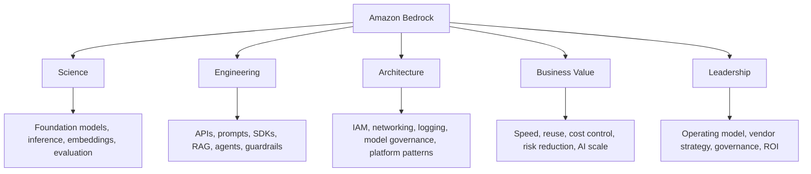

---

## 1. What Is Amazon Bedrock?

Amazon Bedrock is a fully managed AWS service for building and scaling generative AI applications with foundation models.

It provides:

- access to multiple foundation model providers
- runtime APIs for model invocation
- support for text, chat, embeddings, images, and multimodal use cases depending on model
- prompt management
- knowledge bases for RAG
- agents for task orchestration
- guardrails
- evaluation capabilities
- provisioned throughput
- AWS-native security and operations integration

### Basic Positioning

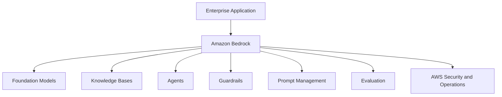

### Enterprise Interpretation

Bedrock is a managed AI platform layer. It does not replace enterprise architecture. It provides managed capabilities that architects compose into production systems.

---

## 2. Bedrock Is a Control Plane, Not Just Runtime

A runtime only answers model calls.

A control plane helps manage who can use models, which models are approved, how prompts are reused, how knowledge bases are configured, how agents are built, how guardrails are applied, how evaluation is performed, and how cost and observability are handled.

### Runtime View

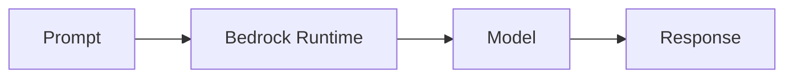

### Control Plane View

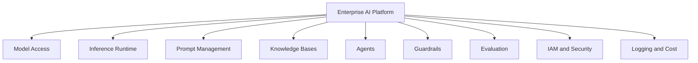

The control plane view is the architect's view.

---

## 3. Bedrock in the Book Architecture

This book has already covered:

- LLMs
- prompting
- RAG
- vector databases
- model selection and evaluation
- agent fundamentals
- agent architecture patterns
- LangGraph
- MCP

Bedrock connects many of these concepts into AWS-native platform capabilities.

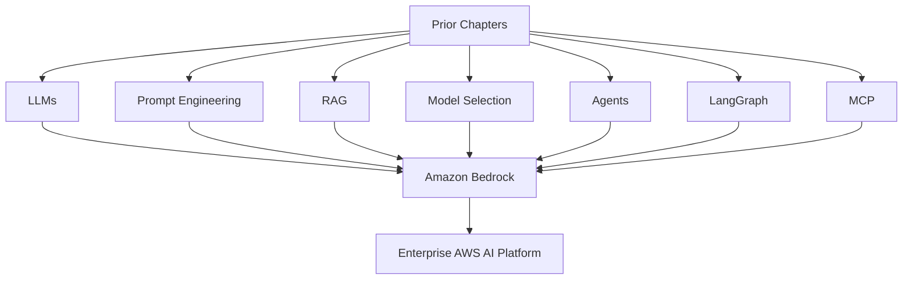

Bedrock is where many architecture concepts become deployable AWS services.

---

## 4. Bedrock Core Capabilities

### 4.1 Foundation Model Access

Bedrock provides access to foundation models from multiple providers.

An enterprise can select models based on:

- task quality
- latency
- cost
- context length
- modality
- tool use
- safety behavior
- region availability
- provider terms
- procurement requirements
- data policy
- governance approval

### 4.2 Runtime Inference

Bedrock runtime APIs support model invocation.

Common inference paths include:

- Converse
- ConverseStream
- InvokeModel
- InvokeModelWithResponseStream

### 4.3 Prompt Management

Prompt management supports reusable prompts, variables, variants, testing, and versions.

### 4.4 Knowledge Bases

Knowledge Bases provide managed RAG capabilities.

### 4.5 Agents

Bedrock Agents help orchestrate tasks with foundation models, knowledge bases, and action groups.

### 4.6 Guardrails

Guardrails help apply safety and policy controls.

### 4.7 Evaluation

Bedrock includes capabilities for evaluating models and AI outputs.

### 4.8 Provisioned Throughput

Provisioned Throughput allows higher and more predictable throughput for selected models at fixed hourly cost.

---

## 5. Model Access and Provider Strategy

Model access is a governance decision.

Bedrock supports many models, but not every model should be approved for every use case.

### Enterprise Model Access Questions

- Which models are approved?
- Which teams can use them?
- Which data classifications are allowed?
- Which regions are approved?
- Which models are allowed for customer-facing use?
- Which models are allowed for regulated data?
- What provider terms apply?
- What logging is required?
- What cost center is charged?
- What evaluation evidence is required?

### Model Access Flow

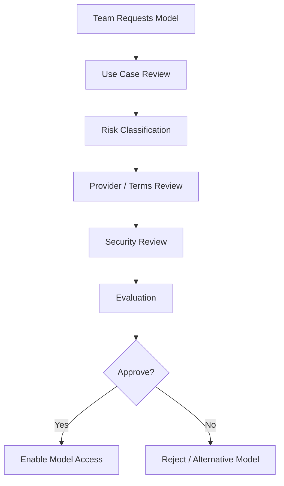

### Important Architecture Point

Access to a model should not mean unrestricted use. IAM, SCPs, resource policies, and AI gateway policy should restrict model usage by use case and role.

---

## 6. Model Selection in Bedrock

Chapter 6 established model selection as a business and architecture decision.

In Bedrock, the selection process should consider:

| Dimension | Bedrock Question |
|---|---|
| Task quality | Which model performs best on the enterprise golden dataset? |
| Latency | Which model meets p95 latency target? |
| Cost | What is cost per successful task? |
| Region | Is the model available in approved regions? |
| Modality | Does the model support required input/output types? |
| Tool use | Does the model support needed tool behavior? |
| Context | Is context window sufficient? |
| Safety | Does refusal/guardrail behavior fit? |
| Governance | Is the model approved for data class? |
| Throughput | Is on-demand enough or provisioned needed? |

### Bedrock Model Scorecard

Fill this scorecard with scores from your own golden dataset evaluation. The example below uses hypothetical values to illustrate how the weighting works — scores are 1 (poor) to 5 (excellent).

| Dimension | Weight | Claude Sonnet | Titan Text Premier | Llama 3 70B (hosted) |
|---|---:|---:|---:|---:|
| Task quality | 25% | 5 | 3 | 4 |
| Groundedness | 15% | 5 | 3 | 4 |
| Latency | 10% | 3 | 4 | 5 |
| Cost | 15% | 2 | 4 | 4 |
| Tool use | 10% | 5 | 2 | 3 |
| Safety behavior | 10% | 5 | 3 | 3 |
| Region/data fit | 10% | 4 | 5 | 3 |
| Operational fit | 5% | 4 | 4 | 3 |

**Weighted score example:** Claude Sonnet = (5×0.25)+(5×0.15)+(3×0.10)+(2×0.15)+(5×0.10)+(5×0.10)+(4×0.10)+(4×0.05) = **4.05**

> These are illustrative numbers only. Run your own evaluation on your specific tasks before making model decisions. Model capabilities change with each version.

### Model Families Available on Bedrock

Bedrock provides access to multiple model families. Availability varies by region — always check current documentation.

| Provider | Models | Enterprise Strengths |
|---|---|---|
| Anthropic | Claude Haiku, Sonnet, Opus | Long context, tool use, safety, instruction following |
| Amazon | Titan Text, Titan Embeddings, Nova | AWS-native, cost-accessible, embedding workflows |
| Meta | Llama 3.x, Llama 4 | Open-weight family, fine-tuning, broad capability |
| Mistral AI | Mistral 7B, Mixtral 8x7B | Efficient, strong instruction following |
| Cohere | Command R, Command R+ | RAG-optimized, reranking, multilingual retrieval |
| AI21 Labs | Jamba | Long context, structured tasks |
| Stability AI | Stable Diffusion | Image generation |

**Enterprise guidance:** Available models and versions evolve. Always verify current model IDs and regional availability in the Bedrock console or API before architecture decisions.

---

## 7. Runtime API Patterns

Bedrock supports different runtime patterns.

### Converse API

The Converse API is designed for conversational applications using a consistent messages-based interface across supported models.

Use Converse when:

- building chat or assistant applications
- maintaining message history
- using system prompts
- using common inference parameters
- using tool use
- applying guardrails
- needing a consistent interface across models

### ConverseStream

Use ConverseStream when:

- user experience benefits from streaming
- responses may be long
- chat UI needs incremental output
- latency perception matters

### InvokeModel

Use InvokeModel when:

- using model-specific request formats
- requiring direct low-level invocation
- working with model-specific features
- integrating existing code that uses provider-specific schema

### InvokeModelWithResponseStream

Use when streaming is needed with model-specific invocation.

### API Decision Table

| Need | Recommended Pattern |
|---|---|
| model-portable chat | Converse |
| streaming chat | ConverseStream |
| model-specific payload | InvokeModel |
| streaming model-specific payload | InvokeModelWithResponseStream |
| tool use with supported models | Converse with toolConfig |
| guardrail integration | Converse with guardrailConfig or Bedrock guardrail application |
| prompt management prompt | Converse with prompt variables and restrictions |

---

## 8. Converse API Architecture

The Converse API uses messages and content blocks.

A request may include:

- modelId
- messages
- system
- inferenceConfig
- additionalModelRequestFields
- promptVariables
- guardrailConfig
- toolConfig
- requestMetadata

### Converse Flow

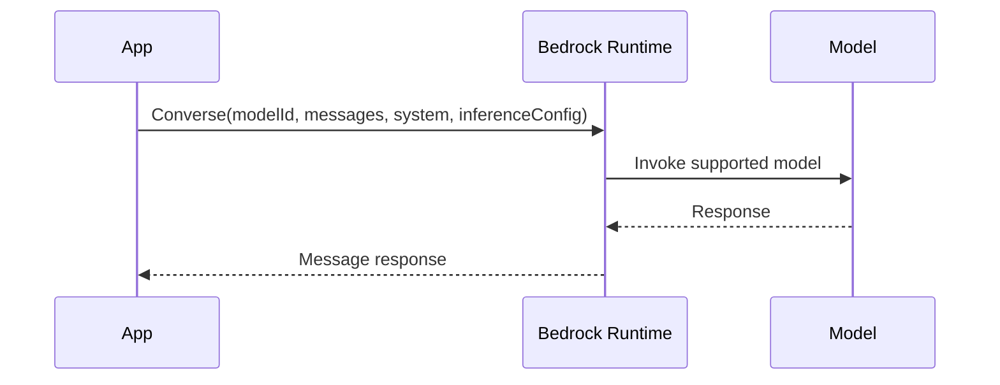

### Example Skeleton

```python
import boto3

client = boto3.client("bedrock-runtime", region_name="us-east-1")

response = client.converse(
    modelId="provider.model-id",
    messages=[
        {
            "role": "user",
            "content": [{"text": "Summarize this incident in executive language."}]
        }
    ],
    inferenceConfig={
        "temperature": 0.2,
        "maxTokens": 800
    }
)
```

### Enterprise Guidance

Use Converse as the default abstraction for chat-style applications where model portability matters.

---

## 9. InvokeModel Architecture

InvokeModel is a lower-level runtime API.

It is useful when:

- the model requires provider-specific fields
- you need direct control of model-specific syntax
- the use case is not conversational
- you are migrating existing provider-specific workloads
- you need a feature not abstracted by Converse

### InvokeModel Flow

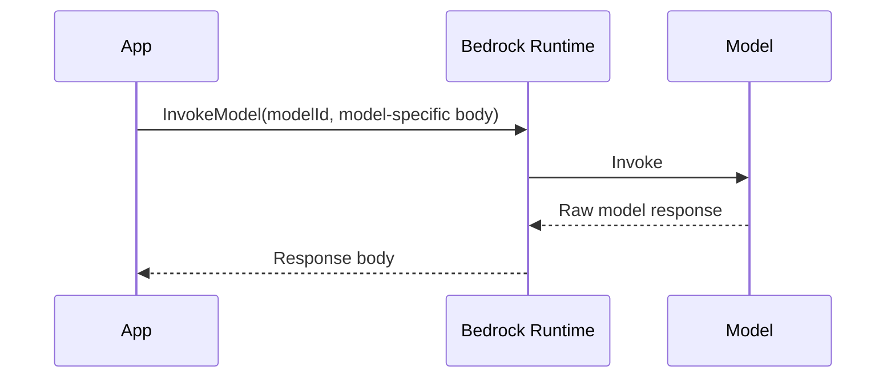

### Example Skeleton

```python
import json
import boto3

client = boto3.client("bedrock-runtime", region_name="us-east-1")

body = {
    "messages": [
        {"role": "user", "content": "Explain the key risks in this architecture."}
    ],
    "max_tokens": 1000
}

response = client.invoke_model(
    modelId="provider.model-id",
    body=json.dumps(body)
)

result = json.loads(response["body"].read())
```

### Enterprise Guidance

Use InvokeModel when model-specific control is required. Wrap it behind your own AI gateway so application teams do not hard-code provider-specific behavior everywhere.

---

## 10. Streaming Patterns

Streaming improves perceived latency.

Use streaming when:

- output is long
- user is waiting interactively
- chat UI should feel responsive
- partial output is useful
- call center agent assist needs quick feedback

### Streaming Architecture

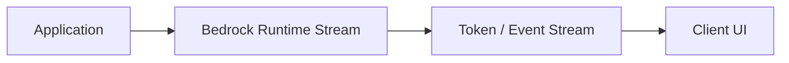

### Tradeoffs

Benefits:

- better user experience
- earlier feedback
- useful for long responses

Risks:

- harder output validation
- harder guardrail strategy
- partial unsafe output risk
- more complex UI
- more complex tracing

### Streaming and Guardrails — Important Nuance

When Bedrock guardrails are applied to streaming responses, there is an important behavioral difference from synchronous calls:

- In synchronous mode, the full response is evaluated before being returned — if a guardrail intervenes, the application receives a clean block without any partial output.
- In streaming mode, tokens may be streamed to the client as they are generated. Guardrail evaluation may occur on the complete response after generation, which means the application must handle the possibility of receiving streamed tokens followed by a guardrail intervention signal at the end of the stream.

For high-risk workflows (regulated content, PII-adjacent, customer-facing), prefer synchronous invocation over streaming. For low-risk chat UX, streaming is acceptable with appropriate client-side handling.

### Python: ConverseStream Skeleton

```python
import boto3

client = boto3.client("bedrock-runtime", region_name="us-east-1")

def stream_support_response(system_prompt: str, user_message: str,
                             model_id: str = "anthropic.claude-sonnet-4-5") -> str:
    """
    Stream a response using ConverseStream.
    Collects the full streamed text and returns it on completion.
    In a real chat UI, yield each chunk to the frontend as it arrives.
    """
    response = client.converse_stream(
        modelId=model_id,
        messages=[
            {"role": "user", "content": [{"text": user_message}]}
        ],
        system=[{"text": system_prompt}],
        inferenceConfig={
            "temperature": 0.2,
            "maxTokens": 800
        }
    )

    full_text = []
    input_tokens = 0
    output_tokens = 0

    for event in response["stream"]:
        if "contentBlockDelta" in event:
            delta = event["contentBlockDelta"].get("delta", {})
            if "text" in delta:
                chunk = delta["text"]
                full_text.append(chunk)
                # In a real UI: yield chunk to frontend here

        elif "messageStop" in event:
            stop_reason = event["messageStop"].get("stopReason", "unknown")

        elif "metadata" in event:
            usage = event["metadata"].get("usage", {})
            input_tokens = usage.get("inputTokens", 0)
            output_tokens = usage.get("outputTokens", 0)

        elif "internalServerException" in event or "modelStreamErrorException" in event:
            # Handle stream errors gracefully
            raise RuntimeError(f"Stream error: {event}")

    complete_response = "".join(full_text)
    return complete_response, {"input_tokens": input_tokens, "output_tokens": output_tokens}


# --- Key Engineering Notes:
# - Event types: contentBlockDelta (tokens), messageStop, metadata (usage), errors
# - metadata event at end of stream contains token usage for cost attribution
# - For production: add try/except around the stream loop; streams can disconnect
# - For guardrailed streams: check for 'guardrailResult' in events and handle intervention
# - Do not stream directly to external customers for high-risk policy workflows
```

### Enterprise Guidance

For high-risk outputs, validate before final release. For low-risk chat UX, streaming can improve adoption.

---

## 11. Inference Parameters

Inference parameters shape model behavior.

Common parameters include:

- temperature
- topP
- maxTokens
- stop sequences
- model-specific parameters

### Parameter Principles

| Parameter | Enterprise Meaning |
|---|---|
| temperature | higher values increase variation |
| topP | controls sampling diversity |
| maxTokens | limits response length and cost |
| stop sequences | enforce stopping behavior |
| model-specific fields | expose provider-specific control |

### Practical Guidance

- Use lower temperature for grounded enterprise answers.
- Use stricter output limits for cost control.
- Use structured output validation for automation.
- Version parameter changes.
- Evaluate parameter changes against golden datasets.

---

## 12. Prompt Management

Prompt management allows teams to create, edit, save, test, version, and reuse prompts.

This matters because prompts are production assets.

### Prompt Lifecycle

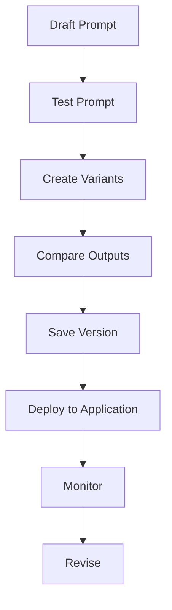

### Enterprise Prompt Management Rules

- prompts need owners
- prompts need versions
- prompts need evaluation
- prompts need rollback
- prompts need approval for high-impact workflows
- prompts need change history
- prompts should use variables instead of copy-paste variants
- prompt variants should be compared systematically

### Prompt Variables

Prompt variables allow reuse across contexts.

Example:

```text
Summarize the following incident for {{audience}}.
Focus on {{risk_focus}}.
Use the following evidence:
{{evidence}}
```

### Architecture Pattern

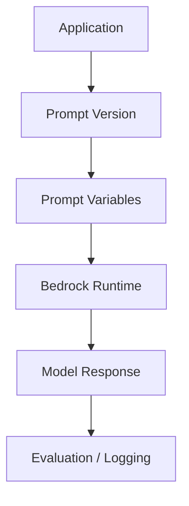

---

## 13. IAM and Security

Bedrock security starts with IAM but does not end there.

IAM controls:

- who can invoke models
- which models can be invoked
- who can manage resources
- who can access prompts
- who can manage knowledge bases
- who can manage agents
- who can apply guardrails
- who can view logs

### IAM Design Principles

- least privilege
- separate developer and production roles
- restrict model access by use case
- deny unapproved models
- use service control policies where appropriate
- separate model invocation from model administration
- log access
- review cross-account roles
- restrict sensitive data workflows

### IAM Architecture

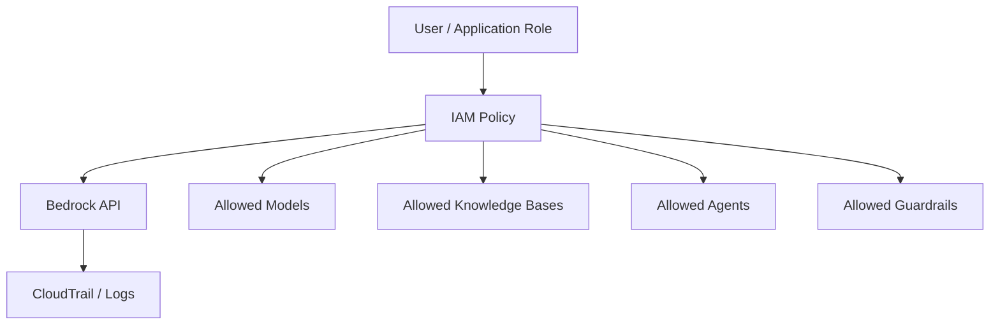

### Security Principle

> IAM decides what the application is allowed to call. Application policy decides what the model workflow is allowed to do.

Both layers matter.

---

## 14. Network Architecture

Enterprises often need private connectivity and controlled egress.

Design considerations:

- VPC endpoints where supported
- private subnets
- no public internet path for internal workloads
- security groups
- endpoint policies
- cross-account access
- centralized logging
- data residency
- region strategy

### Network Pattern

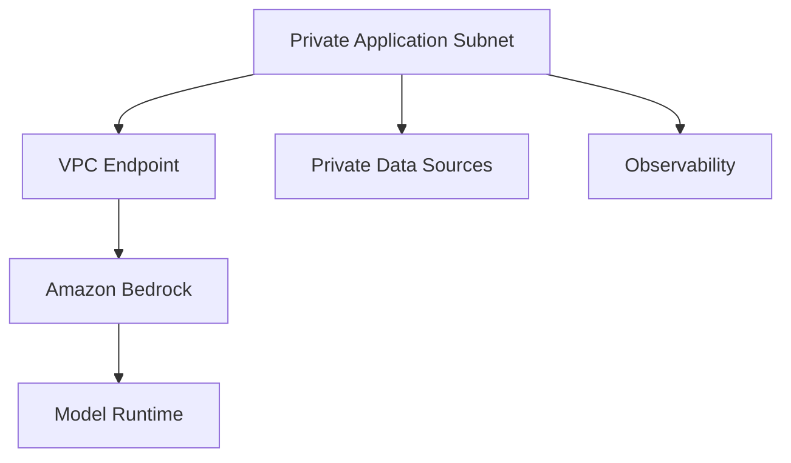

### Architecture Rule

For regulated workloads, design network access before building application logic.

---

## 15. Data Handling and Privacy

Bedrock applications may process sensitive data.

Design questions:

- What data is sent to the model?
- Is the data classified?
- Is PII involved?
- Is PHI involved?
- Is financial data involved?
- Is source code involved?
- Is customer data involved?
- What data is logged?
- What data is stored?
- What data is retained?
- What data can be used for evaluation?
- What data must be redacted?

### Data Handling Pattern

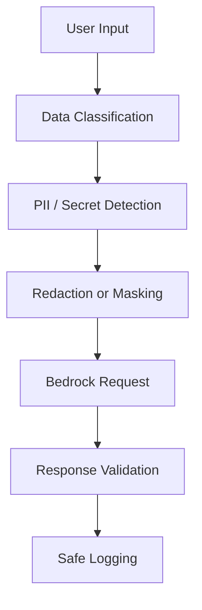

### Practical Guidance

Do not send data to a model just because it is available. Send the minimum context required for the task.

---

## 16. Guardrails in Bedrock Architecture

Guardrails are covered deeply in Chapter 14, but they must be introduced here.

Guardrails help apply safety and policy constraints to AI interactions.

They can support enterprise requirements such as:

- harmful content filtering
- denied topics
- sensitive information handling
- grounding checks
- policy-aligned behavior

### Guardrail Placement

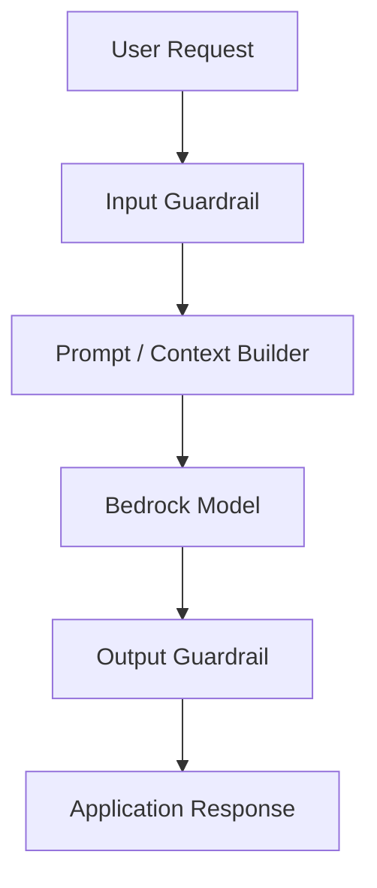

### Important Principle

Guardrails are one layer. They do not replace:

- IAM
- prompt design
- retrieval permissions
- tool authorization
- output validation
- human approval
- monitoring

---

## 17. Knowledge Bases in Bedrock Architecture

Bedrock Knowledge Bases provide managed RAG capabilities.

A knowledge base architecture includes:

- data sources
- ingestion
- chunking
- embeddings
- vector store
- retrieval
- grounding
- citations
- permissions
- freshness
- evaluation

### Knowledge Base Pattern

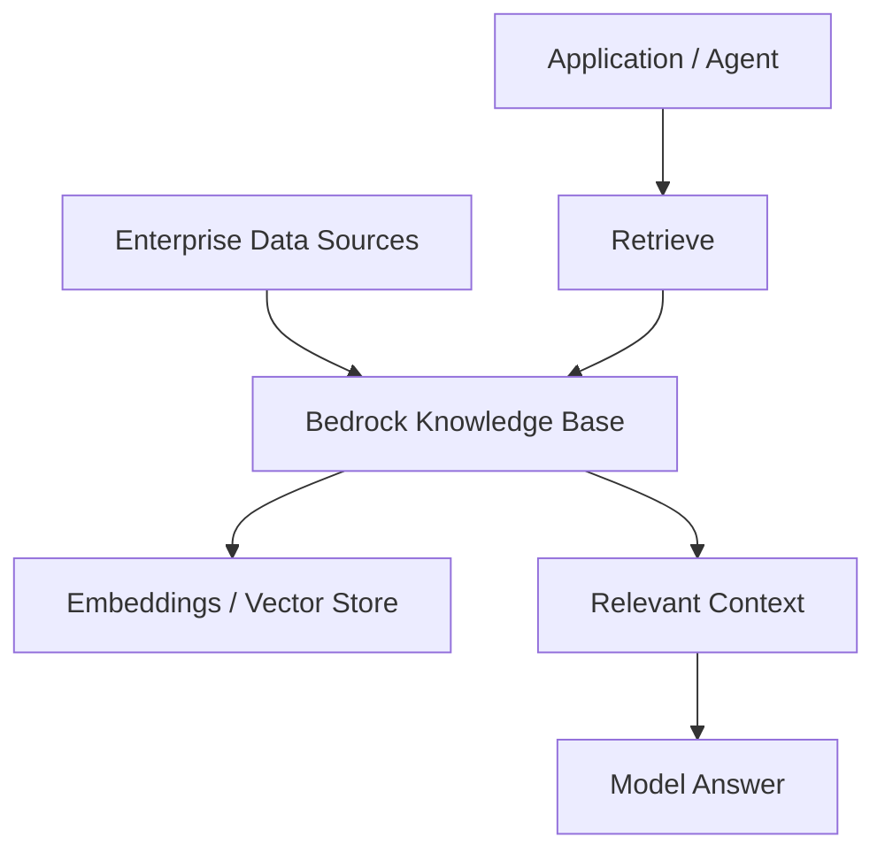

### Architecture Guidance

Knowledge Bases simplify RAG implementation. They do not remove the need for:

- source quality
- metadata design
- access control
- retrieval evaluation
- content lifecycle
- citation policy

Chapter 12 goes deeper.

---

## 18. Agents in Bedrock Architecture

Bedrock Agents help orchestrate tasks using foundation models, instructions, knowledge bases, and action groups.

At a high level, an agent can:

- interpret a user request
- use instructions
- query knowledge bases
- select actions
- call action groups
- return a response

### Bedrock Agent Pattern

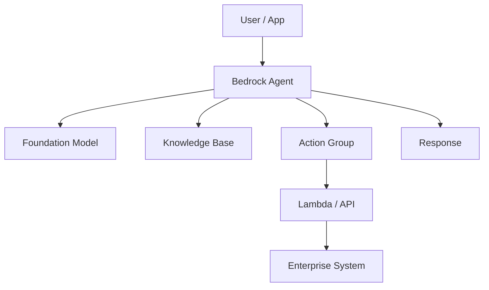

### Architecture Guidance

Bedrock Agents can provide managed orchestration, but enterprise teams still need:

- tool/action risk classification
- IAM boundaries
- API authorization
- human approval
- agent evaluation
- trace review
- rollback strategy

Chapter 13 goes deeper.

---

## 19. Bedrock with LangGraph

LangGraph and Bedrock are complementary.

LangGraph can orchestrate stateful workflows.

Bedrock can provide model inference, guardrails, knowledge bases, and agents.

### Pattern 1: LangGraph Uses Bedrock Runtime

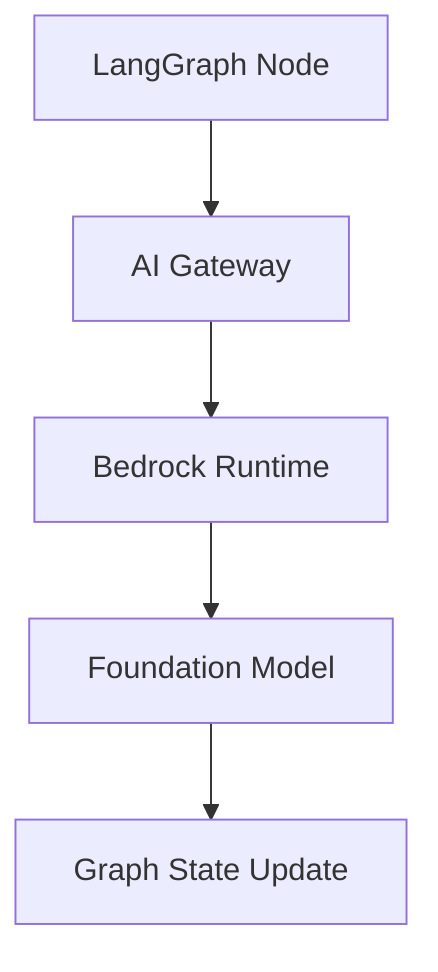

### Pattern 2: LangGraph Calls Bedrock Knowledge Base

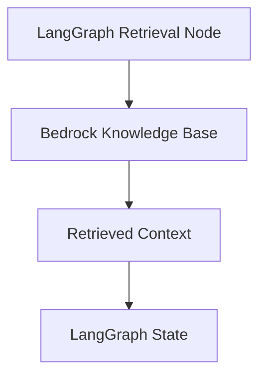

### Pattern 3: LangGraph Coordinates Bedrock and MCP

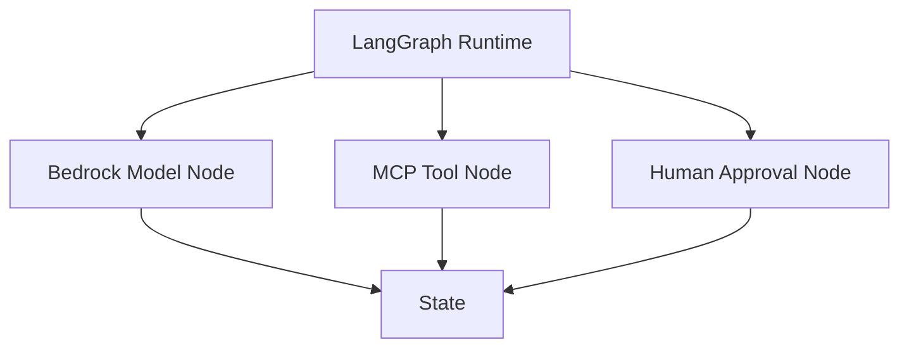

### Guidance

Use LangGraph when you need explicit state, complex branching, checkpoints, or human-in-the-loop beyond managed agent capabilities.

---

## 20. Bedrock with MCP

MCP standardizes tool/resource access. Bedrock provides model inference and AWS-native AI capabilities.

### Pattern

```mermaid
flowchart TD
    A[Application] --> B[AI Orchestrator]
    B --> C[Bedrock Runtime]
    B --> D[MCP Client]
    D --> E[MCP Server]
    E --> F[Enterprise API]
    C --> G[Model Output]
    F --> H[Tool Result]
    G --> I[Final Response]
    H --> I
```

### Use Case

A Bedrock-powered assistant may use MCP to access internal tools:

- customer profile
- support ticket
- device telemetry
- runbook search
- approval workflow

### Rule

Bedrock handles model interaction. MCP handles tool/resource standardization. The enterprise platform handles policy and governance.

---

## 21. Bedrock Evaluation

Evaluation should be built into the Bedrock operating model.

Evaluate:

- model selection
- prompt variants
- RAG quality
- agent task completion
- guardrail effectiveness
- latency
- cost
- safety
- business outcome

### Evaluation Flow

```mermaid
flowchart TD
    A[Use Case] --> B[Golden Dataset]
    B --> C[Candidate Bedrock Models]
    C --> D[Prompt / RAG / Agent Config]
    D --> E[Evaluation Run]
    E --> F[Scorecard]
    F --> G{Promote?}
    G -->|Yes| H[Deploy]
    G -->|No| I[Revise]
```

### Bedrock Evaluation Scorecard

| Dimension | Question |
|---|---|
| task quality | does it solve the workflow? |
| groundedness | is answer supported? |
| safety | are guardrails effective? |
| latency | does it meet SLO? |
| cost | is cost per successful task acceptable? |
| reliability | does it behave consistently? |
| usability | do users trust it? |
| business value | does workflow improve? |

---

## 22. Observability and Logging

Bedrock applications need end-to-end observability.

Track:

- application
- user/session
- model ID
- prompt version
- inference parameters
- input/output token usage
- latency
- errors
- guardrail action
- retrieval context
- agent trace
- tool/action calls
- cost allocation
- evaluation score
- business workflow ID

### Observability Pattern

```mermaid
flowchart TD
    A[Application Request] --> B[AI Gateway]
    B --> C[Bedrock Runtime]
    B --> D[RAG / Knowledge Base]
    B --> E[Agent / Tool]
    C --> F[Trace Store]
    D --> F
    E --> F
    F --> G[Dashboards]
    F --> H[Alerts]
```

### Operational Metrics

- request count
- error rate
- throttling
- latency p50/p95/p99
- token usage
- cost by team
- cost by model
- cost by workflow
- guardrail interventions
- failed evaluations
- user feedback
- model drift signals

---

## 23. Cost Architecture

Bedrock cost depends on usage pattern.

Cost drivers:

- model choice
- input tokens
- output tokens
- image/video/document inputs
- embeddings
- knowledge base ingestion
- vector store
- agent calls
- guardrail usage
- evaluation runs
- provisioned throughput
- retries
- streaming volume
- logging and storage

### Cost Model

```text
Cost per Successful Task =
(model inference cost
+ retrieval cost
+ agent/action cost
+ guardrail cost
+ evaluation amortization
+ infrastructure/support cost)
/ successful workflow completions
```

### Cost Control Levers

- model routing
- prompt compression
- context pruning
- caching
- smaller models for simple tasks
- retrieval before large generation
- max token limits
- streaming only where needed
- provisioned throughput only where justified
- cost allocation by IAM role/team/project
- monitoring abandoned workflows

---

## 24. Provisioned Throughput

Provisioned Throughput is used when a workload needs higher or more predictable throughput.

Use it when:

- production traffic is predictable
- latency/throughput SLOs require reserved capacity
- on-demand throttling risk is unacceptable
- custom models require provisioned usage
- cost modeling supports commitment

### Provisioned Throughput Decision

```mermaid
flowchart TD
    A[Bedrock Workload] --> B{Traffic Predictable?}
    B -->|No| C[Use On-Demand]
    B -->|Yes| D{Throughput SLO Critical?}
    D -->|No| C
    D -->|Yes| E{Commitment Justified?}
    E -->|Yes| F[Provisioned Throughput]
    E -->|No| G[Optimize / On-Demand + Backoff]
```

### Tradeoffs

Benefits:

- predictable capacity
- supports higher throughput
- useful for production workloads

Risks:

- hourly billing
- commitment periods
- underutilization risk
- operational planning required

---

## 24a. Inference Profiles

Inference profiles are a Bedrock capability for routing inference requests and managing cost attribution.

**Cross-region inference profiles** allow Bedrock to route requests across supported AWS regions to improve availability and reduce throttling risk. When one region hits capacity, the profile routes to another participating region automatically.

This matters architecturally because:

- it reduces the operational impact of regional throttling on production workflows
- cost attribution still flows through the primary account's billing
- data residency requirements must be verified against participating regions before enabling
- latency may vary slightly across regions

**System-defined inference profiles** are pre-built by AWS covering specific model families and region combinations.

**Application inference profiles** can be created by enterprise teams to:

- attribute inference cost to specific teams, applications, or cost centers
- enforce tag-based cost allocation
- restrict inference to approved regions
- layer additional governance over model invocation

### Inference Profile Decision

| Requirement | Inference Profile Pattern |
|---|---|
| regional failover | cross-region system profile |
| cost allocation by team | application inference profile with tags |
| regional compliance constraints | verify participating regions before enabling cross-region |
| high throughput burst workloads | cross-region profile reduces throttling exposure |

### Architecture Rule

> Use application inference profiles for cost allocation from day one. Adding cost tags retrospectively is harder than building them into the invocation path initially.

---

## 24b. Batch Inference

Bedrock supports asynchronous batch inference for processing large volumes of requests offline.

**When to use batch inference:**

- nightly document summarization
- bulk classification of support tickets
- batch contract analysis
- large-scale content processing
- dataset labeling and annotation at scale
- overnight embeddings regeneration after source updates

**How it works:**

Batch inference accepts input data in S3 (JSONL format), processes requests asynchronously using Bedrock model invocations, and writes output back to S3. The job runs without requiring a persistent connection.

```mermaid
flowchart TD
    A[Input JSONL in S3] --> B[Bedrock Batch Inference Job]
    B --> C[Foundation Model]
    C --> D[Output JSONL in S3]
    D --> E[Downstream Processing]
```

**Enterprise benefits:**

- no need for sustained connection or application uptime during processing
- lower per-token cost than on-demand for eligible workloads
- natural fit for scheduled data pipelines
- decouples processing volume from real-time infrastructure

**Design considerations:**

- input/output data must reside in S3; ensure bucket policies and KMS encryption align with data classification
- batch job results are not real-time; design downstream workflows accordingly
- monitor job status via CloudWatch and SNS for completion/failure events
- validate a sample of outputs before treating batch results as production-ready

---

## 25. Bedrock Enterprise Reference Architecture

```mermaid
flowchart TD
    U[Users / Apps] --> W[Application Layer]
    W --> G[Enterprise AI Gateway]

    G --> P[Prompt Registry / Prompt Management]
    G --> R[Request Policy]
    G --> C[Cost Tracker]
    G --> O[Observability]

    G --> B[Amazon Bedrock]

    B --> M[Foundation Models]
    B --> KB[Knowledge Bases]
    B --> AG[Agents]
    B --> GR[Guardrails]
    B --> EV[Evaluation]

    KB --> S3[S3 / Data Sources]
    KB --> VS[Vector Store]
    AG --> L[Lambda / Action Groups]
    L --> API[Enterprise APIs]

    G --> H[Human Approval]
    O --> D[Dashboards]
```

### Architecture Principle

Bedrock should sit behind an enterprise AI gateway for multi-application governance, observability, routing, and cost control.

---

## 26. Multi-Account and Multi-Environment Strategy

Enterprises should separate environments.

Common environments:

- sandbox
- development
- staging
- production

Common AWS account patterns:

- AI platform shared services account
- application workload accounts
- data account
- security logging account
- audit account
- production account

### Multi-Account Pattern

```mermaid
flowchart TD
    A[Developer Account] --> B[Bedrock Sandbox]
    C[Staging Account] --> D[Bedrock Staging]
    E[Production Account] --> F[Bedrock Production]
    F --> G[Central Logs]
    F --> H[Security Monitoring]
    F --> I[Cost Allocation]
```

### Governance Guidance

- restrict production model access
- separate test prompts from production prompts
- separate test knowledge bases from production knowledge bases
- restrict write-capable agents
- centralize audit logs
- require change approval for production

---

## 27. Bedrock for Customer Support

### Pattern

```mermaid
flowchart TD
    C[Customer Case] --> A[Support Application]
    A --> G[AI Gateway]
    G --> K[Bedrock Knowledge Base]
    K --> E[Policy / Runbook Evidence]
    E --> M[Bedrock Model]
    M --> V[Validation]
    V --> H{High Risk?}
    H -->|Yes| R[Human Review]
    H -->|No| D[Draft Response]
```

### Metrics

- first-contact resolution
- average handle time
- escalation rate
- draft acceptance rate
- groundedness
- customer satisfaction
- cost per case

---

## 28. Bedrock for Device Operations

### Pattern

```mermaid
flowchart TD
    I[Incident Alert] --> A[Operations Agent]
    A --> T[Telemetry API]
    A --> K[Bedrock Knowledge Base]
    A --> M[Bedrock Model]
    K --> R[Runbooks / Firmware Notes]
    T --> E[Telemetry Evidence]
    R --> S[Incident Summary]
    E --> S
    M --> S
    S --> H{Production Action?}
    H -->|Yes| P[Human Approval]
    H -->|No| O[Ops Recommendation]
```

### Example Workflow

1. Alert indicates heartbeat failures.
2. Retrieve telemetry.
3. Retrieve runbook and firmware notes.
4. Compare similar incidents.
5. Draft likely cause and next steps.
6. Require human approval for production changes.

---

## 29. Bedrock for Executive Intelligence

### Pattern

```mermaid
flowchart TD
    Q[Executive Question] --> A[Executive AI App]
    A --> D[Data Retrieval]
    A --> K[Knowledge Base]
    A --> B[Bedrock Model]
    D --> E[Business Evidence]
    K --> F[Document Evidence]
    E --> B
    F --> B
    B --> R[Executive Brief]
    R --> V[Review / Validate]
```

### Metrics

- briefing preparation time
- decision clarity
- citation quality
- executive usefulness score
- follow-up reduction

---

## 30. Bedrock in the Capstone Platform

The Enterprise Agentic Operations Platform can use Bedrock as the model and managed AI service layer.

### Capstone Bedrock Architecture

```mermaid
flowchart TD
    U[Operations User] --> G[Enterprise AI Gateway]
    G --> LG[LangGraph Runtime]
    LG --> BR[Bedrock Runtime]
    LG --> KB[Bedrock Knowledge Bases]
    LG --> GR[Bedrock Guardrails]
    LG --> EV[Evaluation]
    LG --> MCP[MCP Tool Layer]

    BR --> FM[Foundation Models]
    KB --> DOCS[Runbooks / Incident Docs / Firmware Notes]
    MCP --> TEL[Telemetry]
    MCP --> CRM[Customer Systems]
    MCP --> FIN[Revenue Systems]
    LG --> H[Human Approval]

    LG --> O[Observability]
```

### Bedrock Responsibilities in Capstone

- model inference
- embeddings and retrieval where appropriate
- knowledge grounding
- guardrail application
- evaluation hooks
- model routing target
- prompt-managed workflows

### Non-Bedrock Responsibilities

- enterprise AI gateway
- MCP tool governance
- LangGraph orchestration
- human approval workflow
- business KPI tracking
- custom policy engine
- enterprise observability dashboards

---

## 31. Architecture Review Scenario

### Scenario

A team wants to build ten Bedrock-powered assistants independently across departments.

Each team plans to:

- choose its own model
- write its own prompts
- connect its own data sources
- log differently
- evaluate manually
- manage cost independently
- define security independently

### Review Finding

This will create Bedrock sprawl.

### Problems

- inconsistent model selection
- duplicated prompt work
- ungoverned knowledge bases
- inconsistent guardrails
- weak cost attribution
- inconsistent logging
- no shared evaluation
- no approved model registry
- inconsistent security patterns
- no enterprise AI operating model

### Improved Architecture

```mermaid
flowchart TD
    A[Department Apps] --> G[Enterprise AI Gateway]
    G --> R[Model Router]
    G --> P[Prompt Registry]
    G --> E[Evaluation Service]
    G --> O[Observability]
    G --> C[Cost Allocation]
    G --> B[Amazon Bedrock]
    B --> M[Approved Models]
    B --> K[Knowledge Bases]
    B --> AG[Agents]
    B --> GR[Guardrails]
```

### Recommendation

Create a shared Bedrock platform pattern. Allow departments to build use cases, but centralize model governance, prompt management, evaluation, logging, guardrail policy, and cost visibility.

---

## 32. Production Readiness Checklist

Before launching a Bedrock application:

- [ ] business owner identified
- [ ] workflow and success metrics defined
- [ ] approved model selected
- [ ] model evaluation completed
- [ ] IAM least privilege configured
- [ ] data classification completed
- [ ] prompt versioned
- [ ] guardrails configured where needed
- [ ] retrieval evaluation completed if using RAG
- [ ] agent evaluation completed if using agents
- [ ] human approval defined for high-risk actions
- [ ] logging and tracing enabled
- [ ] cost dashboard created
- [ ] fallback behavior defined
- [ ] rollback plan created
- [ ] incident response process defined
- [ ] security review completed
- [ ] legal/compliance review completed if needed

---

## 33. Lessons from the Field

### What Worked

Bedrock works best when used as part of an enterprise AI platform.

Strong patterns:

- Bedrock behind an enterprise AI gateway
- approved model catalog
- prompt management and versioning
- centralized evaluation
- reusable knowledge base patterns
- guardrails as layered controls
- IAM least privilege
- cost per workflow tracking
- application inference profiles and cost attribution
- production dashboards
- human approval for high-impact actions

### What Did Not Work

Weak patterns:

- every team directly calls Bedrock differently
- model choice based only on popularity
- no prompt versioning
- no RAG evaluation
- no cost allocation
- no guardrail policy
- no production logs
- no incident response
- no approval gates for agents
- no architecture review

### Common Mistakes

- Treating Bedrock as only a model endpoint.
- Skipping model evaluation.
- Using the largest model for every workflow.
- Ignoring region and model availability.
- Sending too much context.
- Logging sensitive data.
- Assuming guardrails replace security.
- Building agents without action risk classification.
- Not testing prompt variants.
- Not designing cost dashboards from day one.

### ROI Perspective

Bedrock creates ROI when it reduces platform friction and accelerates governed AI delivery.

ROI drivers:

- faster AI app development
- less provider integration work
- shared prompt management
- managed RAG capabilities
- managed agents
- reusable guardrails
- easier AWS-native governance
- reduced operational burden

Cost drivers:

- model inference
- embeddings
- knowledge base ingestion
- vector storage
- agent orchestration
- guardrail use
- provisioned throughput
- evaluation runs
- logging/storage
- engineering operations

The ROI question:

> Does Bedrock help us deliver governed AI workflows faster and cheaper than building the same platform capabilities ourselves?

### CTO Perspective

A CTO should ask:

- Are we using Bedrock as a platform or just as model access?
- Which models are approved and why?
- How do we control model sprawl?
- What is our prompt management strategy?
- How do we evaluate Bedrock applications?
- What data can be sent to Bedrock?
- How are guardrails applied?
- What are our cost dashboards?
- How do we track cost per workflow?
- How do we integrate Bedrock with API governance?
- How do we avoid over-locking into provider-specific patterns?
- Who owns the Bedrock AI platform?

---

## 34. Pratik's Principles

### Principle 1: Bedrock Is a Platform Layer, Not a Strategy

The business strategy is workflow transformation. Bedrock is an enabling platform.

### Principle 2: Model Access Is Not Model Governance

Just because a model is available does not mean every team should use it.

### Principle 3: Put Bedrock Behind an Enterprise AI Gateway

Centralized policy, routing, logging, evaluation, and cost control prevent sprawl.

### Principle 4: Prompt Changes Are Production Changes

Prompt versions should be tested, approved, and rolled back like code.

### Principle 5: Guardrails Are Controls, Not Magic

Guardrails reduce risk but do not replace security, validation, or human accountability.

### Principle 6: RAG Still Requires Knowledge Engineering

Managed knowledge bases simplify architecture, but retrieval quality still determines answer quality.

### Principle 7: Cost Is Architecture

Model choice, context size, retries, streaming, agents, and throughput commitments all shape economics.

### Principle 8: Evaluate Before Scaling

Do not scale Bedrock applications without golden datasets, human review, and business metrics.

---

## 35. Hands-On Labs

### Lab 1: Bedrock Model Selection Scorecard

Create a scorecard for three Bedrock models for a support assistant.

Include:

- quality
- latency
- cost
- grounding
- tool support
- region availability
- data policy fit
- operational fit

Deliverable:

```text
labs/chapter-11-bedrock/model-selection-scorecard.md
```

---

### Lab 2: Converse API Prototype

Build a basic Converse API call.

Requirements:

- system prompt
- user message
- inferenceConfig
- request metadata
- response parsing

Deliverable:

```text
bedrock-converse-prototype.py
```

---

### Lab 3: Prompt Management Design

Design a prompt management lifecycle.

Include:

- prompt owner
- variables
- variants
- test cases
- versioning
- approval
- rollback

Deliverable:

```text
prompt-management-lifecycle.md
```

---

### Lab 4: Bedrock Security Review

Create a security review checklist for a Bedrock-powered customer assistant.

Include:

- IAM
- data classification
- logging
- guardrails
- retrieval permissions
- model access
- human approval
- incident response

Deliverable:

```text
bedrock-security-review.md
```

---

### Lab 5: Bedrock Cost Model

Estimate monthly cost for:

- 100,000 support assistant requests
- average input tokens
- average output tokens
- retrieval calls
- guardrail calls
- evaluation sampling
- retries

Deliverable:

```text
bedrock-cost-model.md
```

---

### Lab 6: Capstone Bedrock Integration

Design the Bedrock layer for the Enterprise Agentic Operations Platform.

Include:

- model invocation
- knowledge bases
- guardrails
- evaluation
- LangGraph integration
- MCP tool layer
- human approval
- observability

Deliverable:

```text
capstone-bedrock-architecture.md
```

---

## 36. Interview Questions

### Engineering-Level Questions

1. What is Amazon Bedrock?
2. How is Converse different from InvokeModel?
3. When would you use streaming?
4. What is prompt management?
5. How do you control inference parameters?
6. How do you secure Bedrock model access?
7. What is provisioned throughput?
8. How do Knowledge Bases fit into Bedrock?
9. How do Bedrock Agents work conceptually?
10. What should you log for Bedrock calls?

### Architect-Level Questions

1. Design an enterprise Bedrock reference architecture.
2. How would you prevent Bedrock model sprawl?
3. How would you design IAM for Bedrock?
4. How would you integrate Bedrock with an AI gateway?
5. How would you evaluate models in Bedrock?
6. How would you design Bedrock RAG?
7. How would you use Bedrock with LangGraph?
8. How would you use Bedrock with MCP?
9. How would you design Bedrock cost controls?
10. How would you design multi-account Bedrock governance?

### Director / VP / CTO-Level Questions

1. Why should an AWS-centric enterprise consider Bedrock?
2. What business value does Bedrock provide?
3. What risks does Bedrock introduce?
4. What should be centralized vs decentralized?
5. How do we measure ROI from Bedrock?
6. How do we govern model access?
7. How do we control cost by team and workflow?
8. How do we avoid vendor lock-in?
9. What is the operating model for Bedrock?
10. What would make you reject Bedrock for a use case?

---

## 37. Certification Mapping

### AWS AI / Generative AI Professional Preparation

This chapter directly supports topics related to:

- Amazon Bedrock overview
- foundation model access
- model selection
- inference APIs
- Converse API
- InvokeModel
- prompt management
- provisioned throughput
- IAM and security
- responsible AI controls
- guardrails
- knowledge bases
- agents
- model evaluation
- cost optimization
- deployment architecture

### Anthropic Claude / MCP Architecture Preparation

This chapter supports topics related to:

- Claude on Bedrock
- tool use through Bedrock workflows
- MCP and Bedrock integration
- prompt/version strategy
- enterprise security and governance

### NVIDIA Generative AI Preparation

This chapter supports topics related to:

- managed vs self-hosted model tradeoffs
- inference throughput
- latency and cost
- model serving strategy
- platform architecture comparison

---

## 38. Chapter Exercises

### Exercise 1

Design a Bedrock architecture for an internal employee knowledge assistant.

Include:

- model choice
- prompt management
- knowledge base
- IAM
- guardrails
- evaluation
- observability
- cost controls

### Exercise 2

A team wants to call Bedrock directly from ten applications.

Write an architecture review recommending an enterprise AI gateway pattern.

### Exercise 3

Create a Bedrock model approval process.

Include:

- use case review
- provider terms review
- security review
- data classification
- evaluation
- cost approval
- production monitoring

### Exercise 4

Design Bedrock cost dashboards.

Include:

- cost by model
- cost by application
- cost by IAM role
- cost by workflow
- cost per successful task
- retry cost
- evaluation cost

### Exercise 5

Compare Bedrock Agents, LangGraph, and custom workflow orchestration for a device operations incident assistant.

---

## 39. Key Terms

| Term | Meaning |
|---|---|
| Amazon Bedrock | AWS managed service for foundation-model applications |
| Foundation model | General-purpose model adaptable to many tasks |
| Bedrock Runtime | API layer for invoking models |
| Converse API | Messages-based Bedrock inference API for conversational applications |
| ConverseStream | Streaming version of Converse |
| InvokeModel | Lower-level model invocation API |
| InvokeModelWithResponseStream | Streaming lower-level invocation API |
| Prompt management | Bedrock capability for reusable prompts, variables, variants, and versions |
| Knowledge Base | Managed RAG capability in Bedrock |
| Bedrock Agent | Managed agent orchestration capability |
| Guardrail | Safety and policy control mechanism |
| Provisioned Throughput | Reserved throughput capacity for model invocation |
| Inference profile | Bedrock construct for routing and throughput/cost management depending on use case |
| Model access | Account and IAM-level ability to use specific foundation models |
| Cost per successful task | Workflow-level AI cost metric |

---

## 40. One-Page Executive Brief

Amazon Bedrock is an AWS managed platform for building generative AI applications using foundation models.

For executives, the important point is that Bedrock is not simply a way to call an LLM. It can become the enterprise control plane for foundation-model access, prompt management, RAG, agents, guardrails, evaluation, security, and operations.

Bedrock helps AWS-centric enterprises move faster by reducing the need to build model-hosting infrastructure and direct provider integrations. It can improve governance by using AWS-native identity, security, networking, monitoring, and cost management patterns.

However, Bedrock does not automatically create business value. Value comes from applying it to specific workflows and measuring outcomes.

Executive questions:

- Which workflows will Bedrock improve?
- Which models are approved?
- What data can be sent to models?
- What guardrails are required?
- How do we evaluate quality?
- How do we control cost?
- How do we prevent sprawl?
- Who owns the Bedrock platform?
- How do we measure ROI?

The recommended enterprise pattern is to put Bedrock behind an AI gateway and use shared services for model routing, prompt management, evaluation, observability, cost control, and governance.

The executive takeaway:

> Bedrock can accelerate enterprise AI delivery, but only if paired with architecture discipline, workflow ownership, evaluation, and operating controls.

---

## 41. References

- Amazon Bedrock overview: https://docs.aws.amazon.com/bedrock/latest/userguide/what-is-bedrock.html
- Amazon Bedrock API Reference: https://docs.aws.amazon.com/bedrock/latest/APIReference/Welcome.html
- Converse API: https://docs.aws.amazon.com/bedrock/latest/userguide/conversation-inference.html
- Model access: https://docs.aws.amazon.com/bedrock/latest/userguide/model-access.html
- Provisioned Throughput: https://docs.aws.amazon.com/bedrock/latest/userguide/prov-throughput.html
- Prompt management: https://docs.aws.amazon.com/bedrock/latest/userguide/prompt-management.html
- Security, Guardrails, and Observability: https://docs.aws.amazon.com/bedrock/latest/userguide/security.html

---

## 42. Chapter Summary

In this chapter, we explored Amazon Bedrock as an enterprise foundation-model platform.

We covered Bedrock's role as a managed service for foundation model access, runtime inference, prompt management, knowledge bases, agents, guardrails, evaluation, provisioned throughput, and AWS-native security and operations.

We examined model access, model selection, Converse API, InvokeModel, streaming, inference parameters, prompt management, IAM, network architecture, data handling, guardrails, knowledge bases, agents, LangGraph integration, MCP integration, evaluation, observability, cost architecture, provisioned throughput, enterprise reference architecture, multi-account strategy, use cases, capstone architecture, production readiness, lessons from the field, Pratik's Principles, labs, interview questions, and certification mapping.

The key lesson is:

> Bedrock is a managed enterprise AI platform layer. It creates value when combined with workflow design, governance, evaluation, observability, and cost discipline.

In Chapter 12, we will go deeper into Bedrock Knowledge Bases as a managed RAG architecture pattern.

---

## 43. Suggested Git Commit

```bash
mkdir -p chapters
cp 11-amazon-bedrock-reworked.md chapters/11-amazon-bedrock.md
cp BOOK_STATE-updated-through-chapter-11.md BOOK_STATE.md

git add chapters/11-amazon-bedrock.md BOOK_STATE.md
git commit -m "Add Chapter 11: Amazon Bedrock"
git push origin main
```
