# Chapter 12 — Bedrock Knowledge Bases

**Book:** The AI Architect & Practitioner Bootcamp  
**Chapter Status:** Complete Draft  
**Version:** 0.1 — Deep Dive  
**Author:** Pratik Desai  
**Primary Audience:** AI engineers, enterprise architects, AWS architects, cloud platform engineers, data engineers, search engineers, security architects, engineering leaders, consultants, directors, VPs, CTO-track practitioners, and certification candidates

---

## Chapter Thesis

Bedrock Knowledge Bases are a managed RAG architecture pattern, not a substitute for knowledge engineering discipline.

A beginner sees a knowledge base as a feature that lets an LLM answer questions from documents.

A practitioner sees it as managed Retrieval Augmented Generation.

An enterprise AI architect should see it as a production knowledge system that includes ingestion, parsing, chunking, embeddings, vector storage, retrieval configuration, metadata filtering, reranking, citations, access controls, synchronization, evaluation, observability, cost management, and lifecycle governance.

The central thesis of this chapter is:

> Bedrock Knowledge Bases reduce the infrastructure burden of RAG, but retrieval quality, source governance, permissions, freshness, evaluation, and trust still remain architecture responsibilities.

A managed service can automate parts of the RAG pipeline. It cannot decide which documents are authoritative. It cannot fix bad source quality. It cannot magically resolve conflicting policies. It cannot know which documents a user should be allowed to see unless the system is designed with identity and access control.

The enterprise lesson:

> Managed RAG is still RAG. RAG quality is still AI quality.

---

## Learning Objectives

By the end of this chapter, you will be able to:

- Explain what Bedrock Knowledge Bases are and how they implement managed RAG.
- Describe the difference between managed and self-managed knowledge base patterns.
- Design a knowledge base ingestion architecture with data sources, parsing, chunking, embeddings, vector stores, and sync.
- Explain Retrieve, RetrieveAndGenerate, and RetrieveAndGenerateStream usage patterns.
- Configure retrieval options such as number of results, semantic search, hybrid search, metadata filters, and reranking.
- Understand source citations and why they matter for trust.
- Design metadata and document governance for enterprise RAG.
- Explain how permissions, ACLs, and user context affect secure retrieval.
- Identify failure modes such as stale documents, wrong retrieval, permission leakage, poor chunking, and citation gaps.
- Design evaluation for retrieval quality, groundedness, answer usefulness, and business outcomes.
- Integrate Bedrock Knowledge Bases with Bedrock Agents, LangGraph, MCP, and enterprise AI gateways.
- Design a capstone knowledge layer for the Enterprise Agentic Operations Platform.

---

## Executive Summary

Amazon Bedrock Knowledge Bases help enterprises build RAG applications by connecting data sources to a managed retrieval and generation workflow.

RAG improves model responses by retrieving relevant information from external data sources and using that information to ground the answer. Bedrock Knowledge Bases help automate key RAG steps, including ingestion, chunking, embedding, indexing, retrieval, and response generation.

Bedrock Knowledge Bases can answer queries by retrieving relevant information, augment prompts with retrieved context, generate responses using retrieved data, include citations, support search configuration, apply metadata filtering, use reranking, and integrate with agents and applications.

This matters because enterprise AI systems usually need private and current knowledge:

- policies
- runbooks
- product manuals
- contracts
- support tickets
- knowledge articles
- release notes
- customer documents
- compliance procedures
- operational incident histories
- device troubleshooting guides

A model alone does not know this enterprise knowledge. Fine-tuning is usually the wrong tool for frequently changing knowledge. RAG is usually the right pattern.

But managed RAG is not magic.

The biggest RAG failures are usually not model failures. They are knowledge pipeline failures:

- wrong documents indexed
- stale source content
- bad chunking
- missing metadata
- weak retrieval configuration
- no permission enforcement
- poor citation handling
- no evaluation
- conflicting sources
- no content ownership

The key executive takeaway:

> Bedrock Knowledge Bases can accelerate RAG delivery, but trusted enterprise answers still require knowledge governance, retrieval evaluation, and operational ownership.

---

## Business Motivation

Enterprises need AI systems that answer using company knowledge.

Examples:

- A support agent needs the latest refund policy.
- A field technician needs the correct repair manual.
- A sales rep needs contract terms and account history.
- A compliance analyst needs current procedures.
- A device operations team needs runbooks and firmware release notes.
- An executive needs a grounded summary of incidents, customers, and risk.
- A healthcare administrator needs payer rules and internal process documentation.
- A financial services assistant needs policy-grounded explanations.

Without RAG, teams often try to solve the problem by:

- pasting documents into prompts
- fine-tuning models on knowledge
- building custom vector pipelines from scratch
- letting users search manually
- trusting model general knowledge
- maintaining duplicated knowledge stores

Those approaches are expensive, inconsistent, or risky.

Bedrock Knowledge Bases create business value by:

- reducing time to build RAG applications
- standardizing knowledge ingestion
- reducing custom vector pipeline work
- improving answer relevance and accuracy
- enabling citations
- integrating private data into AI workflows
- supporting managed retrieval infrastructure
- improving developer productivity
- allowing AI systems to use enterprise knowledge without retraining models

The business value is strongest when the organization has high-value knowledge workflows and repeatable patterns across teams.

---

## The Five-Lens Framework for This Chapter

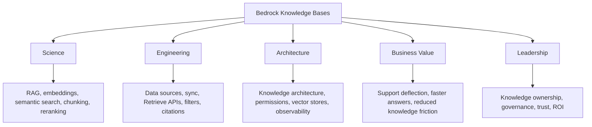

---

## 1. What Are Bedrock Knowledge Bases?

Bedrock Knowledge Bases are an Amazon Bedrock capability for building retrieval-augmented generation applications.

A knowledge base connects enterprise data sources to a retrieval system. At runtime, an application queries the knowledge base to retrieve relevant information. The retrieved information can be returned directly or used to generate a model response.

### Basic Pattern

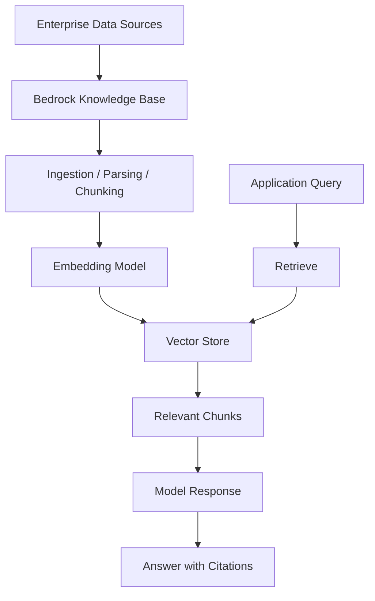

### What It Solves

Bedrock Knowledge Bases help teams avoid building every part of a RAG stack from scratch.

They help manage:

- source connection
- ingestion
- parsing
- chunking
- embedding
- indexing
- retrieval
- generation
- citations
- configuration

### What It Does Not Solve Automatically

It does not automatically solve:

- poor source quality
- conflicting documents
- missing permissions
- weak metadata
- stale content ownership
- bad evaluation
- unclear business metrics
- ungoverned rollout

---

## 2. Managed Knowledge Base vs Self-Managed Knowledge Base

Bedrock supports managed and self-managed knowledge base patterns.

### Managed Knowledge Base

In a managed knowledge base pattern, Bedrock manages much of the ingestion, indexing, storage, and retrieval infrastructure.

Best when:

- speed matters
- team wants less infrastructure work
- use case fits supported data sources and retrieval patterns
- standard RAG is sufficient
- operational simplicity is important
- enterprise wants AWS-managed scaling

### Self-Managed Knowledge Base

In a self-managed pattern, the team controls more of the RAG stack, including vector store and ingestion configuration.

Best when:

- custom retrieval logic is required
- specialized vector store configuration is needed
- enterprise already has a mature search platform
- data governance requires custom controls
- advanced ranking, graph, or domain pipelines are required
- team needs full control over storage and indexing

### Decision Table

| Requirement | Better Fit |
|---|---|
| fastest RAG pilot | managed knowledge base |
| minimal infrastructure | managed knowledge base |
| custom chunking/search pipeline | self-managed |
| strict custom vector store control | self-managed |
| common enterprise documents | managed knowledge base |
| highly specialized retrieval | self-managed |
| centralized RAG platform | either, depending on governance |
| regulated data with custom controls | often self-managed or tightly governed managed |

---

## 3. Bedrock Knowledge Bases in the RAG Lifecycle

Chapter 4 introduced the RAG pipeline. Bedrock Knowledge Bases implement many of those pipeline steps.

### RAG Lifecycle

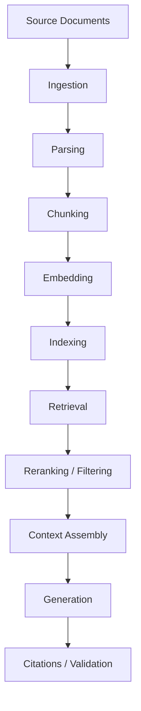

### Bedrock Mapping

| RAG Step | Bedrock Knowledge Base Role |
|---|---|
| source connection | connect supported data sources |
| parsing | extract usable text/content |
| chunking | split content for retrieval |
| embedding | convert chunks to vectors |
| indexing | store embeddings in vector store |
| retrieval | retrieve relevant chunks |
| filtering | metadata filters |
| reranking | improve result ordering |
| generation | RetrieveAndGenerate |
| citations | source references in generated response |

---

## 4. Data Sources

Knowledge bases depend on data sources.

Possible enterprise sources include:

- Amazon S3
- SharePoint
- Confluence
- Google Drive
- OneDrive
- web crawling
- structured stores where supported
- internal documentation exports
- runbooks
- manuals
- policy repositories
- knowledge articles
- historical incident records

### Source Selection Criteria

Choose sources based on:

- authority
- freshness
- ownership
- permission model
- update frequency
- document structure
- data sensitivity
- business value
- conflict risk
- citation needs

### Source Governance Table

| Source | Owner | Data Class | Sync Frequency | Permission Model | Trust Level |
|---|---|---|---|---|---|
| Refund Policy | Legal / Support Ops | Internal | Daily | Role-based | Authoritative |
| Field Runbooks | Operations | Internal | Weekly | Team-based | High |
| Old Wiki Pages | Unknown | Internal | Unknown | Weak | Low |
| Customer Contracts | Sales Ops / Legal | Confidential | Event-driven | Account-based | High |

### Principle

> Do not index everything. Index authoritative, useful, governed knowledge.

---

## 5. Ingestion

Ingestion moves source content into the knowledge base processing pipeline.

Ingestion includes:

- connecting to source
- reading documents
- detecting changes
- parsing content
- extracting metadata
- chunking
- embedding
- indexing
- maintaining source references

### Ingestion Flow

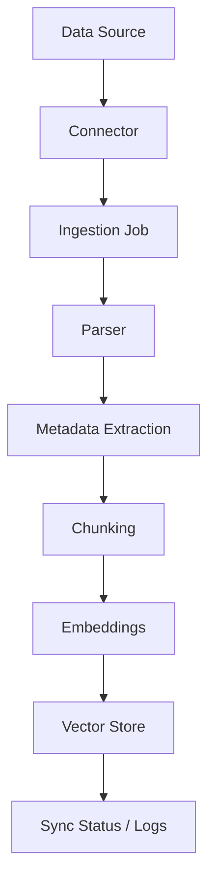

### Ingestion Design Questions

- How often does content change?
- Is sync full or incremental?
- How are deletes handled?
- How are failed documents reported?
- Who fixes ingestion errors?
- How are malformed files handled?
- How is source metadata preserved?
- How are document permissions captured?

---

## 6. Parsing and Smart Parsing

Parsing converts raw files into retrievable content.

Bad parsing creates bad retrieval.

Documents may include:

- headings
- tables
- images
- scanned pages
- embedded diagrams
- slide layouts
- headers and footers
- footnotes
- multi-column text
- code blocks
- forms

### Parsing Risks

- table structure lost
- page order confused
- image content ignored
- scanned text misread
- headers repeated in every chunk
- legal footnotes detached from context
- code formatting lost

### Parsing Architecture

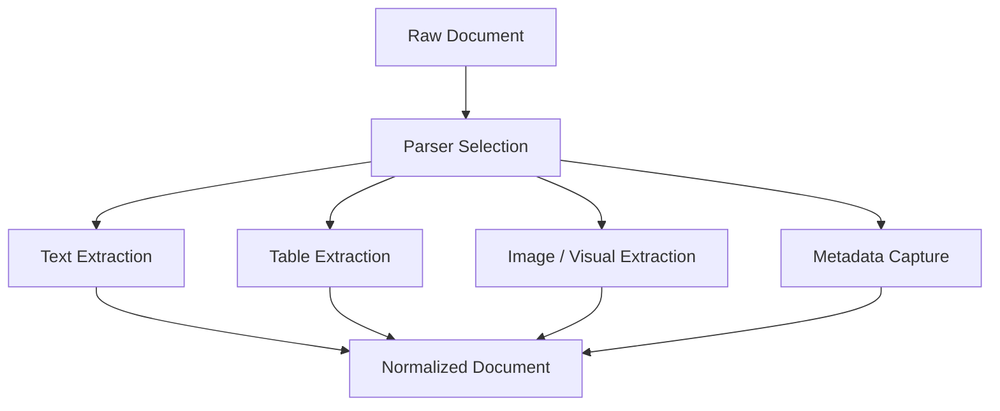

### Foundation Model-Based Parsing (Smart Parsing)

Bedrock Knowledge Bases supports **Foundation Model-based parsing**, which uses a Claude model as the parser for complex document types.

Standard text extraction treats PDFs as streams of text tokens. FM-based parsing sends document pages to a vision-capable model that can understand layout, read embedded tables, interpret charts, extract text from images, and preserve structural context.

**When FM-based parsing creates significant value:**

- PDFs with multi-column layouts
- Documents with embedded tables (financial statements, technical specifications, regulatory filings)
- Scanned documents where OCR alone loses structure
- Presentation slides where spatial layout matters
- Engineering manuals with figures and diagrams
- Contracts with schedules and exhibits that contain tabular data

**Tradeoffs:**

| Dimension | Standard Parser | FM-Based Parser |
|---|---|---|
| Cost | Lower | Higher (model invocation per page) |
| Speed | Faster | Slower |
| Table quality | Often poor | Strong |
| Image content | Ignored | Extracted as text |
| Scanned text | OCR only | Vision-capable |
| Best for | Plain text documents | Complex, structured, visual documents |

**Design rule:** Enable FM-based parsing for knowledge bases where documents contain tables, figures, or complex layouts. Use standard parsing for plain-text knowledge bases to control ingestion cost.

### Design Principle

> If the parser cannot preserve the meaning of the document, retrieval will not recover it later.

---

## 7. Chunking Strategy

Chunking splits content into retrievable units.

Chunking is one of the most important RAG design decisions.

### Chunking Goals

- preserve semantic meaning
- avoid splitting important context
- keep chunks small enough for retrieval
- keep chunks large enough to be useful
- preserve source references
- support citations
- reduce noise

### Chunking Strategies

| Strategy | Description | Best For |
|---|---|---|
| fixed-size | split by token/character count | simple documents |
| recursive | split by headings/paragraphs | structured text |
| semantic | split by meaning | knowledge articles |
| hierarchical | parent-child chunks | long documents |
| no chunking | entire document | very short documents |
| custom | domain-specific splitting | policies, contracts, manuals |

### Chunking Diagram

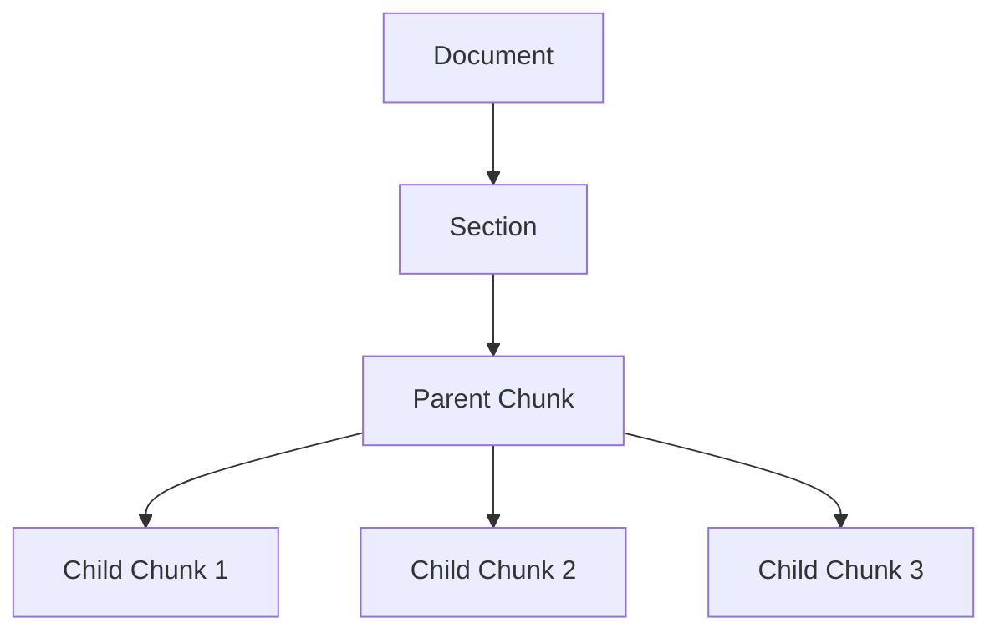

### Chunking Failure

Poor chunking causes:

- incomplete answers
- missing context
- wrong citations
- retrieval of irrelevant fragments
- poor grounding
- excessive model context

---

## 8. Embeddings

Embeddings convert chunks and queries into vectors.

At ingestion, document chunks become embeddings.

At runtime, user queries become embeddings.

The vector store compares query vectors with document vectors to retrieve similar chunks.

### Embedding Flow

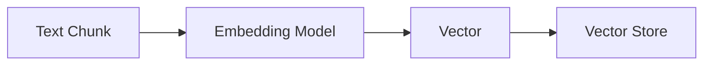

### Embedding Selection Questions

- What languages are supported?
- What domain vocabulary matters?
- Is multimodal embedding required?
- Are binary embeddings appropriate?
- What vector dimensions are produced?
- What vector stores are compatible?
- What is embedding cost?
- What is embedding latency?
- How will embedding model changes be handled?

### Embedding Model Change Risk

Changing embedding models often requires re-indexing. Treat embedding changes as migration projects.

---

## 9. Vector Stores

A knowledge base uses a vector store to index and retrieve embeddings.

AWS-supported patterns may involve:

- Amazon OpenSearch Serverless
- Amazon Aurora (pgvector extension)
- Amazon Neptune Analytics for graph-oriented retrieval
- MongoDB-compatible vector stores
- S3 vector buckets where supported
- other supported vector options depending on current Bedrock capabilities

### Vector Store Selection Criteria

| Criteria | Question |
|---|---|
| scale | how many documents/chunks? |
| latency | what p95 retrieval target? |
| metadata filtering | what filters are required? |
| hybrid search | is keyword + vector needed? |
| cost | storage and query cost? |
| operations | managed vs self-managed? |
| security | encryption, network, IAM? |
| graph needs | relationships matter? |
| multi-tenancy | tenant isolation? |

### Neptune Analytics and Graph RAG

Chapter 4 introduced Graph RAG as a retrieval pattern for relationship-rich knowledge. Amazon Neptune Analytics is the AWS-native vector store for this pattern.

Neptune Analytics combines vector similarity search with graph traversal. This means a query can retrieve not only semantically similar chunks but also follow knowledge graph edges to surface related entities.

**When Neptune Analytics adds value over standard vector search:**

- device → firmware version → error code → runbook relationships
- customer → contract → product → support entitlement chains
- regulatory framework → requirement → policy → control mappings
- supplier → component → dependency → risk exposure chains

Standard semantic similarity cannot traverse these relationships. Neptune can.

**Design guidance:** Use Neptune Analytics only when your knowledge is genuinely graph-structured and relationships between entities are required to answer questions. For document-centric RAG (policies, runbooks, manuals), OpenSearch Serverless or Aurora pgvector is typically simpler and sufficient.

### Multi-Tenancy Patterns for Knowledge Bases

Enterprise knowledge bases often serve multiple tenants — different teams, customers, or business units — with different access rights to different content.

Two primary patterns:

**Pattern 1: Separate Knowledge Base per Tenant**

Each tenant has its own knowledge base with its own data sources, embeddings, and access controls.

- Strongest isolation — no cross-tenant data mixing risk
- Higher operational overhead — more knowledge bases to manage and sync
- Best for: regulated industries, customer-facing SaaS, sensitive government data

**Pattern 2: Shared Knowledge Base with Metadata Filtering**

All tenants share one knowledge base. Retrieval queries include a tenant-specific metadata filter that restricts results to that tenant's content.

```python
# Shared KB with tenant isolation via metadata filter
response = client.retrieve(
    knowledgeBaseId="KB_ID",
    retrievalQuery={"text": "What is our refund policy?"},
    retrievalConfiguration={
        "vectorSearchConfiguration": {
            "numberOfResults": 5,
            "filter": {
                "equals": {"key": "tenant_id", "value": "acme_corp"}
            }
        }
    }
)
```

- Lower operational overhead — one KB to manage
- Requires strict metadata tagging on every ingested document
- Risk: if metadata is missing or wrong, cross-tenant leakage is possible
- Best for: internal multi-team platforms, lower-risk use cases

**Enterprise rule:** In a shared knowledge base, tenant isolation must be enforced server-side through metadata filters — never rely on the model or application layer alone to restrict what each tenant sees.

### Architecture Pattern

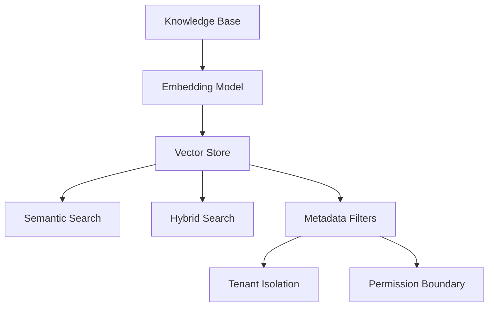

---

## 10. Retrieve API Pattern

Retrieve returns relevant chunks from a knowledge base.

Use Retrieve when:

- the application wants to control generation
- LangGraph or custom orchestrator builds the final prompt
- citations need custom formatting
- retrieved chunks need validation
- multiple retrieval sources are merged
- reranking or post-processing happens outside Bedrock

### Retrieve Pattern

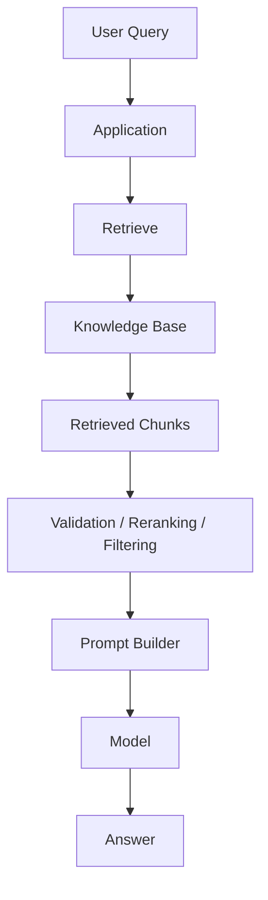

### Example Skeleton

```python
import boto3

client = boto3.client("bedrock-agent-runtime", region_name="us-east-1")

response = client.retrieve(
    knowledgeBaseId="KB_ID",
    retrievalQuery={"text": "How do we troubleshoot heartbeat failures?"},
    retrievalConfiguration={
        "vectorSearchConfiguration": {
            "numberOfResults": 5,
            "overrideSearchType": "HYBRID"
        }
    }
)
```

### Enterprise Guidance

Use Retrieve when you need architectural control.

---

## 11. RetrieveAndGenerate Pattern

RetrieveAndGenerate retrieves context and generates the answer in one managed workflow.

Use RetrieveAndGenerate when:

- speed to application matters
- standard RAG response flow is acceptable
- Bedrock-managed generation is sufficient
- team wants less orchestration code
- citations from managed response are useful

### RetrieveAndGenerate Pattern

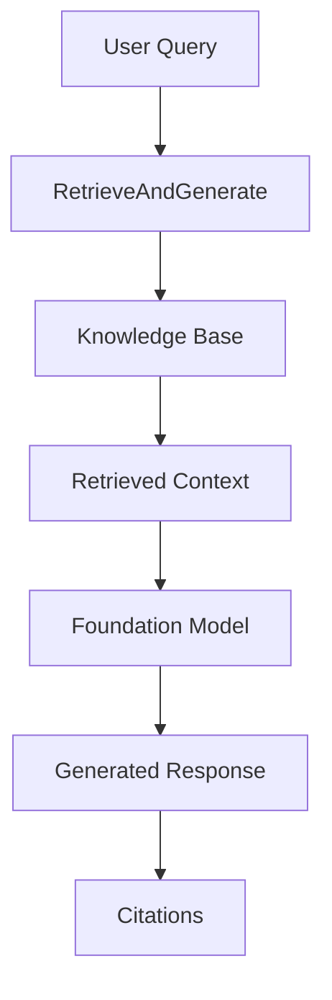

### Example Skeleton

```python
import boto3

client = boto3.client("bedrock-agent-runtime", region_name="us-east-1")

response = client.retrieve_and_generate(
    input={"text": "Summarize the refund policy for enterprise customers."},
    retrieveAndGenerateConfiguration={
        "type": "KNOWLEDGE_BASE",
        "knowledgeBaseConfiguration": {
            "knowledgeBaseId": "KB_ID",
            "modelArn": "MODEL_ARN"
        }
    }
)
```

### Enterprise Guidance

Use RetrieveAndGenerate for simpler RAG applications. Use Retrieve plus custom generation when you need more control, routing, validation, or multi-source synthesis.

---

## 12. RetrieveAndGenerateStream Pattern

Streaming generation can improve user experience when answers are long or interactive.

Use streaming when:

- chat UI should show progressive response
- user waits interactively
- answer is long
- perceived latency matters

### Streaming Risk

Streaming makes validation harder because output appears before full response validation.

For high-risk workflows, consider generating, validating, and then displaying final output rather than streaming directly.

---

## 13. Retrieval Configuration

Bedrock Knowledge Bases allow retrieval configuration options such as:

- maximum number of results
- search type
- semantic search
- hybrid search
- metadata filters
- reranking configuration where supported

### Retrieval Configuration Pattern

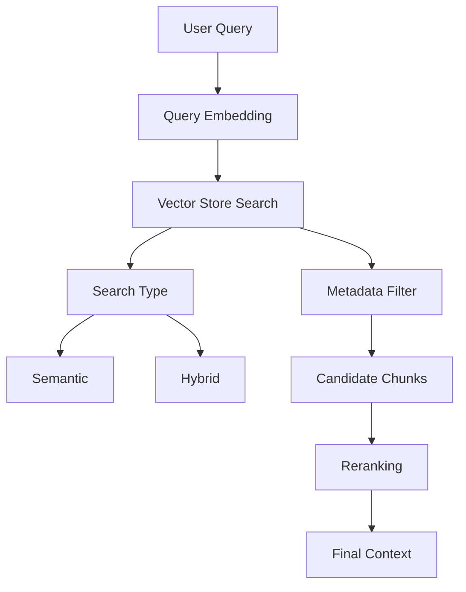

### Design Questions

- How many results should be retrieved?
- Should search be semantic or hybrid?
- What metadata filters are required?
- Is reranking needed?
- What is the latency impact?
- What is the cost impact?
- How will retrieval quality be measured?

---

## 14. Semantic Search vs Hybrid Search

Semantic search uses vector similarity.

Hybrid search combines semantic search with raw text or keyword-style search where supported.

### Semantic Search

Best when:

- users ask conceptual questions
- wording differs between query and document
- meaning matters more than exact phrase

Risk:

- misses exact identifiers
- may retrieve semantically similar but wrong chunks

### Hybrid Search

Best when:

- exact terms matter
- product codes, policy IDs, error codes, customer names, or device models appear
- both meaning and keywords matter

Risk:

- may require compatible vector store and text fields
- tuning may be needed
- can increase complexity

### Decision Table

| Query Type | Search Type |
|---|---|
| "How do I troubleshoot heartbeat failures?" | semantic or hybrid |
| "What does error DEV-504 mean?" | hybrid |
| "Find firmware 3.2 rollback policy" | hybrid |
| "Explain refund exceptions" | semantic or hybrid |
| "Show policy ID RMA-2026-17" | hybrid |

---

## 15. Metadata Filtering

Metadata filtering improves relevance and security.

Useful metadata:

- document type
- department
- product
- region
- customer tier
- effective date
- version
- author
- source system
- confidentiality
- tenant ID
- language
- expiration date
- access group

### Metadata Filter Pattern

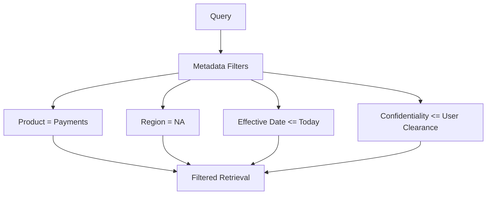

### Example

Retrieve only current runbooks for payment devices in North America:

```json
{
  "equals": {
    "key": "product",
    "value": "payments"
  }
}
```

### Enterprise Principle

> Metadata is not optional decoration. Metadata is how enterprise retrieval becomes precise, secure, and governable.

---

## 16. Reranking

Reranking reorders retrieved candidates to improve relevance.

Initial retrieval may return candidates based on vector similarity. A reranker can evaluate query-document relevance more carefully.

### Reranking Pattern

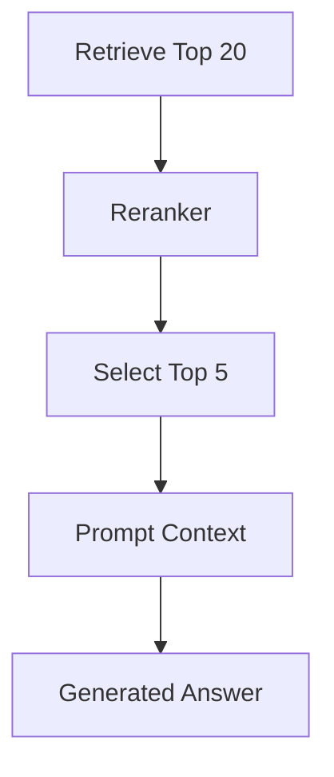

### Use Reranking When

- retrieved chunks are noisy
- semantic similarity is not enough
- top results are often irrelevant
- answer quality depends on precise evidence
- domain has many similar documents
- compliance requires stronger evidence selection

### Tradeoffs

Benefits:

- better context quality
- fewer irrelevant chunks
- improved groundedness

Costs:

- added latency
- added cost
- more configuration
- another model to evaluate

---

## 17. Citations

Citations are a trust feature.

A generated answer should show where it came from.

Citations help users:

- verify claims
- inspect source documents
- detect outdated content
- challenge unsupported answers
- comply with audit expectations
- build trust in AI systems

### Citation Flow

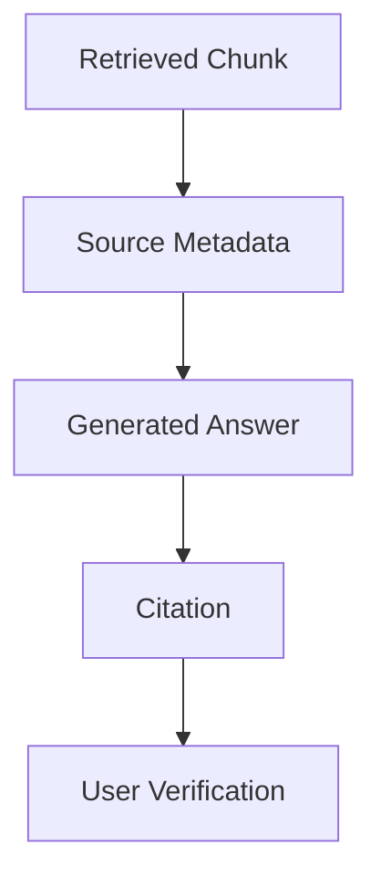

### Citation Quality Questions

- Does the citation point to the correct document?
- Does it identify the right section or page?
- Does the cited text actually support the claim?
- Is the source current?
- Is the source authoritative?
- Is the user allowed to view the source?

### Enterprise Rule

> A citation is not useful unless it supports the answer and the user can access the source.

---

## 18. Permissions and Secure Retrieval

Secure retrieval requires enforcing what the user is allowed to see.

Permissions can come from:

- data source ACLs
- IAM roles
- application identity
- enterprise identity provider
- group membership
- tenant context
- document metadata
- custom policy engine

### Secure Retrieval Pattern

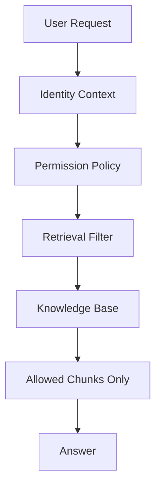

### Permission Failure

If restricted content is retrieved and placed into the prompt, it is already too late.

The model should never receive context the user is not authorized to access.

### Enterprise Principle

> Authorization must happen before retrieved context reaches the model.

---

## 19. Freshness and Synchronization

RAG systems fail when knowledge is stale.

Freshness questions:

- How often does each source change?
- What is the sync frequency?
- Are deletes propagated?
- Are expired documents removed?
- Are old versions retained?
- How are conflicts handled?
- How is sync failure alerted?
- Who owns stale content?

### Sync Modes

Bedrock Knowledge Bases supports different synchronization approaches. Choosing the right one is an architecture decision, not a configuration detail.

| Sync Mode | How It Works | Best When | Risk |
|---|---|---|---|
| **Manual sync** | Admin triggers sync explicitly | Low-change content, controlled releases | Easy to forget; human error |
| **Scheduled sync** | Sync runs on a time-based schedule (hourly, daily, nightly) | Content changes on a predictable cadence | May include stale windows between syncs |
| **Event-driven sync** | Source system notifies on document change; sync triggered immediately | Frequently changing content, compliance-critical freshness | More complex integration; requires event pipeline |

**Design guidance:** Do not default to daily sync for all knowledge bases. Match sync frequency to the update frequency of the source content and the freshness tolerance of the workflow.

Example freshness policy:

| Knowledge Domain | Source Change Frequency | Sync Mode | Max Staleness |
|---|---|---|---|
| Refund policy | Monthly | Scheduled (daily) | 24 hours |
| Firmware release notes | Per release | Event-driven | < 1 hour |
| Historical incident archive | Rarely | Manual | Acceptable |
| Active runbooks | Weekly | Scheduled (weekly) | 7 days |

### Freshness Architecture

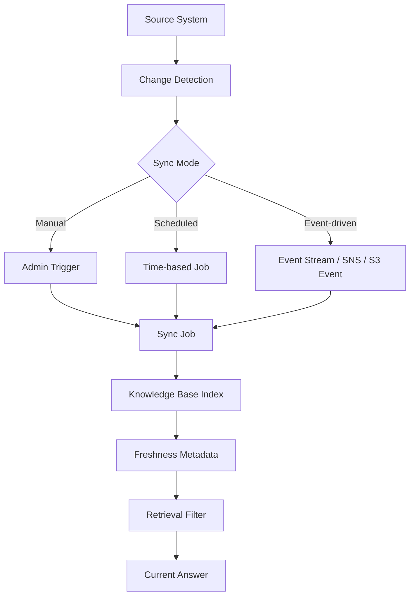

### Freshness Metadata

Useful fields:

- effective_date
- expiration_date
- last_modified
- document_version
- source_owner
- authoritative_status

---

## 20. Knowledge Ownership

Every knowledge base needs content owners.

Without ownership, the system becomes an answer generator over unmanaged content.

### Ownership Table

| Knowledge Domain | Owner | Review Frequency | Escalation |
|---|---|---|---|
| refund policy | legal/support ops | monthly | legal |
| device runbooks | operations | quarterly | platform ops |
| firmware notes | engineering | release-based | engineering |
| customer playbooks | customer success | quarterly | VP CS |

### Owner Responsibilities

- approve sources
- remove stale content
- resolve conflicts
- review retrieval quality
- respond to user feedback
- approve major updates
- define metadata standards

---

## 21. Multi-Knowledge-Base Architectures

Some workflows require multiple knowledge bases.

Example:

- policy knowledge base
- product knowledge base
- support history knowledge base
- runbook knowledge base
- contract knowledge base

### Multi-KB Pattern

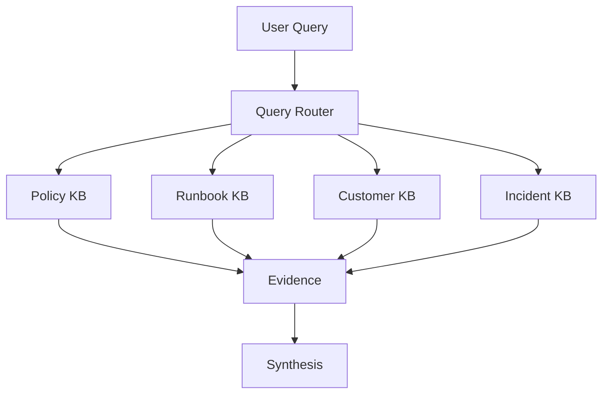

### Design Questions

- Should one query search multiple KBs?
- Should a router choose the KB?
- Should results be merged and reranked?
- How are permissions enforced across KBs?
- How are citations preserved?
- How are conflicting sources resolved?

---

## 22. Knowledge Bases and Bedrock Agents

Bedrock Agents can use knowledge bases to retrieve information while performing tasks.

### Agent + Knowledge Base Pattern

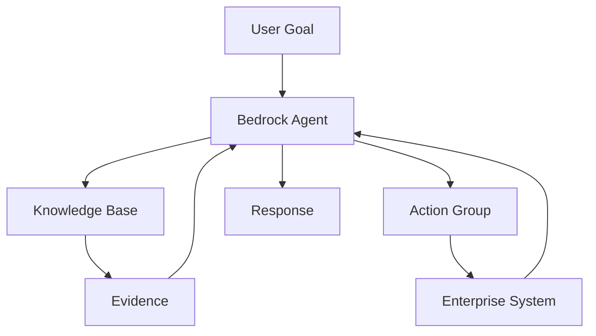

### Guidance

Use knowledge bases for:

- policies
- documentation
- runbooks
- procedures
- product knowledge
- historical incidents

Use action groups/tools for:

- live account status
- transactions
- workflow updates
- real-time telemetry
- external system actions

### Principle

> Use knowledge bases for knowledge. Use tools for live state and action.

---

## 23. Knowledge Bases with LangGraph

LangGraph can call Bedrock Knowledge Bases inside graph nodes.

### Pattern

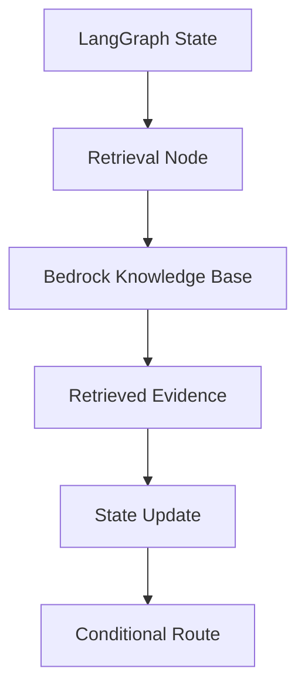

### Use Cases

- retrieve evidence
- evaluate sufficiency
- refine query
- search multiple KBs
- validate citations
- route to human review if evidence is weak

### Example State Fields

```python
class KnowledgeState(TypedDict):
    user_question: str
    retrieval_queries: list[str]
    retrieved_chunks: list[dict]
    evidence_score: float
    citations: list[dict]
    answer: str
    needs_more_evidence: bool
```

---

## 24. Knowledge Bases with MCP

Chapter 10 introduced MCP as an integration boundary.

A knowledge base can be exposed as an MCP tool or resource for MCP-compatible agents.

### Pattern

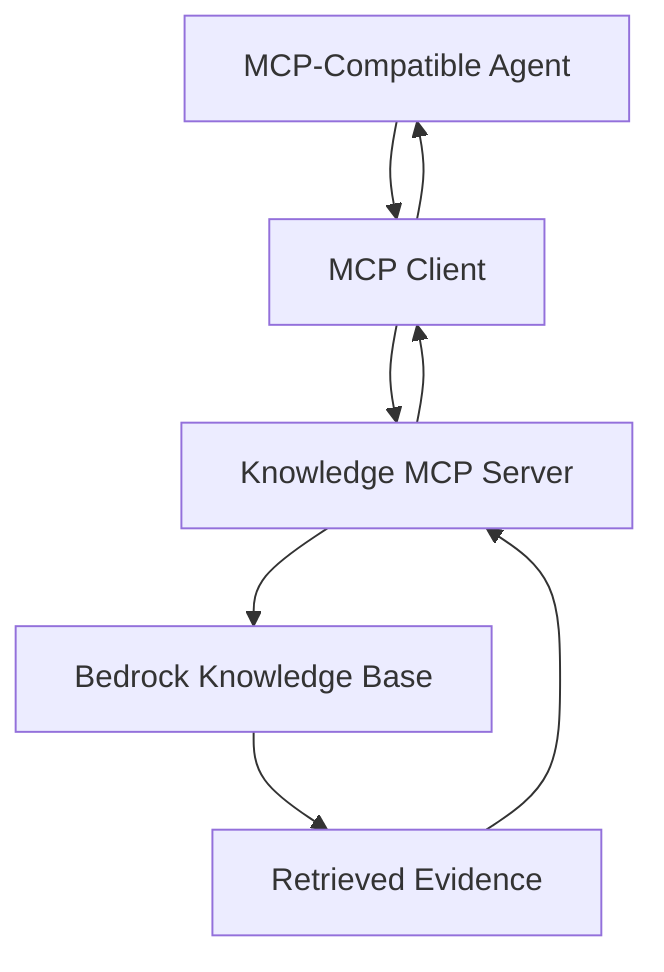

### Benefits

- standard tool interface
- reusable retrieval capability
- agent-framework portability
- centralized knowledge governance
- easier discovery

### Design Caution

MCP should not bypass knowledge base permissions or enterprise retrieval policy.

---

## 25. Structured Data and Graph Retrieval

Not all knowledge is unstructured text.

Some enterprise knowledge lives in:

- relational databases
- graph relationships
- data warehouses
- metrics stores
- transactional systems
- configuration databases

Bedrock Knowledge Bases can be used with structured data patterns where supported, but architects must decide whether a knowledge base, SQL query, graph query, or tool call is the right abstraction.

### Decision Table

| Data Type | Best Pattern |
|---|---|
| policy documents | knowledge base |
| runbooks | knowledge base |
| device telemetry | tool/API query |
| customer account status | tool/API query |
| contract PDFs | knowledge base plus metadata |
| product catalog | search/index or structured tool |
| relationship graph | graph retrieval |
| revenue metrics | BI/data warehouse tool |

### Principle

> Do not force every data problem into vector retrieval.

---

## 26. Evaluation of Bedrock Knowledge Bases

Evaluate three layers:

1. Retrieval
2. Generation
3. Business outcome

### Evaluation Architecture

```mermaid
flowchart TD
    A[Golden Questions] --> B[Retrieve]
    B --> C[Retrieval Metrics]
    B --> D[Generate Answer]
    D --> E[Groundedness Metrics]
    D --> F[Human Review]
    F --> G[Business Metrics]
```

### Retrieval Metrics

- Recall@K
- Precision@K
- Mean Reciprocal Rank
- nDCG
- citation relevance
- metadata filter correctness
- permission correctness

### Generation Metrics

- groundedness
- faithfulness
- citation accuracy
- completeness
- refusal correctness
- answer usefulness
- tone and clarity

### Business Metrics

- support handle time
- escalation rate
- self-service success
- first-contact resolution
- incident resolution speed
- analyst productivity
- customer satisfaction

---

## 27. Golden Dataset for Knowledge Bases

A golden dataset should include:

- common questions
- rare questions
- ambiguous questions
- outdated policy questions
- conflicting source questions
- permission-sensitive questions
- exact identifier questions
- multi-hop questions
- expected citations
- expected refusals

### Example

```json
{
  "id": "kb-ops-001",
  "question": "What should we check first when terminals stop sending heartbeat after firmware rollout?",
  "expected_sources": [
    "heartbeat-failure-runbook",
    "firmware-rollout-troubleshooting"
  ],
  "must_include": [
    "confirm firmware version",
    "check network connectivity",
    "compare affected region"
  ],
  "must_not_include": [
    "automatic rollback without approval"
  ],
  "risk_level": "medium"
}
```

---

## 28. Observability and Operations

Knowledge base observability should include:

- ingestion job success/failure
- documents processed
- documents failed
- chunks created
- embedding cost
- vector store size
- retrieval latency
- retrieval result count
- no-result queries
- top queries
- low-confidence queries
- citation usage
- sync freshness
- permission denials
- answer feedback
- cost by KB
- cost by application

### Observability Pattern

```mermaid
flowchart TD
    A[Ingestion Logs] --> D[Knowledge Base Dashboard]
    B[Retrieval Traces] --> D
    C[User Feedback] --> D
    D --> E[Alerts]
    D --> F[Quality Review]
    D --> G[Cost Review]
```

---

## 29. Cost Architecture

Cost drivers include:

- data ingestion
- embedding generation
- vector storage
- retrieval requests
- reranking
- generation model calls
- streaming
- sync frequency
- evaluation runs
- observability/log storage
- human review

### Cost Control Levers

- index only useful content
- remove stale documents
- avoid unnecessary sync frequency
- choose appropriate embedding model
- use metadata filters
- tune numberOfResults
- use reranking selectively
- use Retrieve when custom generation can reduce cost
- cache frequent answers where safe
- evaluate cost per successful answer

### Cost Formula

```text
Cost per Trusted Answer =
(ingestion + embeddings + storage + retrieval + reranking + generation + evaluation + operations)
/ number of useful grounded answers
```

---

## 30. Bedrock Knowledge Bases Reference Architecture

```mermaid
flowchart TD
    U[User / Application] --> G[Enterprise AI Gateway]
    G --> Q[Query Policy]
    Q --> K[Bedrock Knowledge Base]
    K --> V[Vector Store]
    K --> D[Data Sources]
    D --> S3[S3 / Docs / Connectors]
    K --> R[Retrieved Evidence]
    R --> M[Bedrock Model]
    M --> A[Answer with Citations]
    A --> E[Evaluator]
    A --> O[Observability]
    G --> P[Permission Context]
    P --> Q
```

### Architecture Principle

A knowledge base should be behind an application policy layer, not exposed as an uncontrolled enterprise search oracle.

---

## 31. Production Readiness Checklist

Before launching a Bedrock Knowledge Base:

- [ ] business use case defined
- [ ] knowledge owner assigned
- [ ] source systems approved
- [ ] data classification completed
- [ ] document permissions understood
- [ ] metadata schema defined
- [ ] chunking strategy selected
- [ ] embedding model selected
- [ ] vector store selected
- [ ] sync frequency defined
- [ ] delete/expiry behavior defined
- [ ] retrieval configuration tested
- [ ] metadata filters tested
- [ ] citations validated
- [ ] golden dataset created
- [ ] retrieval evaluation completed
- [ ] groundedness evaluation completed
- [ ] human review completed
- [ ] observability dashboard built
- [ ] cost model created
- [ ] incident response process defined
- [ ] rollback/reindex plan defined

---

## 32. Architecture Review Scenario

### Scenario

A company wants to index every internal document into one large Bedrock Knowledge Base and use it for all employee questions.

### Initial Design

The team proposes:

- connect every document source
- use default chunking
- use default retrieval settings
- no metadata strategy
- no document ownership
- no permission filtering
- no evaluation dataset
- no stale content process
- no cost dashboard

### Review Finding

This is not production-ready.

### Problems

- irrelevant retrieval
- stale answers
- permission leakage
- conflicting documents
- weak citations
- no ownership
- no trust model
- high cost
- poor user adoption
- compliance risk

### Improved Design

```mermaid
flowchart TD
    A[Use Case: Support Policy Assistant] --> B[Approved Sources]
    B --> C[Metadata Schema]
    C --> D[Permission Model]
    D --> E[Knowledge Base]
    E --> F[Golden Dataset Evaluation]
    F --> G[Pilot]
    G --> H[Feedback and Tuning]
    H --> I[Scale to Next Domain]
```

### Recommendation

Start with one domain and one workflow. Prove retrieval quality, citation accuracy, and business value before expanding.

---

## 33. Lessons from the Field

### What Worked

Strong Bedrock Knowledge Base implementations start with a specific workflow and authoritative sources.

What works:

- narrow domain scope
- clear knowledge owner
- metadata strategy
- retrieval evaluation
- citation validation
- permission-aware retrieval
- sync monitoring
- stale content review
- human feedback loop
- cost dashboard
- phased expansion

### What Did Not Work

Weak implementations index large volumes of unmanaged content and hope the model sorts it out.

What fails:

- indexing everything
- no metadata
- no ownership
- stale documents
- conflicting sources
- no evaluation
- no citation review
- no permission model
- no retrieval tuning
- no business metric

### Common Mistakes

- Treating managed RAG as automatic correctness.
- Confusing retrieval success with answer success.
- Ignoring metadata.
- Ignoring exact identifiers.
- Using semantic search when hybrid search is needed.
- Not testing permission-sensitive queries.
- Not validating citations.
- Not monitoring failed ingestion.
- Not assigning content owners.
- Not planning re-indexing when embedding models change.

### ROI Perspective

Knowledge Bases create ROI when they reduce knowledge friction.

ROI drivers:

- faster support answers
- reduced training burden
- reduced escalations
- improved self-service
- faster incident response
- better field service productivity
- improved compliance consistency
- reduced manual document search

Cost drivers:

- ingestion
- embeddings
- vector storage
- retrieval
- reranking
- model generation
- evaluation
- content governance
- operations

The ROI question:

> Does this knowledge base improve a high-value workflow enough to justify ingestion, governance, retrieval, and operating cost?

### CTO Perspective

A CTO should ask:

- What business workflow does this knowledge base support?
- Who owns the content?
- Which sources are authoritative?
- How are permissions enforced?
- How do we know retrieval is correct?
- How are citations validated?
- How do we handle stale or conflicting content?
- What is the cost per trusted answer?
- What is the expansion strategy?
- What is the rollback/reindex plan?

---

## 34. Pratik's Principles

### Principle 1: Managed RAG Is Still RAG

A managed service reduces infrastructure work. It does not remove retrieval discipline.

### Principle 2: Do Not Index Everything

Index authoritative, useful, governed knowledge.

### Principle 3: Metadata Is Architecture

Metadata enables precision, permissions, freshness, filtering, and trust.

### Principle 4: Retrieval Quality Comes Before Generation Quality

A stronger model cannot reliably fix weak retrieval.

### Principle 5: Authorization Must Happen Before Context Reaches the Model

Never retrieve restricted content and hope the model handles it safely.

### Principle 6: Citations Must Support Claims

A citation that does not support the answer is false trust.

### Principle 7: Freshness Must Be Designed

Stale knowledge is a production defect.

### Principle 8: Content Ownership Is Required

Every knowledge base needs owners who maintain source quality.

---

## 35. Hands-On Labs

### Lab 1: Knowledge Base Design

Design a Bedrock Knowledge Base for a support policy assistant.

Include:

- data sources
- metadata schema
- chunking strategy
- embedding model
- vector store
- retrieval configuration
- evaluation dataset
- permissions
- sync strategy

Deliverable:

```text
labs/chapter-12-bedrock-knowledge-bases/kb-design.md
```

---

### Lab 2: Metadata Strategy

Create metadata for ten sample documents.

Include:

- product
- region
- department
- effective date
- expiration date
- version
- source owner
- confidentiality
- document type

Deliverable:

```text
metadata-schema.md
```

---

### Lab 3: Retrieval Evaluation

Build a golden dataset of 25 questions.

For each question include:

- expected source
- expected answer elements
- expected citation
- risk level
- permission context

Deliverable:

```text
kb-golden-dataset.json
```

---

### Lab 4: Retrieve vs RetrieveAndGenerate Decision

Compare two architectures:

1. Retrieve + custom LangGraph generation
2. RetrieveAndGenerate managed response

Evaluate:

- control
- cost
- latency
- validation
- citations
- complexity

Deliverable:

```text
retrieve-vs-retrieve-and-generate.md
```

---

### Lab 5: Permission-Sensitive Retrieval Test

Create test cases where different users query the same knowledge base.

Users:

- support_l1
- support_manager
- legal
- finance
- external_partner

Deliverable:

```text
permission-sensitive-retrieval-tests.md
```

---

### Lab 6: Capstone Knowledge Layer

Design knowledge bases for:

- runbooks
- firmware notes
- incident history
- customer impact procedures
- executive communication templates

Deliverable:

```text
capstone-bedrock-kb-layer.md
```

---

## 36. Interview Questions

### Engineering-Level Questions

1. What is a Bedrock Knowledge Base?
2. What problem does RAG solve?
3. What is the difference between Retrieve and RetrieveAndGenerate?
4. What is chunking?
5. Why does metadata matter?
6. What is hybrid search?
7. What is reranking?
8. Why are citations important?
9. How do you test retrieval quality?
10. What causes stale answers?

### Architect-Level Questions

1. Design a Bedrock Knowledge Base architecture for support.
2. How would you choose data sources?
3. How would you enforce permissions?
4. How would you design metadata?
5. How would you evaluate retrieval quality?
6. When would you use Retrieve instead of RetrieveAndGenerate?
7. How would you handle multiple knowledge bases?
8. How would you integrate Knowledge Bases with LangGraph?
9. How would you expose a Knowledge Base through MCP?
10. How would you design observability for RAG?

### Director / VP / CTO-Level Questions

1. Why should we use Bedrock Knowledge Bases instead of custom RAG?
2. What business metric justifies a knowledge base?
3. Who owns content quality?
4. How do we prevent hallucinations?
5. How do we prevent permission leakage?
6. How do we measure ROI?
7. What is the cost per trusted answer?
8. How do we handle stale documents?
9. How do we scale from one domain to many?
10. What would make you reject a knowledge base design?

---

## 37. Certification Mapping

### AWS AI / Generative AI Professional Preparation

This chapter directly supports topics related to:

- Amazon Bedrock Knowledge Bases
- RAG
- data sources
- embeddings
- vector stores
- chunking
- metadata filtering
- Retrieve
- RetrieveAndGenerate
- citations
- retrieval configuration
- reranking
- security and permissions
- cost optimization
- evaluation

### Anthropic Claude / MCP Architecture Preparation

This chapter supports topics related to:

- grounding Claude with retrieved context
- MCP access to knowledge tools/resources
- citation-aware generation
- context design
- tool/resource safety
- retrieval evaluation

### NVIDIA Generative AI Preparation

This chapter supports topics related to:

- embedding workloads
- retrieval latency
- vector search performance
- reranking cost
- inference plus retrieval architecture
- RAG optimization

---

## 38. Chapter Exercises

### Exercise 1

Design a Bedrock Knowledge Base for field service technicians.

Include sources, metadata, chunking, retrieval configuration, permissions, and evaluation.

### Exercise 2

Create a retrieval failure analysis table for a support assistant.

Include at least ten failure modes and mitigations.

### Exercise 3

Design a metadata schema for policy documents across regions.

Include effective dates, expiration dates, language, region, product, owner, and confidentiality.

### Exercise 4

Create a golden dataset for an operations knowledge base.

Include common, rare, ambiguous, and high-risk questions.

### Exercise 5

Design a dashboard for knowledge base health.

Include ingestion, retrieval quality, citations, user feedback, cost, freshness, and permission denials.

---

## 39. Key Terms

| Term | Meaning |
|---|---|
| Bedrock Knowledge Base | Amazon Bedrock capability for managed RAG |
| RAG | Retrieval Augmented Generation |
| Data source | Source content connected to a knowledge base |
| Ingestion | Process of loading and processing source content |
| Parsing | Extracting usable content from documents |
| Chunking | Splitting documents into retrievable units |
| Embedding | Vector representation of text or content |
| Vector store | Storage and retrieval system for embeddings |
| Retrieve | API pattern for returning relevant chunks |
| RetrieveAndGenerate | API pattern for retrieval plus answer generation |
| Hybrid search | Combining semantic and lexical search |
| Semantic search | Retrieval using vector similarity |
| Metadata filter | Query constraint using document attributes |
| Reranking | Reordering retrieved results based on relevance |
| Citation | Source reference supporting an answer |
| Groundedness | Whether answer is supported by retrieved evidence |
| Freshness | Currency of indexed knowledge |
| ACL | Access control list |

---

## 40. One-Page Executive Brief

Bedrock Knowledge Bases provide a managed way to build RAG applications on AWS.

They help enterprise AI systems answer questions using company knowledge rather than relying only on general model knowledge. This is critical for support, operations, compliance, field service, sales, and executive workflows.

The benefit is faster delivery of grounded AI applications without building every part of the RAG pipeline from scratch.

However, managed RAG is not automatic trust. Enterprises still need:

- authoritative sources
- content owners
- metadata
- permissions
- freshness controls
- retrieval evaluation
- citation validation
- cost dashboards
- user feedback
- security review
- business metrics

The executive question is not simply:

> Can we connect our documents to Bedrock?

The better question is:

> Which business workflow needs grounded answers, which knowledge sources are authoritative, and how will we prove the system is correct, secure, current, and useful?

The recommended pattern is to start with one high-value domain, measure retrieval quality and business impact, and then expand carefully.

---

## 41. References

- Amazon Bedrock Knowledge Bases overview: https://docs.aws.amazon.com/bedrock/latest/userguide/knowledge-base.html
- How Amazon Bedrock Knowledge Bases work: https://docs.aws.amazon.com/bedrock/latest/userguide/kb-how-it-works.html
- Configure and customize Knowledge Base queries and response generation: https://docs.aws.amazon.com/bedrock/latest/userguide/kb-test-config.html

---

## 42. Chapter Summary

In this chapter, we explored Bedrock Knowledge Bases as a managed RAG architecture pattern.

We covered data sources, ingestion, parsing, chunking, embeddings, vector stores, Retrieve, RetrieveAndGenerate, streaming, retrieval configuration, semantic search, hybrid search, metadata filters, reranking, citations, permissions, secure retrieval, freshness, ownership, multi-knowledge-base architecture, Bedrock Agents, LangGraph, MCP, structured data, evaluation, golden datasets, observability, cost, reference architecture, production readiness, architecture review, lessons from the field, Pratik's Principles, labs, interview questions, certification mapping, and executive guidance.

The key lesson is:

> Bedrock Knowledge Bases reduce RAG infrastructure burden, but enterprise trust still depends on knowledge engineering, permissions, freshness, evaluation, and governance.

In Chapter 13, we will go deeper into Bedrock Agents and how managed agent orchestration connects models, knowledge bases, action groups, guardrails, and enterprise workflows.

---

## 43. Suggested Git Commit

```bash
mkdir -p chapters
cp 12-bedrock-knowledge-bases-reworked.md chapters/12-bedrock-knowledge-bases.md
cp BOOK_STATE-updated-through-chapter-12.md BOOK_STATE.md

git add chapters/12-bedrock-knowledge-bases.md BOOK_STATE.md
git commit -m "Add Chapter 12: Bedrock Knowledge Bases"
git push origin main
```
