# Chapter 16 — Claude Architecture

**Book:** The AI Architect & Practitioner Bootcamp  
**Chapter Status:** Complete Draft  
**Version:** 0.1 — Deep Dive  
**Author:** Pratik Desai  
**Primary Audience:** AI engineers, enterprise architects, AI platform engineers, product engineers, AWS architects, integration engineers, security architects, engineering leaders, consultants, directors, VPs, CTO-track practitioners, and certification candidates

---

## Chapter Thesis

Claude architecture is about using strong language, reasoning, context, and tool-use capabilities inside governed enterprise workflows, not simply calling an API.

A beginner sees Claude as a chatbot or model endpoint.

A practitioner sees Claude as a family of models accessible through a Messages API, Anthropic API, Amazon Bedrock, Google Cloud, or enterprise platforms.

An enterprise AI architect should see Claude as a model layer that must be surrounded by:

- instruction hierarchy
- context design
- tool boundaries
- MCP integration
- RAG grounding
- citations
- structured outputs
- prompt caching
- extended thinking where appropriate
- model routing
- cost and latency controls
- safety evaluation
- observability
- governance
- human accountability

The central thesis of this chapter is:

> Claude creates enterprise value when its model capabilities are placed inside explicit architecture patterns that control context, tools, outputs, evaluation, and business risk.

Claude may be very capable, but capability alone is not architecture. Production architecture determines whether Claude becomes a reliable enterprise system or a powerful demo.

---

## Learning Objectives

By the end of this chapter, you will be able to:

- Explain Claude's role as a model layer inside enterprise AI architecture.
- Describe the Messages API mental model.
- Design system prompts, user messages, assistant messages, content blocks, and inference parameters.
- Explain Claude tool use, including client tools, server tools, strict tool schemas, and tool-result loops.
- Design Claude with MCP for standardized access to enterprise tools and resources.
- Apply context design patterns for long documents, RAG, citations, and enterprise knowledge workflows.
- Understand prompt caching and when it improves cost/latency for repeated context.
- Understand extended thinking and when deeper reasoning budgets may be appropriate.
- Compare Claude via Anthropic API, Amazon Bedrock, and enterprise AI gateways.
- Design Claude applications with LangGraph, Bedrock, MCP, RAG, guardrails, and evaluation.
- Identify failure modes such as over-context, tool overexposure, prompt injection, citation misuse, schema drift, and cost explosion.
- Design a Claude-based architecture for the Enterprise Agentic Operations Platform capstone.

---

## Executive Summary

Claude is a family of models and platform capabilities from Anthropic that can be used to build enterprise assistants, agents, RAG systems, coding tools, summarizers, document processors, and decision-support workflows.

Anthropic's platform centers on the Messages API for conversational model interaction. Claude supports features such as tool use, streaming, structured outputs, citations, prompt caching, extended thinking, batch processing, context management, server tools, and MCP connectivity depending on model and platform configuration. Claude tool use allows the model to request calls to functions that developers define or tools Anthropic provides; with client tools, the application executes the operation and returns a tool result, while server tools are executed on Anthropic infrastructure.

Claude architecture matters because enterprise use cases require more than strong model output. They require:

- context boundaries
- instruction discipline
- source grounding
- tool authorization
- output validation
- structured response contracts
- cost controls
- latency controls
- safety testing
- governance
- auditability
- business KPI linkage

Claude can be used directly through Anthropic APIs, through Amazon Bedrock, through Google Cloud, and behind an enterprise AI gateway. The right architecture depends on security, procurement, data policy, model access, existing cloud strategy, observability, and operating model.

The key executive takeaway:

> Claude should be treated as a powerful reasoning and language engine inside an enterprise control plane, not as an unmanaged assistant.

---

## Business Motivation

Enterprises choose Claude for workflows where language quality, reasoning, document understanding, tool use, safety behavior, and long-context workflows matter.

Common business use cases include:

- executive briefing
- customer support drafting
- policy-grounded assistants
- contract summarization
- legal and compliance review support
- code modernization
- engineering copilots
- incident response analysis
- field service troubleshooting
- sales account preparation
- product documentation Q&A
- internal knowledge assistants
- agentic workflow automation

Claude can improve business outcomes by:

- reducing time spent reading and summarizing documents
- improving quality of internal and customer-facing responses
- accelerating software engineering work
- improving support and operations workflows
- enabling tool-using assistants
- enabling long-context document workflows
- improving reasoning-heavy decision support
- supporting agentic automation

But business value is not guaranteed.

Risks include:

- overusing large models for simple tasks
- sending too much context
- weak tool boundaries
- relying on prompts for security
- treating citations as perfect truth
- missing evaluation
- allowing hidden cost growth
- enabling agents without approval gates
- ignoring enterprise data policy
- vendor lock-in

The business goal is not "use Claude." The business goal is to improve a workflow with measurable quality, safety, cost, and ROI.

---

## The Five-Lens Framework for This Chapter

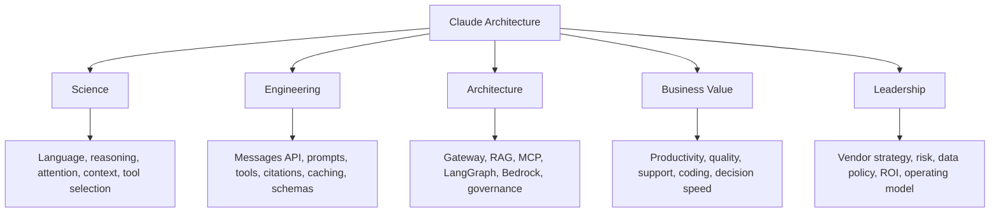

---

## 1. Claude in Enterprise AI Architecture

Claude should be positioned as a model capability inside the enterprise AI platform.

### Basic View

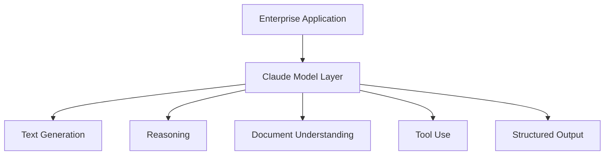

### Enterprise View

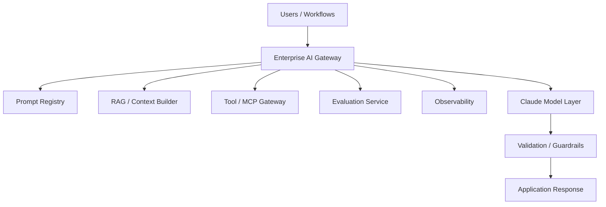

### Architecture Principle

> Do not let application teams call models directly without shared controls for prompts, tools, evaluation, cost, and governance.

---

## 2. Claude Access Patterns

Claude can be accessed through multiple enterprise channels.

### Pattern 1: Direct Anthropic API

Best when:

- product needs latest Anthropic features
- team wants direct API control
- procurement and data policy support direct use
- platform team can build governance around the API

### Pattern 2: Claude on Amazon Bedrock

Best when:

- enterprise is AWS-centric
- IAM and AWS governance are preferred
- Bedrock Knowledge Bases, Agents, Guardrails, or evaluations are part of the platform
- procurement prefers AWS marketplace/cloud billing

### Pattern 3: Claude on Google Cloud

Best when:

- enterprise is Google Cloud-centric
- Vertex AI or Google Cloud governance is standard
- existing data and AI platform lives on Google Cloud

### Pattern 4: Claude Behind Enterprise AI Gateway

Best when:

- multiple model providers are used
- application teams need a stable internal interface
- cost and routing need centralized control
- governance and observability must be uniform

### Access Pattern Diagram

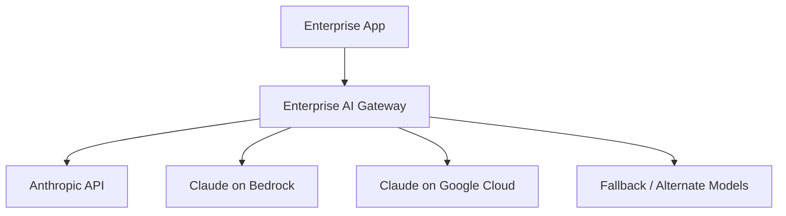

### Decision Table

| Requirement | Better Fit |
|---|---|
| latest Anthropic features | direct Anthropic API |
| AWS-native governance | Claude on Bedrock |
| Google Cloud governance | Claude on Google Cloud |
| multi-provider strategy | AI gateway |
| strict central policy | AI gateway |
| Bedrock Knowledge Bases/Agents | Claude on Bedrock |
| MCP-first architecture | direct API or gateway with MCP support |

---

## 3. Messages API Mental Model

Claude's Messages API uses a conversation-style structure with messages and content blocks.

A typical request includes:

- model
- system instruction
- messages
- max tokens
- temperature or other inference parameters
- tools when tool use is enabled
- optional features such as citations, prompt caching, structured outputs, or thinking where supported

### Message Flow

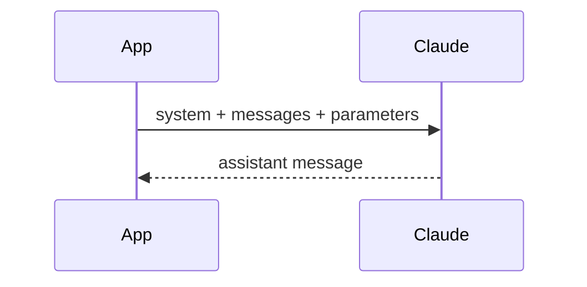

### Example Skeleton

```python
import anthropic

client = anthropic.Anthropic()

response = client.messages.create(
    model="claude-model-id",
    max_tokens=1000,
    system="You are an enterprise support assistant. Answer with cited evidence.",
    messages=[
        {"role": "user", "content": "Summarize the incident for an executive."}
    ],
)
```

### Enterprise Guidance

The Messages API should be wrapped in platform services that standardize:

- prompt loading
- model selection
- metadata
- logging
- evaluation
- cost tracking
- output validation
- sensitive data handling

---

## 4. Instruction Hierarchy and System Prompts

The system prompt defines durable behavior.

It should not be treated as clever wording. It is a production control surface.

### System Prompt Should Define

- role
- task boundaries
- authoritative sources
- output style
- refusal policy
- tool-use policy
- escalation rules
- data handling rules
- citation expectations
- uncertainty behavior
- prohibited actions

### Weak System Prompt

```text
You are helpful.
```

### Better System Prompt

```text
You are an internal operations assistant for device operations incidents. Use retrieved runbooks and telemetry evidence. Do not recommend firmware rollback, customer notification, or production configuration changes without human approval. If evidence is insufficient, say so and request escalation.
```

### Prompt Governance

System prompts should be:

- versioned
- reviewed
- tested
- owned
- monitored
- evaluated
- rolled back when needed

### Principle

> A system prompt is not security, but it is part of production behavior.

---

## 5. Content Blocks

Claude messages can include structured content blocks such as text and documents, and depending on feature support, images, tool_use, tool_result, search results, or other specialized blocks.

### Content Block Pattern

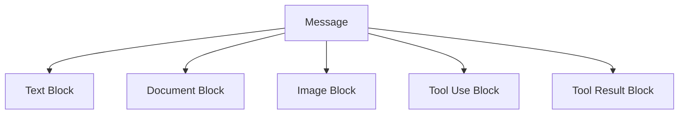

### Enterprise Use

Content blocks help structure:

- user question
- source documents
- RAG chunks
- tool results
- images or screenshots
- structured instructions
- citations-enabled documents

### Guidance

Use content blocks to preserve separation between:

- instructions
- user input
- retrieved evidence
- tool output
- documents
- final response requirements

This separation helps reduce prompt injection risk and improves traceability.

### Python: Vision Content Block

Vision-capable Claude models accept image content blocks. This is the shape of a multimodal request for workflows like field service photo analysis, device defect inspection, or document image review.

```python
import anthropic
import base64
from pathlib import Path

client = anthropic.Anthropic()

def analyze_device_image(image_path: str, question: str,
                          model: str = "claude-sonnet-4-6") -> str:
    """
    Send an image to Claude for visual analysis.
    Typical enterprise use: field service device photos, defect inspection,
    screen captures for troubleshooting, document scans.
    """
    image_bytes = Path(image_path).read_bytes()
    image_b64 = base64.standard_b64encode(image_bytes).decode("utf-8")

    # Detect media type from extension — extend as needed
    ext = Path(image_path).suffix.lower()
    media_type_map = {
        ".jpg": "image/jpeg", ".jpeg": "image/jpeg",
        ".png": "image/png", ".gif": "image/gif", ".webp": "image/webp"
    }
    media_type = media_type_map.get(ext, "image/jpeg")

    response = client.messages.create(
        model=model,
        max_tokens=600,
        system="You are a field operations analyst. Describe what you observe and identify any issues.",
        messages=[{
            "role": "user",
            "content": [
                {
                    "type": "image",
                    "source": {
                        "type": "base64",
                        "media_type": media_type,
                        "data": image_b64
                    }
                },
                {
                    "type": "text",
                    "text": question
                }
            ]
        }]
    )
    return response.content[0].text

# --- URL-based image (no download needed) ---
def analyze_image_from_url(image_url: str, question: str,
                            model: str = "claude-sonnet-4-6") -> str:
    response = client.messages.create(
        model=model,
        max_tokens=600,
        messages=[{
            "role": "user",
            "content": [
                {
                    "type": "image",
                    "source": {"type": "url", "url": image_url}
                },
                {"type": "text", "text": question}
            ]
        }]
    )
    return response.content[0].text

# Key Engineering Notes:
# - Image is passed as base64 in the source block — no external URL required
# - For large images: resize before sending; raw photo files can be several MB
# - PII in images: apply the same data classification as text content
# - Vision model availability varies by Claude version and platform — verify before use
# - For batch image analysis (product photos, inspection queues): use Message Batches API
```

### Claude Model Tier — Use Case Routing

Claude models differ in capability, latency, and cost. Route by workflow requirements, not by habit of always using the largest model.

| Model Tier | Speed/Cost | Best Enterprise Use Cases |
|---|---|---|
| Claude Haiku | Fastest / lowest cost | Classification, intent routing, short extraction, quick refusals, high-volume summarization, embedding metadata generation, evaluation scoring |
| Claude Sonnet | Balanced | RAG generation, tool use, multi-turn assistants, code explanation, support drafting, structured output, most production workflows |
| Claude Opus | Slowest / highest capability | Complex architecture review, multi-document reasoning, long contract analysis, strategic planning, cross-source synthesis, extended thinking workflows |

**Routing principle:** Use Haiku where speed and cost matter and the task is narrow. Use Sonnet for the majority of production workflows. Reserve Opus for tasks where reasoning depth measurably improves outcomes on your golden dataset.

---

## 6. Context Design with Claude

Claude can handle substantial context depending on model and platform, but more context is not automatically better.

### Context Design Questions

- What context is necessary?
- What context is authoritative?
- What can be retrieved instead of always included?
- What should be summarized?
- What should be cached?
- What is sensitive?
- What can the user access?
- What should be excluded?
- How will context be evaluated?

### Context Architecture

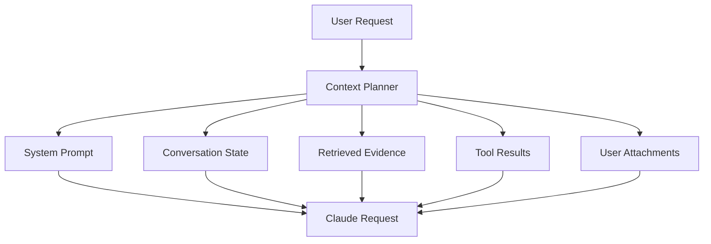

### Principle

> Context is architecture. Every token should earn its place.

---

## 7. Long-Context Patterns

Claude is often used for long-context workflows such as document review, codebase analysis, policy comparison, and executive synthesis.

### Use Cases

- contract analysis
- code modernization
- long policy review
- medical administrative records
- large incident timeline
- multi-document executive briefing
- product documentation synthesis
- research reports

### Long-Context Pattern

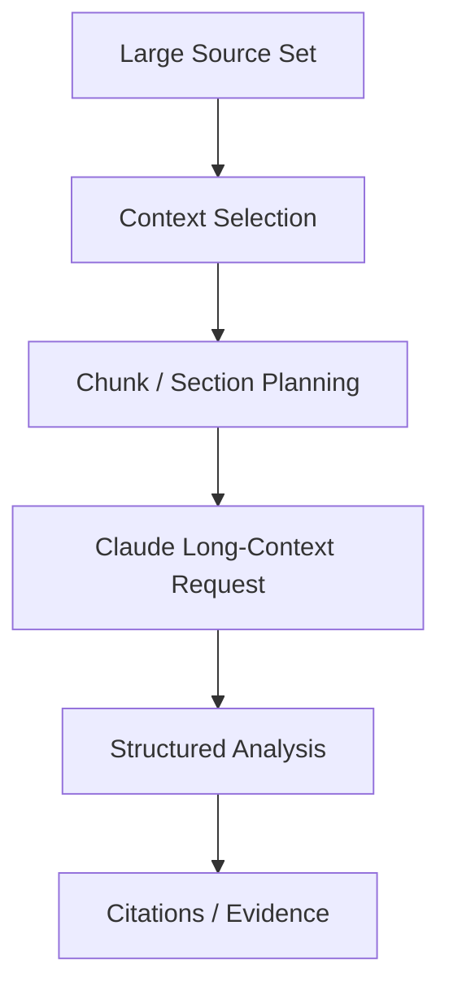

### Risks

- high cost
- high latency
- irrelevant context
- lost-in-the-middle behavior
- citation overload
- harder evaluation
- hidden permission issues

### Guidance

Long context is useful when source ordering and full-document reasoning matter. RAG is better when the answer depends on a small subset of a large corpus.

---

## 8. Claude and RAG

Claude works well as the generation and synthesis layer in RAG architectures.

### RAG Pattern with Claude

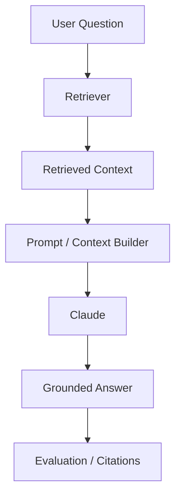

### Design Guidance

Use Claude for:

- synthesis
- reasoning over retrieved evidence
- explaining policies
- drafting responses
- comparing sources
- summarizing results
- citing evidence when citation features or application-level citations are used

Do not use Claude to compensate for weak retrieval. If retrieval fails, the answer is built on bad evidence.

---

## 9. Citations

Claude supports citations for grounding responses in provided source documents.

Citations help users verify answers and inspect source passages. The citations feature can return specific passages that support claims and supports documents such as PDFs, plain text, and custom content documents. Citations are more reliable than asking a model to invent citation formatting through prompting alone.

### Citation Pattern

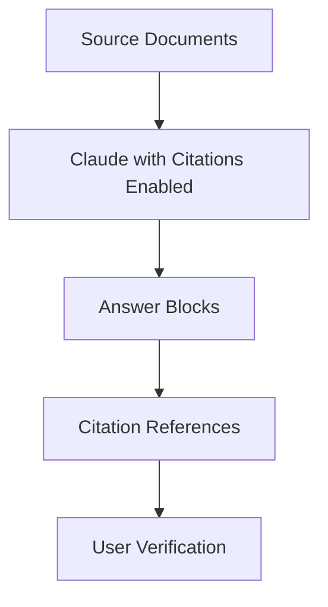

### Good Uses

- policy Q&A
- compliance support
- contract analysis
- research summaries
- executive briefings
- support knowledge answers
- incident runbook summaries

### Citation Design Questions

- Are sources authoritative?
- Are sources current?
- Does cited text support the claim?
- Can the user access the source?
- Are citations required for every claim?
- Are citations compatible with desired output format?

### Important Compatibility Note

Citations and strict structured output formats can be incompatible because citations require interleaving citation blocks with text output. Design output requirements accordingly.

### Python: Citations with Document Blocks

```python
import anthropic

client = anthropic.Anthropic()

def policy_qa_with_citations(question: str, policy_documents: list[dict],
                               model: str = "claude-sonnet-4-6") -> dict:
    """
    Answer a policy question with grounded citations from source documents.
    policy_documents: list of {"title": str, "content": str} dicts.

    Returns the answer text and a list of cited passages with their sources.
    """
    # Build document content blocks with citations enabled
    document_blocks = [
        {
            "type": "document",
            "source": {
                "type": "text",
                "media_type": "text/plain",
                "data": doc["content"]
            },
            "title": doc["title"],
            "citations": {"enabled": True}
        }
        for doc in policy_documents
    ]

    response = client.messages.create(
        model=model,
        max_tokens=800,
        system=(
            "You are a policy assistant. Answer questions using only the "
            "provided policy documents. Cite the source passage for every claim."
        ),
        messages=[{
            "role": "user",
            "content": document_blocks + [{"type": "text", "text": question}]
        }]
    )

    # Parse response content: mix of text blocks and citation blocks
    answer_parts = []
    cited_passages = []

    for block in response.content:
        if block.type == "text":
            answer_parts.append(block.text)
        elif block.type == "citations":
            for citation in block.citations:
                cited_passages.append({
                    "document_title": citation.document_title,
                    "cited_text": citation.cited_text,
                    "start_char": getattr(citation, "start_char_index", None),
                    "end_char":   getattr(citation, "end_char_index", None)
                })

    return {
        "answer": "".join(answer_parts),
        "citations": cited_passages,
        "citation_count": len(cited_passages)
    }


# --- Usage example ---
# docs = [
#     {"title": "Refund Policy v4", "content": "Refunds accepted within 30 days..."},
#     {"title": "Customer Tiers Policy", "content": "Enterprise customers receive..."}
# ]
# result = policy_qa_with_citations("Can an enterprise customer get a refund after 45 days?", docs)
# print(result["answer"])
# for c in result["citations"]:
#     print(f"  [{c['document_title']}]: {c['cited_text'][:80]}...")

# Key Engineering Notes:
# - Each document block must have "citations": {"enabled": True} per document
# - Response content alternates between text blocks and citation blocks
# - Never display citations without verifying the source document is authoritative
# - Citations feature is not compatible with strict JSON output mode — pick one
# - For permission-sensitive workflows: validate that the user can access each cited document
```

---

## 10. Structured Outputs

Structured outputs make model responses easier to validate and automate.

Use structured outputs when applications need:

- JSON
- typed fields
- workflow decisions
- extraction results
- scorecards
- routing outputs
- tool parameters
- validation-friendly responses

### Structured Output Pattern

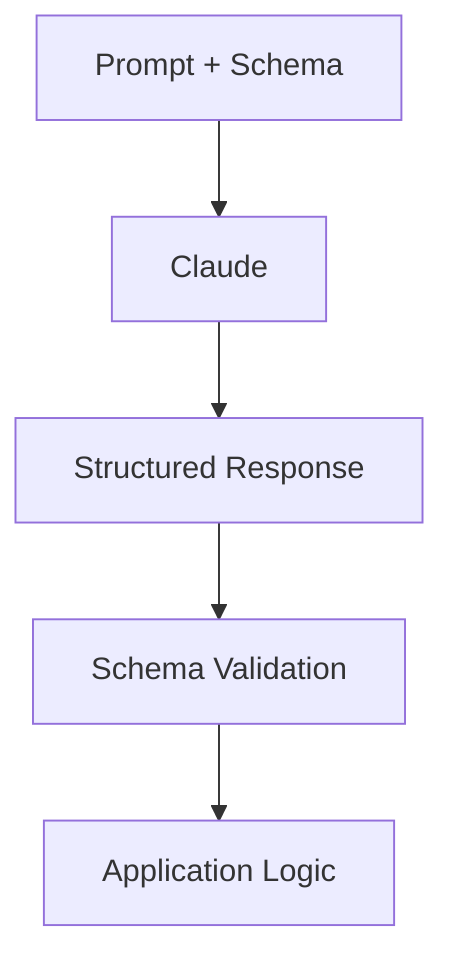

### Use Cases

- invoice extraction
- contract field extraction
- risk scoring
- intent routing
- incident classification
- customer impact summary
- executive brief metadata
- evaluation scoring

### Guidance

Use schema validation after generation. Do not trust JSON simply because it parses. Validate business rules too.

---

## 11. Tool Use with Claude

Tool use lets Claude request calls to functions that developers define or that Anthropic provides.

Claude decides when to call a tool based on the user request and the tool description unless tool choice is constrained.

There are two broad categories:

- client tools
- server tools

### Tool Use Flow

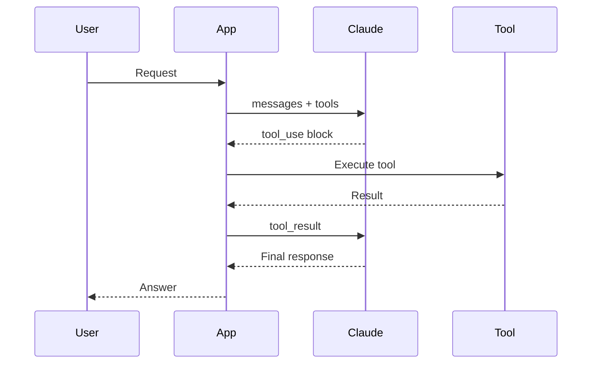

### Client Tools

Client tools are defined and executed by the application.

Examples:

- query CRM
- search tickets
- calculate eligibility
- create support case
- retrieve device telemetry
- request approval

### Server Tools

Server tools are executed by Anthropic infrastructure where available, such as web search, web fetch, code execution, tool search, or MCP connector depending on feature availability.

### Enterprise Principle

> Claude may request a tool. The enterprise system must authorize the tool.

### Python: Multi-Turn Tool Use Loop

This is the complete shape of a Claude tool use conversation — the pattern that every tool-using Claude application implements. The loop runs until Claude returns a final text response or hits the step budget.

```python
import anthropic
import json
from typing import Callable

client = anthropic.Anthropic()

# --- Tool definitions ---

TOOLS = [
    {
        "name": "get_device_telemetry",
        "description": "Retrieve recent heartbeat failure summary for a product and region. Read-only.",
        "input_schema": {
            "type": "object",
            "properties": {
                "product":  {"type": "string", "description": "Product name"},
                "region":   {"type": "string", "description": "Region code"},
                "hours_back": {"type": "integer", "minimum": 1, "maximum": 72}
            },
            "required": ["product", "region", "hours_back"]
        }
    },
    {
        "name": "search_runbook",
        "description": "Search runbooks for troubleshooting guidance by symptom keywords.",
        "input_schema": {
            "type": "object",
            "properties": {
                "query": {"type": "string", "description": "Symptom or error description"}
            },
            "required": ["query"]
        }
    }
]

# --- Mock tool implementations (replace with real authorized calls) ---

def execute_tool(tool_name: str, tool_input: dict, user_role: str) -> str:
    """Authorization and execution — deterministic, never delegated to the model."""
    if user_role not in ["support_l2", "operations", "support_manager"]:
        return json.dumps({"error": f"Role '{user_role}' not authorized for tool '{tool_name}'"})

    if tool_name == "get_device_telemetry":
        return json.dumps({
            "product": tool_input["product"],
            "region": tool_input["region"],
            "failure_rate_pct": 34.2,
            "affected_terminals": 847,
            "last_successful_heartbeat": "2026-06-27T14:22:00Z"
        })
    elif tool_name == "search_runbook":
        return json.dumps({
            "runbook": "Heartbeat Failure Runbook v3",
            "steps": ["1. Verify firmware version", "2. Check network config",
                      "3. Restart heartbeat service", "4. Escalate if unresolved"]
        })
    return json.dumps({"error": f"Unknown tool: {tool_name}"})


def run_tool_use_conversation(user_message: str, user_role: str,
                               model: str = "claude-sonnet-4-6",
                               max_steps: int = 6) -> str:
    """
    Multi-turn Claude tool use loop.
    Continues until Claude returns a final text answer or max_steps is hit.
    """
    messages = [{"role": "user", "content": user_message}]

    for step in range(max_steps):
        response = client.messages.create(
            model=model,
            max_tokens=1000,
            system=(
                "You are an operations investigation assistant. "
                "Use tools to gather evidence before providing recommendations. "
                "Do not recommend production changes without explicit human approval."
            ),
            tools=TOOLS,
            messages=messages
        )

        # Append Claude's response to conversation history
        messages.append({"role": "assistant", "content": response.content})

        # If no tool calls — Claude is done
        if response.stop_reason == "end_turn":
            for block in response.content:
                if hasattr(block, "text"):
                    return block.text
            return ""

        # If Claude wants to use tools — collect all tool requests
        if response.stop_reason == "tool_use":
            tool_results = []
            for block in response.content:
                if block.type == "tool_use":
                    tool_output = execute_tool(block.name, block.input, user_role)
                    tool_results.append({
                        "type": "tool_result",
                        "tool_use_id": block.id,
                        "content": tool_output
                    })

            # Return all tool results in a single user message (multi-tool support)
            messages.append({"role": "user", "content": tool_results})
            continue

        # Unexpected stop reason
        break

    return "Investigation incomplete. Escalating to human review."


# Key Engineering Notes:
# - The messages list grows each turn: user → assistant (with tool_use) → user (tool_results) → ...
# - All tool_result blocks for one turn go in ONE user message — not separate messages
# - tool_use_id links each result back to the specific tool_use block Claude requested
# - execute_tool() does authorization BEFORE calling — never trust the model to self-authorize
# - max_steps prevents runaway loops; log step count per invocation for cost monitoring
# - For parallel tool calls: Claude may return multiple tool_use blocks in one response
#   — collect ALL results and return them together in one tool_results message
```

---

## 12. Tool Schema Design

Tool schemas define what Claude can request.

A good tool schema includes:

- precise name
- clear description
- typed input schema
- required parameters
- constraints
- examples where useful
- risk tier
- authorization behavior
- error behavior

### Example Tool

```json
{
  "name": "get_device_heartbeat_summary",
  "description": "Retrieve heartbeat failure summary for a product, region, and time window. Read-only.",
  "input_schema": {
    "type": "object",
    "properties": {
      "product": {"type": "string"},
      "region": {"type": "string"},
      "time_window_minutes": {"type": "integer", "minimum": 5, "maximum": 1440}
    },
    "required": ["product", "region", "time_window_minutes"]
  }
}
```

### Schema Principles

- narrow tools are safer than broad tools
- read-only tools should come before write tools
- missing parameters should be elicited
- outputs should be structured
- errors should be explicit
- business authorization should happen outside the model

---

## 13. Strict Tool Use and Schema Conformance

Strict tool use can improve schema conformance by requiring tool calls to match the declared schema.

### Strict Tool Pattern

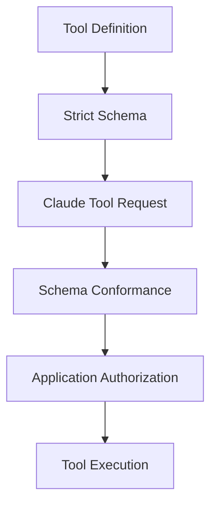

### Important Distinction

Schema conformance is not business correctness.

A tool call can match schema and still be unsafe or unauthorized.

Example:

```json
{
  "amount": 5000,
  "customer_id": "C123",
  "reason": "Customer asked"
}
```

The schema may be valid. Business policy may still require denial or approval.

---

## 14. Tool Choice and Trigger Boundaries

Claude can decide whether to call a tool automatically, or the application can constrain tool choice.

### Tool Choice Strategies

| Strategy | Use Case |
|---|---|
| auto | allow Claude to decide |
| none | force no tool use |
| any | require some tool use |
| specific tool | require a particular tool |
| system prompt guidance | steer behavior semantically |

### Guidance

Use tool choice controls when:

- a workflow requires lookup before answer
- tool calls are required for compliance
- direct response is unsafe
- deterministic routing already selected a tool
- cost needs to be controlled

Avoid giving Claude too many tools at once. Tool overload increases confusion and cost.

---

## 15. Parallel Tool Use

Claude may support parallel tool use patterns depending on model and API capabilities.

Parallel tool use can reduce latency when independent lookups are required.

### Pattern

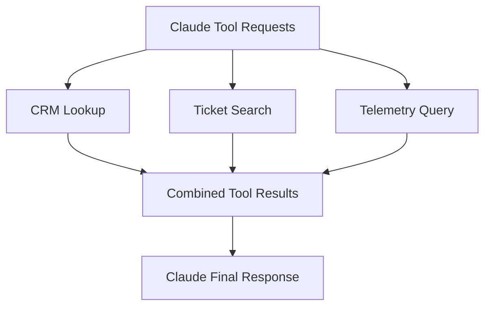

### Use Cases

- account brief
- incident investigation
- executive intelligence
- customer 360 summary
- sales preparation

### Risks

- higher tool cost
- more complex error handling
- inconsistent results
- harder tracing
- too much context returned

---

## 16. Claude with MCP

Chapter 10 introduced MCP as a standardized integration boundary.

Claude can connect to MCP servers through supported platform features or through an application-managed MCP client.

### MCP Pattern

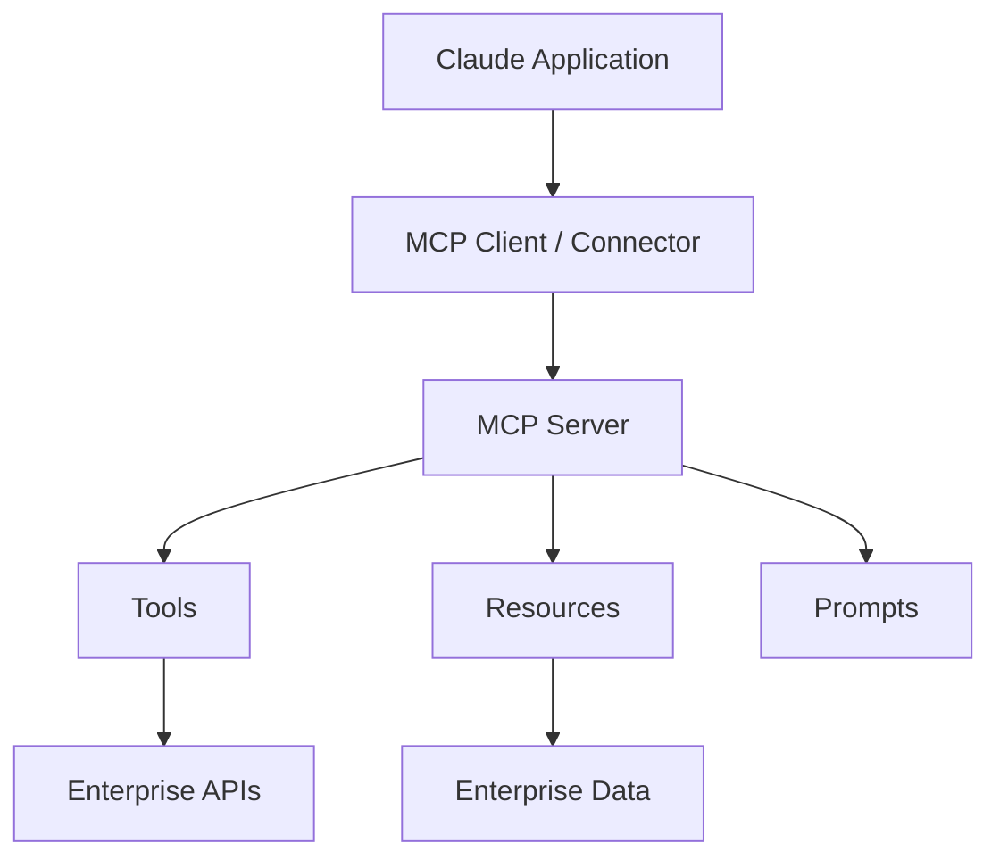

### Enterprise Uses

- GitHub integration
- Jira integration
- internal knowledge systems
- CRM tools
- telemetry tools
- document repositories
- approval workflows
- codebase tools

### Guidance

MCP improves standardization, but MCP servers still require:

- authorization
- audit
- tool risk tiers
- input validation
- output filtering
- prompt injection defenses
- server registry
- monitoring

---

## 17. Claude with LangGraph

LangGraph can orchestrate Claude inside explicit graph workflows.

### Pattern

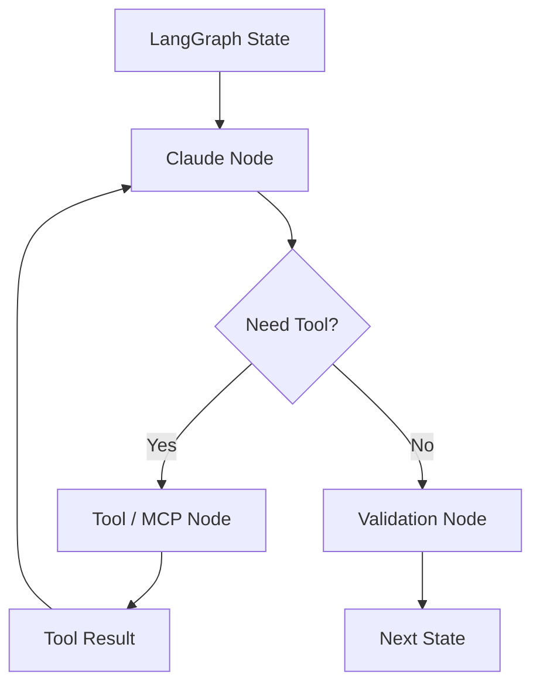

### Use Cases

- planner-executor workflows
- supervisor-worker systems
- human approval workflows
- retrieval loops
- event-driven agents
- traceable incident workflows

### Guidance

Use LangGraph when the workflow requires explicit state, branching, loops, checkpoints, or human approvals beyond a simple model/tool loop.

---

## 18. Claude on Amazon Bedrock

Claude can be accessed through Amazon Bedrock for AWS-native enterprise architectures.

### Bedrock Pattern

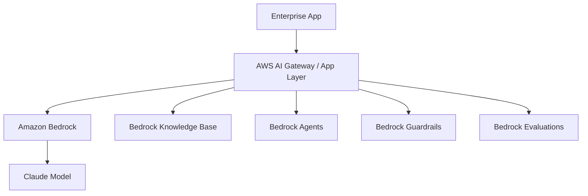

### Benefits

- AWS IAM integration
- AWS procurement and billing
- VPC and AWS security patterns where applicable
- Bedrock Knowledge Bases
- Bedrock Agents
- Bedrock Guardrails
- Bedrock evaluations
- cloud operations alignment

### Tradeoffs

- feature availability may differ from direct API
- provider-specific details may be abstracted
- Bedrock API patterns differ from direct Anthropic Messages API
- newest features may not appear everywhere at the same time

### Guidance

Use Bedrock when AWS governance and platform integration matter more than direct API feature immediacy.

---

## 19. Prompt Caching

Prompt caching can reduce latency and cost when large prompt prefixes are reused.

Common cacheable content:

- long system prompts
- tool definitions
- long documents
- large codebase context
- policy manuals
- repeated RAG context
- few-shot examples

### Prompt Caching Pattern

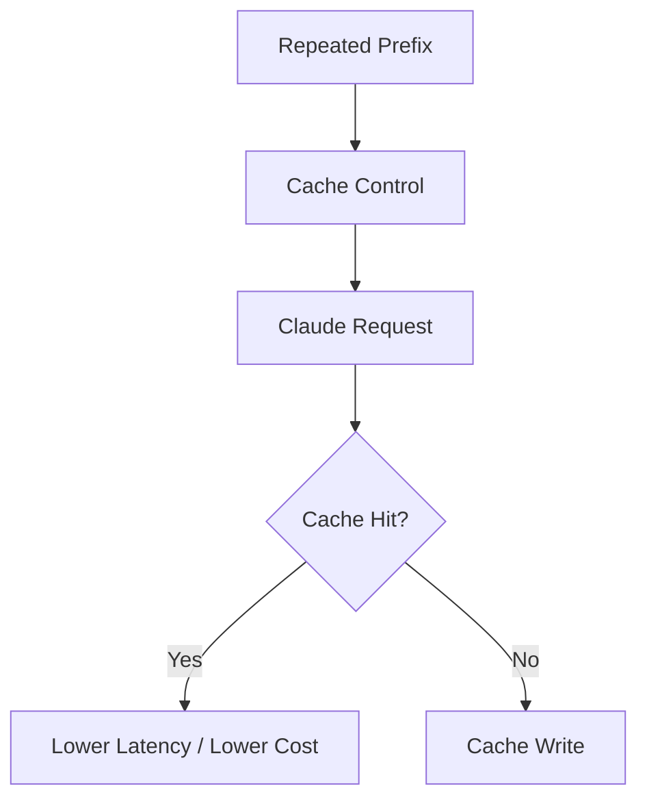

### Use Cases

- coding assistant with repeated repository context
- legal assistant reviewing many questions over same contract
- support assistant with large policy package
- agent with large tool schema set
- RAG workflow with repeated document set

### Risks

- caching sensitive content without policy review
- caching stale context
- assuming cache hits in cost model
- cache invalidation confusion
- using caching where context changes every request

### Principle

> Cache stable, reusable context. Do not cache secrets or stale assumptions.

### Python: Prompt Caching with cache_control

Prompt caching is activated by adding `cache_control: {"type": "ephemeral"}` to content blocks you want cached. Anthropic caches the prefix up to and including each marked block.

```python
import anthropic

client = anthropic.Anthropic()

# Large stable policy document loaded once — could be 50K-100K+ tokens
POLICY_MANUAL = """
[Full Refund and Returns Policy — 95 pages of policy text]
...
""" * 50  # Simulating a large document

SYSTEM_PROMPT = (
    "You are a policy assistant. Answer questions using only the provided "
    "policy manual. Cite relevant sections."
)

def ask_policy_question(question: str,
                         model: str = "claude-sonnet-4-6") -> dict:
    """
    Ask a policy question. The large policy manual is cached after the first call —
    subsequent calls hit the cache and pay only cache_read_input_tokens.
    """
    response = client.messages.create(
        model=model,
        max_tokens=600,
        system=SYSTEM_PROMPT,
        messages=[
            {
                "role": "user",
                "content": [
                    {
                        "type": "text",
                        "text": POLICY_MANUAL,
                        # Mark this large block for caching
                        "cache_control": {"type": "ephemeral"}
                    },
                    {
                        "type": "text",
                        "text": f"Question: {question}"
                        # Do NOT cache the question — it changes every request
                    }
                ]
            }
        ]
    )

    usage = response.usage
    cache_read = getattr(usage, "cache_read_input_tokens", 0)
    cache_write = getattr(usage, "cache_creation_input_tokens", 0)
    regular_input = usage.input_tokens - cache_read - cache_write

    return {
        "answer": response.content[0].text,
        "usage": {
            "cache_write_tokens": cache_write,   # Paid at ~25% higher rate on first call
            "cache_read_tokens": cache_read,     # Paid at ~10% of normal input rate
            "uncached_input_tokens": regular_input,
            "output_tokens": usage.output_tokens
        },
        "cache_hit": cache_read > 0
    }

# First call: policy manual is written to cache (cache_creation_input_tokens > 0)
# Subsequent calls: policy manual is read from cache (cache_read_input_tokens > 0)
# Cache lifetime: ~5 minutes of inactivity resets the cache

# Key Engineering Notes:
# - cache_control: {"type": "ephemeral"} marks the PREFIX up to that block for caching
# - Only the system prompt and the first user message are cacheable; place large stable
#   content early in the message to maximize cache coverage
# - Tool definitions are also cacheable — place them before cache_control marks
# - Monitor cache_read_input_tokens vs cache_creation_input_tokens in production logs
# - Cache savings compound at high query volume: 90% cost reduction on the cached prefix
# - Stale policy documents in cache can cause wrong answers — align cache TTL with
#   document update frequency; re-warm cache after document updates
```

---

## 20. Extended Thinking

Extended thinking allows Claude to allocate additional reasoning effort for complex tasks where deeper reasoning is useful.

### Use Cases

- architecture review
- multi-step planning
- complex code debugging
- policy reasoning
- contract comparison
- incident root-cause analysis
- financial or operational tradeoff analysis
- agent planning

### Pattern

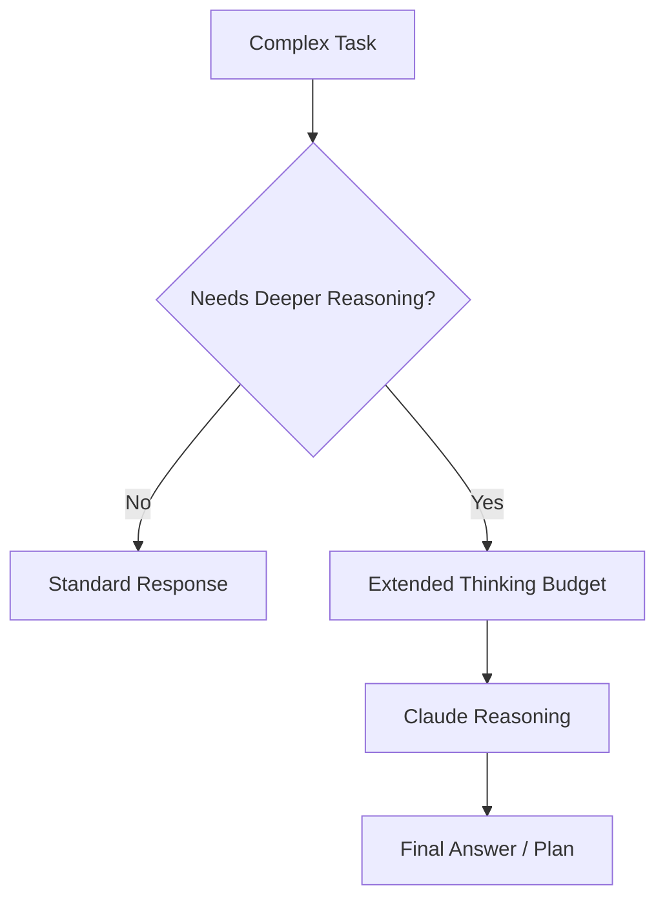

### Enterprise Guidance

Use deeper reasoning selectively.

It may improve quality for complex tasks, but it can increase latency and cost. Evaluate it against a golden dataset before enabling broadly.

### Principle

> Reasoning budget is an architecture decision.

### Python: Extended Thinking

```python
import anthropic

client = anthropic.Anthropic()

def architecture_review_with_thinking(
    proposal: str,
    budget_tokens: int = 8000,
    model: str = "claude-sonnet-4-6"
) -> dict:
    """
    Use extended thinking for complex architecture analysis.
    budget_tokens controls how much internal reasoning Claude can use.
    Higher budgets may improve quality on complex problems — but increase cost and latency.
    Evaluate on your golden dataset before setting production budgets.
    """
    response = client.messages.create(
        model=model,
        max_tokens=budget_tokens + 2000,  # max_tokens must exceed budget_tokens
        thinking={
            "type": "enabled",
            "budget_tokens": budget_tokens
        },
        system=(
            "You are a senior AI architect. Review architecture proposals critically. "
            "Identify risks, gaps, and improvements. Be specific and actionable."
        ),
        messages=[{
            "role": "user",
            "content": f"Review this architecture proposal:\n\n{proposal}"
        }]
    )

    thinking_text = ""
    answer_text = ""
    thinking_tokens_used = 0

    for block in response.content:
        if block.type == "thinking":
            thinking_text = block.thinking          # Internal reasoning trace
            thinking_tokens_used = len(thinking_text.split())  # Approximate
        elif block.type == "text":
            answer_text = block.text

    return {
        "review": answer_text,
        "thinking_available": bool(thinking_text),
        "output_tokens": response.usage.output_tokens,
        "input_tokens": response.usage.input_tokens,
        # Note: thinking tokens contribute to output_tokens billing
    }

# When to use extended thinking vs standard:
# - Standard: support drafts, policy Q&A, classification, extraction, short reasoning
# - Extended thinking: multi-step architecture analysis, complex code debugging,
#   contract comparison across many documents, strategic tradeoff analysis
#
# Budget guidance:
# - 1,024 tokens: minimal thinking, modest improvement for moderately complex tasks
# - 8,000 tokens: meaningful improvement for architecture and planning problems
# - 16,000+ tokens: reserved for the most complex multi-step reasoning
# - Measure improvement against your golden dataset before committing budget in production
```

---

## 21. Streaming

Streaming improves perceived latency by returning output incrementally.

### Pattern

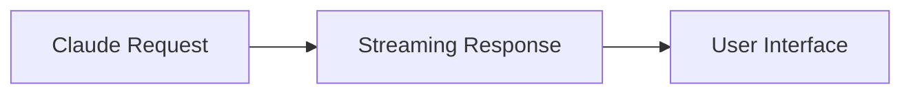

### Use Cases

- chat applications
- long answers
- coding assistants
- executive briefing drafts
- support response drafting

### Risks

- partial unsafe output
- harder validation before display
- complex UX
- complex tracing
- harder moderation

### Guidance

Use streaming for interactive low-risk experiences. For high-risk workflows, validate before final release.

---

## 22. Batch Processing

Batch processing is useful when latency is less important than throughput and cost efficiency.

### Use Cases

- document summarization
- nightly analysis
- evaluation jobs
- classification at scale
- batch extraction
- transcript processing
- knowledge base metadata generation

### Pattern

```mermaid
flowchart TD
    A[Batch Dataset] --> B[Batch Job]
    B --> C[Claude Processing]
    C --> D[Results]
    D --> E[Validation / QA]
```

### Guidance

Batch workflows still need evaluation, error handling, retry, privacy review, and cost tracking.

---

## 23. Claude for Coding and Software Engineering

Claude can support:

- code explanation
- code generation
- refactoring
- migration planning
- test creation
- bug analysis
- architecture review
- codebase Q&A
- documentation
- pull request review

### Coding Architecture

```mermaid
flowchart TD
    A[Developer] --> B[Claude Coding Assistant]
    B --> C[Repository Context]
    B --> D[Tool Use]
    D --> E[Git / Build / Test Tools]
    B --> F[Proposed Change]
    F --> G[Human Review / CI]
```

### Enterprise Controls

- repository permission enforcement
- no direct merge without review
- test execution
- secret scanning
- code ownership
- audit logs
- secure MCP servers
- CI/CD gates

### Principle

> Claude can accelerate engineering. CI, code review, security scanning, and ownership still decide what ships.

---

## 24. Claude for Customer Support

Claude can help with:

- case summarization
- draft responses
- policy Q&A
- sentiment analysis
- escalation detection
- knowledge article suggestions
- next-best-action recommendations

### Support Pattern

```mermaid
flowchart TD
    C[Customer Case] --> A[Support AI App]
    A --> R[Policy / KB Retrieval]
    R --> CL[Claude]
    CL --> V[Validation / Citations]
    V --> H{High Risk?}
    H -->|Yes| M[Manager Review]
    H -->|No| D[Draft Response]
```

### Controls

- citations required for policy claims
- PII masking where appropriate
- no unauthorized refunds
- no legal commitments
- human approval for high-risk cases
- draft acceptance tracking

---

## 25. Claude for Executive Intelligence

Claude can synthesize complex information into executive-ready briefs.

### Pattern

```mermaid
flowchart TD
    Q[Executive Question] --> C[Context Collection]
    C --> D[Documents / Metrics / Incidents / Customer Signals]
    D --> CL[Claude]
    CL --> R[Executive Brief]
    R --> V[Evidence Review]
    V --> E[Decision Support]
```

### Output Structure

- situation
- key facts
- risks
- options
- recommendation
- assumptions
- open questions
- sources

### Evaluation

- decision clarity
- factual accuracy
- source support
- executive usefulness
- actionability
- concision

---

## 26. Claude for Device Operations

For Pratik's enterprise device management context, Claude can support device operations workflows.

### Pattern

```mermaid
flowchart TD
    A[Heartbeat / Telemetry Alert] --> O[Operations Orchestrator]
    O --> T[Telemetry Tool]
    O --> R[Runbook Retrieval]
    O --> H[Incident History]
    T --> CL[Claude Analysis]
    R --> CL
    H --> CL
    CL --> V[Validation]
    V --> AP{Production Action?}
    AP -->|Yes| HR[Human Approval]
    AP -->|No| N[Ops Recommendation]
```

### Use Cases

- incident summarization
- likely cause analysis
- runbook-guided troubleshooting
- customer impact summary
- revenue risk explanation
- executive incident brief
- postmortem draft

### Controls

- production changes require approval
- customer communications require review
- telemetry tools are read-only by default
- citations to runbooks/incidents are required
- cost per investigation is tracked

---

## 27. Claude Evaluation

Claude workflows should be evaluated using the Chapter 15 evaluation system.

### Evaluation Layers

```mermaid
flowchart TD
    A[Claude Workflow] --> B[Model Output Evaluation]
    A --> C[RAG Evaluation]
    A --> D[Tool Use Evaluation]
    A --> E[Structured Output Validation]
    A --> F[Safety / Refusal Evaluation]
    A --> G[Business KPI Evaluation]
```

### Metrics

- correctness
- groundedness
- instruction following
- tool-call accuracy
- schema validity
- citation support
- refusal correctness
- latency
- cost
- user acceptance
- business outcome

### Guidance

Evaluate Claude as part of the full workflow. Do not evaluate model output in isolation when tools, RAG, or agents are involved.

---

## 28. Claude Observability

Track:

- model
- API route
- prompt version
- system prompt version
- user/application ID
- input token count
- output token count
- cache reads/writes
- thinking budget if used
- tool definitions
- tool calls
- tool results
- citations
- structured output validation
- latency
- cost
- safety interventions
- final outcome
- evaluation score

### Observability Pattern

```mermaid
flowchart TD
    A[Claude Request] --> B[Trace Store]
    B --> C[Prompt Metrics]
    B --> D[Token / Cost Metrics]
    B --> E[Tool Trace]
    B --> F[Citation Trace]
    B --> G[Evaluation Scores]
    B --> H[Dashboards]
```

---

## 29. Cost and Latency Architecture

Claude cost and latency depend on:

- model choice
- input tokens
- output tokens
- long context
- tool schemas
- tool loops
- prompt caching
- citations
- structured output constraints
- extended thinking
- retries
- streaming
- batch vs real-time

### Cost Control Levers

- model routing
- smaller/faster model for simple tasks
- prompt caching
- context pruning
- retrieval before long-context
- tool schema minimization
- output limits
- batching
- result caching
- evaluation-based routing

### Cost Formula

```text
Cost per Successful Claude Workflow =
(input tokens + output tokens + cache writes/reads + tool overhead + thinking budget + retries + evaluation + operations)
/ successful workflow completions
```

### Principle

> The cheapest Claude architecture is not the one with the lowest token cost. It is the one with the lowest cost per successful workflow.

---

## 30. Security and Governance

Claude architecture must address:

- data classification
- identity and access
- prompt injection
- tool authorization
- MCP server trust
- sensitive data handling
- citation source access
- output validation
- logging privacy
- vendor terms
- human approval
- incident response

### Security Pattern

```mermaid
flowchart TD
    A[User Request] --> B[Identity Context]
    B --> C[Data Classification]
    C --> D[Prompt / Context Builder]
    D --> E[Claude]
    E --> F[Validation / Safety]
    F --> G{Tool or Action?}
    G -->|Yes| H[Authorization + Approval]
    G -->|No| I[Response]
    H --> J[Audit Log]
    I --> J
```

### Governance Questions

- Which Claude models are approved?
- Which access pattern is approved?
- Which data classes are allowed?
- What tools can Claude request?
- Which MCP servers are trusted?
- What prompts are approved?
- What output requires human review?
- How are evaluation results used?
- How are costs allocated?
- How do we roll back behavior?

---

## 31. Failure Modes

### Failure Mode 1: Direct Model Sprawl

Every team calls Claude differently.

Mitigation:

- enterprise AI gateway
- approved prompt/model registry
- common observability
- cost allocation

### Failure Mode 2: Tool Overexposure

Too many tools are available at once.

Mitigation:

- router pattern
- scoped tools
- MCP registry
- tool risk tiers

### Failure Mode 3: Context Dumping

Teams send huge context without selection.

Mitigation:

- context planner
- RAG
- summaries
- caching
- evaluation

### Failure Mode 4: Citation Overtrust

Users assume citation presence means answer is correct.

Mitigation:

- citation validation
- source governance
- answer evaluation

### Failure Mode 5: Prompt Injection

Untrusted documents or tool outputs influence behavior.

Mitigation:

- context isolation
- instruction hierarchy
- tool authorization
- guardrails
- red-team tests

### Failure Mode 6: Cost Explosion

Long context, tool loops, and extended thinking increase cost.

Mitigation:

- budgets
- routing
- caching
- observability
- cost gates

---

## 32. Claude Enterprise Reference Architecture

```mermaid
flowchart TD
    U[Users / Applications] --> APP[Application Layer]
    APP --> GW[Enterprise AI Gateway]

    GW --> PR[Prompt Registry]
    GW --> MR[Model Router]
    GW --> CP[Context Planner]
    GW --> POL[Policy Engine]
    GW --> OBS[Observability]
    GW --> EV[Evaluation Service]

    CP --> RAG[RAG / Knowledge Layer]
    GW --> CL[Claude Model Layer]
    GW --> MCP[MCP Client / Tool Gateway]

    MCP --> TOOLS[Enterprise Tools / APIs]
    RAG --> DOCS[Enterprise Knowledge]
    CL --> VAL[Output Validation]
    VAL --> HR{Human Approval?}
    HR -->|Yes| APPROVE[Approval Workflow]
    HR -->|No| RESP[Response]
```

---

## 33. Capstone Claude Architecture

The Enterprise Agentic Operations Platform can use Claude as the reasoning and synthesis model for incident analysis, executive summaries, and operations decision support.

### Capstone Pattern

```mermaid
flowchart TD
    U[Operations User] --> LG[LangGraph Runtime]
    LG --> CL[Claude Model Node]
    LG --> RAG[Operations Knowledge Retrieval]
    LG --> MCP[MCP Tool Layer]
    MCP --> TEL[Telemetry]
    MCP --> CRM[Customer Impact]
    MCP --> FIN[Revenue Risk]
    RAG --> RUN[Runbooks / Firmware Notes / Incidents]
    CL --> OUT[Recommendation / Executive Brief]
    OUT --> EVAL[Evaluation]
    OUT --> APPROVAL{High-Impact Action?}
    APPROVAL -->|Yes| HUMAN[Human Approval]
    APPROVAL -->|No| RESP[Ops Response]
```

### Claude Responsibilities

- interpret incident context
- synthesize runbook evidence
- reason over telemetry observations
- draft executive summaries
- compare options
- identify assumptions
- produce structured recommendations

### Non-Claude Responsibilities

- telemetry authorization
- production action approval
- customer communication approval
- source permissions
- cost tracking
- evaluation gates
- incident workflow execution

---

## 34. Production Readiness Checklist

Before launching a Claude workflow:

- [ ] business workflow defined
- [ ] Claude access pattern selected
- [ ] approved model selected
- [ ] system prompt versioned
- [ ] context design reviewed
- [ ] tool schemas reviewed
- [ ] MCP servers approved if used
- [ ] RAG retrieval evaluated if used
- [ ] citations validated if used
- [ ] structured output schema tested if used
- [ ] prompt caching reviewed if used
- [ ] extended thinking evaluated if used
- [ ] guardrails/safety controls defined
- [ ] human approval boundaries defined
- [ ] observability dashboard created
- [ ] cost model created
- [ ] golden dataset evaluation passed
- [ ] security review completed
- [ ] rollback plan defined

---

## 35. Architecture Review Scenario

### Scenario

A team wants to build an enterprise operations assistant using Claude. Their plan is to send all telemetry summaries, all runbooks, all incident history, all customer data, and all available tools directly to Claude in every request.

### Review Finding

This is not production-ready.

### Problems

- too much context
- unclear permission model
- high cost
- no context selection
- too many tools
- no tool risk tiers
- no approval gates
- no citation validation
- no evaluation
- no cost dashboard
- no rollback plan

### Improved Design

```mermaid
flowchart TD
    A[Operations Request] --> B[Intent / Risk Router]
    B --> C[Context Planner]
    C --> D[Retrieve Relevant Evidence]
    C --> E[Select Minimal Tools]
    D --> F[Claude]
    E --> F
    F --> G[Structured Output + Citations]
    G --> H[Validation]
    H --> I{High Risk?}
    I -->|Yes| J[Human Approval]
    I -->|No| K[Response]
```

### Recommendation

Use Claude as the reasoning layer, not as an uncontrolled context sink. Select context, scope tools, validate output, and require approval for high-impact actions.

---

## 36. Lessons from the Field

### Production Context

The following patterns come from designing, building, and operating Claude-based systems in a production enterprise environment managing connected device infrastructure across dozens of countries under PCI-DSS, SOC 2, and GDPR compliance regimes.

**SupportIQ** uses Claude as the synthesis layer in a RAG workflow that reduced average handle time from 30 minutes to under 5 minutes for Level 2/3 support cases. The model receives retrieved policy and runbook context, telemetry summaries, and the case description. It never has direct access to production systems — all tool calls go through an authorized MCP layer.

**TriageIQ** uses Claude for ticket classification, root cause hypothesis generation, and fix proposal drafting in the L4 HITL workflow. The SLA improvement from 5 days to 5 hours came from replacing manual inter-team triage with a Claude-orchestrated classify → propose → test → approve loop, not from giving Claude more autonomy.

**DeviceIQ** uses Claude for incident summarization in the operations dashboard — synthesizing telemetry signals, firmware history, and customer impact into a structured executive brief that previously took 45 minutes to compile manually.

What these three systems have in common: Claude is the synthesis and reasoning layer. Every write action and every customer-impacting output requires human approval. The value comes from Claude reducing the time between "alert fires" and "human has enough context to decide."

### What Worked

- **RAG before long context**: every production system retrieves the specific evidence Claude needs rather than dumping all available context. This controlled cost and improved answer quality simultaneously.
- **Prompt caching for stable runbook context**: in SupportIQ, the core policy and runbook set is stable across sessions. Caching this prefix reduced per-request cost by ~60% on repeated sessions.
- **Schema validation on every structured output**: tool parameters, incident classifications, and executive brief fields all have JSON Schema validation downstream of the model. Invalid schema → the request fails cleanly rather than silently propagating a bad value.
- **Citations for policy-grounded answers**: requiring citations in SupportIQ created a natural audit trail. When answers were wrong, citations made it immediately clear whether the failure was retrieval (wrong source) or generation (model misread the right source).
- **Human approval as architectural primitive**: every system that creates production side effects — incident updates, firmware recommendations, ticket escalations — has a deterministic approval gate. Claude generates the recommendation. A human approves the action. This boundary never moved.

### What Did Not Work

- **Direct model calls from product teams**: early in the program, individual teams built their own Claude integrations. Each had different prompt versions, different models, no shared evaluation, no cost tracking. The result was prompt drift across teams and no visibility into system-wide quality.
- **Too many tools in one agent**: an early prototype gave Claude access to 14 tools simultaneously. Tool selection quality dropped, inference cost increased, and trace debugging became difficult. Narrowing to 4–6 task-relevant tools per workflow fixed all three.
- **Context dumping vs. retrieval**: the first SupportIQ prototype sent all active cases and all runbooks in every request. Token cost was 8× higher than the production version that retrieves relevant context. Quality did not improve — it degraded because irrelevant context diluted the relevant signal.
- **Prompts as security boundaries**: one team tried to use the system prompt to prevent Claude from discussing competitor pricing. Prompt injection through retrieved documents bypassed this. Authorization belongs in the tool layer and IAM, not in model instructions.

### Common Mistakes

- Treating Claude as a complete application.
- Sending every document instead of retrieving relevant context.
- Giving Claude broad write tools.
- Confusing schema validity with business validity.
- Overusing extended thinking for tasks that don't require it.
- Ignoring tool-token overhead in cost models.
- Not caching stable context at scale.
- Not testing citation quality against source documents.
- Not comparing access patterns (direct API vs. Bedrock vs. gateway).
- Not measuring cost per workflow.

### ROI Perspective

Claude creates ROI when it improves workflows enough to justify model, tool, context, and governance cost.


ROI drivers:

- faster document review
- better support drafts
- faster incident analysis
- improved engineering productivity
- reduced manual research
- better executive summaries
- higher task completion

Cost drivers:

- model usage
- long context
- tool schemas
- tool loops
- extended thinking
- prompt caching writes
- evaluation
- observability
- human review

The ROI question:

> Does Claude improve workflow quality, speed, or risk enough to justify the total operating cost?

### CTO Perspective

A CTO should ask:

- Why Claude for this workflow?
- Which access pattern are we using?
- Which model is approved?
- What data can be sent?
- What tools can Claude request?
- How do we authorize tools?
- How do we evaluate quality?
- What is the cost per successful workflow?
- What is the fallback model or workflow?
- How do we avoid direct model sprawl?
- What is our vendor strategy?

---

## 37. Pratik's Principles

### Principle 1: Claude Is a Model Layer, Not the Whole System

The enterprise system around Claude creates reliability and value.

### Principle 2: Context Is Architecture

More context is not always better. Useful context is better.

### Principle 3: Tool Access Defines Blast Radius

Every tool expands what the model can affect.

### Principle 4: Citations Create Trust Only When Sources Are Governed

A cited answer is only as trustworthy as the source and retrieval process.

### Principle 5: Structured Output Still Needs Business Validation

Valid JSON can still contain a bad decision.

### Principle 6: Reasoning Budget Is a Business Decision

Deeper reasoning should be used where it improves outcomes enough to justify cost and latency.

### Principle 7: Put Claude Behind Platform Controls

Use gateways, registries, policies, logs, and evaluation.

### Principle 8: Evaluate the Workflow

Claude should be judged by business workflow outcomes, not by impressive individual responses.

---

## 38. Hands-On Labs

### Lab 1: Claude Architecture Decision

Design access patterns for three use cases:

1. internal support assistant
2. coding assistant
3. executive incident brief

Compare direct API, Bedrock, and AI gateway.

Deliverable:

```text
labs/chapter-16-claude/claude-access-decision.md
```

---

### Lab 2: System Prompt Design

Write a production system prompt for a device operations assistant.

Include:

- role
- sources
- tool boundaries
- approval boundaries
- output format
- uncertainty behavior

Deliverable:

```text
claude-system-prompt.md
```

---

### Lab 3: Tool Schema Design

Design five Claude tools for an operations workflow.

Include:

- name
- description
- input schema
- risk tier
- authorization
- error behavior

Deliverable:

```text
claude-tool-schemas.json
```

---

### Lab 4: RAG + Citations Design

Design a RAG workflow with Claude citations for a policy assistant.

Include:

- source documents
- retrieval
- citation requirements
- validation
- evaluation

Deliverable:

```text
claude-rag-citations-design.md
```

---

### Lab 5: Prompt Caching Cost Model

Create a cost/latency analysis for prompt caching a large policy manual across repeated questions.

Deliverable:

```text
prompt-caching-cost-model.md
```

---

### Lab 6: Capstone Claude Node

Design the Claude node inside the Enterprise Agentic Operations Platform.

Include:

- context inputs
- tools
- structured output
- citations
- approval logic
- evaluation

Deliverable:

```text
capstone-claude-node.md
```

---

## 39. Interview Questions

### Engineering-Level Questions

1. What is Claude's Messages API mental model?
2. What is a system prompt?
3. What are content blocks?
4. How does Claude tool use work?
5. What is the difference between client tools and server tools?
6. What is strict tool use?
7. When would you use prompt caching?
8. When would you use citations?
9. What is extended thinking?
10. How do you validate structured outputs?

### Architect-Level Questions

1. Design Claude architecture for a support assistant.
2. How would you integrate Claude with RAG?
3. How would you integrate Claude with MCP?
4. How would you integrate Claude with LangGraph?
5. How would you run Claude through Amazon Bedrock?
6. How would you manage tool authorization?
7. How would you design observability for Claude workflows?
8. How would you reduce cost in long-context workflows?
9. How would you evaluate Claude tool use?
10. How would you avoid direct model sprawl?

### Director / VP / CTO-Level Questions

1. Why choose Claude for a workflow?
2. What is our Claude access strategy?
3. How do we govern prompts and tools?
4. What data classes can be sent to Claude?
5. What business metric proves value?
6. How do we manage vendor lock-in?
7. What is the cost per successful workflow?
8. How do we compare Claude with other models?
9. What workflows should not use Claude?
10. What would make you reject a Claude architecture?

---

## 40. Certification Mapping

### AWS AI / Generative AI Professional Preparation

This chapter supports topics related to:

- Claude on Amazon Bedrock
- model selection
- inference APIs
- prompt management
- guardrails
- knowledge bases
- agents
- evaluation
- cost and latency
- enterprise security and governance

### Anthropic Claude / MCP Architecture Preparation

This chapter directly supports topics related to:

- Messages API
- system prompts
- content blocks
- tool use
- client tools
- server tools
- strict tool use
- MCP connector
- citations
- structured outputs
- prompt caching
- extended thinking
- context management
- enterprise Claude architecture

### NVIDIA Generative AI Preparation

This chapter supports topics related to:

- managed model vs self-hosted model tradeoffs
- inference latency
- long-context cost
- throughput planning
- model routing
- cost-performance evaluation

---

## 41. Chapter Exercises

### Exercise 1

Design Claude architecture for a customer support assistant.

Include prompts, RAG, citations, tools, validation, evaluation, and human approval.

### Exercise 2

Create a tool risk matrix for a Claude-powered operations assistant.

Include read-only, write-capable, reversible, irreversible, and customer-impacting tools.

### Exercise 3

Compare direct Anthropic API, Claude on Bedrock, and Claude behind an enterprise AI gateway for a regulated financial services workflow.

### Exercise 4

Design a context strategy for a long contract review workflow.

Include long context, RAG, citations, prompt caching, and evaluation.

### Exercise 5

Create a Claude observability dashboard.

Include token usage, cache hits, tool calls, citations, validation errors, cost, latency, and business outcomes.

---

## 42. Key Terms

| Term | Meaning |
|---|---|
| Claude | Anthropic model family and platform capability |
| Messages API | Conversation-style API for Claude interactions |
| System prompt | Durable instruction controlling model behavior |
| Content block | Structured content item inside a message |
| Tool use | Claude requesting external function/tool execution |
| Client tool | Tool executed by the application |
| Server tool | Tool executed by Anthropic infrastructure |
| tool_use | Content block requesting a tool call |
| tool_result | Content block returning tool output |
| Strict tool use | Schema-constrained tool calling |
| MCP connector | Claude connection pattern for MCP servers |
| Citations | Source-grounded references in model output |
| Structured output | Schema-constrained model response |
| Prompt caching | Reuse of stable prompt context to reduce cost/latency |
| Extended thinking | Additional reasoning budget for complex tasks |
| AI gateway | Enterprise control plane for model usage |
| Context planner | Component that selects what context to send |
| Cost per successful workflow | Total cost divided by useful completed outcomes |

---

## 43. One-Page Executive Brief

Claude is a powerful model layer for enterprise AI workflows involving language, reasoning, document understanding, tool use, and synthesis.

But Claude should not be treated as a complete enterprise architecture by itself.

To use Claude safely and effectively, enterprises need:

- approved access pattern
- model selection
- prompt governance
- context design
- RAG and citations where needed
- tool authorization
- MCP server governance
- structured output validation
- prompt caching strategy
- evaluation
- observability
- cost controls
- human approval for high-impact actions

Claude can create value in support, engineering, operations, executive intelligence, policy assistance, field service, and document-heavy workflows. The value comes from improving measurable workflows, not from the model alone.

Executives should ask:

- Why Claude for this workflow?
- Which data can be sent?
- What tools can it request?
- How are tools authorized?
- How do we evaluate quality?
- What is the cost per successful workflow?
- What is the fallback strategy?
- How do we prevent uncontrolled model sprawl?

The executive takeaway:

> Claude is strongest when used as a governed reasoning and language layer inside an enterprise AI platform.

---

## 44. References

- Claude Messages API: https://docs.anthropic.com/en/api/messages
- Claude tool use overview: https://docs.anthropic.com/en/docs/agents-and-tools/tool-use/overview
- Claude citations: https://docs.anthropic.com/en/docs/build-with-claude/citations
- Claude prompt caching: https://docs.anthropic.com/en/docs/build-with-claude/prompt-caching
- Claude extended thinking: https://docs.anthropic.com/en/docs/build-with-claude/extended-thinking
- Claude MCP documentation: https://docs.anthropic.com/en/docs/agents-and-tools/mcp

---

## 45. Chapter Summary

In this chapter, we explored Claude Architecture as an enterprise model-layer design problem.

We covered Claude's role in enterprise AI architecture, access patterns, Messages API mental model, instruction hierarchy, system prompts, content blocks, context design, long-context patterns, RAG, citations, structured outputs, tool use, tool schemas, strict tool use, tool choice, parallel tool use, MCP integration, LangGraph integration, Claude on Bedrock, prompt caching, extended thinking, streaming, batch processing, coding workflows, customer support, executive intelligence, device operations, evaluation, observability, cost architecture, security and governance, failure modes, reference architecture, capstone design, production readiness, architecture review, lessons from the field, Pratik's Principles, labs, interview questions, certification mapping, and executive guidance.

The key lesson is:

> Claude creates enterprise value when its capabilities are governed by context discipline, tool boundaries, evaluation, and workflow ownership.

In Chapter 17, we will explore NVIDIA AI Infrastructure and the performance, serving, and optimization layer for enterprises that need control over inference cost, latency, throughput, and data placement.

---

## 46. Suggested Git Commit

```bash
mkdir -p chapters
cp 16-claude-architecture-reworked.md chapters/16-claude-architecture.md
cp BOOK_STATE-updated-through-chapter-16.md BOOK_STATE.md

git add chapters/16-claude-architecture.md BOOK_STATE.md
git commit -m "Add Chapter 16: Claude Architecture"
git push origin main
```
