# Chapter 17 — NVIDIA AI Infrastructure

**Book:** The AI Architect & Practitioner Bootcamp  
**Chapter Status:** Complete Draft  
**Version:** 0.1 — Deep Dive  
**Author:** Pratik Desai  
**Primary Audience:** AI architects, platform engineers, ML engineers, cloud architects, infrastructure architects, SREs, GPU platform teams, FinOps leaders, engineering leaders, consultants, directors, VPs, CTO-track practitioners, and certification candidates

---

## Chapter Thesis

NVIDIA AI infrastructure is the performance, serving, and optimization layer for enterprises that need control over inference cost, latency, throughput, and data placement.

Managed model platforms such as Amazon Bedrock and direct model APIs such as Claude are excellent when the business wants speed, managed operations, and low infrastructure ownership.

NVIDIA infrastructure becomes important when the enterprise needs deeper control over:

- model serving
- GPU utilization
- latency
- throughput
- batching
- quantization
- long-context serving
- KV cache behavior
- streaming
- multimodal serving
- data placement
- private deployment
- edge deployment
- cost per token
- cost per successful workflow

The key enterprise idea is:

> AI infrastructure is not only hardware. It is the operating system for production inference economics.

A weak architecture buys GPUs and hopes utilization appears.

A strong architecture designs the full serving stack:

- workload characterization
- model selection
- GPU sizing
- container/runtime selection
- NIM or Triton serving
- TensorRT-LLM optimization
- batching strategy
- streaming strategy
- multi-tenancy
- observability
- cost attribution
- evaluation gates
- security controls
- deployment automation
- rollback
- SLOs

NVIDIA AI infrastructure is not automatically cheaper than managed APIs. It becomes valuable when the enterprise has enough scale, control requirements, data constraints, or performance needs to justify operating the stack.

---

## Learning Objectives

By the end of this chapter, you will be able to:

- Explain when enterprise teams should consider NVIDIA AI infrastructure instead of only managed model APIs.
- Describe the difference between training, fine-tuning, embedding, reranking, and inference workloads.
- Explain GPU infrastructure concepts at an architect level: memory, compute, interconnect, batching, KV cache, quantization, and utilization.
- Describe where NVIDIA NIM, Triton Inference Server, TensorRT-LLM, and NVIDIA AI Enterprise fit.
- Design real-time, batch, streaming, RAG, agentic, and multimodal inference serving architectures.
- Implement Python scaffolding for OpenAI-compatible inference, streaming, load testing, and evaluation.
- Design configuration artifacts for model serving, Kubernetes deployment, autoscaling, monitoring, and cost allocation.
- Address multi-tenancy, component-level testing, streaming nuance, multimodal integration, and production-specific lessons.
- Compare Bedrock, Claude API, self-hosted open models, NIM, Triton, and TensorRT-LLM.
- Design an NVIDIA-backed infrastructure layer for the Enterprise Agentic Operations Platform capstone.

---

## Executive Summary

NVIDIA AI infrastructure is the stack enterprises use when they need to run AI workloads with direct control over performance, capacity, data placement, and cost.

The key components in this chapter include:

- NVIDIA GPUs and accelerated systems
- NVIDIA AI Enterprise as an enterprise software/support layer
- NVIDIA NIM microservices for deployable AI inference services
- NVIDIA Triton Inference Server for multi-framework inference serving
- TensorRT-LLM for optimized large language model inference
- Kubernetes/GPU Operator patterns
- dynamic batching, continuous batching, streaming, KV cache, quantization, speculative decoding, and observability
- multimodal model serving
- evaluation and benchmarking tooling
- multi-tenant serving controls

NVIDIA Triton Inference Server is an open-source inference serving system that supports multiple frameworks and protocols, real-time and batched inference, ensembles, audio/video streaming, HTTP/gRPC, metrics, tracing, dynamic batching, sequence batching, model repositories, and deployment across cloud, data center, edge, and embedded environments. TensorRT-LLM provides LLM-focused optimization and serving capabilities such as online serving, streaming generation, distributed generation, speculative decoding, KV cache features, quantization, parallelism, multimodal support, benchmarking, and telemetry.

For enterprise architecture, the question is not:

> Should we buy GPUs?

The better question is:

> Which workloads require infrastructure control, what SLOs must be met, and can we operate the serving platform at a lower cost and risk than managed alternatives?

The executive takeaway:

> NVIDIA infrastructure creates value when the enterprise can convert GPU capacity into reliable, observable, governed, cost-efficient AI workflows.

---

## Gap Closure Commitments for This Chapter

The previous platform chapters exposed several recurring gaps. This chapter intentionally addresses them as production infrastructure patterns.

| Gap Category | How Chapter 17 Addresses It |
|---|---|
| Python code absent | Includes Python clients, streaming clients, load tests, evaluator scaffolds, and benchmark harnesses |
| AWS capability surface incomplete | Provides comparison and integration patterns with Bedrock, SageMaker/EKS, and AWS-native operations |
| Configuration stays conceptual | Includes concrete YAML/JSON examples for serving config, Kubernetes, HPA, Prometheus, and model routing |
| Streaming nuance absent | Covers token streaming, backpressure, cancellation, partial validation, and UX safety |
| Multi-tenancy not designed | Provides tenant isolation, quotas, priority lanes, cost attribution, and fairness controls |
| Component-level testing missing | Adds component tests for server health, schema, streaming, batching, model output, and regression |
| Labs have no scaffolding | Each lab includes starter folders, files, commands, and deliverables |
| Field lessons lose production specificity | Adds concrete production lessons from capacity planning, incident response, utilization, and cost failures |
| Evaluation tooling absent | Includes GenAI Perf-style benchmarking concepts, pytest scaffolds, quality gates, and dashboards |
| Multimodal not integrated into platform chapters | Adds visual-language, document, audio/video, and edge inference architecture patterns |

---

## Business Motivation

Enterprises move toward NVIDIA AI infrastructure for several reasons.

### Reason 1: Cost at Scale

If a workload generates enough volume, self-hosted or privately hosted inference can be cheaper than per-token managed APIs.

But this is only true when GPU utilization is high and operations are mature.

Low utilization destroys the business case.

### Reason 2: Performance Control

Some workflows require:

- lower p95 latency
- higher throughput
- predictable capacity
- streaming responsiveness
- batch processing
- GPU affinity
- edge inference
- custom serving logic

### Reason 3: Data Placement

Some enterprises cannot send sensitive data to an external model API.

Examples:

- regulated financial data
- healthcare data
- defense or public sector data
- source code
- customer contracts
- operational telemetry
- proprietary manufacturing data

### Reason 4: Model Control

Self-hosted infrastructure supports:

- open-weight models
- fine-tuned models
- domain models
- multimodal models
- embedding models
- rerankers
- safety classifiers
- custom model pipelines

### Reason 5: Platform Strategy

An enterprise AI platform may need a portfolio:

- Bedrock for managed AWS model access
- Claude direct API for frontier language workflows
- NVIDIA infrastructure for private/high-throughput workloads
- AI gateway for routing across all of them

The goal is not one platform for everything. The goal is the right platform for each workload.

---

## The Five-Lens Framework for This Chapter

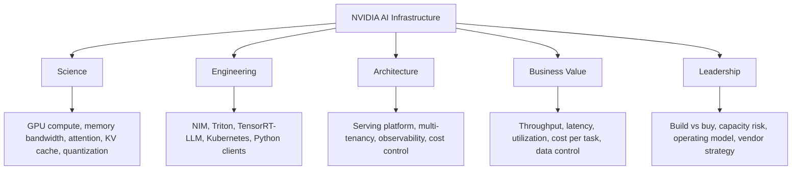
```mermaid
flowchart TD
    A[NVIDIA AI Infrastructure] --> S[Science]
    A --> E[Engineering]
    A --> R[Architecture]
    A --> B[Business Value]
    A --> L[Leadership]

    S --> S1[GPU compute, memory bandwidth, attention, KV cache, quantization]
    E --> E1[NIM, Triton, TensorRT-LLM, Kubernetes, Python clients]
    R --> R1[Serving platform, multi-tenancy, observability, cost control]
    B --> B1[Throughput, latency, utilization, cost per task, data control]
    L --> L1[Build vs buy, capacity risk, operating model, vendor strategy]
```

---

## 1. Where NVIDIA Infrastructure Fits

NVIDIA infrastructure fits below the AI application layer and model orchestration layer.

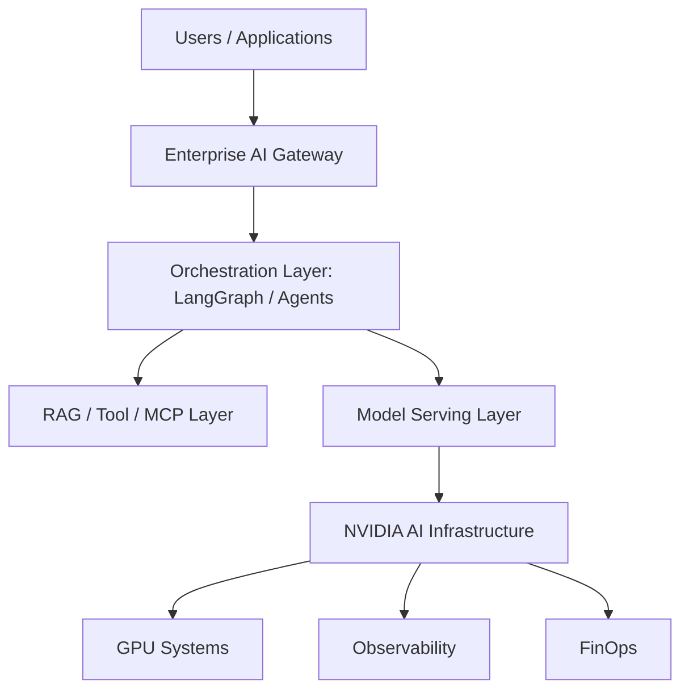
```mermaid
flowchart TD
    U[Users / Applications] --> G[Enterprise AI Gateway]
    G --> O[Orchestration Layer: LangGraph / Agents]
    O --> R[RAG / Tool / MCP Layer]
    O --> M[Model Serving Layer]
    M --> N[NVIDIA AI Infrastructure]
    N --> GPU[GPU Systems]
    N --> OBS[Observability]
    N --> COST[FinOps]
```

### It Is Not a Replacement For

NVIDIA infrastructure does not replace:

- prompt engineering
- RAG design
- agent orchestration
- evaluation
- governance
- guardrails
- business workflow ownership

It replaces or complements managed model serving.

---

## 2. Workload Types

Not all AI workloads behave the same.

| Workload | Infrastructure Need |
|---|---|
| real-time chat | low latency, streaming |
| support assistant | moderate latency, RAG, tool calls |
| batch summarization | throughput, queueing |
| embedding generation | high throughput, predictable cost |
| reranking | low-latency ranking model |
| agentic workflow | many small calls, variable latency |
| document extraction | multimodal/document handling |
| coding assistant | long context, streaming |
| edge inference | small model, local GPU/accelerator |
| fine-tuned private model | model hosting control |

### Workload Characterization Template

```yaml
workload_name: support_rag_assistant
traffic:
  average_rps: 20
  peak_rps: 120
  concurrency: 500
latency_slo:
  time_to_first_token_ms: 800
  p95_end_to_end_ms: 6000
model:
  type: llm
  size: 8b_or_70b
  context_window: 32000
features:
  streaming: true
  tool_use: true
  rag: true
  multimodal: false
risk:
  data_classification: confidential
  tenant_isolation: required
```

---

## 3. GPU Fundamentals for AI Architects

AI architects do not need to be CUDA kernel engineers, but they must understand the economics.

### Key Concepts

| Concept | Architect Meaning |
|---|---|
| GPU memory | limits model size, batch size, KV cache |
| memory bandwidth | affects token generation and long context |
| compute throughput | affects prefill and dense operations |
| interconnect | affects multi-GPU model parallelism |
| KV cache | stores attention state during generation |
| batch size | improves throughput but may increase latency |
| quantization | reduces memory and may improve throughput |
| tensor parallelism | splits model across GPUs |
| pipeline parallelism | splits layers across GPUs |
| streaming | returns tokens incrementally |
| utilization | decides economics |

### Inference Phases

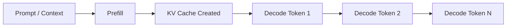
```mermaid
flowchart LR
    A[Prompt / Context] --> B[Prefill]
    B --> C[KV Cache Created]
    C --> D[Decode Token 1]
    D --> E[Decode Token 2]
    E --> F[Decode Token N]
```

### Prefill vs Decode

| Phase | What Happens | Bottleneck |
|---|---|---|
| prefill | process input context | compute and memory |
| decode | generate tokens one at a time | memory bandwidth / KV cache |
| streaming | output token events | network and UX |
| long context | large prompt and KV cache | GPU memory |

---

## 4. NIM, Triton, and TensorRT-LLM

### NVIDIA NGC — The Enterprise Model Catalog

**NVIDIA NGC** (NGC catalog at `nvcr.io`) is NVIDIA's registry for GPU-optimized software, including NIM containers, Triton backends, pre-trained models, model weights, and CUDA-accelerated tools.

Enterprise teams use NGC as the source for approved container images. Key points:

- NIM containers are pulled from `nvcr.io/nim/<provider>/<model>:<version>`
- Access requires an NGC API key (`NGC_API_KEY`) for authenticated image pulls
- Enterprises should mirror approved NGC images into a private container registry (ECR, Artifact Registry, Harbor) rather than pulling directly from NGC in production — for security scanning, image signing, and network policy compliance
- NGC also hosts model weights for open-weight models, saving teams from sourcing weights from multiple vendors

### NVIDIA AI Enterprise

**NVIDIA AI Enterprise** is NVIDIA's enterprise software subscription layer that provides:

- production-supported versions of Triton, NIM, TensorRT-LLM, RAPIDS, and other tools
- L-series enterprise support with defined SLAs
- vulnerability patching and security notifications
- validated configurations for major cloud and on-premises platforms
- licensing for GPU-accelerated AI frameworks

For enterprises building production AI infrastructure on NVIDIA hardware, NVIDIA AI Enterprise provides the support contract equivalent that managed cloud services include by default.

### NVIDIA NIM

NIM microservices package optimized AI models as deployable services with standard APIs. NIM is useful when teams want deployable model services without building every serving container from scratch. NIM containers are pulled from the NGC catalog, handle model download and initialization, and expose an OpenAI-compatible HTTP API ready for integration with enterprise gateways.

### Triton Inference Server

Triton is a general inference serving platform. It supports multiple frameworks, HTTP/gRPC protocols, model repositories, multiple schedulers and batching algorithms, model ensembles, metrics, tracing, and deployment patterns across cloud, data center, edge, and embedded environments.

### TensorRT-LLM

TensorRT-LLM focuses on optimized LLM inference. It includes capabilities for online serving, streaming, distributed generation, KV cache features, speculative decoding, quantization, parallelism, multimodal support, benchmarking, and telemetry.

### Positioning Diagram

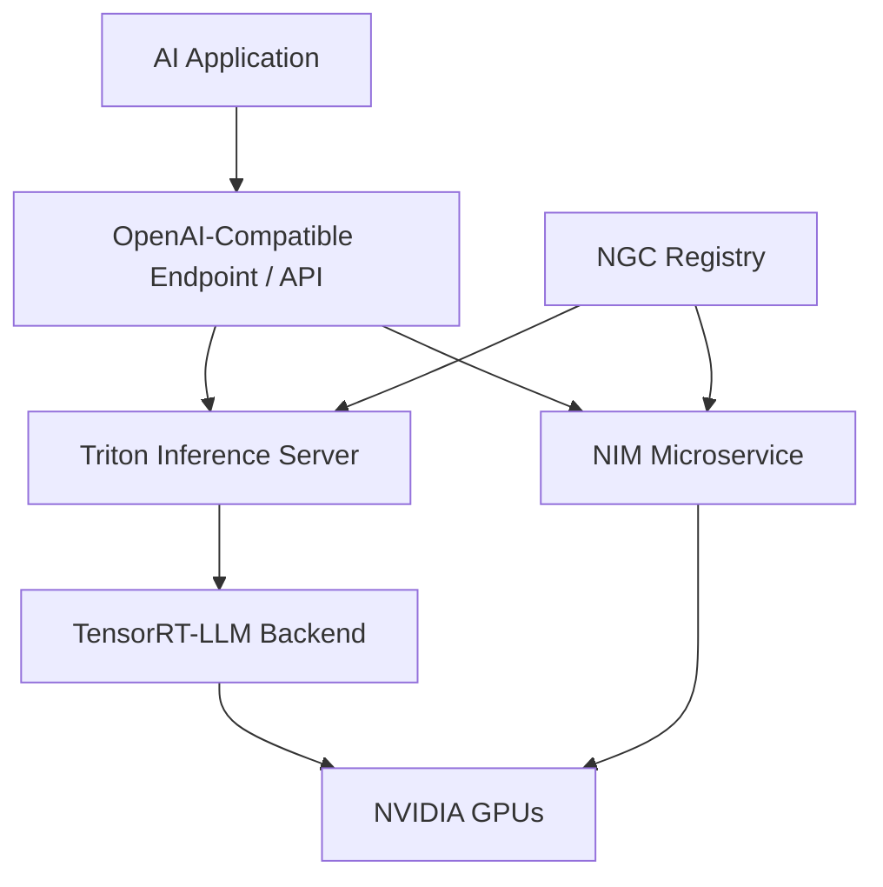
```mermaid
flowchart TD
    A[AI Application] --> B[OpenAI-Compatible Endpoint / API]
    B --> C[NIM Microservice]
    B --> D[Triton Inference Server]
    D --> E[TensorRT-LLM Backend]
    E --> F[NVIDIA GPUs]
    C --> F
    G[NGC Registry] --> C
    G --> D
```

### Decision Table

| Requirement | Strong Fit |
|---|---|
| deploy optimized model microservice quickly | NIM |
| serve many model frameworks | Triton |
| optimize LLM throughput/latency deeply | TensorRT-LLM |
| ensemble preprocessing + model + postprocessing | Triton |
| OpenAI-compatible LLM endpoint | NIM or TensorRT-LLM serving pattern |
| multimodal serving | Triton/TensorRT-LLM depending model |
| custom model pipeline | Triton ensemble or custom backend |

---

## 5. Reference Serving Architecture

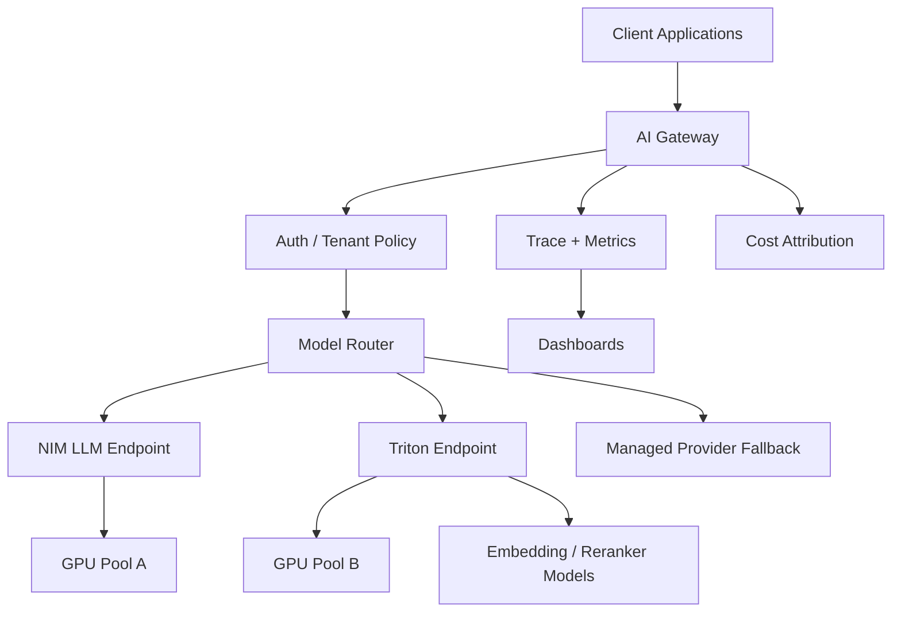
```mermaid
flowchart TD
    U[Client Applications] --> API[AI Gateway]
    API --> AUTH[Auth / Tenant Policy]
    AUTH --> ROUTE[Model Router]
    ROUTE --> NIM[NIM LLM Endpoint]
    ROUTE --> TRI[Triton Endpoint]
    ROUTE --> BED[Managed Provider Fallback]

    NIM --> GPU1[GPU Pool A]
    TRI --> GPU2[GPU Pool B]
    TRI --> EMB[Embedding / Reranker Models]

    API --> OBS[Trace + Metrics]
    API --> COST[Cost Attribution]
    OBS --> DASH[Dashboards]
```

### Key Pattern

Put NVIDIA model endpoints behind an AI gateway.

The AI gateway handles:

- tenant identity
- model routing
- authorization
- quotas
- cost attribution
- request metadata
- fallback
- observability
- evaluation sampling

---

## 6. Python Client for OpenAI-Compatible Inference

Many NVIDIA serving patterns expose OpenAI-compatible endpoints. Application teams should use an internal SDK wrapper so endpoint details can change without application rewrites.

### Starter File

```text
labs/chapter-17-nvidia-infra/openai_compatible_client/
  client.py
  requirements.txt
  README.md
```

### `requirements.txt`

```text
openai>=1.0.0
pydantic>=2.0.0
tenacity>=8.0.0
```

### `client.py`

```python
from __future__ import annotations

import os
from typing import Iterable, Optional

from openai import OpenAI
from pydantic import BaseModel
from tenacity import retry, stop_after_attempt, wait_exponential


class ChatRequest(BaseModel):
    model: str
    user_message: str
    system_prompt: str = "You are a concise enterprise AI assistant."
    temperature: float = 0.2
    max_tokens: int = 500
    tenant_id: Optional[str] = None
    workflow_id: Optional[str] = None


class ChatResponse(BaseModel):
    text: str
    model: str


def build_client() -> OpenAI:
    return OpenAI(
        base_url=os.environ["AI_BASE_URL"],
        api_key=os.environ.get("AI_API_KEY", "not-used-for-internal-dev"),
    )


@retry(stop=stop_after_attempt(3), wait=wait_exponential(multiplier=0.5, min=0.5, max=4))
def chat(req: ChatRequest) -> ChatResponse:
    client = build_client()

    response = client.chat.completions.create(
        model=req.model,
        messages=[
            {"role": "system", "content": req.system_prompt},
            {"role": "user", "content": req.user_message},
        ],
        temperature=req.temperature,
        max_tokens=req.max_tokens,
        extra_headers={
            "x-tenant-id": req.tenant_id or "unknown",
            "x-workflow-id": req.workflow_id or "manual",
        },
    )

    return ChatResponse(
        text=response.choices[0].message.content or "",
        model=req.model,
    )


if __name__ == "__main__":
    result = chat(
        ChatRequest(
            model=os.environ.get("AI_MODEL", "local-llm"),
            user_message="Explain p95 latency in one paragraph.",
            tenant_id="tenant-a",
            workflow_id="chapter-17-demo",
        )
    )
    print(result.text)
```

### Why This Matters

This closes the Python-code gap and introduces an enterprise wrapper pattern:

- retries
- tenant metadata
- workflow metadata
- standardized client
- endpoint abstraction
- later addition of logging/evaluation

---

## 7. Python Streaming Client

Streaming requires special care.

It is not only a UI feature. It affects validation, cancellation, logging, and safety.

### Streaming Starter

```text
labs/chapter-17-nvidia-infra/streaming_client/
  stream_client.py
  README.md
```

### `stream_client.py`

```python
from __future__ import annotations

import os
import signal
from openai import OpenAI


cancelled = False


def handle_cancel(signum, frame):
    global cancelled
    cancelled = True


signal.signal(signal.SIGINT, handle_cancel)


def stream_chat(prompt: str) -> None:
    client = OpenAI(
        base_url=os.environ["AI_BASE_URL"],
        api_key=os.environ.get("AI_API_KEY", "not-used"),
    )

    stream = client.chat.completions.create(
        model=os.environ.get("AI_MODEL", "local-llm"),
        messages=[
            {"role": "system", "content": "You are a helpful operations assistant."},
            {"role": "user", "content": prompt},
        ],
        temperature=0.2,
        max_tokens=700,
        stream=True,
        extra_headers={"x-workflow-id": "streaming-demo"},
    )

    buffer = []
    for event in stream:
        if cancelled:
            print("\n[client cancelled stream]")
            break

        delta = event.choices[0].delta.content
        if delta:
            buffer.append(delta)
            print(delta, end="", flush=True)

    final_text = "".join(buffer)
    print("\n\n--- final length:", len(final_text))


if __name__ == "__main__":
    stream_chat("Draft an incident summary for device heartbeat failures.")
```

### Streaming Nuance

Streaming adds risks:

- partial unsafe output may appear before validation
- user may cancel mid-generation
- logs may capture incomplete output
- network disconnects need cleanup
- backpressure must be handled
- server-side generation may continue unless cancellation propagates
- token-level safety is harder than final-output safety

### Enterprise Guidance

Use streaming for low-to-medium-risk drafting and interactive workflows. For regulated or high-impact workflows, generate internally, validate, then display the final response.

---

## 8. Concrete NIM-Style Deployment Pattern

A production team should treat model serving like any other platform service.

### Minimal Local Development Pattern

```bash
# Conceptual pattern. Replace image/model names with approved enterprise values.
docker run --rm --gpus all \
  -e NGC_API_KEY=$NGC_API_KEY \
  -p 8000:8000 \
  nvcr.io/nim/approved/model:version
```

### Kubernetes Skeleton

```yaml
apiVersion: apps/v1
kind: Deployment
metadata:
  name: nim-llm
  labels:
    app: nim-llm
    model: operations-llm
spec:
  replicas: 2
  selector:
    matchLabels:
      app: nim-llm
  template:
    metadata:
      labels:
        app: nim-llm
        tenant-class: shared
    spec:
      nodeSelector:
        nvidia.com/gpu.present: "true"
      containers:
        - name: nim
          image: nvcr.io/nim/approved/model:version
          ports:
            - containerPort: 8000
          resources:
            limits:
              nvidia.com/gpu: 1
              memory: "64Gi"
            requests:
              nvidia.com/gpu: 1
              memory: "64Gi"
          env:
            - name: NGC_API_KEY
              valueFrom:
                secretKeyRef:
                  name: ngc-secret
                  key: api-key
          readinessProbe:
            httpGet:
              path: /v1/models
              port: 8000
            initialDelaySeconds: 30
            periodSeconds: 10
```

### Service

```yaml
apiVersion: v1
kind: Service
metadata:
  name: nim-llm
spec:
  selector:
    app: nim-llm
  ports:
    - name: http
      port: 80
      targetPort: 8000
```

### Production Additions

- private registry approval
- image signing
- admission controls
- resource quotas
- GPU node pool isolation
- secrets rotation
- Prometheus scraping
- service mesh/mTLS
- request authorization at gateway
- canary deployments
- rollback strategy

---

## 9. Triton Model Repository

Triton uses a model repository pattern.

### Repository Example

```text
model_repository/
  sentiment_model/
    1/
      model.onnx
    config.pbtxt
  embedding_model/
    1/
      model.plan
    config.pbtxt
  reranker/
    1/
      model.pt
    config.pbtxt
```

### Example `config.pbtxt`

```protobuf
name: "embedding_model"
platform: "onnxruntime_onnx"
max_batch_size: 64

input [
  {
    name: "input_ids"
    data_type: TYPE_INT64
    dims: [ -1 ]
  }
]

output [
  {
    name: "embeddings"
    data_type: TYPE_FP32
    dims: [ 768 ]
  }
]

dynamic_batching {
  preferred_batch_size: [ 8, 16, 32, 64 ]
  max_queue_delay_microseconds: 2000
}

instance_group [
  {
    count: 2
    kind: KIND_GPU
  }
]
```

### Why This Matters

This closes the conceptual-configuration gap. Serving quality depends on concrete configuration:

- max batch size
- dynamic batching
- queue delay
- instance group
- input/output schema
- backend choice
- model versioning

---

## 10. Dynamic Batching and Continuous Batching

### Dynamic Batching

Dynamic batching combines independent requests into a batch for better throughput.

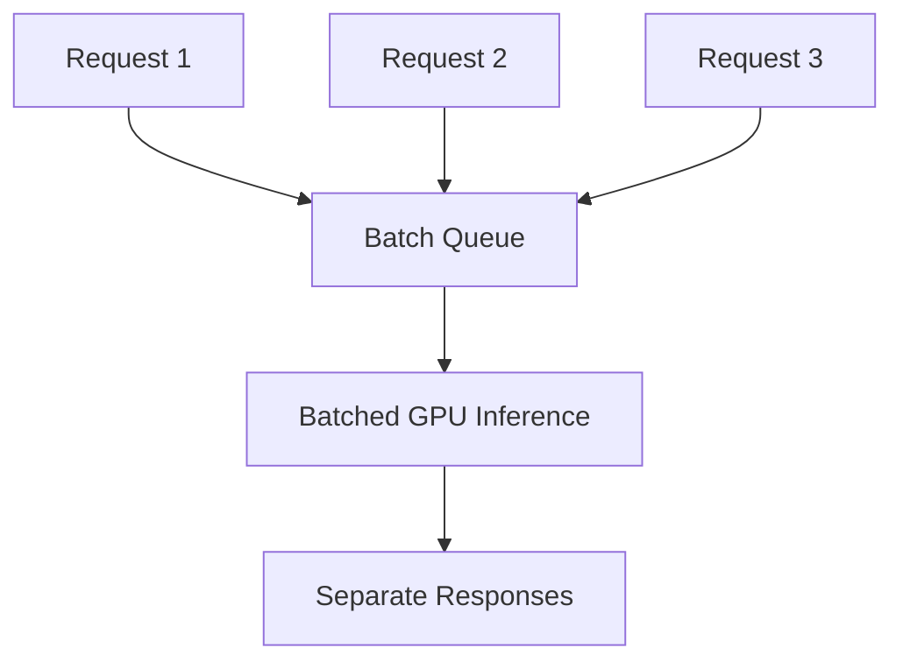
```mermaid
flowchart TD
    R1[Request 1] --> Q[Batch Queue]
    R2[Request 2] --> Q
    R3[Request 3] --> Q
    Q --> B[Batched GPU Inference]
    B --> O[Separate Responses]
```

### Continuous / In-Flight Batching

LLM serving benefits from scheduling that can add and remove requests as generation progresses.

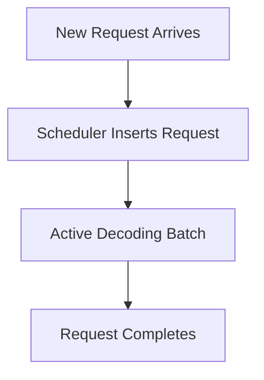
```mermaid
flowchart TD
    A[Active Decoding Batch] --> B[Request Completes]
    C[New Request Arrives] --> D[Scheduler Inserts Request]
    D --> A
```

### Tradeoff

| Optimization | Benefit | Risk |
|---|---|---|
| larger batch | higher throughput | higher latency |
| queue delay | better GPU utilization | slower time to first token |
| continuous batching | better LLM utilization | scheduler complexity |
| priority queues | SLO control | fairness issues |

### Production Rule

Batching must be tuned against p95 latency, not only average throughput.

---

## 11. KV Cache Architecture

KV cache stores key/value attention state during autoregressive generation.

It is essential for efficient decoding, but it consumes GPU memory.

### KV Cache Flow

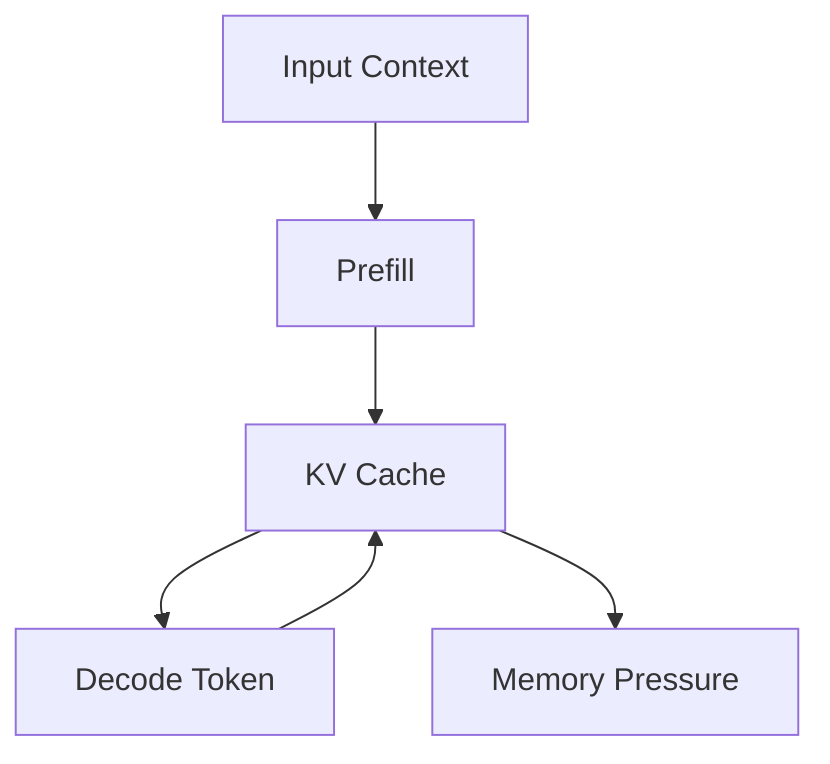
```mermaid
flowchart TD
    A[Input Context] --> B[Prefill]
    B --> C[KV Cache]
    C --> D[Decode Token]
    D --> C
    C --> E[Memory Pressure]
```

### Why It Matters

Long context and high concurrency can cause KV cache memory pressure even when model weights fit.

### Design Levers

- max context length
- max batch size
- max concurrent requests
- KV cache quantization
- paged attention
- cache offloading
- prompt caching
- tenant quotas
- admission control

### Production Metric

Track:

```text
tokens_in_flight = active_requests * average_context_tokens
```

This is often more useful than request count alone.

---

## 12. Quantization

Quantization reduces precision to reduce memory and improve throughput.

Common forms:

- FP16
- BF16
- FP8
- INT8
- INT4
- weight-only quantization
- activation quantization
- KV cache quantization

### Quantization Tradeoff

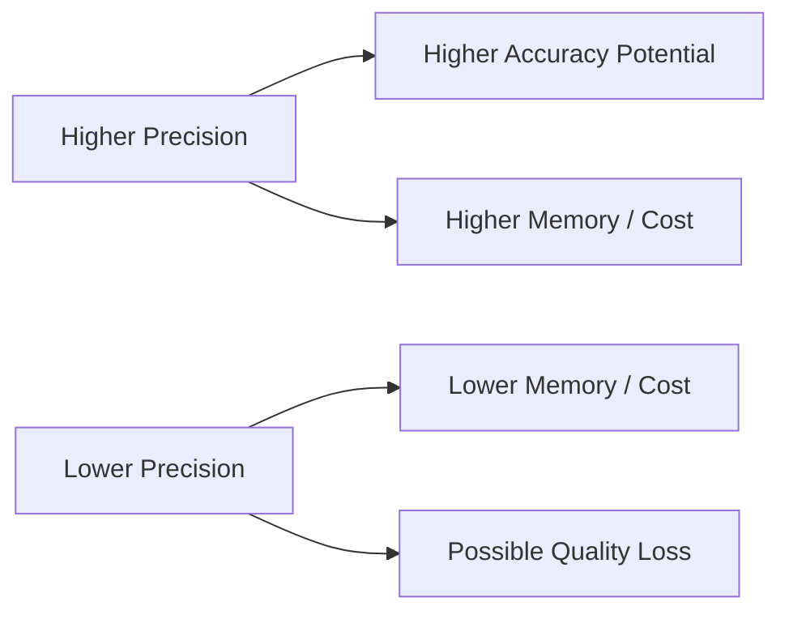
```mermaid
flowchart LR
    A[Higher Precision] --> B[Higher Accuracy Potential]
    A --> C[Higher Memory / Cost]
    D[Lower Precision] --> E[Lower Memory / Cost]
    D --> F[Possible Quality Loss]
```

### Evaluation Required

Quantization must be evaluated against:

- task quality
- hallucination rate
- tool-call accuracy
- structured output validity
- safety/refusal behavior
- latency
- throughput
- cost

### Principle

> Quantization is not only an infrastructure optimization. It is a model behavior change that needs evaluation.

---

## 13. TensorRT-LLM Optimization Patterns

TensorRT-LLM supports many LLM-serving optimization concepts.

Important patterns include:

- tensor parallelism
- pipeline parallelism
- paged attention
- in-flight batching
- KV cache features
- quantization
- speculative decoding
- streaming generation
- guided decoding
- multimodal support
- distributed serving
- benchmarking

### TensorRT-LLM Architecture

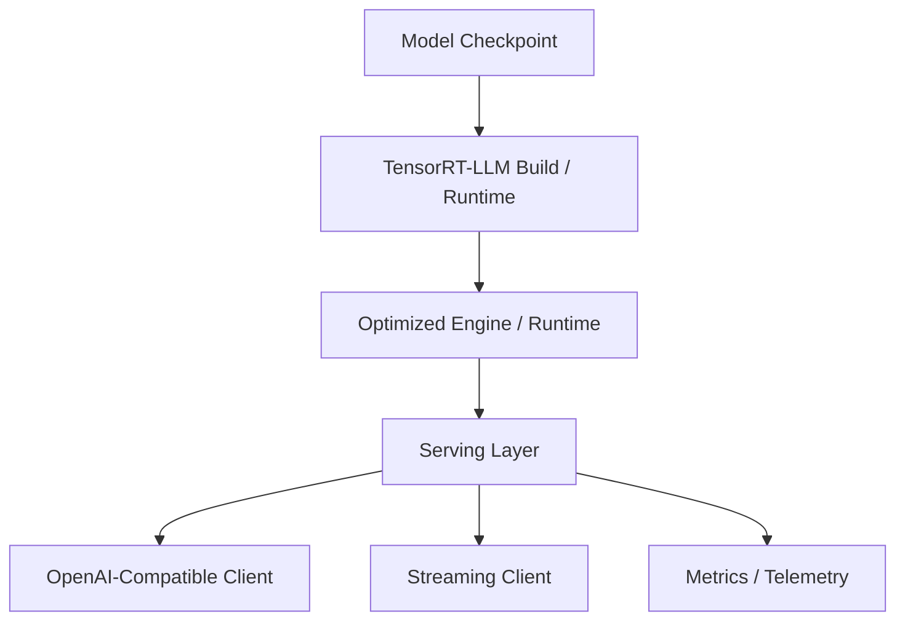
```mermaid
flowchart TD
    A[Model Checkpoint] --> B[TensorRT-LLM Build / Runtime]
    B --> C[Optimized Engine / Runtime]
    C --> D[Serving Layer]
    D --> E[OpenAI-Compatible Client]
    D --> F[Streaming Client]
    D --> G[Metrics / Telemetry]
```

### Design Guidance

Use TensorRT-LLM when inference optimization matters enough to justify deeper platform engineering.

### Speculative Decoding — How It Works

Speculative decoding is a technique to accelerate autoregressive generation without changing model quality.

**The mechanism:**

1. A small **draft model** (much faster than the target model) generates K candidate tokens quickly
2. The large **target model** validates all K tokens in a single parallel forward pass — dramatically faster than generating K tokens one at a time
3. Tokens that the target model accepts are kept; the first rejected token is replaced with the target model's output and generation continues

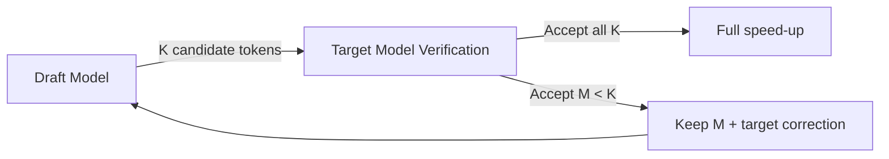
```mermaid
flowchart LR
    A[Draft Model] -->|K candidate tokens| B[Target Model Verification]
    B -->|Accept all K| C[Full speed-up]
    B -->|Accept M < K| D[Keep M + target correction]
    D --> A
```

**Why it matters architecturally:**

- end-to-end latency can decrease significantly for generation workloads where the draft model has high acceptance rates
- GPU utilization pattern changes: draft model runs cheaply, target model runs in parallel batch verification mode
- acceptance rate depends on how well the draft model approximates the target model — same model family works best
- quality is unchanged: the target model's probability distribution still governs all accepted tokens

**When speculative decoding helps most:**

- outputs with predictable phrasing (structured reports, code, templates)
- high-bandwidth GPU with capacity to run both models simultaneously
- latency is the primary SLO, not throughput

**When it helps less:**

- highly creative or unpredictable generation where draft acceptance rate is low
- memory-constrained environments where running two models simultaneously is not feasible

---

## 13a. Serving Fine-Tuned LoRA Models

Chapter 2 introduced LoRA as the primary parameter-efficient fine-tuning method for enterprise model adaptation. Chapter 17's serving infrastructure must support LoRA adapter deployment.

### The LoRA Serving Challenge

A base model (e.g., Llama 3 70B) plus multiple LoRA adapters (e.g., support-domain adapter, legal-domain adapter, operations-domain adapter) should share the same base model weights in GPU memory — loading the base model once and swapping or merging adapters per request.

Loading the full base model per adapter is economically infeasible.

### Serving Patterns

**Pattern 1: Merged Model Serving**

Merge the LoRA adapter weights into the base model before serving. Result is a standard model with no adapter overhead at inference time.

Pros: no inference overhead, simpler serving stack.
Cons: one GPU deployment per fine-tuned variant, more GPU memory.

Best for: one primary fine-tuned model per use case.

**Pattern 2: Dynamic Adapter Loading**

Load the base model once. Serve multiple LoRA adapters on demand, loading/unloading adapter weights per-request or per-tenant.

Pros: share base model GPU memory across all adapters.
Cons: adapter loading latency per cold switch, more complex serving logic.

Best for: multi-tenant platforms where different tenants or teams use different adapters.

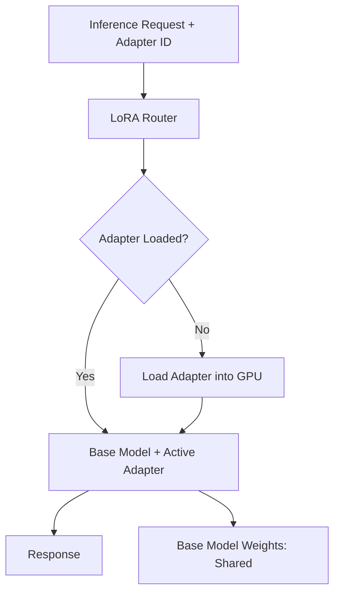
```mermaid
flowchart TD
    A[Inference Request + Adapter ID] --> B[LoRA Router]
    B --> C{Adapter Loaded?}
    C -->|Yes| D[Base Model + Active Adapter]
    C -->|No| E[Load Adapter into GPU]
    E --> D
    D --> F[Response]
    D --> G[Base Model Weights: Shared]
```

**TensorRT-LLM and NIM LoRA support:**

TensorRT-LLM supports LoRA serving through its LLM API. NIM containers for LoRA-capable models can accept adapter specifications in the request. Check current NGC documentation for specific model and adapter format requirements — LoRA support and APIs evolve with each release.

### Governance for LoRA Adapters

- version adapters alongside the base model in model registry
- evaluate each adapter against the relevant golden dataset before deployment
- apply the same security and data classification review to adapter training data as to the base model
- track which adapter served which request in observability logs — critical for debugging behavioral regressions

---

## 14. Benchmarking and Evaluation Tooling

Evaluation tooling must include performance and quality.

### Benchmark Harness Structure

```text
labs/chapter-17-nvidia-infra/benchmark_harness/
  benchmark.py
  dataset.jsonl
  requirements.txt
  README.md
```

### `dataset.jsonl`

```jsonl
{"id":"q1","prompt":"Summarize a support incident in three bullets.","max_tokens":300}
{"id":"q2","prompt":"Classify this as low, medium, or high risk: production rollback requested.","max_tokens":100}
```

### `benchmark.py`

```python
from __future__ import annotations

import json
import os
import time
from dataclasses import dataclass
from statistics import mean

from openai import OpenAI


@dataclass
class Result:
    id: str
    latency_ms: float
    output_chars: int
    ok: bool


def load_cases(path: str):
    with open(path, "r", encoding="utf-8") as f:
        for line in f:
            yield json.loads(line)


def run_case(client: OpenAI, model: str, case: dict) -> Result:
    started = time.perf_counter()
    try:
        response = client.chat.completions.create(
            model=model,
            messages=[{"role": "user", "content": case["prompt"]}],
            max_tokens=case.get("max_tokens", 300),
            temperature=0.2,
        )
        text = response.choices[0].message.content or ""
        ok = True
    except Exception as exc:
        text = str(exc)
        ok = False

    return Result(
        id=case["id"],
        latency_ms=(time.perf_counter() - started) * 1000,
        output_chars=len(text),
        ok=ok,
    )


def main():
    client = OpenAI(
        base_url=os.environ["AI_BASE_URL"],
        api_key=os.environ.get("AI_API_KEY", "not-used"),
    )
    model = os.environ.get("AI_MODEL", "local-llm")

    results = [run_case(client, model, c) for c in load_cases("dataset.jsonl")]
    latencies = [r.latency_ms for r in results if r.ok]

    print("requests:", len(results))
    print("success:", sum(r.ok for r in results))
    print("avg_latency_ms:", round(mean(latencies), 2) if latencies else None)
    print("max_latency_ms:", round(max(latencies), 2) if latencies else None)

    with open("results.json", "w", encoding="utf-8") as f:
        json.dump([r.__dict__ for r in results], f, indent=2)


if __name__ == "__main__":
    main()
```

### Metrics

Track:

- requests/sec
- time to first token
- end-to-end latency
- output tokens/sec
- error rate
- GPU utilization
- memory utilization
- queue time
- cost per 1K tokens
- cost per successful task
- quality score

### Python: Concurrent Load Test

The sequential benchmark above measures single-request latency. Production systems must be validated under concurrency — where KV cache pressure, batching behavior, and queue dynamics all interact. This async load test fires N parallel requests and measures p95 behavior.

```python
from __future__ import annotations

import asyncio
import json
import os
import time
from dataclasses import dataclass
from statistics import mean, quantiles

import aiohttp  # pip install aiohttp


@dataclass
class LoadResult:
    id: str
    latency_ms: float
    ttft_ms: float       # Time to first token (streaming)
    output_chars: int
    ok: bool
    error: str = ""


async def single_request(
    session: aiohttp.ClientSession,
    base_url: str,
    model: str,
    prompt: str,
    req_id: str
) -> LoadResult:
    """Send one chat completion request and measure latency + TTFT."""
    payload = {
        "model": model,
        "messages": [{"role": "user", "content": prompt}],
        "max_tokens": 300,
        "temperature": 0.2,
        "stream": True
    }
    headers = {
        "Content-Type": "application/json",
        "Authorization": f"Bearer {os.environ.get('AI_API_KEY', 'not-used')}"
    }

    start = time.perf_counter()
    ttft = None
    output_chars = 0

    try:
        async with session.post(
            f"{base_url}/chat/completions",
            json=payload,
            headers=headers,
            timeout=aiohttp.ClientTimeout(total=60)
        ) as resp:
            resp.raise_for_status()
            async for line in resp.content:
                line = line.decode("utf-8").strip()
                if not line.startswith("data: "):
                    continue
                data_str = line[6:]
                if data_str == "[DONE]":
                    break
                try:
                    chunk = json.loads(data_str)
                    delta = chunk["choices"][0]["delta"].get("content", "")
                    if delta:
                        if ttft is None:
                            ttft = (time.perf_counter() - start) * 1000
                        output_chars += len(delta)
                except json.JSONDecodeError:
                    continue

        latency_ms = (time.perf_counter() - start) * 1000
        return LoadResult(
            id=req_id, latency_ms=latency_ms,
            ttft_ms=ttft or latency_ms,
            output_chars=output_chars, ok=True
        )

    except Exception as exc:
        latency_ms = (time.perf_counter() - start) * 1000
        return LoadResult(
            id=req_id, latency_ms=latency_ms,
            ttft_ms=latency_ms, output_chars=0,
            ok=False, error=str(exc)[:200]
        )


async def run_load_test(
    base_url: str,
    model: str,
    prompts: list[str],
    concurrency: int = 20,
    total_requests: int = 100
) -> dict:
    """
    Run a concurrent load test: `concurrency` parallel requests at a time,
    `total_requests` total. Measures p50/p95/p99 latency and TTFT distribution.
    """
    connector = aiohttp.TCPConnector(limit=concurrency)
    async with aiohttp.ClientSession(connector=connector) as session:
        semaphore = asyncio.Semaphore(concurrency)

        async def bounded_request(idx: int) -> LoadResult:
            async with semaphore:
                prompt = prompts[idx % len(prompts)]
                return await single_request(session, base_url, model, prompt, f"req-{idx}")

        tasks = [bounded_request(i) for i in range(total_requests)]
        results = await asyncio.gather(*tasks)

    ok_results = [r for r in results if r.ok]
    latencies = sorted(r.latency_ms for r in ok_results)
    ttfts     = sorted(r.ttft_ms for r in ok_results)

    def pct(vals: list[float], p: float) -> float:
        if not vals: return 0.0
        idx = int(len(vals) * p / 100)
        return round(vals[min(idx, len(vals)-1)], 1)

    return {
        "total": total_requests,
        "concurrency": concurrency,
        "success_rate": round(len(ok_results) / total_requests, 3),
        "latency_ms": {
            "avg": round(mean(latencies), 1) if latencies else 0,
            "p50": pct(latencies, 50),
            "p95": pct(latencies, 95),
            "p99": pct(latencies, 99),
            "max": round(max(latencies), 1) if latencies else 0
        },
        "ttft_ms": {
            "avg": round(mean(ttfts), 1) if ttfts else 0,
            "p95": pct(ttfts, 95),
        },
        "errors": [r.error for r in results if not r.ok][:5]
    }


if __name__ == "__main__":
    PROMPTS = [
        "Summarize this support incident in three bullets: heartbeat failures in NA terminals.",
        "Classify risk level (low/medium/high): customer reports terminal offline.",
        "Draft a one-paragraph executive summary of a P2 firmware issue."
    ]
    result = asyncio.run(run_load_test(
        base_url=os.environ["AI_BASE_URL"],
        model=os.environ.get("AI_MODEL", "local-llm"),
        prompts=PROMPTS,
        concurrency=20,
        total_requests=100
    ))
    print(json.dumps(result, indent=2))

# Key Engineering Notes:
# - semaphore limits max concurrent in-flight requests — matches concurrency target
# - TTFT is measured from request send to first streamed token — key UX metric
# - p95 latency under concurrency will be higher than sequential benchmark — that gap is the KV cache pressure signal
# - If p95 degrades sharply above certain concurrency levels, you've found the effective batch capacity limit
# - Run load tests against staging, not production — but use production-realistic prompts and context lengths
```

---

## 15. Component-Level Testing

Component testing closes a major production gap.

### Test Matrix

| Component | Test |
|---|---|
| endpoint health | readiness/liveness |
| schema | input/output structure |
| streaming | partial token events and completion |
| batching | latency under concurrency |
| tenant routing | correct tenant model/limits |
| auth | unauthorized blocked |
| cost tags | metadata present |
| evaluation | golden cases pass |
| fallback | provider failover works |
| cancellation | client cancel stops workflow |

### Pytest Scaffold

```text
labs/chapter-17-nvidia-infra/component_tests/
  test_health.py
  test_chat.py
  test_streaming.py
  test_tenant_policy.py
```

### `test_health.py`

```python
import os
import requests


def test_models_endpoint_available():
    base_url = os.environ["AI_BASE_URL"].rstrip("/")
    response = requests.get(f"{base_url}/models", timeout=10)
    assert response.status_code in (200, 401, 403)
```

### `test_chat.py`

```python
import os
from openai import OpenAI


def test_basic_chat_completion():
    client = OpenAI(
        base_url=os.environ["AI_BASE_URL"],
        api_key=os.environ.get("AI_API_KEY", "not-used"),
    )

    response = client.chat.completions.create(
        model=os.environ.get("AI_MODEL", "local-llm"),
        messages=[{"role": "user", "content": "Return exactly: pong"}],
        max_tokens=20,
        temperature=0,
    )

    text = response.choices[0].message.content or ""
    assert "pong" in text.lower()
```

### `test_streaming.py`

```python
import os
from openai import OpenAI


def test_streaming_yields_tokens():
    client = OpenAI(
        base_url=os.environ["AI_BASE_URL"],
        api_key=os.environ.get("AI_API_KEY", "not-used"),
    )

    stream = client.chat.completions.create(
        model=os.environ.get("AI_MODEL", "local-llm"),
        messages=[{"role": "user", "content": "Count from one to five."}],
        stream=True,
        max_tokens=50,
    )

    chunks = []
    for event in stream:
        delta = event.choices[0].delta.content
        if delta:
            chunks.append(delta)

    assert len("".join(chunks)) > 0
```

### `test_tenant_policy.py`

Multi-tenancy correctness is a production safety requirement. These tests verify that the gateway enforces tenant identity, quota rejection, and model access boundaries — not just that the model endpoint responds.

```python
import os
import requests
import pytest
from openai import OpenAI, AuthenticationError, RateLimitError


BASE_URL = os.environ["AI_BASE_URL"].rstrip("/")
ALLOWED_MODEL = os.environ.get("AI_MODEL", "local-llm")
RESTRICTED_MODEL = os.environ.get("AI_RESTRICTED_MODEL", "premium-llm")

# Tenant headers injected by the AI gateway based on authenticated identity
TENANT_A_HEADERS = {"x-tenant-id": "tenant-a", "x-tenant-tier": "standard"}
TENANT_B_HEADERS = {"x-tenant-id": "tenant-b", "x-tenant-tier": "premium"}
NO_TENANT_HEADERS = {}   # Unauthenticated / missing identity


def make_chat_request(headers: dict, model: str, prompt: str = "Say: ok") -> requests.Response:
    """Raw HTTP request so we can inspect status codes directly."""
    payload = {
        "model": model,
        "messages": [{"role": "user", "content": prompt}],
        "max_tokens": 20,
        "temperature": 0
    }
    auth_headers = {
        "Content-Type": "application/json",
        "Authorization": f"Bearer {os.environ.get('AI_API_KEY', 'not-used')}"
    }
    return requests.post(
        f"{BASE_URL}/chat/completions",
        json=payload,
        headers={**auth_headers, **headers},
        timeout=30
    )


def test_request_without_tenant_identity_is_rejected():
    """Requests without tenant identity must be rejected at the gateway."""
    resp = make_chat_request(NO_TENANT_HEADERS, ALLOWED_MODEL)
    assert resp.status_code in (401, 403), (
        f"Expected 401/403 for missing tenant identity, got {resp.status_code}"
    )


def test_tenant_a_can_access_allowed_model():
    """Standard tenant should be able to call the allowed model."""
    resp = make_chat_request(TENANT_A_HEADERS, ALLOWED_MODEL)
    assert resp.status_code == 200, f"Tenant A should access {ALLOWED_MODEL}, got {resp.status_code}"


def test_tenant_a_cannot_access_restricted_model():
    """Standard-tier tenant must be blocked from premium model."""
    resp = make_chat_request(TENANT_A_HEADERS, RESTRICTED_MODEL)
    assert resp.status_code in (403, 404), (
        f"Standard tenant should not access {RESTRICTED_MODEL}, got {resp.status_code}"
    )


def test_tenant_b_can_access_restricted_model():
    """Premium-tier tenant should be able to access the restricted model."""
    resp = make_chat_request(TENANT_B_HEADERS, RESTRICTED_MODEL)
    # Accept 200 or 404-if-model-not-deployed — not 403
    assert resp.status_code != 403, (
        f"Premium tenant should not be blocked from {RESTRICTED_MODEL}, got {resp.status_code}"
    )


def test_quota_rejection_on_excess_requests():
    """
    When a tenant exceeds its quota, the gateway must return 429.
    This test fires enough requests to trigger rate limiting for tenant-a.
    Adjust request count to match the actual quota configuration.

    NOTE: This test may be slow. Run separately from the fast health/unit suite.
    """
    BURST_COUNT = 50  # Set to tenant-a's RPM limit + 1
    hit_429 = False

    for i in range(BURST_COUNT):
        resp = make_chat_request(
            TENANT_A_HEADERS, ALLOWED_MODEL, f"burst request {i}"
        )
        if resp.status_code == 429:
            hit_429 = True
            break

    # This assertion is skipped if the gateway does not enforce rate limits
    # Use pytest.mark.skipif or environment variable to control
    if os.environ.get("ASSERT_QUOTA_ENFORCEMENT", "false").lower() == "true":
        assert hit_429, f"Expected 429 after {BURST_COUNT} burst requests but never hit quota"


def test_cost_attribution_header_present():
    """Cost attribution metadata must be present in responses for FinOps tracking."""
    resp = make_chat_request(TENANT_A_HEADERS, ALLOWED_MODEL)
    if resp.status_code == 200:
        # Exact header name depends on your gateway configuration
        cost_header = (
            resp.headers.get("x-tenant-id") or
            resp.headers.get("x-cost-tenant") or
            resp.headers.get("x-request-tenant")
        )
        assert cost_header is not None, (
            "Gateway response missing tenant cost attribution header"
        )
```

### Running Component Tests

```bash
# Fast suite (health + chat + streaming):
AI_BASE_URL=http://localhost:8000/v1 AI_MODEL=local-llm pytest test_health.py test_chat.py test_streaming.py -v

# Tenant policy suite (requires gateway running):
AI_BASE_URL=http://gateway:8080/v1 \
AI_MODEL=llama-8b \
AI_RESTRICTED_MODEL=llama-70b \
ASSERT_QUOTA_ENFORCEMENT=true \
pytest test_tenant_policy.py -v --timeout=120
```

---

## 16. Multi-Tenant Serving Design

Shared GPU platforms must be multi-tenant by design.

### Multi-Tenant Requirements

- tenant authentication
- tenant authorization
- quota per tenant
- rate limit per tenant
- model access per tenant
- priority lanes
- cost attribution
- isolation of logs
- isolation of cached context
- noisy-neighbor protection
- data retention controls

### Multi-Tenant Architecture

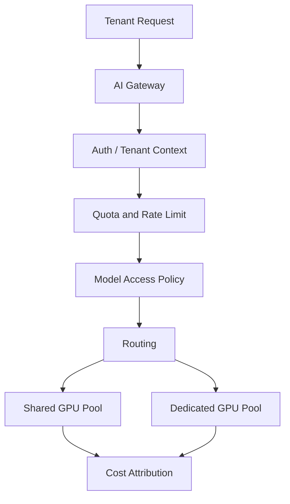
```mermaid
flowchart TD
    A[Tenant Request] --> B[AI Gateway]
    B --> C[Auth / Tenant Context]
    C --> D[Quota and Rate Limit]
    D --> E[Model Access Policy]
    E --> F[Routing]
    F --> G[Shared GPU Pool]
    F --> H[Dedicated GPU Pool]
    G --> I[Cost Attribution]
    H --> I
```

### Tenant Policy Example

```yaml
tenant: retail-support
allowed_models:
  - llama-8b-support
  - embedding-small
quota:
  requests_per_minute: 600
  tokens_per_day: 25000000
priority: standard
data_classification_allowed:
  - internal
  - confidential
dedicated_pool: false
```

### Production Rule

Tenant isolation is not just network isolation. It includes quotas, cache boundaries, logs, metrics, and model access.

---

## 17. Streaming Architecture in Production

Streaming must handle:

- time to first token
- token cadence
- cancellation
- reconnect
- partial output validation
- guardrail strategy
- logging
- user interface
- backpressure

### Streaming Flow

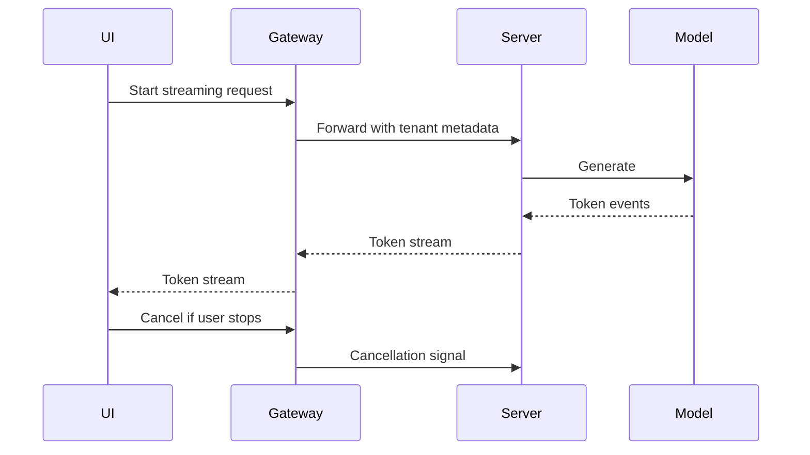
```mermaid
sequenceDiagram
    participant UI
    participant Gateway
    participant Server
    participant Model

    UI->>Gateway: Start streaming request
    Gateway->>Server: Forward with tenant metadata
    Server->>Model: Generate
    Model-->>Server: Token events
    Server-->>Gateway: Token stream
    Gateway-->>UI: Token stream
    UI->>Gateway: Cancel if user stops
    Gateway->>Server: Cancellation signal
```

### Production Design Questions

- What happens if the user disconnects?
- Is server-side cancellation propagated?
- Are partial responses logged?
- Are guardrails applied before display or after generation?
- Can the UI indicate partial/unverified output?
- Are tokens counted if user cancels?
- Is streaming disabled for high-risk workflows?

### Safe Pattern

For high-risk workflows:

```text
generate internally → validate → stream approved final answer or show completed response
```

For low-risk drafting:

```text
stream immediately → validate final → warn or correct if issue discovered
```

---

## 18. Multimodal Infrastructure

Platform chapters must include multimodal workloads.

NVIDIA infrastructure is relevant for:

- visual-language models
- document understanding
- image generation
- speech recognition
- text-to-speech
- video analytics
- sensor fusion
- robotics/edge workloads

### Multimodal Serving Pattern

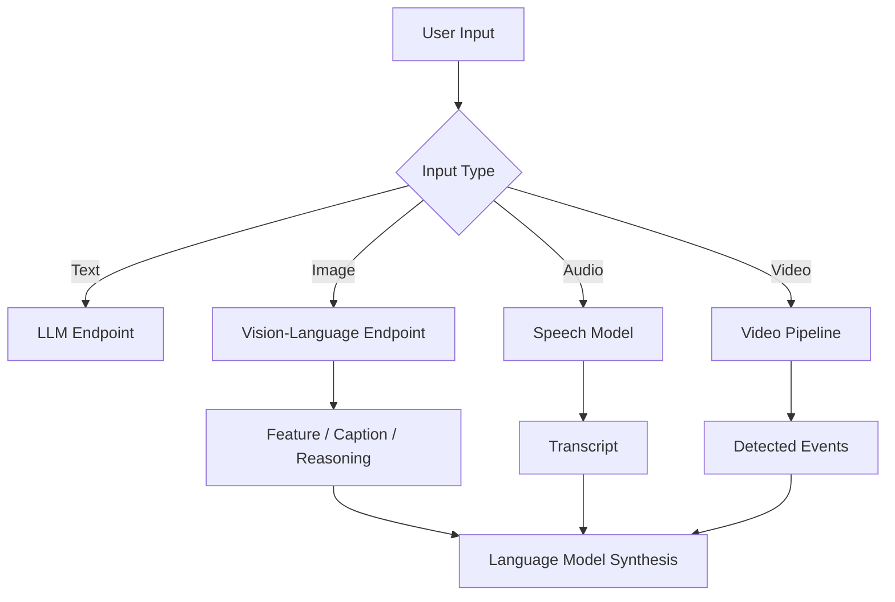
```mermaid
flowchart TD
    A[User Input] --> B{Input Type}
    B -->|Text| T[LLM Endpoint]
    B -->|Image| V[Vision-Language Endpoint]
    B -->|Audio| S[Speech Model]
    B -->|Video| VID[Video Pipeline]
    V --> F[Feature / Caption / Reasoning]
    S --> TXT[Transcript]
    VID --> EVENTS[Detected Events]
    F --> L[Language Model Synthesis]
    TXT --> L
    EVENTS --> L
```

### Example Device Operations Use Cases

- inspect terminal screen photos
- classify device damage
- read error messages from images
- summarize service call audio
- analyze video of kiosk malfunction
- detect visual defects in returned devices

### Multimodal Testing

Test:

- image format handling
- file size limits
- OCR/visual accuracy
- caption faithfulness
- PII in images
- hallucinated visual details
- latency under large payloads
- fallback to human review

---

## 19. NVIDIA Infrastructure with AWS

Enterprises may run NVIDIA infrastructure on AWS through:

- GPU EC2 instances
- Amazon EKS with GPU node groups
- SageMaker for training/hosting patterns
- private VPC networking
- S3 model artifacts
- CloudWatch and Prometheus/Grafana
- IAM-based access to supporting services
- Bedrock as managed fallback or alternate model route

### Hybrid AWS Pattern

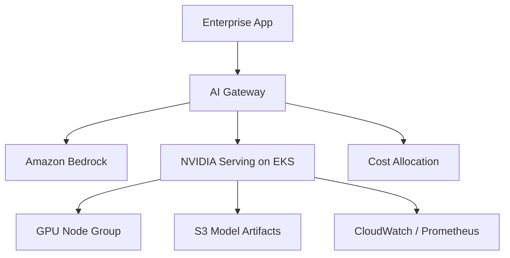
```mermaid
flowchart TD
    A[Enterprise App] --> G[AI Gateway]
    G --> B[Amazon Bedrock]
    G --> N[NVIDIA Serving on EKS]
    N --> GPU[GPU Node Group]
    N --> S3[S3 Model Artifacts]
    N --> CW[CloudWatch / Prometheus]
    G --> COST[Cost Allocation]
```

### Design Guidance

Use Bedrock when managed platform speed and governance are best.

Use NVIDIA/EKS when private serving, custom models, high volume, or performance control justify operations.

Use an AI gateway so applications do not care which path serves the model.

---

## 20. Autoscaling GPU Inference

Autoscaling GPU workloads is harder than CPU web services.

Signals may include:

- GPU utilization
- GPU memory utilization
- queue depth
- request rate
- tokens/sec
- time to first token
- p95 latency
- active sequences
- KV cache utilization
- tenant priority

### Autoscaling Pattern

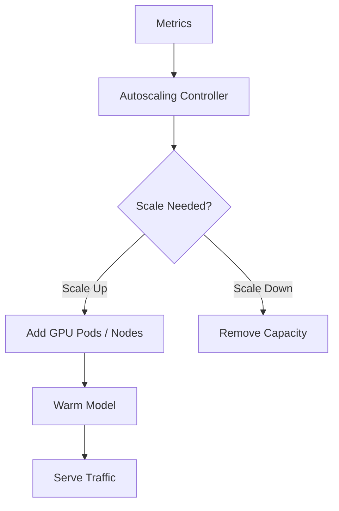
```mermaid
flowchart TD
    A[Metrics] --> B[Autoscaling Controller]
    B --> C{Scale Needed?}
    C -->|Scale Up| D[Add GPU Pods / Nodes]
    C -->|Scale Down| E[Remove Capacity]
    D --> F[Warm Model]
    F --> G[Serve Traffic]
```

### HPA Skeleton

```yaml
apiVersion: autoscaling/v2
kind: HorizontalPodAutoscaler
metadata:
  name: llm-serving-hpa
spec:
  scaleTargetRef:
    apiVersion: apps/v1
    kind: Deployment
    name: nim-llm
  minReplicas: 2
  maxReplicas: 10
  metrics:
    - type: Pods
      pods:
        metric:
          name: llm_queue_depth
        target:
          type: AverageValue
          averageValue: "20"
```

### Production Warning

GPU cold start can be slow because model weights must load into memory. Autoscaling must account for warm-up time.

---

## 21. Observability

Infrastructure observability must include application and GPU signals.

### Metrics

- request count
- error rate
- p50/p95/p99 latency
- time to first token
- tokens/sec
- input tokens/sec
- output tokens/sec
- queue time
- GPU utilization
- GPU memory utilization
- KV cache utilization
- batch size
- active sequences
- cache hit rate
- model load time
- streaming disconnects
- tenant quota rejections
- cost by tenant/workflow

### Dashboard Pattern

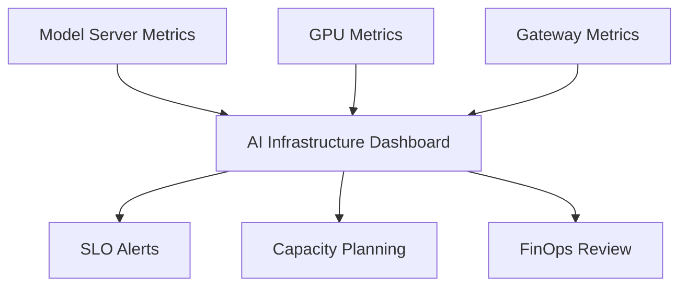
```mermaid
flowchart TD
    A[Model Server Metrics] --> D[AI Infrastructure Dashboard]
    B[GPU Metrics] --> D
    C[Gateway Metrics] --> D
    D --> E[SLO Alerts]
    D --> F[Capacity Planning]
    D --> G[FinOps Review]
```

### Prometheus Scrape Skeleton

```yaml
apiVersion: monitoring.coreos.com/v1
kind: ServiceMonitor
metadata:
  name: llm-serving-monitor
spec:
  selector:
    matchLabels:
      app: nim-llm
  endpoints:
    - port: metrics
      interval: 15s
```

---

## 22. FinOps and Capacity Planning

GPU economics are unforgiving.

### Cost Drivers

- GPU hourly cost
- utilization
- model size
- context length
- concurrency
- output length
- idle capacity
- redundancy
- storage
- networking
- engineering operations
- observability
- evaluation

### Cost Formula

```text
Cost per Successful Task =
(GPU hours + storage + networking + platform engineering + evaluation + operations)
/ successful workflow completions
```

### Utilization Rule

A GPU platform with 15% utilization often loses to managed APIs.

A GPU platform with high utilization, predictable demand, and strong operations can win.

### Capacity Planning Table

| Metric | Why It Matters |
|---|---|
| peak RPS | capacity sizing |
| average RPS | utilization |
| p95 latency | user experience |
| context length | memory pressure |
| output length | decode cost |
| concurrency | KV cache pressure |
| tenant priority | fairness |
| growth rate | procurement planning |

---

## 23. Security Architecture

### Security Requirements

- private networking
- tenant authentication
- model access policy
- secret management
- image scanning
- signed containers
- encrypted model artifacts
- encrypted logs
- sensitive prompt handling
- secure tool access
- API gateway authorization
- audit logs
- admin separation
- incident response

### Security Pattern

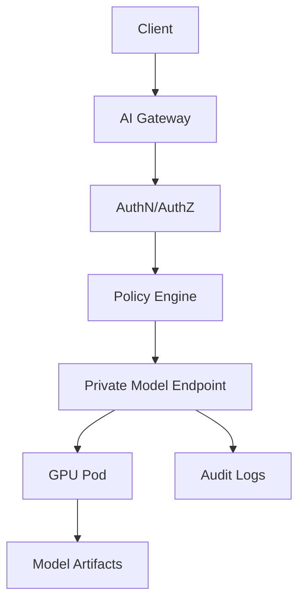
```mermaid
flowchart TD
    A[Client] --> B[AI Gateway]
    B --> C[AuthN/AuthZ]
    C --> D[Policy Engine]
    D --> E[Private Model Endpoint]
    E --> F[GPU Pod]
    F --> G[Model Artifacts]
    E --> H[Audit Logs]
```

### Principle

> The model server should not be the security boundary. It should sit behind one.

---

## 24. Fallback and Routing

NVIDIA infrastructure should be part of a model portfolio.

### Routing Pattern

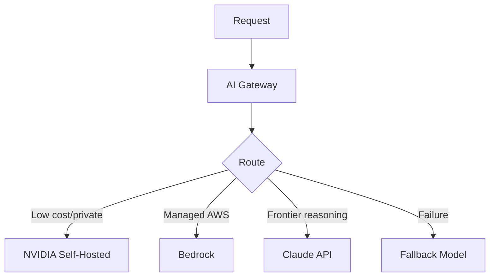
```mermaid
flowchart TD
    A[Request] --> B[AI Gateway]
    B --> C{Route}
    C -->|Low cost/private| D[NVIDIA Self-Hosted]
    C -->|Managed AWS| E[Bedrock]
    C -->|Frontier reasoning| F[Claude API]
    C -->|Failure| G[Fallback Model]
```

### Routing Criteria

- task type
- tenant
- data class
- latency SLO
- cost budget
- model quality
- region
- fallback availability
- current capacity

### Fallback Rules

- fallback should be evaluated
- output style should remain consistent
- user should not see provider details
- high-risk workflows may fail closed
- low-risk workflows may degrade gracefully

### Evaluation-Based Routing

Static routing by task type, cost, or latency covers most cases. For quality-sensitive workflows, add an evaluation signal to the routing decision.

**Pattern: Route to larger model on low confidence**

```mermaid
flowchart TD
    A[Request] --> B[Haiku / Small Model]
    B --> C[Quick Quality Check]
    C --> D{Score >= threshold?}
    D -->|Yes| E[Return Response]
    D -->|No| F[Route to Sonnet / Larger Model]
    F --> G[Return Higher Quality Response]
    G --> H[Log Routing Decision]
```

**Implementation approach:**

1. Send the request to the fast/cheap model first
2. Run a lightweight quality classifier or LLM-as-judge on the response (scored in under 100ms using a small judge model)
3. If the quality score falls below the threshold, re-route to a higher-capability model
4. Log the routing decision, scores, and both responses for evaluation improvement

**Threshold guidance:**

| Workflow Type | First-attempt Model | Re-route Threshold | Escalation Model |
|---|---|---|---|
| Classification / routing | Haiku | 0.80 | Sonnet |
| Support draft generation | Haiku | 0.72 | Sonnet |
| Multi-document synthesis | Sonnet | 0.80 | Opus |
| Architecture review | Sonnet | 0.85 | Opus with thinking |

**Enterprise rule:** Evaluation-based routing increases latency and cost for escalated requests. Measure the escalation rate — if more than 20% of requests escalate, the first-attempt model or prompt is likely misconfigured rather than the threshold being too strict.

---

## 25. Managed API vs NVIDIA Self-Hosted

| Dimension | Managed API / Bedrock / Claude | NVIDIA Self-Hosted |
|---|---|---|
| speed to start | high | medium/low |
| operations burden | lower | higher |
| model control | lower/medium | high |
| data placement | depends provider | high |
| cost at low volume | often better | often worse |
| cost at high utilization | may be worse | can be better |
| latency control | limited | high |
| custom models | limited/varies | high |
| observability | provider + app | full stack |
| staffing need | lower | higher |

### Decision Rule

Choose self-hosting only when control, scale, data placement, or cost justifies operating the infrastructure.

---

## 26. Production Lessons from the Field

### Lesson 1: GPU Utilization Is the Business Case

A GPU cluster that is mostly idle is not a platform. It is an expensive monument.

What worked:

- shared model endpoints
- centralized routing
- quotas
- batching
- batch workloads scheduled during off-peak hours
- cost dashboards

What failed:

- dedicated GPUs per team with low utilization
- no tenant quotas
- no consolidation
- no workload characterization

### Lesson 2: Time to First Token Matters

Users judge streaming assistants by responsiveness.

What worked:

- smaller models for interactive flows
- streaming
- caching stable prompts
- pre-warmed endpoints
- short system prompts
- retrieval pruning

What failed:

- huge context every request
- cold model load
- overlarge models
- no p95 tracking

### Lesson 3: Long Context Can Destroy Capacity

Long context increases prefill time and KV cache memory.

What worked:

- context planning
- RAG before long context
- summarization
- prompt caching
- max context policies

What failed:

- dumping every document
- no context budget
- no tenant token caps

### Lesson 4: Streaming Needs Cancellation

If users close the browser and server keeps generating, money burns invisibly.

What worked:

- cancellation propagation
- streaming disconnect metrics
- token budget enforcement
- gateway-side abort

What failed:

- UI cancellation only
- no server cancellation
- no accounting for abandoned generations

### Lesson 5: Multimodal Costs Surprise Teams

Images, audio, and video can increase latency, payload size, and processing cost.

What worked:

- pre-processing
- size limits
- modality-specific models
- human review for uncertain visual claims

What failed:

- sending raw video to general model
- no file limits
- no visual hallucination evaluation

---

## 27. Evaluation for NVIDIA Infrastructure

Evaluation must combine performance and quality.

### Infrastructure Evaluation Stack

```mermaid
flowchart TD
    A[Test Dataset] --> B[Quality Evaluation]
    A --> C[Performance Benchmark]
    A --> D[Load Test]
    A --> E[Safety Evaluation]
    B --> F[Release Gate]
    C --> F
    D --> F
    E --> F
```

### Quality Metrics

- correctness
- groundedness
- schema validity
- refusal correctness
- tool-call quality
- multimodal faithfulness

### Performance Metrics

- time to first token
- output tokens/sec
- p95 latency
- throughput
- concurrency
- GPU utilization
- memory utilization
- error rate

### Release Gate Example

```yaml
release_gate:
  quality_score_min: 0.86
  safety_score_min: 0.98
  p95_latency_ms_max: 6000
  time_to_first_token_ms_max: 1000
  error_rate_max: 0.005
  cost_per_task_max_usd: 0.05
```

---

## 28. Capstone NVIDIA Infrastructure

The Enterprise Agentic Operations Platform can use NVIDIA infrastructure for private, high-volume, or low-latency inference.

### Capstone Pattern

```mermaid
flowchart TD
    U[Operations Users] --> G[Enterprise AI Gateway]
    G --> LG[LangGraph Runtime]
    LG --> RAG[Knowledge Retrieval]
    LG --> MCP[MCP Tool Layer]
    LG --> MODEL[Model Router]

    MODEL --> BED[Bedrock]
    MODEL --> CLAUDE[Claude]
    MODEL --> NVID[NVIDIA Inference Endpoint]

    NVID --> NIM[NIM / Triton]
    NIM --> GPU[GPU Pool]

    MCP --> TEL[Telemetry]
    MCP --> CRM[Customer Systems]
    RAG --> KB[Runbooks / Incidents]
    LG --> EVAL[Evaluation]
    LG --> OBS[Observability]
```

### NVIDIA Responsibilities

- private inference for sensitive operations data
- high-volume summarization
- embedding/reranking services
- multimodal defect analysis
- batch evaluation jobs
- cost-optimized open model serving

### Non-NVIDIA Responsibilities

- workflow orchestration
- tool authorization
- human approval
- business policy
- evaluation thresholds
- source governance
- customer communication control

---

## 29. Production Readiness Checklist

Before launching NVIDIA-backed inference:

- [ ] workload characterized
- [ ] model selected and evaluated
- [ ] serving stack selected: NIM, Triton, TensorRT-LLM, or other
- [ ] GPU sizing completed
- [ ] batch/streaming strategy defined
- [ ] multi-tenancy policy created
- [ ] tenant quotas configured
- [ ] Kubernetes deployment reviewed
- [ ] model artifacts secured
- [ ] endpoint behind AI gateway
- [ ] auth and policy enforced
- [ ] component tests passing
- [ ] load tests completed
- [ ] quality evaluation completed
- [ ] multimodal tests completed if applicable
- [ ] observability dashboard created
- [ ] cost dashboard created
- [ ] fallback strategy tested
- [ ] runbooks created
- [ ] incident response process defined
- [ ] rollback/canary plan created

---

## 30. Architecture Review Scenario

### Scenario

A company wants to buy a GPU cluster and host all AI workloads internally because "it will be cheaper than APIs."

### Initial Design

The proposed plan:

- buy GPUs
- deploy one open model
- expose endpoint directly to application teams
- no workload characterization
- no utilization target
- no multi-tenancy
- no batching design
- no evaluation gates
- no cost dashboard
- no fallback
- no SRE ownership

### Review Finding

This is not production-ready.

### Problems

- no proof of economic advantage
- no latency/throughput SLOs
- no tenant isolation
- no platform operating model
- no security boundary
- no model routing
- no utilization plan
- no incident response
- no cost per task

### Improved Design

```mermaid
flowchart TD
    A[Workload Characterization] --> B[Model Selection]
    B --> C[Serving Stack Evaluation]
    C --> D[Benchmark / Load Test]
    D --> E[Cost Model]
    E --> F{Business Case?}
    F -->|No| G[Use Managed APIs]
    F -->|Yes| H[Build GPU Platform]
    H --> I[Gateway + Multi-Tenancy + Observability]
```

### Recommendation

Start with measured workloads. Build only if the workload justifies infrastructure ownership.

---

## 31. Hands-On Labs with Scaffolding

### Lab 1: OpenAI-Compatible Client

```text
labs/chapter-17-nvidia-infra/lab1-openai-client/
  client.py
  requirements.txt
  README.md
```

Tasks:

1. Set `AI_BASE_URL`.
2. Set `AI_MODEL`.
3. Run `python client.py`.
4. Add tenant/workflow metadata.
5. Capture latency.

---

### Lab 2: Streaming Client

```text
labs/chapter-17-nvidia-infra/lab2-streaming/
  stream_client.py
  README.md
```

Tasks:

1. Stream tokens.
2. Implement cancellation.
3. Log time to first token.
4. Compare streaming vs non-streaming UX.

---

### Lab 3: Triton Config Review

```text
labs/chapter-17-nvidia-infra/lab3-triton-config/
  model_repository/
    embedding_model/
      config.pbtxt
  review.md
```

Tasks:

1. Review input/output schema.
2. Tune dynamic batching.
3. Add instance groups.
4. Document latency tradeoffs.

---

### Lab 4: Component Tests

```text
labs/chapter-17-nvidia-infra/lab4-component-tests/
  test_health.py
  test_chat.py
  test_streaming.py
  requirements.txt
```

Tasks:

1. Run pytest.
2. Add tenant policy test.
3. Add fallback test.
4. Add schema validation test.

---

### Lab 5: Benchmark Harness

```text
labs/chapter-17-nvidia-infra/lab5-benchmark/
  benchmark.py
  dataset.jsonl
  results.json
  analysis.md
```

Tasks:

1. Run 100 requests.
2. Compute average and p95 latency.
3. Track errors.
4. Estimate cost per successful task.

---

### Lab 6: Capstone Infrastructure Design

```text
labs/chapter-17-nvidia-infra/lab6-capstone/
  architecture.md
  gpu-sizing.xlsx
  tenant-policy.yaml
  release-gate.yaml
  runbook.md
```

Tasks:

1. Select model serving path.
2. Define tenant quotas.
3. Define fallback.
4. Create observability metrics.
5. Write incident runbook.

---

## 32. Interview Questions

### Engineering-Level Questions

1. What problem does Triton Inference Server solve?
2. What is dynamic batching?
3. What is KV cache?
4. Why does long context increase GPU memory pressure?
5. What is quantization?
6. What is time to first token?
7. How would you test a streaming endpoint?
8. What metrics would you collect from GPU inference?
9. How would you benchmark an LLM endpoint?
10. What is the difference between NIM and Triton?

### Architect-Level Questions

1. Design an NVIDIA-backed model serving platform.
2. When would you use Bedrock instead of self-hosting?
3. How would you design multi-tenancy for shared GPU inference?
4. How would you route between Claude, Bedrock, and self-hosted models?
5. How would you tune batching without hurting p95 latency?
6. How would you design streaming safely?
7. How would you serve multimodal workloads?
8. How would you evaluate quantized models?
9. How would you design observability for GPU inference?
10. How would you handle GPU capacity planning?

### Director / VP / CTO-Level Questions

1. Why should we own AI infrastructure?
2. What workload justifies GPUs?
3. What is the utilization target?
4. What is cost per successful task?
5. What is the operating model?
6. How do we avoid GPU sprawl?
7. How do we compare managed APIs vs self-hosting?
8. What are the risks of self-hosting?
9. What skills do we need to operate this?
10. What would make you reject a GPU infrastructure proposal?

---

## 33. Certification Mapping

### AWS AI / Generative AI Professional Preparation

This chapter supports:

- managed vs self-hosted model tradeoffs
- Bedrock vs custom inference architecture
- cost optimization
- latency and throughput design
- model evaluation
- security and governance
- multimodal workload architecture
- production deployment patterns

### Anthropic Claude / MCP Architecture Preparation

This chapter supports:

- Claude vs self-hosted model routing
- MCP tool gateway integration
- enterprise AI gateway patterns
- cost and latency comparison
- model fallback
- evaluation-based routing

### NVIDIA Generative AI Preparation

This chapter directly supports:

- NVIDIA AI Enterprise
- NIM microservices
- Triton Inference Server
- TensorRT-LLM
- GPU inference architecture
- batching
- KV cache
- quantization
- throughput and latency tuning
- multimodal serving
- observability
- benchmarking
- production operations

---

## 34. Chapter Exercises

### Exercise 1

Create a decision memo comparing Bedrock, Claude direct API, and NVIDIA self-hosting for a 10M request/month support assistant.

### Exercise 2

Design a multi-tenant GPU serving platform.

Include:

- tenant quotas
- rate limits
- routing
- cost attribution
- logging isolation
- cache isolation

### Exercise 3

Build a performance test plan for a streaming LLM endpoint.

Include:

- time to first token
- p95 latency
- cancellation
- disconnects
- throughput
- cost

### Exercise 4

Design a multimodal device inspection workflow.

Include:

- image input
- visual-language model
- defect classification
- human review
- evaluation
- cost controls

### Exercise 5

Create a GPU FinOps dashboard.

Include:

- utilization
- idle cost
- tenant cost
- model cost
- cost per workflow
- batch vs real-time cost
- forecasted capacity

---

## 35. Key Terms

| Term | Meaning |
|---|---|
| NVIDIA AI Infrastructure | GPU and software stack for AI training and inference |
| NIM | NVIDIA inference microservice pattern for deployable AI services |
| Triton Inference Server | Open-source inference serving platform |
| TensorRT-LLM | NVIDIA toolkit/runtime for optimized LLM inference |
| GPU utilization | percent of GPU compute used |
| GPU memory | memory available for model weights, activations, KV cache |
| KV cache | attention state used during autoregressive decoding |
| prefill | processing input context before generation |
| decode | token-by-token generation phase |
| dynamic batching | combining requests for throughput |
| continuous batching | scheduling LLM requests dynamically during generation |
| quantization | lower-precision representation for efficiency |
| time to first token | latency before first streamed token |
| tokens/sec | output throughput |
| multi-tenancy | serving multiple users/teams/tenants with isolation |
| model repository | Triton file-system-based model serving repository |
| instance group | Triton configuration for model execution instances |
| FinOps | cost management discipline |
| multimodal serving | serving text, image, audio, or video models |

---

## 36. One-Page Executive Brief

NVIDIA AI infrastructure is the performance and control layer for enterprise AI.

It matters when an organization needs private model serving, high throughput, low latency, custom models, multimodal workloads, or better economics at scale.

The opportunity is real, but so is the risk. Buying GPUs does not create an AI platform. The enterprise must design model serving, routing, batching, streaming, multi-tenancy, observability, evaluation, cost allocation, security, and operations.

Executives should ask:

- Which workloads require self-hosting?
- What is the utilization target?
- What is the cost per successful task?
- What SLOs must be met?
- What team will operate the platform?
- How do we compare against Bedrock and Claude APIs?
- What is the fallback strategy?
- How do we enforce tenant quotas?
- How do we monitor quality and safety?
- What is the capacity plan?

The executive takeaway:

> NVIDIA infrastructure creates value when GPU capacity is converted into reliable, governed, measurable, cost-efficient AI workflows.

---

## 37. References

- NVIDIA Triton Inference Server documentation: https://docs.nvidia.com/deeplearning/triton-inference-server/user-guide/docs/index.html
- TensorRT-LLM documentation: https://nvidia.github.io/TensorRT-LLM/

---

## 38. Chapter Summary

In this chapter, we explored NVIDIA AI Infrastructure as the enterprise performance, serving, and optimization layer for AI workloads.

We covered where NVIDIA infrastructure fits, workload types, GPU fundamentals, NIM, Triton, TensorRT-LLM, serving architecture, Python clients, streaming clients, NIM-style deployment patterns, Triton configuration, batching, KV cache, quantization, TensorRT-LLM optimization, benchmarking, component-level testing, multi-tenancy, production streaming, multimodal infrastructure, AWS integration, autoscaling, observability, FinOps, security, fallback routing, managed API vs self-hosting decisions, production lessons, evaluation, capstone design, production readiness, architecture review, labs, interview questions, certification mapping, and executive guidance.

We also closed recurring platform gaps by adding concrete Python scaffolding, configuration examples, streaming nuance, multi-tenancy patterns, component tests, evaluation tooling, multimodal design, and production-specific lessons.

The key lesson is:

> AI infrastructure is not a GPU purchase. It is a production serving system whose value depends on utilization, reliability, governance, evaluation, and cost per successful workflow.

In Chapter 18, we will move from individual technologies into reusable Enterprise AI Architecture Patterns, including AI gateways, model routers, prompt registries, RAG platforms, tool gateways, agent runtimes, evaluation services, governance planes, and observability planes.

---

## 39. Suggested Git Commit

```bash
mkdir -p chapters
cp 17-nvidia-ai-infrastructure-reworked.md chapters/17-nvidia-ai-infrastructure.md
cp BOOK_STATE-updated-through-chapter-17.md BOOK_STATE.md

git add chapters/17-nvidia-ai-infrastructure.md BOOK_STATE.md
git commit -m "Add Chapter 17: NVIDIA AI Infrastructure"
git push origin main
```
