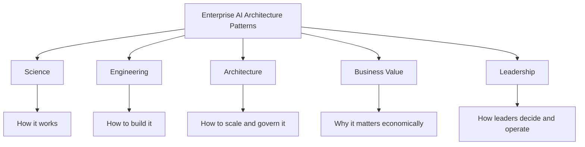
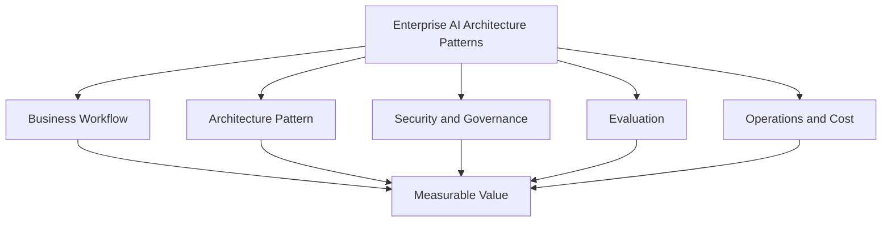
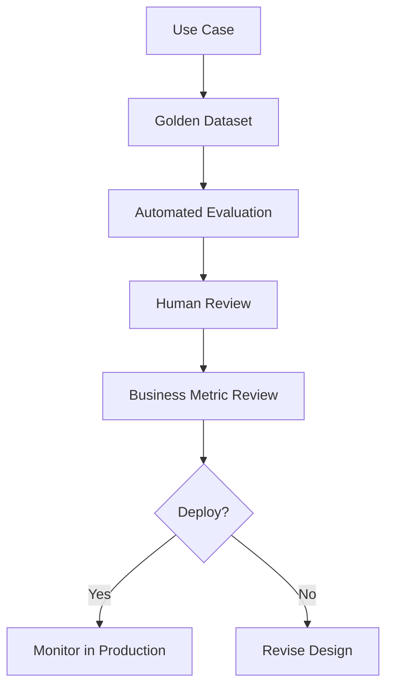
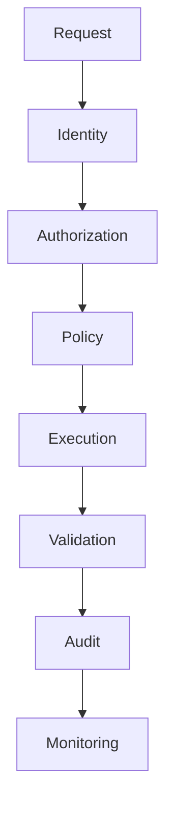
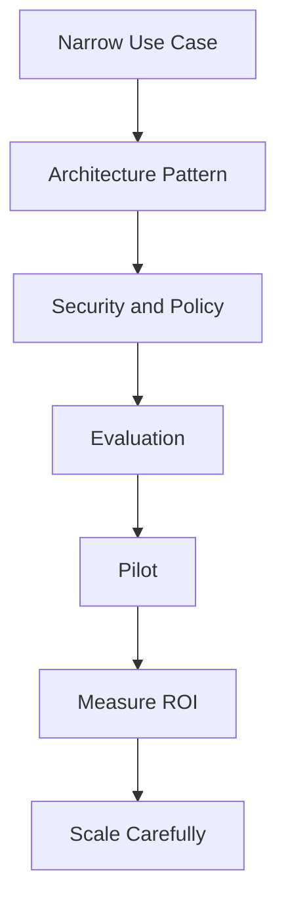

# Chapter 18 — Enterprise AI Architecture Patterns

**Book:** The AI Architect & Practitioner Bootcamp  
**Chapter Status:** Complete Draft  
**Version:** 0.1  
**Author:** Pratik Desai  
**Primary Audience:** AI engineers, enterprise architects, platform engineers, data engineers, engineering leaders, product leaders, consultants, directors, VPs, CTO-track practitioners, and certification candidates

---

## Chapter Thesis

Enterprise AI architecture patterns convert isolated AI features into reusable, secure, observable, cost-aware platform capabilities.

This chapter continues the book's operating principle:

> Production AI is a system, not a model.

The goal is not to memorize terminology. The goal is to understand how this capability fits into an enterprise architecture that can be evaluated, governed, operated, secured, and tied to measurable business outcomes.

---

## Learning Objectives

By the end of this chapter, you will be able to:

- AI gateway
- model router
- prompt registry
- RAG platform
- tool gateway
- agent runtime
- semantic cache
- evaluation service
- governance plane
- platform operating model
- Explain the business value, architecture tradeoffs, and operating risks of this topic.
- Design production-ready workflows using the chapter concepts.
- Evaluate quality, latency, cost, reliability, safety, and ROI.
- Discuss the topic at engineering, architect, Director, VP, and CTO levels.

---

## Executive Summary

The enterprise AI platform is a set of shared control planes and services, not a collection of one-off model calls.

For enterprise leaders, the central question is:

> How does this capability help us build safer, faster, cheaper, more reliable, and more measurable AI systems?

For practitioners, the central question is:

> What architecture pattern, implementation discipline, and evaluation strategy make this production-ready?

---

## Business Motivation

Enterprises invest in this capability because one-off AI experiments do not scale. Production AI requires repeatable patterns that can be secured, governed, monitored, evaluated, and improved.

Business outcomes may include reduced manual effort, faster cycle time, better customer experience, reduced support load, improved decision quality, better risk control, lower operational cost, improved compliance, faster onboarding, and higher trust in AI systems.

The business case should always identify the workflow being improved, the baseline cost or pain, the expected improvement, risks introduced, controls required, and the metric that proves value.

---

## The Five-Lens Framework for This Chapter



---

## Core Architecture Pattern



### Pattern Explanation

The architecture pattern above shows how this chapter's capability fits into the broader enterprise AI platform. It should not be treated as an isolated feature. It interacts with identity, data, prompts, models, tools, evaluation, observability, governance, and cost management.

### Design Principle

> If it cannot be observed, tested, governed, and rolled back, it is not production-ready.

---

## 1. Ai Gateway

### Concept

Ai Gateway matters because enterprise AI systems must be explicit about what they know, what they can do, what they are allowed to touch, and how success is measured. This topic is not an isolated feature. It is part of the operating model that determines whether AI becomes a trusted system or a fragile demo.

### Architecture View

In production, AI gateway should have a clear owner, defined interfaces, versioning, observability, evaluation data, and rollback behavior. It must connect to identity, data access, prompt/context design, model selection, retrieval, tools, governance, and FinOps.

### Design Questions

- What workflow does this improve?
- What data and systems does it touch?
- What are the failure modes?
- What security boundaries apply?
- What metric proves value?
- What is the fallback when it fails?

### Failure Modes

- unclear ownership
- weak access control
- no evaluation set
- hidden cost growth
- missing observability
- no rollback plan
- poor business metric linkage

### Practitioner Guidance

Start with one narrow use case. Define success criteria. Build the simplest implementation that can be measured. Add complexity only when the workflow requires it.

## 2. Model Router

### Concept

Model Router matters because enterprise AI systems must be explicit about what they know, what they can do, what they are allowed to touch, and how success is measured. This topic is not an isolated feature. It is part of the operating model that determines whether AI becomes a trusted system or a fragile demo.

### Architecture View

In production, model router should have a clear owner, defined interfaces, versioning, observability, evaluation data, and rollback behavior. It must connect to identity, data access, prompt/context design, model selection, retrieval, tools, governance, and FinOps.

### Design Questions

- What workflow does this improve?
- What data and systems does it touch?
- What are the failure modes?
- What security boundaries apply?
- What metric proves value?
- What is the fallback when it fails?

### Failure Modes

- unclear ownership
- weak access control
- no evaluation set
- hidden cost growth
- missing observability
- no rollback plan
- poor business metric linkage

### Practitioner Guidance

Start with one narrow use case. Define success criteria. Build the simplest implementation that can be measured. Add complexity only when the workflow requires it.

## 3. Prompt Registry

### Concept

Prompt Registry matters because enterprise AI systems must be explicit about what they know, what they can do, what they are allowed to touch, and how success is measured. This topic is not an isolated feature. It is part of the operating model that determines whether AI becomes a trusted system or a fragile demo.

### Architecture View

In production, prompt registry should have a clear owner, defined interfaces, versioning, observability, evaluation data, and rollback behavior. It must connect to identity, data access, prompt/context design, model selection, retrieval, tools, governance, and FinOps.

### Design Questions

- What workflow does this improve?
- What data and systems does it touch?
- What are the failure modes?
- What security boundaries apply?
- What metric proves value?
- What is the fallback when it fails?

### Failure Modes

- unclear ownership
- weak access control
- no evaluation set
- hidden cost growth
- missing observability
- no rollback plan
- poor business metric linkage

### Practitioner Guidance

Start with one narrow use case. Define success criteria. Build the simplest implementation that can be measured. Add complexity only when the workflow requires it.

## 4. Rag Platform

### Concept

Rag Platform matters because enterprise AI systems must be explicit about what they know, what they can do, what they are allowed to touch, and how success is measured. This topic is not an isolated feature. It is part of the operating model that determines whether AI becomes a trusted system or a fragile demo.

### Architecture View

In production, RAG platform should have a clear owner, defined interfaces, versioning, observability, evaluation data, and rollback behavior. It must connect to identity, data access, prompt/context design, model selection, retrieval, tools, governance, and FinOps.

### Design Questions

- What workflow does this improve?
- What data and systems does it touch?
- What are the failure modes?
- What security boundaries apply?
- What metric proves value?
- What is the fallback when it fails?

### Failure Modes

- unclear ownership
- weak access control
- no evaluation set
- hidden cost growth
- missing observability
- no rollback plan
- poor business metric linkage

### Practitioner Guidance

Start with one narrow use case. Define success criteria. Build the simplest implementation that can be measured. Add complexity only when the workflow requires it.

## 5. Tool Gateway

### Concept

Tool Gateway matters because enterprise AI systems must be explicit about what they know, what they can do, what they are allowed to touch, and how success is measured. This topic is not an isolated feature. It is part of the operating model that determines whether AI becomes a trusted system or a fragile demo.

### Architecture View

In production, tool gateway should have a clear owner, defined interfaces, versioning, observability, evaluation data, and rollback behavior. It must connect to identity, data access, prompt/context design, model selection, retrieval, tools, governance, and FinOps.

### Design Questions

- What workflow does this improve?
- What data and systems does it touch?
- What are the failure modes?
- What security boundaries apply?
- What metric proves value?
- What is the fallback when it fails?

### Failure Modes

- unclear ownership
- weak access control
- no evaluation set
- hidden cost growth
- missing observability
- no rollback plan
- poor business metric linkage

### Practitioner Guidance

Start with one narrow use case. Define success criteria. Build the simplest implementation that can be measured. Add complexity only when the workflow requires it.

## 6. Agent Runtime

### Concept

Agent Runtime matters because enterprise AI systems must be explicit about what they know, what they can do, what they are allowed to touch, and how success is measured. This topic is not an isolated feature. It is part of the operating model that determines whether AI becomes a trusted system or a fragile demo.

### Architecture View

In production, agent runtime should have a clear owner, defined interfaces, versioning, observability, evaluation data, and rollback behavior. It must connect to identity, data access, prompt/context design, model selection, retrieval, tools, governance, and FinOps.

### Design Questions

- What workflow does this improve?
- What data and systems does it touch?
- What are the failure modes?
- What security boundaries apply?
- What metric proves value?
- What is the fallback when it fails?

### Failure Modes

- unclear ownership
- weak access control
- no evaluation set
- hidden cost growth
- missing observability
- no rollback plan
- poor business metric linkage

### Practitioner Guidance

Start with one narrow use case. Define success criteria. Build the simplest implementation that can be measured. Add complexity only when the workflow requires it.

## 7. Semantic Cache

### Concept

Semantic Cache matters because enterprise AI systems must be explicit about what they know, what they can do, what they are allowed to touch, and how success is measured. This topic is not an isolated feature. It is part of the operating model that determines whether AI becomes a trusted system or a fragile demo.

### Architecture View

In production, semantic cache should have a clear owner, defined interfaces, versioning, observability, evaluation data, and rollback behavior. It must connect to identity, data access, prompt/context design, model selection, retrieval, tools, governance, and FinOps.

### Design Questions

- What workflow does this improve?
- What data and systems does it touch?
- What are the failure modes?
- What security boundaries apply?
- What metric proves value?
- What is the fallback when it fails?

### Failure Modes

- unclear ownership
- weak access control
- no evaluation set
- hidden cost growth
- missing observability
- no rollback plan
- poor business metric linkage

### Practitioner Guidance

Start with one narrow use case. Define success criteria. Build the simplest implementation that can be measured. Add complexity only when the workflow requires it.

## 8. Evaluation Service

### Concept

Evaluation Service matters because enterprise AI systems must be explicit about what they know, what they can do, what they are allowed to touch, and how success is measured. This topic is not an isolated feature. It is part of the operating model that determines whether AI becomes a trusted system or a fragile demo.

### Architecture View

In production, evaluation service should have a clear owner, defined interfaces, versioning, observability, evaluation data, and rollback behavior. It must connect to identity, data access, prompt/context design, model selection, retrieval, tools, governance, and FinOps.

### Design Questions

- What workflow does this improve?
- What data and systems does it touch?
- What are the failure modes?
- What security boundaries apply?
- What metric proves value?
- What is the fallback when it fails?

### Failure Modes

- unclear ownership
- weak access control
- no evaluation set
- hidden cost growth
- missing observability
- no rollback plan
- poor business metric linkage

### Practitioner Guidance

Start with one narrow use case. Define success criteria. Build the simplest implementation that can be measured. Add complexity only when the workflow requires it.

## 9. Governance Plane

### Concept

Governance Plane matters because enterprise AI systems must be explicit about what they know, what they can do, what they are allowed to touch, and how success is measured. This topic is not an isolated feature. It is part of the operating model that determines whether AI becomes a trusted system or a fragile demo.

### Architecture View

In production, governance plane should have a clear owner, defined interfaces, versioning, observability, evaluation data, and rollback behavior. It must connect to identity, data access, prompt/context design, model selection, retrieval, tools, governance, and FinOps.

### Design Questions

- What workflow does this improve?
- What data and systems does it touch?
- What are the failure modes?
- What security boundaries apply?
- What metric proves value?
- What is the fallback when it fails?

### Failure Modes

- unclear ownership
- weak access control
- no evaluation set
- hidden cost growth
- missing observability
- no rollback plan
- poor business metric linkage

### Practitioner Guidance

Start with one narrow use case. Define success criteria. Build the simplest implementation that can be measured. Add complexity only when the workflow requires it.

## 10. Platform Operating Model

### Concept

Platform Operating Model matters because enterprise AI systems must be explicit about what they know, what they can do, what they are allowed to touch, and how success is measured. This topic is not an isolated feature. It is part of the operating model that determines whether AI becomes a trusted system or a fragile demo.

### Architecture View

In production, platform operating model should have a clear owner, defined interfaces, versioning, observability, evaluation data, and rollback behavior. It must connect to identity, data access, prompt/context design, model selection, retrieval, tools, governance, and FinOps.

### Design Questions

- What workflow does this improve?
- What data and systems does it touch?
- What are the failure modes?
- What security boundaries apply?
- What metric proves value?
- What is the fallback when it fails?

### Failure Modes

- unclear ownership
- weak access control
- no evaluation set
- hidden cost growth
- missing observability
- no rollback plan
- poor business metric linkage

### Practitioner Guidance

Start with one narrow use case. Define success criteria. Build the simplest implementation that can be measured. Add complexity only when the workflow requires it.


---

## Enterprise Design Considerations

### Scalability

The design must handle growth in users, requests, documents, tools, model calls, evaluations, and logs. Scale includes operational support, governance load, and cost visibility.

### Reliability

Production AI systems require fallback, retries, graceful degradation, and clear failure behavior. The system should fail safely rather than creatively.

### Security

Security must be deterministic. Prompts and model behavior should never be the sole security boundary. Use identity, access control, policy engines, encryption, audit logs, and data minimization.

### Governance

Governance defines what is approved, who owns it, who can change it, what evidence supports it, and how incidents are handled.

### Observability

Trace the full workflow: user request, prompt version, model version, retrieval context, tool calls, state transitions, outputs, evaluator scores, latency, and cost.

### Cost

Measure cost per successful task, not only cost per token or request.

---

## Evaluation and Metrics

### Technical Metrics

- task success rate
- output correctness
- groundedness
- structured output validity
- latency p50/p95/p99
- failure rate
- retry rate
- safety violation rate
- tool-call accuracy
- human escalation correctness

### Business Metrics

- time saved
- cost reduced
- support deflection
- first-contact resolution
- conversion lift
- incident response time
- customer satisfaction
- compliance improvement
- error reduction
- cost per successful workflow

### Evaluation Flow



---

## Security, Governance, and Risk

### Key Risks

- data leakage
- unauthorized tool access
- prompt injection
- weak auditability
- model hallucination
- over-automation
- vendor lock-in
- uncontrolled cost
- stale knowledge
- poor human approval design

### Control Stack



---

## Architecture Review Scenario

### Scenario

A business team proposes using this capability broadly across the enterprise without a narrow use case, evaluation plan, or ownership model.

### Review Finding

The proposal is not production-ready.

### Problems

- vague business outcome
- unclear workflow ownership
- no evaluation dataset
- no security model
- no observability plan
- no rollback plan
- unclear cost model
- no human approval boundary
- no operational support model

### Improved Architecture



### Recommendation

Start with one high-value workflow. Define the architecture, controls, metrics, and owner. Prove value before scaling.

---

## Lessons from the Field

### What Worked

The strongest implementations start narrow, measure outcomes, and expand only after trust is earned. They use architecture patterns, not demos. They have owners, test sets, dashboards, and rollback plans.

### What Did Not Work

The weakest implementations begin as broad platform promises with no workflow, no evaluation, no cost model, and no accountability.

### Common Mistakes

- choosing tools before defining the business problem
- skipping evaluation
- relying on prompts for security
- ignoring cost until production
- missing human approval boundaries
- allowing uncontrolled sprawl
- failing to trace behavior
- not updating governance as the system evolves

### ROI Perspective

ROI comes from improving a measurable workflow, not from adopting the technology itself.

### CTO Perspective

A CTO should ask what workflow improves, what metric proves value, what could go wrong, how risk is controlled, what the cost per successful task is, who owns the system, how it is observed, and how it is rolled back.

---

## Pratik's Principles

### Principle 1: Start with the Workflow

Technology must attach to a business workflow.

### Principle 2: Simplicity Wins Until Complexity Pays Rent

Add complexity only when it creates measurable value.

### Principle 3: Trust Requires Evidence

Citations, traces, evaluations, and audit logs create trust.

### Principle 4: Security Is Deterministic

Do not delegate security to model behavior.

### Principle 5: Measure Cost per Successful Task

Cheap calls are not cheap if they fail.

### Principle 6: Human Accountability Remains

High-impact decisions require accountable humans.

### Principle 7: Architecture Is the Product

The production system around the model determines business value.

---

## Hands-On Labs

### Lab 1: Architecture Design

Design a production architecture for this chapter's topic.

Deliverable:

```text
labs/chapter-18-enterprise-ai-architecture-patterns/architecture-design.md
```

### Lab 2: Evaluation Plan

Create a golden dataset and evaluation rubric with normal cases, edge cases, unsafe cases, ambiguous cases, expected outputs, and scoring criteria.

### Lab 3: Governance Checklist

Create an approval checklist including owner, risk tier, data classification, approved use cases, prohibited use cases, monitoring requirements, and rollback plan.

### Lab 4: Capstone Integration

Integrate this chapter's concept into the Enterprise Agentic Operations Platform.

---

## Interview Questions

### Engineering-Level Questions

1. What problem does this capability solve?
2. What are the core components?
3. What failure modes would you test?
4. How would you monitor it?
5. How would you evaluate quality?
6. How would you handle errors?
7. How would you secure it?
8. How would you control cost?
9. How would you version changes?
10. When would you not use it?

### Architect-Level Questions

1. Design an enterprise architecture using this capability.
2. How does it integrate with model gateways, RAG, tools, and agents?
3. How would you enforce access control?
4. How would you design observability?
5. How would you evaluate end-to-end behavior?
6. How would you support multi-team usage?
7. What are the build-vs-buy tradeoffs?
8. How would you avoid vendor lock-in?
9. How would you design rollback?
10. How would you scale it?

### Director / VP / CTO-Level Questions

1. What business metric justifies investment?
2. What risks should executives understand?
3. Who owns this capability?
4. How do we govern it?
5. What is the cost model?
6. How do we prove ROI?
7. What would make us stop the initiative?
8. What is the phased rollout plan?
9. How does this improve our AI operating model?
10. What is the long-term platform strategy?

---

## Certification Mapping

### AWS AI / Generative AI Professional Preparation

This chapter supports topics related to enterprise generative AI architecture, model operations, security, evaluation, responsible AI, and production deployment.

### Anthropic Claude / MCP Architecture Preparation

This chapter supports topics related to context design, tool use, MCP integration, prompt safety, agent workflows, and enterprise governance.

### NVIDIA Generative AI Preparation

This chapter supports topics related to inference architecture, throughput, latency, cost optimization, model serving, and production AI operations.

---

## Chapter Exercises

1. Create a one-page architecture review for a proposed implementation of this topic.
2. Build a risk register with at least ten risks and mitigations.
3. Create a cost model for 100,000 monthly workflow executions.
4. Define a rollout plan from pilot to enterprise scale.
5. Write an executive memo explaining why the capability matters and what controls are required.

---

## Key Terms

| Term | Meaning |
|---|---|
| Capability | Production AI function or platform feature |
| Workflow | Business process being improved |
| Governance | Policies and controls for safe use |
| Evaluation | Measuring quality, safety, and value |
| Observability | Visibility into system behavior |
| Risk tier | Classification of potential impact |
| Cost per successful task | Total cost divided by completed useful outcomes |
| Approval gate | Human or deterministic checkpoint before high-impact action |
| Rollback | Ability to return to prior safe behavior |
| Platform capability | Reusable service used by multiple applications |

---

## One-Page Executive Brief

Enterprise AI Architecture Patterns matters because enterprise AI must move beyond isolated demos into reliable, secure, measurable, governed systems.

The capability should be adopted only where it improves a specific workflow. Success should be measured by business outcomes such as time saved, cost reduced, quality improved, risk lowered, or revenue increased.

The architecture must include clear ownership, security controls, evaluation, observability, cost tracking, governance, human approval where needed, and rollback.

The executive decision is not whether the technology is interesting. The decision is whether it improves a business workflow enough to justify the cost, risk, and operating model.

---

## Chapter Summary

This chapter explained Enterprise AI Architecture Patterns as an enterprise AI architecture capability.

We covered the core concepts, architecture patterns, evaluation approach, security and governance concerns, cost and ROI model, operational considerations, labs, interview questions, certification mapping, and executive guidance.

The key lesson is:

> Enterprise AI capabilities create value only when they are attached to measurable workflows and surrounded by production architecture.

---

## Suggested Git Commit

```bash
mkdir -p chapters
cp 18-enterprise-ai-architecture-patterns.md chapters/18-enterprise-ai-architecture-patterns.md

git add chapters/18-enterprise-ai-architecture-patterns.md
git commit -m "Add Chapter 18: Enterprise AI Architecture Patterns"
git push origin main
```
