# Chapter 20 — AI Observability and Operations

**Book:** The AI Architect & Practitioner Bootcamp  
**Chapter Status:** Complete Draft  
**Version:** 0.1 — Deep Dive  
**Author:** Pratik Desai  
**Primary Audience:** AI architects, AI platform engineers, MLOps/LLMOps engineers, SREs, observability engineers, cloud architects, security architects, FinOps leaders, engineering directors, VPs, CTO-track practitioners, consultants, FDEs, and certification candidates

---

## Chapter Thesis

AI observability is the operating system for production trust.

Teams cannot improve or govern what they cannot see.

Traditional observability focuses on logs, metrics, traces, errors, and infrastructure health. AI observability must do all of that and also explain:

- which model was called
- which prompt version was used
- which retrieved chunks were included
- which tools were called
- which agent path was followed
- which guardrails intervened
- which tenant and workflow generated the request
- how much the request cost
- whether the answer was grounded
- whether the user accepted it
- whether the workflow succeeded
- whether quality drifted
- whether safety controls failed
- whether streaming was cancelled
- whether multimodal input was interpreted correctly

The central thesis of this chapter is:

> Production AI operations require end-to-end observability across model calls, prompts, retrieval, tools, agents, guardrails, evaluation, cost, tenants, streaming, multimodal inputs, and business outcomes.

Without observability, AI systems become black boxes with invoices.

With observability, AI systems become operable platforms.

---

## Learning Objectives

By the end of this chapter, you will be able to:

- Explain why AI observability differs from traditional software observability.
- Design logs, traces, metrics, events, and dashboards for production AI systems.
- Instrument model calls, prompt versions, RAG retrieval, tool calls, agent state, guardrail decisions, and evaluation scores.
- Design SLOs and SLIs for AI quality, safety, cost, latency, and workflow success.
- Build Python scaffolding for AI trace capture, OpenTelemetry-style spans, streaming telemetry, and evaluation telemetry.
- Define YAML/JSON observability configuration for tenants, workflows, models, prompts, RAG, agents, guardrails, and costs.
- Design component-level operational tests for observability coverage.
- Monitor multi-tenant AI platforms with quotas, cost allocation, tenant-specific quality, and noisy-neighbor signals.
- Handle streaming observability: time to first token, partial output, cancellation, disconnects, and final validation.
- Integrate multimodal observability for documents, images, audio, video, OCR, and visual-language workflows.
- Design AWS-native observability patterns using CloudWatch, CloudTrail, Bedrock logs/traces, Lambda logs, API Gateway logs, EKS metrics, SageMaker logs, and OpenTelemetry.
- Build operational runbooks for AI incidents, regressions, cost spikes, model degradation, RAG failures, and agent failures.
- Design the observability architecture for the Enterprise Agentic Operations Platform capstone.

---

## Executive Summary

Enterprise AI systems fail in production for reasons that traditional dashboards do not catch.

A web API dashboard may show `200 OK` responses while the AI system is hallucinating. A model endpoint may have low latency while retrieval is returning stale documents. A support assistant may produce fluent drafts while users silently rewrite them. An agent may return a reasonable final answer while calling the wrong tool internally. A guardrail may block too many valid requests and reduce adoption. A streaming UI may look responsive while the backend continues generating after the user cancels.

AI observability closes this gap by capturing end-to-end evidence.

A mature AI observability system tracks:

- application request
- tenant, user, and workflow
- model provider and model version
- prompt version
- context size
- retrieval query and retrieved documents
- citation metadata
- tool calls and tool results
- agent state transitions
- guardrail decisions
- safety events
- streaming events
- multimodal preprocessing events
- token usage
- latency
- cost
- evaluation scores
- user feedback
- business outcome

AI operations then use these signals to manage SLOs, incidents, regressions, cost spikes, model routing, fallback, rollout/canary, prompt rollback, retrieval tuning, agent debugging, guardrail tuning, tenant fairness, and governance reporting.

The executive takeaway:

> AI observability is not optional telemetry. It is the evidence layer for quality, trust, cost, safety, and governance.

---

## Business Motivation

AI observability creates business value by reducing uncertainty.

Without observability, leaders cannot answer:

- Is the AI system working?
- Is it helping users?
- Is it grounded?
- Is it safe?
- Which model is costing the most?
- Which tenant is consuming capacity?
- Which prompt version caused quality to drop?
- Which retrieval source is stale?
- Which tool is failing?
- Why did the agent make that recommendation?
- Did the guardrail block the right requests?
- Did the workflow improve business outcomes?

Observability supports faster incident resolution, lower operational risk, better cost control, safer scaling, higher user trust, compliance evidence, faster experimentation, better model routing, improved ROI measurement, and stronger governance.

In enterprise AI, observability is not a back-office engineering concern. It is a leadership control system.

---

## Gap Closure Commitments for This Chapter

This chapter carries forward the gap-closure discipline and turns it into operations.

| Gap Category | Chapter 20 Response |
|---|---|
| Python code absent | Adds trace capture, OpenTelemetry-style spans, streaming telemetry, evaluation telemetry, and cost logging scaffolds |
| AWS capability surface incomplete | Maps observability to Bedrock, Knowledge Bases, Agents, Guardrails, Evaluations, CloudWatch, CloudTrail, Lambda, API Gateway, EKS, SageMaker, and NVIDIA stack |
| Configuration stays conceptual | Adds concrete YAML/JSON for trace schemas, SLOs, alert rules, dashboards, tenant observability, and runbooks |
| Streaming nuance absent | Adds TTFT, token cadence, cancellation, disconnect, partial-output, final-validation, and stream-cost tracking |
| Multi-tenancy not designed | Adds tenant-specific SLOs, budgets, quotas, logs, cache metrics, cost allocation, noisy-neighbor detection, and access controls |
| Component-level testing missing | Adds tests for trace completeness, cost fields, prompt version, retrieval trace, tool trace, agent trace, guardrail trace, and streaming telemetry |
| Labs have no scaffolding | Labs include folder structures, starter files, commands, tasks, and deliverables |
| Field lessons lose production specificity | Includes production lessons on silent hallucinations, RAG freshness, streaming leaks, cost spikes, trace gaps, and agent debugging |
| Evaluation tooling absent | Adds evaluation telemetry, release gates, production sampling, drift dashboards, and incident-to-test workflows |
| Multimodal not integrated | Adds observability for OCR, image models, audio transcripts, video sampling, multimodal confidence, PII detection, and human review |

---

## The Five-Lens Framework for This Chapter

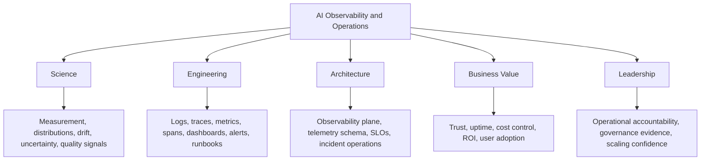

---

## 1. Why AI Observability Is Different

Traditional observability answers:

- Is the service up?
- Is latency acceptable?
- Are errors increasing?
- Is CPU or memory saturated?

AI observability must also answer:

- Was the answer correct?
- Was it grounded?
- Was it safe?
- Did retrieval return the right evidence?
- Did the agent call the right tool?
- Did the tool result change the answer?
- Did the guardrail intervene?
- Did the user accept or rewrite the output?
- Did the business workflow complete?
- What was the cost?

| Dimension | Traditional Software | AI Systems |
|---|---|---|
| correctness | deterministic output | probabilistic quality |
| trace | API/service spans | prompt, RAG, tool, model, agent spans |
| errors | exceptions/status codes | wrong but fluent outputs |
| cost | infra/service cost | tokens, tools, retrieval, GPU, evaluation |
| latency | request duration | TTFT, generation, retrieval, tool loops |
| safety | security/log events | guardrails, refusals, red-team signals |
| user feedback | clicks/conversions | acceptance, edits, escalation, trust |
| operations | uptime | uptime + quality + safety + cost + outcomes |

### Principle

> A 200 OK response is not an AI success metric.

---

## 2. The AI Observability Plane

The observability plane collects signals across the AI workflow.

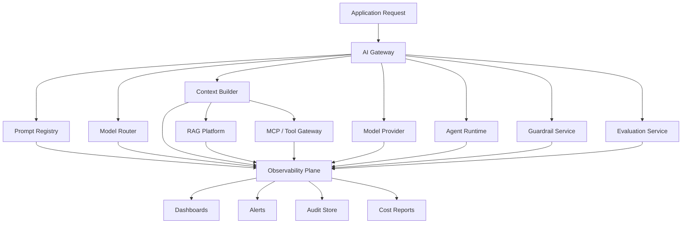

### Core Signals

- logs
- metrics
- traces
- events
- evaluations
- user feedback
- business outcomes
- audit records

---

## 3. AI Trace Schema

Every production AI request needs a trace.

```json
{
  "trace_id": "trace-123",
  "request_id": "req-456",
  "tenant_id": "tenant-a",
  "user_id_hash": "hash-abc",
  "workflow_id": "support_case_draft",
  "environment": "prod",
  "model_provider": "bedrock",
  "model_id": "approved-model",
  "prompt_id": "support_policy_answer",
  "prompt_version": "1.4.2",
  "input_tokens": 2100,
  "output_tokens": 350,
  "retrieval": {
    "knowledge_base": "support-policy-kb",
    "chunks_returned": 5,
    "document_ids": ["policy-44", "policy-51"],
    "citations_used": 3
  },
  "tools": [
    {
      "name": "get_customer_status",
      "risk_tier": 2,
      "latency_ms": 120,
      "status": "success"
    }
  ],
  "guardrails": {
    "input_intervention": false,
    "output_intervention": false
  },
  "latency_ms": 2480,
  "estimated_cost_usd": 0.014,
  "evaluation_score": 0.91,
  "user_feedback": "accepted"
}
```

### Principle

> If a production AI answer cannot be traced, it cannot be trusted at enterprise scale.

---

## 4. Python Trace Capture Scaffold

### Folder

```text
labs/chapter-20-ai-observability/lab1-trace-capture/
  ai_trace.py
  demo_trace.py
  requirements.txt
  tests/test_trace_schema.py
```

### `ai_trace.py`

```python
from __future__ import annotations

import json
import time
import uuid
from contextlib import contextmanager
from dataclasses import dataclass, field, asdict
from typing import Any, Iterator


@dataclass
class AISpan:
    name: str
    started_at: float = field(default_factory=time.time)
    ended_at: float | None = None
    attributes: dict[str, Any] = field(default_factory=dict)

    def finish(self) -> None:
        self.ended_at = time.time()

    @property
    def duration_ms(self) -> float | None:
        if self.ended_at is None:
            return None
        return (self.ended_at - self.started_at) * 1000


@dataclass
class AITrace:
    tenant_id: str
    workflow_id: str
    user_id_hash: str
    trace_id: str = field(default_factory=lambda: str(uuid.uuid4()))
    spans: list[AISpan] = field(default_factory=list)
    attributes: dict[str, Any] = field(default_factory=dict)

    @contextmanager
    def span(self, name: str, **attributes: Any) -> Iterator[AISpan]:
        span = AISpan(name=name, attributes=attributes)
        self.spans.append(span)
        try:
            yield span
        finally:
            span.finish()

    def to_dict(self) -> dict[str, Any]:
        data = asdict(self)
        for span in data["spans"]:
            started = span["started_at"]
            ended = span["ended_at"]
            span["duration_ms"] = (ended - started) * 1000 if ended else None
        return data

    def emit(self) -> None:
        print(json.dumps(self.to_dict(), default=str, sort_keys=True))


if __name__ == "__main__":
    trace = AITrace(tenant_id="tenant-a", workflow_id="support_case", user_id_hash="u_hash")
    with trace.span("ai.rag.retrieve", knowledge_base="support-kb"):
        time.sleep(0.01)
    with trace.span("ai.model.invoke", model="approved-model", provider="bedrock"):
        time.sleep(0.01)
    trace.attributes["estimated_cost_usd"] = 0.012
    trace.emit()
```

### Why This Matters

This scaffold creates the foundation for trace correlation, component latency, workflow debugging, evaluation linkage, audit events, and cost attribution.

### `demo_trace.py`

```python
"""
Run this to see a complete AI workflow trace with RAG, model, tool, and cost spans.
Usage: python demo_trace.py
"""
import time
from ai_trace import AITrace

def demo_support_case_workflow():
    trace = AITrace(
        tenant_id="tenant-a",
        workflow_id="support_case_draft",
        user_id_hash="u_abc123"
    )

    # Span 1: RAG retrieval
    with trace.span("ai.rag.retrieve",
                    knowledge_base="support-policy-kb",
                    chunks_returned=5) as s:
        time.sleep(0.05)   # Simulate retrieval latency
        s.attributes["document_ids"] = ["policy-44", "policy-51", "faq-12"]

    # Span 2: Model invocation
    with trace.span("ai.model.invoke",
                    provider="bedrock",
                    model="claude-sonnet-approved",
                    input_tokens=2100,
                    output_tokens=350) as s:
        time.sleep(0.12)   # Simulate inference latency
        s.attributes["prompt_version"] = "1.4.2"

    # Span 3: Tool call
    with trace.span("ai.tool.call",
                    tool_name="get_customer_status",
                    risk_tier=2,
                    authorized=True) as s:
        time.sleep(0.02)
        s.attributes["status"] = "success"

    # Span 4: Guardrail
    with trace.span("ai.guardrail.apply",
                    policy_id="customer_support_v2",
                    input_intervention=False,
                    output_intervention=False):
        time.sleep(0.005)

    trace.attributes["estimated_cost_usd"] = 0.014
    trace.attributes["evaluation_score"] = 0.91
    trace.attributes["user_feedback"] = "accepted"
    trace.emit()

    return trace

if __name__ == "__main__":
    t = demo_support_case_workflow()
    total = sum(
        (s.duration_ms or 0) for s in t.spans
        if s.name in {"ai.rag.retrieve", "ai.model.invoke"}
    )
    print(f"\nRAG + Model latency: {total:.1f}ms")
    print(f"Spans captured: {len(t.spans)}")
```

### `tests/test_trace_schema.py`

```python
import time
import pytest
from ai_trace import AITrace, AISpan


@pytest.fixture
def basic_trace():
    t = AITrace(tenant_id="t1", workflow_id="w1", user_id_hash="u1")
    with t.span("ai.rag.retrieve", document_ids=["d1", "d2"]):
        time.sleep(0.001)
    with t.span("ai.model.invoke", model="test-model", input_tokens=100):
        time.sleep(0.001)
    t.attributes["estimated_cost_usd"] = 0.005
    return t


def test_trace_has_required_identity_fields(basic_trace):
    d = basic_trace.to_dict()
    for field in ["trace_id", "tenant_id", "workflow_id", "user_id_hash"]:
        assert field in d, f"Required field '{field}' missing from trace"


def test_trace_id_is_unique():
    t1 = AITrace(tenant_id="t", workflow_id="w", user_id_hash="u")
    t2 = AITrace(tenant_id="t", workflow_id="w", user_id_hash="u")
    assert t1.trace_id != t2.trace_id


def test_spans_have_duration(basic_trace):
    for span in basic_trace.spans:
        assert span.duration_ms is not None
        assert span.duration_ms >= 0


def test_rag_span_contains_document_ids(basic_trace):
    rag_spans = [s for s in basic_trace.spans if s.name == "ai.rag.retrieve"]
    assert len(rag_spans) == 1
    assert "document_ids" in rag_spans[0].attributes
    assert len(rag_spans[0].attributes["document_ids"]) > 0


def test_model_span_contains_model_id(basic_trace):
    model_spans = [s for s in basic_trace.spans if s.name == "ai.model.invoke"]
    assert len(model_spans) == 1
    assert "model" in model_spans[0].attributes


def test_cost_field_present(basic_trace):
    d = basic_trace.to_dict()
    assert "estimated_cost_usd" in d["attributes"]
    assert d["attributes"]["estimated_cost_usd"] > 0


def test_trace_serializes_to_valid_json(basic_trace):
    import json
    dumped = json.dumps(basic_trace.to_dict(), default=str)
    parsed = json.loads(dumped)
    assert parsed["tenant_id"] == "t1"
```

---

## 5. OpenTelemetry-Style AI Spans

AI spans should follow a consistent naming pattern.

| Span | Meaning |
|---|---|
| `ai.gateway` | request enters AI gateway |
| `ai.prompt.resolve` | prompt version selected |
| `ai.context.build` | context assembled |
| `ai.rag.retrieve` | retrieval executed |
| `ai.model.invoke` | model/provider called |
| `ai.tool.call` | tool/MCP/API invoked |
| `ai.agent.step` | agent state transition |
| `ai.guardrail.apply` | safety policy applied |
| `ai.eval.score` | evaluation score generated |
| `ai.stream.token` | streaming token emitted |
| `ai.multimodal.preprocess` | document/image/audio/video preprocessing |

### Attributes

```yaml
attributes:
  tenant_id: tenant-a
  workflow_id: support_case
  prompt_id: support_policy_answer
  prompt_version: 1.4.2
  model_provider: bedrock
  model_id: approved-model
  input_tokens: 2200
  output_tokens: 450
  estimated_cost_usd: 0.018
```

### Principle

> Standard span names turn AI debugging from archaeology into operations.

---

## 6. Logs, Metrics, Traces, and Events

Logs explain what happened. Metrics show trends. Traces connect steps. Events record important lifecycle moments.

| Signal | AI Example |
|---|---|
| log | guardrail intervened, tool denied, model timeout |
| metric | p95 latency, TTFT, cost/hour, no-result rate |
| trace | request → retrieval → model → tool → response |
| event | prompt deployed, model route changed, incident declared |
| evaluation | RAG score, safety score, agent completion score |
| feedback | accepted draft, edited answer, escalation |

### Event Example

```json
{
  "event_type": "prompt_version_deployed",
  "prompt_id": "support_policy_answer",
  "version": "1.4.3",
  "owner": "support-platform",
  "eval_score": 0.91,
  "deployed_by": "release-pipeline"
}
```

---

## 7. Prompt Observability

Prompt observability tracks prompt behavior over time.

### Signals

- prompt ID
- prompt version
- owner
- model used
- variable metadata
- evaluation score
- latency
- token usage
- user acceptance
- regression failures
- rollback events

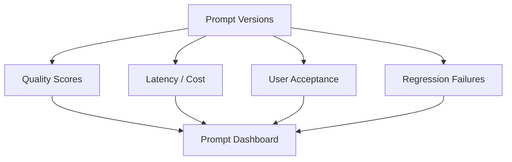

### Production Lesson

A prompt change can break production without throwing an exception. Observability must show prompt version and quality change together.

---

## 8. Model Invocation Observability

Track every model call.

### Required Fields

- provider
- model ID
- route decision
- fallback decision
- input/output token count
- latency
- time to first token if streaming
- error/retry count
- cost estimate
- inference parameters
- data classification
- region
- tenant/workflow

### Model Metrics

| Metric | Why It Matters |
|---|---|
| p95 latency | user experience |
| TTFT | streaming responsiveness |
| tokens/sec | generation throughput |
| error rate | reliability |
| retry rate | hidden cost |
| fallback rate | provider/model health |
| cost/request | economics |
| cost/success | ROI |

---

## 9. RAG Observability

RAG observability separates retrieval failures from generation failures.

### RAG Trace Fields

- knowledge base/index
- retrieval query
- query rewrite if used
- search type
- filters
- number of results
- chunk IDs
- document IDs
- source versions
- citation usage
- retrieval latency
- reranker latency
- freshness metadata
- permission filter applied
- no-result flag

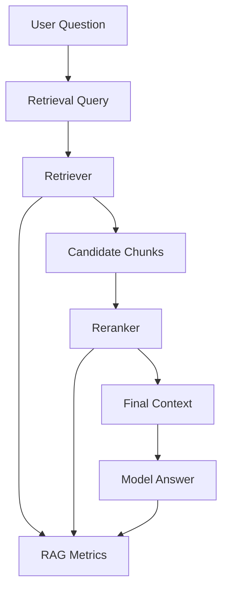

### Key Metrics

- no-result rate
- low-confidence retrieval rate
- citation coverage
- citation support
- stale-source rate
- permission-denial rate
- retrieval latency
- answer groundedness
- user helpfulness score

### Python: RAG Trace Capture

```python
from __future__ import annotations

import time
from dataclasses import dataclass, field
from typing import Optional


@dataclass
class RAGTrace:
    """
    Captures the full retrieval trace for a single RAG operation.
    Attach to the parent AITrace span for end-to-end correlation.
    """
    knowledge_base: str
    query: str
    started_at: float = field(default_factory=time.time)
    ended_at: Optional[float] = None

    # Retrieval results
    chunks_returned: int = 0
    document_ids: list[str] = field(default_factory=list)
    source_versions: dict[str, str] = field(default_factory=dict)   # doc_id -> version
    reranker_used: bool = False
    reranker_latency_ms: Optional[float] = None

    # Quality signals
    no_result: bool = False
    permission_filtered_count: int = 0    # Docs excluded by tenant/ACL filter
    stale_source_ids: list[str] = field(default_factory=list)
    citations_used: int = 0
    citation_support_score: Optional[float] = None   # From evaluation

    # Metadata
    search_type: str = "hybrid"
    metadata_filter: Optional[dict] = None
    query_rewritten: bool = False

    def finish(self, document_ids: list[str], chunks: int) -> "RAGTrace":
        self.ended_at = time.time()
        self.document_ids = document_ids
        self.chunks_returned = chunks
        self.no_result = chunks == 0
        return self

    @property
    def retrieval_latency_ms(self) -> Optional[float]:
        if self.ended_at is None:
            return None
        return (self.ended_at - self.started_at) * 1000

    def to_dict(self) -> dict:
        return {
            "knowledge_base": self.knowledge_base,
            "query_hash": hash(self.query) & 0xFFFFFF,   # Hash for privacy
            "chunks_returned": self.chunks_returned,
            "document_ids": self.document_ids,
            "no_result": self.no_result,
            "permission_filtered_count": self.permission_filtered_count,
            "stale_source_ids": self.stale_source_ids,
            "citations_used": self.citations_used,
            "citation_support_score": self.citation_support_score,
            "reranker_used": self.reranker_used,
            "reranker_latency_ms": self.reranker_latency_ms,
            "retrieval_latency_ms": self.retrieval_latency_ms,
            "search_type": self.search_type,
            "query_rewritten": self.query_rewritten,
        }

    def should_alert(self) -> list[str]:
        """Return alert conditions that should trigger operational review."""
        alerts = []
        if self.no_result:
            alerts.append("rag.no_result: retrieval returned zero chunks")
        if self.stale_source_ids:
            alerts.append(f"rag.stale_sources: {len(self.stale_source_ids)} stale source(s)")
        if self.permission_filtered_count > 3:
            alerts.append(f"rag.high_permission_filter: {self.permission_filtered_count} docs filtered")
        if self.citation_support_score is not None and self.citation_support_score < 0.6:
            alerts.append(f"rag.low_citation_support: score {self.citation_support_score:.2f}")
        return alerts
```

### Production Lesson

When a RAG answer is wrong, the first question is:

> Did the retriever bring the right evidence?

The `should_alert()` method maps four common RAG failures to operational signals: zero results (knowledge base sync or query issue), stale sources (ingestion pipeline failure), excessive permission filtering (tenant ACL misconfiguration), and low citation support (retrieval quality degradation). Each is a different root cause requiring a different runbook.

---

## 10. Tool and MCP Observability

Tools create operational and security risk.

### Tool Trace Fields

- tool name
- MCP server or API
- risk tier
- user/tenant
- authorization decision
- approval ID if required
- parameters metadata
- status
- latency
- retry count
- error reason
- output size
- output filtered/masked flag

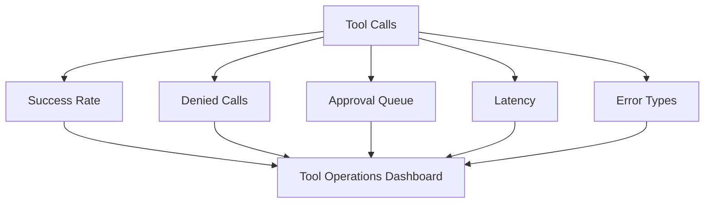

### Tool Metrics

- calls by tool
- failure rate by tool
- unauthorized attempt rate
- approval wait time
- high-risk action count
- output filtering rate
- tool cost
- tool-related incidents

---

## 11. Agent Observability

Agents require trace-level observability.

Final answers are not enough.

### Agent Trace Fields

- agent ID/version
- session ID
- state transitions
- selected tools
- tool parameters
- observations
- knowledge base queries
- guardrail decisions
- loop count
- stop reason
- escalation reason
- human approval
- final outcome
- cost
- latency

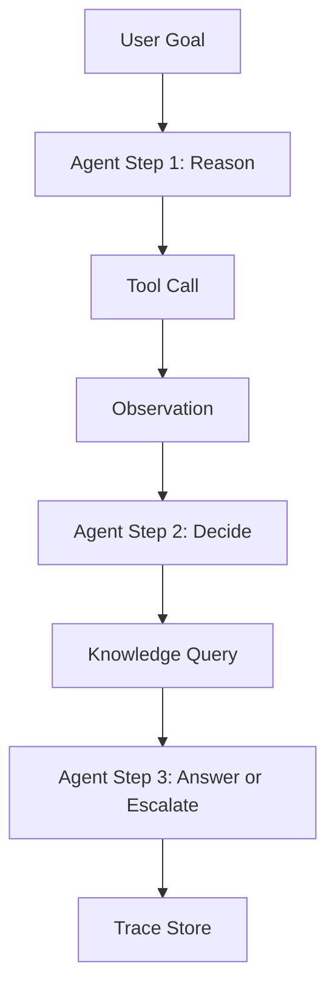

### Agent Operational Metrics

- task completion rate
- tool-call accuracy
- approval correctness
- loop count
- stop-condition failures
- escalation rate
- cost per completed task
- trace quality score

### Agent Trace Schema

```json
{
  "trace_id": "trace-ops-789",
  "agent_id": "incident-investigation-v2",
  "session_id": "session-case-1234",
  "tenant_id": "device-ops",
  "workflow_id": "incident_investigation",
  "goal": "Investigate heartbeat failures in NA region for payments terminals",
  "started_at": "2026-06-27T14:00:00Z",
  "completed_at": "2026-06-27T14:00:28Z",
  "total_latency_ms": 28410,
  "estimated_cost_usd": 0.089,
  "stop_reason": "goal_complete",
  "loop_count": 4,
  "max_steps": 10,
  "state_transitions": [
    {
      "step": 1,
      "node": "classify_intent",
      "input_summary": "heartbeat failure investigation NA",
      "output_summary": "intent=incident_investigation severity=high",
      "latency_ms": 820
    },
    {
      "step": 2,
      "node": "gather_evidence",
      "tool_calls": [
        {
          "tool": "get_device_telemetry",
          "risk_tier": 2,
          "authorized": true,
          "params": {"product": "payments", "region": "NA", "hours_back": 24},
          "latency_ms": 145,
          "status": "success"
        },
        {
          "tool": "search_runbook",
          "risk_tier": 1,
          "authorized": true,
          "params": {"query": "heartbeat failure payments terminal"},
          "latency_ms": 290,
          "status": "success"
        }
      ],
      "latency_ms": 4200
    },
    {
      "step": 3,
      "node": "generate_recommendation",
      "output_summary": "Firmware v3.1.2 rollout correlated with failure spike. Recommend staged rollback.",
      "requires_approval": true,
      "latency_ms": 3100
    },
    {
      "step": 4,
      "node": "human_approval",
      "approval_id": "APR-C4D2E1F0",
      "approver_role": "operations",
      "decision": "approved",
      "approval_latency_ms": 18500
    }
  ],
  "rag_queries": [
    {
      "knowledge_base": "operations-runbooks",
      "chunks_returned": 4,
      "document_ids": ["runbook-heartbeat-v3", "firmware-3.1.2-notes"],
      "no_result": false
    }
  ],
  "guardrail_decisions": {
    "input_intervention": false,
    "output_intervention": false
  },
  "outcome": {
    "goal_achieved": true,
    "final_recommendation": "Staged rollback of firmware 3.1.2 approved",
    "human_approved": true,
    "evaluation_score": 0.93
  }
}
```

### Production Lesson

An agent can produce a good final answer through an unsafe path. Evaluate the path.

The agent trace schema above captures `state_transitions`, `tool_calls` within each step (with `authorized` flag), `loop_count`, and `stop_reason`. Without these fields, the only observable signal is the final recommendation. With them, an operations team can detect that an agent called a tool 4 times when it should have called it once, or that the loop count is trending upward across sessions (a signal of prompt or knowledge base degradation).

---

## 12. Guardrail Observability

Guardrails must be measured.

### Guardrail Signals

- policy ID/version
- input intervention
- output intervention
- denied topic
- PII masked
- prompt attack detected
- grounding failure
- automated reasoning failure
- intervention message shown
- false positive reports
- false negative incidents
- user recovery after intervention

### Guardrail Metrics

| Metric | Meaning |
|---|---|
| intervention rate | percent blocked/masked |
| false positive rate | safe content blocked |
| false negative rate | unsafe content allowed |
| user recovery rate | user completes workflow after intervention |
| policy drift | changing intervention pattern |
| high-risk intervention count | governance signal |

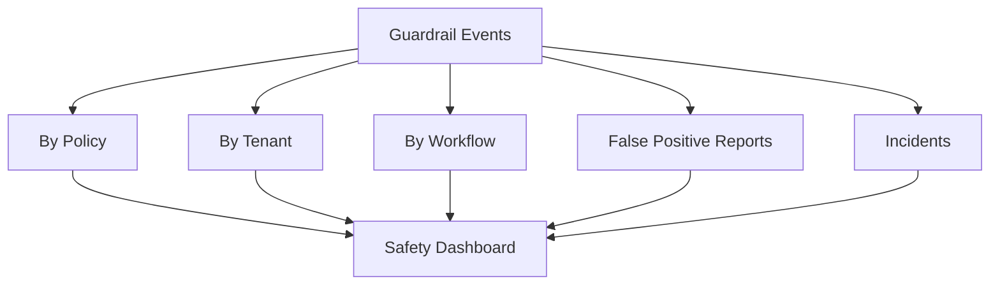

---

## 13. Evaluation Telemetry

Evaluation should connect offline tests and production behavior.

### Evaluation Signals

- eval suite ID
- dataset version
- rubric version
- judge model
- human review sample
- pass/fail
- quality score
- safety score
- RAG score
- agent score
- cost score
- latency score
- release decision
- production drift signal

### Evaluation Event

```json
{
  "event_type": "ai_evaluation_result",
  "application": "support-assistant",
  "eval_suite_id": "support-rag-v4",
  "dataset_version": "2026-06-27",
  "quality_score": 0.89,
  "safety_score": 0.99,
  "rag_score": 0.86,
  "release_gate": "passed"
}
```

### Incident-to-Test Loop

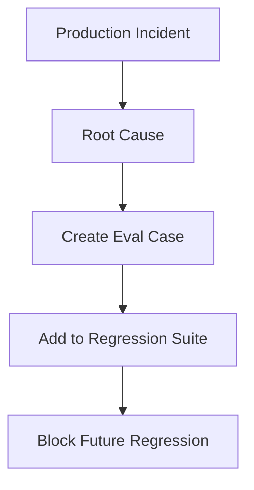

---

## 14. Cost Observability

AI cost must be visible by workflow.

### Cost Dimensions

- tenant
- workflow
- user group
- provider
- model
- prompt version
- retrieval source
- tool
- guardrail
- evaluation
- environment
- successful outcome

### Cost Trace Example

```json
{
  "tenant_id": "device-ops",
  "workflow_id": "incident_summary",
  "model_cost_usd": 0.042,
  "retrieval_cost_usd": 0.004,
  "tool_cost_usd": 0.002,
  "guardrail_cost_usd": 0.001,
  "total_cost_usd": 0.049,
  "workflow_success": true
}
```

### Cost Metrics

- cost per request
- cost per successful task
- cost per accepted output
- cost per tenant
- cost by model
- cost by prompt version
- cost by tool
- retry cost
- abandoned stream cost
- evaluation cost

### Principle

> Cost without outcome is accounting. Cost per successful workflow is AI FinOps.

---

## 15. Multi-Tenant Observability

Multi-tenant platforms need tenant-level visibility.

### Tenant Signals

- request volume
- token volume
- cost
- latency
- model usage
- RAG source usage
- tool usage
- guardrail interventions
- quota rejections
- cache hit rate
- evaluation score
- incidents
- streaming cancellations

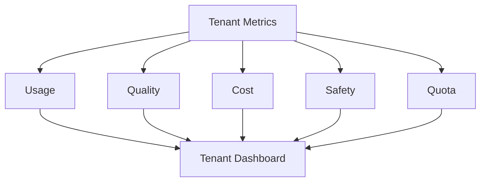

### Noisy-Neighbor Detection

Detect:

- tenant consuming excessive tokens
- tenant causing queue delays
- tenant triggering high error rates
- tenant exceeding budget
- tenant causing GPU saturation
- tenant with abnormal guardrail interventions

### Rule

Tenant observability must not leak other tenants' prompts, logs, costs, or documents.

---

## 16. Streaming Observability

Streaming requires specialized telemetry.

### Streaming Metrics

- time to first token
- tokens per second
- stream duration
- completed streams
- cancelled streams
- disconnected streams
- partial output size
- server-side cancellation success
- final validation result
- unsafe partial output incidents
- cost of abandoned streams

### Streaming Event Schema

```json
{
  "event_type": "ai_stream_completed",
  "trace_id": "trace-123",
  "tenant_id": "tenant-a",
  "workflow_id": "support_draft",
  "ttft_ms": 620,
  "tokens_per_second": 42.5,
  "cancelled": false,
  "client_disconnected": false,
  "final_validation": "passed",
  "estimated_cost_usd": 0.017
}
```

### Streaming Operational Pattern

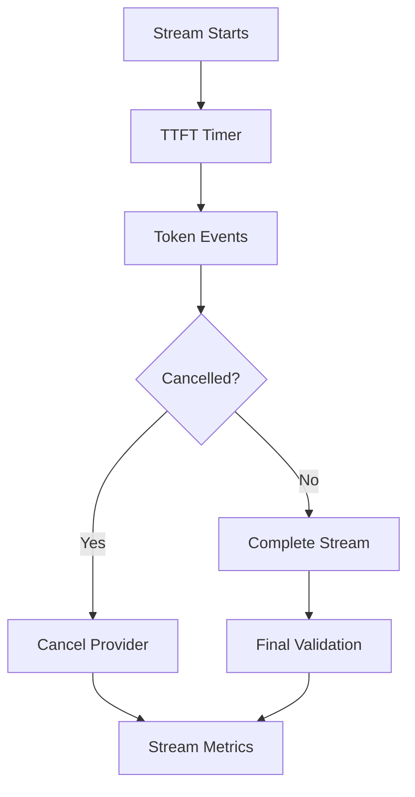

### Streaming Metrics Python Scaffold

```python
from dataclasses import dataclass
import time


@dataclass
class StreamMetrics:
    started_at: float
    first_token_at: float | None = None
    completed_at: float | None = None
    token_count: int = 0
    cancelled: bool = False
    disconnected: bool = False

    def on_token(self) -> None:
        if self.first_token_at is None:
            self.first_token_at = time.time()
        self.token_count += 1

    def finish(self) -> dict:
        self.completed_at = time.time()
        duration = max(self.completed_at - self.started_at, 0.001)
        return {
            "ttft_ms": None if self.first_token_at is None else (self.first_token_at - self.started_at) * 1000,
            "tokens_per_second": self.token_count / duration,
            "token_count": self.token_count,
            "cancelled": self.cancelled,
            "disconnected": self.disconnected,
        }
```

### Production Lesson

If cancellation does not propagate to the provider, the UI stops but the bill continues.

### `tests/test_stream_metrics.py`

```python
import time
import pytest
from stream_metrics import StreamMetrics


def test_ttft_recorded_on_first_token():
    m = StreamMetrics(started_at=time.time())
    time.sleep(0.01)
    m.on_token()
    result = m.finish()
    assert result["ttft_ms"] is not None
    assert result["ttft_ms"] >= 10  # At least 10ms


def test_ttft_is_none_if_no_tokens():
    m = StreamMetrics(started_at=time.time())
    result = m.finish()
    assert result["ttft_ms"] is None


def test_token_count_increments():
    m = StreamMetrics(started_at=time.time())
    for _ in range(10):
        m.on_token()
    result = m.finish()
    assert result["token_count"] == 10


def test_tokens_per_second_positive():
    m = StreamMetrics(started_at=time.time())
    time.sleep(0.05)
    for _ in range(5):
        m.on_token()
    result = m.finish()
    assert result["tokens_per_second"] > 0


def test_cancelled_flag_propagated():
    m = StreamMetrics(started_at=time.time())
    m.on_token()
    m.cancelled = True
    result = m.finish()
    assert result["cancelled"] is True


def test_disconnected_flag_propagated():
    m = StreamMetrics(started_at=time.time())
    m.disconnected = True
    result = m.finish()
    assert result["disconnected"] is True


def test_abandoned_stream_cost_tracked_separately():
    """Cancelled streams must be reported separately from completed streams for FinOps."""
    completed = StreamMetrics(started_at=time.time())
    for _ in range(50):
        completed.on_token()
    c_result = completed.finish()

    abandoned = StreamMetrics(started_at=time.time())
    for _ in range(15):
        abandoned.on_token()
    abandoned.cancelled = True
    a_result = abandoned.finish()

    # Ensure both are captured and distinguishable
    assert c_result["token_count"] == 50
    assert c_result["cancelled"] is False
    assert a_result["token_count"] == 15
    assert a_result["cancelled"] is True
    # Abandoned cost = tokens generated * cost_per_token, regardless of cancellation
    # This test ensures the metrics exist to compute it downstream
```

---

## 17. Multimodal Observability

Multimodal workflows require modality-specific signals.

### Signals by Modality

| Modality | Observability Signals |
|---|---|
| document | parser used, page count, extraction errors |
| image | size, OCR confidence, detected PII, visual confidence |
| audio | duration, transcript confidence, noise level |
| video | sampled frames, frame selection method, event confidence |
| table | extraction format, schema validity |
| code | repository, files referenced, tests generated |

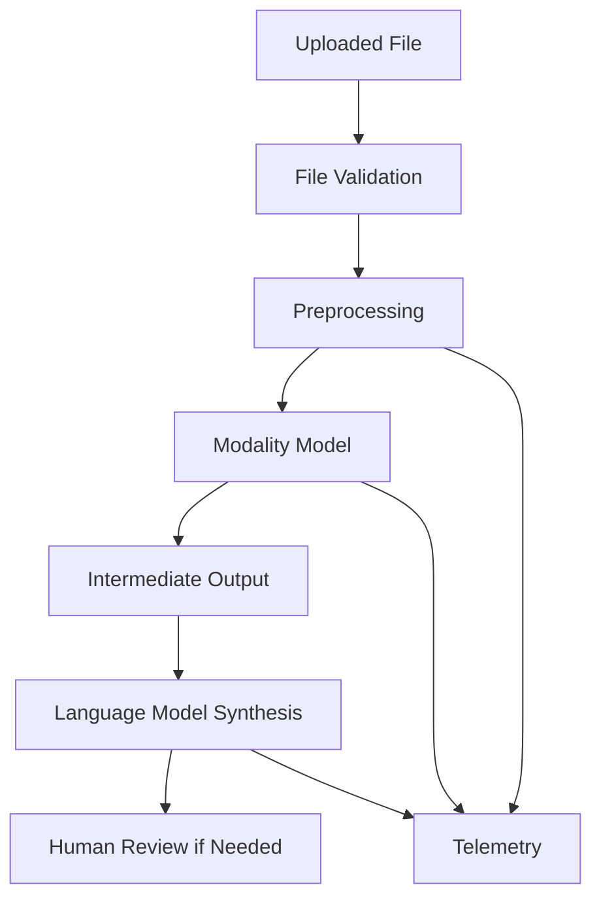

### Device Operations Example

For a terminal damage photo:

- image accepted
- EXIF stripped
- OCR attempted
- serial number masked
- visual defect classification
- confidence score
- human review flag
- final recommendation

---

## 18. AWS Observability Surface

AWS-centric AI platforms should use AWS observability capabilities as part of the platform.

### AWS Mapping

| Need | AWS Capability Pattern |
|---|---|
| API logs | API Gateway / ALB logs |
| Lambda tool logs | CloudWatch Logs |
| Bedrock API audit | CloudTrail |
| application metrics | CloudWatch Metrics |
| distributed traces | X-Ray / OpenTelemetry-compatible tracing |
| EKS model serving metrics | CloudWatch Container Insights / Prometheus |
| NVIDIA GPU metrics | DCGM exporter + Prometheus/Grafana |
| security events | Security Hub / CloudTrail / SIEM |
| cost | AWS Cost Explorer / CUR / tags |
| events | EventBridge |
| runbooks | Systems Manager / internal ops platform |

### AWS AI Observability Pattern

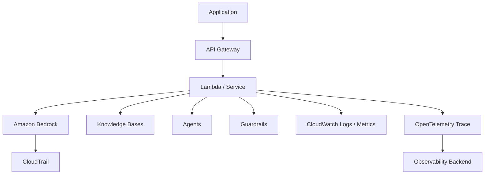

### Principle

Use AWS-native telemetry where useful, but normalize all AI signals into the enterprise observability schema.

---

## 19. NVIDIA / Self-Hosted Observability

Self-hosted inference requires deeper infrastructure metrics.

### Metrics

- GPU utilization
- GPU memory
- model queue depth
- active sequences
- KV cache utilization
- time to first token
- output tokens/sec
- batch size
- queue delay
- model load time
- pod restarts
- node saturation
- tenant GPU usage
- idle GPU cost

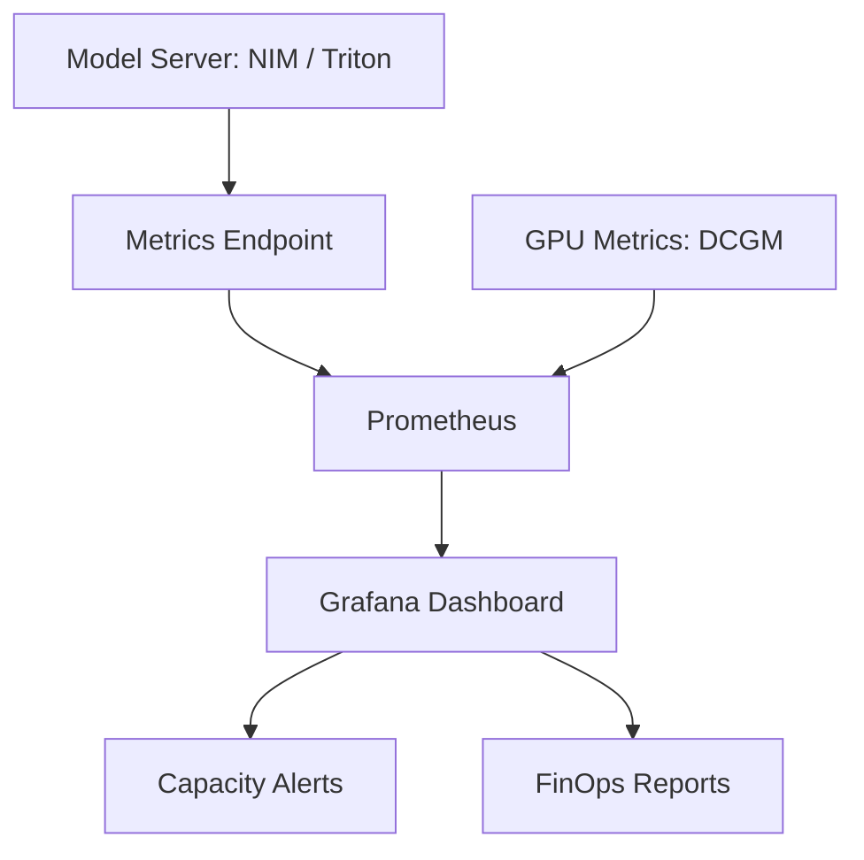

### Production Lesson

GPU utilization without workflow success metrics can mislead. A busy GPU can still serve low-quality or useless outputs.

---

## 20. SLOs and SLIs for AI

AI SLOs should cover availability, latency, quality, safety, and cost.

| Category | SLO |
|---|---|
| availability | 99.9% successful AI gateway requests |
| latency | p95 response under 6 seconds |
| streaming | p95 TTFT under 1 second |
| quality | weekly eval score above 0.86 |
| safety | zero critical unsafe actions |
| RAG | citation support above 0.90 |
| agent | task completion above 0.85 |
| cost | cost per completed task under target |
| tenant | no tenant exceeds quota without approval |

### SLO Config

```yaml
slo:
  workflow: support_case_draft
  availability: 0.999
  p95_latency_ms: 6000
  p95_ttft_ms: 1000
  min_quality_score: 0.86
  min_safety_score: 0.98
  max_cost_per_successful_task_usd: 0.05
  max_guardrail_false_positive_rate: 0.03
```

### Principle

AI SLOs must include quality and safety, not just uptime.

---

## 21. Alerting

Alerts should map to actionable runbooks.

| Alert | Runbook |
|---|---|
| p95 latency breach | latency triage |
| model error spike | provider failover |
| RAG no-result spike | retrieval/source sync investigation |
| guardrail intervention spike | safety/product review |
| cost spike | FinOps triage |
| tool failure spike | tool/API owner escalation |
| agent loop spike | agent rollback |
| TTFT spike | streaming/server capacity triage |
| tenant quota breach | tenant owner review |
| evaluation score drop | release rollback |

### Alert Config

```yaml
alerts:
  - name: rag_no_result_rate_high
    metric: rag.no_result_rate
    threshold: 0.15
    window: 15m
    severity: high
    runbook: runbooks/rag-no-result.md

  - name: ai_cost_spike
    metric: ai.cost.usd_per_hour
    threshold_percent_over_baseline: 50
    window: 1h
    severity: medium
    runbook: runbooks/cost-spike.md
```

---

## 22. AI Incident Types

AI incidents include more than outages.

### Incident Categories

- model provider outage
- latency degradation
- streaming failure
- hallucination spike
- RAG retrieval failure
- stale knowledge source
- cross-tenant retrieval
- tool/API failure
- unauthorized tool attempt
- guardrail overblocking
- guardrail underblocking
- cost spike
- agent loop
- prompt regression
- evaluation score drop
- multimodal misclassification
- user trust incident

### Incident Flow

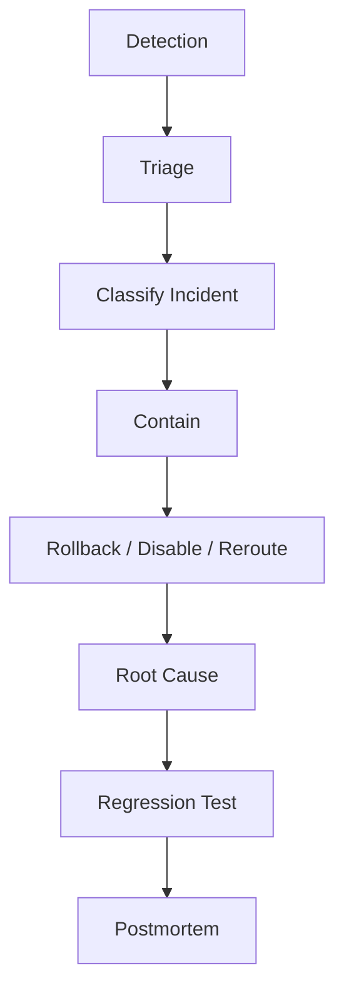

---

## 23. AI Operational Runbooks

Runbooks convert alerts into action.

### Runbook Template

```yaml
runbook:
  name: rag_no_result_spike
  owner: ai-platform
  severity: high
  symptoms:
    - no_result_rate > 15%
    - user feedback drops
  first_checks:
    - check knowledge base sync status
    - check vector store health
    - check metadata filters
    - check recent deployment
  containment:
    - route to fallback search
    - disable recent retrieval config
    - notify support team
  recovery:
    - resync source
    - rollback retrieval config
    - rerun evaluation suite
  follow_up:
    - add failed queries to golden dataset
```

### Principle

Every AI alert must have a named owner and a runbook.

---

## 24. Canary and Rollback

AI changes should roll out gradually.

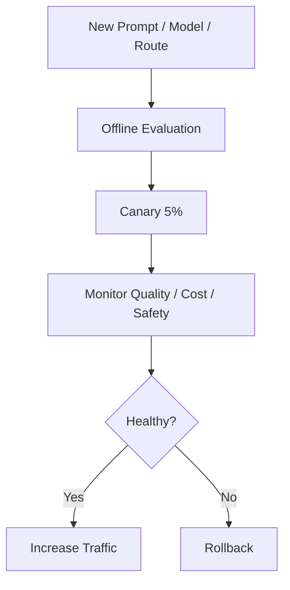

### Rollback Triggers

- quality score drop
- safety incident
- guardrail spike
- latency breach
- cost spike
- tool failure
- user acceptance drop
- tenant complaint
- agent loop increase

### Rollback Targets

- model route
- prompt version
- retrieval config
- guardrail policy
- tool
- MCP server
- agent graph
- streaming mode

---

## 25. Production Feedback Loops

User feedback must feed evaluation and product improvement.

### Feedback Signals

- thumbs up/down
- accepted draft
- edited draft
- escalation
- abandoned workflow
- repeated request
- manual override
- human review result
- support outcome
- customer satisfaction
- incident resolution time

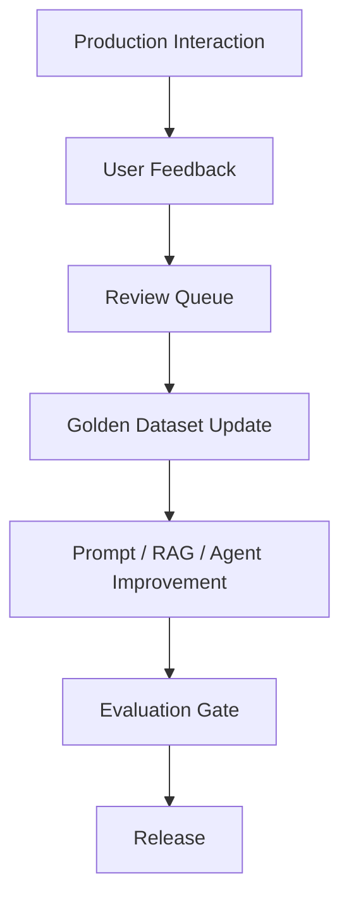

### Python: User Feedback Capture

```python
from __future__ import annotations

import json
import uuid
from dataclasses import dataclass
from datetime import datetime, timezone
from enum import Enum
from typing import Optional


class FeedbackSignal(str, Enum):
    ACCEPTED   = "accepted"       # User used the AI output without modification
    EDITED     = "edited"         # User used output but modified it
    REJECTED   = "rejected"       # User discarded the output
    ESCALATED  = "escalated"      # User escalated to human (bypassing AI output)
    ABANDONED  = "abandoned"      # User left without using output
    THUMBS_UP  = "thumbs_up"      # Explicit positive signal
    THUMBS_DOWN = "thumbs_down"   # Explicit negative signal


@dataclass
class FeedbackEvent:
    trace_id: str
    tenant_id: str
    workflow_id: str
    signal: FeedbackSignal
    prompt_version: str
    model_id: str
    edit_distance: Optional[int] = None    # Characters changed if EDITED
    escalation_reason: Optional[str] = None
    note: Optional[str] = None

    def to_audit_event(self) -> dict:
        return {
            "event_type": "ai_user_feedback",
            "event_id": str(uuid.uuid4()),
            "trace_id": self.trace_id,
            "tenant_id": self.tenant_id,
            "workflow_id": self.workflow_id,
            "signal": self.signal.value,
            "prompt_version": self.prompt_version,
            "model_id": self.model_id,
            "edit_distance": self.edit_distance,
            "escalation_reason": self.escalation_reason,
            "note": self.note,
            "timestamp": datetime.now(timezone.utc).isoformat()
        }

    def qualifies_for_golden_dataset(self) -> bool:
        """
        Accepted outputs with no edits are candidates for golden dataset positive examples.
        Rejected or escalated outputs with notes are candidates for failure examples.
        """
        if self.signal == FeedbackSignal.ACCEPTED and self.edit_distance == 0:
            return True
        if self.signal in {FeedbackSignal.REJECTED, FeedbackSignal.ESCALATED} and self.note:
            return True
        return False


def emit_feedback(event: FeedbackEvent) -> None:
    """In production: route to feedback queue / evaluation service."""
    audit = event.to_audit_event()
    print(json.dumps(audit, sort_keys=True))
    if event.qualifies_for_golden_dataset():
        print(f"  → Flagged for golden dataset review: trace {event.trace_id}")


# Key Engineering Notes:
# - emit_feedback() should write to a dedicated feedback queue, not just logs
# - edit_distance on EDITED feedback distinguishes minor tweaks from full rewrites
# - FeedbackSignal.ESCALATED is the strongest negative signal: user judged AI output untrustworthy
# - Track acceptance rate by prompt_version to detect regressions from prompt changes
# - Acceptance rate drop of >5pp should trigger a prompt regression review before the next release
```

### Principle

Feedback becomes valuable only when it changes evaluation or product decisions.

---

## 26. Component-Level Observability Testing

### Test Matrix

| Component | Test |
|---|---|
| gateway | trace ID and tenant ID recorded |
| model call | model/provider/tokens recorded |
| prompt | prompt ID/version recorded |
| RAG | retrieved doc IDs recorded |
| tool | tool name/risk/status recorded |
| agent | state transitions recorded |
| guardrail | policy/version/decision recorded |
| streaming | TTFT/cancel/completion recorded |
| multimodal | file metadata and confidence recorded |
| cost | estimated cost recorded |

### Pytest Examples

```python
def test_trace_has_required_ai_fields(trace):
    required = ["trace_id", "tenant_id", "workflow_id", "model_id", "prompt_version"]
    for field in required:
        assert field in trace


def test_rag_trace_contains_document_ids(trace):
    assert "retrieval" in trace
    assert "document_ids" in trace["retrieval"]
    assert len(trace["retrieval"]["document_ids"]) > 0


def test_streaming_trace_has_ttft(stream_trace):
    assert stream_trace["ttft_ms"] > 0
    assert "cancelled" in stream_trace
```

---

## 27. AI Operations Dashboard

### Executive Dashboard

- adoption
- cost
- workflow success
- quality score
- safety score
- major incidents
- ROI estimate

### Platform Dashboard

- requests
- latency
- errors
- model usage
- token usage
- cost
- provider health
- fallback rate

### Quality Dashboard

- eval score
- user acceptance
- groundedness
- RAG quality
- agent task completion
- guardrail false positives

### Security Dashboard

- prompt attacks
- denied tool attempts
- PII masking
- cross-tenant denials
- audit exceptions

### FinOps Dashboard

- cost by tenant
- cost by workflow
- cost by provider
- cost per success
- budget burn
- idle GPU cost

---

## 28. Production Lessons from the Field

### Production Context

The following lessons come from six years of operating production AI systems (SupportIQ, TriageIQ, CertifyIQ, DeviceIQ) managing connected device infrastructure at scale. Observability was not a post-launch addition — it was a design requirement from the first production deployment. The patterns below reflect what actually happened when observability was absent or insufficient, and what was built to fix it.

### Lesson 1: AI Failures Often Look Like Success

A fluent answer can be wrong. A 200 OK can be harmful.

The first production deployment of SupportIQ had full API monitoring: response times, HTTP status codes, error rates. All metrics looked excellent. Three weeks in, a support manager escalated that agents had been relying on policy answers that referenced an old refund threshold. The model was confident, the answer was fluent, and the customers had been given incorrect information.

The API had returned 200. The model had returned confident text. The telemetry had shown no anomaly. The failure was invisible until a human caught it.

What was built after:

- production sampling: 5% of responses evaluated by the LLM judge automatically against the current golden dataset
- citation support score tracked per session — a drop signals retrieval or generation degradation before users notice
- prompt version logged with every request — the misconfigured policy answers were eventually traced to a prompt version that had been deployed without evaluation

What failed before:

- API uptime as the primary quality signal
- no groundedness or citation telemetry
- no connection between model output and knowledge base currency

### Lesson 2: RAG Freshness Needs Alerts

Stale knowledge silently creates wrong answers.

DeviceIQ uses a knowledge base of firmware release notes, error code definitions, and device configuration runbooks. In one quarter, the ingestion pipeline for firmware release notes failed silently — the sync job's CloudWatch alarm had not been configured for failure events, only for throughput. The knowledge base continued serving firmware notes that were 47 days behind the live release schedule.

Agents investigating heartbeat failures were retrieving guidance that referred to a firmware version that no longer existed in the production fleet. Recommendations were technically correct for the stale data but wrong for the actual environment.

What was built after:

- `last_synced_at` metadata on every document; alert when any source exceeds 24-hour freshness threshold
- ingestion pipeline success/failure events routed to the observability plane, not just CloudWatch logs
- `stale_source_ids` field in every RAG trace — queries that retrieved stale documents flagged for human review

### Lesson 3: Agent Debugging Requires Traces

Without traces, operational teams debate instead of debug.

In TriageIQ, an L4 triage agent produced an incorrect root-cause hypothesis for a class of firmware errors. Three engineers spent four hours debating whether the issue was the knowledge base content, the prompt, or the model's reasoning. No one could prove any position because the only observable output was the final recommendation text.

The trace investigation protocol was built after this incident: every agent step, every tool call with parameters, every knowledge base query, every observation, and every stop reason captured and queryable. The next similar incident was resolved in 18 minutes by tracing the step sequence and identifying that the runbook retrieval for that error code returned zero results, causing the agent to reason from general knowledge rather than authoritative evidence.

### Lesson 4: Cost Spikes Hide in Retries and Loops

AI cost spikes often appear not in model calls but in retries, long context, and agent loops.

SupportIQ had a context assembly bug that, for a specific category of complex cases with many retrieved chunks, assembled a prompt that exceeded the model's context window. The model call failed with a context length error. The application retried automatically. The retry failed with the same error. After three retries, the request was abandoned.

Each failed retry consumed input tokens for the full context before the error. In peak hours with 200 concurrent complex cases, the failed-retry cost was approximately 34% of total daily model cost — all waste, no successful outputs.

What was built after:

- token budget estimation before the model call; requests exceeding budget are truncated at the context builder, not at the model
- retry cost tracked separately from successful call cost in the FinOps dashboard
- abandoned-request rate alerted separately from error rate

### Lesson 5: Streaming Needs Operational Ownership

Streaming breaks differently than request/response APIs.

A SupportIQ feature added streaming for longer draft responses to reduce perceived wait time. Within two weeks, an operations escalation reported that the streaming cost was 22% higher than the synchronous baseline for the same workflow. Investigation revealed that call center agents frequently clicked away from the response before it completed — the browser tab was closed but the server kept generating for an average of 8 additional seconds per abandoned session.

What was built after:

- TTFT (time to first token) tracked per request as a streaming UX SLO
- disconnect event captured and propagated to the provider within 500ms
- abandoned stream cost tracked as a separate FinOps line item, not merged with successful streams
- streaming disabled for high-risk regulatory workflows where post-generation validation is required


What worked:

- source sync dashboards
- freshness metadata
- stale-source alerts
- owner notifications

What failed:

- one-time indexing
- no failed ingestion alerts
- no document owner

### Lesson 3: Agent Debugging Requires Traces

Without traces, teams debate instead of debug.

What worked:

- agent step traces
- tool parameter logs
- stop reasons
- approval events

What failed:

- final answer only
- no tool observation capture
- no agent version tracking

### Lesson 4: Cost Spikes Hide in Retries and Loops

AI cost spikes often come from retries, long context, or agent loops.

What worked:

- token budgets
- loop limits
- retry cost dashboards
- abandoned stream cost tracking

What failed:

- cost only at monthly invoice
- no workflow-level cost

### Lesson 5: Streaming Needs Operational Ownership

Streaming breaks differently than request/response APIs.

What worked:

- TTFT metrics
- cancellation propagation
- disconnect counters
- final validation

What failed:

- no stream lifecycle telemetry
- no cancellation accounting

---

## 29. Capstone Observability Architecture

The Enterprise Agentic Operations Platform needs full-stack observability.

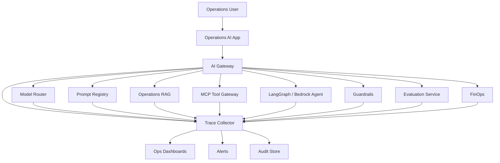

### Capstone Dashboards

- incident assistant quality
- RAG freshness
- telemetry tool health
- agent traces
- customer impact tool errors
- executive summary acceptance
- cost per incident investigation
- high-risk approval latency
- streaming TTFT
- multimodal inspection confidence

---

## 30. Production Readiness Checklist

Before launching an AI system:

- [ ] trace schema defined
- [ ] trace ID generated for every request
- [ ] tenant/workflow metadata required
- [ ] model/provider/prompt version logged
- [ ] token usage captured
- [ ] RAG trace captured if used
- [ ] tool trace captured if tools used
- [ ] agent trace captured if agents used
- [ ] guardrail trace captured if guardrails used
- [ ] evaluation score connected
- [ ] cost estimate captured
- [ ] streaming telemetry captured if streaming used
- [ ] multimodal telemetry captured if used
- [ ] SLOs defined
- [ ] alerts configured
- [ ] runbooks created
- [ ] dashboards created
- [ ] audit logging reviewed
- [ ] PII/logging policy reviewed
- [ ] incident-to-test loop defined

---

## 31. Architecture Review Scenario

### Scenario

A company launches a support RAG assistant. The system logs only API status code, latency, and user ID.

### Review Finding

This is not production-operable.

### Missing Signals

- prompt version
- model ID
- retrieval query
- retrieved documents
- citation support
- guardrail decisions
- user acceptance
- token cost
- evaluation score
- tenant/workflow
- stale source status

### Improved Architecture

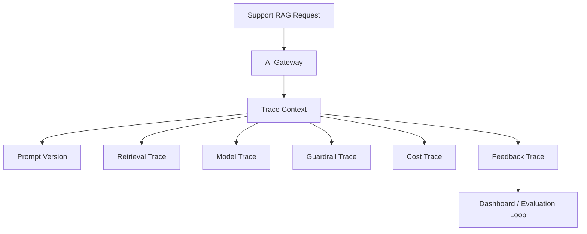

### Recommendation

Treat observability as a launch requirement, not a post-launch enhancement.

---

## 32. ROI and CTO Perspective

### Observability ROI

AI observability creates ROI by reducing MTTR, preventing quality regressions, eliminating waste, and providing governance evidence. The five production lessons in Section 28 each represent a measurable cost or risk that observability made visible and addressable:

- Silent quality failures discovered through production sampling and citation scoring
- RAG freshness failures detected through source freshness metadata rather than customer escalations
- Agent debugging reduced from hours to minutes through step-level traces
- Retry cost waste identified through separated cost attribution
- Streaming abandonment cost quantified and eliminated through disconnect propagation

The ROI question every platform team should answer before investing in observability infrastructure:

> What is the cost of one incident that observability would have detected 48 hours earlier?

For production AI at enterprise scale, the answer justifies the investment in almost every case.

### Observability Investment Tiers

| Tier | What It Covers | When to Build |
|---|---|---|
| Minimum | trace ID, tenant, model, prompt version, cost | Before first production launch |
| Standard | + RAG trace, tool trace, guardrail decisions, streaming telemetry | Before 10+ concurrent workflows |
| Full | + agent traces, evaluation telemetry, user feedback, SLOs, runbooks | Before enterprise scale |

### CTO Perspective

A CTO should be able to answer yes to each of these:

- Can we trace every AI answer that reached a customer or influenced a production decision?
- Can we explain cost per workflow — not cost per token?
- Can we detect quality drift before users escalate?
- Can we prove guardrails worked in the last 30 days?
- Can we replay and debug a specific agent run from 3 weeks ago?
- Can we roll back a prompt or model route in under 30 minutes?
- Can business leaders see quality and outcome metrics without asking engineers?
- Can security audit high-risk tool actions by tenant and user?

If the answer to any of these is no, observability is incomplete for enterprise AI at that organization's stage.

---

## 33. Pratik's Principles

### Principle 1: A Fluent Answer Is Not an Operational Signal

Measure quality, grounding, safety, and outcome.

### Principle 2: Every AI Workflow Needs a Trace

If you cannot trace it, you cannot govern it.

### Principle 3: Separate Retrieval Failures from Generation Failures

Debug RAG in layers.

### Principle 4: Agent Observability Requires the Path

Final answers are not enough.

### Principle 5: Cost Must Be Attached to Workflow Success

Token cost alone is incomplete.

### Principle 6: Streaming Is a Lifecycle

Measure start, first token, cancellation, disconnect, completion, and validation.

### Principle 7: Incidents Become Regression Tests

Every production failure should strengthen the evaluation suite.

### Principle 8: Observability Is a Leadership Tool

It turns AI from belief into managed evidence.

---

## 34. Hands-On Labs with Scaffolding

### Lab 1: AI Trace Capture

```text
labs/chapter-20-ai-observability/lab1-trace-capture/
  ai_trace.py
  demo_trace.py
  requirements.txt
  tests/test_trace_schema.py
```

Tasks:

1. Create an AI trace.
2. Add spans for RAG, model, and tool.
3. Emit JSON trace.
4. Add schema tests.

---

### Lab 2: Streaming Telemetry

```text
labs/chapter-20-ai-observability/lab2-streaming-telemetry/
  stream_metrics.py
  demo_stream.py
  tests/test_stream_metrics.py
```

Tasks:

1. Track TTFT.
2. Track tokens/sec.
3. Track cancellation.
4. Emit stream lifecycle event.

---

### Lab 3: RAG Observability

```text
labs/chapter-20-ai-observability/lab3-rag-observability/
  rag_trace.py
  sample_trace.json
  tests/test_rag_trace.py
```

Tasks:

1. Capture retrieval query.
2. Capture document IDs.
3. Capture freshness metadata.
4. Add no-result alert condition.

---

### Lab 4: Agent Trace Dashboard

```text
labs/chapter-20-ai-observability/lab4-agent-traces/
  agent_trace_schema.json
  sample_agent_trace.json
  dashboard-metrics.md
```

Tasks:

1. Define agent trace fields.
2. Track tool calls.
3. Track stop reason.
4. Track approval events.

---

### Lab 5: AI SLO and Alert Config

```text
labs/chapter-20-ai-observability/lab5-slo-alerts/
  slo.yaml
  alerts.yaml
  runbook.md
```

Tasks:

1. Define SLOs.
2. Define alert thresholds.
3. Map alerts to runbooks.
4. Add rollback triggers.

---

### Lab 6: Capstone Observability

```text
labs/chapter-20-ai-observability/lab6-capstone-observability/
  architecture.md
  trace-schema.json
  dashboards.md
  runbooks/
    rag-no-result.md
    cost-spike.md
    agent-loop.md
```

Tasks:

1. Design observability for the Enterprise Agentic Operations Platform.
2. Define dashboards.
3. Define runbooks.
4. Define incident-to-test process.

---

## 35. Interview Questions

### Engineering-Level Questions

1. Why is AI observability different from API observability?
2. What fields should an AI trace include?
3. How do you observe RAG quality?
4. What is time to first token?
5. How do you observe tool calls?
6. How do you observe agent behavior?
7. What should guardrail telemetry include?
8. How do you measure cost per successful task?
9. How do you test trace completeness?
10. What should a streaming telemetry event include?

### Architect-Level Questions

1. Design an AI observability architecture for a RAG assistant.
2. How would you trace a multi-step agent?
3. How would you design SLOs for AI quality and safety?
4. How would you monitor multi-tenant AI usage?
5. How would you observe Bedrock, Claude, and NVIDIA self-hosted models through one platform?
6. How would you design observability for MCP tools?
7. How would you design observability for multimodal workflows?
8. How would you connect evaluation results to production telemetry?
9. How would you detect cost spikes?
10. How would you design rollback based on observability?

### Director / VP / CTO-Level Questions

1. How do we know our AI systems are working?
2. What executive dashboard should we have?
3. How do we measure trust?
4. How do we connect AI observability to ROI?
5. How do we know if cost is justified?
6. How do we detect AI incidents?
7. How do we prove governance?
8. Who owns AI operations?
9. What SLOs should be non-negotiable?
10. What would make you block production launch?

---

## 36. Certification Mapping

### AWS AI / Generative AI Professional Preparation

This chapter supports:

- Bedrock observability and logging patterns
- CloudWatch and CloudTrail usage
- Guardrail monitoring
- Knowledge Base operational monitoring
- Agent trace review
- Bedrock Evaluations
- IAM/audit logging
- cost monitoring
- production operations

### Anthropic Claude / MCP Architecture Preparation

This chapter supports:

- Claude request tracing
- tool-use observability
- MCP server monitoring
- prompt/version telemetry
- streaming telemetry
- citation and context traceability
- evaluation feedback loops

### NVIDIA Generative AI Preparation

This chapter supports:

- GPU and model server metrics
- Triton/NIM observability concepts
- streaming and TTFT metrics
- throughput/latency monitoring
- GPU FinOps
- model serving SLOs

---

## 37. Chapter Exercises

### Exercise 1

Design an observability dashboard for a Bedrock-powered support RAG assistant.

Include RAG, model, guardrail, cost, user feedback, and business outcome metrics.

### Exercise 2

Create a trace schema for a LangGraph incident agent.

Include state transitions, tool calls, retrieval, approval, evaluation, and cost.

### Exercise 3

Design streaming observability for a customer-facing chat assistant.

Include TTFT, cancellation, disconnects, final validation, and abandoned cost.

### Exercise 4

Create SLOs for an enterprise AI platform.

Include uptime, latency, quality, safety, cost, and tenant fairness.

### Exercise 5

Write an incident runbook for a sudden hallucination spike after a prompt change.

---

## 38. Key Terms

| Term | Meaning |
|---|---|
| AI observability | Visibility into model, prompt, RAG, tools, agents, guardrails, cost, quality, and outcomes |
| AI trace | End-to-end record of an AI workflow |
| Span | Timed step within a trace |
| Prompt trace | Prompt ID/version and variables metadata |
| RAG trace | Retrieval query, chunks, citations, source metadata |
| Tool trace | Tool call, risk tier, authorization, result, latency |
| Agent trace | State transitions, decisions, tools, observations, stop reason |
| Guardrail trace | Safety policy decisions and interventions |
| TTFT | Time to first token in streaming |
| SLO | Service Level Objective |
| SLI | Service Level Indicator |
| Cost per successful task | Total AI cost divided by completed useful workflows |
| Evaluation telemetry | Evaluation scores linked to releases and production |
| Incident-to-test loop | Turning incidents into regression tests |
| Multimodal observability | Telemetry for documents, images, audio, video, and derived outputs |

---

## 39. One-Page Executive Brief

AI observability is the evidence layer for enterprise AI.

Traditional dashboards show uptime and latency. AI systems also need visibility into quality, grounding, safety, tool behavior, agent paths, tenant usage, streaming behavior, multimodal interpretation, and cost per workflow.

Executives should expect dashboards that answer:

- Is the AI system working?
- Is quality improving or degrading?
- Are users accepting outputs?
- Are answers grounded?
- Are guardrails working?
- Are agents calling the right tools?
- Which workflows cost the most?
- Which tenants are consuming capacity?
- What incidents occurred?
- What business outcomes improved?

The executive takeaway:

> Production AI cannot be managed by anecdotes. It must be managed through traces, metrics, evaluations, costs, and outcomes.

---

## 40. References

- OpenTelemetry documentation: https://opentelemetry.io/docs/
- AWS CloudWatch documentation: https://docs.aws.amazon.com/cloudwatch/
- AWS CloudTrail documentation: https://docs.aws.amazon.com/cloudtrail/
- Amazon Bedrock user guide: https://docs.aws.amazon.com/bedrock/latest/userguide/
- NVIDIA Triton Inference Server metrics documentation: https://docs.nvidia.com/deeplearning/triton-inference-server/user-guide/docs/user_guide/metrics.html

---

## 41. Chapter Summary

In this chapter, we explored AI Observability and Operations as the operating system for production trust.

We covered why AI observability is different, the AI observability plane, AI trace schema, Python trace capture scaffolding, OpenTelemetry-style spans, logs/metrics/traces/events, prompt observability, model invocation observability, RAG observability, tool and MCP observability, agent observability, guardrail observability, evaluation telemetry, cost observability, multi-tenant observability, streaming observability, multimodal observability, AWS observability, NVIDIA/self-hosted observability, SLOs/SLIs, alerting, AI incident types, runbooks, canary and rollback, production feedback loops, component-level observability tests, dashboards, production lessons, capstone observability architecture, production readiness, architecture review, lessons from the field, Pratik's Principles, labs, interview questions, certification mapping, and executive guidance.

We addressed recurring gaps by adding concrete Python code, configuration examples, streaming nuance, multi-tenancy, component tests, lab scaffolding, production-specific lessons, evaluation telemetry, AWS observability mapping, and multimodal observability.

The key lesson is:

> AI systems become trustworthy when teams can observe quality, safety, cost, behavior, and outcomes—not just uptime.

In Chapter 21, we will go deeper into AI FinOps and Cost Optimization.

---

## 42. Suggested Git Commit

```bash
mkdir -p chapters
cp 20-ai-observability-and-operations-reworked.md chapters/20-ai-observability-and-operations.md
cp BOOK_STATE-updated-through-chapter-20.md BOOK_STATE.md

git add chapters/20-ai-observability-and-operations.md BOOK_STATE.md
git commit -m "Add Chapter 20: AI Observability and Operations"
git push origin main
```
