# Chapter 21 — AI FinOps and Cost Optimization

**Book:** The AI Architect & Practitioner Bootcamp  
**Chapter Status:** Complete Draft  
**Version:** 0.1 — Deep Dive  
**Author:** Pratik Desai  
**Primary Audience:** AI architects, enterprise architects, AI platform engineers, FinOps leaders, SREs, cloud architects, data platform leaders, engineering directors, VPs, CTO-track practitioners, consultants, FDEs, and certification candidates

---

## Chapter Thesis

AI FinOps turns token spend, GPU spend, retrieval cost, multimodal cost, streaming cost, and agent-loop cost into manageable architecture decisions.

Traditional cloud FinOps focuses on compute, storage, network, databases, and licenses. AI FinOps must include all of that plus a new economic model:

- input tokens
- output tokens
- cached tokens
- batch tokens
- embedding tokens
- reranking queries
- vector storage
- retrieval calls
- guardrail calls
- evaluation jobs
- agent orchestration loops
- tool calls
- streaming abandonment
- multimodal inputs and outputs
- GPU utilization
- human review
- business workflow outcomes

The central thesis of this chapter is:

> The right AI cost metric is not cost per token. The right metric is cost per successful, safe, useful business workflow.

A cheap answer that users reject is expensive. An expensive model that prevents a costly incident may be cheap. A GPU cluster with low utilization is expensive even if the marginal token cost looks low. A prompt that doubles tokens but improves first-contact resolution may be worth it.

AI FinOps is not just finance. It is architecture.

---

## Learning Objectives

By the end of this chapter, you will be able to:

- Explain the AI cost model across tokens, RAG, tools, agents, guardrails, evaluation, streaming, multimodal workloads, and GPU infrastructure.
- Build cost formulas for cost per request, cost per accepted output, cost per completed task, and cost per business outcome.
- Design model-routing strategies that optimize cost without compromising quality, safety, latency, or governance.
- Explain when to use on-demand inference, batch inference, provisioned/reserved capacity, managed APIs, and self-hosted NVIDIA infrastructure.
- Design tenant-level budgets, quotas, chargeback, showback, and cost attribution.
- Implement Python scaffolding for token/cost estimation, workflow cost tracking, budget enforcement, and cost dashboards.
- Create YAML/JSON configuration for budgets, routing, token limits, cache policies, batch jobs, and alerting.
- Optimize prompt/context design, RAG, embeddings, reranking, streaming, agent loops, guardrails, evaluation, and multimodal processing.
- Design component-level tests for cost controls and budget enforcement.
- Design an AI FinOps architecture for the Enterprise Agentic Operations Platform capstone.

---

## Executive Summary

AI cost behaves differently from traditional cloud cost.

A single user request can trigger:

- one or more model calls
- large prompt/context tokens
- long output tokens
- retrieval calls
- embedding calls
- reranking calls
- guardrail checks
- tool/API calls
- agent loops
- evaluation sampling
- streaming events
- human approval
- GPU serving capacity

This means AI cost must be managed at the workflow level.

Amazon Bedrock pricing illustrates the multi-dimensional nature of generative AI cost: pricing depends on model provider, modality, and model; Bedrock supports tiers such as Standard, Flex, Priority, and Reserved; batch inference is offered for selected foundation models at lower pricing than on-demand inference; and pricing surfaces include model pricing, Knowledge Bases, Guardrails, Model Evaluation, Data Automation, Intelligent Prompt Routing, and Prompt Optimization. AWS's Generative AI Lens also frames cost optimization as an architecture discipline across usage patterns, model choice, workload design, and operational controls.

The executive takeaway:

> AI cost optimization is not about always choosing the cheapest model. It is about selecting the cheapest architecture that achieves the required quality, safety, latency, and business outcome.

---

## Business Motivation

AI costs can grow silently.

The finance team may see a monthly bill. The product team may see happy users. The platform team may see increased traffic. But nobody may know:

- which workflow created the spend
- which prompt version increased tokens
- which agent loop caused retries
- which tenant exceeded quota
- which RAG source caused long context
- which model should be replaced by a smaller one
- which streaming sessions were abandoned
- which evaluation jobs ran unnecessarily
- which GPU capacity sat idle
- which outputs users rejected

AI FinOps creates business value by enabling:

- predictable budgets
- faster scale decisions
- lower waste
- model/provider negotiation leverage
- better routing
- cost-aware product design
- tenant chargeback/showback
- ROI measurement
- executive confidence
- sustainable AI growth

AI that cannot be economically operated will not survive production.

---

## Gap Closure Commitments for This Chapter

| Gap Category | Chapter 21 Response |
|---|---|
| Python code absent | Adds token/cost estimator, workflow cost collector, budget enforcer, streaming cost tracker, and component tests |
| AWS capability surface incomplete | Maps FinOps to Bedrock pricing dimensions, tiers, batch inference, Knowledge Bases, Guardrails, Model Evaluation, monitoring, AWS Cost Explorer/CUR, CloudWatch, tags, Budgets, EKS/SageMaker/NVIDIA |
| Configuration stays conceptual | Adds YAML for budgets, token limits, model routes, cache policy, evaluation sampling, alerts, and chargeback |
| Streaming nuance absent | Covers TTFT, abandoned streams, cancellation cost, partial output cost, and high-risk non-streaming patterns |
| Multi-tenancy not designed | Adds tenant budgets, token quotas, model access, chargeback, noisy-neighbor cost controls, cache isolation, and per-tenant dashboards |
| Component-level testing missing | Adds pytest examples for route cost, token limits, budget enforcement, cache policy, and workflow cost attribution |
| Labs have no scaffolding | Labs include folder structures, starter files, commands, tasks, and deliverables |
| Field lessons lose production specificity | Adds lessons from prompt bloat, RAG over-retrieval, agent loops, streaming abandonment, idle GPUs, and evaluation sprawl |
| Evaluation tooling absent | Adds cost-aware evaluation harness and release gates using quality, safety, latency, and cost thresholds |
| Multimodal not integrated | Adds cost design for images, documents, audio, video, OCR, visual-language models, and human review |

---

## The Five-Lens Framework for This Chapter

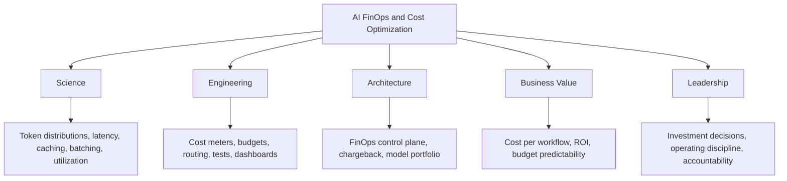

---

## 1. The AI Cost Stack

AI cost is layered.

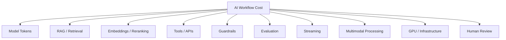

### Cost Formula

```text
Total AI Workflow Cost =
model inference
+ retrieval
+ embeddings
+ reranking
+ tools
+ guardrails
+ evaluation
+ streaming overhead
+ multimodal processing
+ infrastructure
+ human review
```

### Better Formula

```text
Cost per Successful Workflow =
total AI workflow cost / useful completed workflows
```

---

## 2. Cost Metrics That Matter

| Metric | Meaning | Why It Matters |
|---|---|---|
| cost per request | raw request cost | basic tracking |
| cost per accepted output | cost of outputs users keep | quality-adjusted cost |
| cost per completed task | workflow cost | operational value |
| cost per resolved case | support ROI | business value |
| cost per incident triage | operations ROI | business value |
| cost per tenant | allocation | chargeback/showback |
| cost per model | vendor/model comparison | routing |
| cost per prompt version | prompt bloat detection | regression |
| cost per token | unit economics | low-level metric |
| cost per GPU-hour | infrastructure economics | self-hosting |
| cost per successful eval | eval economics | release discipline |

### Principle

> Token cost is a component metric. Business outcome cost is the executive metric.

---

## 3. Token Economics

Most model APIs charge based on tokens, modality, or both.

Token cost depends on:

- input tokens
- output tokens
- cached input tokens
- batch tokens
- model/provider
- region
- tier
- modality
- inference mode
- retries
- streaming cancellation
- tool schemas and tool results
- conversation history

### Token Flow

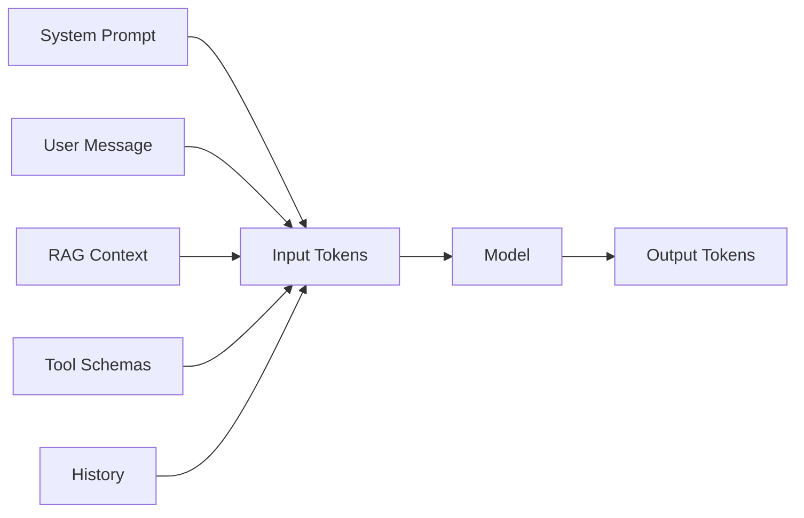

### Rule

Output tokens are often more expensive than input tokens for many model families. Long answers should be justified by user value.

---

## 4. Python Cost Estimator

### Folder

```text
labs/chapter-21-ai-finops/lab1-cost-estimator/
  cost_estimator.py
  pricing.yaml
  tests/test_cost_estimator.py
```

### `pricing.yaml`

```yaml
models:
  economical_model:
    input_per_1m: 0.20
    output_per_1m: 0.80
  premium_model:
    input_per_1m: 3.00
    output_per_1m: 15.00
  cached_read_model:
    input_per_1m: 3.00
    output_per_1m: 15.00
    cache_read_per_1m: 0.30
```

### `cost_estimator.py`

```python
from __future__ import annotations

from dataclasses import dataclass


@dataclass
class ModelPricing:
    input_per_1m: float
    output_per_1m: float
    cache_read_per_1m: float = 0.0
    cache_write_per_1m: float = 0.0


@dataclass
class TokenUsage:
    input_tokens: int
    output_tokens: int
    cache_read_tokens: int = 0
    cache_write_tokens: int = 0


def estimate_model_cost(usage: TokenUsage, pricing: ModelPricing) -> float:
    return (
        usage.input_tokens / 1_000_000 * pricing.input_per_1m
        + usage.output_tokens / 1_000_000 * pricing.output_per_1m
        + usage.cache_read_tokens / 1_000_000 * pricing.cache_read_per_1m
        + usage.cache_write_tokens / 1_000_000 * pricing.cache_write_per_1m
    )


if __name__ == "__main__":
    usage = TokenUsage(input_tokens=2200, output_tokens=450)
    pricing = ModelPricing(input_per_1m=3.00, output_per_1m=15.00)
    print(round(estimate_model_cost(usage, pricing), 6))
```

### Component Test

```python
from cost_estimator import ModelPricing, TokenUsage, estimate_model_cost


def test_cost_estimator_basic():
    cost = estimate_model_cost(
        TokenUsage(input_tokens=1_000_000, output_tokens=1_000_000),
        ModelPricing(input_per_1m=1.0, output_per_1m=2.0),
    )
    assert cost == 3.0
```

---

## 5. AI Workflow Cost Collector

Model cost alone is incomplete.

### Cost Event Schema

```json
{
  "trace_id": "trace-123",
  "tenant_id": "device-ops",
  "workflow_id": "incident_summary",
  "model_cost_usd": 0.042,
  "retrieval_cost_usd": 0.004,
  "rerank_cost_usd": 0.002,
  "guardrail_cost_usd": 0.001,
  "tool_cost_usd": 0.003,
  "evaluation_cost_usd": 0.001,
  "human_review_cost_usd": 0.0,
  "total_cost_usd": 0.053,
  "workflow_success": true
}
```

### Python Scaffold

```python
from dataclasses import dataclass


@dataclass
class WorkflowCost:
    model: float = 0.0
    retrieval: float = 0.0
    rerank: float = 0.0
    guardrail: float = 0.0
    tool: float = 0.0
    evaluation: float = 0.0
    human_review: float = 0.0

    @property
    def total(self) -> float:
        return sum([
            self.model,
            self.retrieval,
            self.rerank,
            self.guardrail,
            self.tool,
            self.evaluation,
            self.human_review,
        ])


def cost_per_successful_task(total_cost: float, successful_tasks: int) -> float:
    if successful_tasks <= 0:
        return float("inf")
    return total_cost / successful_tasks
```

---

## 6. Model Routing for Cost

A model router should optimize for quality, safety, latency, and cost.

### Routing Decision

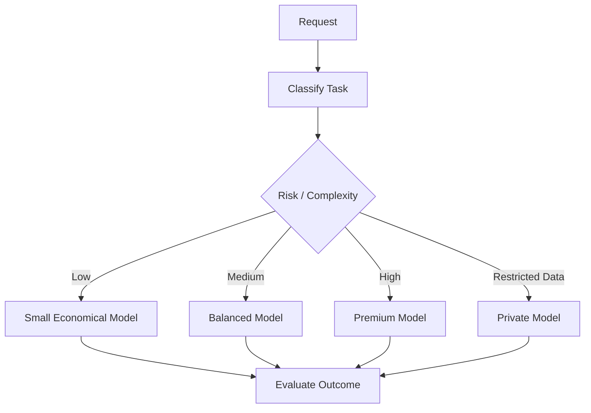

### Routing Policy

```yaml
routes:
  - task_type: classification
    model: economical_model
    max_cost_usd: 0.001
    min_quality_score: 0.90

  - task_type: support_draft
    model: balanced_model
    max_cost_usd: 0.03
    min_quality_score: 0.86

  - task_type: executive_incident_brief
    model: premium_model
    max_cost_usd: 0.25
    min_quality_score: 0.92
    human_review_required: true

  - task_type: restricted_ops_summary
    model: private_nvidia_model
    fail_closed: true
```

### Principle

> Use the cheapest model that passes the quality, safety, latency, and governance gate.

---

## 7. Prompt and Context Cost Optimization

Prompt cost grows through:

- long system prompts
- too many few-shot examples
- too much conversation history
- over-retrieval
- verbose tool schemas
- raw documents instead of summarized context
- repeated stable context without caching

### Context Optimization Pattern

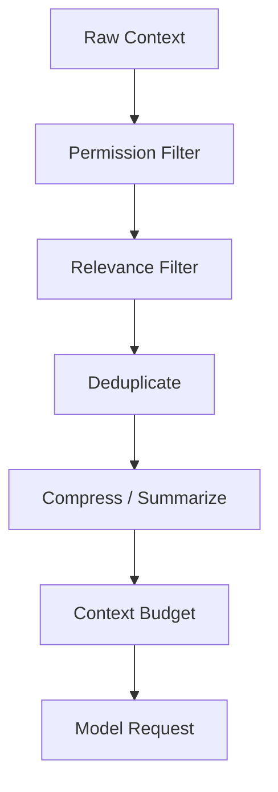

### Context Budget

```yaml
context_budget:
  workflow: support_draft
  max_input_tokens: 12000
  max_history_tokens: 2000
  max_rag_chunks: 6
  max_tool_result_tokens: 1500
  require_context_compression_above_tokens: 8000
```

### Production Rule

Long context should be justified by evaluation evidence, not convenience.

---

## 8. Prompt Caching Economics

Prompt caching can reduce cost and latency when stable prompt prefixes repeat.

Good candidates:

- long system prompts
- policy manuals
- codebase context
- large tool schemas
- repeated document sets
- few-shot examples
- stable legal/compliance instructions

Poor candidates:

- highly dynamic user-specific content
- sensitive short-lived data
- stale assumptions
- tenant-mixed context
- secrets

### Cache Policy

```yaml
prompt_cache:
  enabled: true
  allowed_workflows:
    - coding_assistant
    - policy_qa
  require_tenant_namespace: true
  max_ttl_minutes: 60
  prohibited_data_classes:
    - restricted
    - secrets
```

### Cache Cost Formula

```text
Cache Savings =
uncached repeated input cost
- cache write cost
- cache read cost
- cache invalidation/rebuild cost
```

### Principle

> Cache stable context, not unstable assumptions.

---

## 9. RAG Cost Optimization

RAG cost includes:

- ingestion
- parsing
- embeddings
- vector storage
- lexical index
- retrieval calls
- reranking
- context tokens
- citations
- evaluation
- source sync
- operations

### RAG Cost Diagram

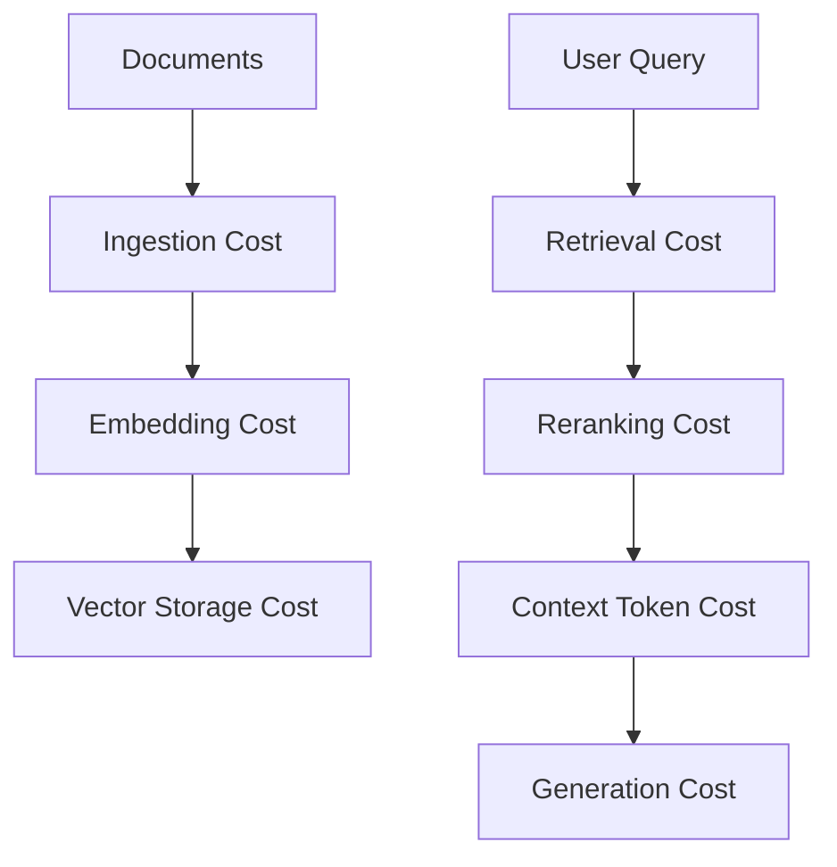

### Optimization Levers

- index only useful documents
- remove stale content
- chunk carefully
- avoid over-retrieval
- use metadata filters
- use reranking selectively
- tune `numberOfResults`
- cache frequent answers where safe
- evaluate no-result and low-value queries
- summarize long retrieved context

### Principle

> The cheapest RAG system is one that retrieves only useful, authorized, current evidence.

---

## 10. Embedding and Reranking Economics

Embedding costs are usually incurred during ingestion or query time.

Reranking may improve answer quality but adds per-query cost and latency.

### Decision Table

| Situation | Recommendation |
|---|---|
| exact identifiers matter | hybrid search before reranking |
| noisy retrieval | add reranking and evaluate |
| low-value workflow | avoid expensive reranking |
| high-risk answer | reranking may be worth it |
| large corpus | metadata filters first |
| frequent repeated query | safe cache may help |

### Reranking Cost Rule

Rerank fewer, better candidates. Do not send hundreds of chunks to a reranker without filters.

---

## 11. Agent Cost Optimization

Agent workflows can be expensive because they loop.

### Agent Cost Drivers

- planning calls
- tool calls
- observations
- repeated RAG queries
- guardrails at each step
- long state/context
- retries
- human approval
- final synthesis

### Agent Loop Diagram

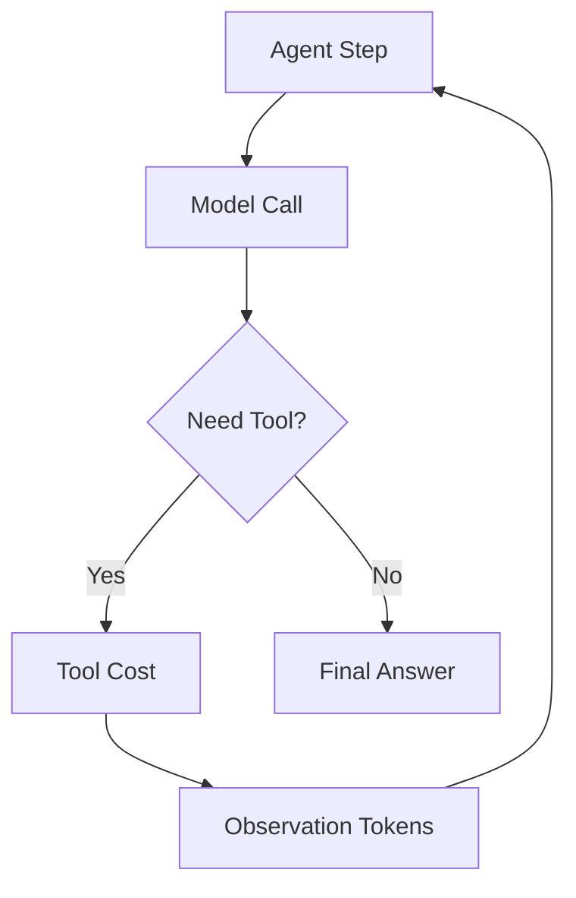

### Agent Cost Controls

- max steps
- max tool calls
- max tokens per step
- read-only first
- deterministic router before agent
- tool result compression
- stop conditions
- fallback to human
- trace-based cost analysis

### Agent Cost Policy

```yaml
agent_budget:
  workflow: incident_investigation
  max_steps: 6
  max_tool_calls: 4
  max_total_tokens: 30000
  max_cost_usd: 0.50
  require_human_approval_above_cost_usd: 1.00
```

### Principle

> Agent autonomy without budget limits is an open-ended invoice.

---

## 12. Streaming Cost Optimization

Streaming affects user experience and cost.

### Streaming Cost Risks

- abandoned streams still generate tokens
- user cancels but backend continues
- partial outputs are discarded
- high-risk output requires regeneration after validation
- verbose streaming encourages long answers

### Streaming Cost Signals

- time to first token
- stream completion rate
- cancellation rate
- abandoned token cost
- average streamed output length
- final validation failures
- user acceptance

### Streaming Cost Policy

```yaml
streaming_policy:
  enabled: true
  max_stream_tokens: 1200
  propagate_cancellation: true
  log_abandoned_cost: true
  disable_for_high_risk_workflows: true
```

### Principle

> Streaming that cannot be cancelled is a cost leak.

---

## 13. Multimodal Cost Optimization

Multimodal cost can surprise teams.

### Cost Drivers

- image resolution
- number of images
- document page count
- OCR cost
- audio duration
- video length
- frame sampling rate
- multimodal model cost
- storage
- human review
- retries due to poor quality

### Multimodal Pattern

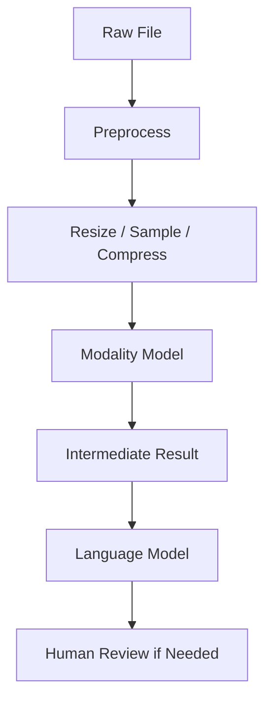

### Optimization Levers

- file size limits
- image resizing
- frame sampling instead of full video
- audio segmentation
- OCR before multimodal LLM when sufficient
- confidence thresholds
- human review only on low confidence
- cache extracted text
- store intermediate outputs

### Device Operations Example

A device inspection workflow should not send every uploaded video frame to a large multimodal model. Sample frames, detect likely defects, then escalate uncertain cases.

---

## 14. Guardrail and Evaluation Cost

Guardrails and evaluation are costs, but they reduce risk.

### Guardrail Cost Optimization

- apply stronger guardrails to higher-risk workflows
- avoid redundant checks
- batch offline safety evaluation
- monitor false positives
- use targeted denied topics
- tune grounding checks

### Evaluation Cost Optimization

- sample production traffic
- run full regression on release
- run lightweight daily evals
- use human review for calibration
- cache judge results when inputs are stable
- focus high-cost eval on high-risk workflows

### Principle

> Do not optimize safety out of the system. Optimize where, when, and how safety is applied.

---

## 15. Batch vs Real-Time Inference

Batch processing can reduce cost for non-interactive workloads.

AWS Bedrock pricing notes that selected foundation models are available for batch inference at lower pricing than on-demand inference. This makes batch attractive for offline summarization, classification, extraction, and evaluation jobs.

### Batch Candidates

- nightly document summarization
- large-scale classification
- eval datasets
- transcript processing
- metadata generation
- embedding backfills
- customer case pre-processing

### Real-Time Candidates

- chat
- agent workflows
- customer-facing support
- interactive coding
- live incident triage

### Decision Table

| Need | Pattern |
|---|---|
| user waiting | real-time |
| scheduled job | batch |
| large eval run | batch |
| urgent incident | real-time |
| cost-sensitive backfill | batch |
| streaming UX | real-time |

---

## 16. Provisioned / Reserved / Dedicated Capacity

Capacity choices matter.

### Patterns

| Pattern | Best For | Risk |
|---|---|---|
| on-demand | variable or early workloads | unit cost can be high |
| batch | offline workloads | not interactive |
| provisioned/reserved | predictable high-volume workloads | underutilization |
| self-hosted GPU | control and scale | operations burden |
| hybrid | portfolio optimization | complexity |

### Utilization Rule

Reserved or self-hosted capacity requires utilization discipline.

If utilization is low, managed on-demand may be cheaper.

---

## 17. NVIDIA / Self-Hosted GPU FinOps

Self-hosted inference cost includes:

- GPU hourly cost
- idle capacity
- model load/warmup
- storage
- networking
- Kubernetes/EKS/SageMaker
- observability
- engineering operations
- patching
- evaluation
- capacity risk

### GPU Cost Formula

```text
GPU Cost per Successful Task =
(GPU hours + storage + networking + platform labor + observability + evaluation)
/ successful tasks
```

### GPU Utilization Dashboard

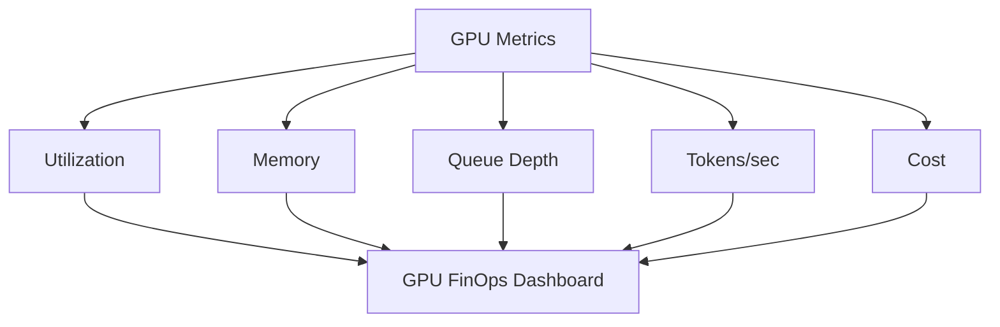

### Principle

> GPUs are not cheaper because you own them. They are cheaper only when you keep them productively used.

---

## 18. Multi-Tenant FinOps

Multi-tenant AI platforms need cost isolation.

### Tenant Cost Controls

- budget per tenant
- token quotas
- model access limits
- rate limits
- cache namespace
- per-tenant dashboards
- showback/chargeback
- priority tiers
- overage approvals
- noisy-neighbor alerts

### Tenant Budget Policy

```yaml
tenant_budgets:
  support:
    monthly_usd: 25000
    max_tokens_per_day: 50000000
    allowed_models:
      - economical_model
      - balanced_model
    premium_model_requires_approval: true

  operations:
    monthly_usd: 40000
    max_tokens_per_day: 80000000
    allowed_models:
      - balanced_model
      - premium_model
      - private_nvidia_model
```

### Budget Enforcer Scaffold

```python
from __future__ import annotations

import json
import uuid
from dataclasses import dataclass
from datetime import datetime, timezone
from pathlib import Path
from typing import Optional

import yaml


@dataclass
class BudgetDecision:
    tenant_id: str
    allowed: bool
    reason: str
    projected_cost: float
    spent_so_far: float
    monthly_budget: float
    requires_approval: bool = False
    approval_threshold_usd: Optional[float] = None


class BudgetEnforcer:
    """
    Enforces per-tenant monthly budgets and model access policies.
    Loaded from YAML config. Every decision emits an audit event.
    """

    def __init__(self, policy_path: str = "budget_policy.yaml"):
        data = yaml.safe_load(Path(policy_path).read_text(encoding="utf-8"))
        self._tenants: dict[str, dict] = {
            t["name"]: t for t in data.get("tenants", [])
        }

    def check(
        self,
        tenant_id: str,
        projected_cost: float,
        spent_so_far: float,
        model: Optional[str] = None,
        workflow_id: str = "unknown"
    ) -> BudgetDecision:
        """
        Gate an AI request against tenant budget and model access policy.
        Returns a BudgetDecision; caller decides whether to block or escalate.
        """
        policy = self._tenants.get(tenant_id)

        if policy is None:
            decision = BudgetDecision(
                tenant_id=tenant_id, allowed=False,
                reason=f"No budget policy found for tenant '{tenant_id}'",
                projected_cost=projected_cost,
                spent_so_far=spent_so_far, monthly_budget=0.0
            )
            self._audit(decision, workflow_id)
            return decision

        monthly_budget = policy.get("monthly_budget_usd", 0.0)
        new_total = spent_so_far + projected_cost

        # Model access check
        if model:
            allowed_models = policy.get("allowed_models", [])
            premium_requires_approval = policy.get("premium_model_requires_approval", False)
            premium_models = policy.get("premium_models", [])

            if allowed_models and model not in allowed_models:
                decision = BudgetDecision(
                    tenant_id=tenant_id, allowed=False,
                    reason=f"Model '{model}' not in tenant allowed list",
                    projected_cost=projected_cost,
                    spent_so_far=spent_so_far, monthly_budget=monthly_budget
                )
                self._audit(decision, workflow_id)
                return decision

            if premium_requires_approval and model in premium_models:
                decision = BudgetDecision(
                    tenant_id=tenant_id, allowed=False,
                    reason=f"Premium model '{model}' requires explicit approval",
                    projected_cost=projected_cost,
                    spent_so_far=spent_so_far, monthly_budget=monthly_budget,
                    requires_approval=True
                )
                self._audit(decision, workflow_id)
                return decision

        # Hard budget gate
        if new_total > monthly_budget:
            decision = BudgetDecision(
                tenant_id=tenant_id, allowed=False,
                reason=f"Request would exceed monthly budget: "
                       f"${new_total:.4f} > ${monthly_budget:.2f}",
                projected_cost=projected_cost,
                spent_so_far=spent_so_far, monthly_budget=monthly_budget
            )
            self._audit(decision, workflow_id)
            return decision

        # Soft warning threshold (e.g., 80%)
        alert_threshold = policy.get("alert_threshold_percent", 80) / 100
        if new_total / monthly_budget >= alert_threshold:
            reason = f"Budget {new_total/monthly_budget*100:.1f}% consumed — approaching limit"
        else:
            reason = "allowed"

        decision = BudgetDecision(
            tenant_id=tenant_id, allowed=True,
            reason=reason,
            projected_cost=projected_cost,
            spent_so_far=spent_so_far, monthly_budget=monthly_budget
        )
        self._audit(decision, workflow_id)
        return decision

    def _audit(self, decision: BudgetDecision, workflow_id: str) -> None:
        print(json.dumps({
            "event_type": "ai_budget_decision",
            "event_id": str(uuid.uuid4()),
            "tenant_id": decision.tenant_id,
            "workflow_id": workflow_id,
            "allowed": decision.allowed,
            "reason": decision.reason,
            "projected_cost_usd": round(decision.projected_cost, 6),
            "spent_so_far_usd": round(decision.spent_so_far, 4),
            "monthly_budget_usd": decision.monthly_budget,
            "requires_approval": decision.requires_approval,
            "timestamp": datetime.now(timezone.utc).isoformat()
        }, sort_keys=True))
```

### `tests/test_budget_enforcer.py`

```python
import pytest
from budget_enforcer import BudgetEnforcer, BudgetDecision

POLICY_YAML = """
tenants:
  - name: support
    monthly_budget_usd: 25000
    alert_threshold_percent: 80
    allowed_models: [economical_model, balanced_model]
    premium_models: [premium_model]
    premium_model_requires_approval: true

  - name: operations
    monthly_budget_usd: 40000
    alert_threshold_percent: 75
    allowed_models: [balanced_model, premium_model, private_nvidia_model]
    premium_models: []
    premium_model_requires_approval: false
"""

@pytest.fixture
def enforcer(tmp_path):
    p = tmp_path / "budget_policy.yaml"
    p.write_text(POLICY_YAML)
    return BudgetEnforcer(str(p))


def test_unknown_tenant_denied(enforcer):
    d = enforcer.check("mystery_tenant", 10.0, 0.0)
    assert not d.allowed
    assert "No budget policy" in d.reason


def test_within_budget_allowed(enforcer):
    d = enforcer.check("support", 50.0, 5000.0)
    assert d.allowed


def test_over_budget_denied(enforcer):
    d = enforcer.check("support", 100.0, 24950.0)
    assert not d.allowed
    assert "exceed" in d.reason


def test_disallowed_model_denied(enforcer):
    d = enforcer.check("support", 1.0, 0.0, model="premium_model")
    # premium model requires approval for support tenant
    assert not d.allowed
    assert d.requires_approval is True


def test_premium_model_allowed_for_operations(enforcer):
    d = enforcer.check("operations", 1.0, 0.0, model="premium_model")
    assert d.allowed


def test_unlisted_model_denied(enforcer):
    d = enforcer.check("support", 1.0, 0.0, model="unknown_model")
    assert not d.allowed
    assert "not in tenant allowed list" in d.reason


def test_near_budget_still_allowed(enforcer):
    d = enforcer.check("support", 10.0, 24980.0)  # Over 80% threshold
    assert not d.allowed  # 24990 > 25000 — over budget
```

### Principle

> Multi-tenant FinOps prevents one team's enthusiasm from becoming another team's outage or bill.

---

## 19. Chargeback and Showback

### Showback

Show teams what they consume.

Best for early adoption and behavior change.

### Chargeback

Bill teams for what they consume.

Best when AI usage is mature and budgets are owned.

### Cost Allocation Dimensions

- tenant
- business unit
- application
- workflow
- environment
- model/provider
- prompt version
- RAG source
- tool
- agent
- project/cost center

### Allocation Config

```yaml
cost_allocation:
  required_tags:
    - tenant_id
    - workflow_id
    - application
    - environment
    - cost_center
  default_owner: ai-platform
  untagged_policy: block_in_production
```

### Principle

> Untagged AI spend is unmanaged AI spend.

---

## 20. Cost-Aware Evaluation

Quality without cost is incomplete.

### Evaluation Scorecard

| Dimension | Threshold |
|---|---:|
| quality score | >= 0.86 |
| safety score | >= 0.98 |
| p95 latency | <= 6000 ms |
| cost per successful task | <= $0.05 |
| user acceptance | >= 75% |

### Release Gate

```yaml
release_gate:
  quality_score_min: 0.86
  safety_score_min: 0.98
  p95_latency_ms_max: 6000
  cost_per_successful_task_max_usd: 0.05
  block_if_cost_increase_without_quality_gain: true
```

### Python Gate

```python
def passes_cost_quality_gate(old: dict, new: dict) -> bool:
    if new["safety"] < 0.98:
        return False
    if new["quality"] < 0.86:
        return False
    if new["cost"] > old["cost"] * 1.20 and new["quality"] <= old["quality"]:
        return False
    return True
```

### Principle

> A model upgrade that costs 3x more must earn its place with measurable value.

---

## 21. Cost Observability and Alerts

### Cost Alert Examples

```yaml
alerts:
  - name: tenant_budget_80_percent
    metric: tenant.monthly_spend_percent
    threshold: 80
    severity: medium

  - name: cost_per_task_spike
    metric: workflow.cost_per_successful_task
    threshold_percent_over_baseline: 50
    window: 1h
    severity: high

  - name: agent_loop_cost_spike
    metric: agent.average_steps
    threshold: 8
    window: 15m
    severity: high
```

### Cost Dashboard

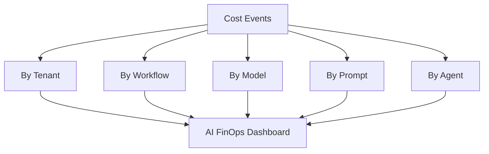

---

## 22. AWS Cost Optimization Surface

For AWS-centric platforms, use AWS cost and monitoring capabilities with AI-specific metadata.

### AWS Mapping

| Need | AWS Pattern |
|---|---|
| managed model pricing | Bedrock pricing page and model pricing |
| batch inference | Bedrock batch inference where supported |
| managed RAG cost | Bedrock Knowledge Bases + vector store costs |
| safety cost | Bedrock Guardrails cost surface |
| eval cost | Bedrock Model Evaluation |
| usage telemetry | CloudWatch and application metrics |
| audit | CloudTrail |
| budgets | AWS Budgets |
| cost analysis | Cost Explorer / Cost and Usage Report |
| tags | tenant/workflow/cost center tags |
| self-hosted GPU | EKS/SageMaker/EC2 GPU cost + utilization |
| alarms | CloudWatch alarms/EventBridge |

### AWS FinOps Pattern

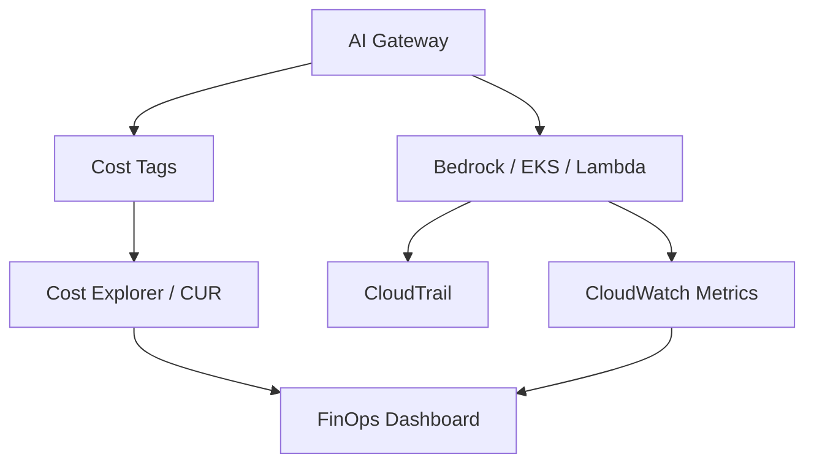

### Principle

Cloud provider billing must be enriched with application-level workflow metadata.

---

## 23. ROI Model

AI ROI requires comparing cost with value.

### ROI Formula

```text
AI ROI =
(value created - total AI operating cost) / total AI operating cost
```

### Value Drivers

- labor hours saved
- reduced handle time
- fewer escalations
- faster incident resolution
- reduced downtime
- increased conversion
- higher retention
- reduced compliance risk
- faster development
- improved customer satisfaction

### Example

```text
Monthly value:
10,000 support cases x 3 minutes saved x $0.75/min = $22,500

Monthly AI cost:
model + RAG + guardrails + eval + ops = $7,500

ROI:
($22,500 - $7,500) / $7,500 = 2.0 = 200%
```

### Principle

> ROI must be tied to a real business workflow, not generic AI enthusiasm.

---

## 24. Production Lessons from the Field

### Production Context

The following lessons come from operating five production AI systems (SupportIQ, TriageIQ, CertifyIQ, DeviceIQ, Managed Services Automations) in a connected device platform environment. These systems collectively process thousands of AI-assisted workflows daily across dozens of countries. FinOps discipline was not applied at the start — it was built in response to cost surprises that only became visible after scale.

### Lesson 1: Prompt Bloat Is a Cost Bug

In SupportIQ's first six months of production, prompt size grew continuously. Every sprint added new instructions: formatting rules, domain-specific caveats, exception handling language, additional few-shot examples for edge cases. Nobody noticed because the quality was improving slightly with each change.

After six months, the system prompt was 4,200 tokens. The original was 980 tokens. Daily model cost had increased 38% with no corresponding improvement in user acceptance rate.

What worked after the fix:

- token budget per prompt version enforced at the prompt registry
- prompt version token count tracked and diff-alerted on each deployment
- context compression applied when assembled context exceeded 60% of budget
- cost regression gate: a new prompt version must not increase cost per accepted output by more than 10% without a corresponding quality gain

What failed before:

- no prompt owner tracking token growth
- no cost associated with prompt changes
- quality measured independently from cost
- no prompt cost dashboard

### Lesson 2: Over-Retrieval Is Expensive and Lowers Quality

DeviceIQ's RAG pipeline was initially configured to retrieve 12 chunks per query. The intuition was "more context = better answers." In practice, the reverse was true: retrieval quality at K=12 included marginally relevant firmware documents that confused the model and lengthened the prompt unnecessarily.

Tuning top-K to 5 reduced retrieval cost, reduced context tokens by 40%, and improved groundedness scores from 0.78 to 0.87.

What worked after the fix:

- metadata filters applied before retrieval to narrow the candidate set
- top-K reduced from 12 to 5 and evaluated on golden dataset
- reranker applied only for queries where semantic similarity scores were clustered tightly (ambiguous intent)
- retrieval evaluation metrics (Recall@K, citation support) added to release gate

What failed before:

- retrieval config set once and never re-evaluated
- no connection between retrieval cost and answer quality
- reranker applied to all queries regardless of confidence

### Lesson 3: Agent Loops Create Surprise Bills

TriageIQ's early L4 triage agent had no step limit. In normal operation, agents completed in 3–4 steps. But for a specific category of novel firmware error codes with no matching runbook, the agent entered a retrieval loop — searching for evidence, finding nothing, searching again with a reformulated query, finding nothing again — and continued for 14 steps before timing out.

Over three days, 340 cases with that error code each generated 14-step agent runs. Undetected because the HTTP responses all succeeded. Discovered on the weekly FinOps review.

What worked after the fix:

- `max_steps: 6` configured per agent workflow
- cost per agent run tracked in the trace, alerted when exceeding 2× average
- no-result from RAG explicitly handled as a stop condition (escalate rather than retry)
- EWMA baseline on agent step count — upward drift signals prompt or knowledge base degradation before it becomes a cost spike

What failed before:

- no step limit
- retry-on-no-result loop with no escape condition
- cost visible only at monthly invoice level

### Lesson 4: Streaming Cancellation Saves Real Money

SupportIQ deployed streaming for longer support draft responses. Usage increased because agents appreciated seeing the response build in real time. Monthly model cost also increased by 28% beyond volume projections.

Investigation via streaming telemetry revealed that 19% of streams were abandoned — agents clicked away before the response completed. The average abandoned stream was 72% complete at cancellation. The server kept generating for an average of 6 additional seconds after the client disconnected.

With correct cancellation propagation, the 28% cost increase reduced to 9% — consistent with actual usage growth.

What worked after the fix:

- disconnect event propagated to the model provider within 500ms
- abandoned stream cost tracked as a separate FinOps line item
- TTFT (time to first token) reduced to 680ms average — agents saw useful output faster and were less likely to abandon early

What failed before:

- HTTP 200 responses for all streams regardless of completion
- no cancellation event in the streaming gateway
- cost looked normal at the request level because token counts were not per-session

### Lesson 5: Idle GPUs Kill the Business Case

DeviceIQ uses a private NVIDIA GPU cluster for inference on restricted device telemetry data that cannot leave the private network. The initial capacity plan was based on peak workload projections. At 6 months, GPU utilization averaged 14% during business hours and under 2% overnight.

At 14% average utilization, the per-token cost on the self-hosted cluster was 6× the equivalent Bedrock on-demand cost.

What worked after the fix:

- batch jobs scheduled during off-hours for non-interactive workloads (telemetry classification, evaluation runs, embedding backfills)
- model consolidation: two models that could run on the same GPU consolidated to one serving instance
- utilization dashboard with a 40% minimum target; below target triggers cost review
- quarterly decision: self-host vs managed comparison based on actual utilization and task volume

What failed before:

- utilization never measured
- no batch strategy
- separate GPU instances per model type
- business case based on hypothetical scale that had not arrived yet

- every team adding instructions forever
- no prompt owner
- no token dashboard

### Lesson 2: Over-Retrieval Is Expensive and Lowers Quality

What worked:

- metadata filters
- top-K tuning
- reranker only where needed
- source pruning

What failed:

- retrieving 30 chunks into every answer
- no retrieval evaluation
- no citation quality review

### Lesson 3: Agent Loops Create Surprise Bills

What worked:

- max steps
- max tool calls
- trace dashboards
- cost per completed task

What failed:

- agents with no budget
- retries hidden in orchestration
- tool loops not logged

### Lesson 4: Streaming Cancellation Saves Real Money

What worked:

- cancellation propagation
- abandoned token dashboards
- output budgets

What failed:

- UI stops but provider keeps generating
- no cancellation events

### Lesson 5: Idle GPUs Kill the Business Case

What worked:

- shared GPU pools
- batch jobs during off-hours
- model consolidation
- utilization dashboards

What failed:

- dedicated GPUs per project
- no chargeback
- no utilization target

---

## 25. Capstone AI FinOps Architecture

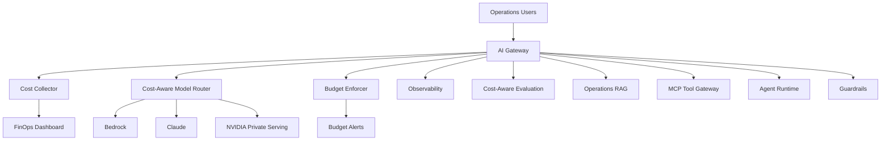

### Capstone Cost Metrics

- cost per incident investigation
- cost per executive brief
- cost per RAG answer
- cost per telemetry tool call
- cost per agent task
- cost per multimodal inspection
- cost by tenant/customer/workflow
- cost per successful outcome

---

## 26. Production Readiness Checklist

Before scaling AI spend:

- [ ] cost dimensions defined
- [ ] tenant/workflow tags required
- [ ] model pricing catalog created
- [ ] token estimation implemented
- [ ] workflow cost collector implemented
- [ ] budgets defined
- [ ] quota enforcement implemented
- [ ] cost alerts configured
- [ ] model routing policy includes cost
- [ ] prompt/context budgets defined
- [ ] RAG cost monitored
- [ ] agent loop budgets defined
- [ ] streaming cancellation tracked
- [ ] multimodal cost limits defined
- [ ] GPU utilization dashboard created if self-hosted
- [ ] cost-aware evaluation gates configured
- [ ] ROI dashboard created
- [ ] chargeback/showback model approved

---

## 27. Architecture Review Scenario

### Scenario

A company launches a support AI assistant and celebrates 1M monthly requests. The monthly AI bill triples, but nobody knows why.

### Review Finding

This is not FinOps-ready.

### Missing Controls

- no tenant/workflow cost tags
- no token dashboard
- no prompt version cost tracking
- no RAG top-K cost tracking
- no agent loop cost tracking
- no streaming cancellation tracking
- no budget alerts
- no cost per successful outcome
- no model routing by task complexity

### Improved Design

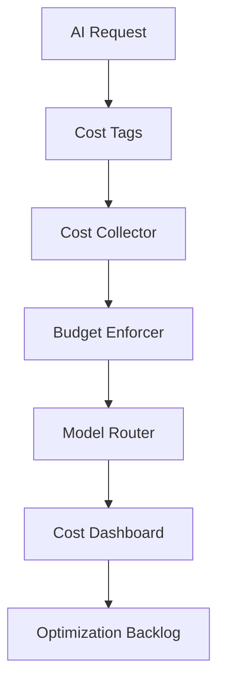

### Recommendation

Do not wait for the bill. Build cost telemetry and budget controls before production scale.

---

## 28. Hands-On Labs with Scaffolding

### Lab 1: Cost Estimator

```text
labs/chapter-21-ai-finops/lab1-cost-estimator/
  cost_estimator.py
  pricing.yaml
  tests/test_cost_estimator.py
```

Tasks:

1. Define model pricing.
2. Estimate input/output token cost.
3. Add cached-token pricing.
4. Add unit tests.

---

### Lab 2: Workflow Cost Collector

```text
labs/chapter-21-ai-finops/lab2-workflow-cost/
  workflow_cost.py
  sample_events.jsonl
  report.py
```

### `sample_events.jsonl`

```jsonl
{"trace_id":"t1","tenant_id":"device-ops","workflow_id":"incident_summary","model_cost_usd":0.042,"retrieval_cost_usd":0.004,"rerank_cost_usd":0.002,"guardrail_cost_usd":0.001,"tool_cost_usd":0.003,"evaluation_cost_usd":0.001,"human_review_cost_usd":0.0,"workflow_success":true}
{"trace_id":"t2","tenant_id":"device-ops","workflow_id":"incident_summary","model_cost_usd":0.038,"retrieval_cost_usd":0.003,"rerank_cost_usd":0.002,"guardrail_cost_usd":0.001,"tool_cost_usd":0.002,"evaluation_cost_usd":0.001,"human_review_cost_usd":0.0,"workflow_success":true}
{"trace_id":"t3","tenant_id":"support","workflow_id":"support_draft","model_cost_usd":0.018,"retrieval_cost_usd":0.002,"rerank_cost_usd":0.001,"guardrail_cost_usd":0.001,"tool_cost_usd":0.001,"evaluation_cost_usd":0.0,"human_review_cost_usd":0.0,"workflow_success":true}
{"trace_id":"t4","tenant_id":"support","workflow_id":"support_draft","model_cost_usd":0.022,"retrieval_cost_usd":0.002,"rerank_cost_usd":0.001,"guardrail_cost_usd":0.001,"tool_cost_usd":0.001,"evaluation_cost_usd":0.0,"human_review_cost_usd":0.0,"workflow_success":false}
{"trace_id":"t5","tenant_id":"device-ops","workflow_id":"executive_brief","model_cost_usd":0.089,"retrieval_cost_usd":0.005,"rerank_cost_usd":0.003,"guardrail_cost_usd":0.001,"tool_cost_usd":0.000,"evaluation_cost_usd":0.002,"human_review_cost_usd":0.05,"workflow_success":true}
```

### `workflow_cost.py`

```python
from __future__ import annotations

import json
from collections import defaultdict
from dataclasses import dataclass, field
from pathlib import Path


COST_FIELDS = [
    "model_cost_usd", "retrieval_cost_usd", "rerank_cost_usd",
    "guardrail_cost_usd", "tool_cost_usd", "evaluation_cost_usd",
    "human_review_cost_usd"
]


@dataclass
class WorkflowCostAccumulator:
    tenant_id: str
    workflow_id: str
    total_cost_usd: float = 0.0
    model_cost_usd: float = 0.0
    retrieval_cost_usd: float = 0.0
    rerank_cost_usd: float = 0.0
    guardrail_cost_usd: float = 0.0
    tool_cost_usd: float = 0.0
    evaluation_cost_usd: float = 0.0
    human_review_cost_usd: float = 0.0
    successful_tasks: int = 0
    failed_tasks: int = 0

    @property
    def total_tasks(self) -> int:
        return self.successful_tasks + self.failed_tasks

    @property
    def cost_per_successful_task(self) -> float:
        if self.successful_tasks == 0:
            return float("inf")
        return self.total_cost_usd / self.successful_tasks

    @property
    def success_rate(self) -> float:
        if self.total_tasks == 0:
            return 0.0
        return self.successful_tasks / self.total_tasks

    def add_event(self, event: dict) -> None:
        event_total = sum(event.get(f, 0.0) for f in COST_FIELDS)
        self.total_cost_usd += event_total
        for field_name in COST_FIELDS:
            setattr(self, field_name,
                    getattr(self, field_name) + event.get(field_name, 0.0))
        if event.get("workflow_success"):
            self.successful_tasks += 1
        else:
            self.failed_tasks += 1


def collect_workflow_costs(events_path: str) -> dict[tuple, WorkflowCostAccumulator]:
    """
    Read a JSONL cost events file and aggregate by (tenant_id, workflow_id).
    Returns a dict keyed by (tenant_id, workflow_id).
    """
    accumulators: dict[tuple, WorkflowCostAccumulator] = {}

    for line in Path(events_path).read_text(encoding="utf-8").splitlines():
        if not line.strip():
            continue
        event = json.loads(line)
        key = (event["tenant_id"], event["workflow_id"])
        if key not in accumulators:
            accumulators[key] = WorkflowCostAccumulator(
                tenant_id=event["tenant_id"],
                workflow_id=event["workflow_id"]
            )
        accumulators[key].add_event(event)

    return accumulators


def print_report(accumulators: dict[tuple, WorkflowCostAccumulator]) -> None:
    print(f"\n{'Tenant':<18} {'Workflow':<24} {'Tasks':>6} {'Success':>8} {'Total $':>10} {'$/Success':>12}")
    print("-" * 82)
    for acc in sorted(accumulators.values(),
                      key=lambda a: a.cost_per_successful_task):
        cps = acc.cost_per_successful_task
        cps_str = f"${cps:.4f}" if cps != float("inf") else "N/A"
        print(f"{acc.tenant_id:<18} {acc.workflow_id:<24} "
              f"{acc.total_tasks:>6} {acc.success_rate:>7.0%} "
              f"${acc.total_cost_usd:>9.4f} {cps_str:>12}")


if __name__ == "__main__":
    import sys
    path = sys.argv[1] if len(sys.argv) > 1 else "sample_events.jsonl"
    accs = collect_workflow_costs(path)
    print_report(accs)
```

Tasks:

1. Run `python workflow_cost.py sample_events.jsonl`
2. Add 20 more events across 3 tenants to see the grouping behavior
3. Identify which workflow has the highest cost-per-successful-task
4. Add an alert if cost_per_successful_task exceeds a configurable threshold

---

### Lab 3: Budget Enforcer

```text
labs/chapter-21-ai-finops/lab3-budget-enforcer/
  budget_policy.yaml
  budget_enforcer.py
  tests/test_budget_enforcer.py
```

Tasks:

1. Load tenant budgets.
2. Reject projected over-budget requests.
3. Require approval for premium models.
4. Emit budget event.

---

### Lab 4: Agent Cost Analysis

```text
labs/chapter-21-ai-finops/lab4-agent-cost/
  agent_trace.json
  analyze_agent_cost.py
  analysis.md
```

Tasks:

1. Count model calls.
2. Count tool calls.
3. Calculate loop cost.
4. Recommend optimization.

---

### Lab 5: Streaming Cost Tracker

```text
labs/chapter-21-ai-finops/lab5-streaming-cost/
  stream_events.jsonl
  streaming_cost.py
  dashboard.md
```

### `streaming_cost.py`

```python
from __future__ import annotations

import json
from dataclasses import dataclass, field
from pathlib import Path
from statistics import mean


@dataclass
class StreamSession:
    trace_id: str
    tenant_id: str
    workflow_id: str
    tokens_generated: int
    tokens_per_usd: float          # From pricing config: output tokens per $1
    cancelled: bool
    client_disconnected: bool
    ttft_ms: float

    @property
    def cost_usd(self) -> float:
        return self.tokens_generated / (self.tokens_per_usd * 1000)

    @property
    def is_abandoned(self) -> bool:
        return self.cancelled or self.client_disconnected


@dataclass
class StreamingCostReport:
    total_sessions: int = 0
    completed_sessions: int = 0
    abandoned_sessions: int = 0
    total_cost_usd: float = 0.0
    abandoned_cost_usd: float = 0.0
    avg_ttft_ms: float = 0.0
    ttft_values: list[float] = field(default_factory=list)

    @property
    def abandonment_rate(self) -> float:
        if self.total_sessions == 0:
            return 0.0
        return self.abandoned_sessions / self.total_sessions

    @property
    def waste_rate(self) -> float:
        if self.total_cost_usd == 0:
            return 0.0
        return self.abandoned_cost_usd / self.total_cost_usd

    def add(self, session: StreamSession) -> None:
        self.total_sessions += 1
        self.total_cost_usd += session.cost_usd
        self.ttft_values.append(session.ttft_ms)
        if session.is_abandoned:
            self.abandoned_sessions += 1
            self.abandoned_cost_usd += session.cost_usd
        else:
            self.completed_sessions += 1

    def finalize(self) -> None:
        if self.ttft_values:
            self.avg_ttft_ms = mean(self.ttft_values)

    def print_summary(self) -> None:
        print(f"\nStreaming Cost Report")
        print(f"  Total sessions:     {self.total_sessions}")
        print(f"  Completed:          {self.completed_sessions}")
        print(f"  Abandoned:          {self.abandoned_sessions} "
              f"({self.abandonment_rate:.1%})")
        print(f"  Total cost:         ${self.total_cost_usd:.4f}")
        print(f"  Abandoned cost:     ${self.abandoned_cost_usd:.4f} "
              f"({self.waste_rate:.1%} waste)")
        print(f"  Avg TTFT:           {self.avg_ttft_ms:.0f}ms")
        if self.waste_rate > 0.15:
            print(f"\n  ⚠ HIGH WASTE: {self.waste_rate:.1%} of cost was abandoned.")
            print(f"    Investigate: cancellation propagation, output budgets, "
                  f"or high-risk non-streaming patterns.")


def analyze_stream_events(events_path: str,
                          tokens_per_usd: float = 66667.0) -> StreamingCostReport:
    """
    Analyze streaming cost events from JSONL.
    tokens_per_usd: output tokens per $1 — matches model output pricing.
    """
    report = StreamingCostReport()
    for line in Path(events_path).read_text(encoding="utf-8").splitlines():
        if not line.strip():
            continue
        e = json.loads(line)
        session = StreamSession(
            trace_id=e["trace_id"],
            tenant_id=e["tenant_id"],
            workflow_id=e["workflow_id"],
            tokens_generated=e["tokens_generated"],
            tokens_per_usd=tokens_per_usd,
            cancelled=e.get("cancelled", False),
            client_disconnected=e.get("client_disconnected", False),
            ttft_ms=e.get("ttft_ms", 0.0)
        )
        report.add(session)
    report.finalize()
    return report


if __name__ == "__main__":
    import sys
    path = sys.argv[1] if len(sys.argv) > 1 else "stream_events.jsonl"
    report = analyze_stream_events(path)
    report.print_summary()
```

### EWMA-Based Cost Drift Detection

Prompt cost, context size, and per-request cost can drift silently over time — a prompt gets longer with each iteration, an agent starts taking more steps on average, or a new code path retrieves extra chunks. Static threshold alerts miss gradual drift.

**Exponentially Weighted Moving Average (EWMA)** treats recent observations more heavily than older ones, creating an adaptive baseline that follows the data's natural rhythm without being destabilized by individual spikes.

```python
from __future__ import annotations

from dataclasses import dataclass, field
from typing import Optional


@dataclass
class EWMACostMonitor:
    """
    EWMA-based adaptive baseline for AI cost drift detection.
    alpha: smoothing factor (0 < alpha <= 1)
      - higher alpha = more weight on recent observations (faster to adapt)
      - lower alpha = smoother baseline (less reactive to single spikes)
    Recommended starting value: 0.15 for daily cost metrics.
    """
    metric_name: str
    alpha: float = 0.15
    alert_multiplier: float = 1.5    # Alert when cost exceeds baseline * multiplier
    _baseline: Optional[float] = field(default=None, repr=False)
    _history: list[float] = field(default_factory=list, repr=False)

    def update(self, new_value: float) -> dict:
        """
        Update the EWMA with a new observation.
        Returns a dict with current value, baseline, and alert status.
        """
        if self._baseline is None:
            self._baseline = new_value
        else:
            self._baseline = self.alpha * new_value + (1 - self.alpha) * self._baseline

        self._history.append(new_value)
        threshold = self._baseline * self.alert_multiplier
        is_alert = new_value > threshold

        return {
            "metric": self.metric_name,
            "value": round(new_value, 6),
            "ewma_baseline": round(self._baseline, 6),
            "alert_threshold": round(threshold, 6),
            "alert": is_alert,
            "drift_pct": round((new_value / self._baseline - 1) * 100, 1)
                         if self._baseline else 0.0
        }

    @property
    def baseline(self) -> Optional[float]:
        return self._baseline


# --- Usage: track daily cost-per-successful-task per workflow ---
# monitor = EWMACostMonitor("support_draft.cost_per_task", alpha=0.15, alert_multiplier=1.5)
# for daily_cost in daily_observations:
#     result = monitor.update(daily_cost)
#     if result["alert"]:
#         send_alert(f"Cost drift detected: {result}")
```

**When to use EWMA vs static thresholds:**

| Situation | Better Choice |
|---|---|
| Metric has stable long-run average | Static threshold |
| Metric drifts gradually over weeks | EWMA |
| Prompt sizes grow with new features | EWMA |
| Agent step count trends upward | EWMA |
| Cost per task drifts after model upgrade | EWMA |
| Sudden single-event spike | Static threshold |

Tasks:

1. Run `python streaming_cost.py stream_events.jsonl`
2. Generate 50 synthetic stream events with a 20% abandonment rate
3. Apply the EWMA monitor to `cost_per_successful_task` from Lab 2 output
4. Set an alert when drift exceeds 50% of baseline

---

### Lab 6: Capstone FinOps Dashboard

```text
labs/chapter-21-ai-finops/lab6-capstone-finops/
  finops-architecture.md
  budget-policy.yaml
  cost-dashboard.md
  roi-model.xlsx
```

Tasks:

1. Define capstone cost dimensions.
2. Design cost dashboard.
3. Define budget alerts.
4. Build ROI model.


---

## 29. Interview Questions

### Engineering-Level Questions

1. What drives LLM inference cost?
2. Why is output token cost important?
3. How do you estimate cost per request?
4. How do you optimize prompt cost?
5. How do you optimize RAG cost?
6. How do agent loops increase cost?
7. Why does streaming cancellation matter?
8. How do you track cost by tenant?
9. What is cost per successful task?
10. How do you test budget enforcement?

### Architect-Level Questions

1. Design an AI FinOps architecture for an enterprise AI platform.
2. How would you route models based on cost and quality?
3. How would you compare Bedrock, Claude, and self-hosted NVIDIA inference economically?
4. How would you design tenant budgets and chargeback?
5. How would you optimize a RAG system that is too expensive?
6. How would you reduce agent workflow cost?
7. How would you measure multimodal cost?
8. How would you design cost-aware evaluation gates?
9. How would you detect prompt bloat?
10. How would you design GPU utilization dashboards?

### Director / VP / CTO-Level Questions

1. How do we know AI spend is creating value?
2. What is our cost per successful workflow?
3. Which teams are consuming the most AI budget?
4. When should we use premium models?
5. When should we self-host?
6. How do we prevent runaway agent cost?
7. How do we enforce budgets without blocking innovation?
8. How do we measure AI ROI?
9. What does the executive FinOps dashboard show?
10. What would make you stop or redesign an AI use case?

---

## 30. Certification Mapping

### AWS AI / Generative AI Professional Preparation

This chapter supports:

- Amazon Bedrock pricing dimensions
- on-demand vs batch inference
- Knowledge Bases cost considerations
- Guardrails cost considerations
- Model Evaluation cost considerations
- CloudWatch and Cost Explorer usage
- budget alerts
- model selection for cost
- prompt/context cost optimization
- managed vs self-hosted decisioning

### Anthropic Claude / MCP Architecture Preparation

This chapter supports:

- model routing
- prompt caching economics
- tool-use cost
- MCP tool cost attribution
- streaming cost
- cost-aware evaluation
- workflow ROI

### NVIDIA Generative AI Preparation

This chapter supports:

- GPU utilization economics
- self-hosted inference cost
- batching
- throughput/latency tradeoffs
- GPU capacity planning
- cost per successful task
- multimodal cost

---

## 31. Chapter Exercises

### Exercise 1

Create a FinOps model for a customer support assistant handling 500,000 monthly requests.

Include model, RAG, guardrail, evaluation, and human review cost.

### Exercise 2

Design model routing for three workflows:

- classification
- support draft
- executive incident brief

Include quality, safety, latency, and cost thresholds.

### Exercise 3

Create a prompt bloat detection dashboard.

Track prompt version, token count, cost per request, quality score, and adoption.

### Exercise 4

Design a tenant chargeback model for support, operations, and sales.

### Exercise 5

Compare managed API and self-hosted GPU economics for a predictable high-volume summarization workload.

---

## 32. Key Terms

| Term | Meaning |
|---|---|
| AI FinOps | Financial operations discipline for AI workloads |
| Token cost | Cost based on input/output/cache/batch tokens |
| Cost per request | Cost for one AI request |
| Cost per accepted output | Cost for outputs users keep/use |
| Cost per successful task | Cost for completed useful workflows |
| Prompt bloat | Token growth from oversized prompts |
| Context budget | Token budget for context assembly |
| Model routing | Selecting model/provider by policy |
| Showback | Reporting usage/cost to teams |
| Chargeback | Billing teams for usage/cost |
| Budget enforcement | Blocking or approving usage based on budget |
| Agent-loop cost | Cost caused by repeated agent steps |
| Abandoned stream cost | Cost for generated tokens discarded after cancellation |
| GPU utilization | Degree to which GPU capacity is productively used |
| Cost-aware evaluation | Evaluation that includes quality, safety, latency, and cost |
| ROI | Return on investment |

---

## 33. One-Page Executive Brief

AI FinOps is how enterprises keep AI economically sustainable.

Generative AI cost comes from more than model calls. It includes tokens, retrieval, embeddings, reranking, tools, agents, guardrails, evaluation, streaming, multimodal processing, human review, and GPU infrastructure.

The most important metric is not cost per token.

The most important metric is:

> Cost per successful, safe, useful business workflow.

Executives should ask:

- Which workflows create the most AI spend?
- Which teams and tenants consume the budget?
- What is the cost per successful task?
- What is the business value created?
- Which prompts, models, agents, or RAG configs caused cost increases?
- Are premium models used only where needed?
- Are we using batch, caching, routing, and self-hosting appropriately?
- Are GPUs highly utilized if we own them?
- Are budgets and alerts in place?

The executive takeaway:

> AI cost optimization is not about spending less everywhere. It is about spending intentionally where AI creates measurable business value.

---

## 34. References

- Amazon Bedrock pricing: https://aws.amazon.com/bedrock/pricing/
- AWS Generative AI Lens — Cost optimization: https://docs.aws.amazon.com/wellarchitected/latest/generative-ai-lens/cost-optimization.html
- Amazon Bedrock monitoring: https://docs.aws.amazon.com/bedrock/latest/userguide/monitoring.html

---

## 35. Chapter Summary

In this chapter, we explored AI FinOps and Cost Optimization as the architecture discipline for controlling token spend, retrieval cost, agent-loop cost, streaming cost, multimodal cost, evaluation cost, and GPU infrastructure cost.

We covered the AI cost stack, cost metrics, token economics, Python cost estimation, workflow cost collection, model routing, prompt/context cost optimization, prompt caching, RAG economics, embedding and reranking economics, agent cost optimization, streaming cost, multimodal cost, guardrail and evaluation cost, batch vs real-time inference, provisioned/reserved capacity, NVIDIA/self-hosted GPU FinOps, multi-tenant budgets, chargeback/showback, cost-aware evaluation, cost observability, AWS cost optimization surface, ROI modeling, production lessons, capstone FinOps architecture, production readiness, architecture review, labs, interview questions, certification mapping, and executive guidance.

We also addressed recurring gaps by adding concrete Python scaffolding, YAML configuration, streaming cost nuance, multi-tenant FinOps design, component-level tests, lab scaffolding, production-specific lessons, evaluation tooling, AWS capability mapping, and multimodal cost integration.

The key lesson is:

> AI FinOps is not finance after the fact. It is architecture before scale.

In Chapter 22, we will go deeper into Enterprise AI Delivery, Operating Model, and Team Topologies.

---

## 36. Suggested Git Commit

```bash
mkdir -p chapters
cp 21-ai-finops-and-cost-optimization-reworked.md chapters/21-ai-finops-and-cost-optimization.md
cp BOOK_STATE-updated-through-chapter-21.md BOOK_STATE.md

git add chapters/21-ai-finops-and-cost-optimization.md BOOK_STATE.md
git commit -m "Add Chapter 21: AI FinOps and Cost Optimization"
git push origin main
```
