# Chapter 22 — Enterprise AI Delivery and Operating Model

**Book:** The AI Architect & Practitioner Bootcamp  
**Chapter Status:** Complete Draft  
**Version:** 0.1 — Deep Dive  
**Author:** Pratik Desai  
**Primary Audience:** Enterprise AI leaders, CTOs, CIOs, CDOs, AI platform leaders, product leaders, engineering directors, VP engineering, enterprise architects, FDEs, consultants, program leaders, MLOps/LLMOps leaders, security/governance leaders, and certification candidates

---

## Chapter Thesis

Enterprise AI succeeds when architecture, product ownership, platform engineering, governance, and operating rhythms work as one system.

Technology is necessary, but it is not enough.

A company can have strong models, clean RAG pipelines, powerful agents, guardrails, observability, and cost dashboards, and still fail if nobody owns:

- the business outcome
- the knowledge source
- the prompt version
- the tool API
- the evaluation dataset
- the guardrail policy
- the model route
- the incident runbook
- the budget
- the approval workflow
- the user adoption plan
- the production support model

The central thesis of this chapter is:

> Enterprise AI delivery is a socio-technical operating model, not a sequence of isolated engineering projects.

The AI operating model answers:

- Who decides which AI use cases are worth building?
- Who owns reusable AI platform capabilities?
- Who owns knowledge quality?
- Who approves high-risk workflows?
- Who measures ROI?
- Who supports the system after launch?
- Who responds when AI fails?
- How do teams move fast without bypassing controls?
- How do pilots become products?
- How do products become platforms?

AI at scale requires delivery discipline.

---

## Learning Objectives

By the end of this chapter, you will be able to:

- Explain why enterprise AI needs an operating model, not just an architecture.
- Design an AI product lifecycle from idea intake through production operations.
- Define the roles and responsibilities of AI platform teams, product teams, data/knowledge owners, security, compliance, SRE, FinOps, and executives.
- Apply Team Topologies thinking to AI platform teams, stream-aligned teams, enabling teams, and complicated-subsystem teams.
- Design an FDE-style delivery model for high-impact enterprise AI workflows.
- Create intake, prioritization, architecture review, evaluation, release, support, and governance processes.
- Implement Python and YAML scaffolding for portfolio intake, prioritization scoring, release gates, ownership metadata, and production readiness checks.
- Design an operating cadence for AI portfolio reviews, model reviews, cost reviews, quality reviews, and incident reviews.
- Address multi-tenancy, streaming, multimodal, component testing, AWS capability mapping, and evaluation tooling as operating-model responsibilities.
- Design the delivery and operating model for the Enterprise Agentic Operations Platform capstone.

---

## Executive Summary

The first phase of enterprise AI is usually experimentation.

The second phase is platform and governance.

The third phase is operating-model maturity.

Enterprises fail when AI remains trapped in proof-of-concept mode. Pilots are built, demos are shown, but production value is limited because the organization does not have a repeatable way to move from idea to measured outcome.

A mature enterprise AI operating model includes:

- business-led use case intake
- ROI and risk prioritization
- product ownership
- AI platform ownership
- architecture review
- data/knowledge ownership
- security and governance review
- prompt/model/RAG/tool/eval ownership
- delivery teams
- FDE-style field execution for complex workflows
- production readiness gates
- release management
- observability and incident response
- FinOps reviews
- user adoption and change management
- continuous improvement

The executive takeaway:

> AI products do not scale because the model is good. They scale because the organization knows how to repeatedly deliver, govern, operate, and improve AI-enabled workflows.

---

## Business Motivation

AI delivery discipline matters because enterprises are full of AI ideas.

Common requests include:

- build a chatbot
- summarize documents
- automate support
- create an agent
- connect AI to CRM
- analyze sales calls
- personalize customer journeys
- automate incident triage
- assist field technicians
- generate executive briefs
- inspect images
- classify cases
- answer policy questions

Without an operating model, the AI team becomes a bottleneck or every business unit builds its own uncontrolled AI stack.

Both are bad.

A good operating model creates business value by:

- focusing teams on high-value use cases
- reducing duplicated work
- accelerating delivery through reusable patterns
- improving security and compliance confidence
- creating measurable ROI
- improving adoption
- reducing cost waste
- enabling production support
- turning field lessons into platform improvements
- helping executives govern an AI portfolio

The goal is not more AI projects. The goal is more business outcomes delivered through AI.

---

## Gap Closure Commitments for This Chapter

This chapter converts the recurring technical gaps into operating responsibilities.

| Gap Category | Chapter 22 Response |
|---|---|
| Python code absent | Adds portfolio scoring, readiness checks, release gate, ownership registry, and KPI tracker scaffolds |
| AWS capability surface incomplete | Defines operating ownership for Bedrock Runtime, Knowledge Bases, Agents, Guardrails, Evaluations, CloudWatch/CloudTrail, IAM, Lambda, API Gateway, EKS/SageMaker/NVIDIA |
| Configuration stays conceptual | Adds YAML/JSON for intake, ownership, release gates, RACI, support tiers, scorecards, runbooks, and operating cadence |
| Streaming nuance absent | Makes streaming readiness, cancellation, TTFT, validation, support, and incident ownership part of launch gates |
| Multi-tenancy not designed | Defines tenant onboarding, tenant policy ownership, quotas, budgets, support model, and chargeback |
| Component-level testing missing | Adds ownership and release requirements for gateway/router/RAG/tool/agent/guardrail/eval/component tests |
| Labs have no scaffolding | Labs include starter folders, files, tasks, and deliverables |
| Field lessons lose production specificity | Adds field lessons from pilot sprawl, unclear ownership, weak knowledge stewardship, slow governance, and unsupported production AI |
| Evaluation tooling absent | Makes evaluation service, golden datasets, release gates, and production feedback loops part of the operating model |
| Multimodal not integrated | Defines multimodal intake, data handling, review, evaluation, support, and operational ownership |

---

## The Five-Lens Framework for This Chapter

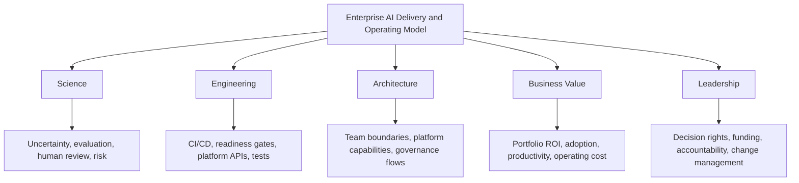

---

## 1. Why AI Needs an Operating Model

Enterprise AI is not one technology project.

It is a portfolio of workflows, platforms, data products, controls, and adoption programs.

### Operating Model Questions

- Who owns the AI platform?
- Who owns each use case?
- Who owns knowledge sources?
- Who approves model routes?
- Who owns cost?
- Who owns production incidents?
- Who signs off on regulated workflows?
- Who decides when a pilot becomes a product?
- Who retires low-value use cases?
- Who maintains evaluation datasets?

### Operating Model Diagram

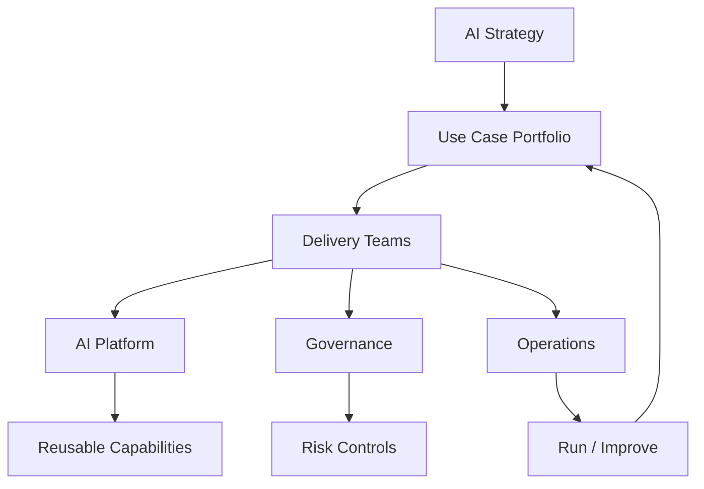

### Principle

> Enterprise AI delivery fails when ownership is vague.

---

## 2. AI Product Lifecycle

A repeatable lifecycle turns ideas into outcomes.

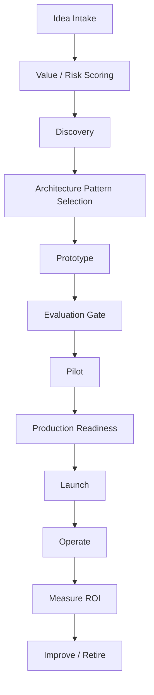

### Lifecycle Stages

| Stage | Main Question |
|---|---|
| intake | is this worth exploring? |
| discovery | what workflow and users are involved? |
| architecture | which patterns are needed? |
| prototype | can AI solve the task? |
| evaluation | is quality/safety/cost acceptable? |
| pilot | does it work with real users? |
| launch | is it production ready? |
| operate | is it reliable and valuable? |
| improve/retire | should we scale, tune, or stop? |

---

## 3. Use Case Intake

Use case intake should capture enough information to avoid vague AI requests.

### Intake Template

```yaml
use_case:
  name: support_case_drafting
  sponsor: vp_customer_support
  business_owner: support_operations
  users:
    - support_l1
    - support_l2
  problem: "Agents spend too much time drafting policy-grounded responses."
  expected_value:
    metric: average_handle_time
    target_improvement: "15%"
  risk_tier: 3
  data_classes:
    - confidential
  ai_capabilities:
    - rag
    - generation
    - guardrails
  tools_required:
    - get_customer_status
  human_review_required: true
  launch_target: "2026-Q4"
```

### Python Intake Validator

```python
from __future__ import annotations

from dataclasses import dataclass, field
from pathlib import Path
from typing import Optional

import yaml


REQUIRED_FIELDS = [
    "name", "sponsor", "business_owner", "problem",
    "expected_value", "risk_tier", "data_classes",
]

HIGH_RISK_TIERS = {4, 5, 6}
VALID_DATA_CLASSES = {"public", "internal", "confidential", "restricted"}
VALID_AI_CAPABILITIES = {"rag", "generation", "agents", "tools", "guardrails",
                          "evaluation", "multimodal", "streaming", "fine_tuning"}


@dataclass
class IntakeValidationResult:
    use_case_name: str
    valid: bool
    errors: list[str] = field(default_factory=list)
    warnings: list[str] = field(default_factory=list)

    def print_report(self) -> None:
        status = "✓ VALID" if self.valid else "✗ INVALID"
        print(f"\n{status}: {self.use_case_name}")
        for err in self.errors:
            print(f"  ERROR:   {err}")
        for warn in self.warnings:
            print(f"  WARNING: {warn}")


class IntakeValidator:
    """
    Validates AI use case intake forms against required fields,
    risk tier rules, data class standards, and governance requirements.
    """

    def validate(self, use_case: dict) -> IntakeValidationResult:
        name = use_case.get("name", "unknown")
        errors: list[str] = []
        warnings: list[str] = []

        # Required fields
        for f in REQUIRED_FIELDS:
            if not use_case.get(f):
                errors.append(f"Missing required field: '{f}'")

        # Risk tier rules
        risk_tier = use_case.get("risk_tier", 0)
        if not isinstance(risk_tier, int) or risk_tier < 1 or risk_tier > 6:
            errors.append("risk_tier must be an integer between 1 and 6")
        elif risk_tier in HIGH_RISK_TIERS:
            if not use_case.get("human_review_required"):
                errors.append(
                    f"risk_tier {risk_tier} requires human_review_required: true"
                )
            if not use_case.get("tools_required") is not None:
                warnings.append("High-risk tier: tool risk matrix recommended")

        # Data class validation
        data_classes = use_case.get("data_classes", [])
        invalid_classes = [dc for dc in data_classes
                           if dc not in VALID_DATA_CLASSES]
        if invalid_classes:
            errors.append(f"Invalid data_classes: {invalid_classes}. "
                          f"Valid: {sorted(VALID_DATA_CLASSES)}")

        if "restricted" in data_classes and risk_tier < 4:
            warnings.append(
                "Restricted data class with low risk tier — consider raising tier"
            )

        # Expected value
        ev = use_case.get("expected_value", {})
        if not ev.get("metric"):
            errors.append("expected_value.metric is required")
        if not ev.get("target_improvement"):
            warnings.append("expected_value.target_improvement is recommended")

        # AI capabilities
        caps = use_case.get("ai_capabilities", [])
        unknown_caps = [c for c in caps if c not in VALID_AI_CAPABILITIES]
        if unknown_caps:
            warnings.append(f"Unrecognized ai_capabilities: {unknown_caps}")

        # Launch target
        if not use_case.get("launch_target"):
            warnings.append("launch_target is recommended for portfolio tracking")

        return IntakeValidationResult(
            use_case_name=name,
            valid=len(errors) == 0,
            errors=errors,
            warnings=warnings
        )

    def validate_file(self, yaml_path: str) -> IntakeValidationResult:
        use_case = yaml.safe_load(Path(yaml_path).read_text(encoding="utf-8"))
        return self.validate(use_case.get("use_case", use_case))


if __name__ == "__main__":
    import sys
    validator = IntakeValidator()
    path = sys.argv[1] if len(sys.argv) > 1 else "use-case-intake.yaml"
    result = validator.validate_file(path)
    result.print_report()
    if not result.valid:
        raise SystemExit(1)
```

---

## 4. Portfolio Prioritization

Not every AI idea deserves funding.

### Prioritization Dimensions

- business value
- user pain
- feasibility
- data readiness
- risk
- implementation complexity
- platform reuse
- cost
- executive sponsorship
- time to value

### Scoring Formula

```text
Priority Score =
(value * feasibility * data readiness * sponsorship)
- (risk + complexity + operating cost)
```

### Python Scoring Scaffold

```python
from dataclasses import dataclass


@dataclass
class UseCaseScore:
    value: int
    feasibility: int
    data_readiness: int
    sponsorship: int
    risk: int
    complexity: int
    operating_cost: int


def priority_score(s: UseCaseScore) -> int:
    return (s.value * 3 + s.feasibility * 2 + s.data_readiness * 2 + s.sponsorship) - (
        s.risk * 2 + s.complexity + s.operating_cost
    )


if __name__ == "__main__":
    score = priority_score(UseCaseScore(5, 4, 3, 5, 3, 3, 2))
    print(score)
```

### `score_use_cases.py` — YAML Portfolio Runner

```python
from __future__ import annotations

from dataclasses import dataclass
from pathlib import Path

import yaml


@dataclass
class UseCaseScore:
    value: int
    feasibility: int
    data_readiness: int
    sponsorship: int
    risk: int
    complexity: int
    operating_cost: int


def priority_score(s: UseCaseScore) -> int:
    return (s.value * 3 + s.feasibility * 2 + s.data_readiness * 2 + s.sponsorship) - (
        s.risk * 2 + s.complexity + s.operating_cost
    )


def score_portfolio(portfolio_path: str) -> list[dict]:
    """Load portfolio.yaml and score all use cases, returning ranked results."""
    data = yaml.safe_load(Path(portfolio_path).read_text(encoding="utf-8"))
    use_cases = data.get("use_cases", [])
    results = []

    for uc in use_cases:
        s = UseCaseScore(
            value=uc.get("value", 0),
            feasibility=uc.get("feasibility", 0),
            data_readiness=uc.get("data_readiness", 0),
            sponsorship=uc.get("sponsorship", 0),
            risk=uc.get("risk", 5),
            complexity=uc.get("complexity", 5),
            operating_cost=uc.get("operating_cost", 3),
        )
        score = priority_score(s)
        results.append({
            "name": uc.get("name", "unnamed"),
            "owner": uc.get("owner", "unassigned"),
            "score": score,
            "recommendation": (
                "fast-track" if score >= 20
                else "proceed" if score >= 12
                else "hold" if score >= 5
                else "stop"
            )
        })

    return sorted(results, key=lambda r: r["score"], reverse=True)


if __name__ == "__main__":
    import sys
    path = sys.argv[1] if len(sys.argv) > 1 else "portfolio.yaml"
    ranked = score_portfolio(path)
    print(f"\n{'Rank':<5} {'Score':>6}  {'Recommendation':<14} {'Name':<35} Owner")
    print("-" * 85)
    for i, r in enumerate(ranked, 1):
        print(f"{i:<5} {r['score']:>6}  {r['recommendation']:<14} {r['name']:<35} {r['owner']}")
```

### Principle

> The best AI use case is not the flashiest. It is the one with clear value, feasible data, acceptable risk, and an accountable owner.

---

## 5. Team Topologies for Enterprise AI

Enterprise AI requires multiple team types.

### Team Types

| Team | Role |
|---|---|
| stream-aligned product team | owns business workflow and user experience |
| AI platform team | owns shared AI capabilities |
| enabling team | helps teams adopt AI patterns |
| complicated-subsystem team | owns specialized retrieval, infrastructure, model serving, or security components |
| governance team | owns policy, review, risk, and approvals |

### Team Topology Diagram

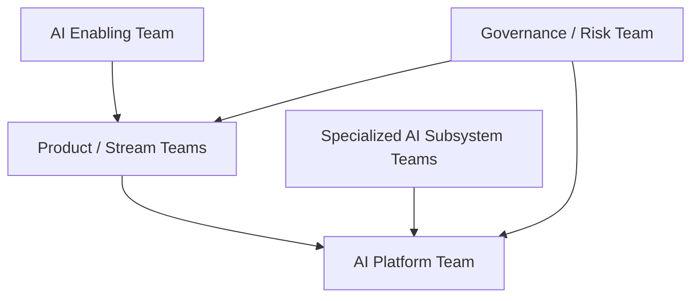

### Principle

> AI platform teams should reduce cognitive load for product teams, not centralize every AI decision.

---

## 6. AI Platform Team

The AI platform team owns reusable capabilities.

### Platform Responsibilities

- AI gateway
- model router
- prompt registry
- context builder
- RAG platform
- MCP/tool gateway
- agent runtime patterns
- guardrail service
- evaluation service
- observability
- FinOps
- developer SDKs
- templates
- reference architectures
- production runbooks

### Platform Product Mindset

The AI platform team should treat internal teams as customers.

Metrics:

- adoption
- developer satisfaction
- time to first production AI use case
- platform reuse
- incident rate
- cost visibility
- evaluation coverage
- security approval cycle time

---

## 7. Stream-Aligned Product Teams

Product teams own business outcomes.

### Product Team Responsibilities

- user problem
- workflow definition
- UX
- business KPI
- adoption
- human review process
- feedback loop
- frontline training
- acceptance criteria
- production value measurement

### Product Ownership Rule

> If the product team cannot define success without mentioning the model, the use case is not ready.

---

## 8. Data and Knowledge Ownership

RAG and knowledge systems fail when nobody owns source quality.

### Knowledge Owner Responsibilities

- source accuracy
- source freshness
- metadata quality
- ACL correctness
- document lifecycle
- archival/removal
- citation usefulness
- source approval
- RAG evaluation cases

### Knowledge Ownership Config

```yaml
knowledge_source:
  name: support_refund_policy
  owner: support_policy_team
  steward: policy_operations
  freshness_slo_days: 30
  access_model: role_based
  evaluation_suite: refund-policy-rag-v2
  escalation_contact: support-policy-owner
```

### Principle

> RAG quality is not owned by the model team. It is owned by the knowledge owners and the platform together.

---

## 9. Security, Compliance, and Legal Roles

Security and compliance should be built into the process, not bolted on at the end.

### Responsibilities

- risk tiering
- data classification
- model/provider policy
- prompt injection review
- tool risk review
- guardrail policy
- audit requirements
- legal claim review
- human approval rules
- incident response

### Fast Governance Pattern

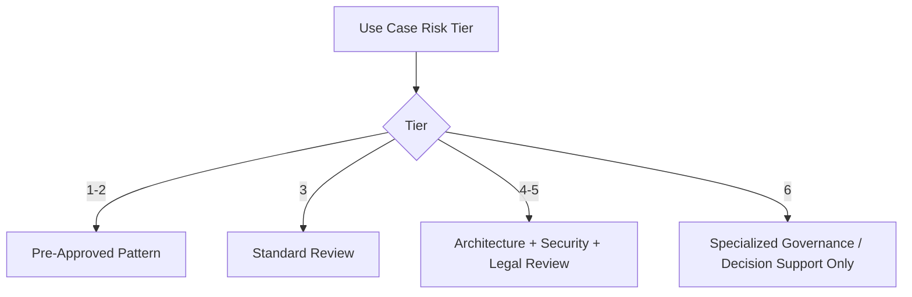

### Principle

> Governance should be risk-tiered. Slow governance for every AI idea creates shadow AI.

---

## 10. FDE Delivery Model

Field deployment engineers, or FDE-style teams, combine product, engineering, architecture, and customer workflow discovery.

### FDE Works Best When

- workflow is ambiguous
- value depends on field adoption
- integration is complex
- user behavior matters
- enterprise systems are messy
- use case needs rapid iteration
- ROI must be proven quickly

### FDE Delivery Loop

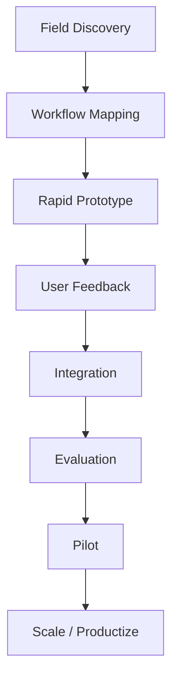

### FDE Responsibilities

- understand business workflow
- identify friction
- prototype quickly
- integrate with enterprise systems
- capture adoption barriers
- measure value
- feed platform gaps back to platform team

### Principle

> FDE is not demo engineering. It is outcome engineering at the edge of the business.

---

## 11. Architecture Review Process

AI architecture review should focus on value, risk, and platform reuse.

### Review Checklist

- business owner
- KPI
- risk tier
- data classification
- model route
- prompt ownership
- RAG sources
- tool risk
- guardrails
- evaluation dataset
- observability
- cost estimate
- human approval
- production support
- rollback plan

### Architecture Review Flow

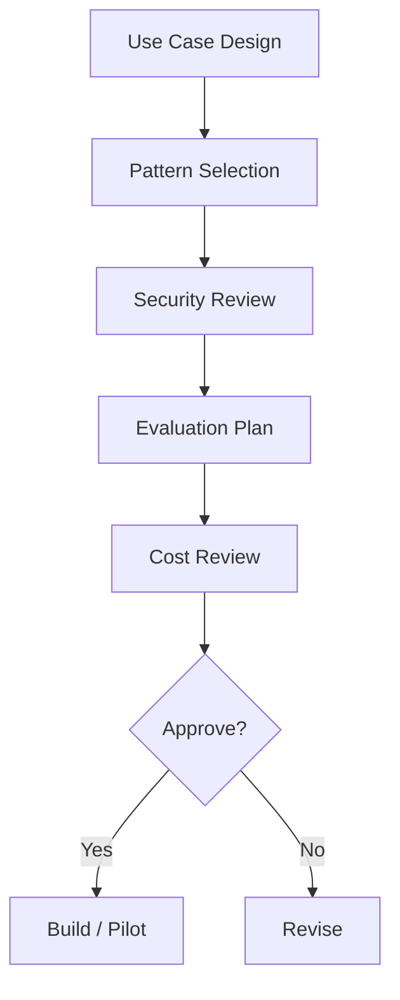

---

## 12. Production Readiness Gate

Production readiness is a launch gate.

### Readiness YAML

```yaml
production_readiness:
  use_case: support_case_drafting
  owner: support_operations
  platform_controls:
    ai_gateway: true
    model_router: true
    prompt_registry: true
    observability: true
    finops: true
  quality:
    eval_suite: support-rag-v4
    quality_score_min: 0.86
    safety_score_min: 0.98
  operations:
    runbook: runbooks/support-case-drafting.md
    support_tier: tier_2
    rollback_plan: true
  launch_decision: pending
```

### Python Readiness Check

```python
def production_ready(checks: dict) -> tuple[bool, list[str]]:
    failures = []

    if not checks.get("owner"):
        failures.append("missing owner")
    if not checks.get("platform_controls", {}).get("ai_gateway"):
        failures.append("AI gateway required")
    if checks.get("quality", {}).get("quality_score", 0) < checks.get("quality", {}).get("quality_score_min", 1):
        failures.append("quality score below threshold")
    if not checks.get("operations", {}).get("runbook"):
        failures.append("missing runbook")

    return len(failures) == 0, failures
```

---

## 13. Release Management

AI releases include:

- code
- model route
- prompt version
- retrieval config
- tool schema
- agent graph
- guardrail policy
- evaluation dataset
- cost policy
- tenant policy
- streaming behavior
- multimodal parser

### Release Flow

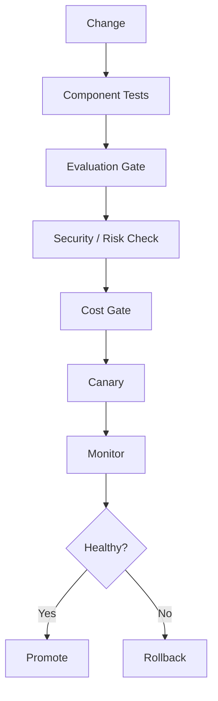

### Release Manifest

```yaml
release:
  application: support-assistant
  version: 2.3.0
  changes:
    prompt_version: support_policy_answer:1.5.0
    model_route: balanced_model
    rag_config: support-kb-v4
  eval:
    suite: support-rag-v4
    passed: true
  rollback:
    prompt_version: support_policy_answer:1.4.2
    model_route: previous
```

---

## 14. Support Model

AI systems need support ownership after launch.

### Support Tiers

| Tier | Responsibility |
|---|---|
| Tier 0 | user docs, FAQs, self-service |
| Tier 1 | frontline support, known issues |
| Tier 2 | product team triage |
| Tier 3 | AI platform / model / RAG / tool support |
| Tier 4 | vendor/cloud/provider escalation |

### Incident Routing

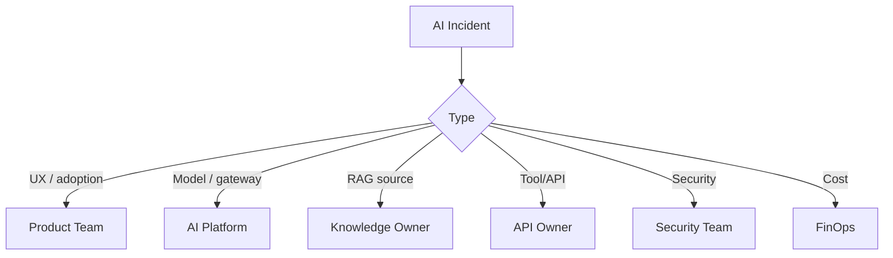

---

## 15. Multi-Tenant Operating Model

Multi-tenancy needs operational ownership.

### Tenant Onboarding Checklist

- tenant owner
- cost center
- allowed models
- data scopes
- RAG sources
- tool access
- quotas
- budgets
- support contacts
- logging policy
- evaluation requirements
- chargeback/showback

### Tenant Onboarding Config

```yaml
tenant:
  name: device-operations
  owner: vp_operations
  cost_center: OPS-AI-001
  allowed_models:
    - balanced_model
    - private_ops_llm
  allowed_tools:
    - get_device_telemetry
    - search_incidents
  monthly_budget_usd: 40000
  support_contact: ops-ai-support
```

### Principle

> Every tenant needs an owner, budget, policy, support path, and telemetry dashboard.

---

## 16. Streaming Operating Model

Streaming is a product, platform, and operations decision.

### Streaming Readiness

- TTFT SLO defined
- cancellation propagation tested
- partial output logging policy defined
- final validation strategy defined
- high-risk workflows identified
- user experience reviewed
- fallback to non-streaming available
- abandoned stream cost tracked

### Streaming Launch Gate

```yaml
streaming_readiness:
  enabled: true
  p95_ttft_ms: 1000
  cancellation_test_passed: true
  high_risk_streaming_disabled: true
  final_validation_required: true
  abandoned_cost_tracking: true
```

---

## 17. Multimodal Operating Model

Multimodal AI requires specialized ownership.

### Operating Questions

- Who owns uploaded file handling?
- Who approves image/audio/video storage?
- Who validates OCR quality?
- Who reviews visual hallucinations?
- Who handles PII in screenshots?
- Who defines human review thresholds?
- Who monitors file-processing cost?

### Multimodal RACI

| Activity | Product | Platform | Security | Data Owner | Human Reviewer |
|---|---|---|---|---|---|
| define workflow | A/R | C | C | C | C |
| file ingestion | C | A/R | C | C | I |
| PII detection | C | R | A | C | I |
| model evaluation | C | R | C | A | C |
| low-confidence review | R | C | I | C | A/R |

---

## 18. Evaluation Operating Model

Evaluation needs ownership and cadence.

### Evaluation Roles

| Role | Responsibility |
|---|---|
| product owner | outcome metrics |
| domain SME | correctness labels |
| platform team | eval infrastructure |
| security/compliance | safety/risk cases |
| knowledge owner | RAG source cases |
| human reviewers | calibration |
| executives | risk thresholds |

### Evaluation Cadence

```yaml
evaluation_cadence:
  release_eval: every_release
  regression_eval: nightly
  safety_eval: weekly
  human_review_sample: biweekly
  business_kpi_review: monthly
  dataset_refresh: monthly
```

### Principle

> Evaluation is not a QA phase. It is an operating rhythm.

---

## 19. AI Portfolio Governance

Executives need portfolio visibility.

### Portfolio Dashboard

- active use cases
- stage
- owner
- risk tier
- business KPI
- ROI estimate
- monthly cost
- quality score
- safety score
- incidents
- adoption
- next decision

### Portfolio Record

```yaml
portfolio_item:
  name: incident_summary_agent
  stage: pilot
  owner: operations
  risk_tier: 4
  monthly_cost_usd: 12000
  estimated_monthly_value_usd: 45000
  quality_score: 0.88
  safety_score: 0.99
  decision: scale
```

### Governance Question

Not every pilot should scale. Governance should decide: scale, hold, fix, or retire.

---

## 20. Change Management and Adoption

AI value depends on adoption.

### Adoption Risks

- users do not trust output
- users do not understand limitations
- managers do not adjust workflow
- incentives are misaligned
- human review is too slow
- AI output is hard to edit
- training is missing
- quality is inconsistent

### Adoption Plan

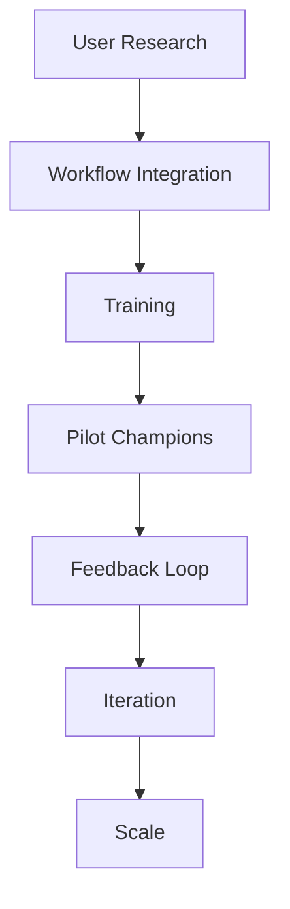

### Adoption Metrics

- active users
- repeat usage
- accepted outputs
- edited outputs
- abandoned workflows
- escalation rate
- satisfaction
- productivity improvement
- business KPI movement

---

## 21. AI Delivery Metrics

### Delivery Metrics

| Metric | Meaning |
|---|---|
| idea-to-prototype time | delivery speed |
| prototype-to-pilot time | execution speed |
| pilot-to-production rate | maturity |
| production adoption | user value |
| platform reuse | architecture leverage |
| incident rate | operational maturity |
| cost per workflow | FinOps maturity |
| evaluation coverage | quality maturity |
| security review cycle time | governance efficiency |
| ROI realized | business impact |

### Principle

> AI delivery maturity is measured by production outcomes, not number of demos.

---

## 22. Operating Cadence

### Cadence Table

| Meeting | Frequency | Purpose |
|---|---|---|
| AI portfolio review | monthly | prioritize, scale, retire |
| AI platform review | biweekly | roadmap, adoption, incidents |
| model/cost review | monthly | routing, budgets, vendors |
| evaluation review | biweekly | quality, safety, regressions |
| architecture review | weekly | new use cases and changes |
| incident review | as needed | root cause and regression tests |
| executive steering | quarterly | strategy, funding, risk appetite |

### Principle

Operating cadence turns AI from project work into a managed capability.

---

## 23. Build, Buy, Partner, or FDE

### Decision Table

| Situation | Delivery Model |
|---|---|
| reusable platform capability | build/platform |
| commodity SaaS feature | buy |
| complex field workflow | FDE |
| specialized model/infrastructure | partner |
| high-risk regulated workflow | governed internal build |
| unclear value | prototype/pilot first |

### Principle

> Do not build everything. Build the differentiating control planes and compose the rest.

---

## 24. Component-Level Delivery Ownership

Every platform component must have an owner.

### Component Ownership Matrix

| Component | Owner | Tests Required |
|---|---|---|
| AI Gateway | AI Platform | auth, routing, tenant, cost |
| Model Router | AI Platform | route policy, fallback |
| Prompt Registry | AI Platform/Product | version, approval, rollback |
| RAG Platform | Platform/Data Owners | retrieval, ACL, freshness |
| Tool Gateway | Platform/API Owners | schema, auth, risk |
| Agent Runtime | Platform/Product | trace, stop, approval |
| Guardrails | Security/Platform | false pos/neg, policy |
| Evaluation Service | AI Quality | dataset, judge, gate |
| Observability | SRE/Platform | trace completeness |
| FinOps | FinOps/Platform | budgets, chargeback |

---

## 25. Capstone Operating Model

The Enterprise Agentic Operations Platform needs a delivery and operations model.

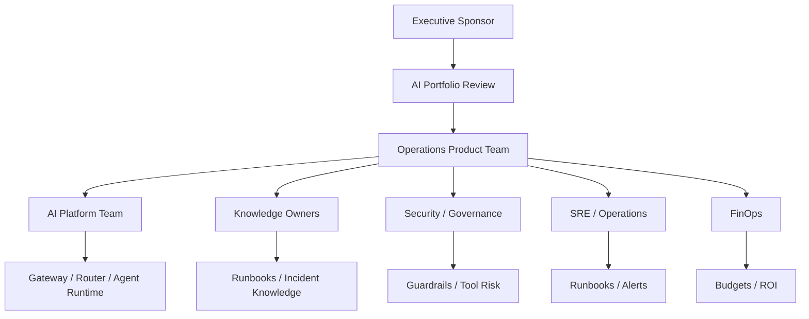

### Capstone Roles

| Role | Responsibility |
|---|---|
| operations product owner | incident workflow and KPI |
| AI platform | gateway, agents, tools, eval, observability |
| knowledge owners | runbooks, firmware notes, incident history |
| security | tool risk, data classification, tenant controls |
| SRE | incidents, SLOs, runbooks |
| FinOps | cost per incident investigation |
| executive sponsor | funding and risk appetite |

---

## 26. Production Readiness Checklist

Before a use case launches:

- [ ] business owner assigned
- [ ] product owner assigned
- [ ] platform owner assigned
- [ ] support owner assigned
- [ ] knowledge owner assigned if RAG used
- [ ] API/tool owner assigned if tools used
- [ ] risk tier approved
- [ ] data classification completed
- [ ] architecture review passed
- [ ] security review passed
- [ ] evaluation gate passed
- [ ] FinOps budget approved
- [ ] observability dashboard ready
- [ ] incident runbook ready
- [ ] human review workflow ready
- [ ] streaming readiness complete if used
- [ ] multimodal readiness complete if used
- [ ] tenant onboarding complete if applicable
- [ ] training/adoption plan ready
- [ ] rollback plan ready
- [ ] portfolio dashboard updated

---

## 27. Architecture Review Scenario

### Scenario

A company has 35 AI pilots. Only 3 are in production. Nobody knows which pilots are valuable, who owns them, or why they stalled.

### Review Finding

The issue is not model capability. The issue is operating-model failure.

### Problems

- no intake process
- no prioritization
- no product owners
- no knowledge owners
- no platform reuse
- no evaluation gate
- no production readiness checklist
- no support model
- no ROI tracking
- no retire/scale decision process

### Improved Model

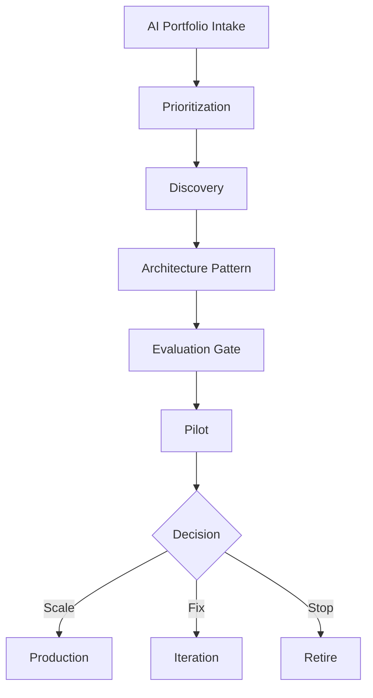

### Recommendation

Create a portfolio operating model before adding more pilots.

---

## 28. Production Lessons from the Field

### Production Context

The following lessons come from scaling AI from isolated prototypes to five production systems across a global connected device platform. The operating model described in this chapter was built incrementally as each failure pattern appeared. None of it was designed upfront — it emerged from specific incidents, cost surprises, adoption failures, and quality regressions that could not be resolved without organizational changes to go alongside the technical ones.

### Lesson 1: Pilots Stall Without Owners

SupportIQ's first prototype was built by the AI platform team in six weeks. It demonstrated a 60% reduction in time-to-draft for policy-grounded support responses. The demo was shown to the VP of Customer Support. The response was enthusiastic. The platform team waited for business ownership transfer.

It never came. The VP had no funded headcount to own an AI product. The prototype ran in a staging environment for four months while the organizational discussion continued. A competing team in another business unit started a similar project.

The fix was a mandatory intake field: `business_owner` must be named before prototype work begins. No owner, no resources from the platform team.

What worked after:

- business owner named before any prototype is started
- product owner from the business team co-located with platform engineers during pilot
- KPI defined in the intake form and tracked from the first week of pilot
- launch gate blocked until a support tier was confirmed

What failed before:

- platform team built and waited
- no funded owner on the business side
- no accountability for adoption after demo

### Lesson 2: Knowledge Ownership Is the Hidden Bottleneck

DeviceIQ's knowledge base for runbook retrieval was seeded by exporting all documents from Confluence that contained the word "firmware" or "terminal." This produced 4,300 documents. Of these, approximately 1,800 were stale procedures for products no longer in production, 600 were meeting notes with no instructional content, and 400 were duplicates with different versions.

The initial retrieval quality was poor. Investigation revealed that the issue was not the model, the chunking strategy, or the embedding model — it was the source content.

What worked after:

- named knowledge owner for each source domain (firmware team, operations team, support team)
- freshness SLA: 30 days for operational runbooks, 7 days for active incident procedures
- explicit content ingestion approval: document owners must approve content before it enters the knowledge base
- RAG evaluation cases owned by the knowledge domain, not the AI platform

What failed before:

- "dump everything into the vector DB and see what retrieves"
- no content owner for any source
- quality blame directed at the model when the problem was the source material

### Lesson 3: Governance Must Be Fast and Tiered

Before the tiered review process existed, every AI use case — regardless of risk level — went through the same security and architecture review. A tier-1 internal draft tool for the engineering team went through the same six-week process as a tier-5 production operations workflow.

Teams started building without submitting for review. Within three months, four unauthorized AI tools were in production inside the organization. Two of them had material security gaps.

What worked after the tier redesign:

- tier-1/2: self-service checklist reviewed in a 30-minute async slot
- tier-3: standard 48-hour architecture review using pre-approved patterns
- tier-4/5: full security, legal, and architecture review with explicit risk acceptance sign-off
- pre-approved patterns for gateway, RAG, tool gateway, and evaluation reduced tier-3 review to checking configuration rather than re-proving architecture

What failed before:

- one-size review regardless of risk
- review as a gatekeeper, not as a service
- no pre-approved patterns — every use case started from zero

### Lesson 4: Platform Teams Must Operate Like Product Teams

In the first year, the AI platform team owned the gateway, prompt registry, RAG platform, tool gateway, and evaluation service. Product teams used these capabilities but found them difficult to adopt because documentation was minimal, the API interfaces changed without notice, and there was no developer experience investment.

Two product teams built their own custom model clients and their own custom context builders because the platform was "too hard to use." The result was three different context assembly implementations with different behavior, different security posture, and different cost attribution.

What fixed it:

- internal developer SDK with consistent interface, well-documented, versioned
- platform team office hours for product teams
- platform adoption rate added as a team KPI (alongside reliability, cost, and quality)
- breaking changes announced 4 weeks in advance with migration support
- monthly developer satisfaction survey from internal consumers

What failed before:

- platform as infrastructure, not as product
- no internal customer feedback loop
- no adoption metric

### Lesson 5: AI Value Needs Change Management

CertifyIQ's release certification automation reduced the time from code commit to release certification from 3 days to 4 hours. The technical outcome was clearly successful. Adoption was 62% in the first month — QA engineers used it for some releases but not others, and continued using the manual process for anything they considered "important."

The AI was producing the right output. The organizational behavior had not changed.

What worked after:

- manager-level alignment: QA leads directed teams to use CertifyIQ for all releases, not optionally
- edge case training: engineers learned how to interpret low-confidence certifications and when to escalate
- workflow redesign: the manual fallback path was made deliberately more expensive (additional sign-off required) to shift incentives
- feedback loop: every engineer rejection of a CertifyIQ result was reviewed with the engineer to understand whether the output was wrong or the process expectation was wrong

What failed before:

- "we launched CertifyIQ and adoption will follow"
- no manager-level alignment
- no change to the underlying workflow incentives


- business applauds
- no team funds production

### Lesson 2: Knowledge Ownership Is the Hidden Bottleneck

What worked:

- knowledge source owners
- freshness SLAs
- RAG evaluation cases
- document lifecycle

What failed:

- dumping SharePoint into vector DB
- no content owner
- stale policy answers

### Lesson 3: Governance Must Be Fast and Tiered

What worked:

- risk-tiered controls
- pre-approved patterns
- self-service templates
- fast architecture review

What failed:

- every use case treated as high risk
- teams bypass central process

### Lesson 4: Platform Teams Must Operate Like Product Teams

What worked:

- SDKs
- templates
- docs
- office hours
- platform roadmap
- adoption metrics

What failed:

- platform as gatekeeper
- no developer experience
- no service ownership

### Lesson 5: AI Value Needs Change Management

What worked:

- training
- champions
- feedback loops
- manager alignment
- workflow redesign

What failed:

- "we launched the assistant"
- no adoption plan
- no operational incentives

---

## 29. Pratik's Principles

### Principle 1: AI Needs Owners Before It Needs More Models

If nobody owns the outcome, the model will not create value.

### Principle 2: Pilots Are Not Products

A pilot proves possibility. A product delivers value repeatedly.

### Principle 3: Platform Teams Must Accelerate, Not Police

Governance should be built into reusable rails.

### Principle 4: Knowledge Ownership Is AI Ownership

If source knowledge is stale, AI will be stale.

### Principle 5: Risk-Tier Governance Beats One-Size Governance

Controls should match impact.

### Principle 6: FDE Is Outcome Engineering

Field delivery is about making AI work inside real business workflows.

### Principle 7: Production AI Needs a Support Model

If users depend on it, someone must support it.

### Principle 8: Retire Weak Use Cases

A mature AI portfolio stops funding low-value automation.

---

## 30. Hands-On Labs with Scaffolding

### Lab 1: AI Use Case Intake

```text
labs/chapter-22-operating-model/lab1-intake/
  use-case-intake.yaml
  validate_intake.py
  README.md
```

Tasks:

1. Create intake for a support assistant.
2. Validate required fields.
3. Assign risk tier.
4. Define success metric.

---

### Lab 2: Portfolio Prioritization

```text
labs/chapter-22-operating-model/lab2-prioritization/
  score_use_cases.py
  portfolio.yaml
  ranked-output.md
```

Tasks:

1. Score five use cases.
2. Rank by value, feasibility, data readiness, risk, and cost.
3. Recommend top two for discovery.

---

### Lab 3: RACI and Ownership Registry

```text
labs/chapter-22-operating-model/lab3-raci/
  ownership-registry.yaml
  raci-matrix.md
  validate_ownership.py
```

Tasks:

1. Define owners for platform components.
2. Define owners for use case artifacts.
3. Fail validation if critical owner is missing.

---

### Lab 4: Production Readiness Gate

```text
labs/chapter-22-operating-model/lab4-readiness/
  production-readiness.yaml
  readiness_check.py
  tests/test_readiness.py
```

### `tests/test_readiness.py`

```python
import pytest
from readiness_check import production_ready


def base_checks(**overrides) -> dict:
    """Valid production readiness dict — override specific fields for each test."""
    defaults = {
        "owner": "support_operations",
        "platform_controls": {
            "ai_gateway": True,
            "model_router": True,
            "prompt_registry": True,
            "observability": True,
            "finops": True
        },
        "quality": {
            "eval_suite": "support-rag-v4",
            "quality_score": 0.88,
            "quality_score_min": 0.86,
            "safety_score": 0.99,
            "safety_score_min": 0.98
        },
        "operations": {
            "runbook": "runbooks/support-case-drafting.md",
            "support_tier": "tier_2",
            "rollback_plan": True
        },
        "finops": {
            "budget_approved": True,
            "monthly_budget_usd": 25000
        }
    }
    defaults.update(overrides)
    return defaults


def test_fully_valid_passes():
    ok, failures = production_ready(base_checks())
    assert ok, f"Expected pass, got failures: {failures}"


def test_missing_owner_fails():
    ok, failures = production_ready(base_checks(owner=None))
    assert not ok
    assert any("owner" in f for f in failures)


def test_missing_gateway_fails():
    checks = base_checks()
    checks["platform_controls"]["ai_gateway"] = False
    ok, failures = production_ready(checks)
    assert not ok
    assert any("gateway" in f.lower() for f in failures)


def test_quality_below_threshold_fails():
    checks = base_checks()
    checks["quality"]["quality_score"] = 0.81  # below 0.86 min
    ok, failures = production_ready(checks)
    assert not ok
    assert any("quality" in f.lower() for f in failures)


def test_safety_below_threshold_fails():
    checks = base_checks()
    checks["quality"]["safety_score"] = 0.95  # below 0.98 min
    ok, failures = production_ready(checks)
    assert not ok
    assert any("safety" in f.lower() for f in failures)


def test_missing_runbook_fails():
    checks = base_checks()
    checks["operations"]["runbook"] = None
    ok, failures = production_ready(checks)
    assert not ok
    assert any("runbook" in f.lower() for f in failures)


def test_unapproved_budget_fails():
    checks = base_checks()
    checks["finops"] = {"budget_approved": False, "monthly_budget_usd": 25000}
    ok, failures = production_ready(checks)
    assert not ok
    assert any("budget" in f.lower() for f in failures)


def test_multiple_failures_all_reported():
    checks = base_checks(owner=None)
    checks["operations"]["runbook"] = None
    checks["quality"]["quality_score"] = 0.70
    ok, failures = production_ready(checks)
    assert not ok
    assert len(failures) >= 3
```

Tasks:

1. Run `pytest tests/test_readiness.py -v`
2. Add a test for missing observability in platform controls
3. Add a test for rollback plan not defined
4. Extend `production_ready()` to also check streaming readiness when applicable

---

### Lab 5: Operating Cadence Design

```text
labs/chapter-22-operating-model/lab5-cadence/
  operating-cadence.md
  portfolio-dashboard-template.md
  meeting-charters.md
```

Tasks:

1. Define monthly portfolio review.
2. Define biweekly evaluation review.
3. Define weekly architecture review.
4. Define incident review process.

---

### Lab 6: Capstone Operating Model

```text
labs/chapter-22-operating-model/lab6-capstone/
  capstone-operating-model.md
  capstone-raci.md
  capstone-runbook.md
  capstone-kpi-dashboard.md
```

Tasks:

1. Define teams and owners.
2. Define support model.
3. Define evaluation cadence.
4. Define ROI dashboard.

---

## 31. Interview Questions

### Engineering-Level Questions

1. Why does enterprise AI need an operating model?
2. What is a production readiness gate?
3. What should be in an AI use case intake form?
4. Who owns a prompt?
5. Who owns RAG source quality?
6. What is the role of an AI platform team?
7. What is an FDE delivery model?
8. Why do AI products need support tiers?
9. What operating cadence is needed after launch?
10. How do you decide whether to scale or retire a pilot?

### Architect-Level Questions

1. Design an operating model for an enterprise AI platform.
2. How would you structure AI platform and product teams?
3. How would you create an AI use case intake and prioritization process?
4. How would you govern model, prompt, RAG, tool, and guardrail changes?
5. How would you design a production readiness checklist?
6. How would you organize ownership for a multi-tenant AI platform?
7. How would you support multimodal AI workflows operationally?
8. How would you integrate FDE teams with platform teams?
9. How would you connect AI delivery to FinOps and observability?
10. How would you run portfolio governance?

### Director / VP / CTO-Level Questions

1. Why are our AI pilots not becoming products?
2. What should be centralized vs owned by product teams?
3. How do we fund the AI platform?
4. How do we measure AI delivery maturity?
5. What is our operating cadence?
6. How do we prevent shadow AI?
7. How do we make governance fast?
8. How do we create accountability for AI outcomes?
9. When should we retire AI use cases?
10. What would make you block a production AI launch?

---

## 32. Certification Mapping

### AWS AI / Generative AI Professional Preparation

This chapter supports:

- operationalizing Bedrock-based applications
- production readiness
- governance and responsible AI
- monitoring and support model
- model/prompt/RAG/agent lifecycle
- cost and operational ownership
- multi-account/multi-tenant delivery patterns

### Anthropic Claude / MCP Architecture Preparation

This chapter supports:

- Claude application ownership
- MCP server ownership
- tool governance
- prompt ownership
- evaluation cadence
- human approval and support patterns

### NVIDIA Generative AI Preparation

This chapter supports:

- operating self-hosted AI platforms
- GPU platform ownership
- model-serving support
- infrastructure team responsibilities
- cost/utilization governance

---

## 33. Chapter Exercises

### Exercise 1

Design an AI operating model for a company with 50 AI ideas and 5 platform engineers.

### Exercise 2

Create a RACI matrix for an AI support assistant that uses RAG, tools, guardrails, and human review.

### Exercise 3

Design a production readiness checklist for a multimodal field service assistant.

### Exercise 4

Create a monthly AI portfolio review dashboard.

Include cost, quality, safety, adoption, ROI, and decision status.

### Exercise 5

Design an FDE delivery model for a private equity portfolio company AI transformation program.

---

## 34. Key Terms

| Term | Meaning |
|---|---|
| AI operating model | Organizational system for delivering, governing, and operating AI |
| AI product lifecycle | Path from idea to production and improvement |
| AI platform team | Team owning reusable AI capabilities |
| Stream-aligned team | Product/workflow team owning business outcome |
| Enabling team | Team helping other teams adopt AI patterns |
| FDE | Field deployment engineer / field delivery model |
| RACI | Responsible, accountable, consulted, informed |
| Production readiness gate | Launch checklist for production AI |
| Portfolio governance | Process for prioritizing and managing AI use cases |
| Knowledge owner | Owner of source quality and freshness |
| Risk-tiered governance | Controls matched to impact |
| Support model | Operational ownership after launch |
| Operating cadence | Recurring reviews and decision forums |
| Change management | Adoption and behavior-change plan |
| Pilot | Controlled validation |
| Product | Supported production workflow with measured value |

---

## 35. One-Page Executive Brief

Enterprise AI delivery requires an operating model.

Most companies do not fail because they lack AI ideas. They fail because they lack a repeatable way to turn AI ideas into production outcomes.

A mature AI operating model includes:

- use case intake
- value/risk prioritization
- product ownership
- platform ownership
- data and knowledge ownership
- security and compliance review
- evaluation gates
- production readiness
- support model
- observability
- FinOps
- portfolio governance
- change management
- continuous improvement

Executives should ask:

- Who owns each AI outcome?
- Which use cases deserve funding?
- Which pilots should scale or stop?
- Which platform capabilities are reusable?
- Who owns knowledge quality?
- Who supports the system after launch?
- How do we measure ROI?
- How do we make governance fast enough that teams use it?

The executive takeaway:

> Enterprise AI does not scale through demos. It scales through ownership, platform reuse, governance, operating cadence, and measurable outcomes.

---

## 36. Chapter Summary

In this chapter, we explored Enterprise AI Delivery and Operating Model as the organizational system for turning AI architecture into sustained business outcomes.

We covered why AI needs an operating model, the AI product lifecycle, use case intake, portfolio prioritization, Team Topologies, AI platform teams, stream-aligned product teams, data and knowledge ownership, security/compliance/legal roles, FDE delivery model, architecture review, production readiness, release management, support model, multi-tenant operations, streaming operations, multimodal operations, evaluation operations, portfolio governance, change management, AI delivery metrics, operating cadence, build/buy/partner/FDE decisions, component ownership, capstone operating model, production readiness checklist, architecture review scenario, production lessons, Pratik's Principles, hands-on labs, interview questions, certification mapping, exercises, key terms, and executive guidance.

We also addressed recurring gaps by adding Python scaffolding, concrete configuration, AWS capability ownership, streaming/multi-tenant/multimodal operating responsibilities, component-level readiness checks, lab scaffolding, production-specific lessons, and evaluation operating cadence.

The key lesson is:

> AI architecture becomes enterprise value only when an operating model assigns ownership, cadence, support, budget, and accountability.

In Chapter 23, we will move into AI Strategy, ROI, and Executive Decision-Making.

---

## 37. Suggested Git Commit

```bash
mkdir -p chapters
cp 22-enterprise-ai-delivery-and-operating-model-reworked.md chapters/22-enterprise-ai-delivery-and-operating-model.md
cp BOOK_STATE-updated-through-chapter-22.md BOOK_STATE.md

git add chapters/22-enterprise-ai-delivery-and-operating-model.md BOOK_STATE.md
git commit -m "Add Chapter 22: Enterprise AI Delivery and Operating Model"
git push origin main
```
