# Chapter 23 — AI Strategy, ROI, and Executive Decision-Making

**Book:** The AI Architect & Practitioner Bootcamp  
**Chapter Status:** Complete Draft  
**Version:** 0.1 — Deep Dive  
**Author:** Pratik Desai  
**Primary Audience:** CTOs, CIOs, CDOs, CEOs, board advisors, enterprise architects, AI transformation leaders, product leaders, engineering directors, VP engineering, consultants, FDEs, AI platform leaders, and certification candidates

---

## Chapter Thesis

AI strategy is the disciplined choice of where intelligence, automation, and human accountability create measurable business advantage.

AI strategy is not:

- buying a chatbot
- declaring an AI-first transformation
- asking every team to find an AI use case
- wiring an LLM into every workflow
- chasing vendor demos
- assuming automation automatically creates ROI
- replacing business strategy with model capability

AI strategy is a set of executive choices:

- which business capabilities matter most
- where intelligence changes economics
- where automation reduces friction
- where human judgment remains required
- where risk is acceptable
- where proprietary data creates advantage
- where platform investment compounds
- where AI should be bought, built, partnered, composed, or avoided
- where ROI can be measured
- where pilots should scale or stop

The central thesis of this chapter is:

> AI strategy is not the pursuit of AI everywhere. AI strategy is the disciplined deployment of AI where it improves business outcomes under acceptable risk and cost.

This chapter moves from engineering execution to executive decision-making.

---

## Learning Objectives

By the end of this chapter, you will be able to:

- Explain the difference between AI strategy and AI theater.
- Build an AI strategy anchored in business capabilities, value pools, and operating constraints.
- Identify where AI creates measurable value: revenue growth, cost reduction, risk reduction, speed, quality, personalization, resilience, and decision leverage.
- Create ROI models for AI workflows using cost, benefit, adoption, risk, and time-to-value.
- Build an executive AI portfolio scorecard.
- Prioritize use cases using value, feasibility, data readiness, risk, cost, and strategic differentiation.
- Decide when to build, buy, partner, use FDE delivery, use managed AI platforms, or self-host.
- Design executive dashboards for ROI, adoption, safety, cost, quality, and delivery maturity.
- Include multi-tenancy, streaming, multimodal, component-level testing, evaluation, AWS capability mapping, and AI FinOps as strategic decision criteria.
- Build Python and YAML scaffolding for ROI calculation, portfolio scoring, decision memos, and executive dashboards.
- Design a strategy and decision model for the Enterprise Agentic Operations Platform capstone.

---

## Executive Summary

Most enterprises do not need more AI ideas.

They need better AI decisions.

AI strategy turns excitement into disciplined investment. It answers:

- What business problem are we solving?
- Why is AI the right approach?
- What measurable value will be created?
- What risk does it introduce?
- What data or workflow advantage do we have?
- What platform capabilities must be built once and reused many times?
- What should be bought?
- What should be built?
- What should be avoided?
- What should be piloted?
- What should be scaled?
- What should be retired?

A strong AI strategy has five characteristics:

1. It is anchored in business capabilities, not model features.
2. It uses measurable ROI and risk-adjusted value.
3. It separates pilots from products and products from platforms.
4. It connects strategy to operating model, observability, FinOps, governance, and delivery.
5. It forces executive tradeoffs.

AWS's Generative AI Lens frames cost optimization around model and inference selection, controlling resource consumption such as prompt lengths and vector dimensions, and designing workflow boundaries to avoid runaway consumption. Its operational excellence guidance emphasizes comprehensive observability, automated lifecycle management, and operational controls such as prompt templates, rate limits, and workflow tracing.

The executive takeaway:

> The winning enterprise AI strategy is not the one with the most pilots. It is the one with the clearest value thesis, strongest execution model, fastest learning loop, and best risk-adjusted ROI.

---

## Business Motivation

Executives face a hard problem.

AI feels urgent, but enterprise resources are limited.

Every business unit may want AI investment. Every vendor claims transformation. Every competitor announces pilots. Employees want copilots. Boards ask about AI strategy. Customers expect better experiences. Costs can rise quickly. Risks are real.

Without a strategy, companies drift into AI theater:

- disconnected pilots
- unclear ownership
- no ROI baseline
- no platform reuse
- no adoption plan
- vague productivity claims
- hidden cost
- weak governance
- no scale path
- no kill criteria

With a strategy, AI becomes a portfolio:

- prioritized by value and feasibility
- governed by risk tier
- supported by reusable platform capabilities
- measured through operating dashboards
- optimized through FinOps
- improved through evaluation
- connected to executive outcomes

AI strategy is how leaders decide where to place bets.

---

## Gap Closure Commitments for This Chapter

This chapter converts recurring technical gaps into executive decision criteria.

| Gap Category | Chapter 23 Response |
|---|---|
| Python code absent | Adds ROI calculator, portfolio scorer, business-case generator, value-risk scorecard, and decision-gate scaffolds |
| AWS capability surface incomplete | Maps strategy decisions to Bedrock, Knowledge Bases, Agents, Guardrails, Evaluations, CloudWatch/CloudTrail, IAM, Lambda/API Gateway, EKS/SageMaker/NVIDIA, AWS cost and operational lenses |
| Configuration stays conceptual | Adds YAML/JSON for strategy portfolio, ROI model, decision memo, value pools, platform investment, risk appetite, and dashboard metrics |
| Streaming nuance absent | Treats streaming as a UX/cost/risk decision with TTFT, abandonment cost, safety, and support criteria |
| Multi-tenancy not designed | Makes tenant/business-unit allocation, chargeback, data boundaries, model access, and portfolio reporting strategic controls |
| Component-level testing missing | Includes component readiness as an executive gate for production scaling |
| Labs have no scaffolding | Labs include starter folders, files, tasks, and deliverables |
| Field lessons lose production specificity | Adds specific lessons on AI theater, cost surprises, platform underinvestment, stale knowledge, weak adoption, and vendor lock-in |
| Evaluation tooling absent | Makes evaluation evidence mandatory in executive scale/stop decisions |
| Multimodal not integrated | Includes multimodal value pools, risk/cost review, and field-service/device-operations strategy decisions |

---

## The Five-Lens Framework for This Chapter

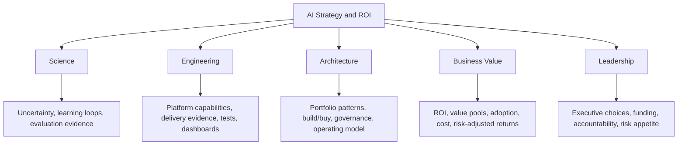

---

## 1. AI Strategy vs AI Theater

AI theater looks impressive but does not create durable value.

### AI Theater

- many demos
- unclear business owners
- no baseline
- no ROI model
- no production path
- no adoption plan
- no evaluation
- no cost visibility
- no governance
- vendor-led roadmap
- model-first thinking

### AI Strategy

- capability-first thinking
- measurable value pools
- named owners
- architecture patterns
- reusable platform capabilities
- risk-tiered governance
- evaluation gates
- production readiness
- FinOps dashboards
- adoption plans
- executive portfolio decisions

### Strategy Filter

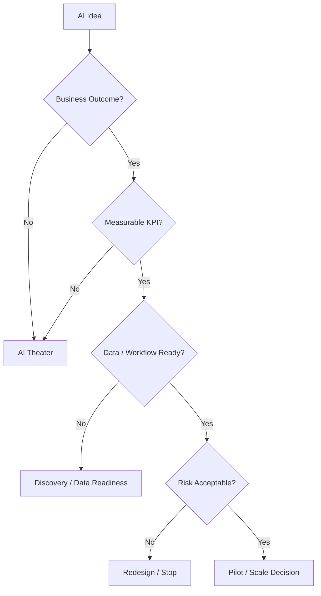

### Principle

> AI strategy starts with the business capability, not the model.

---

## 2. Business Capability Mapping

AI should be mapped to business capabilities.

A capability is something the business must be able to do.

Examples:

- acquire customers
- serve customers
- process claims
- manage inventory
- monitor devices
- resolve incidents
- forecast demand
- personalize offers
- detect fraud
- develop software
- manage compliance
- train employees
- optimize field service

### Capability Map

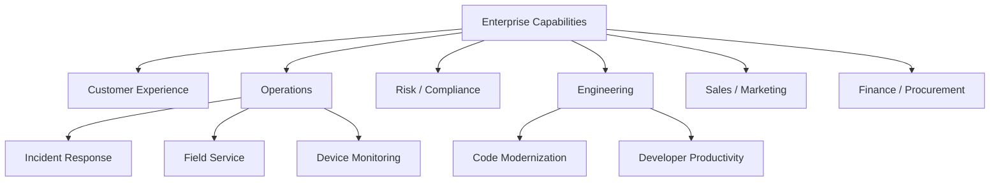

### Capability Assessment

| Question | Why It Matters |
|---|---|
| Is this capability strategic? | AI investment should follow strategy |
| Is it high-volume? | automation value scales |
| Is it knowledge-intensive? | LLM/RAG may help |
| Is it decision-heavy? | reasoning support may help |
| Is it data-ready? | AI needs context |
| Is it risky? | governance controls needed |
| Is it differentiating? | build may be justified |

---

## 3. Value Pools

AI creates value through several value pools.

### Value Pool Map

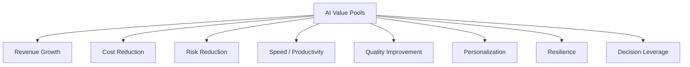

### Examples

| Value Pool | AI Example |
|---|---|
| revenue growth | personalized offers, sales prep |
| cost reduction | support automation, document processing |
| risk reduction | compliance review, fraud detection |
| speed | faster incident triage, faster coding |
| quality | better summaries, fewer defects |
| personalization | customer-specific recommendations |
| resilience | proactive operations, anomaly triage |
| decision leverage | executive briefs, scenario analysis |

### Principle

> AI value must land in a recognizable business value pool.

---

## 4. ROI Model

ROI needs baseline, improvement, adoption, cost, and risk.

### ROI Formula

```text
ROI =
(value created - total cost) / total cost
```

### Better AI ROI Formula

```text
Risk-Adjusted AI ROI =
(adoption-adjusted value + risk reduction value - total AI operating cost - change management cost)
/ (total AI operating cost + platform investment)
```

### ROI Inputs

- baseline metric
- target improvement
- monthly volume
- adoption rate
- labor cost or revenue impact
- model/RAG/tool/guardrail/eval cost
- platform cost
- support cost
- human review cost
- implementation cost
- risk adjustment
- time to value

### Python ROI Calculator

```python
from dataclasses import dataclass


@dataclass
class AIROIModel:
    monthly_volume: int
    baseline_minutes: float
    minutes_saved: float
    cost_per_minute: float
    adoption_rate: float
    monthly_ai_cost: float
    monthly_platform_cost: float
    monthly_support_cost: float
    risk_reduction_value: float = 0.0

    def monthly_value(self) -> float:
        productivity_value = (
            self.monthly_volume
            * self.minutes_saved
            * self.cost_per_minute
            * self.adoption_rate
        )
        return productivity_value + self.risk_reduction_value

    def monthly_total_cost(self) -> float:
        return self.monthly_ai_cost + self.monthly_platform_cost + self.monthly_support_cost

    def roi(self) -> float:
        cost = self.monthly_total_cost()
        if cost <= 0:
            return float("inf")
        return (self.monthly_value() - cost) / cost


if __name__ == "__main__":
    model = AIROIModel(
        monthly_volume=10000,
        baseline_minutes=12,
        minutes_saved=3,
        cost_per_minute=0.75,
        adoption_rate=0.70,
        monthly_ai_cost=7500,
        monthly_platform_cost=3000,
        monthly_support_cost=2000,
    )
    print(round(model.monthly_value(), 2))
    print(round(model.roi(), 2))
```

### Payback Period and Sensitivity Analysis

The basic ROI formula tells you the return ratio. Executives also need to know **when** they break even, and **how sensitive** the ROI is to the assumptions — especially adoption rate, which is the hardest to forecast.

```python
from dataclasses import dataclass


@dataclass
class AIROIModel:
    monthly_volume: int
    baseline_minutes: float
    minutes_saved: float
    cost_per_minute: float
    adoption_rate: float
    monthly_ai_cost: float
    monthly_platform_cost: float
    monthly_support_cost: float
    implementation_cost: float = 0.0    # One-time investment
    risk_reduction_value: float = 0.0

    def monthly_value(self) -> float:
        return (self.monthly_volume * self.minutes_saved *
                self.cost_per_minute * self.adoption_rate) + self.risk_reduction_value

    def monthly_total_cost(self) -> float:
        return self.monthly_ai_cost + self.monthly_platform_cost + self.monthly_support_cost

    def monthly_net(self) -> float:
        return self.monthly_value() - self.monthly_total_cost()

    def roi(self) -> float:
        cost = self.monthly_total_cost()
        return (self.monthly_value() - cost) / cost if cost > 0 else float("inf")

    def payback_months(self) -> float:
        """Months to recover implementation cost from monthly net value."""
        if self.implementation_cost <= 0:
            return 0.0
        net = self.monthly_net()
        if net <= 0:
            return float("inf")
        return self.implementation_cost / net

    def sensitivity(self, adoption_rates: list[float]) -> list[dict]:
        """
        Show how ROI and payback change across adoption scenarios.
        Essential for honest executive conversations about risk.
        """
        results = []
        for rate in adoption_rates:
            scenario = AIROIModel(
                monthly_volume=self.monthly_volume,
                baseline_minutes=self.baseline_minutes,
                minutes_saved=self.minutes_saved,
                cost_per_minute=self.cost_per_minute,
                adoption_rate=rate,
                monthly_ai_cost=self.monthly_ai_cost,
                monthly_platform_cost=self.monthly_platform_cost,
                monthly_support_cost=self.monthly_support_cost,
                implementation_cost=self.implementation_cost,
                risk_reduction_value=self.risk_reduction_value
            )
            payback = scenario.payback_months()
            results.append({
                "adoption_rate": f"{rate:.0%}",
                "monthly_value_usd": round(scenario.monthly_value(), 0),
                "monthly_net_usd": round(scenario.monthly_net(), 0),
                "roi": round(scenario.roi(), 2),
                "payback_months": round(payback, 1) if payback != float("inf") else "never"
            })
        return results


if __name__ == "__main__":
    model = AIROIModel(
        monthly_volume=10000,
        baseline_minutes=12,
        minutes_saved=3,
        cost_per_minute=0.75,
        adoption_rate=0.70,
        monthly_ai_cost=7500,
        monthly_platform_cost=3000,
        monthly_support_cost=2000,
        implementation_cost=45000,
    )
    print(f"Monthly value:   ${model.monthly_value():,.0f}")
    print(f"Monthly cost:    ${model.monthly_total_cost():,.0f}")
    print(f"Monthly net:     ${model.monthly_net():,.0f}")
    print(f"ROI:             {model.roi():.1%}")
    print(f"Payback:         {model.payback_months():.1f} months")

    print("\nSensitivity Analysis (adoption rate scenarios):")
    print(f"{'Adoption':>10}  {'Value/mo':>10}  {'Net/mo':>10}  {'ROI':>8}  {'Payback':>10}")
    for s in model.sensitivity([0.30, 0.50, 0.70, 0.85, 1.00]):
        print(f"{s['adoption_rate']:>10}  ${s['monthly_value_usd']:>9,.0f}  "
              f"${s['monthly_net_usd']:>9,.0f}  {s['roi']:>7.1%}  "
              f"{str(s['payback_months']):>10}")
```

### `tests/test_roi.py`

```python
import pytest
from roi_calculator import AIROIModel


@pytest.fixture
def base_model():
    return AIROIModel(
        monthly_volume=10000,
        baseline_minutes=12,
        minutes_saved=3,
        cost_per_minute=0.75,
        adoption_rate=0.70,
        monthly_ai_cost=7500,
        monthly_platform_cost=3000,
        monthly_support_cost=2000,
        implementation_cost=45000
    )


def test_roi_requires_adoption():
    model = AIROIModel(
        monthly_volume=10000, baseline_minutes=12, minutes_saved=3,
        cost_per_minute=0.75, adoption_rate=0.0,
        monthly_ai_cost=5000, monthly_platform_cost=1000, monthly_support_cost=1000
    )
    assert model.monthly_value() == 0
    assert model.roi() < 0


def test_monthly_value_scales_with_adoption(base_model):
    high_adoption = AIROIModel(**{**base_model.__dict__, "adoption_rate": 1.0})
    assert high_adoption.monthly_value() > base_model.monthly_value()


def test_monthly_value_formula(base_model):
    expected = 10000 * 3 * 0.75 * 0.70  # volume * saved * rate * adoption
    assert abs(base_model.monthly_value() - expected) < 0.01


def test_roi_positive_when_value_exceeds_cost(base_model):
    assert base_model.roi() > 0


def test_roi_negative_when_cost_exceeds_value():
    expensive = AIROIModel(
        monthly_volume=100, baseline_minutes=5, minutes_saved=1,
        cost_per_minute=0.50, adoption_rate=0.50,
        monthly_ai_cost=5000, monthly_platform_cost=2000, monthly_support_cost=1000
    )
    assert expensive.roi() < 0


def test_payback_period_positive(base_model):
    p = base_model.payback_months()
    assert p > 0
    assert p < 24  # Should pay back within 2 years for this model


def test_payback_infinite_when_negative_net():
    model = AIROIModel(
        monthly_volume=100, baseline_minutes=5, minutes_saved=1,
        cost_per_minute=0.50, adoption_rate=0.10,
        monthly_ai_cost=10000, monthly_platform_cost=2000, monthly_support_cost=1000,
        implementation_cost=50000
    )
    assert model.payback_months() == float("inf")


def test_payback_zero_when_no_implementation_cost(base_model):
    model = AIROIModel(**{**base_model.__dict__, "implementation_cost": 0.0})
    assert model.payback_months() == 0.0


def test_sensitivity_returns_all_scenarios(base_model):
    scenarios = base_model.sensitivity([0.30, 0.50, 0.70, 1.00])
    assert len(scenarios) == 4
    assert scenarios[0]["adoption_rate"] == "30%"
    assert scenarios[-1]["adoption_rate"] == "100%"


def test_sensitivity_roi_increases_with_adoption(base_model):
    scenarios = base_model.sensitivity([0.30, 0.50, 0.70, 1.00])
    rois = [s["roi"] for s in scenarios]
    assert rois == sorted(rois), "ROI should increase with adoption rate"


def test_risk_reduction_adds_to_value():
    model_without = AIROIModel(
        monthly_volume=1000, baseline_minutes=10, minutes_saved=2,
        cost_per_minute=1.0, adoption_rate=0.8,
        monthly_ai_cost=500, monthly_platform_cost=200, monthly_support_cost=100
    )
    model_with = AIROIModel(**{**model_without.__dict__, "risk_reduction_value": 1000.0})
    assert model_with.monthly_value() > model_without.monthly_value()
    assert model_with.roi() > model_without.roi()
```

### Principle

> ROI without adoption is a spreadsheet fantasy.

---

## 5. AI Use Case Scorecard

Use case prioritization should be objective.

### Scorecard

| Dimension | Score 1 | Score 5 |
|---|---|---|
| business value | unclear | high measurable value |
| strategic fit | peripheral | core capability |
| data readiness | poor | strong, governed data |
| feasibility | speculative | proven pattern |
| platform reuse | one-off | reusable capability |
| risk | high unmanaged | acceptable/managed |
| time to value | long | fast |
| adoption readiness | weak | clear user demand |
| cost profile | expensive/unclear | sustainable |
| differentiation | commodity | strategic advantage |

### YAML Scorecard

```yaml
use_case_scorecard:
  name: incident_summary_agent
  value: 5
  strategic_fit: 5
  data_readiness: 4
  feasibility: 4
  platform_reuse: 5
  risk: 3
  time_to_value: 4
  adoption_readiness: 4
  cost_profile: 3
  differentiation: 4
```

### Python Portfolio Scorer

```python
WEIGHTS = {
    "value": 3,
    "strategic_fit": 2,
    "data_readiness": 2,
    "feasibility": 2,
    "platform_reuse": 1,
    "time_to_value": 1,
    "adoption_readiness": 2,
    "cost_profile": 1,
    "differentiation": 2,
    "risk": -2,
}


def score_use_case(scores: dict[str, int]) -> int:
    return sum(scores.get(k, 0) * weight for k, weight in WEIGHTS.items())
```

### `score_portfolio.py` — YAML Portfolio Runner

```python
from __future__ import annotations

import sys
from pathlib import Path

import yaml

WEIGHTS = {
    "value": 3, "strategic_fit": 2, "data_readiness": 2, "feasibility": 2,
    "platform_reuse": 1, "time_to_value": 1, "adoption_readiness": 2,
    "cost_profile": 1, "differentiation": 2, "risk": -2,
}


def score_use_case(scores: dict[str, int]) -> int:
    return sum(scores.get(k, 0) * weight for k, weight in WEIGHTS.items())


def recommendation(score: int, adoption: int, data_readiness: int) -> str:
    """
    Combine numeric score with key gate criteria for actionable recommendation.
    High score but low adoption readiness → hold until change management plan exists.
    High score but poor data → hold until data readiness improves.
    """
    if score >= 25 and adoption >= 3 and data_readiness >= 3:
        return "SCALE"
    if score >= 15 and adoption >= 2 and data_readiness >= 2:
        return "PILOT"
    if score >= 8:
        return "HOLD"
    return "STOP"


def score_portfolio(portfolio_path: str) -> list[dict]:
    data = yaml.safe_load(Path(portfolio_path).read_text(encoding="utf-8"))
    results = []
    for uc in data.get("use_cases", []):
        scores = uc.get("scores", {})
        total = score_use_case(scores)
        rec = recommendation(
            total,
            adoption=scores.get("adoption_readiness", 0),
            data_readiness=scores.get("data_readiness", 0)
        )
        results.append({
            "name": uc.get("name"),
            "owner": uc.get("owner", "unassigned"),
            "stage": uc.get("stage", "idea"),
            "score": total,
            "recommendation": rec,
            "monthly_cost_usd": uc.get("monthly_cost_usd", 0),
            "estimated_monthly_value_usd": uc.get("estimated_monthly_value_usd", 0),
        })
    return sorted(results, key=lambda r: r["score"], reverse=True)


if __name__ == "__main__":
    path = sys.argv[1] if len(sys.argv) > 1 else "portfolio.yaml"
    portfolio = score_portfolio(path)

    print(f"\n{'#':<4} {'Score':>6} {'Rec':<10} {'Stage':<12} {'Cost/mo':>9} {'Value/mo':>10}  Name")
    print("-" * 90)
    for i, r in enumerate(portfolio, 1):
        print(f"{i:<4} {r['score']:>6} {r['recommendation']:<10} {r['stage']:<12} "
              f"${r['monthly_cost_usd']:>8,.0f} ${r['estimated_monthly_value_usd']:>9,.0f}  {r['name']}")
```

### Principle

> A low-risk, high-value, data-ready use case beats a glamorous, vague AI vision.

---

## 6. Executive Portfolio View

AI portfolios need stage gates.

### Portfolio Stages

- idea
- discovery
- prototype
- evaluation
- pilot
- production
- scale
- optimize
- retire

### Portfolio Dashboard

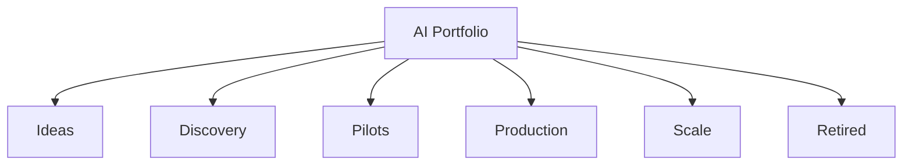

### Portfolio Record

```yaml
portfolio_item:
  name: field_service_multimodal_assistant
  stage: pilot
  owner: field_service
  sponsor: coo
  risk_tier: 4
  monthly_cost_usd: 18000
  estimated_monthly_value_usd: 65000
  quality_score: 0.87
  safety_score: 0.99
  adoption_rate: 0.42
  decision: continue_pilot
```

### Scale / Stop Criteria

Scale when:

- KPI improvement is measurable
- adoption is real
- quality is above threshold
- safety risk is controlled
- cost per workflow is acceptable
- support model exists
- platform reuse is possible

Stop when:

- no owner
- no measurable KPI
- low adoption
- cost exceeds value
- risk is unacceptable
- workflow does not need AI
- deterministic automation is better

---

## 7. AI Investment Thesis

An AI investment thesis explains where the company will place bets.

### Investment Thesis Template

```text
We will invest in AI where:
1. The workflow is high-volume, high-friction, or high-risk.
2. Proprietary data or process knowledge creates advantage.
3. AI improves measurable speed, quality, cost, revenue, or risk.
4. Human accountability remains clear.
5. Platform capabilities can be reused.
6. Cost per successful workflow is sustainable.
```

### Example: Device Operations

```text
We will use AI to improve device operations by reducing incident triage time,
increasing runbook adherence, improving customer-impact summaries, and enabling
proactive detection. We will not allow autonomous production changes without
human approval.
```

### Principle

> A strong AI investment thesis defines what you will not do.

---

## 8. Build, Buy, Partner, Compose, or FDE

### Decision Matrix

| Option | Best When | Risk |
|---|---|---|
| buy | commodity workflow | vendor lock-in |
| build | differentiating capability | cost/complexity |
| partner | specialized expertise needed | dependency |
| compose | platform patterns can be combined | integration ownership |
| FDE | messy field workflow | scaling/productization |
| managed cloud | speed/governance | provider limits |
| self-host | data/control/scale needs | operations burden |

### Decision Flow

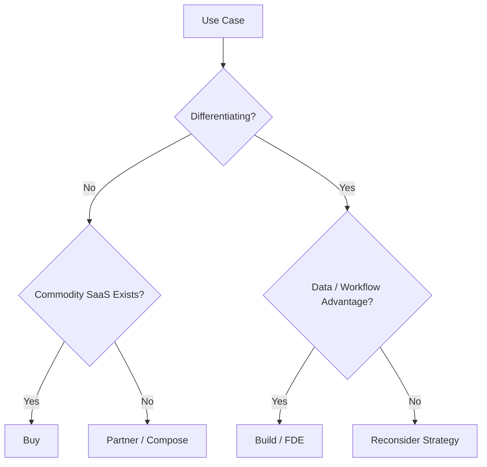

### Principle

> Build control planes and differentiating workflows. Buy commodity features.

---

## 9. Vendor Strategy and Lock-In

Vendor lock-in is not only contract lock-in. It can be:

- workflow lock-in
- data model lock-in
- prompt lock-in
- tool integration lock-in
- evaluation lock-in
- observability lock-in
- pricing lock-in
- deployment lock-in
- governance lock-in

### Mitigations

- AI gateway
- model router
- prompt registry
- evaluation portability
- tool gateway/MCP
- open telemetry schema
- data export
- abstraction where useful
- strategic vendor diversification
- exit plan for critical workflows

### Vendor Decision Questions

- What is the switching cost?
- Who owns the data?
- Can prompts/evals/tools be exported?
- Can logs and traces be retained?
- Can we route to another model?
- Is the vendor roadmap aligned?
- What happens if price changes?
- What happens if model behavior changes?

---

## 10. Platform Investment Strategy

Enterprise AI requires platform investment before every use case shows full ROI.

### Platform Capabilities

- AI gateway
- model router
- prompt registry
- RAG platform
- tool gateway
- agent runtime
- guardrails
- evaluation service
- observability
- FinOps
- governance workflow
- developer SDKs
- templates

### Platform ROI

```text
Platform ROI =
(sum of accelerated use case value + risk reduction + duplicate work avoided)
- platform operating cost
```

### Platform Investment Principle

> If every AI product team rebuilds the same controls, the enterprise is paying an AI tax.

---

## 11. AWS Capability Surface as Strategic Options

AWS-centric enterprises can use managed capabilities where they accelerate delivery and governance.

### AWS Strategic Mapping

| Strategic Need | AWS Capability Surface |
|---|---|
| managed model access | Amazon Bedrock Runtime |
| conversational inference | Converse / ConverseStream |
| model-specific invocation | InvokeModel / InvokeModelWithResponseStream |
| managed RAG | Bedrock Knowledge Bases |
| managed task automation | Bedrock Agents |
| policy/safety controls | Bedrock Guardrails |
| evaluation | Bedrock Evaluations |
| monitoring/audit | CloudWatch, CloudTrail, model invocation logging |
| secure integration | IAM, KMS, VPC endpoints, Lambda, API Gateway |
| custom/private models | EKS/SageMaker with NVIDIA stack |
| cost governance | Cost Explorer, CUR, Budgets, tags |

### Strategic Rule

Use managed capability when it reduces undifferentiated work and improves governance. Build custom capability when enterprise requirements demand control.

---

## 12. Executive Decision Gate

Each AI investment should pass an executive decision gate.

### Decision Gate

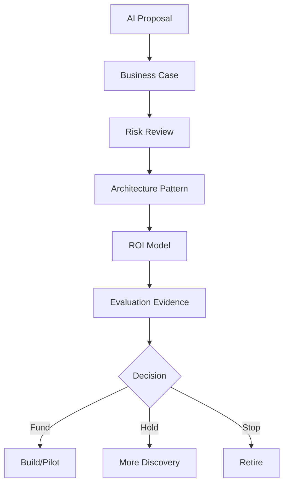

### Decision Memo YAML

```yaml
decision_memo:
  use_case: incident_summary_agent
  sponsor: coo
  decision_requested: scale_pilot_to_production
  business_value:
    primary_kpi: mean_time_to_triage
    baseline: "45 minutes"
    target: "25 minutes"
  risk:
    tier: 4
    controls:
      - human_approval
      - secure_rag
      - tool_gateway
  economics:
    monthly_cost_usd: 12000
    monthly_value_usd: 45000
    roi: 2.75
  evidence:
    quality_score: 0.88
    safety_score: 0.99
    adoption_rate: 0.62
  recommendation: scale
```

---

## 13. Component Readiness as Strategy

Executives do not need to read unit tests, but they need to know whether critical components are production-ready.

### Component Readiness

| Component | Executive Question |
|---|---|
| gateway | Are all production AI calls controlled? |
| model router | Can we switch models safely? |
| RAG | Are sources current and permissioned? |
| tools | Can AI affect real systems safely? |
| agents | Are actions bounded and traceable? |
| guardrails | Are safety controls tested? |
| evaluation | Is quality evidence repeatable? |
| observability | Can we debug incidents? |
| FinOps | Can we control spend? |
| support | Who responds when it fails? |

### Component Readiness Gate

```yaml
component_readiness:
  gateway: pass
  model_router: pass
  prompt_registry: pass
  rag_platform: conditional
  tool_gateway: pass
  guardrails: pass
  evaluation: pass
  observability: pass
  finops: pass
  support_model: pass
  blockers:
    - "RAG source owner missing for firmware notes"
```

### Principle

> Component readiness is strategic risk reduction.

---

## 14. Streaming as Strategy

Streaming is not just a technical UX feature.

It affects:

- perceived speed
- trust
- cost
- safety
- abandonment
- support
- validation
- accessibility

### Streaming Decision Criteria

| Question | Strategic Meaning |
|---|---|
| Does user need interactive response? | UX value |
| Is output high risk? | safety gating |
| Can partial output be shown? | trust and compliance |
| Can cancellation propagate? | cost control |
| Is TTFT measured? | performance |
| Is final validation required? | governance |

### Principle

> Stream low-risk drafts. Validate high-risk answers before display.

---

## 15. Multimodal Strategy

Multimodal AI expands value pools but increases cost and risk.

### Strategic Use Cases

- field service image inspection
- insurance claim photos
- medical administrative documents
- call center audio summaries
- video quality inspection
- product shelf/planogram analysis
- device screen troubleshooting
- contract document review

### Multimodal Decision Questions

- Does image/audio/video materially improve decision quality?
- Is text extraction enough?
- What is the cost per inspection?
- What is the human review threshold?
- What are the privacy and PII risks?
- What is the failure mode?
- Is there a safer deterministic pre-processing step?

### Multimodal Strategy Config

```yaml
multimodal_strategy:
  use_case: device_screen_troubleshooting
  modalities:
    - image
    - text
  max_file_size_mb: 10
  pii_scan_required: true
  human_review_below_confidence: 0.85
  cost_per_inspection_target_usd: 0.25
```

### Principle

> Use multimodal AI when the modality changes the business decision, not because the model supports it.

---

## 16. Multi-Tenant Strategy

Enterprises often serve multiple business units, customers, or regions.

### Strategic Controls

- tenant budgets
- tenant data boundaries
- tenant model access
- tenant evaluation dashboards
- tenant-specific prompts
- tenant-specific RAG sources
- tenant support ownership
- chargeback/showback
- SLA/SLO differentiation

### Multi-Tenant Strategy Config

```yaml
tenant_strategy:
  allocation_model: showback_then_chargeback
  shared_platform: true
  dedicated_private_model_allowed: true
  tenant_dashboards_required: true
  cross_tenant_data_access: prohibited
  budget_policy: monthly_with_approval_for_overage
```

### Principle

> Multi-tenancy is how AI platforms scale economically without losing accountability.

---

## 17. Evaluation Evidence for Executive Decisions

Executives should require evaluation evidence before scaling.

### Evidence Types

- quality score
- safety score
- RAG groundedness
- tool accuracy
- guardrail results
- red-team results
- latency
- cost per workflow
- user acceptance
- business KPI movement
- incident history

### Evidence Dashboard

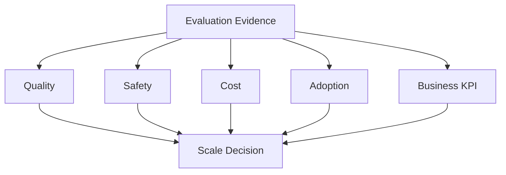

### Principle

> No evaluation evidence, no scale decision.

---

## 18. Executive AI Dashboard

### Dashboard Sections

1. Portfolio
2. ROI
3. Adoption
4. Quality
5. Safety
6. Cost
7. Delivery
8. Incidents
9. Platform reuse
10. Strategic risks

### Dashboard Example

```yaml
executive_dashboard:
  total_use_cases: 42
  production_use_cases: 9
  monthly_ai_cost_usd: 185000
  estimated_monthly_value_usd: 620000
  portfolio_roi: 2.35
  average_quality_score: 0.88
  safety_incidents_p1: 0
  platform_reuse_rate: 0.74
  top_decisions:
    - scale incident_summary_agent
    - retire low_adoption_contract_bot
    - increase investment in RAG platform
```

### Principle

> Executives need decision dashboards, not telemetry dumps.

---

## 19. Board-Level AI Narrative

Boards need a clear narrative.

### Board Narrative Structure

- where AI creates advantage
- how investment maps to strategy
- what value has been realized
- what risks are controlled
- what capabilities are reusable
- what operating model exists
- what competitors are doing
- what decisions are needed
- what will be stopped

### Example Narrative

```text
We are focusing AI investment on operations, support, and engineering productivity because these capabilities have measurable friction, proprietary knowledge, and clear ROI. We are not funding disconnected chatbots. We are building a governed AI platform that supports reusable RAG, tool access, evaluation, observability, and FinOps. Our scale decisions require evidence across quality, safety, cost, adoption, and business KPI movement.
```

---

## 20. AI Roadmap

A strategy needs a roadmap.

### Roadmap Horizons

| Horizon | Focus |
|---|---|
| 0-90 days | prove value in 2-3 high-value workflows |
| 3-6 months | build reusable platform controls |
| 6-12 months | scale portfolio with governance |
| 12-24 months | embed AI into core operating model |
| 24+ months | differentiate with proprietary AI capabilities |

### Roadmap Diagram

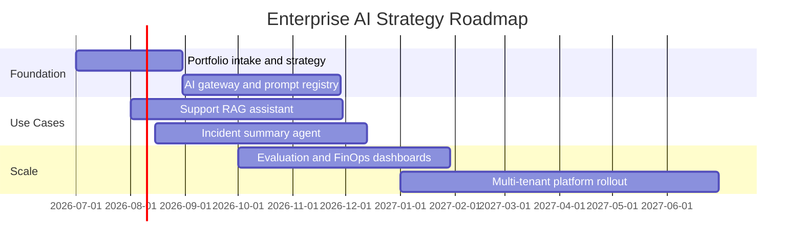

---

## 21. Risk Appetite

Executives must define risk appetite.

### Risk Appetite Statements

```yaml
risk_appetite:
  customer_facing_answers:
    require_guardrails: true
    require_human_review_for_high_risk: true
  production_operations_actions:
    autonomous_execution_allowed: false
    approval_required: true
  internal_drafts:
    human_review_required: false
    user_accountable: true
  restricted_data:
    external_model_allowed: false
```

### Principle

> Risk appetite should be explicit before teams build agents.

---

## 22. Capstone Strategy: Enterprise Agentic Operations Platform

The capstone platform should be justified strategically.

### Strategic Thesis

```text
Use AI to improve device operations by reducing incident triage time, improving runbook adherence, generating customer-impact summaries, identifying revenue risk faster, and supporting executive communication, while keeping production actions under human approval.
```

### Capstone ROI Model

| Value Driver | Metric |
|---|---|
| faster triage | mean time to triage |
| faster resolution | mean time to resolution |
| fewer escalations | escalation rate |
| better communication | executive/customer brief acceptance |
| reduced downtime | avoided device outage time |
| cost control | cost per incident investigation |
| safety | zero unauthorized production actions |

### Capstone Decision Architecture

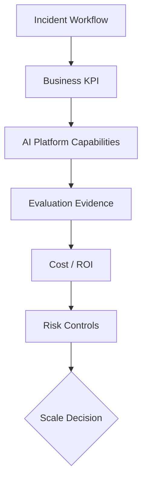

---

## 23. Production Readiness Checklist for Executive Scale Decision

Before scaling an AI initiative:

- [ ] business capability identified
- [ ] named sponsor
- [ ] product owner
- [ ] baseline KPI
- [ ] target KPI
- [ ] adoption evidence
- [ ] ROI model
- [ ] total cost model
- [ ] risk tier
- [ ] data readiness
- [ ] platform pattern selected
- [ ] evaluation evidence
- [ ] safety evidence
- [ ] observability dashboard
- [ ] FinOps dashboard
- [ ] support model
- [ ] incident runbook
- [ ] human approval path
- [ ] multi-tenant policy if needed
- [ ] streaming/multimodal readiness if needed
- [ ] decision: scale, hold, fix, or stop

---

## 24. Architecture Review Scenario

### Scenario

A CEO asks the CTO to "put AI into every product by the end of the year."

### Review Finding

The instruction creates activity but not strategy.

### Problems

- no value prioritization
- no business capability map
- no risk appetite
- no ROI model
- no platform investment plan
- no operating model
- no evaluation gate
- no stop criteria

### Improved Executive Response

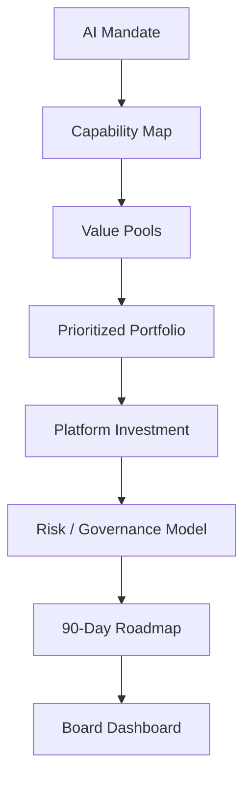

### Recommendation

Translate the mandate into a portfolio strategy with measurable outcomes, reusable platform investments, risk controls, and scale/stop decisions.

---

## 25. Production Lessons from the Field

### Production Context

The following lessons reflect strategic and investment decisions made over six years of building, operating, and scaling AI systems (SupportIQ, TriageIQ, CertifyIQ, DeviceIQ, Managed Services Automations) inside a global enterprise platform. Each lesson corresponds to a strategic choice — where to invest, where to build, what to stop — and the consequences that followed.

### Lesson 1: AI Theater Looks Productive Until Finance Asks for ROI

An early executive memo committed the company to "using AI in 10 workflows by end of year." The team delivered: 10 workflows were prototyped. Eight were demos that never went to production. One was a low-value internal note-taking tool that two people used. One became SupportIQ.

When the CTO reviewed the portfolio at year-end, the ROI conversation revealed that the 10-workflow count had created activity pressure without value discipline. Teams had prioritized velocity over outcome.

What worked after the strategy revision:

- portfolio intake required a baseline KPI, a measurement plan, and a named business owner before any resources were committed
- "hours saved" metrics required actual time-tracking data, not estimates
- cost per successful workflow tracked from pilot day 1
- every quarterly portfolio review included a scale/hold/stop decision for each active use case

What failed before:

- count-based AI metrics (demos, prototypes, workflows started) rewarded activity, not value
- no adoption data — ROI calculations assumed full adoption from day one
- no one owned the ROI measurement process

### Lesson 2: Platform Underinvestment Creates Hidden Tax

For the first 18 months, no dedicated AI platform team existed. Each product team built their own model client, their own context assembly logic, their own evaluation approach. The result: four different prompt management approaches, three different cost attribution schemas, two different security postures, and no shared evaluation baseline.

When a prompt injection incident occurred in one of the workflows, the security review had to assess all four platform implementations separately because they were architecturally different.

Platform investment was approved after the security review estimated the hidden audit and remediation cost exceeded three years of platform team budget.

What worked after the platform was funded:

- shared gateway eliminated four separate model client implementations
- shared prompt registry brought all prompt versions under governance in one repository
- shared evaluation service allowed one golden dataset investment to serve all five workflows
- platform reuse rate became a portfolio metric: currently 87% of new workflows use existing platform patterns rather than building custom

What failed before:

- no platform budget line item — each team funded their own AI tooling
- no visibility into platform duplication until an audit uncovered it
- "build AI platform" treated as nice-to-have rather than enabling infrastructure

### Lesson 3: Vendor Roadmaps Are Not Enterprise Strategy

One of the early workflow automations was deeply integrated with a specific vendor's AI assistant product. The workflow used the vendor's proprietary prompt format, the vendor's proprietary knowledge connector, and the vendor's proprietary output parser. When the vendor changed their pricing model and discontinued the knowledge connector, the workflow required a six-month rebuild.

The AI gateway pattern specifically originated from this experience. Every new workflow integration goes through the gateway, which abstracts the model provider and makes provider switching a configuration change rather than a rebuild.

What worked after the pattern was established:

- AI gateway with model router: switching Claude versions or provider required a config change, not a code change
- evaluation portability: golden dataset and test suite independent of any provider
- MCP layer for tool integration: tool schemas defined once and called by any agent
- vendor scorecard reviewed quarterly: pricing change scenario, model behavioral change scenario, exit criteria

What failed before:

- vendor-specific SDK used directly in workflow code
- no abstraction between workflow logic and model API
- no exit criteria defined at partnership inception

### Lesson 4: Adoption Is the Missing ROI Variable

TriageIQ's L4 triage automation was quantifiably excellent. On the golden dataset it achieved 91% recommendation quality. In production, L4 triage engineers were using it for approximately 40% of cases in the first month — choosing the manual process for the other 60%.

The ROI model had assumed 75% adoption. At 40% adoption, the ROI was negative.

Investigation revealed: engineers did not distrust the recommendations. They distrusted the process. The approval workflow surfaced the AI recommendation in a different UI than their normal work queue. Switching between interfaces was enough friction to make the manual process feel easier for many cases.

The fix was a workflow redesign: TriageIQ recommendations appeared inside the existing ticketing system as a pre-populated draft that the engineer could accept or modify. Adoption reached 78% in the following month without any change to the model or the recommendation quality.

What worked after the workflow redesign:

- AI embedded in the existing workflow rather than a parallel interface
- accept/modify/reject captured as feedback signals rather than discarded
- adoption rate tracked weekly and incorporated in the ROI dashboard

What failed before:

- ROI model assumed adoption without measuring it
- AI surfaced in a separate tool that required workflow context switching
- no feedback mechanism — acceptance or rejection was invisible

### Lesson 5: The Best AI Use Cases Often Start Boring

The most strategically impactful use cases in production are: SupportIQ (policy-grounded support drafts), TriageIQ (incident classification and fix proposal), CertifyIQ (automated release certification), and DeviceIQ (device telemetry summarization for operations). None of them involved autonomous agents operating independently. All of them involved AI reducing human labor in a specific, repeatable, high-volume workflow with human review on consequential outputs.

The use cases that were proposed and not funded or not scaled: autonomous customer negotiation, AI-generated device firmware configurations, fully autonomous incident remediation, and competitive market analysis. Each was technically interesting. None had a clear accountability model for when the AI was wrong.

The pattern is consistent: the best early AI use cases are high-volume, knowledge-intensive, low-autonomy, with clear human accountability and measurable output quality.

### Lesson 6: Multimodal Strategy Needs Field Reality

DeviceIQ's image analysis feature for field-returned device inspection looked excellent in the demo. Lab-quality device photos with clean backgrounds, consistent lighting, and visible serial numbers. Model confidence was above 0.9 on all demo images.

In production, technicians uploaded photos taken with varying lighting, angles, and image quality. Confidence dropped to 0.61 average. The human review queue — intended for "exceptional cases" — was triggered for 47% of submissions.

The feature worked. The cost per inspection was 3.4× the target because of human review volume.

What worked after the field reality review:

- photo guidance shown to technicians in the app: angle, lighting, minimum resolution
- preprocessing pipeline applied contrast normalization before the vision model
- confidence threshold tuned to 0.75 based on field data (not lab data)
- human review routed to a dedicated queue with a 30-minute SLA rather than general support

What failed before:

- evaluation dataset contained only lab-quality images
- no field pilot before cost model was set
- confidence threshold set from demo performance, not field performance


- no baseline

### Lesson 2: Platform Underinvestment Creates Hidden Tax

What worked:

- shared gateway
- shared evaluation
- prompt registry
- reusable RAG and tool gateway

What failed:

- every team building custom wrappers
- no platform budget
- no reuse metric

### Lesson 3: Vendor Roadmaps Are Not Enterprise Strategy

What worked:

- vendor strategy
- model router
- exit criteria
- abstraction where useful

What failed:

- workflow locked to one vendor
- no pricing-change scenario
- no trace/export plan

### Lesson 4: Adoption Is the Missing ROI Variable

What worked:

- training
- champions
- workflow redesign
- manager alignment
- feedback loops

What failed:

- tool launched but not embedded
- users kept old process
- ROI assumed 100% adoption

### Lesson 5: The Best AI Use Cases Often Start Boring

What worked:

- support drafts
- incident summaries
- field service notes
- compliance review
- internal search

What failed:

- overambitious autonomous agents before data and controls were ready

### Lesson 6: Multimodal Strategy Needs Field Reality

What worked:

- real technician photos and audio notes in testing
- confidence thresholds
- human review for uncertain visual claims
- cost per inspection targets

What failed:

- clean demo images only
- no image PII policy
- no field adoption plan

---

## 26. Pratik's Principles

### Principle 1: AI Strategy Starts with Business Capability

Do not start with models. Start with what the business must do better.

### Principle 2: ROI Requires Adoption

No adoption, no value.

### Principle 3: Platform Reuse Is Strategic Leverage

A reusable platform turns every use case into a faster next use case.

### Principle 4: Cost per Successful Workflow Beats Cost per Token

Executives should manage workflow economics, not token trivia.

### Principle 5: Stop Weak Use Cases

Killing low-value AI projects is strategy.

### Principle 6: Human Accountability Is a Strategy Choice

Some workflows should remain decision support, not automation.

### Principle 7: Vendor Optionality Is Power

A model router and evaluation layer preserve strategic freedom.

### Principle 8: AI Strategy Is a Portfolio, Not a Press Release

The portfolio must show value, cost, risk, adoption, and decisions.

---

## 27. Hands-On Labs with Scaffolding

### Lab 1: AI Capability Map

```text
labs/chapter-23-ai-strategy-roi/lab1-capability-map/
  capability-map.md
  value-pools.yaml
  README.md
```

Tasks:

1. List ten enterprise capabilities.
2. Identify AI value pools.
3. Select three high-value opportunities.
4. Define success metrics.

---

### Lab 2: ROI Calculator

```text
labs/chapter-23-ai-strategy-roi/lab2-roi-calculator/
  roi_calculator.py
  roi-inputs.yaml
  tests/test_roi.py
```

Tasks:

1. Model baseline value.
2. Add adoption rate.
3. Add AI operating cost.
4. Calculate ROI and payback.

---

### Lab 3: Portfolio Scorecard

```text
labs/chapter-23-ai-strategy-roi/lab3-portfolio-scorecard/
  portfolio.yaml
  score_portfolio.py
  ranked-portfolio.md
```

Tasks:

1. Score five use cases.
2. Rank by value, feasibility, risk, and cost.
3. Recommend scale/hold/stop.

---

### Lab 4: Executive Decision Memo

```text
labs/chapter-23-ai-strategy-roi/lab4-decision-memo/
  decision-memo.yaml
  decision-memo.md
```

Tasks:

1. Create a scale decision memo.
2. Include KPI, ROI, risk, evaluation, cost, and recommendation.
3. Define required executive decision.

---

### Lab 5: Vendor Strategy

```text
labs/chapter-23-ai-strategy-roi/lab5-vendor-strategy/
  vendor-scorecard.md
  build-buy-partner.md
  exit-plan.md
```

Tasks:

1. Compare Bedrock, Claude, NVIDIA/self-hosted, and SaaS options.
2. Identify lock-in risks.
3. Define exit strategy.

---

### Lab 6: Capstone Strategy

```text
labs/chapter-23-ai-strategy-roi/lab6-capstone-strategy/
  capstone-strategy.md
  capstone-roi.xlsx
  executive-dashboard.md
  board-narrative.md
```

Tasks:

1. Write capstone strategic thesis.
2. Build ROI model.
3. Define executive dashboard.
4. Write board-level narrative.

---

## 28. Interview Questions

### Engineering-Level Questions

1. Why does AI strategy need ROI?
2. What is cost per successful workflow?
3. How does adoption affect ROI?
4. Why is model routing strategic?
5. Why do executives need evaluation evidence?
6. How does platform reuse improve ROI?
7. Why should some AI use cases be stopped?
8. What is vendor lock-in in AI?
9. How does multimodal AI affect strategy?
10. How should streaming be evaluated strategically?

### Architect-Level Questions

1. Design an enterprise AI strategy framework.
2. How would you prioritize AI use cases?
3. How would you build an AI portfolio dashboard?
4. How would you connect platform architecture to ROI?
5. How would you compare Bedrock, Claude, and self-hosted models strategically?
6. How would you design a build/buy/partner decision model?
7. How would you define risk appetite for agents?
8. How would you measure AI adoption?
9. How would you build a board-level AI roadmap?
10. How would you prevent AI theater?

### Director / VP / CTO-Level Questions

1. What is our AI strategy?
2. Where will AI create competitive advantage?
3. Which AI investments should we stop?
4. How do we prove AI ROI?
5. What platform capabilities should we fund?
6. What is our vendor strategy?
7. What is our risk appetite for AI automation?
8. How do we avoid lock-in?
9. What does the board need to know?
10. What would make you reject an AI investment?

---

## 29. Certification Mapping

### AWS AI / Generative AI Professional Preparation

This chapter supports:

- AI business value framing
- Bedrock capability selection
- cost optimization
- operational excellence
- model selection
- Knowledge Bases, Agents, Guardrails, and Evaluations as strategic options
- AWS-native governance and monitoring
- managed vs self-hosted tradeoffs

### Anthropic Claude / MCP Architecture Preparation

This chapter supports:

- Claude as strategic model option
- MCP as vendor-neutral integration layer
- model routing
- tool governance
- context portability
- evaluation evidence
- vendor strategy

### NVIDIA Generative AI Preparation

This chapter supports:

- self-hosting decision model
- GPU investment thesis
- utilization and cost strategy
- multimodal and private inference strategy
- build vs buy tradeoffs

---

## 30. Chapter Exercises

### Exercise 1

Create an AI strategy for a retailer with high cart abandonment, large product catalog, and fragmented customer support.

### Exercise 2

Build an ROI model for an incident response assistant that reduces mean time to triage.

### Exercise 3

Create a portfolio dashboard with 10 AI use cases and decide scale, hold, fix, or stop.

### Exercise 4

Write a board-level narrative explaining why the company should invest in an enterprise AI platform instead of isolated pilots.

### Exercise 5

Create a vendor strategy that includes Bedrock, Claude, NVIDIA/self-hosted models, MCP, and SaaS tools.

---

## 31. Key Terms

| Term | Meaning |
|---|---|
| AI strategy | Disciplined choice of where AI creates measurable advantage |
| AI theater | AI activity without measurable value or scale path |
| Value pool | Category of business value AI can create |
| Risk-adjusted ROI | ROI adjusted for adoption, risk, and operating cost |
| Cost per successful workflow | Total cost divided by useful completed workflows |
| Capability map | Business capability view used to target AI |
| AI portfolio | Set of AI investments managed by stage, value, risk, and cost |
| Build/buy/partner | Strategic sourcing decision |
| FDE | Field delivery model for complex workflows |
| Vendor lock-in | Dependency on vendor workflow, data, model, or platform |
| Board narrative | Executive explanation of AI strategy, value, and risk |
| Risk appetite | Executive-defined tolerance for AI automation risk |
| Platform reuse | Use of shared AI capabilities across products |
| Scale decision | Executive decision to move from pilot to production/scale |
| Stop criteria | Conditions for retiring weak use cases |

---

## 32. One-Page Executive Brief

AI strategy is not "use AI everywhere."

AI strategy is the disciplined choice of where intelligence, automation, and human accountability create measurable business advantage.

A strong enterprise AI strategy includes:

- business capability map
- value pools
- prioritized use case portfolio
- ROI model
- risk appetite
- build/buy/partner decisions
- platform investment thesis
- vendor strategy
- evaluation evidence
- FinOps model
- operating model
- board-level roadmap

Executives should ask:

- Which business capabilities will AI improve?
- What value will be created?
- What is the baseline?
- What is the ROI?
- What is the adoption plan?
- What risks are acceptable?
- What should we build vs buy?
- What platform capabilities should we fund?
- Which pilots should scale?
- Which pilots should stop?

The executive takeaway:

> AI strategy turns AI from scattered experiments into a portfolio of measured business bets.

---

## 33. References

- AWS Generative AI Lens — Cost Optimization: https://docs.aws.amazon.com/wellarchitected/latest/generative-ai-lens/cost-optimization.html
- AWS Generative AI Lens — Operational Excellence: https://docs.aws.amazon.com/wellarchitected/latest/generative-ai-lens/operational-excellence.html
- Amazon Bedrock monitoring: https://docs.aws.amazon.com/bedrock/latest/userguide/monitoring.html

---

## 34. Chapter Summary

In this chapter, we explored AI Strategy, ROI, and Executive Decision-Making as the leadership discipline that turns AI capability into business advantage.

We covered AI strategy vs AI theater, business capability mapping, value pools, ROI modeling, use case scorecards, executive portfolio views, investment thesis, build/buy/partner/FDE decisions, vendor strategy, platform investment, AWS capability surface as strategic options, executive decision gates, component readiness, streaming strategy, multimodal strategy, multi-tenant strategy, evaluation evidence, executive dashboards, board-level narrative, AI roadmap, risk appetite, capstone strategy, production readiness for executive scale decisions, architecture review, production lessons, Pratik's Principles, hands-on labs, interview questions, certification mapping, exercises, key terms, and executive guidance.

We also addressed recurring gaps by adding Python scaffolding, concrete configuration, AWS capability mapping, streaming/multimodal/multi-tenant strategic considerations, component readiness, lab scaffolding, production-specific lessons, and evaluation evidence.

The key lesson is:

> AI strategy is the discipline of funding, scaling, and operating only the AI work that creates measurable value under acceptable risk and cost.

In Chapter 24, we will develop the capstone Enterprise Agentic Operations Platform end-to-end.

---

## 35. Suggested Git Commit

```bash
mkdir -p chapters
cp 23-ai-strategy-roi-and-executive-decision-making-reworked.md chapters/23-ai-strategy-roi-and-executive-decision-making.md
cp BOOK_STATE-updated-through-chapter-23.md BOOK_STATE.md

git add chapters/23-ai-strategy-roi-and-executive-decision-making.md BOOK_STATE.md
git commit -m "Add Chapter 23: AI Strategy, ROI, and Executive Decision-Making"
git push origin main
```
