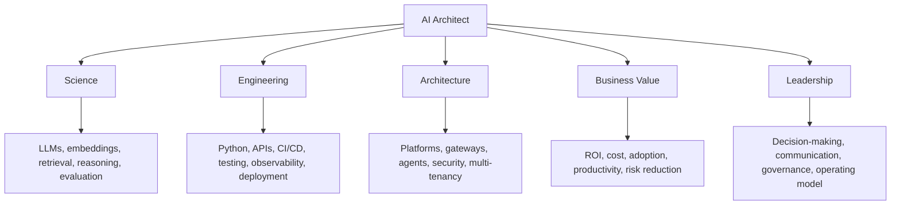
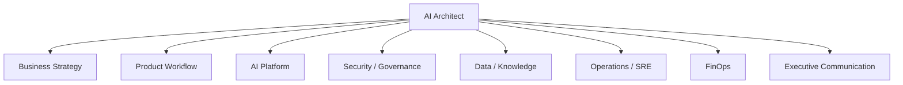
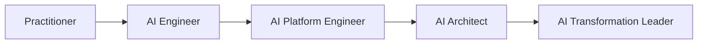
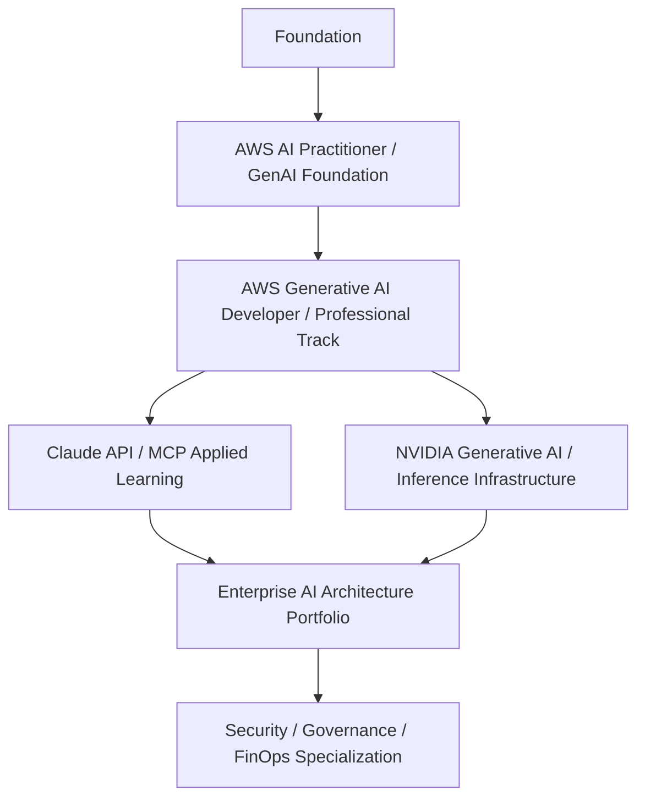
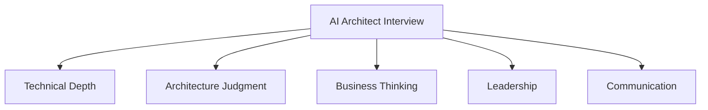
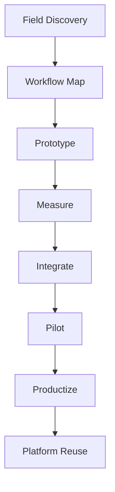
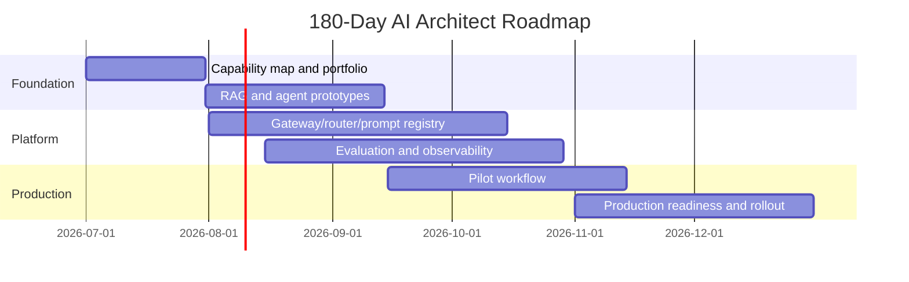
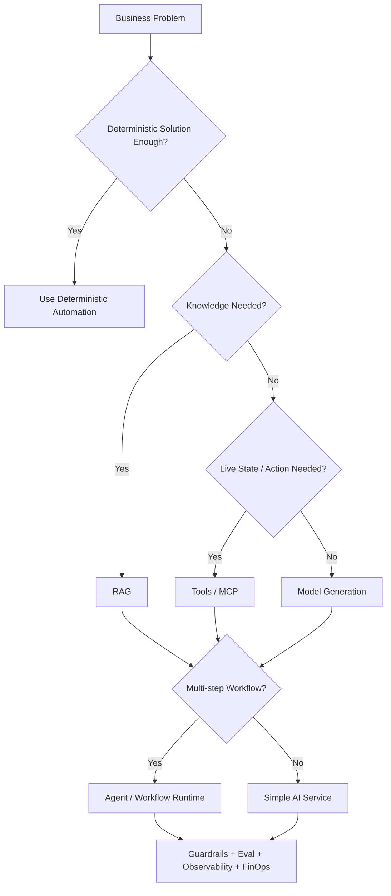
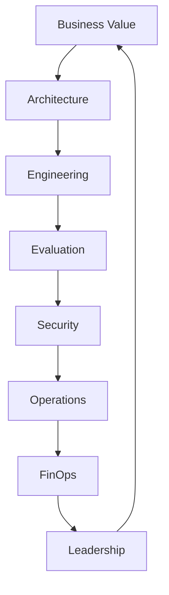

# Chapter 25 — AI Architect Career Roadmap and Final Playbook

**Book:** The AI Architect & Practitioner Bootcamp  
**Chapter Status:** Complete Draft  
**Version:** 0.1 — Final Synthesis  
**Author:** Pratik Desai  
**Primary Audience:** AI architects, senior engineers, engineering directors, enterprise architects, platform leaders, product-minded technologists, CTO-track practitioners, FDEs, consultants, and certification candidates

---

## Chapter Thesis

The AI architect's advantage is not knowing every model.

The AI architect's advantage is knowing how to turn AI capability into secure, scalable, measurable business systems.

Models will change. APIs will change. Vendor capabilities will change. Frameworks will change. Certifications will change. What remains durable is the architect's ability to reason from first principles:

- What business capability are we improving?
- What workflow is being changed?
- What information does the system need?
- What model capability is sufficient?
- What tools can the AI safely use?
- What human approval is required?
- What risk is acceptable?
- What cost is sustainable?
- What quality evidence exists?
- What platform controls are needed?
- What operating model will keep it alive?
- What executive outcome proves value?

The central thesis of this final chapter is:

> The modern AI architect is a systems leader who connects science, engineering, architecture, business value, and leadership into production AI outcomes.

This book started with a simple idea:

> Artificial Intelligence is not about building the smartest model. It is about solving the right business problem with the simplest architecture that delivers measurable value.

This chapter turns that idea into a career roadmap and final playbook.

---

## Learning Objectives

By the end of this chapter, you will be able to:

- Define the AI architect role across science, engineering, architecture, business, and leadership.
- Build a practitioner-to-architect career roadmap.
- Create a certification and study plan aligned to AWS, Claude/MCP, NVIDIA, enterprise architecture, security, and delivery.
- Build a GitHub portfolio that proves enterprise AI architecture capability.
- Prepare for AI architect, director, principal, FDE, consultant, and CTO-track interviews.
- Use architecture review checklists for RAG, agents, Bedrock, Claude, MCP, NVIDIA infrastructure, security, evaluation, observability, FinOps, and strategy.
- Communicate AI strategy to executives and boards.
- Design a 90-day, 180-day, and 1-year learning and delivery plan.
- Apply the final Pratik's Principles as a leadership operating system.
- Continue publishing, improving, and using this book as a living professional asset.

---

## Executive Summary

This final chapter is the career and leadership synthesis of the book.

An AI architect is not merely a prompt engineer, model user, cloud engineer, data scientist, or application developer. An AI architect is a production systems thinker who can design, explain, govern, and operate AI-enabled business workflows.

The AI architect must be able to connect:

- LLM fundamentals
- prompt and context design
- RAG and retrieval systems
- vector databases
- model selection and evaluation
- agentic AI
- LangGraph
- MCP
- Amazon Bedrock
- Claude
- NVIDIA infrastructure
- security and governance
- observability and operations
- FinOps
- delivery operating model
- executive strategy and ROI
- capstone architecture

The architect's job is to make AI useful, safe, measurable, and repeatable.

The executive takeaway:

> The AI architect is the bridge between model capability and business accountability.

---

## The Five-Lens Framework for the AI Architect



The best AI architects are strong enough in each lens to lead cross-functional decisions.

They do not need to be the deepest expert in every domain, but they must know enough to ask the right questions, identify weak assumptions, and design the system.

---

## 1. The AI Architect Role

### What the AI Architect Does

The AI architect:

- translates business problems into AI architecture
- selects patterns such as RAG, tools, agents, or deterministic automation
- defines model selection criteria
- designs context, retrieval, and tool boundaries
- defines evaluation strategy
- works with security on threat models
- works with platform teams on reusable capabilities
- works with product teams on workflows and UX
- works with FinOps on cost per successful workflow
- works with executives on ROI and risk
- ensures production readiness
- creates standards and reference architectures

### What the AI Architect Does Not Do

The AI architect does not:

- blindly chase new models
- use LLMs where deterministic rules solve the problem
- treat prompts as security boundaries
- build uncontrolled autonomous agents
- skip evaluation
- ignore cost
- ignore user adoption
- let every team build isolated AI wrappers
- confuse demos with production systems

### Role Diagram



---

## 2. Practitioner-to-Architect Roadmap

### Stage 1: AI Practitioner

Focus:

- prompts
- LLM APIs
- basic RAG
- embeddings
- Python prototypes
- simple evaluations

Outcome:

- can build useful demos and prototypes

### Stage 2: AI Engineer

Focus:

- production APIs
- RAG pipelines
- vector search
- tool use
- structured outputs
- testing
- deployment

Outcome:

- can build production AI services

### Stage 3: AI Platform Engineer

Focus:

- gateways
- model routing
- prompt registry
- evaluation services
- observability
- multi-tenancy
- cost controls
- security controls

Outcome:

- can build reusable AI platform capabilities

### Stage 4: AI Architect

Focus:

- enterprise patterns
- security/governance
- model portfolio
- business outcomes
- architecture reviews
- operating model
- ROI

Outcome:

- can design enterprise AI systems and guide teams

### Stage 5: AI Transformation Leader

Focus:

- strategy
- portfolio governance
- executive communication
- platform investment
- organizational change
- vendor strategy
- board narrative

Outcome:

- can lead enterprise AI transformation



---

## 3. Core Skill Matrix

| Skill Area | Practitioner | Architect | Leader |
|---|---|---|---|
| LLM fundamentals | explain basics | select capability fit | guide investment |
| prompt design | write prompts | govern prompt systems | set standards |
| RAG | build prototype | design managed/self-managed RAG | fund knowledge strategy |
| agents | build simple agents | design bounded workflows | define risk appetite |
| MCP/tools | call tools | design tool gateway | approve capability exposure |
| Bedrock/Claude/NVIDIA | use services | design portfolio | define vendor strategy |
| evaluation | run tests | define quality system | require evidence |
| security | follow controls | design threat model | govern risk |
| observability | log outputs | define trace schema | monitor trust |
| FinOps | estimate cost | optimize architecture | manage ROI |
| operating model | participate | define ownership | lead transformation |

---

## 4. Certification Roadmap

Certifications are checkpoints, not the destination.

They create structure, external validation, and vocabulary. They do not replace hands-on architecture work.

### Recommended Certification Sequence



### Study Blocks

| Block | Focus |
|---|---|
| LLM fundamentals | tokens, transformers, embeddings, limitations |
| RAG | retrieval, chunking, vector DBs, grounding |
| agents | tools, state, memory, approval |
| Bedrock | models, KBs, Agents, Guardrails, Evaluations |
| Claude/MCP | messages, tool use, context, MCP |
| NVIDIA | inference, serving, GPUs, batching, optimization |
| Security | prompt injection, RAG security, tool risk |
| Evaluation | golden datasets, judges, regression |
| FinOps | cost per workflow, routing, GPU utilization |
| Strategy | ROI, portfolio, operating model |

### Certification Principle

> Use certifications to structure learning. Use projects to prove capability.

---

## 5. GitHub Portfolio Strategy

A senior AI architect should publish proof of thinking.

Your GitHub portfolio should show:

- architecture diagrams
- README clarity
- working Python scaffolds
- realistic YAML configs
- evaluation datasets
- component tests
- security policies
- observability traces
- FinOps dashboards
- deployment notes
- executive briefs

### Portfolio Repository Structure

```text
ai-architect-bootcamp/
  README.md
  BOOK_STATE.md
  chapters/
    00-preface.md
    01-evolution-of-ai.md
    ...
    25-ai-architect-career-roadmap-and-final-playbook.md
  capstone/
    architecture/
    configs/
    src/
    tests/
    evals/
    dashboards/
    runbooks/
  labs/
    chapter-01/
    ...
    chapter-25/
  assets/
    diagrams/
    screenshots/
  docs/
    executive-briefs/
    interview-guides/
```

### Portfolio Signal

The best portfolio signal is not "I used AI."

The best signal is:

> I can design, test, govern, operate, and explain an AI system that solves a business problem.

---

## 6. The AI Architect GitHub README

A strong README should include:

- thesis
- target audience
- architecture diagram
- chapter roadmap
- capstone overview
- how to run labs
- certification alignment
- operating principles
- contribution model
- license
- status

### README Quality Checklist

- does it explain why the repo exists?
- does it show the architecture?
- does it include diagrams?
- does it show concrete labs?
- does it distinguish demos from production?
- does it show business outcomes?
- does it show security/eval/cost controls?
- does it show how to navigate?

---

## 7. Interview Preparation Framework

AI architect interviews usually test five dimensions.



### Technical Depth

Questions may cover:

- LLM limitations
- RAG pipeline
- vector search
- embeddings
- model selection
- agents
- tool use
- MCP
- Bedrock
- Claude
- NVIDIA inference
- evaluation

### Architecture Judgment

Questions may cover:

- build vs buy
- managed vs self-hosted
- RAG vs fine-tuning
- agent vs workflow
- model routing
- security controls
- multi-tenancy
- observability
- FinOps

### Business Thinking

Questions may cover:

- ROI
- adoption
- operating model
- business KPIs
- risk appetite
- executive communication

### Leadership

Questions may cover:

- team design
- stakeholder alignment
- platform strategy
- delivery model
- conflict resolution
- change management

### Communication

Questions may cover:

- explain AI to executives
- draw architecture live
- critique a bad design
- defend tradeoffs
- simplify complexity

---

## 8. Interview Answer Pattern

Use the **VASE** pattern.

- **Value:** what business outcome matters?
- **Architecture:** what system pattern solves it?
- **Safety:** what controls are required?
- **Evidence:** how do we measure success?

### Example

Question:

> How would you build an AI assistant for customer support?

Answer:

```text
Value: I would start with the business metric, such as reducing average handle time or improving first-contact resolution.

Architecture: I would use RAG over approved support policies, a model router, a prompt registry, and a tool gateway for read-only customer/account status.

Safety: I would enforce tenant permissions, PII masking, guardrails, and human approval for refunds or legal commitments.

Evidence: I would evaluate groundedness, citation support, support-draft acceptance, latency, cost per accepted response, and customer satisfaction.
```

### Principle

> Senior AI interviews reward structured judgment more than tool-name memorization.

---

## 8b. Model Answers for Key Architect Questions

The following model answers illustrate the VASE pattern in practice for the questions that appear most frequently in senior AI architect interviews.

---

**Q: Design an enterprise AI platform from scratch.**

> **Value:** I start by asking: which business workflows have the highest friction, volume, and knowledge-intensity? The platform exists to accelerate those workflows safely and repeatably — not to expose every model feature.
>
> **Architecture:** The platform has five reusable control planes: AI Gateway (all model calls, tenant policy, cost attribution), Prompt Registry (versioned, owned, evaluated), RAG Platform (permission-aware retrieval with knowledge owner SLAs), MCP/Tool Gateway (deterministic authorization, risk tiers, audit), and Evaluation Service (golden datasets, LLM-as-judge, release gates). Model routing selects the cheapest model that passes the quality, safety, latency, and governance gate for each task type.
>
> **Safety:** The critical design invariant: the model recommends, deterministic systems authorize. No tool call, no production change, no customer communication executes on model judgment alone. Role-based authorization at the tool gateway is code, not prompting. Guardrails run on input and output for regulated workflows.
>
> **Evidence:** Every release requires evaluation against a golden dataset with quality, safety, forbidden-action, and latency gates. Cost per successful workflow is tracked from day one. Production sampling feeds evaluation regression continuously.

---

**Q: When would you use LangGraph versus Bedrock Agents?**

> **Value:** Both orchestrate multi-step AI workflows. The question is whether the workflow needs custom state, complex routing, or external checkpointing.
>
> **Architecture:** I use LangGraph when I need: explicit TypedDict state that evolves through a graph, interrupt-before/after nodes for HITL, PostgresSaver for durable resumable workflows, conditional edges based on state content, and full observability at every node boundary. I use Bedrock Agents when: the workflow maps cleanly to action groups and knowledge bases, I want AWS-managed orchestration and don't need custom state management, and the team lacks capacity to maintain a LangGraph codebase.
>
> **Safety:** Both require the same tool authorization discipline: the orchestration layer is not the authorization layer. LangGraph gives me more explicit control over where authorization happens. Bedrock Agents delegates more to Lambda — I have to be careful about what the Lambda permits.
>
> **Evidence:** For the incident investigation agent, I chose LangGraph because we needed PostgresSaver for HITL durability (approval packets that survive server restarts), conditional routing based on risk tier, and node-level cost attribution. For simpler Q&A workflows over knowledge bases, Bedrock Agents was faster to deploy and maintain.

---

**Q: How do you design a multi-tenant RAG platform?**

> **Value:** The cost of getting multi-tenancy wrong is silent data leakage between tenants — a compliance failure that may not surface until a legal event.
>
> **Architecture:** Every document in the knowledge base carries a `tenant_id` metadata field plus a data classification level. Every retrieval query applies a mandatory server-side metadata filter before results are returned — the filter is not optional, not applied after retrieval, and not trusted to the model. Two patterns: separate knowledge bases per tenant (strongest isolation, higher operational cost) or shared knowledge base with metadata filtering (lower cost, requires strict ingestion governance). For regulated environments I prefer separate knowledge bases; for internal multi-team platforms I use shared with metadata filtering.
>
> **Safety:** Authorization must happen at the vector store query level, not in the application layer. If I retrieve everything and then filter, a bug in the filter code leaks data. The database-level filter is the security boundary.
>
> **Evidence:** My evaluation suite includes a cross-tenant test case: Tenant A's agent queries for Tenant B's documents. The expected result is zero documents returned and a clean denial in the audit log. This test runs on every release.

---

## 9. Architecture Review Checklist

### General AI System

- business KPI defined?
- deterministic alternative considered?
- model route justified?
- prompt versioned?
- context controlled?
- evaluation dataset created?
- security threat model completed?
- cost model created?
- observability defined?
- support model defined?

### RAG

- source owner?
- metadata?
- permissions?
- freshness?
- chunking strategy?
- retrieval metrics?
- citations?
- hallucination checks?
- no-result handling?

### Agent

- tool list?
- tool risk tiers?
- approval gates?
- stop conditions?
- traceability?
- evaluation?
- budget limits?
- fallback?

### Bedrock

- model access approved?
- Converse vs InvokeModel selected?
- Knowledge Bases used where appropriate?
- Agents used where managed orchestration fits?
- Guardrails configured?
- Evaluations run?
- CloudWatch/CloudTrail configured?
- IAM least privilege?

### Claude

- Messages API pattern?
- system prompt governed?
- tool use controlled?
- citations used where needed?
- prompt caching justified?
- extended thinking evaluated?
- structured output validated?

### NVIDIA

- workload volume justified?
- utilization target?
- batching strategy?
- GPU metrics?
- model serving stack?
- fallback?
- cost per successful workflow?

---

## 10. Executive Communication Playbook

Executives need clarity, not implementation detail.

### Executive AI Brief Format

```text
1. Business outcome
2. Why AI is appropriate
3. Architecture in one diagram
4. Risk controls
5. ROI model
6. Operating model
7. Investment needed
8. Decision requested
```

### What Executives Care About

- value
- risk
- cost
- speed
- accountability
- differentiation
- adoption
- vendor strategy
- governance
- what decision is needed

### What Not to Lead With

- transformer internals
- model benchmark trivia
- framework fan debates
- prompt tricks
- token mechanics
- vendor marketing terms

### Principle

> Explain architecture as business risk and business leverage.

---

## 11. Consulting and FDE Playbook

AI consultants and FDEs succeed when they discover value quickly and productize lessons.

### FDE Discovery Questions

- What workflow is painful?
- Who does the work today?
- What information do they need?
- What systems do they use?
- What decisions do they make?
- What actions are risky?
- What slows them down?
- What would success look like?
- What data is trusted?
- Who owns the process?

### FDE Delivery Loop



### FDE Principle

> The best FDE does not sell AI. The best FDE removes business friction with AI where appropriate.

---

## 12. 90-Day AI Architect Plan

### Days 1–30: Foundation and Inventory

Focus:

- read/review book chapters
- build capstone repo skeleton
- study LLM/RAG/agent fundamentals
- inventory AI use cases
- map current architecture
- identify top three business workflows

Deliverables:

- capability map
- use case backlog
- capstone architecture draft
- first RAG prototype
- evaluation dataset v0

### Days 31–60: Platform Patterns

Focus:

- AI gateway skeleton
- model routing
- prompt registry
- RAG platform
- tool gateway
- evaluation harness
- observability trace schema

Deliverables:

- gateway/router code
- RAG metadata standard
- tool registry
- eval gate
- trace schema
- cost model

### Days 61–90: Pilot and Executive Readout

Focus:

- pilot one workflow
- run evaluation
- capture user feedback
- measure cost
- produce executive brief
- define scale decision

Deliverables:

- pilot results
- ROI model
- security review
- production readiness checklist
- executive decision memo

---

## 13. 180-Day Roadmap



### 180-Day Outcomes

- one production-quality AI workflow
- reusable platform skeleton
- evaluation library
- architecture standards
- executive dashboard
- certification progress
- public GitHub portfolio

---

## 14. One-Year AI Architect Roadmap

### Quarter 1

- fundamentals
- first capstone
- first certification
- first executive architecture deck

### Quarter 2

- production pilot
- evaluation/observability/FinOps
- platform standards
- security/governance playbook

### Quarter 3

- multi-tenant platform
- advanced agents
- multimodal workflow
- NVIDIA/private inference study
- vendor strategy

### Quarter 4

- enterprise portfolio governance
- board narrative
- consulting/FDE playbook
- book publication polish
- conference/talk/article series

### One-Year Goal

> Be able to walk into any enterprise AI conversation and explain the business outcome, architecture, risk, cost, operating model, and scale path.

---

## 15. Personal Operating System for AI Architects

### Weekly

- study one technical topic
- improve one portfolio artifact
- review one architecture pattern
- write one executive summary
- run one lab/test

### Monthly

- publish one chapter or article
- build one reusable component
- update certification plan
- review market/vendor changes
- refresh interview stories

### Quarterly

- complete one capstone milestone
- produce one executive deck
- complete one certification or course
- give one talk/internal presentation
- update career narrative

### Principle

> Prolific consistency beats occasional intensity.

### Progress Tracker YAML

Make this concrete. A weekly YAML file prevents the planning-but-not-doing trap.

```yaml
# ai_architect_progress.yaml — update every Friday
week: "2026-W27"
target_role: "Senior AI Architect / Director of AI Engineering"

completed_this_week:
  - chapter: "09-langgraph"
    status: read_and_labs_complete
  - lab: "lab4-agent-workflow"
    deliverable: "incident_agent.py with PostgresSaver checkpointing"
  - story: "platform sprawl → gateway story"
    status: drafted
  - certification: "AWS Bedrock domain 2 practice set"
    score: "78% — retry next week"

planned_next_week:
  - chapter: "10-mcp"
  - lab: "lab1-mcp-server-skeleton"
  - story: "refine platform story with metrics"
  - certification: "AWS Bedrock domain 3"

monthly_targets:
  chapters_remaining: 4
  labs_complete: 12
  stories_in_bank: 2
  github_artifacts: 8
  certification_target: "AWS AI Practitioner by 2026-09-01"

blockers:
  - "need PostgreSQL instance for checkpoint lab — use local Docker"
  - "need golden dataset examples for evaluation lab"
```

### Book-to-Certification Chapter Mapping

Use this table to connect book chapters to AWS AI Professional exam domains and NVIDIA generative AI curriculum topics.

| Book Chapter | AWS AI Prof Domain | NVIDIA GenAI Topic | Claude/MCP Focus |
|---|---|---|---|
| 01–02 (Evolution, LLMs) | Domain 1: AI/ML Fundamentals | LLM fundamentals | — |
| 03 (Prompt Engineering) | Domain 2: GenAI Fundamentals | Prompt design | Claude system prompts |
| 04 (RAG) | Domain 3: Applications | RAG architecture | Citations |
| 05 (Vector DBs) | Domain 3: Applications | Embedding and retrieval | — |
| 06 (Model Selection) | Domain 2: GenAI Fundamentals | Model selection | Model tiers |
| 07–09 (Agents, LangGraph) | Domain 3: Applications | Agentic AI | Tool use |
| 10 (MCP) | Domain 3: Applications | Tool integration | MCP servers |
| 11–14 (Bedrock stack) | Domain 4: AWS Services | — | Claude on Bedrock |
| 15 (Evaluation) | Domain 5: Responsible AI | Model evaluation | LLM-as-judge |
| 16 (Claude Architecture) | — | — | Messages API, caching |
| 17 (NVIDIA) | — | NIM, Triton, TensorRT-LLM | Private inference |
| 18 (Enterprise Patterns) | Domain 3 + 4: Apps + Services | Platform patterns | Gateway patterns |
| 19 (Security) | Domain 5: Responsible AI | Security | Guardrails |
| 20 (Observability) | Domain 4: AWS Services | Monitoring | Traces |
| 21 (FinOps) | Domain 4: AWS Services | Cost optimization | Cost per workflow |
| 22–23 (Operating + Strategy) | Domain 5: Responsible AI | — | — |
| 24 (Capstone) | All domains | All topics | Full stack |
| 25 (Career) | — | — | — |

---

## 16. AI Architect Story Bank

Senior interviews and executive conversations require stories.

Build stories around:

- platform modernization
- cost reduction
- AI evaluation
- RAG deployment
- agent workflow
- security/governance
- incident response
- multi-team leadership
- vendor decision
- executive influence
- failed pilot and lessons
- ROI realization

### STAR+Architecture Format

```text
Situation: business or technical context
Task: what needed to change
Action: architecture and leadership decisions
Result: measurable outcome
Architecture: pattern, tradeoff, controls, lessons
```

### Complete Example Stories

**Story 1: Reducing Incident Triage Time with Agentic AI**

*Situation:* We operated a connected device platform across dozens of countries. Our L2/L3 SRE team averaged 45 minutes from alert detection to root cause hypothesis for firmware-related heartbeat failures. The delay came from manually querying three separate systems — telemetry, runbooks, and incident history — before any analysis could begin.

*Task:* Design and deploy an AI triage assistant that reduced investigation start time while maintaining PCI-DSS compliance and ensuring no autonomous production actions.

*Action:* I designed a LangGraph-based incident agent with four evidence-gathering nodes (classify intent → retrieve runbooks via RAG → query telemetry via MCP tool → assess customer impact) followed by a recommendation generation node. Tool authorization used deterministic role-based policy — the model could recommend, not execute. High-risk actions (firmware rollback) required a structured approval packet reviewed by a release engineering manager. The agent ran on Amazon Bedrock with private inference for restricted telemetry data. I defined the golden dataset, ran the evaluation gate, and defined the HITL interrupt pattern before any production traffic was allowed.

*Result:* Mean time from alert to actionable triage recommendation dropped from 45 minutes to under 8 minutes. SLA for L4 escalations improved from 5 days to 5 hours. Zero unauthorized production actions in 18 months of operation. Monthly AI cost per incident investigation: under $0.50.

*Architecture:* LangGraph StateGraph with PostgresSaver checkpointing for HITL durability. MCP tool gateway with risk tiers 1–5. Read-only telemetry at tier 2 (no approval), firmware rollback at tier 5 (approval required, fail-closed). RAG over runbooks with knowledge owner SLAs. Evaluation suite with LLM-as-judge + forbidden action tests. The critical design insight: tool authorization is deterministic code, not model judgment. The model proposes; the system authorizes.

---

**Story 2: Building a Shared AI Platform to Stop Team Sprawl**

*Situation:* Within six months of early AI adoption, four product teams had independently integrated AI: each had their own Bedrock credentials, their own prompt formats, their own security posture, and no shared cost visibility. A security audit flagged two workflows with material gaps. The monthly Bedrock cost was visible only at the AWS invoice level.

*Task:* Architect a shared AI platform that brought all production AI workflows under governance without becoming a bottleneck for delivery teams.

*Action:* I designed the AI gateway as the single controlled entry point: all model calls, all tenant metadata, all cost attribution. The prompt registry versioned all prompts with owner approval workflow. The evaluation service provided a shared golden dataset runner. I implemented risk-tiered governance — tier 1/2 self-service with checklist, tier 3 48-hour architecture review using pre-approved patterns, tier 4/5 full security and legal review. Platform team treated product teams as customers: developer SDK, office hours, monthly adoption dashboard.

*Result:* Four separate model client implementations consolidated into one gateway. Security review cycle time from 6 weeks to 48 hours for tier-3 workflows. Platform reuse rate reached 87% of new workflows using existing patterns rather than custom builds. Monthly cost visibility: per tenant, per workflow, per model, per prompt version. One engineer prevented $34K/month in wasted retry cost by tracing it through the cost dashboard within 48 hours of the issue appearing.

*Architecture:* FastAPI AI gateway with tenant middleware, model router with YAML policy, prompt registry with YAML registry and Python renderer, shared evaluation service with LLM-as-judge and release gate. AWS Bedrock as primary inference, PostgresSaver for agent state. The central design insight: a platform is only valuable when teams reuse it. We measured adoption rate as a first-class platform KPI.

### Example Story Topics (Your Stories)

- reducing device platform cost
- improving incident response
- building managed services
- integrating telemetry and AI
- designing AI gateway
- governing tool use
- moving from demo to product
- CertifyIQ evaluation automation
- SupportIQ support draft deployment
- DeviceIQ multimodal field inspection

---

## 17. Final Architecture Principles

### Enterprise AI Decision Flow



### Architecture Rule

> Start with the simplest architecture that solves the business problem safely.

---

## 18. Final Pratik's Principles

1. Technology is a means, not the mission.
2. Complexity is a liability unless it creates measurable business value.
3. Start with deterministic systems. Add AI only where uncertainty creates value.
4. Every AI system should have an off switch.
5. Humans should remain accountable for high-impact decisions.
6. The cheapest model that solves the business problem is usually the correct model.
7. A 90% accurate model deployed safely today may create more value than a 99% accurate model delivered next year.
8. AI is an amplifier, not a strategy.
9. Retrieval quality is AI quality.
10. Do not use prompts as security boundaries.
11. Use RAG for knowledge and tools for live state.
12. If it cannot be measured, it cannot be managed.
13. Production AI is a system, not a model.
14. Trust is an architecture feature.
15. ROI is the forcing function that separates useful AI from demo AI.
16. Agents recommend; systems authorize.
17. Context is architecture.
18. Evaluation is the quality system for probabilistic software.
19. Observability is the operating system for trust.
20. Cost per successful workflow beats cost per token.
21. Governance should accelerate safe delivery, not block it.
22. A platform is valuable only when teams reuse it.
23. Pilots are not products.
24. Strategy is choosing what not to build.
25. The AI architect's job is to turn capability into accountable value.

---

## 19. Final Book Synthesis

### What We Built

This book built a complete enterprise AI architecture journey:

- foundations
- LLMs
- prompts
- RAG
- vector search
- model selection
- agents
- LangGraph
- MCP
- Bedrock
- Knowledge Bases
- Agents
- Guardrails
- evaluation
- Claude
- NVIDIA infrastructure
- architecture patterns
- security
- observability
- FinOps
- operating model
- strategy
- capstone

### What It Means

Enterprise AI is not one skill.

It is a system of skills.

The AI architect must connect:



### Final Lesson

> The future belongs to AI architects who can make powerful systems useful, safe, measurable, and trusted.

---

## 20. Production Readiness Checklist for Your Career

To be ready for senior AI architect roles, build evidence for:

- [ ] LLM fundamentals
- [ ] RAG architecture
- [ ] vector database design
- [ ] model selection
- [ ] evaluation
- [ ] agent architecture
- [ ] LangGraph or equivalent orchestration
- [ ] MCP/tool integration
- [ ] Bedrock platform architecture
- [ ] Claude architecture
- [ ] NVIDIA/private inference understanding
- [ ] security/governance
- [ ] observability/operations
- [ ] FinOps
- [ ] operating model
- [ ] executive strategy
- [ ] capstone GitHub repo
- [ ] architecture diagrams
- [ ] Python scaffolds
- [ ] YAML configs
- [ ] component tests
- [ ] executive briefs
- [ ] interview story bank

---

## 21. Hands-On Labs with Scaffolding

### Lab 1: Career Roadmap

```text
labs/chapter-25-career-playbook/lab1-career-roadmap/
  roadmap.md
  90-day-plan.md
  180-day-plan.md
  one-year-plan.md
```

Tasks:

1. Define your target role.
2. Identify skill gaps.
3. Build 90-day, 180-day, and 1-year plan.
4. Define weekly operating cadence.

---

### Lab 2: Certification Plan

```text
labs/chapter-25-career-playbook/lab2-certification-plan/
  certification-roadmap.md
  study-plan.yaml
  weekly-schedule.md
```

Tasks:

1. Choose certification sequence.
2. Allocate study hours.
3. Map book chapters to exam topics.
4. Define practice projects.

---

### Lab 3: GitHub Portfolio

```text
labs/chapter-25-career-playbook/lab3-github-portfolio/
  README.md
  portfolio-index.md
  capstone-summary.md
```

Tasks:

1. Create portfolio README.
2. Link chapters and labs.
3. Add capstone architecture.
4. Add executive summary.

---

### Lab 4: Interview Story Bank

```text
labs/chapter-25-career-playbook/lab4-interview-stories/
  story-bank.md
  star-architecture-template.md
  executive-answers.md
```

Tasks:

1. Write five AI architecture stories.
2. Use STAR+Architecture.
3. Add metrics.
4. Add tradeoffs and lessons.

---

### Lab 5: Architecture Review Practice

```text
labs/chapter-25-career-playbook/lab5-architecture-review/
  bad-architecture.md
  review-notes.md
  improved-architecture.md
```

Tasks:

1. Review a flawed AI design.
2. Identify risks.
3. Redesign with gateway, RAG, tools, eval, security, FinOps.
4. Write CTO recommendation.

---

### Lab 6: Final Executive Brief

```text
labs/chapter-25-career-playbook/lab6-final-executive-brief/
  executive-brief.md
  board-narrative.md
  one-page-architecture.md
```

Tasks:

1. Summarize the capstone for executives.
2. Define ROI.
3. Define risk controls.
4. Make a scale/stop recommendation.

---

## 22. Interview Questions

### Engineering-Level Questions

1. Explain RAG in production terms.
2. How do you evaluate an LLM workflow?
3. What is MCP?
4. How does tool authorization work?
5. How do you design prompt injection defenses?
6. What should an AI trace include?
7. How do you calculate cost per successful workflow?
8. When would you use Bedrock Knowledge Bases?
9. When would you use LangGraph?
10. When would you self-host inference?

### Architect-Level Questions

1. Design an enterprise AI platform from scratch.
2. Design a secure agentic workflow.
3. Compare Bedrock Agents and LangGraph.
4. Compare Claude direct API, Claude on Bedrock, and private inference.
5. Design a multi-tenant RAG platform.
6. Design an AI gateway.
7. Design an evaluation service.
8. Design observability for an agent.
9. Design FinOps for AI.
10. Design the Enterprise Agentic Operations Platform.

### Director / VP / CTO-Level Questions

1. What is our AI strategy?
2. Which use cases should we fund?
3. How do we prove ROI?
4. How do we prevent AI sprawl?
5. What platform capabilities should be centralized?
6. How do we manage vendor lock-in?
7. How do we make governance fast?
8. How do we scale safely?
9. What would make you stop an AI project?
10. Why should we hire you to lead enterprise AI architecture?

---

## 23. Certification Mapping

### AWS AI / Generative AI Preparation

This final chapter consolidates:

- Bedrock platform design
- model selection
- Knowledge Bases
- Agents
- Guardrails
- Evaluations
- security
- observability
- cost optimization
- production operations

### Claude / MCP Preparation

This final chapter consolidates:

- Claude architecture
- Messages API mental model
- tool use
- citations
- prompt caching
- MCP servers
- tool governance
- evaluation and observability

### NVIDIA Generative AI Preparation

This final chapter consolidates:

- inference architecture
- NIM/Triton/TensorRT-LLM concepts
- GPU utilization
- multimodal workloads
- private inference
- cost/performance tradeoffs

### Enterprise Architecture Preparation

This final chapter consolidates:

- platform architecture
- operating model
- security governance
- FinOps
- portfolio strategy
- executive communication

---

## 24. Chapter Exercises

### Exercise 1

Write your AI architect career narrative in 500 words.

Include:

- background
- differentiating experience
- AI platform thesis
- capstone project
- target role

### Exercise 2

Create your certification and portfolio roadmap.

Include:

- weekly study hours
- certification sequence
- GitHub deliverables
- capstone milestones

### Exercise 3

Prepare a 30-minute AI architect interview presentation.

Include:

- executive thesis
- architecture diagram
- capstone workflow
- security/evaluation/FinOps
- ROI
- lessons learned

### Exercise 4

Create a CTO-level answer to:

> Why should we build an AI platform instead of letting each team use whatever model they want?

### Exercise 5

Create a final architecture review checklist for production AI systems.

---

## 25. Key Terms

| Term | Meaning |
|---|---|
| AI Architect | Systems leader who designs production AI business systems |
| Career Roadmap | Plan for developing skills, projects, certifications, and leadership |
| Portfolio | Public or internal proof of architecture capability |
| Story Bank | Interview stories with measurable outcomes |
| VASE | Value, Architecture, Safety, Evidence answer pattern |
| STAR+Architecture | Interview story format with architecture detail |
| Executive Brief | Concise business-focused architecture communication |
| Certification Roadmap | Structured learning path using external credentials |
| Capstone | Integrated project proving end-to-end capability |
| Operating System | Weekly/monthly/quarterly cadence for growth |
| Strategy | Disciplined choice of where AI creates advantage |
| Production AI | Governed, evaluated, observable, cost-aware AI system |
| AI Platform | Reusable control planes and services for AI workflows |

---

## 26. One-Page Executive Brief

The AI architect role is becoming one of the most important roles in enterprise technology.

Models are powerful, but enterprises need leaders who can turn model capability into secure, scalable, measurable business systems.

The AI architect connects:

- business strategy
- AI capability
- platform architecture
- security and governance
- evaluation
- observability
- FinOps
- operating model
- executive communication

The architect's core question is:

> How do we use AI to improve a business workflow safely, measurably, and sustainably?

This book provides the roadmap:

- understand AI foundations
- design RAG and retrieval
- select/evaluate models
- build agents safely
- integrate tools through MCP
- use Bedrock, Claude, and NVIDIA appropriately
- design enterprise AI platforms
- secure, observe, and optimize AI systems
- build operating models and executive strategy
- prove capability through a capstone

The executive takeaway:

> The AI architect is the person who turns AI from a vendor capability into enterprise advantage.

---

## 27. Final Closing

This book is not the end of the journey.

It is the starting platform.

And I want to be specific about what built it.

The patterns in this book did not come from reading whitepapers. They came from six years of building, operating, and learning from production systems under real operational pressure: SupportIQ reducing average handle time from 30 minutes to under 5 minutes, TriageIQ cutting SLA from 5 days to 5 hours, CertifyIQ maintaining near-zero P1/P2 incidents over six years of continuous deployment, DeviceIQ turning scattered device telemetry into actionable operations intelligence, and Managed Services Automations making enterprise reporting a platform capability rather than a monthly manual effort.

Every chapter principle, every Pratik's Principle, every architecture pattern has a production scar behind it. The prompt injection lesson came from a real attack vector through retrieved documents. The EWMA cost drift detection came from a real agent loop that silently multiplied cost over 72 hours. The PostgresSaver HITL interrupt came from a real firmware rollback recommendation that had to survive a server restart before the approval arrived. The knowledge ownership lesson came from retrieving stale runbooks for products that were decommissioned three years earlier.

The technology will continue to change. New models will arrive. New frameworks will emerge. The specific APIs in this book will evolve — many already have since this writing.

What will not change is the set of questions that define good architecture:

- What business problem are we solving?
- What is the simplest safe architecture?
- What evidence proves quality?
- What risk remains?
- What cost is sustainable?
- What human accountability is required?
- What operating model will sustain it?
- What value did we create?

If you can answer those questions consistently — with production numbers, not benchmarks; with named owners, not org charts; with measured outcomes, not projected ones — you are not just using AI.

You are architecting the future of enterprise systems.

Build things. Break them safely. Fix them. Document what you learned. Publish it.

That is the AI architect's operating system.

---

## 28. Suggested Git Commit

```bash
mkdir -p chapters
cp 25-ai-architect-career-roadmap-and-final-playbook-reworked.md chapters/25-ai-architect-career-roadmap-and-final-playbook.md
cp BOOK_STATE-updated-through-chapter-25.md BOOK_STATE.md

git add chapters/25-ai-architect-career-roadmap-and-final-playbook.md BOOK_STATE.md
git commit -m "Add Chapter 25: AI Architect Career Roadmap and Final Playbook"
git push origin main
```
